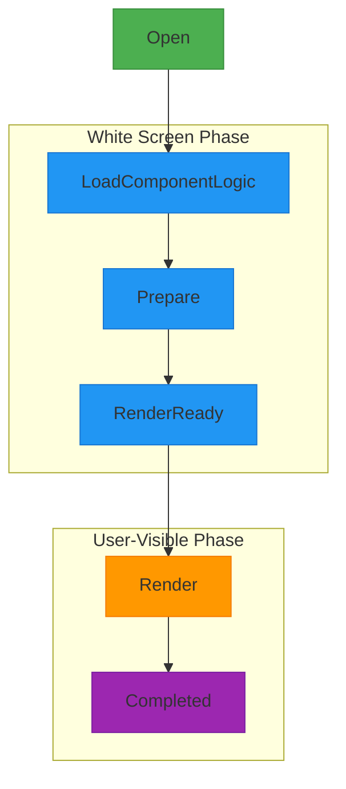
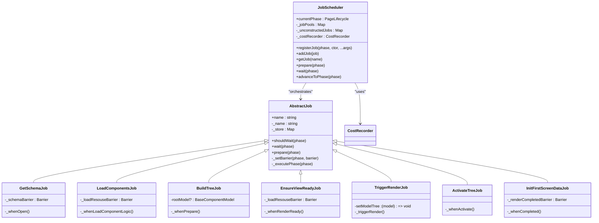
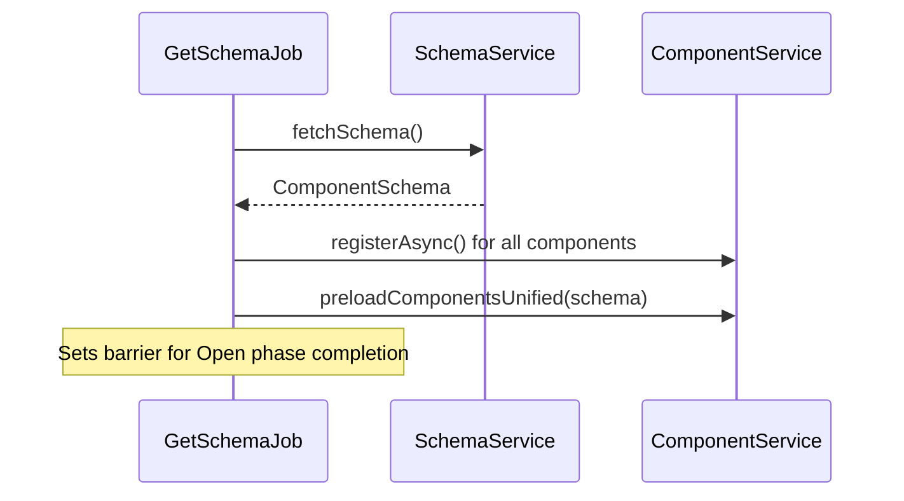
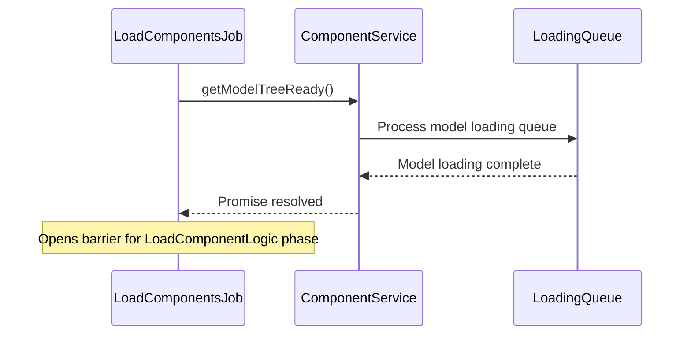
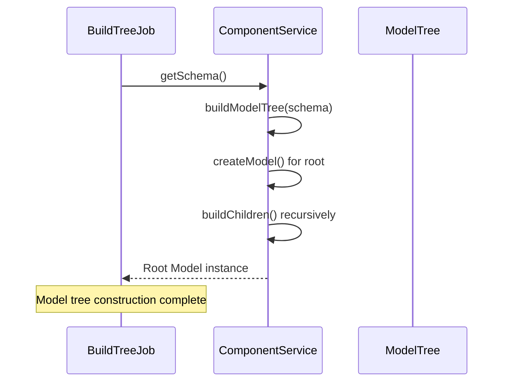
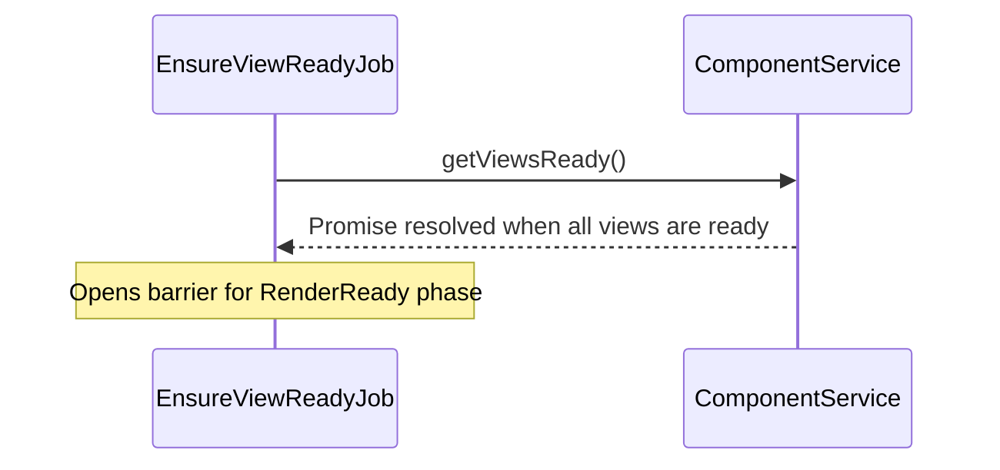
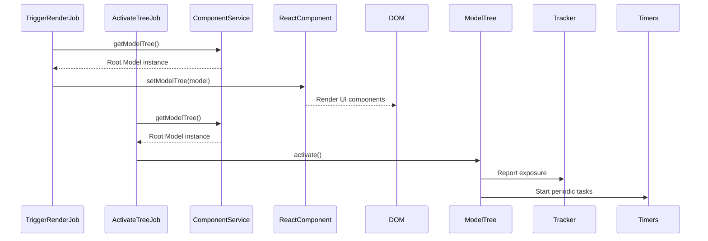
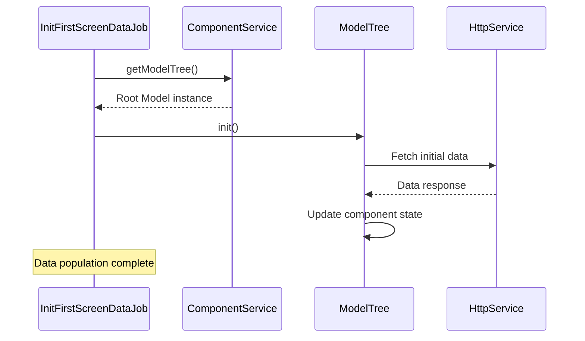
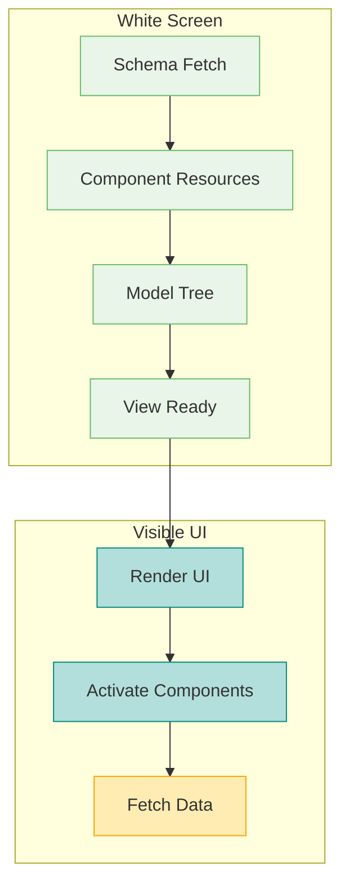

# Job Execution Flow

<cite>
**Referenced Files in This Document**   
- [get-schema-job.ts](file://packages/h5-builder/src/jobs/get-schema-job.ts)
- [load-components-job.ts](file://packages/h5-builder/src/jobs/load-components-job.ts)
- [build-tree-job.ts](file://packages/h5-builder/src/jobs/build-tree-job.ts)
- [ensure-view-ready.ts](file://packages/h5-builder/src/jobs/ensure-view-ready.ts)
- [trigger-render-job.ts](file://packages/h5-builder/src/jobs/trigger-render-job.ts)
- [activate-tree-job.ts](file://packages/h5-builder/src/jobs/activate-tree-job.ts)
- [init-first-screen-data-job.ts](file://packages/h5-builder/src/jobs/init-first-screen-data-job.ts)
- [lifecycle.ts](file://packages/h5-builder/src/jobs/lifecycle.ts)
- [job-scheduler.ts](file://packages/h5-builder/src/bedrock/launch/job-scheduler.ts)
- [abstract-job.ts](file://packages/h5-builder/src/bedrock/launch/abstract-job.ts)
- [component.service.ts](file://packages/h5-builder/src/services/component.service.ts)
- [README.md](file://packages/h5-builder/README.md)
</cite>

## Table of Contents
1. [Introduction](#introduction)
2. [Job Lifecycle Stages](#job-lifecycle-stages)
3. [JobScheduler Architecture](#jobscheduler-architecture)
4. [Job Execution Flow](#job-execution-flow)
5. [Progressive Rendering Strategy](#progressive-rendering-strategy)
6. [Error Handling and Resilience](#error-handling-and-resilience)
7. [Extending the Job Flow](#extending-the-job-flow)
8. [Performance Optimization](#performance-optimization)
9. [Conclusion](#conclusion)

## Introduction

The H5 Builder Framework implements a sophisticated job-based execution flow that orchestrates the progressive rendering of dynamic content. This architecture follows a well-defined sequence of stages from initialization to completion, ensuring optimal perceived performance and resource management. The framework uses a JobScheduler to coordinate discrete jobs that handle specific responsibilities in the page lifecycle, from schema acquisition to data fetching.

The execution flow is designed to minimize white screen time and provide a smooth user experience by breaking down the initialization process into manageable phases. Each job represents a distinct responsibility in the rendering pipeline, and the JobScheduler ensures proper sequencing and dependency management between these jobs.

**Section sources**
- [README.md](file://packages/h5-builder/README.md#L216-L231)
- [lifecycle.ts](file://packages/h5-builder/src/jobs/lifecycle.ts#L1-L17)

## Job Lifecycle Stages

The H5 Builder Framework defines six distinct lifecycle stages that represent the progression from page initialization to full interactivity:

1. **Open**: Schema acquisition phase where the framework fetches the initial component structure
2. **LoadComponentLogic**: Loading of Model and View resources for all components
3. **Prepare**: Building the Model Tree from the acquired schema
4. **RenderReady**: Ensuring all View resources are ready for rendering
5. **Render**: Activation of the component tree and exposure tracking
6. **Completed**: Initial data fetching for the first screen components

Each stage serves a specific purpose in the progressive rendering pipeline. The Open stage initiates the process by retrieving the schema that defines the page structure. The LoadComponentLogic stage asynchronously loads the JavaScript modules for both Model (business logic) and View (UI rendering) components. The Prepare stage constructs the hierarchical Model Tree based on the schema. RenderReady ensures all View components are available before rendering begins. The Render stage activates the component tree and triggers the actual DOM rendering. Finally, the Completed stage handles data population for the initially visible components.



**Diagram sources**
- [lifecycle.ts](file://packages/h5-builder/src/jobs/lifecycle.ts#L1-L17)
- [README.md](file://packages/h5-builder/README.md#L216-L231)

**Section sources**
- [lifecycle.ts](file://packages/h5-builder/src/jobs/lifecycle.ts#L1-L17)

## JobScheduler Architecture

The JobScheduler is the central orchestrator of the execution flow, responsible for managing job registration, sequencing, and execution. It implements a phase-based scheduling system where jobs are registered to execute at specific lifecycle phases. The scheduler maintains a registry of jobs and ensures they execute in the correct order while handling dependencies between stages.

Key architectural components of the JobScheduler include:

- **Job Registration**: Jobs are registered with a specific phase when they should be instantiated and executed
- **Phase Management**: The scheduler tracks the current lifecycle phase and advances through phases sequentially
- **Barrier Mechanism**: Uses Barrier objects to coordinate asynchronous operations and ensure phase completion
- **Cost Recording**: Tracks execution time for performance monitoring and optimization
- **Dependency Resolution**: Manages dependencies between jobs through the phase-based execution model

The JobScheduler follows the Command pattern, where each job represents a discrete unit of work. Jobs are registered with the scheduler and then executed when their designated phase is reached. The scheduler uses a prepare-wait-advance pattern to coordinate job execution, ensuring that all jobs in a phase have completed their preparation before advancing to the next phase.



**Diagram sources**
- [job-scheduler.ts](file://packages/h5-builder/src/bedrock/launch/job-scheduler.ts#L1-L123)
- [abstract-job.ts](file://packages/h5-builder/src/bedrock/launch/abstract-job.ts#L1-L46)

**Section sources**
- [job-scheduler.ts](file://packages/h5-builder/src/bedrock/launch/job-scheduler.ts#L1-L123)
- [abstract-job.ts](file://packages/h5-builder/src/bedrock/launch/abstract-job.ts#L1-L46)

## Job Execution Flow

The job execution flow follows a carefully orchestrated sequence that enables progressive rendering and optimal perceived performance. Each job is responsible for a specific phase of the initialization process, and the JobScheduler ensures proper sequencing and dependency management.

### Open Phase: Schema Acquisition

The GetSchemaJob initiates the execution flow during the Open phase by fetching the component schema from a remote source. This schema defines the structure of the page, including the hierarchy of components and their properties. The job uses the SchemaService to retrieve the schema and registers component loaders for all required components.



**Diagram sources**
- [get-schema-job.ts](file://packages/h5-builder/src/jobs/get-schema-job.ts#L1-L119)

**Section sources**
- [get-schema-job.ts](file://packages/h5-builder/src/jobs/get-schema-job.ts#L1-L119)

### LoadComponentLogic Phase: Resource Loading

The LoadComponentsJob executes during the LoadComponentLogic phase, responsible for loading the Model and View resources for all components. It leverages the ComponentService's preloadComponentsUnified method to concurrently load all required JavaScript modules using a unified queue with controlled concurrency.



**Diagram sources**
- [load-components-job.ts](file://packages/h5-builder/src/jobs/load-components-job.ts#L1-L61)
- [component.service.ts](file://packages/h5-builder/src/services/component.service.ts#L632-L695)

**Section sources**
- [load-components-job.ts](file://packages/h5-builder/src/jobs/load-components-job.ts#L1-L61)

### Prepare Phase: Model Tree Construction

The BuildTreeJob operates during the Prepare phase, constructing the hierarchical Model Tree from the acquired schema. It uses the ComponentService to recursively create Model instances based on the schema structure, establishing parent-child relationships between container and child components.



**Diagram sources**
- [build-tree-job.ts](file://packages/h5-builder/src/jobs/build-tree-job.ts#L1-L59)
- [component.service.ts](file://packages/h5-builder/src/services/component.service.ts#L135-L209)

**Section sources**
- [build-tree-job.ts](file://packages/h5-builder/src/jobs/build-tree-job.ts#L1-L59)

### RenderReady Phase: View Preparation

The EnsureViewReadyJob executes during the RenderReady phase, ensuring all View components are loaded and ready for rendering. It waits for the completion of View resource loading through the ComponentService's getViewsReady promise.



**Diagram sources**
- [ensure-view-ready.ts](file://packages/h5-builder/src/jobs/ensure-view-ready.ts#L1-L52)
- [component.service.ts](file://packages/h5-builder/src/services/component.service.ts#L713-L717)

**Section sources**
- [ensure-view-ready.ts](file://packages/h5-builder/src/jobs/ensure-view-ready.ts#L1-L52)

### Render Phase: Activation and Rendering

The TriggerRenderJob and ActivateTreeJob execute during the Render phase. The TriggerRenderJob is responsible for initiating the actual rendering by setting the Model Tree on the React component, while the ActivateTreeJob activates the component tree for interaction.



**Diagram sources**
- [trigger-render-job.ts](file://packages/h5-builder/src/jobs/trigger-render-job.ts#L1-L44)
- [activate-tree-job.ts](file://packages/h5-builder/src/jobs/activate-tree-job.ts#L1-L56)
- [component.service.ts](file://packages/h5-builder/src/services/component.service.ts#L730-L732)

**Section sources**
- [trigger-render-job.ts](file://packages/h5-builder/src/jobs/trigger-render-job.ts#L1-L44)
- [activate-tree-job.ts](file://packages/h5-builder/src/jobs/activate-tree-job.ts#L1-L56)

### Completed Phase: Data Fetching

The InitFirstScreenDataJob executes during the Completed phase, responsible for fetching the initial data required by the first screen components. It calls the init() method on the root Model, which propagates through the Model Tree to initialize all components with their respective data.



**Diagram sources**
- [init-first-screen-data-job.ts](file://packages/h5-builder/src/jobs/init-first-screen-data-job.ts#L1-L67)
- [component.service.ts](file://packages/h5-builder/src/services/component.service.ts#L724-L727)

**Section sources**
- [init-first-screen-data-job.ts](file://packages/h5-builder/src/jobs/init-first-screen-data-job.ts#L1-L67)

## Progressive Rendering Strategy

The H5 Builder Framework employs a progressive rendering strategy to optimize perceived performance and reduce white screen time. This approach breaks down the initialization process into distinct phases that can be executed incrementally, allowing the user interface to become visible and interactive as early as possible.

The strategy follows these key principles:

1. **Critical Path Optimization**: The framework prioritizes the execution of jobs that are essential for rendering the initial view, minimizing the time to first render.

2. **Resource Parallelization**: Model and View resources are loaded concurrently using a unified queue with controlled concurrency, maximizing network utilization while preventing resource contention.

3. **Lazy Initialization**: Component logic is loaded asynchronously and only when needed, reducing the initial payload size and improving startup performance.

4. **Staged Activation**: Components are activated only after they are fully rendered, ensuring that interaction and tracking occur at the appropriate time.

5. **Data Deferred Loading**: Initial data fetching occurs after the UI is rendered, allowing the visual elements to appear immediately while data loads in the background.

The framework implements a "render first, populate later" approach where the UI structure is displayed immediately upon Render phase completion, and data is populated during the Completed phase. This creates the perception of instant loading while the actual data retrieval happens asynchronously.



**Diagram sources**
- [README.md](file://packages/h5-builder/README.md#L216-L231)
- [component.service.ts](file://packages/h5-builder/src/services/component.service.ts#L632-L695)

**Section sources**
- [README.md](file://packages/h5-builder/README.md#L216-L231)

## Error Handling and Resilience

The H5 Builder Framework implements comprehensive error handling and resilience mechanisms to ensure robust operation even in the presence of failures. The job-based architecture provides natural boundaries for error isolation and recovery.

Key error handling features include:

1. **Component-Level Error Isolation**: Each component is wrapped in error handling that prevents failures in one component from affecting others. The framework uses ErrorPlaceholderModel to display fallback content when a component fails to initialize.

2. **Job-Level Error Containment**: Jobs are designed to handle errors in their specific domain without crashing the entire initialization process. For example, the BuildTreeJob catches exceptions during model creation and substitutes error placeholders.

3. **Retry Mechanisms**: Critical operations like schema fetching can be retried in case of transient failures, improving reliability in unstable network conditions.

4. **Graceful Degradation**: When non-critical components fail to load, the framework continues initialization with the available components, ensuring basic functionality remains intact.

5. **Comprehensive Logging**: The framework includes detailed logging at each phase, making it easier to diagnose and troubleshoot issues.

The ComponentService implements defensive programming practices, validating schemas and handling missing component types gracefully. When a component fails to load, the service creates an ErrorPlaceholderModel that displays a user-friendly message while maintaining the structural integrity of the component tree.

**Section sources**
- [component.service.ts](file://packages/h5-builder/src/services/component.service.ts#L155-L158)
- [component.service.ts](file://packages/h5-builder/src/services/component.service.ts#L201-L207)

## Extending the Job Flow

The job-based architecture is designed to be extensible, allowing developers to customize the execution flow for specific use cases. There are several approaches to extending the job flow:

### Adding Custom Jobs

Developers can create new jobs by extending the AbstractJob class and registering them with the JobScheduler at the appropriate lifecycle phase:

```typescript
class CustomJob extends AbstractJob<PageLifecycle> {
  protected _name = 'CustomJob';
  
  protected async _executePhase(phase: PageLifecycle) {
    switch (phase) {
      case PageLifecycle.Prepare:
        await this.handlePrepare();
        break;
      case PageLifecycle.Completed:
        await this.handleCompleted();
        break;
    }
  }
  
  private async handlePrepare() {
    // Custom preparation logic
  }
  
  private async handleCompleted() {
    // Custom completion logic
  }
}
```

### Modifying Job Execution Order

The JobScheduler allows for flexible job registration, enabling developers to control the execution order by registering jobs at specific phases. Jobs within the same phase execute concurrently, while jobs in subsequent phases wait for the completion of previous phases.

### Customizing Component Loading

The ComponentService provides several extension points for customizing component loading behavior:

- **registerAsync**: Register components with custom loading functions and metadata
- **addStrategy**: Add custom loading strategies for specialized scenarios
- **preloadComponentsUnified**: Override or extend the unified preloading mechanism

### Integration with External Systems

The job flow can be integrated with external systems such as A/B testing platforms, feature flag services, or analytics providers by creating specialized jobs that interact with these systems at appropriate lifecycle phases.

**Section sources**
- [abstract-job.ts](file://packages/h5-builder/src/bedrock/launch/abstract-job.ts#L1-L46)
- [job-scheduler.ts](file://packages/h5-builder/src/bedrock/launch/job-scheduler.ts#L36-L46)
- [component.service.ts](file://packages/h5-builder/src/services/component.service.ts#L286-L317)

## Performance Optimization

The H5 Builder Framework incorporates several performance optimization techniques to ensure fast initialization and smooth user experience:

### Concurrent Resource Loading

The framework uses a unified queue with controlled concurrency to load Model and View resources simultaneously. This approach maximizes network utilization while preventing resource contention:

- **MODEL_CONCURRENCY**: 5 concurrent Model loads
- **VIEW_CONCURRENCY**: 3 concurrent View loads  
- **TOTAL_CONCURRENCY**: 6 total concurrent operations

This balanced approach ensures that critical Model logic loads quickly while preventing the network from being overwhelmed.

### Priority-Based Loading

Components can be assigned different priority levels (critical, high, normal, low) that influence their loading order. Critical components are loaded immediately, while lower-priority components may be delayed to optimize perceived performance.

### Loading Delays and Staggering

The framework supports configurable delay ranges for component loading, allowing developers to stagger resource requests and prevent request storms. This is particularly useful for non-critical components that don't need to be available immediately.

### Resource Caching

The ComponentService implements caching for loaded components, ensuring that resources are only fetched once even if they are used multiple times in the component tree. This reduces network overhead and improves performance on subsequent page loads.

### Efficient Model Tree Construction

The buildModelTree operation is optimized to be synchronous once all Model resources are loaded, minimizing the time between resource availability and UI rendering.

**Section sources**
- [component.service.ts](file://packages/h5-builder/src/services/component.service.ts#L279-L281)
- [component.service.ts](file://packages/h5-builder/src/services/component.service.ts#L13-L26)
- [component.service.ts](file://packages/h5-builder/src/services/component.service.ts#L386-L393)

## Conclusion

The job-based execution flow in the H5 Builder Framework represents a sophisticated approach to progressive rendering and performance optimization. By breaking down the initialization process into discrete, manageable jobs, the framework achieves several key benefits:

1. **Improved Perceived Performance**: The staged approach minimizes white screen time by rendering the UI as early as possible.

2. **Better Resource Management**: Concurrent loading with controlled concurrency optimizes network utilization.

3. **Enhanced Error Resilience**: Component and job-level error handling prevents failures from cascading.

4. **Extensibility**: The modular architecture allows for easy customization and extension.

5. **Maintainability**: Clear separation of concerns makes the codebase easier to understand and modify.

The JobScheduler serves as the central orchestrator, ensuring that jobs execute in the correct sequence while managing dependencies and coordinating asynchronous operations. This architecture enables the framework to deliver a smooth user experience even with complex, data-driven interfaces.

By following the principles outlined in this documentation, developers can effectively leverage the job-based execution flow to build high-performance H5 applications with optimal loading characteristics and robust error handling.