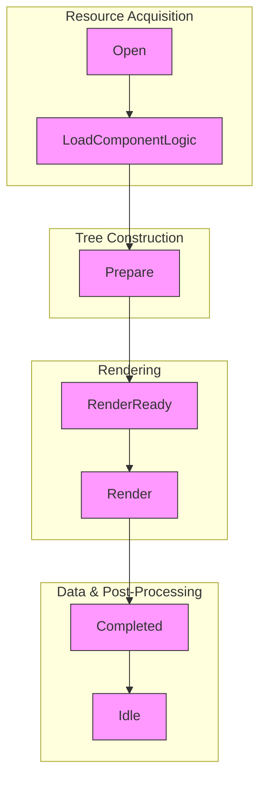
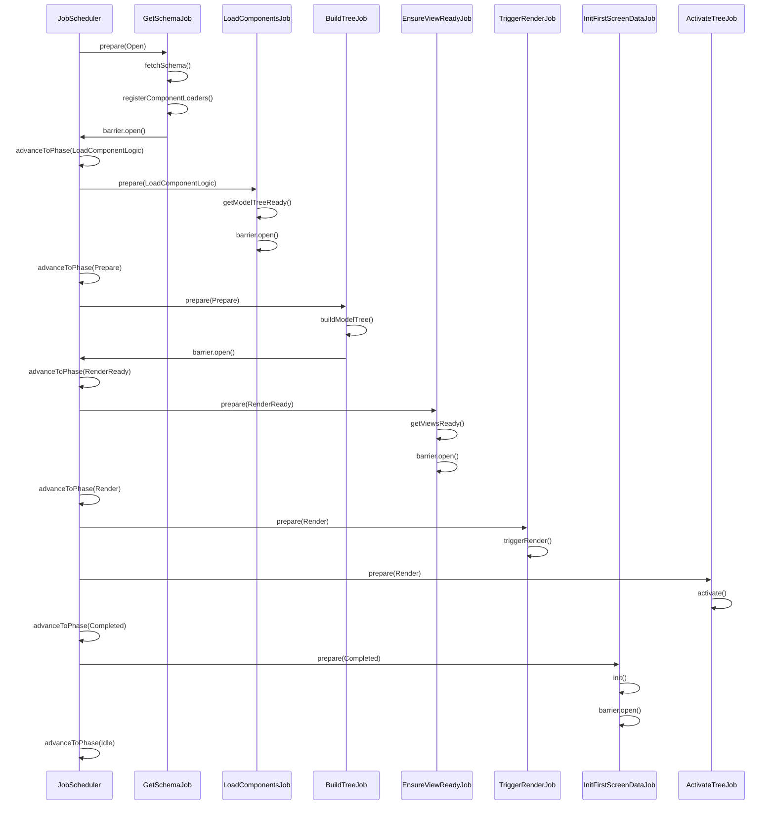
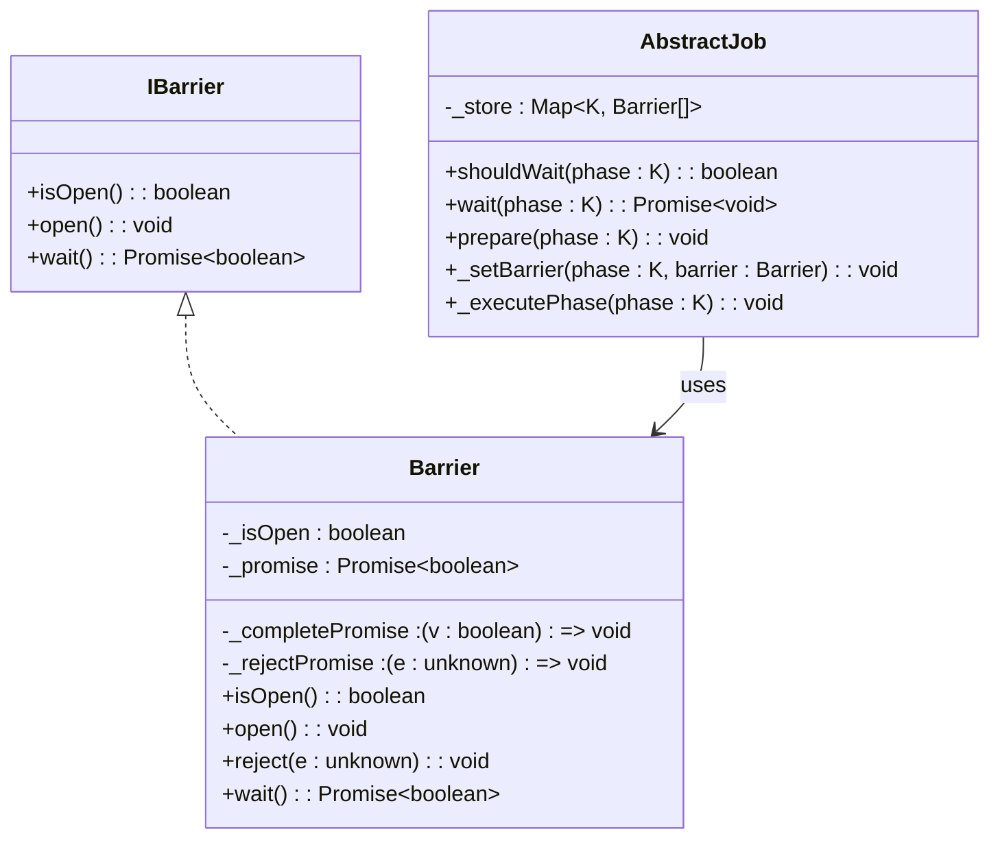
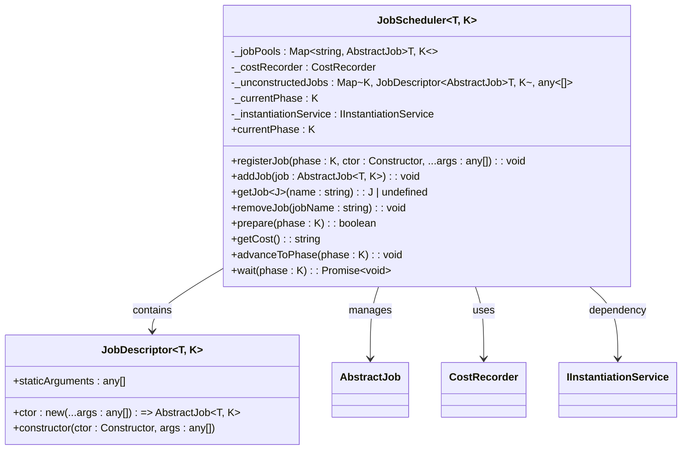
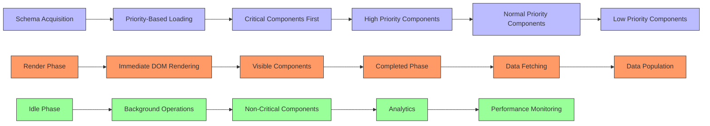
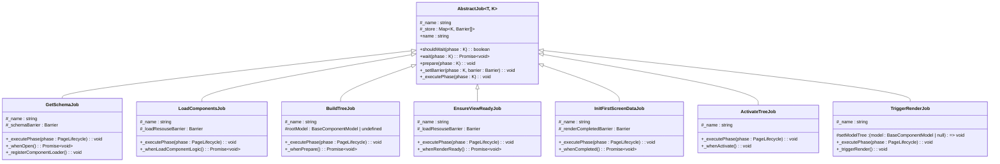
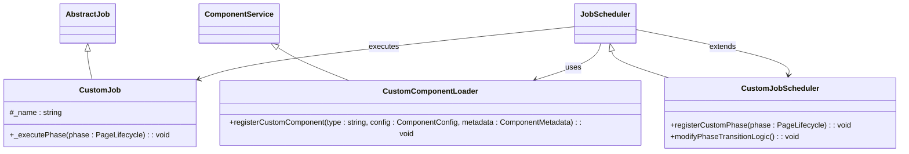

# Job Lifecycle Overview

<cite>
**Referenced Files in This Document**   
- [lifecycle.ts](file://packages/h5-builder/src/jobs/lifecycle.ts)
- [job-scheduler.ts](file://packages/h5-builder/src/bedrock/launch/job-scheduler.ts)
- [abstract-job.ts](file://packages/h5-builder/src/bedrock/launch/abstract-job.ts)
- [barrier.ts](file://packages/h5-builder/src/bedrock/async/barrier.ts)
- [get-schema-job.ts](file://packages/h5-builder/src/jobs/get-schema-job.ts)
- [load-components-job.ts](file://packages/h5-builder/src/jobs/load-components-job.ts)
- [build-tree-job.ts](file://packages/h5-builder/src/jobs/build-tree-job.ts)
- [ensure-view-ready.ts](file://packages/h5-builder/src/jobs/ensure-view-ready.ts)
- [init-first-screen-data-job.ts](file://packages/h5-builder/src/jobs/init-first-screen-data-job.ts)
- [activate-tree-job.ts](file://packages/h5-builder/src/jobs/activate-tree-job.ts)
- [trigger-render-job.ts](file://packages/h5-builder/src/jobs/trigger-render-job.ts)
- [component.service.ts](file://packages/h5-builder/src/services/component.service.ts)
- [schema.service.ts](file://packages/h5-builder/src/services/schema.service.ts)
- [phase-emitter.ts](file://packages/h5-builder/src/bedrock/event/phase-emitter.ts)
</cite>

## Table of Contents
1. [Introduction](#introduction)
2. [Job Lifecycle Phases](#job-lifecycle-phases)
3. [PageLifecycle Enum](#pagelifecycle-enum)
4. [Job Execution Flow](#job-execution-flow)
5. [Barrier Synchronization Mechanism](#barrier-synchronization-mechanism)
6. [Job Scheduler Architecture](#job-scheduler-architecture)
7. [Phase Transition Coordination](#phase-transition-coordination)
8. [Progressive Rendering Implementation](#progressive-rendering-implementation)
9. [Core Job Implementations](#core-job-implementations)
10. [Extensibility and Customization](#extensibility-and-customization)
11. [Performance Optimization Guidance](#performance-optimization-guidance)
12. [Conclusion](#conclusion)

## Introduction

The H5 Builder Framework implements a sophisticated job-based execution lifecycle that orchestrates the progressive rendering of dynamic pages through a series of well-defined phases. This architecture enables efficient resource loading, dependency management, and performance optimization by breaking down the page initialization process into discrete, coordinated stages. The framework uses a combination of job scheduling, barrier synchronization, and phase-based execution to ensure that components are loaded, constructed, and rendered in the optimal sequence. This document provides a comprehensive overview of the job lifecycle system, detailing the sequential phases, synchronization mechanisms, and architectural patterns that enable the framework's progressive rendering capabilities.

**Section sources**
- [lifecycle.ts](file://packages/h5-builder/src/jobs/lifecycle.ts)
- [job-scheduler.ts](file://packages/h5-builder/src/bedrock/launch/job-scheduler.ts)

## Job Lifecycle Phases

The H5 Builder Framework's job-based execution lifecycle consists of seven sequential phases that coordinate the progressive rendering of pages. Each phase represents a distinct stage in the page initialization process, from schema acquisition to post-processing. The phases are designed to enable optimal resource loading strategies, dependency resolution, and performance optimization through progressive rendering.

The lifecycle begins with the **Open** phase, where the framework acquires the page schema from remote sources and registers component loaders. This is followed by the **LoadComponentLogic** phase, which loads the Model and View resources for all components. The **Prepare** phase constructs the model tree while simultaneously ensuring view resources are ready. When both model and view resources are prepared, the **RenderReady** phase is reached, indicating that rendering can commence.

The **Render** phase activates the component tree and triggers the actual DOM rendering process. Following rendering, the **Completed** phase handles initial data fetching for the first screen components. Finally, the **Idle** phase manages post-processing tasks and background operations. This phased approach enables the framework to implement progressive rendering, where critical components are prioritized and rendered first, while non-essential elements are loaded in subsequent phases.



**Diagram sources**
- [lifecycle.ts](file://packages/h5-builder/src/jobs/lifecycle.ts)

**Section sources**
- [lifecycle.ts](file://packages/h5-builder/src/jobs/lifecycle.ts)

## PageLifecycle Enum

The PageLifecycle enum serves as the central control mechanism for the job-based execution flow in the H5 Builder Framework. This enumeration defines the seven distinct phases of the page initialization process, providing a type-safe way to manage phase transitions and coordinate job execution. Each enum value corresponds to a specific stage in the lifecycle, with descriptive strings that provide debugging information and traceability.

The enum plays a critical role in enabling progressive rendering by establishing a clear sequence of execution that can be selectively advanced based on resource availability and performance requirements. By using the PageLifecycle enum as a generic type parameter in the JobScheduler and AbstractJob classes, the framework ensures type safety and compile-time verification of phase transitions. This design prevents invalid state transitions and provides a clear contract for job implementations.

The enum values are carefully ordered to reflect the logical progression of page initialization, from schema acquisition (Open) through resource loading (LoadComponentLogic), tree construction (Prepare), rendering readiness (RenderReady), actual rendering (Render), data population (Completed), and finally post-processing (Idle). This explicit ordering enables the framework to implement dependency resolution and barrier synchronization across jobs, ensuring that each phase completes its necessary work before the system advances to the next stage.

```mermaid
classDiagram
class PageLifecycle {
+Open : "页面打开，正在拉取 schema 中... & 并注册组件资源加载器"
+LoadComponentLogic : "加载组件逻辑 Model JS 资源中..."
+Prepare : "构建模型树也就是逻辑树)、同时登台组件视图加载中..."
+RenderReady : "模型树和视图资源全部准备完成"
+Render : "启动渲染"
+Completed : "首屏视图数据填充中..."
+Idle : "处于空闲空闲空闲空闲空闲阶段"
}
```

**Diagram sources**
- [lifecycle.ts](file://packages/h5-builder/src/jobs/lifecycle.ts)

**Section sources**
- [lifecycle.ts](file://packages/h5-builder/src/jobs/lifecycle.ts)

## Job Execution Flow

The job execution flow in the H5 Builder Framework follows a coordinated sequence of phases, with specific jobs responsible for different aspects of page initialization. The execution begins with the GetSchemaJob, which runs during the Open phase to fetch the page schema and register component loaders. This job establishes the foundation for subsequent operations by acquiring the structural blueprint of the page.

Following schema acquisition, the LoadComponentsJob executes during the LoadComponentLogic phase to load all component Model and View resources. This is followed by the BuildTreeJob, which runs in the Prepare phase to construct the model tree from the schema. The EnsureViewReadyJob ensures that all view resources are available before rendering can proceed, marking the transition to the RenderReady phase.

The rendering process is initiated by the TriggerRenderJob during the Render phase, which activates the component tree and triggers React rendering. After rendering, the InitFirstScreenDataJob executes in the Completed phase to fetch initial data for visible components. Throughout this flow, the ActivateTreeJob coordinates component activation, including analytics tracking and timer initialization.



**Diagram sources**
- [get-schema-job.ts](file://packages/h5-builder/src/jobs/get-schema-job.ts)
- [load-components-job.ts](file://packages/h5-builder/src/jobs/load-components-job.ts)
- [build-tree-job.ts](file://packages/h5-builder/src/jobs/build-tree-job.ts)
- [ensure-view-ready.ts](file://packages/h5-builder/src/jobs/ensure-view-ready.ts)
- [trigger-render-job.ts](file://packages/h5-builder/src/jobs/trigger-render-job.ts)
- [init-first-screen-data-job.ts](file://packages/h5-builder/src/jobs/init-first-screen-data-job.ts)
- [activate-tree-job.ts](file://packages/h5-builder/src/jobs/activate-tree-job.ts)

**Section sources**
- [get-schema-job.ts](file://packages/h5-builder/src/jobs/get-schema-job.ts)
- [load-components-job.ts](file://packages/h5-builder/src/jobs/load-components-job.ts)
- [build-tree-job.ts](file://packages/h5-builder/src/jobs/build-tree-job.ts)
- [ensure-view-ready.ts](file://packages/h5-builder/src/jobs/ensure-view-ready.ts)
- [trigger-render-job.ts](file://packages/h5-builder/src/jobs/trigger-render-job.ts)
- [init-first-screen-data-job.ts](file://packages/h5-builder/src/jobs/init-first-screen-data-job.ts)
- [activate-tree-job.ts](file://packages/h5-builder/src/jobs/activate-tree-job.ts)

## Barrier Synchronization Mechanism

The barrier synchronization mechanism is a fundamental component of the H5 Builder Framework's job coordination system. Implemented through the Barrier class, this mechanism enables jobs to signal completion of asynchronous operations and coordinate phase transitions. Each barrier represents a synchronization point that prevents the job scheduler from advancing to the next phase until all registered barriers have been opened.

The Barrier class implements a promise-based interface with three key methods: isOpen(), open(), and wait(). When a job begins an asynchronous operation, it creates a barrier and registers it with the current phase using the _setBarrier method. Other components can then await the barrier's completion through the wait() method, which returns a promise that resolves when the barrier is opened.

This mechanism is particularly important for coordinating resource loading across multiple jobs. For example, the GetSchemaJob creates a barrier during the Open phase that prevents progression to LoadComponentLogic until the schema has been successfully fetched. Similarly, the LoadComponentsJob uses a barrier to ensure all component resources are loaded before advancing to the Prepare phase. The framework's use of barriers enables fine-grained control over phase transitions while maintaining a clean separation of concerns between jobs.



**Diagram sources**
- [barrier.ts](file://packages/h5-builder/src/bedrock/async/barrier.ts)
- [abstract-job.ts](file://packages/h5-builder/src/bedrock/launch/abstract-job.ts)

**Section sources**
- [barrier.ts](file://packages/h5-builder/src/bedrock/async/barrier.ts)
- [abstract-job.ts](file://packages/h5-builder/src/bedrock/launch/abstract-job.ts)

## Job Scheduler Architecture

The JobScheduler class serves as the central orchestrator of the job-based execution lifecycle in the H5 Builder Framework. This component manages the registration, preparation, and execution of jobs across the various lifecycle phases. The scheduler maintains two primary data structures: _jobPools, which stores instantiated jobs, and _unconstructedJobs, which holds job descriptors for deferred instantiation.

The scheduler's architecture follows a phase-driven execution model, where jobs are prepared and executed in response to phase transitions. The prepare() method processes jobs for a specific phase, instantiating any deferred jobs and executing their prepare() methods. Jobs that have asynchronous operations register barriers through the _setBarrier method, which the scheduler tracks in the job's _store map.

The wait() method is responsible for resolving asynchronous operations by awaiting all barriers registered for the current phase. Once all barriers are resolved, the scheduler advances to the next phase. This architecture enables the framework to implement progressive rendering by allowing critical jobs to complete quickly while non-critical operations can continue in the background.

The scheduler also incorporates performance monitoring through the CostRecorder class, which tracks the execution time of each job in each phase. This provides valuable insights for optimization and debugging, allowing developers to identify performance bottlenecks in the initialization process.



**Diagram sources**
- [job-scheduler.ts](file://packages/h5-builder/src/bedrock/launch/job-scheduler.ts)

**Section sources**
- [job-scheduler.ts](file://packages/h5-builder/src/bedrock/launch/job-scheduler.ts)

## Phase Transition Coordination

Phase transition coordination in the H5 Builder Framework is achieved through a combination of job scheduling, barrier synchronization, and event emission. The framework ensures that phase transitions occur only when all necessary conditions are met, preventing race conditions and ensuring proper initialization order.

The coordination process begins with the JobScheduler's prepare() method, which processes all jobs registered for the target phase. Jobs that have synchronous operations complete immediately, while those with asynchronous operations register barriers. The scheduler then calls wait() to await resolution of all barriers for the current phase.

The PhaseEmitter class plays a crucial role in phase transition coordination by providing event-driven notifications of phase changes. Components can subscribe to specific phase transitions using the when() or whenPhase() methods, enabling them to respond appropriately to lifecycle events. This event system supports both synchronous and asynchronous event handling, allowing for flexible coordination patterns.

The framework also implements a safety check in the advanceToPhase() method, which verifies that no jobs are still waiting before advancing to the next phase. This prevents premature phase transitions that could lead to initialization errors. The combination of these mechanisms ensures that phase transitions are both reliable and predictable, forming the foundation for the framework's progressive rendering capabilities.

```mermaid
flowchart TD
A[Target Phase] --> B{Prepare Phase}
B --> C[Instantiate Deferred Jobs]
C --> D[Execute Job prepare() Methods]
D --> E{Jobs Have Barriers?}
E --> |Yes| F[Register Barriers]
E --> |No| G[Continue]
F --> H[Wait for All Barriers]
G --> H
H --> I{All Barriers Resolved?}
I --> |Yes| J[Advance to Next Phase]
I --> |No| K[Continue Waiting]
J --> L[Emit Phase Change Event]
L --> M[Execute Next Phase]
style A fill:#f9f,stroke:#333
style B fill:#f96,stroke:#333
style C fill:#f96,stroke:#333
style D fill:#f96,stroke:#333
style E fill:#f96,stroke:#333
style F fill:#f96,stroke:#333
style G fill:#f96,stroke:#333
style H fill:#f96,stroke:#333
style I fill:#f96,stroke:#333
style J fill:#f96,stroke:#333
style K fill:#f96,stroke:#333
style L fill:#f96,stroke:#333
style M fill:#f96,stroke:#333
```

**Diagram sources**
- [job-scheduler.ts](file://packages/h5-builder/src/bedrock/launch/job-scheduler.ts)
- [phase-emitter.ts](file://packages/h5-builder/src/bedrock/event/phase-emitter.ts)

**Section sources**
- [job-scheduler.ts](file://packages/h5-builder/src/bedrock/launch/job-scheduler.ts)
- [phase-emitter.ts](file://packages/h5-builder/src/bedrock/event/phase-emitter.ts)

## Progressive Rendering Implementation

The H5 Builder Framework implements progressive rendering through a sophisticated combination of job prioritization, resource loading strategies, and phase-based execution. This approach enables the framework to deliver a responsive user experience by rendering critical content first while progressively enhancing the page with additional components and data.

The progressive rendering implementation begins with the schema acquisition phase, where the framework fetches the page structure and registers component loaders with priority metadata. Components are assigned priorities such as 'critical', 'high', 'normal', and 'low', which determine their loading order. The component loading system uses these priorities to optimize resource fetching, ensuring that essential components are loaded first.

During the LoadComponentLogic phase, the framework employs a unified queue with configurable concurrency limits to manage resource loading. The MODEL_CONCURRENCY and VIEW_CONCURRENCY constants control the number of simultaneous requests, preventing network overload while maximizing throughput. Components can also specify delay ranges, allowing for staggered loading that prevents jank and optimizes perceived performance.

The phased execution model enables true progressive rendering by decoupling rendering from data fetching. The Render phase triggers immediate DOM rendering with available components, while the Completed phase handles data population for visible elements. This separation allows the framework to render a functional UI quickly, with data filling in as it becomes available.



**Diagram sources**
- [get-schema-job.ts](file://packages/h5-builder/src/jobs/get-schema-job.ts)
- [component.service.ts](file://packages/h5-builder/src/services/component.service.ts)

**Section sources**
- [get-schema-job.ts](file://packages/h5-builder/src/jobs/get-schema-job.ts)
- [component.service.ts](file://packages/h5-builder/src/services/component.service.ts)

## Core Job Implementations

The H5 Builder Framework's job-based execution lifecycle is implemented through a series of specialized job classes, each responsible for a specific aspect of page initialization. These jobs follow the AbstractJob base class pattern, implementing the _executePhase method to handle operations for specific lifecycle phases.

The GetSchemaJob is responsible for acquiring the page schema during the Open phase. It fetches the schema from remote sources and registers component loaders with priority and dependency metadata. The LoadComponentsJob handles resource loading during the LoadComponentLogic phase, coordinating the concurrent loading of Model and View resources.

The BuildTreeJob constructs the model tree during the Prepare phase by recursively creating component models from the schema. The EnsureViewReadyJob verifies that all view resources are available before rendering, ensuring a smooth transition to the RenderReady phase. The TriggerRenderJob initiates the actual rendering process during the Render phase by updating the React component tree.

The InitFirstScreenDataJob handles initial data fetching during the Completed phase, populating visible components with their required data. Finally, the ActivateTreeJob coordinates component activation, including analytics tracking and timer initialization, ensuring that all components are fully functional after rendering.



**Diagram sources**
- [get-schema-job.ts](file://packages/h5-builder/src/jobs/get-schema-job.ts)
- [load-components-job.ts](file://packages/h5-builder/src/jobs/load-components-job.ts)
- [build-tree-job.ts](file://packages/h5-builder/src/jobs/build-tree-job.ts)
- [ensure-view-ready.ts](file://packages/h5-builder/src/jobs/ensure-view-ready.ts)
- [init-first-screen-data-job.ts](file://packages/h5-builder/src/jobs/init-first-screen-data-job.ts)
- [activate-tree-job.ts](file://packages/h5-builder/src/jobs/activate-tree-job.ts)
- [trigger-render-job.ts](file://packages/h5-builder/src/jobs/trigger-render-job.ts)

**Section sources**
- [get-schema-job.ts](file://packages/h5-builder/src/jobs/get-schema-job.ts)
- [load-components-job.ts](file://packages/h5-builder/src/jobs/load-components-job.ts)
- [build-tree-job.ts](file://packages/h5-builder/src/jobs/build-tree-job.ts)
- [ensure-view-ready.ts](file://packages/h5-builder/src/jobs/ensure-view-ready.ts)
- [init-first-screen-data-job.ts](file://packages/h5-builder/src/jobs/init-first-screen-data-job.ts)
- [activate-tree-job.ts](file://packages/h5-builder/src/jobs/activate-tree-job.ts)
- [trigger-render-job.ts](file://packages/h5-builder/src/jobs/trigger-render-job.ts)

## Extensibility and Customization

The H5 Builder Framework provides several extension points for customizing the job-based execution lifecycle to meet specific business requirements. The modular job architecture allows developers to create custom jobs that integrate seamlessly with the existing lifecycle phases.

To extend the framework, developers can create new job classes that extend the AbstractJob base class and implement the _executePhase method for specific lifecycle phases. These custom jobs can be registered with the JobScheduler using the registerJob method, allowing them to participate in the phase-based execution flow.

The component loading system also supports customization through the registerAsync method, which allows developers to specify custom loading strategies, priorities, and dependencies for components. The metadata parameter enables fine-grained control over loading behavior, including delay ranges and dependency relationships.

For more advanced customization, developers can extend the JobScheduler class itself to modify the phase transition logic or add new phases to the lifecycle. The framework's use of dependency injection through the IInstantiationService interface makes it easy to replace or enhance existing services with custom implementations.



**Diagram sources**
- [abstract-job.ts](file://packages/h5-builder/src/bedrock/launch/abstract-job.ts)
- [component.service.ts](file://packages/h5-builder/src/services/component.service.ts)
- [job-scheduler.ts](file://packages/h5-builder/src/bedrock/launch/job-scheduler.ts)

**Section sources**
- [abstract-job.ts](file://packages/h5-builder/src/bedrock/launch/abstract-job.ts)
- [component.service.ts](file://packages/h5-builder/src/services/component.service.ts)
- [job-scheduler.ts](file://packages/h5-builder/src/bedrock/launch/job-scheduler.ts)

## Performance Optimization Guidance

The H5 Builder Framework provides several mechanisms for optimizing the performance of the job-based execution lifecycle. These optimizations focus on reducing initialization time, minimizing network requests, and improving perceived performance through progressive rendering.

One key optimization strategy is component prioritization, where critical components are loaded first to enable faster rendering of essential content. Developers can assign priority levels ('critical', 'high', 'normal', 'low') to components through the metadata parameter in registerAsync, ensuring that the most important elements are rendered quickly.

The framework also supports delayed loading through the delayRange parameter, which allows components to be loaded after a random delay within a specified range. This helps prevent jank by spreading out resource loading over time rather than making all requests simultaneously.

For applications with complex dependency graphs, the framework's support for component dependencies ensures that parent components are loaded before their children, preventing initialization errors and reducing the need for error handling. The unified loading queue with configurable concurrency limits (MODEL_CONCURRENCY, VIEW_CONCURRENCY, TOTAL_CONCURRENCY) helps balance network utilization and performance.

Developers can also optimize data fetching by moving non-critical data requests to the Idle phase, allowing the main rendering process to complete more quickly. The separation of rendering (Render phase) from data population (Completed phase) enables true progressive rendering, where users see content immediately while data loads in the background.

Finally, the framework's built-in performance monitoring through the CostRecorder class provides valuable insights for identifying bottlenecks and measuring the impact of optimizations. Developers can use this data to fine-tune loading strategies and prioritize improvements based on actual performance metrics.

**Section sources**
- [component.service.ts](file://packages/h5-builder/src/services/component.service.ts)
- [job-scheduler.ts](file://packages/h5-builder/src/bedrock/launch/job-scheduler.ts)
- [get-schema-job.ts](file://packages/h5-builder/src/jobs/get-schema-job.ts)

## Conclusion

The H5 Builder Framework's job-based execution lifecycle provides a robust and flexible architecture for progressive rendering of dynamic pages. By breaking down the initialization process into discrete phases and coordinating job execution through barrier synchronization, the framework enables efficient resource loading, dependency management, and performance optimization.

The seven-phase lifecycle—Open, LoadComponentLogic, Prepare, RenderReady, Render, Completed, and Idle—provides a clear structure for page initialization, with each phase serving a specific purpose in the rendering process. The PageLifecycle enum serves as the central control mechanism, ensuring type safety and proper phase transitions.

The framework's use of the JobScheduler and AbstractJob classes creates a modular architecture that is both extensible and maintainable. Developers can easily add custom jobs, modify loading strategies, and optimize performance based on specific business requirements. The barrier synchronization mechanism ensures reliable coordination of asynchronous operations, while the progressive rendering implementation delivers a responsive user experience.

By leveraging the framework's built-in optimization features—such as component prioritization, delayed loading, and unified queues—developers can create high-performance applications that load quickly and provide a smooth user experience. The comprehensive architecture and extensibility options make the H5 Builder Framework a powerful solution for building dynamic, data-driven web applications.