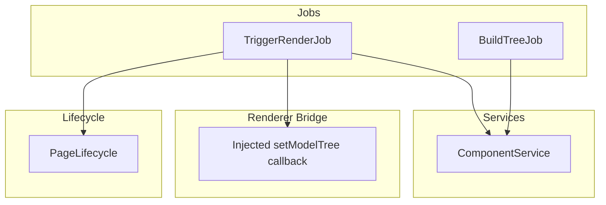
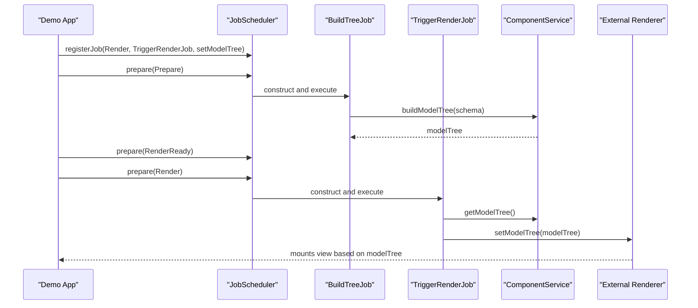
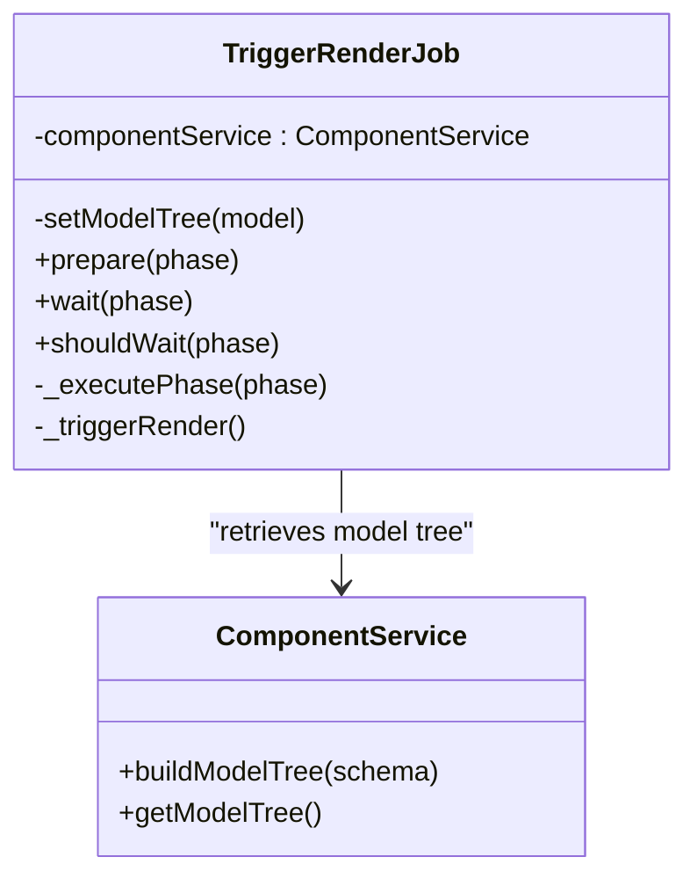
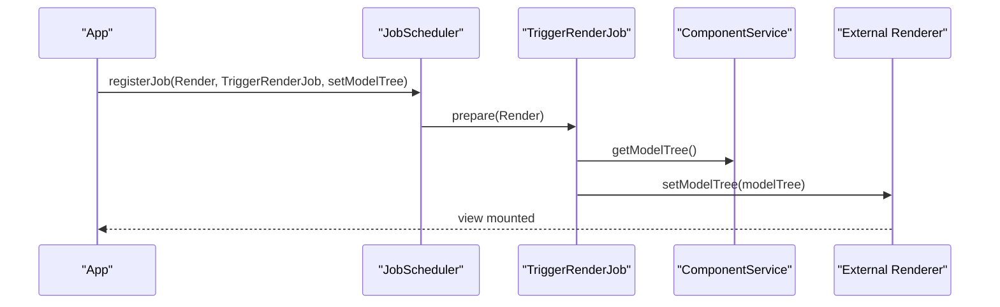
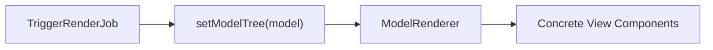
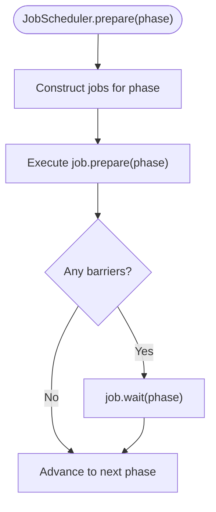
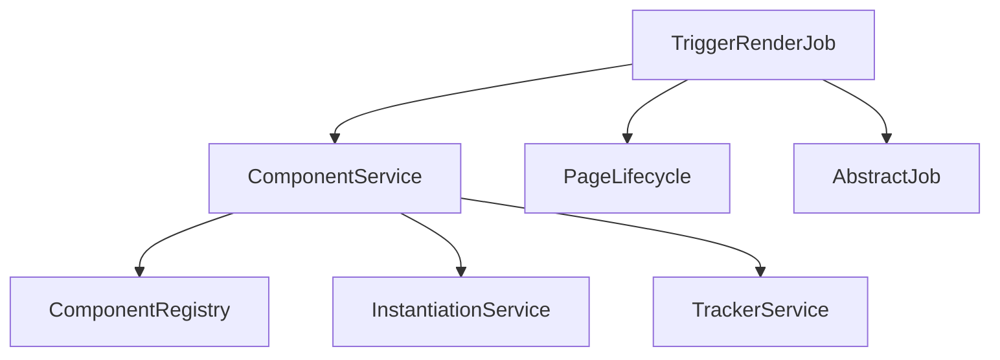

# Trigger Render Job

<cite>
**Referenced Files in This Document**
- [trigger-render-job.ts](file://packages/h5-builder/src/jobs/trigger-render-job.ts)
- [component.service.ts](file://packages/h5-builder/src/services/component.service.ts)
- [model-renderer.tsx](file://packages/h5-builder/src/components/model-renderer.tsx)
- [lifecycle.ts](file://packages/h5-builder/src/jobs/lifecycle.ts)
- [abstract-job.ts](file://packages/h5-builder/src/bedrock/launch/abstract-job.ts)
- [job-scheduler.ts](file://packages/h5-builder/src/bedrock/launch/job-scheduler.ts)
- [demo-progressive.tsx](file://packages/h5-builder/src/demo-progressive.tsx)
- [build-tree-job.ts](file://packages/h5-builder/src/jobs/build-tree-job.ts)
- [pnpm-lock.yaml](file://pnpm-lock.yaml)
</cite>

## Table of Contents
1. [Introduction](#introduction)
2. [Project Structure](#project-structure)
3. [Core Components](#core-components)
4. [Architecture Overview](#architecture-overview)
5. [Detailed Component Analysis](#detailed-component-analysis)
6. [Dependency Analysis](#dependency-analysis)
7. [Performance Considerations](#performance-considerations)
8. [Troubleshooting Guide](#troubleshooting-guide)
9. [Conclusion](#conclusion)
10. [Appendices](#appendices)

## Introduction
TriggerRenderJob is the job responsible for initiating React rendering during the Render phase. It bridges the model layer and the view layer by retrieving the built model tree from ComponentService and invoking the injected setModelTree callback to hand off the model tree to the external renderer. This enables the external React renderer to mount the view layer based on the pre-built model tree, while the job itself remains agnostic of the renderer’s internal mechanics.

Key responsibilities:
- Execute only during the Render phase.
- Retrieve the model tree from ComponentService.
- Invoke the injected setModelTree callback to trigger external rendering.
- Act as a synchronization point between model construction and view mounting.

## Project Structure
The TriggerRenderJob lives alongside other lifecycle jobs and integrates with the job scheduler and services.

**Diagram sources**
- [trigger-render-job.ts](file://packages/h5-builder/src/jobs/trigger-render-job.ts#L1-L44)
- [component.service.ts](file://packages/h5-builder/src/services/component.service.ts#L720-L735)
- [lifecycle.ts](file://packages/h5-builder/src/jobs/lifecycle.ts#L1-L18)
- [demo-progressive.tsx](file://packages/h5-builder/src/demo-progressive.tsx#L70-L90)

**Section sources**
- [trigger-render-job.ts](file://packages/h5-builder/src/jobs/trigger-render-job.ts#L1-L44)
- [component.service.ts](file://packages/h5-builder/src/services/component.service.ts#L720-L735)
- [lifecycle.ts](file://packages/h5-builder/src/jobs/lifecycle.ts#L1-L18)
- [demo-progressive.tsx](file://packages/h5-builder/src/demo-progressive.tsx#L70-L90)

## Core Components
- TriggerRenderJob: Executes during the Render phase, retrieves the model tree from ComponentService, and invokes the injected setModelTree callback to trigger external rendering.
- ComponentService: Builds and caches the model tree, exposes getModelTree for downstream consumers.
- ModelRenderer: A React component that renders a model tree by mapping model constructors to view components.
- Job Scheduler and Lifecycle: Orchestrate job execution across phases and provide the Render phase where TriggerRenderJob runs.

**Section sources**
- [trigger-render-job.ts](file://packages/h5-builder/src/jobs/trigger-render-job.ts#L1-L44)
- [component.service.ts](file://packages/h5-builder/src/services/component.service.ts#L720-L735)
- [model-renderer.tsx](file://packages/h5-builder/src/components/model-renderer.tsx#L1-L105)
- [abstract-job.ts](file://packages/h5-builder/src/bedrock/launch/abstract-job.ts#L1-L46)
- [job-scheduler.ts](file://packages/h5-builder/src/bedrock/launch/job-scheduler.ts#L1-L122)
- [lifecycle.ts](file://packages/h5-builder/src/jobs/lifecycle.ts#L1-L18)

## Architecture Overview
TriggerRenderJob participates in a phased pipeline:
- Open: Acquire page schema.
- LoadComponentLogic: Load component logic and view resources.
- Prepare: Build the model tree.
- RenderReady: Ensure views are ready.
- Render: Trigger rendering and activate the model tree.
- Completed: Initialize first-screen data.
- Idle: Handle background tasks.

TriggerRenderJob executes during the Render phase and relies on ComponentService having already built the model tree in the Prepare phase.

**Diagram sources**
- [demo-progressive.tsx](file://packages/h5-builder/src/demo-progressive.tsx#L70-L90)
- [build-tree-job.ts](file://packages/h5-builder/src/jobs/build-tree-job.ts#L1-L58)
- [trigger-render-job.ts](file://packages/h5-builder/src/jobs/trigger-render-job.ts#L1-L44)
- [component.service.ts](file://packages/h5-builder/src/services/component.service.ts#L720-L735)

## Detailed Component Analysis

### TriggerRenderJob Implementation
- Constructor injection:
  - setModelTree: A callback injected by the external renderer to accept the model tree.
  - ComponentService: Injected via DI to retrieve the built model tree.
- Execution:
  - Runs only when the current lifecycle phase is Render.
  - Retrieves the model tree from ComponentService and invokes setModelTree to trigger rendering.
- Relationship with lifecycle:
  - Uses PageLifecycle.Render to gate execution.

**Diagram sources**
- [trigger-render-job.ts](file://packages/h5-builder/src/jobs/trigger-render-job.ts#L1-L44)
- [component.service.ts](file://packages/h5-builder/src/services/component.service.ts#L720-L735)

**Section sources**
- [trigger-render-job.ts](file://packages/h5-builder/src/jobs/trigger-render-job.ts#L1-L44)

### Rendering Activation Sequence
- Registration:
  - TriggerRenderJob is registered with the setModelTree callback during scheduler initialization.
- Execution:
  - During Render phase, TriggerRenderJob calls setModelTree with the model tree from ComponentService.
- External renderer responsibility:
  - The external renderer receives the model tree and mounts the view layer accordingly.

**Diagram sources**
- [demo-progressive.tsx](file://packages/h5-builder/src/demo-progressive.tsx#L70-L90)
- [trigger-render-job.ts](file://packages/h5-builder/src/jobs/trigger-render-job.ts#L1-L44)
- [component.service.ts](file://packages/h5-builder/src/services/component.service.ts#L720-L735)

**Section sources**
- [demo-progressive.tsx](file://packages/h5-builder/src/demo-progressive.tsx#L70-L90)
- [trigger-render-job.ts](file://packages/h5-builder/src/jobs/trigger-render-job.ts#L1-L44)

### Relationship with ModelRenderer
- ModelRenderer is a React component that renders a model tree by mapping model constructors to view components.
- TriggerRenderJob does not directly render; it hands off the model tree to the external renderer, which may use ModelRenderer internally to render each model.
- This separation ensures TriggerRenderJob remains renderer-agnostic while still enabling the view layer to render the model tree.

**Diagram sources**
- [trigger-render-job.ts](file://packages/h5-builder/src/jobs/trigger-render-job.ts#L1-L44)
- [model-renderer.tsx](file://packages/h5-builder/src/components/model-renderer.tsx#L1-L105)

**Section sources**
- [model-renderer.tsx](file://packages/h5-builder/src/components/model-renderer.tsx#L1-L105)

### Job Execution Flow and Control
- AbstractJob provides the base contract for jobs, including prepare, wait, and shouldWait.
- JobScheduler constructs jobs per phase and executes prepare, then waits for any barriers.
- TriggerRenderJob participates in this flow by responding to the Render phase.

**Diagram sources**
- [abstract-job.ts](file://packages/h5-builder/src/bedrock/launch/abstract-job.ts#L1-L46)
- [job-scheduler.ts](file://packages/h5-builder/src/bedrock/launch/job-scheduler.ts#L65-L122)

**Section sources**
- [abstract-job.ts](file://packages/h5-builder/src/bedrock/launch/abstract-job.ts#L1-L46)
- [job-scheduler.ts](file://packages/h5-builder/src/bedrock/launch/job-scheduler.ts#L65-L122)

## Dependency Analysis
- TriggerRenderJob depends on:
  - ComponentService for model tree retrieval.
  - PageLifecycle for phase gating.
  - AbstractJob for lifecycle hooks and barrier management.
- ComponentService depends on:
  - Registry and instantiation services to build models.
  - Tracker service for telemetry.
- Renderer bridge:
  - setModelTree callback is provided by the external renderer and injected into TriggerRenderJob.

**Diagram sources**
- [trigger-render-job.ts](file://packages/h5-builder/src/jobs/trigger-render-job.ts#L1-L44)
- [component.service.ts](file://packages/h5-builder/src/services/component.service.ts#L1-L120)
- [abstract-job.ts](file://packages/h5-builder/src/bedrock/launch/abstract-job.ts#L1-L46)
- [lifecycle.ts](file://packages/h5-builder/src/jobs/lifecycle.ts#L1-L18)

**Section sources**
- [trigger-render-job.ts](file://packages/h5-builder/src/jobs/trigger-render-job.ts#L1-L44)
- [component.service.ts](file://packages/h5-builder/src/services/component.service.ts#L1-L120)
- [abstract-job.ts](file://packages/h5-builder/src/bedrock/launch/abstract-job.ts#L1-L46)
- [lifecycle.ts](file://packages/h5-builder/src/jobs/lifecycle.ts#L1-L18)

## Performance Considerations
- Render timing:
  - TriggerRenderJob runs during Render phase, ensuring the model tree is fully constructed and views are ready before triggering rendering.
- Concurrency and resource loading:
  - ComponentService handles asynchronous loading and caching of models and views, minimizing blocking during Render.
- React 19 integration:
  - The project uses React 19.x, which introduces new rendering capabilities. TriggerRenderJob’s role is to hand off the model tree promptly so the renderer can leverage React 19 features efficiently.
- Gradual rendering:
  - The demo showcases a progressive rendering pipeline where RenderReady ensures views are ready before Render triggers rendering, reducing perceived latency.

**Section sources**
- [demo-progressive.tsx](file://packages/h5-builder/src/demo-progressive.tsx#L146-L156)
- [pnpm-lock.yaml](file://pnpm-lock.yaml#L6243-L6247)

## Troubleshooting Guide
Common issues and solutions:

- Rendering race conditions:
  - Ensure BuildTreeJob completes before Render phase. TriggerRenderJob checks PageLifecycle.Render and only executes then. Verify that the scheduler advances to Render after Prepare and RenderReady.
  - Confirm that ComponentService.buildModelTree(schema) is called before TriggerRenderJob attempts to retrieve the model tree.

- Null model tree:
  - If ComponentService.getModelTree() returns null, TriggerRenderJob will pass null to setModelTree. Ensure the model tree is built in Prepare and that the scheduler reaches RenderReady before Render.
  - Validate that the schema is present and valid before building the model tree.

- Callback invocation failures:
  - If setModelTree fails, the external renderer must handle the error and potentially reinitialize the pipeline. Ensure the callback is provided during registration and remains valid for the duration of the Render phase.
  - Consider adding defensive logging around setModelTree invocation to capture errors.

- Asynchronous loading errors:
  - ComponentService gracefully handles model/view loading failures by registering placeholders and reporting telemetry. These placeholders ensure rendering continues even if individual components fail to load.

**Section sources**
- [trigger-render-job.ts](file://packages/h5-builder/src/jobs/trigger-render-job.ts#L1-L44)
- [component.service.ts](file://packages/h5-builder/src/services/component.service.ts#L370-L470)
- [build-tree-job.ts](file://packages/h5-builder/src/jobs/build-tree-job.ts#L1-L58)
- [demo-progressive.tsx](file://packages/h5-builder/src/demo-progressive.tsx#L146-L156)

## Conclusion
TriggerRenderJob is the critical bridge between the model and view layers during the Render phase. By retrieving the model tree from ComponentService and invoking the injected setModelTree callback, it enables the external renderer to mount the view layer. Its design keeps the job renderer-agnostic, integrates cleanly with the job scheduler and lifecycle phases, and supports progressive rendering patterns. Proper sequencing and error handling ensure robust rendering under various conditions, and the integration with React 19 allows leveraging modern rendering capabilities.

## Appendices

### Integration Patterns with React 19
- React 19 is used in this project. TriggerRenderJob’s role is to hand off the model tree to the renderer, which can then utilize React 19 features for rendering. Ensure the external renderer is compatible with React 19 and that setModelTree is implemented to accept the model tree and mount the view layer accordingly.

**Section sources**
- [pnpm-lock.yaml](file://pnpm-lock.yaml#L6243-L6247)