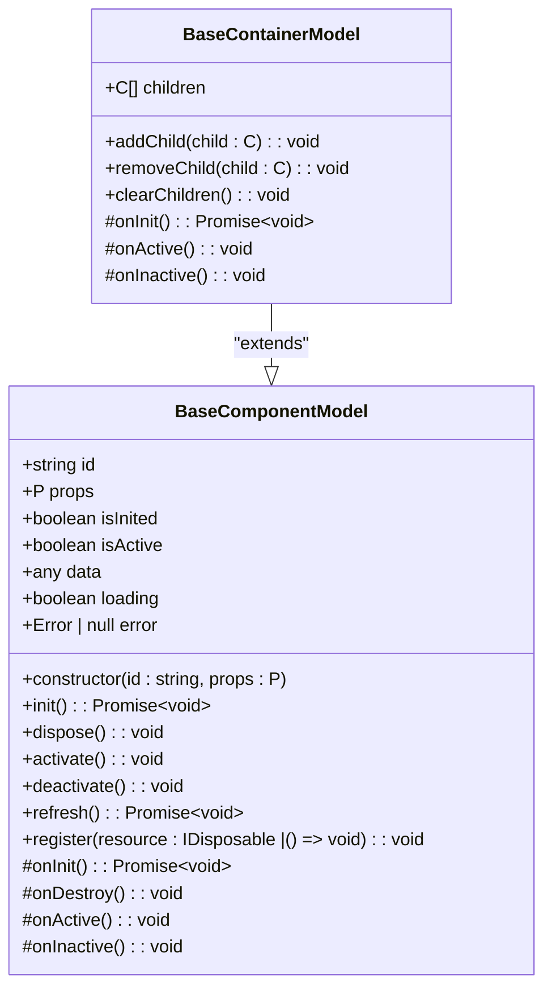
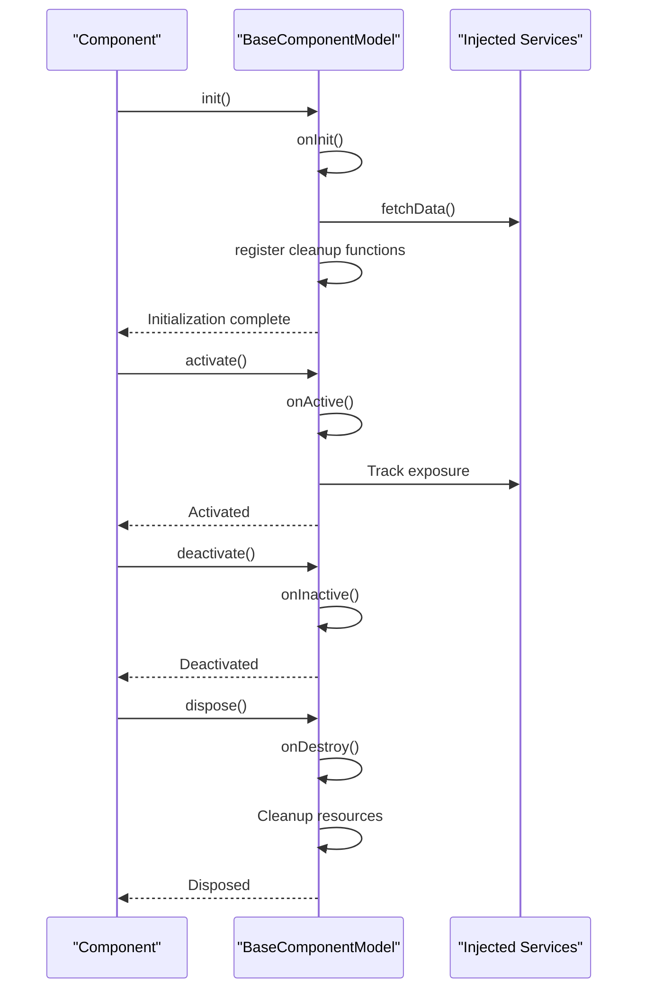
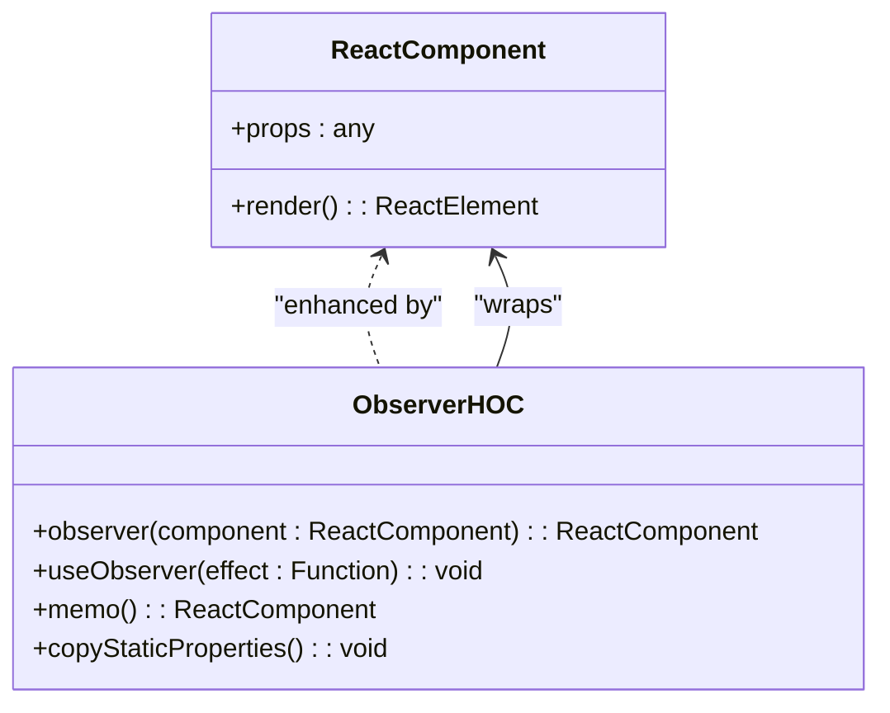
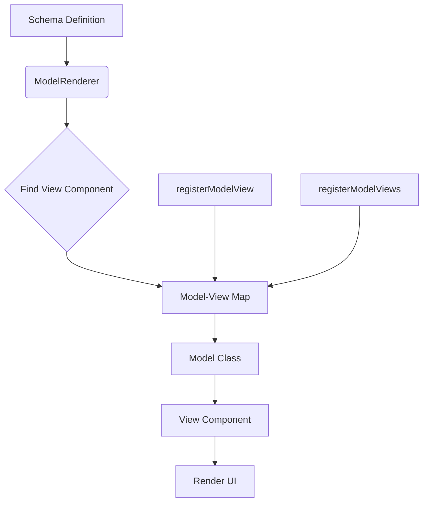

# Component Development Guide

<cite>
**Referenced Files in This Document**   
- [component_development_guide.md](file://packages/h5-builder/docs/component_development_guide.md)
- [model.ts](file://packages/h5-builder/src/bedrock/model.ts)
- [product-card.model.ts](file://packages/h5-builder/src/components/product-card/product-card.model.ts)
- [product-card.view.tsx](file://packages/h5-builder/src/components/product-card/product-card.view.tsx)
- [tabs-container.model.ts](file://packages/h5-builder/src/components/tabs-container/tabs-container.model.ts)
- [tabs-container.view.tsx](file://packages/h5-builder/src/components/tabs-container/tabs-container.view.tsx)
- [model-renderer.tsx](file://packages/h5-builder/src/components/model-renderer.tsx)
- [http.service.ts](file://packages/h5-builder/src/services/http.service.ts)
- [tracker.service.ts](file://packages/h5-builder/src/services/tracker.service.ts)
- [context.web.tsx](file://packages/h5-builder/src/bedrock/di/context.web.tsx)
- [observer.ts](file://packages/mobx-vue-lite/src/observer.ts)
- [index.ts](file://packages/h5-builder/src/components/index.ts)
</cite>

## Table of Contents
1. [Introduction](#introduction)
2. [Core Principles](#core-principles)
3. [Step-by-Step Component Creation](#step-by-step-component-creation)
4. [Model Layer Implementation](#model-layer-implementation)
5. [View Layer Implementation](#view-layer-implementation)
6. [Component Registration](#component-registration)
7. [Common Patterns](#common-patterns)
8. [Best Practices](#best-practices)
9. [Common Pitfalls and Solutions](#common-pitfalls-and-solutions)
10. [Testing Strategy](#testing-strategy)

## Introduction

This guide provides comprehensive documentation for component development in the H5 Builder framework, following the principles of complete separation between UI and logic. The framework implements a Model-View architecture where business logic is encapsulated in Model classes that extend BaseComponentModel, while UI rendering is handled by React components enhanced with mobx-vue-lite's observer HOC.

The component system is designed to promote maintainability, testability, and reusability by strictly separating concerns. Models handle data loading, state management, business logic, and service interactions, while Views are pure UI components that render based on the Model's state and trigger Model methods for user interactions.

**Section sources**
- [component_development_guide.md](file://packages/h5-builder/docs/component_development_guide.md#L1-L510)

## Core Principles

The component development framework is built on several core principles that ensure consistency and maintainability across the codebase.

### Model-View Separation

The framework enforces strict separation between business logic (Model) and UI rendering (View):

```
Model (Business Logic)          View (UI Rendering)
    ↓                                 ↓
- Data loading                  - Pure UI components
- State management              - Receives model as props
- Business logic                - Uses observer HOC
- Analytics tracking            - Calls model methods
- No JSX                        - No business logic
```

### Key Rules

**Model Layer**:
- Must not contain any JSX
- Must not directly manipulate DOM
- Responsible for business logic and state management
- Handles data loading and error handling
- Manages lifecycle through defined hooks

**View Layer**:
- Contains no business logic
- Does not directly call services (HTTP, Tracker, etc.)
- Responsible only for UI rendering and event forwarding
- Receives the Model as a prop
- Uses the observer HOC for reactivity

**Section sources**
- [component_development_guide.md](file://packages/h5-builder/docs/component_development_guide.md#L1-L510)

## Step-by-Step Component Creation

Creating a new component in the H5 Builder framework follows a standardized process that ensures consistency and adherence to architectural principles.

### Step 1: Define the Model Class

Create a Model class that extends BaseComponentModel and defines the component's behavior:

```typescript
// src/components/my-component.model.ts
import { BaseComponentModel } from '../bedrock/model';
import { Inject } from '../kernel/di';
import { HttpService } from '../modules/http.service';
import { TrackerService } from '../modules/tracker.service';

export interface MyComponentProps {
  id: number;
  title?: string;
}

export class MyComponentModel extends BaseComponentModel<MyComponentProps> {
  // Reactive state
  public loading = false;
  public error: Error | null = null;
  public data: any = null;

  constructor(
    id: string,
    props: MyComponentProps,
    @Inject(HttpService) private http: HttpService,
    @Inject(TrackerService) private tracker: TrackerService
  ) {
    super(id, props);
  }

  protected async onInit(): Promise<void> {
    await this.loadData();
  }

  protected onActive(): void {
    this.tracker.track('MY_COMPONENT_EXPOSURE', {
      id: this.props.id,
    });
  }

  private async loadData(): Promise<void> {
    this.loading = true;
    this.error = null;

    try {
      this.data = await this.http.get(`/api/data/${this.props.id}`);
    } catch (error) {
      this.error = error as Error;
    } finally {
      this.loading = false;
    }
  }

  handleClick(): void {
    this.tracker.track('MY_COMPONENT_CLICK', {
      id: this.props.id,
    });
    // Other business logic...
  }
}
```

### Step 2: Create the View Component

Implement a React component that uses the observer HOC to automatically respond to state changes:

```tsx
// src/components/my-component.view.tsx
import React from 'react';
import { observer } from 'mobx-vue-lite';
import { MyComponentModel } from './my-component.model';

export interface MyComponentViewProps {
  model: MyComponentModel;
}

export const MyComponentView: React.FC<MyComponentViewProps> = observer(
  (props: MyComponentViewProps) => {
    const { model } = props;

    // Loading state
    if (model.loading) {
      return <div className="loading">Loading...</div>;
    }

    // Error state
    if (model.error) {
      return (
        <div className="error">
          <p>Load failed: {model.error.message}</p>
          <button onClick={() => model.init()}>Retry</button>
        </div>
      );
    }

    // Normal rendering
    return (
      <div className="my-component" onClick={() => model.handleClick()}>
        <h3>{model.props.title}</h3>
        {model.data && <div>{JSON.stringify(model.data)}</div>}
      </div>
    );
  }
);

MyComponentView.displayName = 'MyComponentView';
```

### Step 3: Register the Component

Register the Model-View pair with the ComponentLoader and ModelRenderer:

```typescript
// In demo.tsx or application initialization code
loader.register('MyComponent', MyComponentModel);

// Register Model-View mapping
registerModelView(MyComponentModel, MyComponentView);
```

### Step 4: Use in Schema

Reference the component in the application schema:

```typescript
const schema: ComponentSchema = {
  type: 'MyComponent',
  id: 'my-component-1',
  props: {
    id: 123,
    title: 'My Component',
  },
};
```

**Section sources**
- [component_development_guide.md](file://packages/h5-builder/docs/component_development_guide.md#L1-L510)
- [product-card.model.ts](file://packages/h5-builder/src/components/product-card/product-card.model.ts#L1-L133)
- [product-card.view.tsx](file://packages/h5-builder/src/components/product-card/product-card.view.tsx#L1-L81)

## Model Layer Implementation

The Model layer is the heart of the component, responsible for all business logic, state management, and service interactions.

### BaseComponentModel Structure

The BaseComponentModel class provides the foundation for all component models:



**Diagram sources**
- [model.ts](file://packages/h5-builder/src/bedrock/model.ts#L10-L243)

### Lifecycle Methods

The Model class implements a well-defined lifecycle:



**Diagram sources**
- [model.ts](file://packages/h5-builder/src/bedrock/model.ts#L10-L243)

### Service Injection

Services are injected into the Model using the @Inject decorator:

```typescript
constructor(
  id: string,
  props: MyComponentProps,
  @Inject(HttpService) private http: HttpService,
  @Inject(TrackerService) private tracker: TrackerService
) {
  super(id, props);
}
```

The dependency injection system ensures that services are properly instantiated and available to the Model. The framework uses a service locator pattern with the InstantiationContext provider and useService hook for React components.

**Section sources**
- [model.ts](file://packages/h5-builder/src/bedrock/model.ts#L10-L243)
- [context.web.tsx](file://packages/h5-builder/src/bedrock/di/context.web.tsx#L1-L42)
- [http.service.ts](file://packages/h5-builder/src/services/http.service.ts#L1-L281)
- [tracker.service.ts](file://packages/h5-builder/src/services/tracker.service.ts#L1-L290)

## View Layer Implementation

The View layer is responsible for UI rendering and user interaction, while remaining completely decoupled from business logic.

### React with mobx-vue-lite

Views are implemented as React components enhanced with mobx-vue-lite's observer HOC:



**Diagram sources**
- [observer.ts](file://packages/mobx-vue-lite/src/observer.ts#L1-L52)

### View Implementation Pattern

The standard pattern for View components:

```typescript
export const MyComponentView: React.FC<MyComponentViewProps> = observer(
  (props: MyComponentViewProps) => {
    const { model } = props;
    
    // Handle different states
    if (model.loading) {
      return <LoadingState />;
    }
    
    if (model.error) {
      return <ErrorState onRetry={() => model.refresh()} />;
    }
    
    // Normal rendering
    return (
      <div onClick={() => model.handleClick()}>
        {/* Render based on model state */}
      </div>
    );
  }
);
```

The observer HOC automatically tracks observable accesses during rendering and re-renders the component when any observed state changes.

**Section sources**
- [product-card.view.tsx](file://packages/h5-builder/src/components/product-card/product-card.view.tsx#L1-L81)
- [tabs-container.view.tsx](file://packages/h5-builder/src/components/tabs-container/tabs-container.view.tsx#L1-L85)
- [observer.ts](file://packages/mobx-vue-lite/src/observer.ts#L1-L52)

## Component Registration

Components must be registered with the framework to be instantiated and rendered dynamically from schema definitions.

### Model-View Mapping

The ModelRenderer component uses a mapping system to associate Model classes with their corresponding View components:



**Diagram sources**
- [model-renderer.tsx](file://packages/h5-builder/src/components/model-renderer.tsx#L1-L105)

### Registration Process

The registration process involves two key steps:

1. **Register Model with ComponentLoader**:
```typescript
loader.register('MyComponent', MyComponentModel);
```

2. **Register Model-View Mapping**:
```typescript
registerModelView(MyComponentModel, MyComponentView);
```

The ModelRenderer uses the constructor of the Model instance to look up the corresponding View component in the modelViewMap. If no mapping is found, it falls back to placeholder components or renders container children directly.

**Section sources**
- [model-renderer.tsx](file://packages/h5-builder/src/components/model-renderer.tsx#L1-L105)
- [index.ts](file://packages/h5-builder/src/components/index.ts#L1-L14)

## Common Patterns

The framework supports several common patterns for handling typical component requirements.

### Data Loading Pattern

Standard pattern for data loading with loading and error states:

```typescript
class MyModel extends BaseComponentModel {
  public loading = false;
  public error: Error | null = null;
  public data: any = null;

  protected async onInit(): Promise<void> {
    await this.loadData();
  }

  private async loadData(): Promise<void> {
    this.loading = true;
    this.error = null;

    try {
      this.data = await this.http.get('/api/data');
    } catch (error) {
      this.error = error as Error;
      this.tracker.track('LOAD_ERROR', { error: error.message });
    } finally {
      this.loading = false;
    }
  }

  async retry(): Promise<void> {
    await this.loadData();
  }
}
```

### Computed Properties Pattern

Using getters to create derived state:

```typescript
class ProductModel extends BaseComponentModel {
  public price = 99.99;
  public discount = 0.8;

  get finalPrice(): number {
    return this.price * this.discount;
  }

  get formattedPrice(): string {
    return `¥${this.finalPrice.toFixed(2)}`;
  }
}
```

### Timer Management Pattern

Properly managing timers with automatic cleanup:

```typescript
class CountdownModel extends BaseComponentModel {
  public seconds = 60;

  protected onInit(): void {
    const timer = setInterval(() => {
      this.seconds--;
      if (this.seconds <= 0) {
        clearInterval(timer);
      }
    }, 1000);

    this.register(() => clearInterval(timer));
  }
}
```

### Event Subscription Pattern

Managing event subscriptions with automatic cleanup:

```typescript
class MyModel extends BaseComponentModel {
  constructor(
    id: string,
    props: any,
    @Inject(EventBus) private eventBus: EventBus
  ) {
    super(id, props);
  }

  protected onInit(): void {
    const unsubscribe = this.eventBus.on('SOME_EVENT', (data) => {
      // Handle event
    });

    this.register(unsubscribe);
  }
}
```

### Container Component Pattern

Managing child components with lazy loading:

```typescript
class MyContainerModel extends BaseContainerModel {
  protected onInit(): void {
    if (this.children.length > 0) {
      this.children[0].init();
      this.children[0].activate();
    }

    this.children.slice(1).forEach((child) => {
      this.scheduler.scheduleIdleTask(() => {
        child.init();
      });
    });
  }

  switchTo(index: number): void {
    const oldChild = this.children[this.activeIndex];
    const newChild = this.children[index];

    if (!newChild.isInited) {
      newChild.init();
    }

    oldChild.deactivate();
    newChild.activate();

    this.activeIndex = index;
  }
}
```

**Section sources**
- [component_development_guide.md](file://packages/h5-builder/docs/component_development_guide.md#L1-L510)
- [product-card.model.ts](file://packages/h5-builder/src/components/product-card/product-card.model.ts#L1-L133)
- [tabs-container.model.ts](file://packages/h5-builder/src/components/tabs-container/tabs-container.model.ts#L1-L273)

## Best Practices

Following these best practices ensures robust, maintainable, and performant components.

### State Management

```typescript
// ✅ Good practice
class GoodModel extends BaseComponentModel {
  public loading = false;  // Reactive
  public data: any = null; // Reactive

  async loadData() {
    this.loading = true;  // Automatically triggers UI update
    this.data = await this.http.get('/api');
    this.loading = false; // Automatically triggers UI update
  }
}

// ❌ Bad practice
class BadModel extends BaseComponentModel {
  private _data: any = null;

  getData() {
    return this._data; // Not reactive
  }
}
```

Ensure all state that affects rendering is defined as public properties on the Model class to make them reactive.

### Error Handling

```typescript
// ✅ Good practice
class GoodModel extends BaseComponentModel {
  public error: Error | null = null;

  async loadData() {
    try {
      this.data = await this.http.get('/api');
    } catch (error) {
      this.error = error as Error;
      this.tracker.track('ERROR', { message: error.message });
    }
  }
}
```

Always handle errors gracefully and provide a way for users to recover (e.g., retry functionality).

### Resource Cleanup

```typescript
// ✅ Good practice
class GoodModel extends BaseComponentModel {
  protected onInit() {
    const timer = setInterval(() => {}, 1000);
    this.register(() => clearInterval(timer)); // Automatically cleaned up
  }
}
```

Use the `register()` method to ensure all resources are properly cleaned up when the component is disposed.

### View Components

```tsx
// ✅ Good practice
export const GoodView = observer((props: ViewProps) => {
  const { model } = props;
  
  return (
    <div onClick={() => model.handleClick()}>
      {model.data.name}
    </div>
  );
});

// ❌ Bad practice
export const BadView = (props: ViewProps) => {
  const { model } = props;
  
  // Direct service call - violates View layer principle
  const handleClick = async () => {
    await http.post('/api/click');
  };
  
  return <div onClick={handleClick}>{model.data.name}</div>;
};
```

Views should only contain UI logic and event forwarding to Model methods.

**Section sources**
- [component_development_guide.md](file://packages/h5-builder/docs/component_development_guide.md#L1-L510)
- [model.ts](file://packages/h5-builder/src/bedrock/model.ts#L10-L243)

## Common Pitfalls and Solutions

### State Not Updating

**Problem**: Model properties change but the View doesn't update.

**Solution**: Ensure properties are defined directly on the class as public properties to make them reactive:

```typescript
// ✅ Correct
class MyModel extends BaseComponentModel {
  public count = 0; // Reactive
}

// ❌ Incorrect
class MyModel extends BaseComponentModel {
  private _count = 0;
  getCount() { return this._count; } // Not reactive
}
```

### Memory Leaks

**Problem**: Timers, event listeners, or subscriptions are not cleaned up.

**Solution**: Use `this.register()` to register cleanup functions:

```typescript
protected onInit() {
  const timer = setInterval(() => {}, 1000);
  this.register(() => clearInterval(timer)); // Automatically cleaned up
}
```

### Dependency Injection Failure

**Problem**: `@Inject` decorator doesn't work.

**Solution**:
1. Ensure `tsconfig.json` has `experimentalDecorators` enabled
2. Verify services are registered with the Injector
3. Use `Injector.resolveAndInstantiate()` to create instances

**Section sources**
- [component_development_guide.md](file://packages/h5-builder/docs/component_development_guide.md#L1-L510)
- [model.ts](file://packages/h5-builder/src/bedrock/model.ts#L10-L243)

## Testing Strategy

The framework supports comprehensive testing of both Model and View components.

### Model Testing

Model testing focuses on business logic, state transitions, and service interactions:

```typescript
describe('MyComponentModel', () => {
  let injector: Injector;
  let model: MyComponentModel;

  beforeEach(() => {
    injector = new Injector();
    // Register mock services
    injector.registerInstance(HttpService, mockHttp);
    injector.registerInstance(TrackerService, mockTracker);

    model = injector.resolveAndInstantiate(
      MyComponentModel,
      ['test-id', { id: 123 }]
    );
  });

  it('should load data on init', async () => {
    await model.init();
    
    expect(model.loading).toBe(false);
    expect(model.data).toBeTruthy();
  });

  it('should handle click', () => {
    model.handleClick();
    
    expect(mockTracker.track).toHaveBeenCalledWith(
      'MY_COMPONENT_CLICK',
      expect.any(Object)
    );
  });
});
```

Models can be tested in isolation by injecting mock services, making it easy to verify business logic without UI concerns.

**Section sources**
- [component_development_guide.md](file://packages/h5-builder/docs/component_development_guide.md#L1-L510)