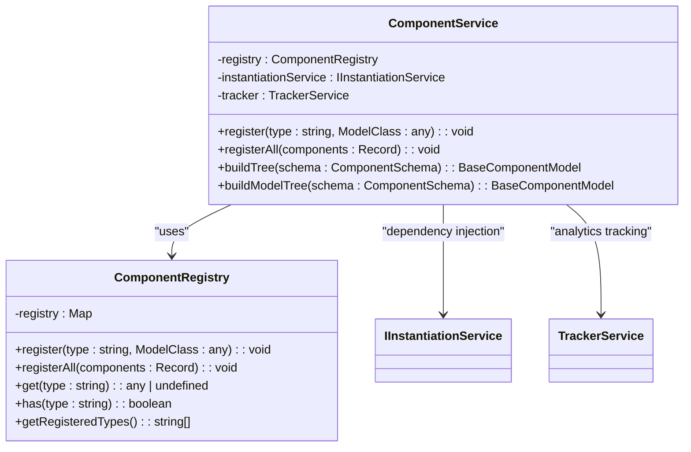
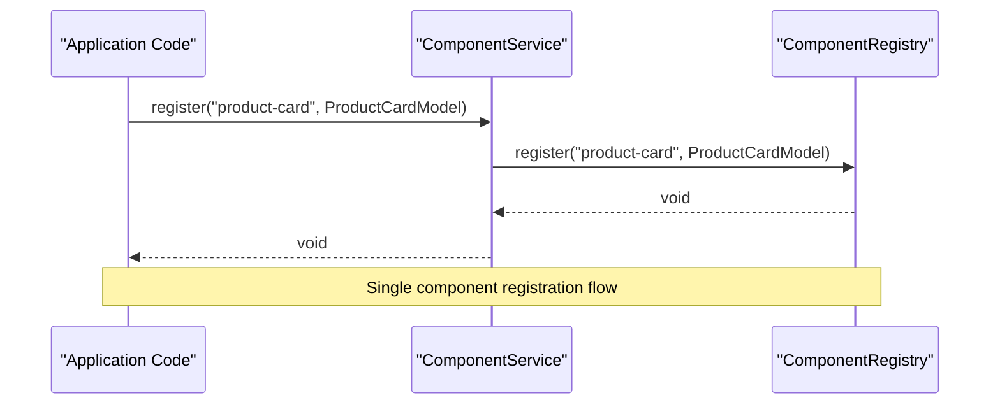
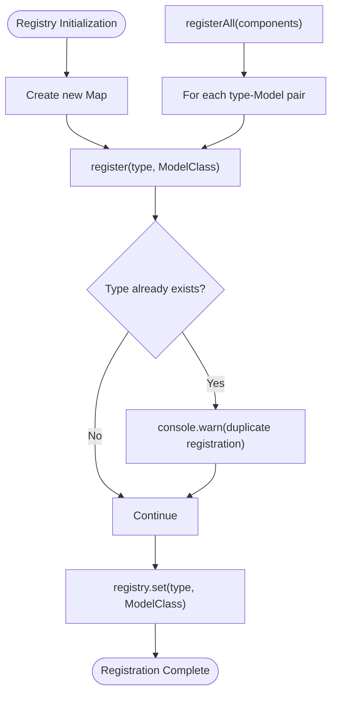
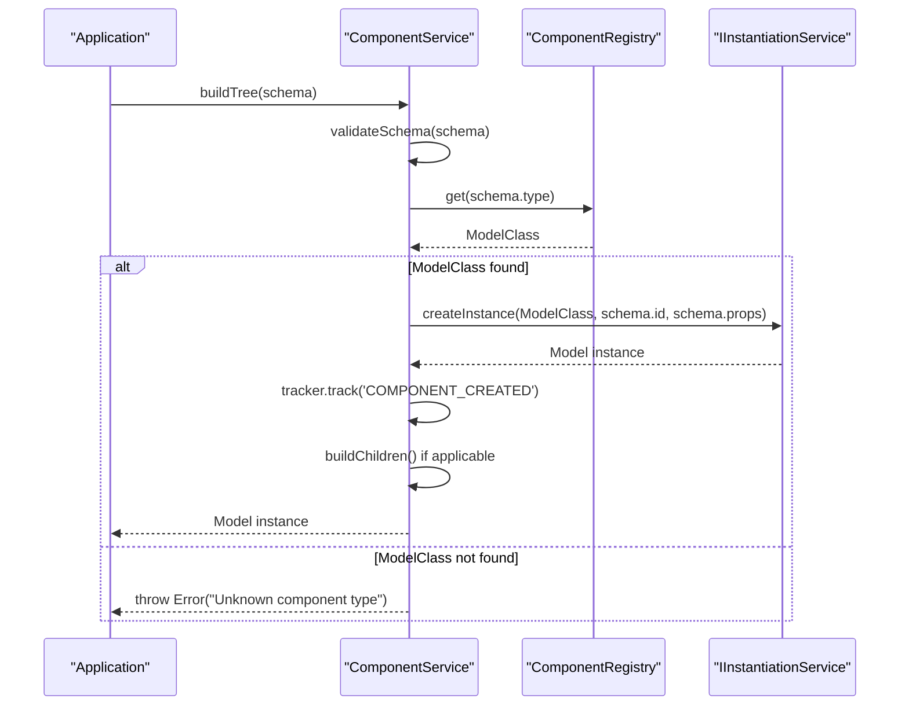
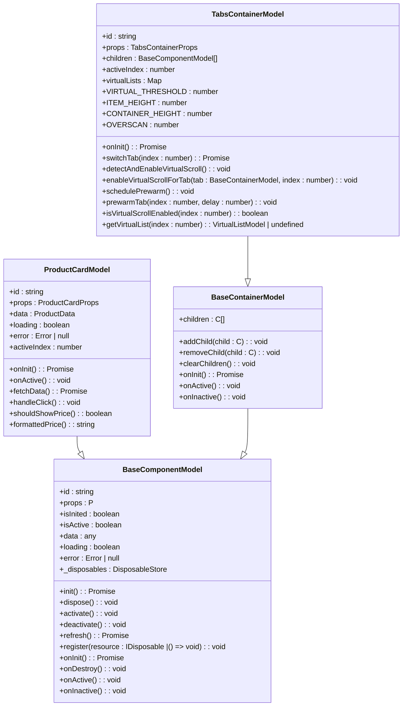
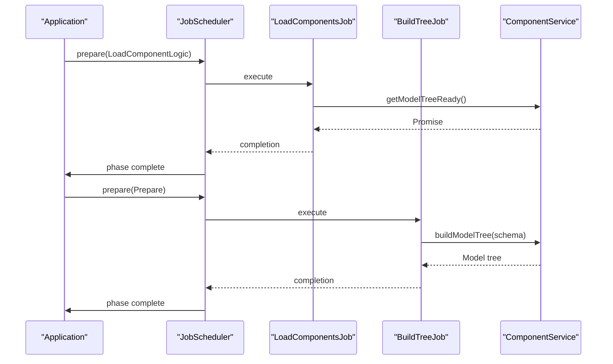

# Component Registration

<cite>
**Referenced Files in This Document**   
- [component.service.ts](file://packages/h5-builder/src/services/component.service.ts)
- [product-card.model.ts](file://packages/h5-builder/src/components/product-card/product-card.model.ts)
- [tabs-container.model.ts](file://packages/h5-builder/src/components/tabs-container/tabs-container.model.ts)
- [model.ts](file://packages/h5-builder/src/bedrock/model.ts)
- [demo-progressive.tsx](file://packages/h5-builder/src/demo-progressive.tsx)
- [load-components-job.ts](file://packages/h5-builder/src/jobs/load-components-job.ts)
- [build-tree-job.ts](file://packages/h5-builder/src/jobs/build-tree-job.ts)
</cite>

## Table of Contents
1. [Introduction](#introduction)
2. [Component Registry and Service Overview](#component-registry-and-service-overview)
3. [Synchronous Registration Process](#synchronous-registration-process)
4. [Internal Registry Structure](#internal-registry-structure)
5. [Schema Resolution and Model Tree Construction](#schema-resolution-and-model-tree-construction)
6. [Component Registration Examples](#component-registration-examples)
7. [Common Issues and Error Handling](#common-issues-and-error-handling)
8. [Best Practices for Component Registration](#best-practices-for-component-registration)
9. [Integration with Application Lifecycle](#integration-with-application-lifecycle)

## Introduction
This document provides comprehensive documentation on the component registration system in the MobX-based H5 builder framework. It focuses on the ComponentRegistry and ComponentService classes that manage the registration, lookup, and instantiation of UI components. The system enables dynamic component-based architecture where components are registered by type and later resolved from schema definitions to build a complete model tree. This approach supports both synchronous and asynchronous component loading patterns while maintaining type safety and efficient resource management.

## Component Registry and Service Overview
The component registration system consists of two primary classes: ComponentRegistry and ComponentService. The ComponentRegistry maintains a mapping between component types (strings) and their corresponding Model classes, while the ComponentService provides a higher-level interface for component management and tree construction. This separation of concerns allows for clean abstraction between the registration mechanism and its usage in application logic.

**Diagram sources**
- [component.service.ts](file://packages/h5-builder/src/services/component.service.ts#L52-L94)
- [component.service.ts](file://packages/h5-builder/src/services/component.service.ts#L100-L114)

**Section sources**
- [component.service.ts](file://packages/h5-builder/src/services/component.service.ts#L52-L114)

## Synchronous Registration Process
The component registration system supports synchronous registration through two primary methods: register() for single components and registerAll() for bulk registration. These methods are exposed both on the ComponentRegistry class and the ComponentService wrapper, providing flexibility in how components are registered within the application.

The register() method takes a component type string and its corresponding Model class, storing this mapping in an internal Map structure. If a component type is already registered, the system issues a warning but allows overwriting, enabling hot-reload scenarios and dynamic component replacement during development.

**Diagram sources**
- [component.service.ts](file://packages/h5-builder/src/services/component.service.ts#L58-L63)
- [component.service.ts](file://packages/h5-builder/src/services/component.service.ts#L119-L121)

**Section sources**
- [component.service.ts](file://packages/h5-builder/src/services/component.service.ts#L58-L63)
- [component.service.ts](file://packages/h5-builder/src/services/component.service.ts#L119-L121)

## Internal Registry Structure
The ComponentRegistry class uses a Map<string, any> as its internal data structure to maintain the type-to-ModelClass mapping. This choice of data structure provides O(1) lookup performance and preserves insertion order, which can be useful for debugging and introspection purposes. The registry serves as the central authority for component type resolution throughout the application lifecycle.

The registry exposes several utility methods beyond basic registration and retrieval. These include has() for checking registration status, getRegisteredTypes() for obtaining all registered component types, and internal methods used during schema validation. This comprehensive API enables robust component management and debugging capabilities.

**Diagram sources**
- [component.service.ts](file://packages/h5-builder/src/services/component.service.ts#L53)
- [component.service.ts](file://packages/h5-builder/src/services/component.service.ts#L58-L72)

**Section sources**
- [component.service.ts](file://packages/h5-builder/src/services/component.service.ts#L53-L72)

## Schema Resolution and Model Tree Construction
The ComponentService plays a crucial role in resolving component schemas into executable model trees. When presented with a ComponentSchema object, the service validates the schema, looks up the corresponding Model class in the registry, and instantiates it with the provided properties. This process is recursive, allowing for nested component structures to be built from a hierarchical schema definition.

The buildTree() method orchestrates this process, handling error conditions and ensuring proper component initialization. If a requested component type is not found in the registry, the system throws an "Unknown component type" error, preventing silent failures in component resolution. The service also integrates with the dependency injection system to provide required services to component constructors.

**Diagram sources**
- [component.service.ts](file://packages/h5-builder/src/services/component.service.ts#L135-L158)
- [component.service.ts](file://packages/h5-builder/src/services/component.service.ts#L164-L185)

**Section sources**
- [component.service.ts](file://packages/h5-builder/src/services/component.service.ts#L135-L185)

## Component Registration Examples
The framework includes several concrete examples of component registration patterns, demonstrating both basic and advanced use cases. Key components such as product-card and tabs-container illustrate how different types of UI elements can be registered and managed within the system.

The product-card component demonstrates a typical leaf component pattern, with a dedicated Model class that handles data fetching and state management. The tabs-container component showcases a more complex container pattern, managing multiple child components and implementing features like lazy loading and virtual scrolling optimization.

**Diagram sources**
- [product-card.model.ts](file://packages/h5-builder/src/components/product-card/product-card.model.ts#L29-L133)
- [tabs-container.model.ts](file://packages/h5-builder/src/components/tabs-container/tabs-container.model.ts#L29-L273)
- [model.ts](file://packages/h5-builder/src/bedrock/model.ts#L10-L243)

**Section sources**
- [product-card.model.ts](file://packages/h5-builder/src/components/product-card/product-card.model.ts#L29-L133)
- [tabs-container.model.ts](file://packages/h5-builder/src/components/tabs-container/tabs-container.model.ts#L29-L273)

## Common Issues and Error Handling
The component registration system includes several mechanisms for handling common issues that may arise during development and runtime. The most frequent issues include duplicate component registrations and attempts to use unregistered component types.

When a component type is registered multiple times, the system issues a console warning but allows the registration to proceed, overwriting the previous mapping. This behavior enables development-time component replacement but should be monitored in production environments. For unregistered component types, the system throws a clear error message specifying the unknown type, preventing silent failures in component resolution.

The framework also handles errors during model instantiation by creating error placeholder components that maintain the structural integrity of the component tree while providing visual feedback about the failure.

**Section sources**
- [component.service.ts](file://packages/h5-builder/src/services/component.service.ts#L59-L61)
- [component.service.ts](file://packages/h5-builder/src/services/component.service.ts#L167-L169)
- [component.service.ts](file://packages/h5-builder/src/services/component.service.ts#L231-L243)

## Best Practices for Component Registration
To ensure optimal performance and maintainability, several best practices should be followed when organizing component registration in applications. Components should be registered early in the application lifecycle, typically during initialization, to ensure they are available when needed for schema resolution.

For large applications, consider organizing component registration into logical groups or modules, potentially using the registerAll() method to register related components in bulk. Maintain consistent naming conventions for component types to avoid confusion and make debugging easier. Consider implementing registration validation in development environments to catch potential issues early.

When designing components, follow the principle of single responsibility, ensuring each component has a well-defined purpose. Leverage the dependency injection system to provide services rather than hard-coding dependencies, making components more testable and reusable.

**Section sources**
- [component.service.ts](file://packages/h5-builder/src/services/component.service.ts#L68-L71)
- [demo-progressive.tsx](file://packages/h5-builder/src/demo-progressive.tsx#L214-L219)

## Integration with Application Lifecycle
The component registration system is tightly integrated with the application's lifecycle management through the JobScheduler pattern. Component loading and registration occur during specific lifecycle phases, ensuring proper sequencing of operations. The LoadComponentsJob handles the loading of component resources, while the BuildTreeJob constructs the model tree once all necessary components are available.

This phased approach enables progressive rendering and lazy loading strategies, where critical components can be prioritized and non-essential components loaded on-demand. The integration with the tracker service also provides valuable analytics about component usage and performance characteristics.

**Diagram sources**
- [load-components-job.ts](file://packages/h5-builder/src/jobs/load-components-job.ts#L54-L58)
- [build-tree-job.ts](file://packages/h5-builder/src/jobs/build-tree-job.ts#L55-L57)
- [demo-progressive.tsx](file://packages/h5-builder/src/demo-progressive.tsx#L77-L81)

**Section sources**
- [load-components-job.ts](file://packages/h5-builder/src/jobs/load-components-job.ts#L54-L58)
- [build-tree-job.ts](file://packages/h5-builder/src/jobs/build-tree-job.ts#L55-L57)