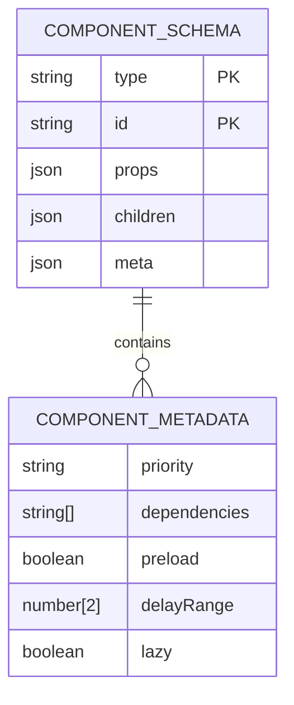
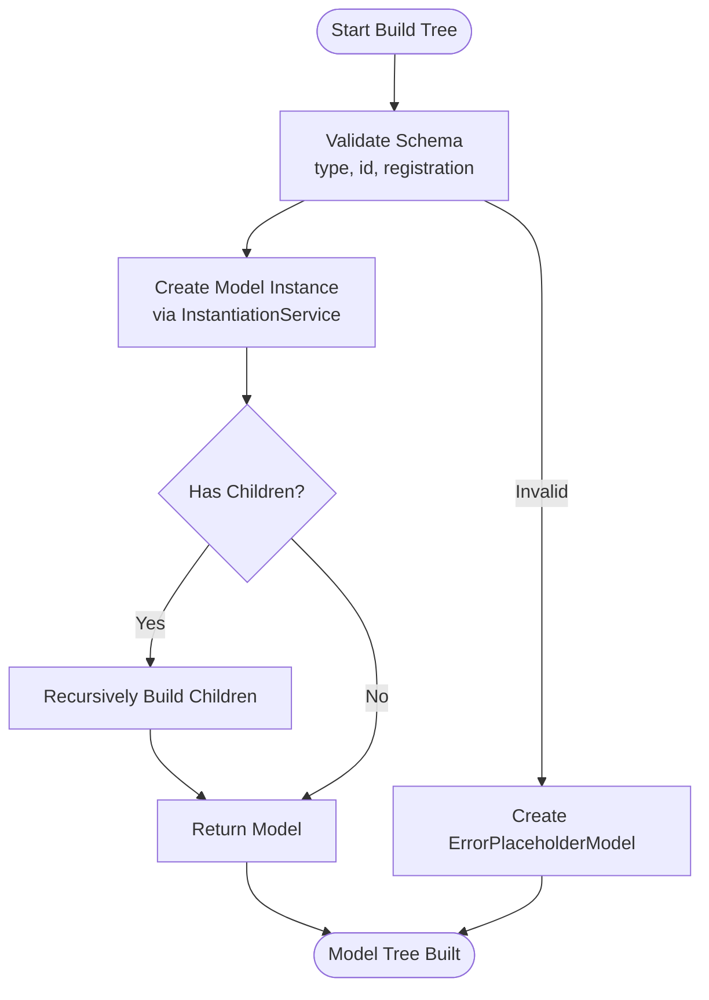
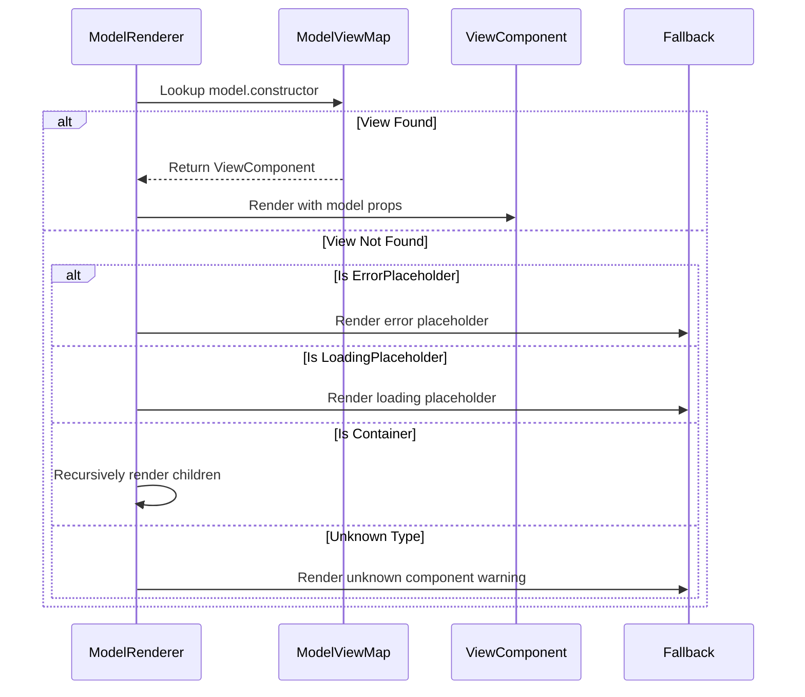

# Component System

<cite>
**Referenced Files in This Document**   
- [component.service.ts](file://packages/h5-builder/src/services/component.service.ts)
- [model-renderer.tsx](file://packages/h5-builder/src/components/model-renderer.tsx)
- [build-tree-job.ts](file://packages/h5-builder/src/jobs/build-tree-job.ts)
- [schema.service.ts](file://packages/h5-builder/src/services/schema.service.ts)
- [model.ts](file://packages/h5-builder/src/bedrock/model.ts)
- [component_development_guide.md](file://packages/h5-builder/docs/component_development_guide.md)
- [api_reference.md](file://packages/h5-builder/docs/api_reference.md)
- [product-card.model.ts](file://packages/h5-builder/src/components/product-card/product-card.model.ts)
- [product-card.view.tsx](file://packages/h5-builder/src/components/product-card/product-card.view.tsx)
</cite>

## Table of Contents
1. [Introduction](#introduction)
2. [Component Registration and Service Architecture](#component-registration-and-service-architecture)
3. [Schema Definition and Validation](#schema-definition-and-validation)
4. [Model Tree Construction Process](#model-tree-construction-process)
5. [View Rendering and Model-View Mapping](#view-rendering-and-model-view-mapping)
6. [Complete Component Lifecycle](#complete-component-lifecycle)
7. [Common Issues and Troubleshooting](#common-issues-and-troubleshooting)
8. [Conclusion](#conclusion)

## Introduction

The Component System in the H5 Builder framework implements a robust architecture for managing UI components through a clear separation of concerns between business logic (Model) and presentation (View). This documentation details the complete lifecycle of components from registration through schema definition, model tree construction, and final rendering. The system leverages dependency injection, asynchronous loading strategies, and MobX-based reactivity to create a scalable component architecture that supports both synchronous and asynchronous component loading while maintaining optimal performance.

**Section sources**
- [component_development_guide.md](file://packages/h5-builder/docs/component_development_guide.md#L1-L510)
- [api_reference.md](file://packages/h5-builder/docs/api_reference.md#L1-L680)

## Component Registration and Service Architecture

The ComponentService serves as the central registry and factory for all components in the system, implementing a comprehensive registration mechanism that supports both synchronous and asynchronous component loading. The service maintains a ComponentRegistry that maps component types to their corresponding Model classes, enabling type-based resolution during model tree construction.

Component registration occurs through several methods:
- `register(type: string, ModelClass: any)`: Synchronously registers a component type to its Model class
- `registerAll(components: Record<string, any>)`: Batch registers multiple components
- `registerAsync(componentName: string, config: { model?: () => Promise<any>, view?: () => Promise<any> })`: Registers components with separate async loading for Model and View

The ComponentService integrates with the dependency injection system through IInstantiationService, which automatically resolves constructor dependencies when creating Model instances. This allows components to declare their dependencies (such as HttpService or TrackerService) using decorators, which are then automatically injected during instantiation.

```mermaid
classDiagram
class ComponentService {
+_serviceBrand : undefined
-registry : ComponentRegistry
-_modelTree : BaseComponentModel | null
-modelLoaders : Map<string, () => Promise<any>>
-viewLoaders : Map<string, () => Promise<any>>
-modelCache : Map<string, any>
-viewCache : Map<string, any>
+register(type : string, ModelClass : any) : void
+registerAll(components : Record<string, any>) : void
+registerAsync(componentName : string, config : { model? : () => Promise<any>, view? : () => Promise<any> }) : void
+buildTree(schema : ComponentSchema) : BaseComponentModel
+buildModelTree(schema : ComponentSchema) : BaseComponentModel
}
class ComponentRegistry {
-registry : Map<string, any>
+register(type : string, ModelClass : any) : void
+registerAll(components : Record<string, any>) : void
+get(type : string) : any | undefined
+has(type : string) : boolean
}
ComponentService --> ComponentRegistry : "uses"
ComponentService --> IInstantiationService : "dependency injection"
ComponentService --> TrackerService : "telemetry"
```

**Diagram sources**
- [component.service.ts](file://packages/h5-builder/src/services/component.service.ts#L100-L734)

**Section sources**
- [component.service.ts](file://packages/h5-builder/src/services/component.service.ts#L1-L734)
- [service-identifiers.ts](file://packages/h5-builder/src/services/service-identifiers.ts#L1-L20)

## Schema Definition and Validation

The component system uses a standardized schema structure to define the component tree that will be rendered. The ComponentSchema interface defines the contract for component configuration with four primary properties:

- `type`: String identifier that maps to a registered component type
- `id`: Unique identifier for the component instance
- `props`: Object containing configuration properties passed to the component
- `children`: Optional array of child component schemas (for container components)

The schema validation process ensures structural integrity before model construction begins. The validation checks for:
1. Presence of required fields (type and id)
2. Registration of the specified component type
3. Proper structure for container components with children

The system also supports optional metadata through the ComponentMetadata interface, which includes configuration for loading priority, dependencies, preload behavior, delay ranges, and lazy loading capabilities. This metadata enables sophisticated loading strategies and performance optimizations.



**Diagram sources**
- [component.service.ts](file://packages/h5-builder/src/services/component.service.ts#L11-L46)

**Section sources**
- [component.service.ts](file://packages/h5-builder/src/services/component.service.ts#L11-L46)
- [schema.service.ts](file://packages/h5-builder/src/services/schema.service.ts#L1-L38)

## Model Tree Construction Process

The model tree construction process transforms a flat schema definition into a hierarchical tree of Model instances that represent the application state. This process is orchestrated through the ComponentService's buildTree method, which recursively processes the schema and creates corresponding Model instances.

The construction workflow follows these steps:
1. **Schema Validation**: The input schema is validated for required fields and registered component types
2. **Model Creation**: The ComponentRegistry is queried to find the Model class corresponding to the schema type
3. **Instance Creation**: The IInstantiationService creates a new instance of the Model class with the provided id and props
4. **Child Processing**: If the component has children and is a container type, the buildChildren method recursively processes each child schema
5. **Error Handling**: Any failures during construction result in an ErrorPlaceholderModel being created

The BuildTreeJob class implements this process as part of the application's lifecycle management. It executes during the Prepare phase, retrieving the schema from SchemaService and invoking ComponentService.buildModelTree to construct the complete model tree. This job-based approach enables proper sequencing of initialization tasks and supports progressive enhancement patterns.



**Diagram sources**
- [component.service.ts](file://packages/h5-builder/src/services/component.service.ts#L135-L208)
- [build-tree-job.ts](file://packages/h5-builder/src/jobs/build-tree-job.ts#L12-L58)

**Section sources**
- [component.service.ts](file://packages/h5-builder/src/services/component.service.ts#L135-L208)
- [build-tree-job.ts](file://packages/h5-builder/src/jobs/build-tree-job.ts#L12-L58)
- [model.ts](file://packages/h5-builder/src/bedrock/model.ts#L10-L243)

## View Rendering and Model-View Mapping

The view rendering system implements a dynamic mapping between Model classes and their corresponding View components through the ModelRenderer and registerModelView mechanism. This decoupled approach allows for flexible component composition and supports both synchronous and asynchronous view loading.

The ModelRenderer component serves as the recursive rendering engine, accepting a Model instance as input and determining the appropriate View component to render. It follows this resolution process:
1. Look up the Model's constructor in the modelViewMap
2. If found, render the corresponding View component with the Model as props
3. If not found, apply fallback rendering strategies based on component type:
   - Render placeholder components for error, loading, or empty states
   - For container components, recursively render children
   - Display unknown component warnings for unregistered types

The registerModelView function establishes the mapping between Model classes and View components, allowing the framework to resolve the correct View at render time. This registration can occur either individually or in batches through registerModelViews. The system includes built-in support for common placeholder components (ErrorPlaceholder, LoadingPlaceholder, EmptyPlaceholder) that provide graceful degradation when components fail to load.



**Diagram sources**
- [model-renderer.tsx](file://packages/h5-builder/src/components/model-renderer.tsx#L1-L105)
- [product-card.view.tsx](file://packages/h5-builder/src/components/product-card/product-card.view.tsx#L1-L81)

**Section sources**
- [model-renderer.tsx](file://packages/h5-builder/src/components/model-renderer.tsx#L1-L105)
- [product-card.model.ts](file://packages/h5-builder/src/components/product-card/product-card.model.ts#L1-L133)
- [product-card.view.tsx](file://packages/h5-builder/src/components/product-card/product-card.view.tsx#L1-L81)

## Complete Component Lifecycle

The complete component lifecycle spans from registration through rendering, integrating multiple system components to deliver a seamless user experience. This lifecycle can be divided into three main phases: registration and loading, model construction, and view rendering.

In the registration phase, components are registered with the ComponentService either synchronously or asynchronously. For async components, separate loaders can be defined for Models and Views, enabling code splitting and optimized loading strategies. The system supports concurrent loading with configurable limits (MODEL_CONCURRENCY and VIEW_CONCURRENCY) to prevent resource contention.

During the model construction phase, the schema is processed to create a tree of Model instances. Each Model extends BaseComponentModel or BaseContainerModel, inheriting lifecycle methods (init, activate, deactivate, dispose) and state management capabilities. The Models encapsulate all business logic, data loading, and state management while remaining completely separate from presentation concerns.

The rendering phase begins when the ModelRenderer receives the root Model and recursively renders the component tree. The framework leverages MobX reactivity through the observer HOC, ensuring that View components automatically re-render when Model state changes. This creates a unidirectional data flow where user interactions trigger Model methods, which update state and automatically propagate changes to the View.


**Diagram sources**
- [component.service.ts](file://packages/h5-builder/src/services/component.service.ts#L258-L696)
- [model-renderer.tsx](file://packages/h5-builder/src/components/model-renderer.tsx#L50-L105)
- [model.ts](file://packages/h5-builder/src/bedrock/model.ts#L64-L122)

**Section sources**
- [component_development_guide.md](file://packages/h5-builder/docs/component_development_guide.md#L1-L510)
- [api_reference.md](file://packages/h5-builder/docs/api_reference.md#L1-L680)

## Common Issues and Troubleshooting

Several common issues can arise in the component system, primarily related to registration, schema validation, and lifecycle management. Understanding these issues and their solutions is critical for effective development.

**Component Registration Issues:**
- **Duplicate Registration**: Registering the same component type multiple times results in a warning and overwrites the previous registration. This can lead to unexpected behavior if different Model classes are registered under the same type.
- **Missing Registration**: Attempting to use a component type that hasn't been registered results in an "Unknown component type" error during schema validation.
- **Async Loading Failures**: When async loaders fail, empty placeholders are created, but the failure should be monitored through tracking events (MODEL_LOAD_FAILED, VIEW_LOAD_FAILED).

**Schema Validation Problems:**
- **Missing Required Fields**: Schemas without type or id fields fail validation immediately.
- **Invalid Component Types**: Using unregistered component types in the schema causes resolution failures.
- **Container Mismatches**: Assigning children to non-container components generates warnings but continues processing.

**Lifecycle and State Issues:**
- **Memory Leaks**: Failing to clean up resources (timers, event listeners) in the onDestroy hook or through the register method can cause memory leaks.
- **State Not Updating**: Non-observable properties (declared in constructors rather than as class fields) won't trigger reactive updates in Views.
- **Dependency Injection Failures**: Missing service registrations in the Injector or incorrect token usage prevents proper dependency resolution.

The framework provides several debugging tools, including the getRegistryInfo method on ComponentService to inspect registered components, console logging throughout the loading process, and comprehensive tracking events for monitoring component lifecycle.

**Section sources**
- [component.service.ts](file://packages/h5-builder/src/services/component.service.ts#L214-L226)
- [component_development_guide.md](file://packages/h5-builder/docs/component_development_guide.md#L453-L486)
- [model.ts](file://packages/h5-builder/src/bedrock/model.ts#L37-L43)

## Conclusion

The Component System in the H5 Builder framework provides a comprehensive architecture for building scalable, maintainable UI components through a clear separation of concerns. By decoupling business logic (Model) from presentation (View) and implementing a robust registration, construction, and rendering pipeline, the system enables developers to create complex user interfaces with predictable behavior and optimal performance. The integration of dependency injection, asynchronous loading strategies, and MobX-based reactivity creates a powerful foundation for modern web applications, while the comprehensive error handling and fallback mechanisms ensure resilience in production environments.