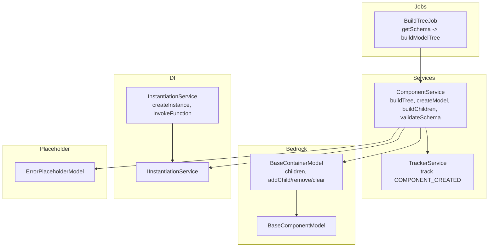
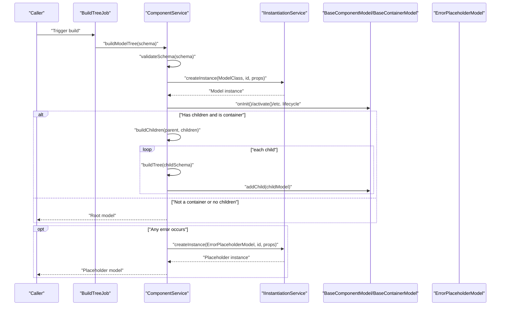
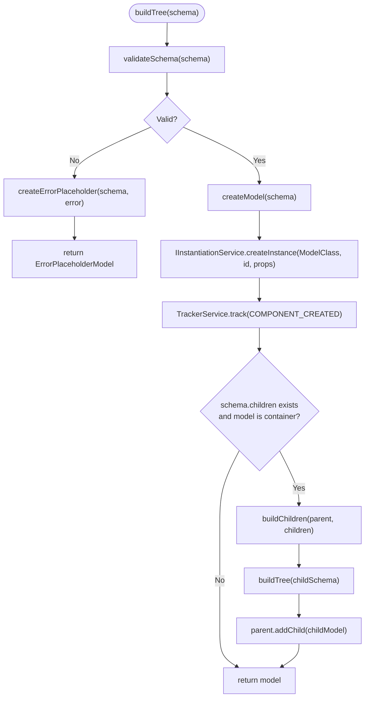
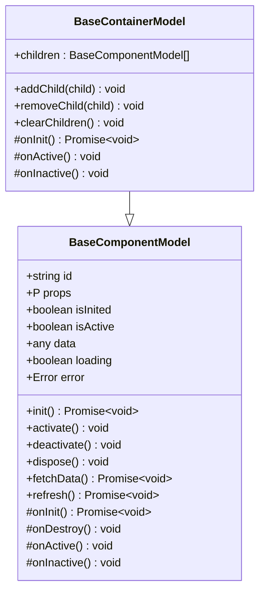
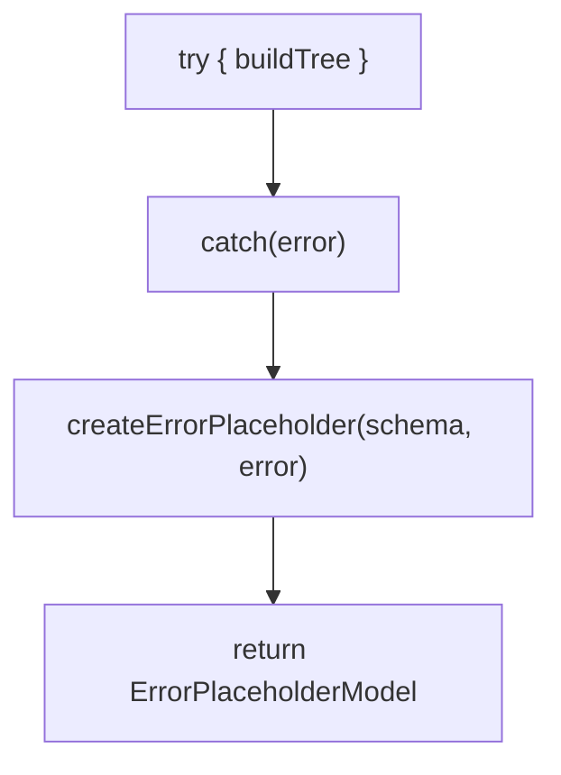
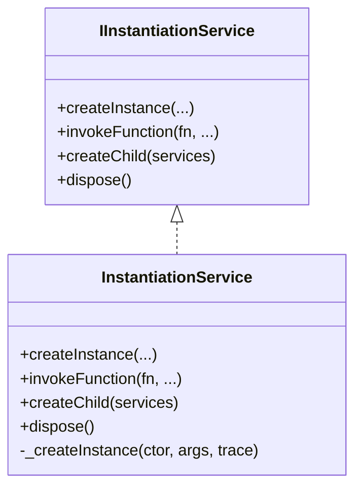
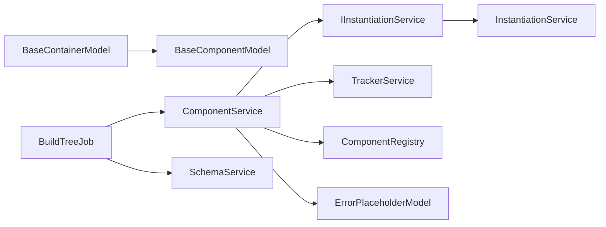

# Model Tree Construction

<cite>
**Referenced Files in This Document**
- [component.service.ts](file://packages/h5-builder/src/services/component.service.ts)
- [model.ts](file://packages/h5-builder/src/bedrock/model.ts)
- [instantiation-service.interface.ts](file://packages/h5-builder/src/bedrock/di/instantiation-service.interface.ts)
- [instantiation-service.ts](file://packages/h5-builder/src/bedrock/di/instantiation-service.ts)
- [placeholder/index.ts](file://packages/h5-builder/src/placeholder/index.ts)
- [component_loader.test.ts](file://packages/h5-builder/src/__tests__/component-loader.test.ts)
- [build-tree-job.ts](file://packages/h5-builder/src/jobs/build-tree-job.ts)
- [service-identifiers.ts](file://packages/h5-builder/src/services/service-identifiers.ts)
- [tracker.service.ts](file://packages/h5-builder/src/services/tracker.service.ts)
</cite>

## Table of Contents
1. [Introduction](#introduction)
2. [Project Structure](#project-structure)
3. [Core Components](#core-components)
4. [Architecture Overview](#architecture-overview)
5. [Detailed Component Analysis](#detailed-component-analysis)
6. [Dependency Analysis](#dependency-analysis)
7. [Performance Considerations](#performance-considerations)
8. [Troubleshooting Guide](#troubleshooting-guide)
9. [Conclusion](#conclusion)

## Introduction
This document explains the Model Tree Construction process, focusing on the buildTree method in ComponentService. It details how a ComponentSchema is transformed into a tree of BaseComponentModel instances using DI instantiation, and how child models are built and managed. It also covers the three-step process: schema validation, model creation via createModel, and child model building via buildChildren. The document describes how BaseContainerModel manages child models, the error handling mechanism that substitutes ErrorPlaceholderModel on failures, and the role of the instantiation service in dependency injection during model creation. Finally, it provides performance considerations and guidance for troubleshooting.

## Project Structure
The model tree construction lives in the h5-builder package. The key areas involved are:
- Services: ComponentService orchestrates registration, validation, model creation, and child building.
- Bedrock: BaseComponentModel and BaseContainerModel define the model hierarchy and lifecycle.
- DI: IInstantiationService and InstantiationService power dependency injection.
- Placeholder: ErrorPlaceholderModel is used when schema or model creation fails.
- Jobs: BuildTreeJob coordinates schema retrieval and triggers model tree building.
- Tests: Component loader tests validate the buildTree behavior, including error handling and nested containers.

**Diagram sources**
- [component.service.ts](file://packages/h5-builder/src/services/component.service.ts#L130-L226)
- [model.ts](file://packages/h5-builder/src/bedrock/model.ts#L157-L243)
- [instantiation-service.interface.ts](file://packages/h5-builder/src/bedrock/di/instantiation-service.interface.ts#L12-L46)
- [instantiation-service.ts](file://packages/h5-builder/src/bedrock/di/instantiation-service.ts#L150-L176)
- [placeholder/index.ts](file://packages/h5-builder/src/placeholder/index.ts#L1-L11)
- [build-tree-job.ts](file://packages/h5-builder/src/jobs/build-tree-job.ts#L46-L57)
- [tracker.service.ts](file://packages/h5-builder/src/services/tracker.service.ts#L107-L171)

**Section sources**
- [component.service.ts](file://packages/h5-builder/src/services/component.service.ts#L130-L226)
- [model.ts](file://packages/h5-builder/src/bedrock/model.ts#L157-L243)
- [instantiation-service.interface.ts](file://packages/h5-builder/src/bedrock/di/instantiation-service.interface.ts#L12-L46)
- [placeholder/index.ts](file://packages/h5-builder/src/placeholder/index.ts#L1-L11)
- [build-tree-job.ts](file://packages/h5-builder/src/jobs/build-tree-job.ts#L46-L57)

## Core Components
- ComponentService: Central orchestrator for building the model tree from a ComponentSchema. It validates the schema, creates models via DI, and builds children recursively. It also handles errors by substituting ErrorPlaceholderModel and tracks component creation.
- BaseComponentModel: Base class for all models with lifecycle hooks (init, activate, deactivate, dispose) and reactive state.
- BaseContainerModel: Extends BaseComponentModel to manage a collection of child models, automatically initializing, activating, and deactivating them.
- IInstantiationService and InstantiationService: Provide dependency injection, enabling models to receive services through constructor injection.
- ErrorPlaceholderModel: A placeholder model used when schema validation fails or when model creation fails.
- BuildTreeJob: Coordinates retrieving the schema and invoking ComponentService.buildModelTree to construct the model tree.

**Section sources**
- [component.service.ts](file://packages/h5-builder/src/services/component.service.ts#L130-L226)
- [model.ts](file://packages/h5-builder/src/bedrock/model.ts#L10-L155)
- [model.ts](file://packages/h5-builder/src/bedrock/model.ts#L157-L243)
- [instantiation-service.interface.ts](file://packages/h5-builder/src/bedrock/di/instantiation-service.interface.ts#L12-L46)
- [instantiation-service.ts](file://packages/h5-builder/src/bedrock/di/instantiation-service.ts#L150-L176)
- [placeholder/index.ts](file://packages/h5-builder/src/placeholder/index.ts#L1-L11)
- [build-tree-job.ts](file://packages/h5-builder/src/jobs/build-tree-job.ts#L46-L57)

## Architecture Overview
The buildTree method follows a strict three-step process:
1. Validate the ComponentSchema to ensure required fields and registered types.
2. Create the root model using DI instantiation with id and props.
3. If the model is a container and has children, recursively build child models and attach them.

Errors are caught centrally and replaced with ErrorPlaceholderModel, preserving the tree structure and preventing cascading failures.

**Diagram sources**
- [component.service.ts](file://packages/h5-builder/src/services/component.service.ts#L130-L226)
- [model.ts](file://packages/h5-builder/src/bedrock/model.ts#L157-L243)
- [placeholder/index.ts](file://packages/h5-builder/src/placeholder/index.ts#L1-L11)
- [build-tree-job.ts](file://packages/h5-builder/src/jobs/build-tree-job.ts#L46-L57)

## Detailed Component Analysis

### ComponentService.buildTree: Three-Step Process
- Step 1: Schema validation
  - Ensures schema.type exists, schema.id exists, and the type is registered.
  - Throws errors for invalid schemas, which are caught and replaced with ErrorPlaceholderModel.
- Step 2: Model creation via createModel
  - Retrieves the ModelClass from the registry and creates an instance using IInstantiationService.createInstance with id and props.
  - Tracks component creation via TrackerService.
- Step 3: Child model building via buildChildren
  - If the model is a BaseContainerModel and has children, recursively builds child models and attaches them via addChild.
  - Errors during child building are caught and replaced with ErrorPlaceholderModel for that child, preserving sibling models.

**Diagram sources**
- [component.service.ts](file://packages/h5-builder/src/services/component.service.ts#L130-L226)

**Section sources**
- [component.service.ts](file://packages/h5-builder/src/services/component.service.ts#L130-L226)

### BaseContainerModel Management of Children
- Maintains a children array and registers child disposables for lifecycle cleanup.
- Provides addChild, removeChild, and clearChildren methods.
- Default lifecycle methods:
  - onInit: initializes all children in parallel.
  - onActive: activates all children.
  - onInactive: deactivates all children.
- Subclasses can override these methods to customize behavior (e.g., lazy loading or tab-specific activation).

**Diagram sources**
- [model.ts](file://packages/h5-builder/src/bedrock/model.ts#L10-L155)
- [model.ts](file://packages/h5-builder/src/bedrock/model.ts#L157-L243)

**Section sources**
- [model.ts](file://packages/h5-builder/src/bedrock/model.ts#L157-L243)

### Error Handling Mechanism
- Centralized error handling in buildTree:
  - Catches exceptions during validation, model creation, or child building.
  - Creates an ErrorPlaceholderModel with id prefixed by error- and props containing originalType and error message.
  - Returns the placeholder to preserve tree structure and prevent cascading failures.
- Tests demonstrate:
  - Unknown component type yields ErrorPlaceholderModel.
  - Missing type or id yields ErrorPlaceholderModel.
  - Child build errors are isolated; siblings remain intact.

**Diagram sources**
- [component.service.ts](file://packages/h5-builder/src/services/component.service.ts#L130-L226)
- [placeholder/index.ts](file://packages/h5-builder/src/placeholder/index.ts#L1-L11)

**Section sources**
- [component.service.ts](file://packages/h5-builder/src/services/component.service.ts#L130-L226)
- [placeholder/index.ts](file://packages/h5-builder/src/placeholder/index.ts#L1-L11)
- [component_loader.test.ts](file://packages/h5-builder/src/__tests__/component-loader.test.ts#L165-L241)

### Role of the Instantiation Service in Dependency Injection
- IInstantiationService defines the contract for creating instances and accessing services.
- InstantiationService implements createInstance and invokeFunction, resolving constructor dependencies and managing cycles and tracing.
- ComponentService uses createInstance(ModelClass, id, props) to instantiate models with DI, allowing models to receive services via constructor injection.

**Diagram sources**
- [instantiation-service.interface.ts](file://packages/h5-builder/src/bedrock/di/instantiation-service.interface.ts#L12-L46)
- [instantiation-service.ts](file://packages/h5-builder/src/bedrock/di/instantiation-service.ts#L150-L176)

**Section sources**
- [instantiation-service.interface.ts](file://packages/h5-builder/src/bedrock/di/instantiation-service.interface.ts#L12-L46)
- [instantiation-service.ts](file://packages/h5-builder/src/bedrock/di/instantiation-service.ts#L150-L176)
- [component.service.ts](file://packages/h5-builder/src/services/component.service.ts#L164-L185)

### Integration Point: BuildTreeJob
- BuildTreeJob retrieves the schema from SchemaService and calls ComponentService.buildModelTree to construct the root model.
- It logs timing around the build operation to measure performance.

**Section sources**
- [build-tree-job.ts](file://packages/h5-builder/src/jobs/build-tree-job.ts#L46-L57)

## Dependency Analysis
- ComponentService depends on:
  - IInstantiationService for DI instantiation.
  - TrackerService for component creation tracking.
  - ComponentRegistry for type-to-class mapping.
  - ErrorPlaceholderModel for error substitution.
- BaseContainerModel depends on BaseComponentModel and manages lifecycle of children.
- BuildTreeJob depends on IComponentService and ISchemaService to orchestrate schema retrieval and model tree building.

**Diagram sources**
- [component.service.ts](file://packages/h5-builder/src/services/component.service.ts#L130-L226)
- [model.ts](file://packages/h5-builder/src/bedrock/model.ts#L157-L243)
- [placeholder/index.ts](file://packages/h5-builder/src/placeholder/index.ts#L1-L11)
- [build-tree-job.ts](file://packages/h5-builder/src/jobs/build-tree-job.ts#L1-L58)

**Section sources**
- [component.service.ts](file://packages/h5-builder/src/services/component.service.ts#L130-L226)
- [model.ts](file://packages/h5-builder/src/bedrock/model.ts#L157-L243)
- [placeholder/index.ts](file://packages/h5-builder/src/placeholder/index.ts#L1-L11)
- [build-tree-job.ts](file://packages/h5-builder/src/jobs/build-tree-job.ts#L1-L58)

## Performance Considerations
- Parallel initialization of children: BaseContainerModel initializes all children in parallel during onInit, which reduces latency for container-heavy trees.
- Asynchronous loading support: ComponentService supports asynchronous model and view loading with concurrency controls and unified queues, minimizing blocking and improving throughput.
- Concurrency limits: Unified loading uses separate concurrency settings for model and view tasks, balancing resource usage.
- Lazy and delayed loading: Metadata allows configuring delays and lazy loading to smooth out initial load spikes.
- Error isolation: Child build errors are isolated and replaced with placeholders, avoiding cascading failures and keeping the tree responsive.

[No sources needed since this section provides general guidance]

## Troubleshooting Guide
Common issues and resolutions:
- Unknown component type
  - Symptom: Root or child model becomes ErrorPlaceholderModel.
  - Cause: schema.type not registered.
  - Resolution: Register the component type via ComponentService.register or registerAll.
- Missing type or id
  - Symptom: ErrorPlaceholderModel returned for the problematic node.
  - Cause: schema lacks type or id.
  - Resolution: Ensure schema.type and schema.id are present.
- Child build errors
  - Symptom: Some children are ErrorPlaceholderModel while others are fine.
  - Cause: Child schema validation or model creation failed.
  - Resolution: Fix the child schema or its dependencies; the parent tree remains intact.
- DI dependency errors
  - Symptom: InstantiationService throws unknown dependency or cyclic dependency errors.
  - Cause: Missing or circular constructor dependencies.
  - Resolution: Register required services and resolve circular dependencies.

**Section sources**
- [component.service.ts](file://packages/h5-builder/src/services/component.service.ts#L130-L226)
- [placeholder/index.ts](file://packages/h5-builder/src/placeholder/index.ts#L1-L11)
- [component_loader.test.ts](file://packages/h5-builder/src/__tests__/component-loader.test.ts#L165-L241)
- [instantiation-service.ts](file://packages/h5-builder/src/bedrock/di/instantiation-service.ts#L215-L367)

## Conclusion
ComponentService.buildTree provides a robust, DI-driven pipeline to convert ComponentSchema into a tree of BaseComponentModel instances. The three-step process—validation, model creation, and child building—ensures predictable behavior and strong error isolation via ErrorPlaceholderModel. BaseContainerModel simplifies child lifecycle management, while the DI system enables clean constructor injection. Asynchronous loading and concurrency controls further improve performance. Together, these mechanisms deliver a scalable and maintainable model tree construction framework.