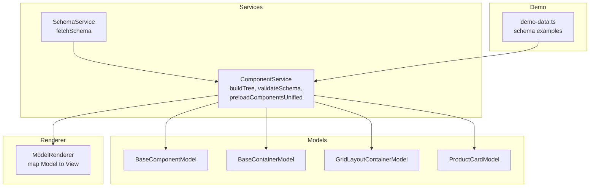
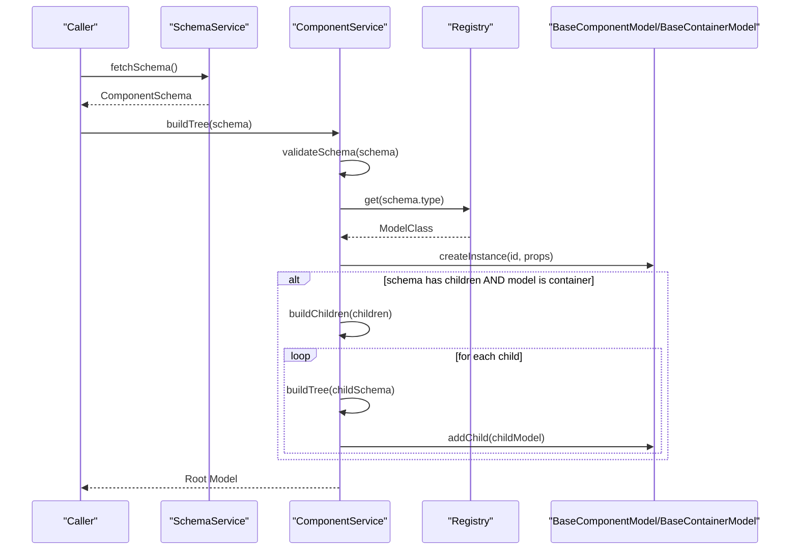
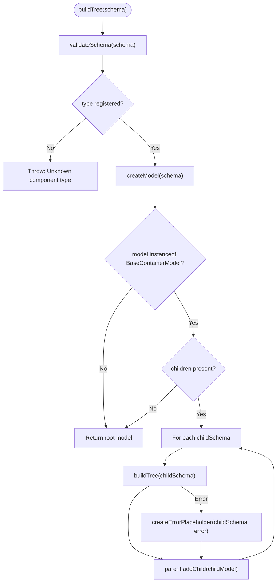
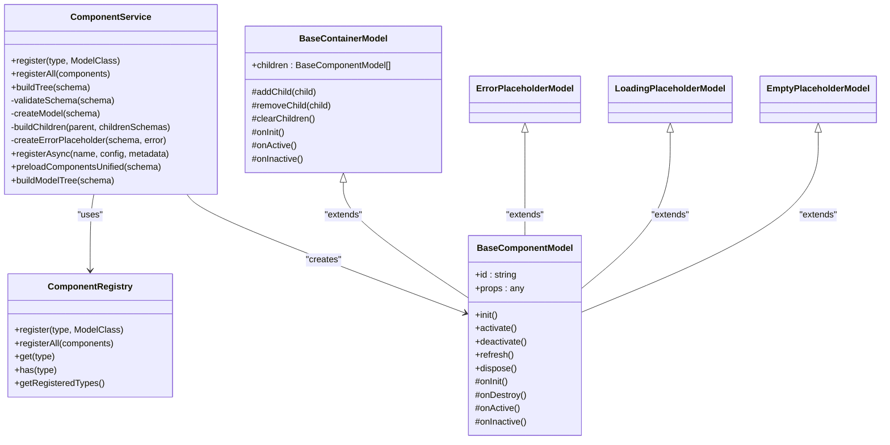

# Schema Definition

<cite>
**Referenced Files in This Document**
- [component.service.ts](file://packages/h5-builder/src/services/component.service.ts)
- [schema.service.ts](file://packages/h5-builder/src/services/schema.service.ts)
- [model.ts](file://packages/h5-builder/src/bedrock/model.ts)
- [demo-data.ts](file://packages/h5-builder/src/mock/demo-data.ts)
- [grid-layout-container.model.ts](file://packages/h5-builder/src/components/grid-layout-container/grid-layout-container.model.ts)
- [product-card.model.ts](file://packages/h5-builder/src/components/product-card/product-card.model.ts)
- [model-renderer.tsx](file://packages/h5-builder/src/components/model-renderer.tsx)
- [component-loader.test.ts](file://packages/h5-builder/src/__tests__/component-loader.test.ts)
</cite>

## Table of Contents
1. [Introduction](#introduction)
2. [Project Structure](#project-structure)
3. [Core Components](#core-components)
4. [Architecture Overview](#architecture-overview)
5. [Detailed Component Analysis](#detailed-component-analysis)
6. [Dependency Analysis](#dependency-analysis)
7. [Performance Considerations](#performance-considerations)
8. [Troubleshooting Guide](#troubleshooting-guide)
9. [Conclusion](#conclusion)

## Introduction
This document explains the Schema Definition centered on the ComponentSchema interface and how it drives dynamic component creation and tree construction. It covers the schema fields (type, id, props, children, meta), validation rules enforced by validateSchema(), error handling for missing fields, and practical examples for container and leaf components. It also provides guidance on using metadata for loading priorities and dependencies.

## Project Structure
The schema-driven rendering pipeline lives primarily in the h5-builder package:
- Services define the schema contract and runtime behavior (ComponentService, SchemaService).
- Models represent component instances (BaseComponentModel, BaseContainerModel).
- Demo data demonstrates real-world schemas for containers and leaf components.
- Renderer maps models to views.

**Diagram sources**
- [component.service.ts](file://packages/h5-builder/src/services/component.service.ts#L28-L46)
- [schema.service.ts](file://packages/h5-builder/src/services/schema.service.ts#L1-L38)
- [model.ts](file://packages/h5-builder/src/bedrock/model.ts#L10-L242)
- [demo-data.ts](file://packages/h5-builder/src/mock/demo-data.ts#L1-L334)
- [model-renderer.tsx](file://packages/h5-builder/src/components/model-renderer.tsx#L1-L105)

**Section sources**
- [component.service.ts](file://packages/h5-builder/src/services/component.service.ts#L28-L46)
- [schema.service.ts](file://packages/h5-builder/src/services/schema.service.ts#L1-L38)
- [model.ts](file://packages/h5-builder/src/bedrock/model.ts#L10-L242)
- [demo-data.ts](file://packages/h5-builder/src/mock/demo-data.ts#L1-L334)
- [model-renderer.tsx](file://packages/h5-builder/src/components/model-renderer.tsx#L1-L105)

## Core Components
- ComponentSchema: The canonical schema shape used to construct component trees.
- ComponentService: Validates schemas, builds models, and manages asynchronous loading and metadata.
- BaseComponentModel/BaseContainerModel: Base classes for all component models; containers manage children.
- SchemaService: Provides a reactive way to fetch and expose a schema.
- Demo data: Real-world examples of schemas for containers and leaf components.
- ModelRenderer: Maps models to views.

**Section sources**
- [component.service.ts](file://packages/h5-builder/src/services/component.service.ts#L28-L46)
- [model.ts](file://packages/h5-builder/src/bedrock/model.ts#L10-L242)
- [schema.service.ts](file://packages/h5-builder/src/services/schema.service.ts#L1-L38)
- [demo-data.ts](file://packages/h5-builder/src/mock/demo-data.ts#L1-L334)
- [model-renderer.tsx](file://packages/h5-builder/src/components/model-renderer.tsx#L1-L105)

## Architecture Overview
The schema drives a deterministic tree construction process:
- A schema is validated for required fields and registered component types.
- A model instance is created for the root component.
- If children exist and the model is a container, children are built recursively.
- Asynchronous loading and metadata influence preloading and rendering.

**Diagram sources**
- [schema.service.ts](file://packages/h5-builder/src/services/schema.service.ts#L17-L32)
- [component.service.ts](file://packages/h5-builder/src/services/component.service.ts#L135-L209)
- [component.service.ts](file://packages/h5-builder/src/services/component.service.ts#L211-L226)

## Detailed Component Analysis

### ComponentSchema Interface
ComponentSchema defines the shape of a component node in the tree. Each field serves a specific purpose:
- type: string
  - Purpose: Identifies the component class to instantiate. Must match a registered type.
  - Validation: Unknown type throws an error during validation.
- id: string
  - Purpose: Unique identifier for the component instance. Used for tracking and error placeholders.
  - Validation: Missing id triggers an error.
- props: Record<string, any>
  - Purpose: Arbitrary props passed to the component model constructor.
  - Behavior: Passed as-is to the model; container models receive children via props only if they support it.
- children?: ComponentSchema[]
  - Purpose: Present only for container components. Recursively constructs child models.
  - Behavior: Only honored when the model is a container; otherwise a warning is logged.
- meta?: ComponentMetadata
  - Purpose: Optional metadata influencing loading behavior (priority, dependencies, preload, delayRange, lazy).
  - Behavior: Consumed by asynchronous loading and preloading strategies.

Validation rules enforced by validateSchema():
- Throws if type is missing.
- Throws if id is missing.
- Throws if the type is not registered.

Error handling for missing fields:
- Missing type or id results in immediate errors.
- Unknown component type triggers an error.
- Child building failures are caught and replaced with an ErrorPlaceholderModel.

Guidance on using metadata for loading priorities and dependencies:
- priority: Controls scheduling and prioritization of loading tasks.
- dependencies: Declares other component types that must be loaded before this one.
- preload: Indicates whether to prefetch resources.
- delayRange: Adds randomized delay to simulate network variability.
- lazy: Allows deferring loading until needed.

Concrete examples:
- Container example (grid layout):
  - See [demo-data.ts](file://packages/h5-builder/src/mock/demo-data.ts#L194-L213) for a grid container with columns and gap props and children product cards.
- Leaf example (product card):
  - See [demo-data.ts](file://packages/h5-builder/src/mock/demo-data.ts#L202-L211) for a product card with productId and showPrice props.

**Section sources**
- [component.service.ts](file://packages/h5-builder/src/services/component.service.ts#L28-L46)
- [component.service.ts](file://packages/h5-builder/src/services/component.service.ts#L211-L226)
- [demo-data.ts](file://packages/h5-builder/src/mock/demo-data.ts#L194-L213)
- [demo-data.ts](file://packages/h5-builder/src/mock/demo-data.ts#L202-L211)

### Dynamic Component Creation and Tree Construction
- Root creation:
  - The service validates the schema and resolves the model class from the registry.
  - An instance is created with id and props.
- Children construction:
  - If the model is a container and children are present, each child schema is processed recursively.
  - Errors during child creation are caught and replaced with an ErrorPlaceholderModel.
- Lifecycle hooks:
  - BaseContainerModel initializes and activates children automatically; containers can override these behaviors.

**Diagram sources**
- [component.service.ts](file://packages/h5-builder/src/services/component.service.ts#L135-L209)
- [component.service.ts](file://packages/h5-builder/src/services/component.service.ts#L211-L226)

**Section sources**
- [component.service.ts](file://packages/h5-builder/src/services/component.service.ts#L135-L209)
- [model.ts](file://packages/h5-builder/src/bedrock/model.ts#L168-L242)

### Example Schemas

#### Container Component: grid-layout-container
- Purpose: Arrange child components in a grid with configurable columns and gap.
- Props: columns (number), gap (optional number).
- Example usage:
  - See [demo-data.ts](file://packages/h5-builder/src/mock/demo-data.ts#L194-L213) for a grid container with two product-card children.

Implementation note:
- The grid container model extends BaseContainerModel and initializes/activates children on lifecycle events.

**Section sources**
- [grid-layout-container.model.ts](file://packages/h5-builder/src/components/grid-layout-container/grid-layout-container.model.ts#L1-L44)
- [demo-data.ts](file://packages/h5-builder/src/mock/demo-data.ts#L194-L213)

#### Leaf Component: product-card
- Purpose: Render product information and handle data fetching and user interactions.
- Props: productId (number), showPrice (optional boolean).
- Example usage:
  - See [demo-data.ts](file://packages/h5-builder/src/mock/demo-data.ts#L202-L211) for a product card with productId and showPrice.

Implementation note:
- The product card model extends BaseComponentModel and implements lifecycle hooks for initialization, data fetching, and tracking.

**Section sources**
- [product-card.model.ts](file://packages/h5-builder/src/components/product-card/product-card.model.ts#L1-L133)
- [demo-data.ts](file://packages/h5-builder/src/mock/demo-data.ts#L202-L211)

### Validation Rules and Error Handling
- validateSchema enforces:
  - type must exist.
  - id must exist.
  - type must be registered.
- buildTree wraps validation and child building; any failure results in an ErrorPlaceholderModel with originalType and error message injected.
- Tests demonstrate acceptance of valid schemas and handling of empty props.

**Section sources**
- [component.service.ts](file://packages/h5-builder/src/services/component.service.ts#L211-L226)
- [component.service.ts](file://packages/h5-builder/src/services/component.service.ts#L135-L209)
- [component-loader.test.ts](file://packages/h5-builder/src/__tests__/component-loader.test.ts#L243-L270)

### Using Metadata for Loading Priorities and Dependencies
- ComponentMetadata fields:
  - priority: 'critical' | 'high' | 'normal' | 'low'
  - dependencies: string[]
  - preload: boolean
  - delayRange: [number, number]
  - lazy: boolean
- ComponentService integrates metadata during registration and asynchronous loading:
  - registerAsync accepts metadata and stores it in a map keyed by component name.
  - During model/view loading, delays can be simulated based on delayRange.
  - Strategies can leverage priority and dependencies to schedule loads.

Practical guidance:
- Use priority to influence preloading order.
- Use dependencies to ensure prerequisite components are loaded first.
- Use delayRange to simulate realistic network conditions during testing.
- Use lazy to defer loading until activation or visibility.

**Section sources**
- [component.service.ts](file://packages/h5-builder/src/services/component.service.ts#L1-L26)
- [component.service.ts](file://packages/h5-builder/src/services/component.service.ts#L272-L317)
- [component.service.ts](file://packages/h5-builder/src/services/component.service.ts#L387-L403)
- [component.service.ts](file://packages/h5-builder/src/services/component.service.ts#L440-L446)

## Dependency Analysis
- ComponentService depends on:
  - Registry to resolve component types to model classes.
  - InstantiationService to create model instances with DI.
  - TrackerService to report component creation and load failures.
  - Placeholder models for error handling.
- Models depend on BaseComponentModel/BaseContainerModel for lifecycle and state.
- Renderer depends on model-view mappings to render components.

**Diagram sources**
- [component.service.ts](file://packages/h5-builder/src/services/component.service.ts#L48-L94)
- [component.service.ts](file://packages/h5-builder/src/services/component.service.ts#L100-L243)
- [model.ts](file://packages/h5-builder/src/bedrock/model.ts#L10-L242)
- [placeholder/index.ts](file://packages/h5-builder/src/placeholder/index.ts#L1-L30)

**Section sources**
- [component.service.ts](file://packages/h5-builder/src/services/component.service.ts#L48-L94)
- [component.service.ts](file://packages/h5-builder/src/services/component.service.ts#L100-L243)
- [model.ts](file://packages/h5-builder/src/bedrock/model.ts#L10-L242)
- [placeholder/index.ts](file://packages/h5-builder/src/placeholder/index.ts#L1-L30)

## Performance Considerations
- Asynchronous loading:
  - ComponentService supports separate model and view loaders and caches results to avoid redundant loads.
  - Preloading APIs enable building model trees and registering model-view mappings in batches with concurrency control.
- Concurrency:
  - Separate queues for model and view loading with configurable concurrency limits.
  - Unified queue mode schedules model and view tasks together while preserving ordering.
- Delays and retries:
  - delayRange simulates network variability; failed loads are handled gracefully with empty models/views and tracked via the tracker service.
- Container lifecycle:
  - BaseContainerModel initializes and activates children in parallel by default, reducing startup latency.

**Section sources**
- [component.service.ts](file://packages/h5-builder/src/services/component.service.ts#L258-L317)
- [component.service.ts](file://packages/h5-builder/src/services/component.service.ts#L370-L470)
- [component.service.ts](file://packages/h5-builder/src/services/component.service.ts#L515-L623)
- [component.service.ts](file://packages/h5-builder/src/services/component.service.ts#L628-L734)
- [model.ts](file://packages/h5-builder/src/bedrock/model.ts#L168-L242)

## Troubleshooting Guide
Common issues and resolutions:
- Missing type or id:
  - Symptom: Error thrown during validation.
  - Resolution: Ensure schema.type and schema.id are present and schema.type is registered.
- Unknown component type:
  - Symptom: Error indicating unknown component type.
  - Resolution: Register the component model via ComponentService.register or registerAsync with metadata.
- Child schema fails to build:
  - Symptom: Child replaced with an error placeholder; parent logs a child build failure.
  - Resolution: Inspect child schema validity and model constructor arguments; verify props and id.
- Asynchronous loading failures:
  - Symptom: Empty model/view cached; tracker reports load failures.
  - Resolution: Verify loader functions and metadata; adjust delayRange or retry strategies.

**Section sources**
- [component.service.ts](file://packages/h5-builder/src/services/component.service.ts#L211-L226)
- [component.service.ts](file://packages/h5-builder/src/services/component.service.ts#L135-L209)
- [component.service.ts](file://packages/h5-builder/src/services/component.service.ts#L370-L470)
- [component-loader.test.ts](file://packages/h5-builder/src/__tests__/component-loader.test.ts#L243-L270)

## Conclusion
The ComponentSchema interface provides a compact, extensible contract for declarative UI composition. ComponentService orchestrates validation, model instantiation, and recursive tree building, while metadata enables sophisticated loading strategies. Containers and leaf components integrate seamlessly through BaseComponentModel and BaseContainerModel, and ModelRenderer bridges models to views. By adhering to the validation rules and leveraging metadata, teams can build robust, scalable, and performant UI experiences.