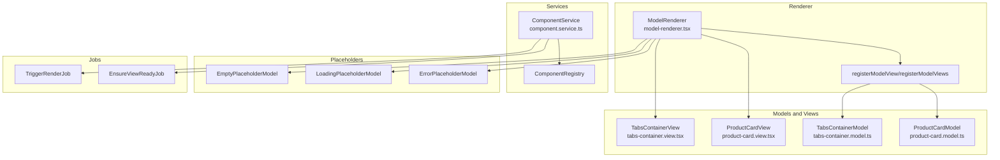
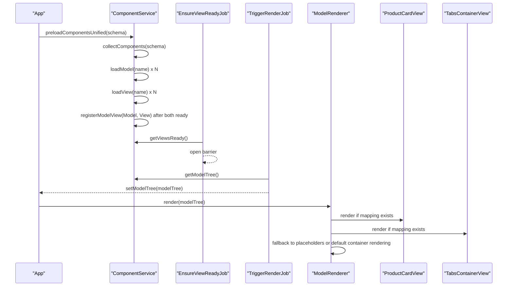
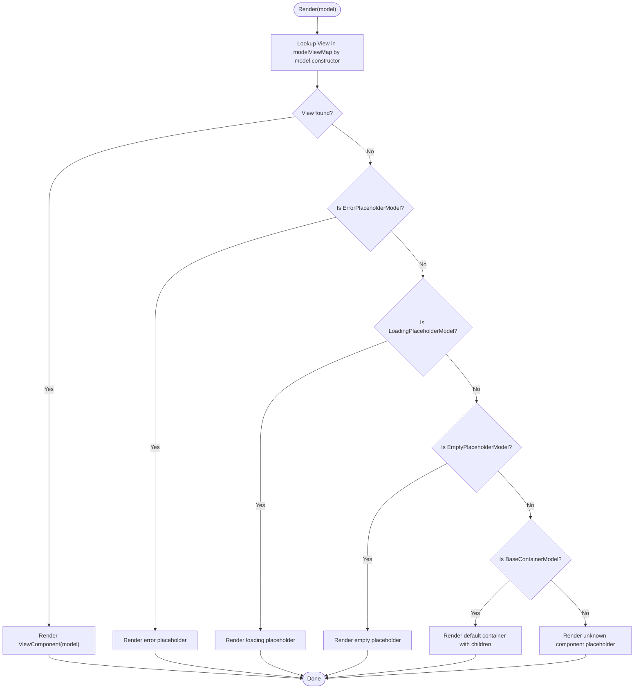
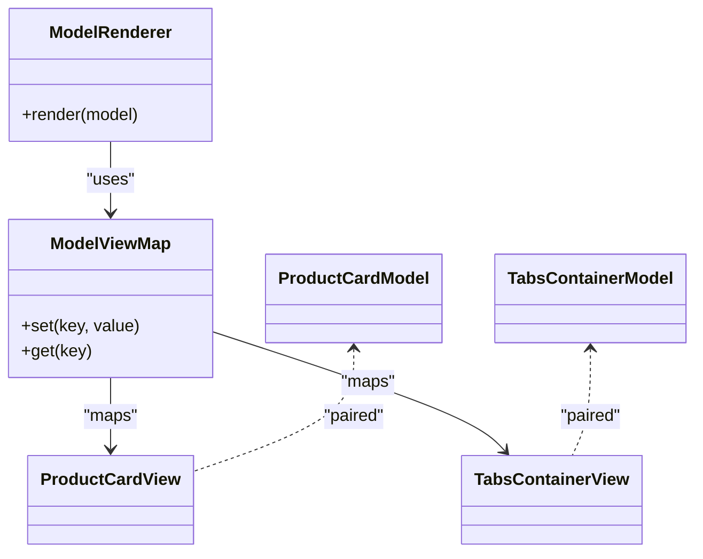
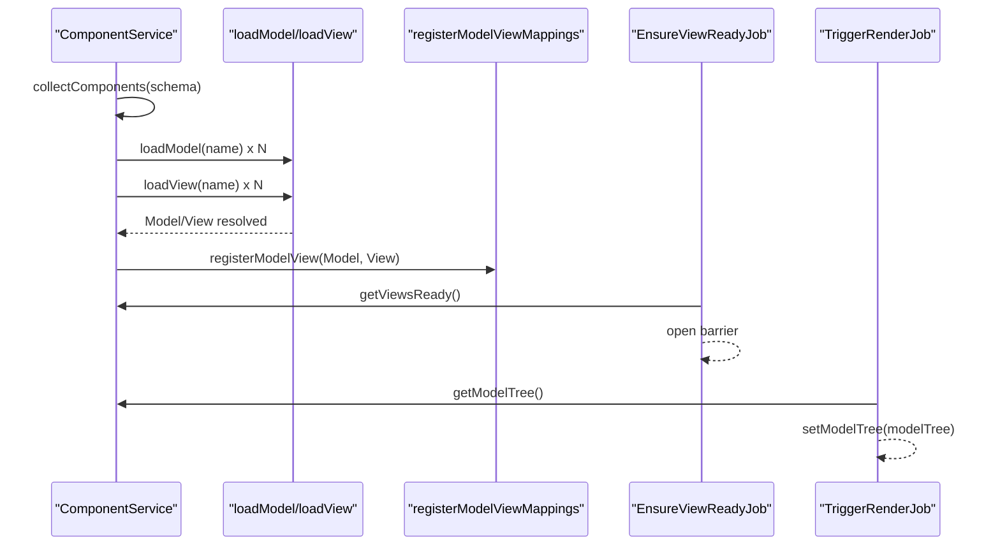
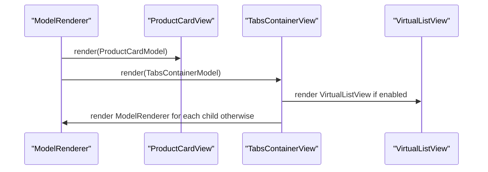
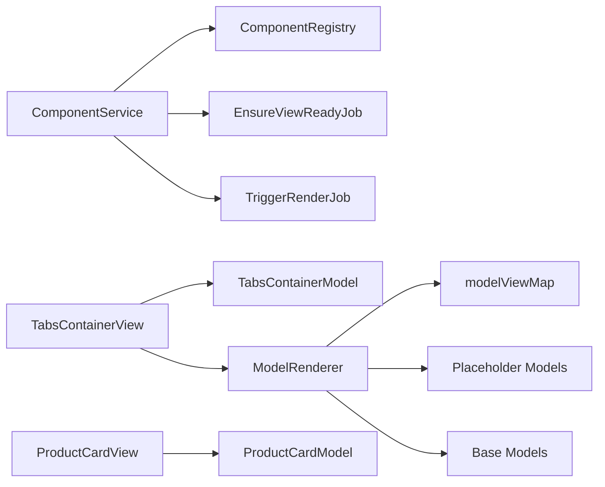

# View Rendering

<cite>
**Referenced Files in This Document**
- [model-renderer.tsx](file://packages/h5-builder/src/components/model-renderer.tsx)
- [component.service.ts](file://packages/h5-builder/src/services/component.service.ts)
- [placeholder/index.ts](file://packages/h5-builder/src/placeholder/index.ts)
- [model.ts](file://packages/h5-builder/src/bedrock/model.ts)
- [product-card.model.ts](file://packages/h5-builder/src/components/product-card/product-card.model.ts)
- [product-card.view.tsx](file://packages/h5-builder/src/components/product-card/product-card.view.tsx)
- [tabs-container.model.ts](file://packages/h5-builder/src/components/tabs-container/tabs-container.model.ts)
- [tabs-container.view.tsx](file://packages/h5-builder/src/components/tabs-container/tabs-container.view.tsx)
- [demo-progressive.tsx](file://packages/h5-builder/src/demo-progressive.tsx)
- [ensure-view-ready.ts](file://packages/h5-builder/src/jobs/ensure-view-ready.ts)
- [trigger-render-job.ts](file://packages/h5-builder/src/jobs/trigger-render-job.ts)
</cite>

## Table of Contents
1. [Introduction](#introduction)
2. [Project Structure](#project-structure)
3. [Core Components](#core-components)
4. [Architecture Overview](#architecture-overview)
5. [Detailed Component Analysis](#detailed-component-analysis)
6. [Dependency Analysis](#dependency-analysis)
7. [Performance Considerations](#performance-considerations)
8. [Troubleshooting Guide](#troubleshooting-guide)
9. [Conclusion](#conclusion)

## Introduction
This document explains the view rendering system with a focus on the ModelRenderer component and the registerModelView function. It details how the modelViewMap maintains Model-to-View mappings, how dynamic rendering works based on model type, and how placeholder components handle error/loading states. It also covers default container rendering behavior, provides examples of registering product-card and tabs-container model-view pairs, and addresses common issues such as unknown component type warnings and improper mapping registration. Finally, it includes performance tips around lazy loading views and the interaction between asynchronous loading and rendering readiness.

## Project Structure
The view rendering system spans several modules:
- Renderer: ModelRenderer and registerModelView live in the components directory.
- Services: ComponentService orchestrates schema-to-model conversion, async loading, and mapping registration.
- Models and Views: Product card and tabs container demonstrate real-world model-view pairs.
- Placeholders: Error, loading, and empty placeholders are used during rendering.
- Jobs: EnsureViewReadyJob and TriggerRenderJob coordinate asynchronous resource loading and render triggers.

**Diagram sources**
- [model-renderer.tsx](file://packages/h5-builder/src/components/model-renderer.tsx#L1-L105)
- [component.service.ts](file://packages/h5-builder/src/services/component.service.ts#L1-L735)
- [product-card.model.ts](file://packages/h5-builder/src/components/product-card/product-card.model.ts#L1-L133)
- [product-card.view.tsx](file://packages/h5-builder/src/components/product-card/product-card.view.tsx#L1-L81)
- [tabs-container.model.ts](file://packages/h5-builder/src/components/tabs-container/tabs-container.model.ts#L1-L273)
- [tabs-container.view.tsx](file://packages/h5-builder/src/components/tabs-container/tabs-container.view.tsx#L1-L85)
- [placeholder/index.ts](file://packages/h5-builder/src/placeholder/index.ts#L1-L30)
- [ensure-view-ready.ts](file://packages/h5-builder/src/jobs/ensure-view-ready.ts#L1-L53)
- [trigger-render-job.ts](file://packages/h5-builder/src/jobs/trigger-render-job.ts#L1-L44)

**Section sources**
- [model-renderer.tsx](file://packages/h5-builder/src/components/model-renderer.tsx#L1-L105)
- [component.service.ts](file://packages/h5-builder/src/services/component.service.ts#L1-L735)

## Core Components
- ModelRenderer: Renders a view based on the model’s constructor. It uses a global modelViewMap to resolve the appropriate view component. If no mapping exists, it falls back to placeholder components for error/loading/empty states. For container models without a registered view, it renders children recursively.
- registerModelView/registerModelViews: Registers a Model class to a React View component in modelViewMap. The renderer uses model.constructor as the key.
- ComponentService: Builds the model tree from schema, supports async loading of models and views, caches loaders and resources, and registers model-view mappings after both are ready. It exposes modelTreeReady and viewsReady promises to coordinate rendering readiness.
- Placeholder models: ErrorPlaceholderModel, LoadingPlaceholderModel, and EmptyPlaceholderModel are used by ModelRenderer to render appropriate placeholders.
- Base models: BaseComponentModel and BaseContainerModel define lifecycle hooks and container composition. TabsContainerModel demonstrates lazy initialization and virtual scrolling integration.

**Section sources**
- [model-renderer.tsx](file://packages/h5-builder/src/components/model-renderer.tsx#L1-L105)
- [component.service.ts](file://packages/h5-builder/src/services/component.service.ts#L1-L735)
- [placeholder/index.ts](file://packages/h5-builder/src/placeholder/index.ts#L1-L30)
- [model.ts](file://packages/h5-builder/src/bedrock/model.ts#L1-L243)
- [tabs-container.model.ts](file://packages/h5-builder/src/components/tabs-container/tabs-container.model.ts#L1-L273)

## Architecture Overview
The rendering pipeline integrates schema parsing, model construction, async resource loading, mapping registration, and React rendering:

**Diagram sources**
- [component.service.ts](file://packages/h5-builder/src/services/component.service.ts#L628-L735)
- [ensure-view-ready.ts](file://packages/h5-builder/src/jobs/ensure-view-ready.ts#L1-L53)
- [trigger-render-job.ts](file://packages/h5-builder/src/jobs/trigger-render-job.ts#L1-L44)
- [model-renderer.tsx](file://packages/h5-builder/src/components/model-renderer.tsx#L1-L105)

## Detailed Component Analysis

### ModelRenderer and modelViewMap
- Purpose: Resolve and render the correct view for a given model. It uses model.constructor as the key in modelViewMap.
- Resolution order:
  1) If a view is registered for the model’s constructor, render it.
  2) If the model is a placeholder type, render a dedicated placeholder UI.
  3) If the model is a container without a registered view, render children recursively with ModelRenderer.
  4) Otherwise, render an “unknown component type” placeholder.
- Placeholder handling:
  - ErrorPlaceholderModel: displays error message and original type.
  - LoadingPlaceholderModel: indicates loading state.
  - EmptyPlaceholderModel: indicates empty/no content.
- Default container rendering: For BaseContainerModel instances without a registered view, ModelRenderer renders a default container wrapper and recursively renders children.

**Diagram sources**
- [model-renderer.tsx](file://packages/h5-builder/src/components/model-renderer.tsx#L50-L105)
- [placeholder/index.ts](file://packages/h5-builder/src/placeholder/index.ts#L1-L30)
- [model.ts](file://packages/h5-builder/src/bedrock/model.ts#L158-L243)

**Section sources**
- [model-renderer.tsx](file://packages/h5-builder/src/components/model-renderer.tsx#L1-L105)
- [placeholder/index.ts](file://packages/h5-builder/src/placeholder/index.ts#L1-L30)
- [model.ts](file://packages/h5-builder/src/bedrock/model.ts#L1-L243)

### registerModelView and modelViewMap
- Registration: registerModelView(ModelClass, ViewComponent) adds an entry to modelViewMap keyed by ModelClass. registerModelViews accepts an array of [ModelClass, ViewComponent] pairs.
- Default registrations: The renderer registers default mappings for ProductCardModel/ProductCardView and TabsContainerModel/TabsContainerView during module initialization.
- Usage: ModelRenderer reads model.constructor as the key to find the corresponding view.

**Diagram sources**
- [model-renderer.tsx](file://packages/h5-builder/src/components/model-renderer.tsx#L1-L105)
- [product-card.model.ts](file://packages/h5-builder/src/components/product-card/product-card.model.ts#L1-L133)
- [product-card.view.tsx](file://packages/h5-builder/src/components/product-card/product-card.view.tsx#L1-L81)
- [tabs-container.model.ts](file://packages/h5-builder/src/components/tabs-container/tabs-container.model.ts#L1-L273)
- [tabs-container.view.tsx](file://packages/h5-builder/src/components/tabs-container/tabs-container.view.tsx#L1-L85)

**Section sources**
- [model-renderer.tsx](file://packages/h5-builder/src/components/model-renderer.tsx#L1-L105)

### Async loading, mapping registration, and rendering readiness
- ComponentService supports async loading of models and views via loaders and caches. It exposes:
  - preloadComponentsUnified(schema): collects unique component names, loads models and views concurrently, and returns modelTreeReady and viewsReady promises.
  - registerModelViewMappings(componentNames): registers model-view mappings after both are loaded.
  - getViewsReady(): resolves when all views are ready.
  - getModelTreeReady(): resolves when all models are ready.
- EnsureViewReadyJob waits for viewsReady before opening the render barrier.
- TriggerRenderJob retrieves the built model tree and sets it to trigger React rendering.

**Diagram sources**
- [component.service.ts](file://packages/h5-builder/src/services/component.service.ts#L628-L735)
- [ensure-view-ready.ts](file://packages/h5-builder/src/jobs/ensure-view-ready.ts#L1-L53)
- [trigger-render-job.ts](file://packages/h5-builder/src/jobs/trigger-render-job.ts#L1-L44)

**Section sources**
- [component.service.ts](file://packages/h5-builder/src/services/component.service.ts#L258-L735)
- [ensure-view-ready.ts](file://packages/h5-builder/src/jobs/ensure-view-ready.ts#L1-L53)
- [trigger-render-job.ts](file://packages/h5-builder/src/jobs/trigger-render-job.ts#L1-L44)

### Example: Registering product-card and tabs-container model-view pairs
- Product card:
  - Model: ProductCardModel
  - View: ProductCardView
  - Registration: The renderer registers these defaults automatically.
- Tabs container:
  - Model: TabsContainerModel
  - View: TabsContainerView
  - Registration: The renderer registers these defaults automatically.
- TabsContainerView demonstrates conditional rendering:
  - If a tab has virtual scrolling enabled, it renders VirtualListView with a renderer that delegates to ModelRenderer for each item.
  - Otherwise, it renders ModelRenderer directly for the tab’s children.

**Diagram sources**
- [model-renderer.tsx](file://packages/h5-builder/src/components/model-renderer.tsx#L1-L105)
- [product-card.view.tsx](file://packages/h5-builder/src/components/product-card/product-card.view.tsx#L1-L81)
- [tabs-container.view.tsx](file://packages/h5-builder/src/components/tabs-container/tabs-container.view.tsx#L1-L85)

**Section sources**
- [model-renderer.tsx](file://packages/h5-builder/src/components/model-renderer.tsx#L33-L41)
- [product-card.model.ts](file://packages/h5-builder/src/components/product-card/product-card.model.ts#L1-L133)
- [product-card.view.tsx](file://packages/h5-builder/src/components/product-card/product-card.view.tsx#L1-L81)
- [tabs-container.model.ts](file://packages/h5-builder/src/components/tabs-container/tabs-container.model.ts#L1-L273)
- [tabs-container.view.tsx](file://packages/h5-builder/src/components/tabs-container/tabs-container.view.tsx#L1-L85)

### Container rendering and lazy loading
- BaseContainerModel initializes and activates children by default. Subclasses can override this behavior.
- TabsContainerModel overrides initialization to:
  - Detect virtual scrolling thresholds and enable virtual lists for tabs with many children.
  - Initialize only the active tab on first activation.
  - Schedule pre-warming of neighboring tabs and a timeout fallback to warm others.
- This lazy-loading behavior ensures that rendering remains responsive while still allowing ModelRenderer to render children when no view is registered.

**Section sources**
- [model.ts](file://packages/h5-builder/src/bedrock/model.ts#L158-L243)
- [tabs-container.model.ts](file://packages/h5-builder/src/components/tabs-container/tabs-container.model.ts#L1-L273)
- [model-renderer.tsx](file://packages/h5-builder/src/components/model-renderer.tsx#L86-L96)

## Dependency Analysis
- Renderer depends on:
  - modelViewMap for resolving views.
  - Placeholder models for fallback UI.
  - Base models for container rendering.
- ComponentService depends on:
  - ComponentRegistry for type-to-model mapping.
  - Async loaders for models and views.
  - Jobs to coordinate readiness and rendering.
- ProductCardView and TabsContainerView depend on their respective models and on ModelRenderer for recursive rendering.

**Diagram sources**
- [model-renderer.tsx](file://packages/h5-builder/src/components/model-renderer.tsx#L1-L105)
- [component.service.ts](file://packages/h5-builder/src/services/component.service.ts#L1-L735)
- [product-card.view.tsx](file://packages/h5-builder/src/components/product-card/product-card.view.tsx#L1-L81)
- [tabs-container.view.tsx](file://packages/h5-builder/src/components/tabs-container/tabs-container.view.tsx#L1-L85)

**Section sources**
- [model-renderer.tsx](file://packages/h5-builder/src/components/model-renderer.tsx#L1-L105)
- [component.service.ts](file://packages/h5-builder/src/services/component.service.ts#L1-L735)

## Performance Considerations
- Asynchronous loading:
  - Use preloadComponentsUnified to load models and views concurrently with controlled concurrency limits.
  - Separate model and view loading allows independent caching and fallback strategies.
- Lazy loading:
  - Override container initialization to initialize only active children (as TabsContainerModel does).
  - Use virtual scrolling for large lists inside containers to reduce DOM and reflow costs.
- Rendering readiness:
  - Ensure viewsReady resolves before triggering render to avoid partial UI flashes.
  - Use getViewsReady and getViewsReady to coordinate render timing with jobs.
- Concurrency and batching:
  - ComponentService uses Promise-based queues with race semantics to keep throughput high while respecting concurrency limits.

[No sources needed since this section provides general guidance]

## Troubleshooting Guide
Common issues and resolutions:
- Unknown component type warning:
  - Cause: The model type is not registered in ComponentRegistry or no view mapping exists in modelViewMap.
  - Resolution: Ensure the component type is registered via ComponentService.register or ComponentService.registerAsync, and that registerModelView(Model, View) is called or defaults are used.
  - Evidence: ModelRenderer falls back to an “unknown component type” placeholder when no mapping is found.
- Improper mapping registration:
  - Cause: registerModelView was not called with the correct Model class or View component.
  - Resolution: Verify that the Model class passed to registerModelView is the constructor used by ComponentService to instantiate the model. Confirm the View component is a React component and exported correctly.
- Asynchronous loading failures:
  - Cause: Model or View loader threw or returned undefined.
  - Resolution: ComponentService creates empty placeholders and logs errors; ensure loaders are configured and metadata is correct. Check delayRange and retry strategies.
- Render timing issues:
  - Cause: Rendering before viewsReady completes.
  - Resolution: Use EnsureViewReadyJob to wait for viewsReady and TriggerRenderJob to set the model tree.

**Section sources**
- [model-renderer.tsx](file://packages/h5-builder/src/components/model-renderer.tsx#L98-L105)
- [component.service.ts](file://packages/h5-builder/src/services/component.service.ts#L370-L513)
- [ensure-view-ready.ts](file://packages/h5-builder/src/jobs/ensure-view-ready.ts#L1-L53)
- [trigger-render-job.ts](file://packages/h5-builder/src/jobs/trigger-render-job.ts#L1-L44)

## Conclusion
The view rendering system centers on ModelRenderer and modelViewMap to dynamically select the correct view for each model. ComponentService coordinates schema parsing, model construction, and asynchronous loading of models and views, ensuring that rendering occurs only when all resources are ready. Placeholder models provide robust fallbacks for error, loading, and empty states. Default mappings for product-card and tabs-container simplify adoption, while container-specific behaviors (lazy initialization and virtual scrolling) improve performance. Proper registration of model-view pairs and careful orchestration of async loading and rendering readiness are essential for reliable, performant rendering.