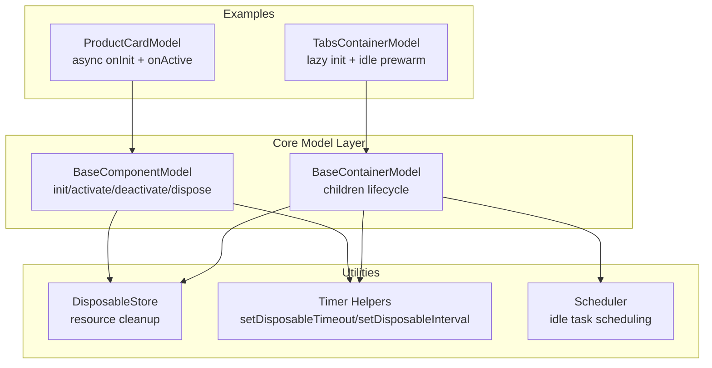
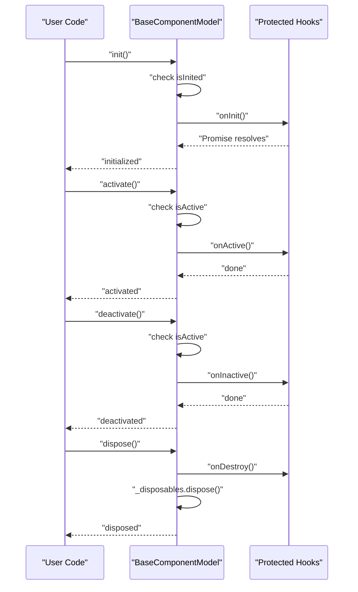
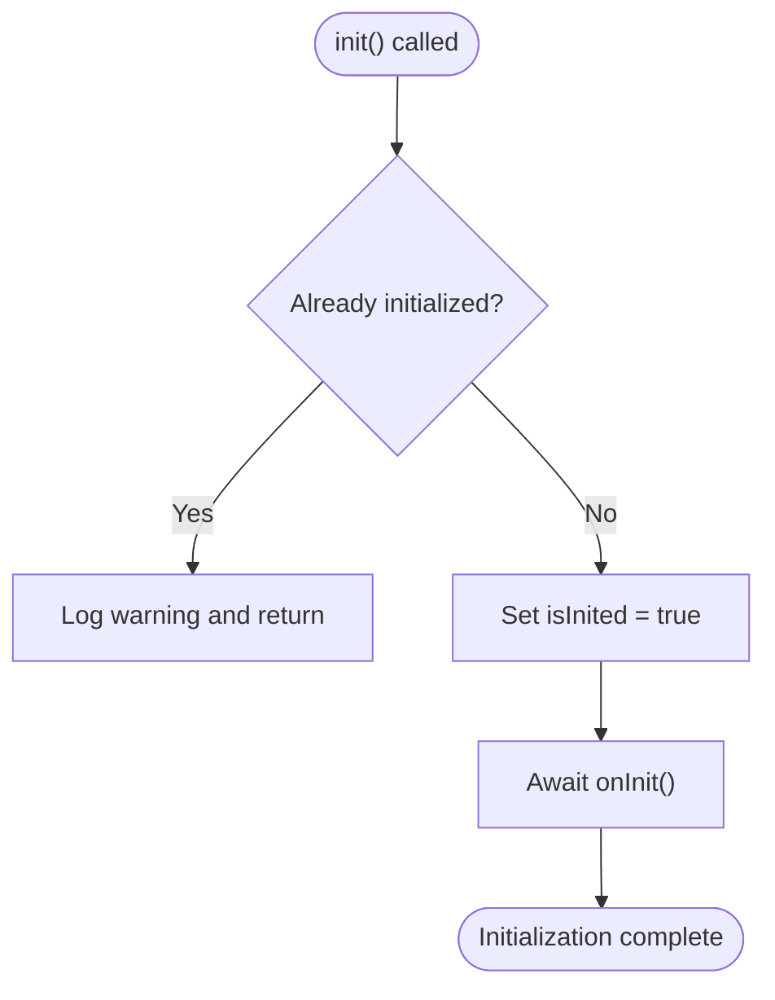
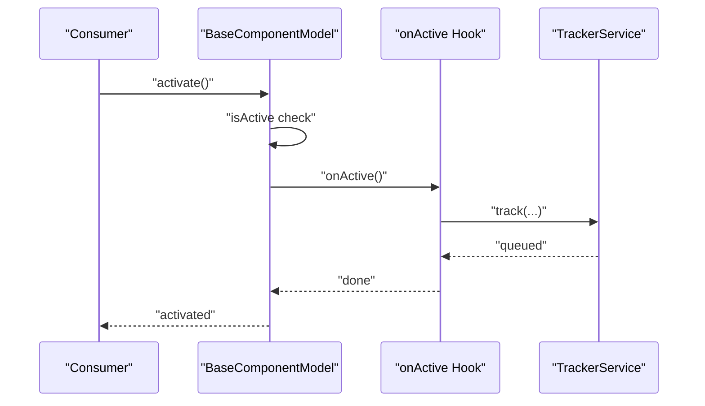
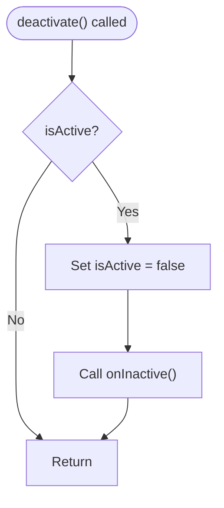
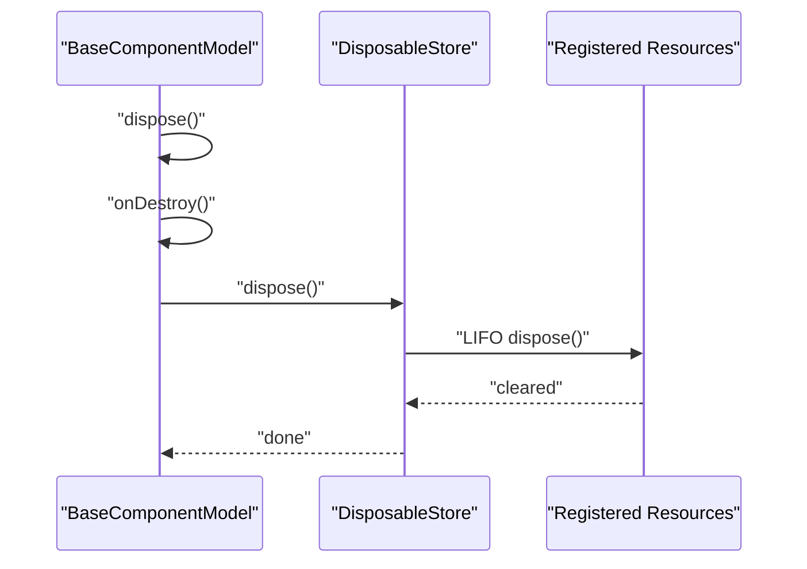
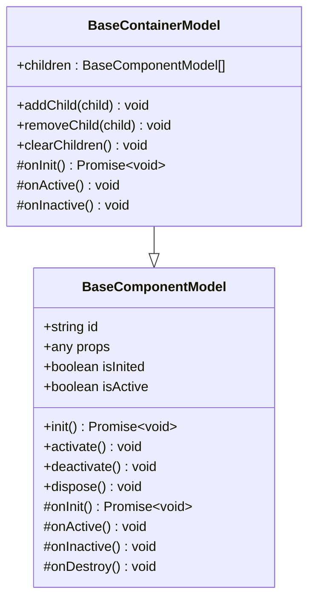
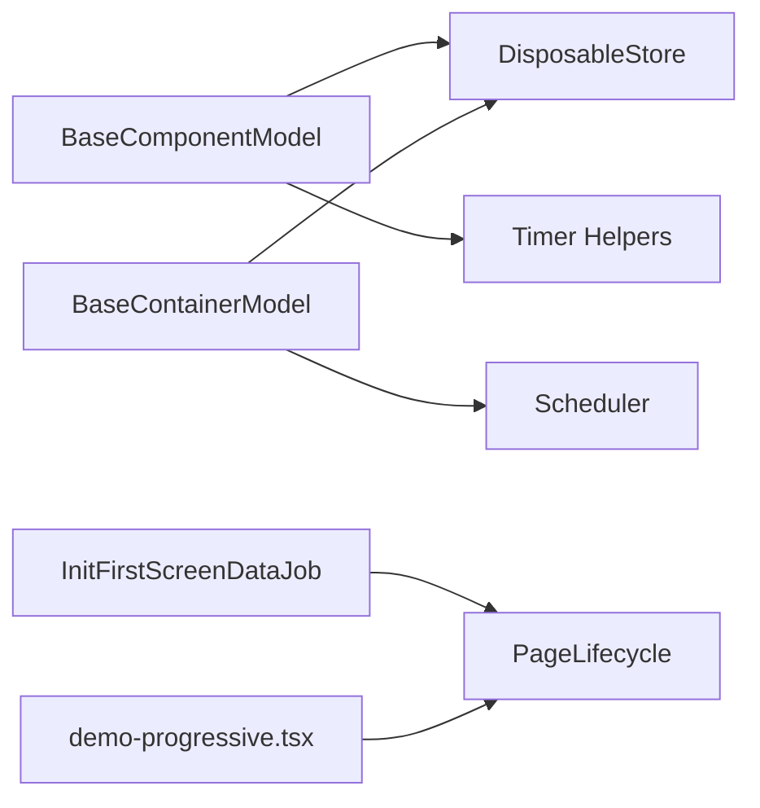

# Component Lifecycle

<cite>
**Referenced Files in This Document**
- [component_development_guide.md](file://packages/h5-builder/docs/component_development_guide.md)
- [model.ts](file://packages/h5-builder/src/bedrock/model.ts)
- [product-card.model.ts](file://packages/h5-builder/src/components/product-card/product-card.model.ts)
- [tabs-container.model.ts](file://packages/h5-builder/src/components/tabs-container/tabs-container.model.ts)
- [tracker.service.ts](file://packages/h5-builder/src/services/tracker.service.ts)
- [disposable-store.ts](file://packages/h5-builder/src/bedrock/dispose/disposable-store.ts)
- [timer.ts](file://packages/h5-builder/src/bedrock/dispose/timer.ts)
- [scheduler.ts](file://packages/h5-builder/src/bedrock/scheduler/core/scheduler.ts)
- [lifecycle.ts](file://packages/h5-builder/src/jobs/lifecycle.ts)
- [init-first-screen-data-job.ts](file://packages/h5-builder/src/jobs/init-first-screen-data-job.ts)
- [demo-progressive.tsx](file://packages/h5-builder/src/demo-progressive.tsx)
- [model.test.ts](file://packages/h5-builder/src/__tests__/model.test.ts)
</cite>

## Table of Contents
1. [Introduction](#introduction)
2. [Project Structure](#project-structure)
3. [Core Components](#core-components)
4. [Architecture Overview](#architecture-overview)
5. [Detailed Component Analysis](#detailed-component-analysis)
6. [Dependency Analysis](#dependency-analysis)
7. [Performance Considerations](#performance-considerations)
8. [Troubleshooting Guide](#troubleshooting-guide)
9. [Conclusion](#conclusion)

## Introduction
This document explains the Component Lifecycle in the H5 Builder framework, focusing on the four phases: initialization (init/onInit), activation (activate/onActive), deactivation (deactivate/onInactive), and disposal (dispose/onDestroy). It clarifies the purpose of each phase, documents the internal call sequence where public methods wrap protected hooks, and outlines best practices for robust lifecycle management. It also covers error handling, memory leak prevention, and performance considerations such as lazy initialization and idle-time task scheduling.

## Project Structure
The lifecycle is implemented in the core model layer and reinforced by supporting utilities for resource management, timers, and scheduling. The component development guide provides practical examples and patterns.

**Diagram sources**
- [model.ts](file://packages/h5-builder/src/bedrock/model.ts#L1-L156)
- [model.ts](file://packages/h5-builder/src/bedrock/model.ts#L157-L242)
- [disposable-store.ts](file://packages/h5-builder/src/bedrock/dispose/disposable-store.ts#L1-L84)
- [timer.ts](file://packages/h5-builder/src/bedrock/dispose/timer.ts#L1-L16)
- [scheduler.ts](file://packages/h5-builder/src/bedrock/scheduler/core/scheduler.ts#L1-L174)
- [product-card.model.ts](file://packages/h5-builder/src/components/product-card/product-card.model.ts#L1-L59)
- [tabs-container.model.ts](file://packages/h5-builder/src/components/tabs-container/tabs-container.model.ts#L1-L273)

**Section sources**
- [model.ts](file://packages/h5-builder/src/bedrock/model.ts#L1-L156)
- [model.ts](file://packages/h5-builder/src/bedrock/model.ts#L157-L242)

## Core Components
- BaseComponentModel: Public lifecycle API and protected hooks. It ensures init runs once, manages isActive/isInited flags, and orchestrates resource cleanup via DisposableStore.
- BaseContainerModel: Extends BaseComponentModel to manage children lifecycle automatically (init/activate/deactivate) and registers child disposal.
- DisposableStore: Centralized resource registry with LIFO disposal semantics and safe disposal behavior.
- Timer helpers: Safe wrappers for setTimeout/setInterval that return IDisposable for automatic cleanup.
- Scheduler: Host-aware task scheduler enabling idle-time task scheduling and yielding to host input.

**Section sources**
- [model.ts](file://packages/h5-builder/src/bedrock/model.ts#L1-L156)
- [model.ts](file://packages/h5-builder/src/bedrock/model.ts#L157-L242)
- [disposable-store.ts](file://packages/h5-builder/src/bedrock/dispose/disposable-store.ts#L1-L84)
- [timer.ts](file://packages/h5-builder/src/bedrock/dispose/timer.ts#L1-L16)
- [scheduler.ts](file://packages/h5-builder/src/bedrock/scheduler/core/scheduler.ts#L1-L174)

## Architecture Overview
The lifecycle follows a strict public-to-protected call sequence:
- init() sets isInited and calls onInit() (async).
- activate() sets isActive and calls onActive().
- deactivate() clears isActive and calls onInactive().
- dispose() calls onDestroy() and disposes all registered resources.

**Diagram sources**
- [model.ts](file://packages/h5-builder/src/bedrock/model.ts#L60-L155)

## Detailed Component Analysis

### Initialization: init/onInit (data fetching)
- Purpose: Initialize component state, load data, subscribe to events, and prepare resources. The guide demonstrates async onInit for data loading and refresh patterns.
- Internal call sequence: init() guards against re-entry, sets isInited, and awaits onInit().
- Best practices:
  - Use refresh() to centralize loading state management (loading/error/data).
  - Register timers and event subscriptions so they are cleaned up automatically.
  - Avoid side effects in constructors; keep heavy work in onInit.

**Diagram sources**
- [model.ts](file://packages/h5-builder/src/bedrock/model.ts#L60-L85)
- [component_development_guide.md](file://packages/h5-builder/docs/component_development_guide.md#L173-L206)

**Section sources**
- [model.ts](file://packages/h5-builder/src/bedrock/model.ts#L60-L85)
- [component_development_guide.md](file://packages/h5-builder/docs/component_development_guide.md#L173-L206)

### Activation: activate/onActive (exposure tracking)
- Purpose: Resume activity when the component becomes visible or active (e.g., tab switch). The guide shows onActive() for reporting exposure.
- Internal call sequence: activate() guards against re-activation, sets isActive, and calls onActive().
- Best practices:
  - Re-establish timers and subscriptions in onActive().
  - Use TrackerService to batch and persist events.

**Diagram sources**
- [model.ts](file://packages/h5-builder/src/bedrock/model.ts#L75-L97)
- [product-card.model.ts](file://packages/h5-builder/src/components/product-card/product-card.model.ts#L42-L59)
- [tracker.service.ts](file://packages/h5-builder/src/services/tracker.service.ts#L68-L86)

**Section sources**
- [model.ts](file://packages/h5-builder/src/bedrock/model.ts#L75-L97)
- [product-card.model.ts](file://packages/h5-builder/src/components/product-card/product-card.model.ts#L42-L59)
- [tracker.service.ts](file://packages/h5-builder/src/services/tracker.service.ts#L68-L86)

### Deactivation: deactivate/onInactive (cleanup on hide)
- Purpose: Pause activity when the component becomes hidden or inactive. The guide shows onInactive() as a counterpart to onActive().
- Internal call sequence: deactivate() guards against re-deactivation, clears isActive, and calls onInactive().
- Best practices:
  - Cancel timers and unsubscribe in onInactive() to prevent leaks.
  - Avoid long-running work here; defer to dispose() if needed.

**Diagram sources**
- [model.ts](file://packages/h5-builder/src/bedrock/model.ts#L87-L100)

**Section sources**
- [model.ts](file://packages/h5-builder/src/bedrock/model.ts#L87-L100)

### Disposal: dispose/onDestroy (memory leak prevention)
- Purpose: Final cleanup and teardown. Calls onDestroy() and disposes all registered resources in LIFO order.
- Internal call sequence: dispose() checks disposal state, calls onDestroy(), then _disposables.dispose().
- Best practices:
  - Always register timers and event subscriptions via register().
  - Do not manually clear resources; rely on DisposableStore.

**Diagram sources**
- [model.ts](file://packages/h5-builder/src/bedrock/model.ts#L45-L74)
- [disposable-store.ts](file://packages/h5-builder/src/bedrock/dispose/disposable-store.ts#L20-L58)

**Section sources**
- [model.ts](file://packages/h5-builder/src/bedrock/model.ts#L45-L74)
- [disposable-store.ts](file://packages/h5-builder/src/bedrock/dispose/disposable-store.ts#L20-L58)

### Container Lifecycle: BaseContainerModel
- Purpose: Manage children lifecycle uniformly. Defaults:
  - onInit: initialize all children in parallel.
  - onActive: activate all children.
  - onInactive: deactivate all children.
- Best practices:
  - Override defaults to implement lazy loading or selective activation.
  - Use addChild() to automatically register child disposal.

**Diagram sources**
- [model.ts](file://packages/h5-builder/src/bedrock/model.ts#L157-L242)

**Section sources**
- [model.ts](file://packages/h5-builder/src/bedrock/model.ts#L157-L242)

### Practical Example: ProductCardModel
- Demonstrates async onInit for data loading and onActive for exposure tracking.
- Uses refresh() to centralize loading state and error handling.

**Section sources**
- [product-card.model.ts](file://packages/h5-builder/src/components/product-card/product-card.model.ts#L42-L59)
- [component_development_guide.md](file://packages/h5-builder/docs/component_development_guide.md#L68-L92)

### Practical Example: TabsContainerModel
- Implements lazy initialization of the active tab and idle-time prewarming of others.
- Switches tabs by deactivating the old child and activating the new one.

**Section sources**
- [tabs-container.model.ts](file://packages/h5-builder/src/components/tabs-container/tabs-container.model.ts#L68-L96)
- [tabs-container.model.ts](file://packages/h5-builder/src/components/tabs-container/tabs-container.model.ts#L181-L203)
- [tabs-container.model.ts](file://packages/h5-builder/src/components/tabs-container/tabs-container.model.ts#L205-L248)

## Dependency Analysis
- BaseComponentModel depends on DisposableStore for resource management and exposes register() for cleanup.
- Timer helpers integrate with DisposableStore to ensure timers are canceled on dispose.
- Scheduler enables idle-time task scheduling for prewarming and background work.
- Page lifecycle jobs coordinate initialization phases and idle tasks.

**Diagram sources**
- [model.ts](file://packages/h5-builder/src/bedrock/model.ts#L1-L156)
- [disposable-store.ts](file://packages/h5-builder/src/bedrock/dispose/disposable-store.ts#L1-L84)
- [timer.ts](file://packages/h5-builder/src/bedrock/dispose/timer.ts#L1-L16)
- [scheduler.ts](file://packages/h5-builder/src/bedrock/scheduler/core/scheduler.ts#L1-L174)
- [init-first-screen-data-job.ts](file://packages/h5-builder/src/jobs/init-first-screen-data-job.ts#L1-L50)
- [lifecycle.ts](file://packages/h5-builder/src/jobs/lifecycle.ts#L1-L18)
- [demo-progressive.tsx](file://packages/h5-builder/src/demo-progressive.tsx#L159-L185)

**Section sources**
- [model.ts](file://packages/h5-builder/src/bedrock/model.ts#L1-L156)
- [disposable-store.ts](file://packages/h5-builder/src/bedrock/dispose/disposable-store.ts#L1-L84)
- [timer.ts](file://packages/h5-builder/src/bedrock/dispose/timer.ts#L1-L16)
- [scheduler.ts](file://packages/h5-builder/src/bedrock/scheduler/core/scheduler.ts#L1-L174)
- [init-first-screen-data-job.ts](file://packages/h5-builder/src/jobs/init-first-screen-data-job.ts#L1-L50)
- [lifecycle.ts](file://packages/h5-builder/src/jobs/lifecycle.ts#L1-L18)
- [demo-progressive.tsx](file://packages/h5-builder/src/demo-progressive.tsx#L159-L185)

## Performance Considerations
- Lazy initialization:
  - Initialize only the active child in containers (e.g., TabsContainer) to reduce startup cost.
  - Use scheduler.scheduleIdleTask() for background warm-up of offscreen children.
- Idle-time task scheduling:
  - Use Scheduler to yield to host and schedule low-priority work.
  - Prefer idle callbacks for non-urgent tasks to avoid blocking UI.
- Resource cleanup:
  - Always register timers and event subscriptions to prevent leaks and reduce GC pressure.
- Data fetching:
  - Use refresh() to centralize loading state and error handling, avoiding redundant requests.

**Section sources**
- [tabs-container.model.ts](file://packages/h5-builder/src/components/tabs-container/tabs-container.model.ts#L205-L248)
- [scheduler.ts](file://packages/h5-builder/src/bedrock/scheduler/core/scheduler.ts#L1-L174)
- [model.ts](file://packages/h5-builder/src/bedrock/model.ts#L100-L121)

## Troubleshooting Guide
Common issues and remedies:
- Infinite loops in onInit:
  - Ensure onInit does not call methods that indirectly cause another init.
  - Use isInited guard and avoid recursive initialization.
- Missing cleanup code:
  - Register all timers and event subscriptions via register() to ensure automatic disposal.
- Incorrect use of lifecycle methods:
  - Do not perform heavy work in constructors; move to onInit.
  - Use onActive() to resume timers/subscriptions; use onInactive() to pause them.
- Error handling:
  - Wrap async operations in onInit with try/catch and surface errors via refresh() to update loading/error states.
  - Dispose() throws if any registered resource throws; review logs and fix resource disposal.

**Section sources**
- [model.ts](file://packages/h5-builder/src/bedrock/model.ts#L60-L155)
- [disposable-store.ts](file://packages/h5-builder/src/bedrock/dispose/disposable-store.ts#L44-L58)
- [component_development_guide.md](file://packages/h5-builder/docs/component_development_guide.md#L354-L376)
- [model.test.ts](file://packages/h5-builder/src/__tests__/model.test.ts#L51-L111)

## Conclusion
The H5 Builder lifecycle provides a robust, predictable pattern for component initialization, activation, deactivation, and disposal. By leveraging protected hooks, resource registration, and scheduler-backed idle tasks, developers can build responsive, memory-efficient components. Following the best practices outlined here ensures clean separation of concerns, reliable error handling, and optimal performance across complex UI scenarios.