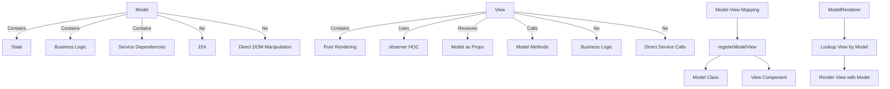
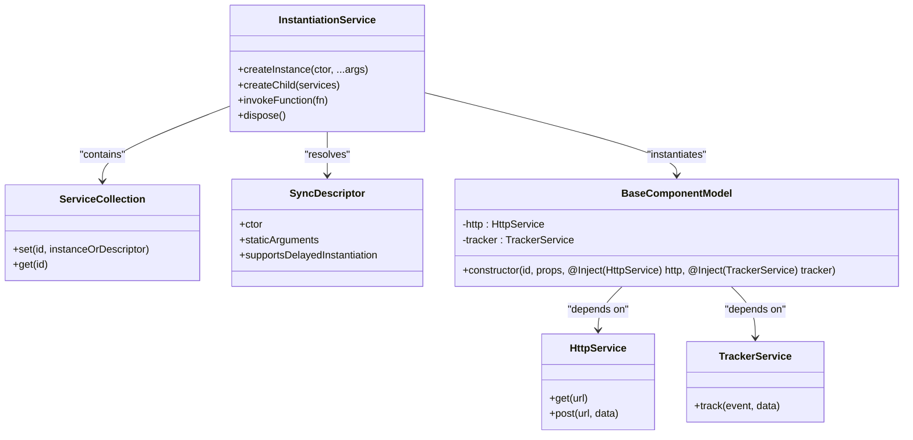
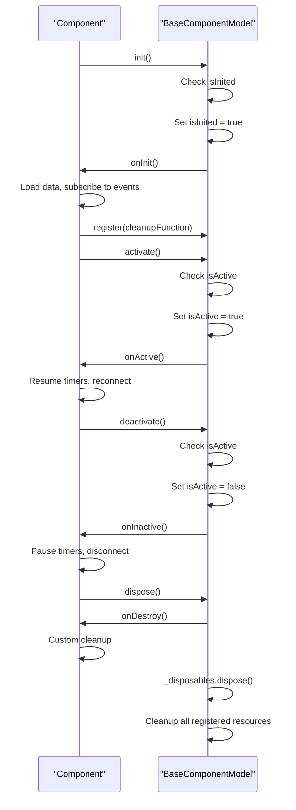
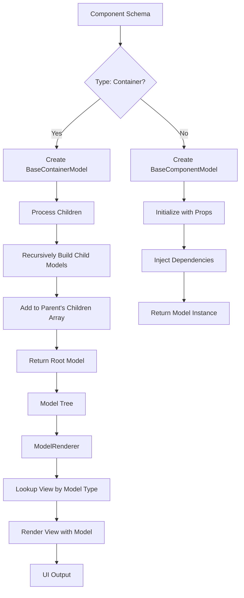

# Core Concepts

<cite>
**Referenced Files in This Document**   
- [model-renderer.tsx](file://packages/h5-builder/src/components/model-renderer.tsx)
- [model.ts](file://packages/h5-builder/src/bedrock/model.ts)
- [component.service.ts](file://packages/h5-builder/src/services/component.service.ts)
- [instantiation-service.ts](file://packages/h5-builder/src/bedrock/di/instantiation-service.ts)
- [component_development_guide.md](file://packages/h5-builder/docs/component_development_guide.md)
- [README.md](file://packages/h5-builder/README.md)
- [lifecycle.ts](file://packages/h5-builder/src/jobs/lifecycle.ts)
- [schema.service.ts](file://packages/h5-builder/src/services/schema.service.ts)
</cite>

## Table of Contents
1. [Model-View Separation](#model-view-separation)
2. [Dependency Injection](#dependency-injection)
3. [Component Lifecycle](#component-lifecycle)
4. [Schema-Driven Architecture](#schema-driven-architecture)

## Model-View Separation

The H5 Builder framework enforces a strict separation between business logic (Model) and UI rendering (View), following the principle of complete decoupling between UI and logic. This architectural pattern ensures that Models contain only state and business logic, while Views are pure rendering functions that respond to state changes via the observer pattern.

In this implementation, Models extend from `BaseComponentModel` and are responsible for managing data loading, state management, business logic execution, and service interactions such as HTTP requests and tracking. Models contain no JSX and do not directly manipulate DOM elements. They expose state properties and methods that can be invoked by the View layer. The framework uses `mobx-vue-lite` to make the entire Model object reactive, automatically triggering UI updates when state changes occur.

Views are implemented as React functional components wrapped with the `observer` higher-order component from `mobx-vue-lite`. This enables the View to automatically re-render when observed Model properties change. Views receive the Model as a prop and are responsible solely for rendering UI elements and forwarding user interactions back to the Model by calling its methods. The View layer contains no business logic and does not directly call services.

The framework establishes the Model-View relationship through a mapping system implemented in `model-renderer.tsx`. The `registerModelView` function creates a registry that maps Model classes to their corresponding View components. During rendering, the `ModelRenderer` component looks up the appropriate View component based on the Model's constructor and renders it with the Model as a prop. This decoupled approach allows for flexible component composition and enables features like error boundaries and placeholder rendering when specific Views are not available.

**Diagram sources**
- [model-renderer.tsx](file://packages/h5-builder/src/components/model-renderer.tsx#L15-L31)
- [model.ts](file://packages/h5-builder/src/bedrock/model.ts#L10-L243)

**Section sources**
- [model-renderer.tsx](file://packages/h5-builder/src/components/model-renderer.tsx#L1-L105)
- [component_development_guide.md](file://packages/h5-builder/docs/component_development_guide.md#L11-L21)
- [README.md](file://packages/h5-builder/README.md#L11-L12)

## Dependency Injection

The H5 Builder framework implements a decorator-based dependency injection system using the `@Inject` decorator and an `Injector` (implemented as `InstantiationService`) to manage service registration and resolution. This system enables loose coupling between components by allowing dependencies to be injected rather than hard-coded, promoting testability and maintainability.

The dependency injection mechanism is built around several key components. The `@Inject` decorator is used in constructor parameters to declare dependencies, as shown in the component development guide where services like `HttpService` and `TrackerService` are injected into component Models. The `InstantiationService` class serves as the core injector that manages service instances and their lifecycles. It uses reflection to inspect constructor dependencies and automatically resolves them when creating instances.

Services are registered with the injector using various methods. The `registerInstance` method allows for direct registration of service instances, while the underlying system supports registration of service constructors with dependency metadata. When creating an instance via `resolveAndInstantiate` (implemented as `createInstance` in the framework), the injector recursively resolves all dependencies by examining the `@Inject` decorators on constructor parameters and providing the appropriate service instances.

The framework's dependency injection system supports advanced features such as hierarchical injectors (parent-child relationships), service ownership management, and lazy instantiation. The `createChild` method allows for creating child injectors that inherit services from their parent while potentially overriding specific implementations. This enables scenarios like isolated component trees with shared base services. The system also includes error handling and tracing capabilities to detect issues like circular dependencies and missing services.

**Diagram sources**
- [instantiation-service.ts](file://packages/h5-builder/src/bedrock/di/instantiation-service.ts#L61-L468)
- [component_development_guide.md](file://packages/h5-builder/docs/component_development_guide.md#L44-L64)
- [README.md](file://packages/h5-builder/README.md#L205-L214)

**Section sources**
- [instantiation-service.ts](file://packages/h5-builder/src/bedrock/di/instantiation-service.ts#L1-L468)
- [index.common.ts](file://packages/h5-builder/src/bedrock/di/index.common.ts#L1-L29)
- [component_development_guide.md](file://packages/h5-builder/docs/component_development_guide.md#L42-L64)
- [README.md](file://packages/h5-builder/README.md#L7-L8)

## Component Lifecycle

The H5 Builder framework implements a comprehensive component lifecycle management system that defines the flow from initialization to destruction. This lifecycle system provides well-defined hooks that allow components to perform specific actions at different stages of their existence, ensuring proper resource management and predictable behavior.

The core lifecycle flow consists of four main phases: init/onInit, activate/onActive, deactivate/onInactive, and dispose/onDestroy. The `init` method serves as the public initialization entry point, which ensures that the `onInit` hook is called only once. The `onInit` hook is where components should perform one-time setup tasks such as data loading, event subscription, and timer creation. This phase is typically used for fetching initial data and establishing necessary connections.

The activation and deactivation phases are designed for components that may be shown and hidden multiple times during their lifetime, such as tabs in a tabbed interface. The `activate` method transitions the component to an active state and calls the `onActive` hook, while the `deactivate` method transitions it to an inactive state and calls the `onInactive` hook. These phases are particularly useful for managing resources that should only be active when the component is visible, such as polling timers or real-time data subscriptions.

The final phase is disposal, triggered by the `dispose` method which calls the `onDestroy` hook before cleaning up all registered resources. The framework provides a `register` method in the `BaseComponentModel` class that allows components to register disposable resources or cleanup functions. These registered disposables are automatically cleaned up when the component is destroyed, preventing memory leaks. The lifecycle system is hierarchical, with container components automatically managing the lifecycle of their child components.

**Diagram sources**
- [model.ts](file://packages/h5-builder/src/bedrock/model.ts#L64-L155)
- [lifecycle.ts](file://packages/h5-builder/src/jobs/lifecycle.ts#L1-L18)

**Section sources**
- [model.ts](file://packages/h5-builder/src/bedrock/model.ts#L64-L155)
- [component_development_guide.md](file://packages/h5-builder/docs/component_development_guide.md#L68-L99)
- [README.md](file://packages/h5-builder/README.md#L198-L202)

## Schema-Driven Architecture

The H5 Builder framework implements a schema-driven architecture where the `ComponentSchema` interface defines the structure, props, and children that drive the entire rendering process. This approach enables dynamic UI construction based on declarative configuration rather than hardcoded component hierarchies, providing flexibility and extensibility.

The `ComponentSchema` interface serves as the foundation of this architecture, defining key properties including the component type (used to resolve the corresponding Model class), a unique ID, props that are passed to the component, and optional children for container components. This schema structure allows the framework to recursively build a tree of components from a flat configuration object. The schema-driven approach enables features like dynamic content loading, A/B testing, and server-driven UI, where the component hierarchy can be determined at runtime.

The framework processes the schema through a multi-step pipeline. First, the `ComponentService` uses the schema to build a Model tree by recursively creating component instances based on their type. The service registry maps component types to their corresponding Model classes, allowing for dynamic instantiation. Once the Model tree is constructed, it can be rendered using the `ModelRenderer`, which uses the same type-based mapping to find the appropriate View components.

This architecture supports both synchronous and asynchronous component loading. The schema can reference components that are loaded on-demand, enabling code splitting and performance optimization. The framework also includes error handling and fallback mechanisms, such as the `ErrorPlaceholderModel`, which ensures that failures in individual components do not break the entire UI. The schema-driven approach, combined with the Model-View separation and dependency injection, creates a powerful and flexible system for building complex, dynamic user interfaces.

**Diagram sources**
- [component.service.ts](file://packages/h5-builder/src/services/component.service.ts#L31-L735)
- [schema.service.ts](file://packages/h5-builder/src/services/schema.service.ts#L1-L38)
- [model-renderer.tsx](file://packages/h5-builder/src/components/model-renderer.tsx#L1-L105)

**Section sources**
- [component.service.ts](file://packages/h5-builder/src/services/component.service.ts#L31-L735)
- [component_development_guide.md](file://packages/h5-builder/docs/component_development_guide.md#L161-L168)
- [README.md](file://packages/h5-builder/README.md#L54-L65)