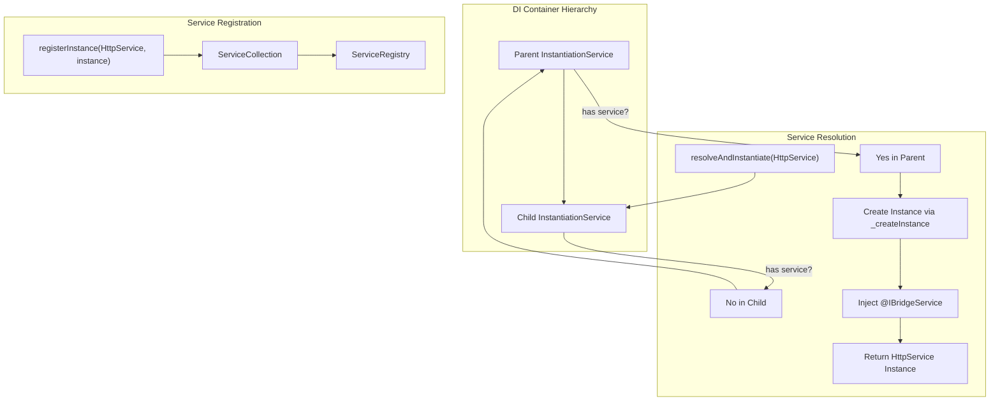
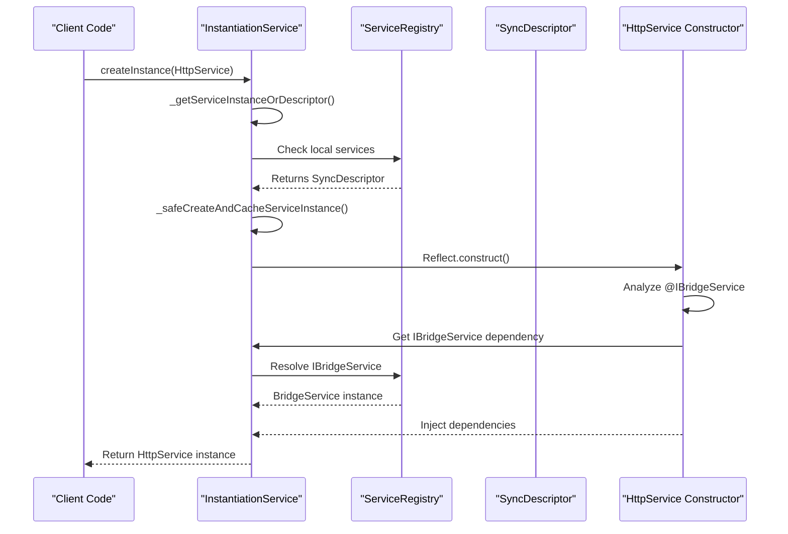
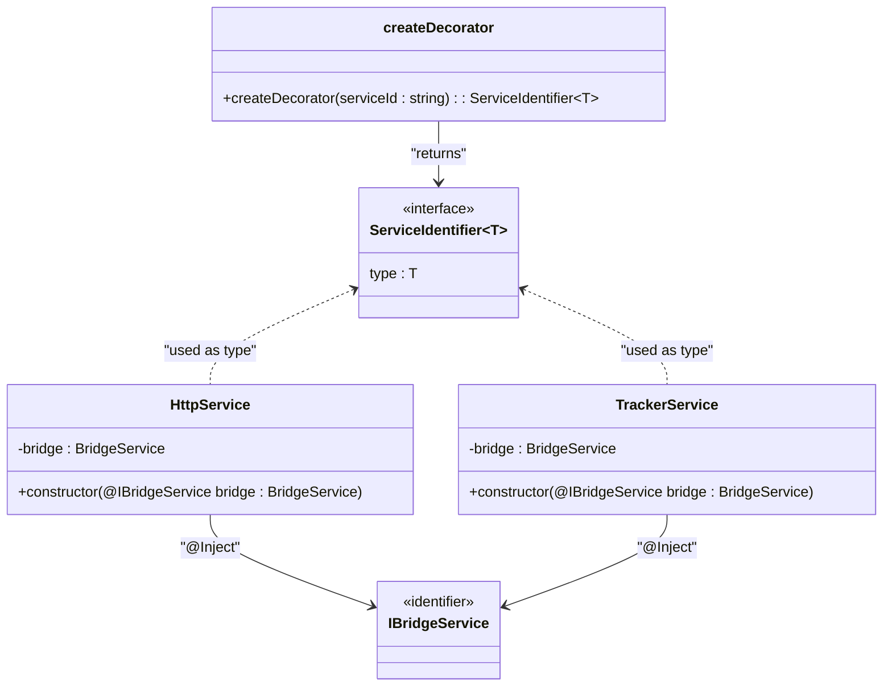
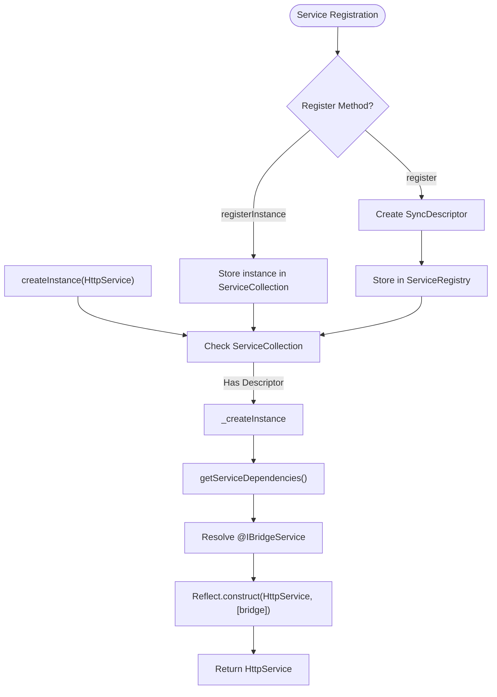
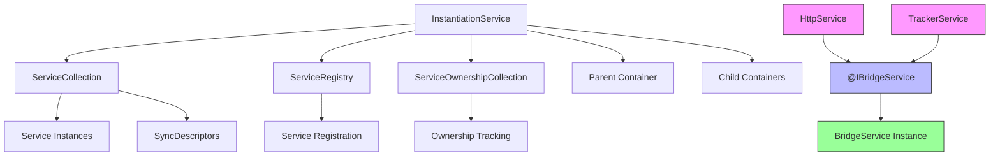

# Dependency Injection

<cite>
**Referenced Files in This Document**   
- [instantiation-service.ts](file://packages/h5-builder/src/bedrock/di/instantiation-service.ts)
- [base.ts](file://packages/h5-builder/src/bedrock/di/base.ts)
- [service-registry.ts](file://packages/h5-builder/src/bedrock/di/service-registry.ts)
- [service-collection.ts](file://packages/h5-builder/src/bedrock/di/service-collection.ts)
- [descriptor.ts](file://packages/h5-builder/src/bedrock/di/descriptor.ts)
- [http.service.ts](file://packages/h5-builder/src/services/http.service.ts)
- [tracker.service.ts](file://packages/h5-builder/src/services/tracker.service.ts)
- [service-identifiers.ts](file://packages/h5-builder/src/services/service-identifiers.ts)
- [README.md](file://packages/h5-builder/README.md)
- [context.web.tsx](file://packages/h5-builder/src/bedrock/di/context.web.tsx)
- [service-ownership-collection.ts](file://packages/h5-builder/src/bedrock/di/service-ownership-collection.ts)
</cite>

## Table of Contents
1. [Introduction](#introduction)
2. [Core Components](#core-components)
3. [Architecture Overview](#architecture-overview)
4. [Detailed Component Analysis](#detailed-component-analysis)
5. [Dependency Analysis](#dependency-analysis)
6. [Performance Considerations](#performance-considerations)
7. [Troubleshooting Guide](#troubleshooting-guide)
8. [Conclusion](#conclusion)

## Introduction
The Dependency Injection (DI) system in the H5 Builder Framework provides a robust mechanism for managing service dependencies and object creation. This document details the implementation of the DI container, focusing on the Injector class (implemented as InstantiationService), the @Inject decorator, and the service resolution mechanism. The system enables clean separation of concerns, promotes testability, and manages the lifecycle of services such as HttpService and TrackerService. The framework follows a hierarchical injection pattern with support for service ownership, circular dependency detection, and lazy instantiation.

## Core Components
The DI system consists of several core components that work together to provide dependency injection capabilities. The InstantiationService acts as the central DI container responsible for service resolution and instantiation. The @Inject decorator (implemented through createDecorator) marks parameters for injection, while service identifiers provide type-safe references to services. The system supports both eager and delayed instantiation through SyncDescriptor, and manages service ownership to prevent memory leaks during disposal.

**Section sources**
- [instantiation-service.ts](file://packages/h5-builder/src/bedrock/di/instantiation-service.ts#L61-L467)
- [base.ts](file://packages/h5-builder/src/bedrock/di/base.ts#L9-L66)
- [descriptor.ts](file://packages/h5-builder/src/bedrock/di/descriptor.ts#L8-L32)

## Architecture Overview
The DI architecture follows a hierarchical container pattern where child injectors can inherit services from parent containers while maintaining their own service instances. Services are registered either as constructors with dependencies or as pre-created instances. When resolving dependencies, the system traverses the hierarchy from child to parent until a service is found. The architecture includes mechanisms for circular dependency detection using graph analysis, service ownership tracking, and error propagation through the container hierarchy.

**Diagram sources**
- [instantiation-service.ts](file://packages/h5-builder/src/bedrock/di/instantiation-service.ts#L61-L467)
- [service-registry.ts](file://packages/h5-builder/src/bedrock/di/service-registry.ts#L16-L100)
- [service-collection.ts](file://packages/h5-builder/src/bedrock/di/service-collection.ts#L14-L47)

## Detailed Component Analysis

### Injector Class and Service Resolution
The InstantiationService class serves as the DI container (referred to as Injector in documentation). It manages service registration, resolution, and instantiation. When a service is requested through resolveAndInstantiate (implemented as createInstance), the container first checks if the service exists in its local ServiceCollection. If not found, it delegates to the parent container, enabling hierarchical dependency resolution. The service creation process involves analyzing constructor dependencies marked with @Inject, resolving each dependency recursively, and instantiating the service with proper dependency injection.

**Diagram sources**
- [instantiation-service.ts](file://packages/h5-builder/src/bedrock/di/instantiation-service.ts#L150-L176)
- [descriptor.ts](file://packages/h5-builder/src/bedrock/di/descriptor.ts#L8-L22)

### @Inject Decorator and Service Identification
The @Inject decorator system is implemented through the createDecorator function which generates service identifiers. These identifiers are parameter decorators that register dependency metadata on the constructor. When a class is instantiated, the DI container reads this metadata from the DI_DEPENDENCIES property to determine which services to inject. The system uses string-based service IDs rather than class references, allowing for interface-based injection and better tree-shaking support. Service identifiers like IHttpService and ITrackerService are created using createDecorator and used with the @ syntax in constructors.

**Diagram sources**
- [base.ts](file://packages/h5-builder/src/bedrock/di/base.ts#L9-L66)
- [http.service.ts](file://packages/h5-builder/src/services/http.service.ts#L73-L76)
- [tracker.service.ts](file://packages/h5-builder/src/services/tracker.service.ts#L43-L44)
- [service-identifiers.ts](file://packages/h5-builder/src/services/service-identifiers.ts#L14-L20)

### Service Registration and Instantiation Mechanism
Services can be registered through two primary methods: registerInstance for pre-created instances and register for constructor-based instantiation. The registerInstance method is typically used for services that require configuration parameters, such as HttpService with baseURL and token options. The system uses SyncDescriptor to wrap constructors with their dependencies and instantiation preferences (eager vs delayed). During instantiation, the container analyzes the constructor's DI_DEPENDENCIES metadata, resolves each dependency, and creates the instance with proper dependency injection.

**Diagram sources**
- [service-registry.ts](file://packages/h5-builder/src/bedrock/di/service-registry.ts#L35-L88)
- [instantiation-service.ts](file://packages/h5-builder/src/bedrock/di/instantiation-service.ts#L216-L253)
- [descriptor.ts](file://packages/h5-builder/src/bedrock/di/descriptor.ts#L8-L22)

## Dependency Analysis
The DI system implements sophisticated dependency management including circular dependency detection and hierarchical resolution. The container uses a graph-based approach to detect circular dependencies during service instantiation, throwing a CyclicDependencyError if a cycle is detected. Service ownership is tracked through the ServiceOwnershipCollection, determining whether a container should dispose of a service when it is disposed. The system supports three ownership modes: Owned (container disposes), Reference (container does not dispose), and Shared (not currently implemented). Child injectors can override services from parent containers while inheriting un-overridden services.

**Diagram sources**
- [instantiation-service.ts](file://packages/h5-builder/src/bedrock/di/instantiation-service.ts#L61-L467)
- [service-collection.ts](file://packages/h5-builder/src/bedrock/di/service-collection.ts#L14-L47)
- [service-ownership-collection.ts](file://packages/h5-builder/src/bedrock/di/service-ownership-collection.ts#L14-L39)

## Performance Considerations
The DI system includes several performance optimizations. Lazy instantiation is supported through the supportsDelayedInstantiation flag in SyncDescriptor, which wraps services in an IdleValue proxy that instantiates the service only when first accessed. This reduces startup time by deferring the creation of expensive services until they are actually needed. The system also includes tracing capabilities (when enabled) to monitor service instantiation performance. Service instances are cached after creation, ensuring singleton behavior within a container hierarchy. For React integration, the useService hook uses useMemo to prevent unnecessary service lookups during component re-renders.

## Troubleshooting Guide
Common issues with the DI system include 'service not found' errors, which typically occur when a service identifier is not properly registered or when there's a mismatch between the identifier used in @Inject and the one used in registration. Circular dependencies are detected and reported with detailed cycle information. Memory leaks can occur if services with IDisposable are not properly disposed; this is prevented by ensuring containers are disposed and by correctly setting service ownership. Issues with the @Inject decorator often stem from incorrect TypeScript configuration - ensure experimentalDecorators and emitDecoratorMetadata are enabled in tsconfig.json. When debugging, enable tracing in the InstantiationService to get detailed logs of service resolution and instantiation.

**Section sources**
- [instantiation-service.ts](file://packages/h5-builder/src/bedrock/di/instantiation-service.ts#L24-L29)
- [base.ts](file://packages/h5-builder/src/bedrock/di/base.ts#L55-L60)
- [README.md](file://packages/h5-builder/README.md#L204-L214)

## Conclusion
The Dependency Injection system in the H5 Builder Framework provides a comprehensive solution for managing service dependencies and object creation. By leveraging TypeScript decorators and a hierarchical container architecture, it enables clean, testable code with proper separation of concerns. The system effectively handles complex scenarios including circular dependency detection, lazy instantiation, and service ownership management. Integration with React through the useService hook provides a seamless experience for component development. Proper use of service identifiers and adherence to disposal patterns ensures robust application architecture with minimal memory leaks.