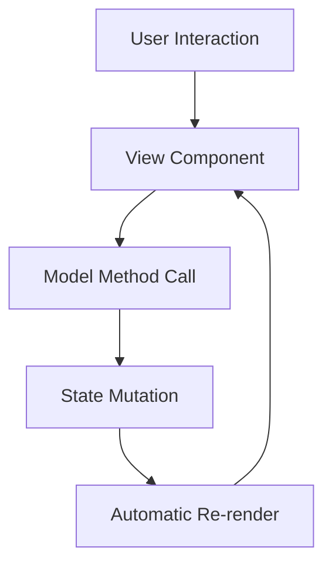
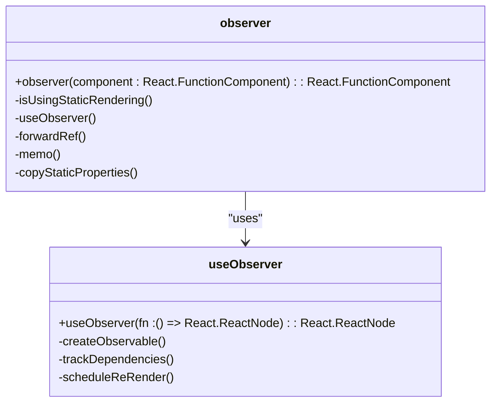
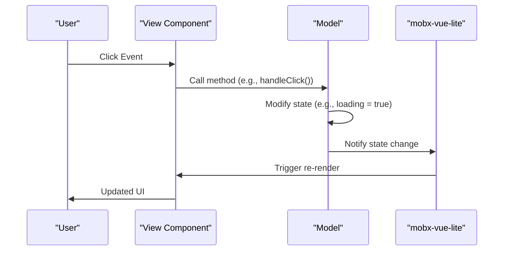

# Model-View Separation

<cite>
**Referenced Files in This Document**   
- [component_development_guide.md](file://packages/h5-builder/docs/component_development_guide.md)
- [api_reference.md](file://packages/h5-builder/docs/api_reference.md)
- [README.md](file://packages/h5-builder/README.md)
- [product-card.model.ts](file://packages/h5-builder/src/components/product-card/product-card.model.ts)
- [product-card.view.tsx](file://packages/h5-builder/src/components/product-card/product-card.view.tsx)
- [tabs-container.model.ts](file://packages/h5-builder/src/components/tabs-container/tabs-container.model.ts)
- [tabs-container.view.tsx](file://packages/h5-builder/src/components/tabs-container/tabs-container.view.tsx)
- [observer.ts](file://packages/mobx-vue-lite/src/observer.ts)
</cite>

## Table of Contents
1. [Introduction](#introduction)
2. [Core Principles of Model-View Separation](#core-principles-of-model-view-separation)
3. [BaseComponentModel and BaseContainerModel](#basecomponentmodel-and-basecontainermodel)
4. [View Components and Reactivity](#view-components-and-reactivity)
5. [Communication Flow: View → Model → View](#communication-flow-view--model--view)
6. [Common Issues and Solutions](#common-issues-and-solutions)
7. [Best Practices](#best-practices)
8. [Performance Considerations](#performance-considerations)
9. [Conclusion](#conclusion)

## Introduction

The H5 Builder framework implements a strict Model-View separation pattern to decouple business logic from UI rendering. This architectural approach ensures that components are modular, testable, and maintainable by enforcing clear boundaries between state management (Model) and presentation (View). The framework leverages `mobx-vue-lite` for reactivity, enabling automatic UI updates when model state changes. This document details how this separation is implemented, the roles of `BaseComponentModel` and `BaseContainerModel`, and best practices for developing components within this architecture.

**Section sources**
- [README.md](file://packages/h5-builder/README.md#L1-L232)
- [component_development_guide.md](file://packages/h5-builder/docs/component_development_guide.md#L1-L510)

## Core Principles of Model-View Separation

The Model-View separation in H5 Builder is founded on two core principles: complete isolation of concerns and unidirectional data flow. The Model layer encapsulates all business logic, state management, lifecycle hooks, and service interactions, while the View layer is responsible solely for rendering UI and forwarding user interactions to the Model.

### Model Layer Responsibilities
- **State Management**: All reactive state is declared as direct properties on the Model class.
- **Business Logic**: Data loading, processing, and transformation occur within the Model.
- **Lifecycle Management**: Initialization, activation, deactivation, and disposal are handled through lifecycle hooks.
- **Service Integration**: HTTP requests, tracking, and other service calls are made from the Model.
- **No JSX**: The Model contains no UI code or rendering logic.

### View Layer Responsibilities
- **UI Rendering**: The View is a pure React component that renders based on the Model's state.
- **Event Handling**: User interactions trigger methods on the Model rather than containing logic.
- **Reactivity**: Wrapped with `observer` from `mobx-vue-lite` to automatically re-render on state changes.
- **No Business Logic**: The View does not make service calls or contain conditional logic beyond rendering.



**Diagram sources**
- [component_development_guide.md](file://packages/h5-builder/docs/component_development_guide.md#L11-L21)
- [README.md](file://packages/h5-builder/README.md#L188-L193)

**Section sources**
- [component_development_guide.md](file://packages/h5-builder/docs/component_development_guide.md#L1-L510)
- [README.md](file://packages/h5-builder/README.md#L1-L232)

## BaseComponentModel and BaseContainerModel

The `BaseComponentModel` and `BaseContainerModel` classes provide the foundation for all components in the H5 Builder framework, encapsulating state, lifecycle, and dependency injection while ensuring strict separation from UI concerns.

### BaseComponentModel

`BaseComponentModel` is the base class for all leaf components and provides the following features:

- **Reactive State**: All public properties are automatically observable, triggering View re-renders when modified.
- **Lifecycle Hooks**: Methods like `onInit`, `onActive`, and `onDestroy` allow for controlled initialization and cleanup.
- **Dependency Injection**: Services are injected via the `@Inject` decorator, promoting loose coupling.
- **Resource Management**: The `register` method ensures automatic cleanup of timers, event listeners, and other resources.

```typescript
export class ProductCardModel extends BaseComponentModel<ProductCardProps> {
  public loading = false;
  public data: ProductData | null = null;

  constructor(
    id: string,
    props: ProductCardProps,
    @IHttpService private http: HttpService,
    @ITrackerService private tracker: TrackerService
  ) {
    super(id, props);
  }

  protected async onInit(): Promise<void> {
    await this.refresh();
  }

  handleClick(): void {
    this.tracker.track('PRODUCT_CLICK', { productId: this.data?.id });
  }
}
```

**Section sources**
- [product-card.model.ts](file://packages/h5-builder/src/components/product-card/product-card.model.ts#L1-L133)
- [api_reference.md](file://packages/h5-builder/docs/api_reference.md#L156-L237)

### BaseContainerModel

`BaseContainerModel` extends `BaseComponentModel` to support container components that manage child components. It adds:

- **Child Management**: Methods like `addChild`, `removeChild`, and `clearChildren` for managing component trees.
- **Lazy Initialization**: Containers can implement lazy loading of child components to optimize performance.
- **Virtual Scrolling**: Advanced containers like `TabsContainerModel` can dynamically enable virtual scrolling based on child count.

```typescript
export class TabsContainerModel extends BaseContainerModel<TabsContainerProps> {
  public activeIndex: number;
  private virtualLists = new Map<number, VirtualListModel>();

  protected async onInit(): Promise<void> {
    if (this.children.length === 0) return;

    this.detectAndEnableVirtualScroll();
    const firstTab = this.children[this.activeIndex];
    await firstTab.init();
    firstTab.activate();

    this.schedulePrewarm();
  }

  async switchTab(index: number): Promise<void> {
    if (index === this.activeIndex || !this.children[index]) return;

    const oldTab = this.children[this.activeIndex];
    const newTab = this.children[index];

    if (!newTab.isInited) await newTab.init();

    oldTab.deactivate();
    newTab.activate();
    this.activeIndex = index;
  }
}
```

**Section sources**
- [tabs-container.model.ts](file://packages/h5-builder/src/components/tabs-container/tabs-container.model.ts#L1-L273)
- [api_reference.md](file://packages/h5-builder/docs/api_reference.md#L240-L273)

## View Components and Reactivity

View components in H5 Builder are pure React functional components wrapped with the `observer` HOC from `mobx-vue-lite`. This enables automatic reactivity, where the component re-renders whenever any observable property accessed during rendering changes.

### Observer HOC Implementation

The `observer` function wraps a React component and uses `useObserver` to track observable accesses during rendering. When an observable changes, the component is automatically re-rendered.



**Diagram sources**
- [observer.ts](file://packages/mobx-vue-lite/src/observer.ts#L1-L52)

### View Component Structure

View components receive the Model as a prop and render based on its state. They trigger Model methods in response to user interactions, maintaining a clean separation of concerns.

```tsx
export const ProductCardView: React.FC<ProductCardViewProps> = observer((props: ProductCardViewProps) => {
  const { model } = props;

  if (model.loading) {
    return <div className="loading">Loading...</div>;
  }

  if (model.error) {
    return (
      <div className="error">
        <p>Error: {model.error.message}</p>
        <button onClick={() => model.refresh()}>Retry</button>
      </div>
    );
  }

  return (
    <div className="product-card" onClick={() => model.handleClick()}>
      <h3>{model.data?.name}</h3>
      {model.shouldShowPrice && <div>{model.formattedPrice}</div>}
    </div>
  );
});
```

**Section sources**
- [product-card.view.tsx](file://packages/h5-builder/src/components/product-card/product-card.view.tsx#L1-L81)
- [component_development_guide.md](file://packages/h5-builder/docs/component_development_guide.md#L104-L146)

## Communication Flow: View → Model → View

The communication flow in H5 Builder follows a unidirectional pattern that ensures predictable state changes and automatic UI updates.

### Step-by-Step Flow

1. **User Interaction**: A user interacts with the View (e.g., clicks a button).
2. **Event Handling**: The View handles the event by calling a method on the Model.
3. **State Mutation**: The Model method modifies observable state or performs business logic.
4. **Reactivity System**: The `mobx-vue-lite` reactivity system detects the state change.
5. **Automatic Re-render**: The View component automatically re-renders to reflect the new state.



**Diagram sources**
- [product-card.view.tsx](file://packages/h5-builder/src/components/product-card/product-card.view.tsx#L57-L58)
- [product-card.model.ts](file://packages/h5-builder/src/components/product-card/product-card.model.ts#L106-L116)

**Section sources**
- [component_development_guide.md](file://packages/h5-builder/docs/component_development_guide.md#L116-L143)
- [product-card.model.ts](file://packages/h5-builder/src/components/product-card/product-card.model.ts#L1-L133)

## Common Issues and Solutions

### Non-Responsive State Updates

**Issue**: State changes in the Model do not trigger View re-renders.

**Cause**: Properties are not declared directly on the Model class or are not properly initialized.

**Solution**: Ensure all reactive properties are declared as class properties:
```typescript
// ✅ Correct
class MyModel extends BaseComponentModel {
  public count = 0;
}

// ❌ Incorrect
class MyModel extends BaseComponentModel {
  private _count = 0;
  getCount() { return this._count; }
}
```

### Memory Leaks

**Issue**: Timers or event listeners are not cleaned up when components are destroyed.

**Solution**: Use the `register` method to automatically clean up resources:
```typescript
protected onInit() {
  const timer = setInterval(() => {}, 1000);
  this.register(() => clearInterval(timer));
}
```

**Section sources**
- [component_development_guide.md](file://packages/h5-builder/docs/component_development_guide.md#L455-L485)
- [api_reference.md](file://packages/h5-builder/docs/api_reference.md#L215-L229)

## Best Practices

### Avoid Business Logic in Views

Views should contain only rendering logic and event forwarding. All business logic, including API calls and data processing, should reside in the Model.

```tsx
// ✅ Good: View forwards to Model
export const GoodView = observer((props: ViewProps) => {
  const { model } = props;
  return <div onClick={() => model.handleClick()}>Click me</div>;
});

// ❌ Bad: View contains business logic
export const BadView = (props: ViewProps) => {
  const handleClick = async () => {
    await http.post('/api/click');
  };
  return <div onClick={handleClick}>Click me</div>;
};
```

### Declare Reactive Properties Directly

All state that should trigger re-renders must be declared as direct properties on the Model class to ensure proper observability.

### Use Computed Properties

Leverage getter methods for derived state to avoid redundant calculations and ensure reactivity:
```typescript
get formattedPrice(): string {
  if (!this.data || !this.shouldShowPrice) return '';
  return `¥${this.data.price.toFixed(2)}`;
}
```

**Section sources**
- [component_development_guide.md](file://packages/h5-builder/docs/component_development_guide.md#L377-L402)
- [product-card.model.ts](file://packages/h5-builder/src/components/product-card/product-card.model.ts#L121-L131)

## Performance Considerations

### Observer Optimization

The `observer` HOC automatically applies `React.memo` to prevent unnecessary re-renders when props haven't changed. This optimization ensures that components only re-render when their observed state actually changes.

### Avoid Unnecessary Re-renders

- **Minimize Observed State**: Only access the state needed for rendering within the View.
- **Use Virtual Scrolling**: For large lists, use `VirtualListModel` to render only visible items.
- **Lazy Load Components**: Initialize components only when needed, as demonstrated in `TabsContainerModel`.

### Resource Management

Proper use of the `register` method ensures that all resources are cleaned up when components are destroyed, preventing memory leaks and improving performance.

**Section sources**
- [observer.ts](file://packages/mobx-vue-lite/src/observer.ts#L44-L45)
- [tabs-container.model.ts](file://packages/h5-builder/src/components/tabs-container/tabs-container.model.ts#L85-L86)

## Conclusion

The Model-View separation pattern in H5 Builder provides a robust architecture for building scalable and maintainable components. By strictly separating business logic from UI rendering, the framework ensures that components are modular, testable, and performant. The use of `BaseComponentModel` and `BaseContainerModel` provides a consistent foundation for state and lifecycle management, while `mobx-vue-lite` enables automatic reactivity with minimal boilerplate. Following the best practices outlined in this document will help developers create components that are both powerful and easy to maintain.