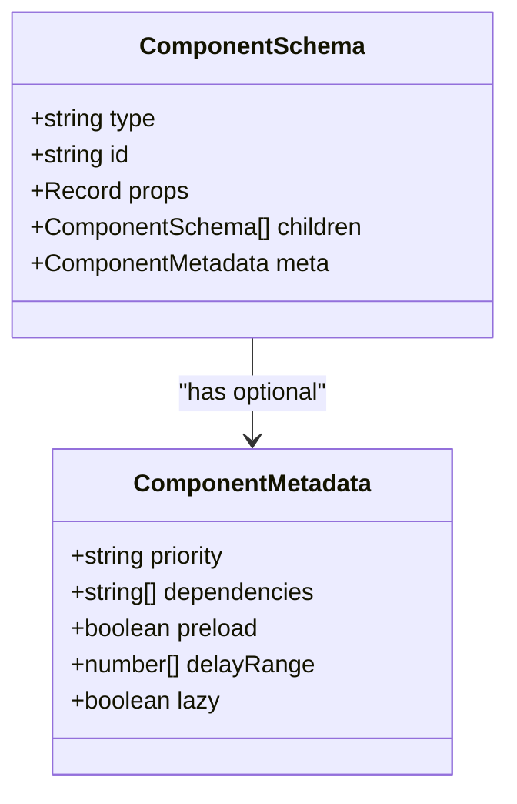
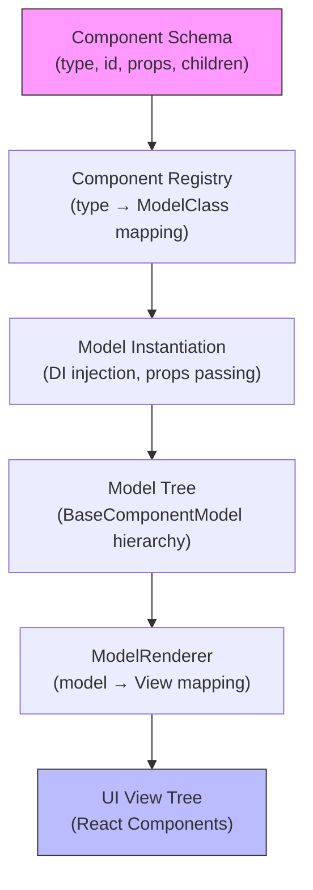
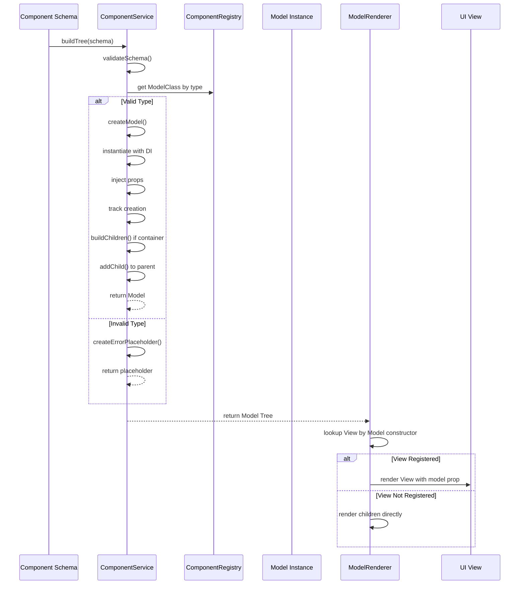
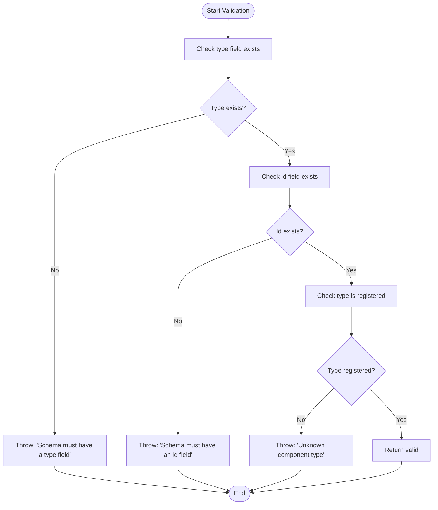
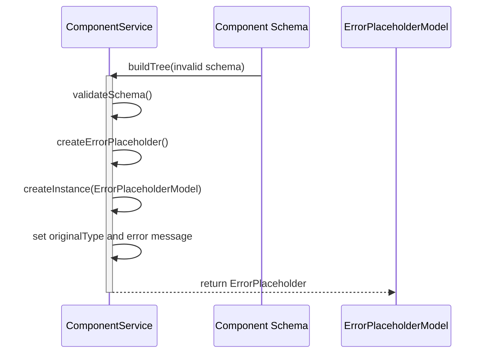
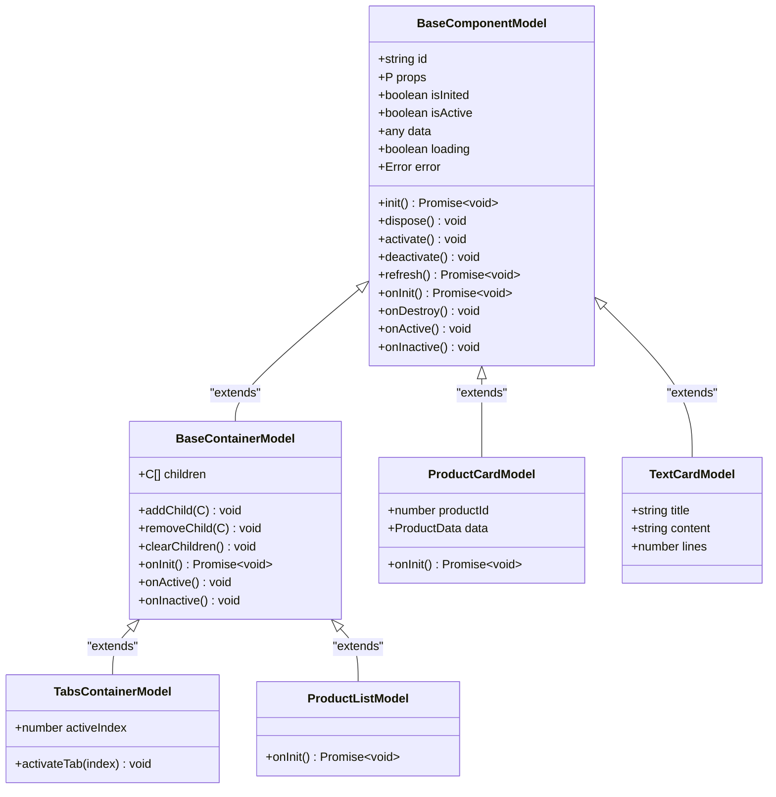

# Schema-Driven Architecture

<cite>
**Referenced Files in This Document**   
- [component.service.ts](file://packages/h5-builder/src/services/component.service.ts#L31-L46)
- [model.ts](file://packages/h5-builder/src/bedrock/model.ts#L10-L168)
- [model-renderer.tsx](file://packages/h5-builder/src/components/model-renderer.tsx#L10-L37)
- [demo-data.ts](file://packages/h5-builder/src/mock/demo-data.ts#L11-L333)
- [component.service.ts](file://packages/h5-builder/src/services/component.service.ts#L135-L208)
- [build-tree-job.ts](file://packages/h5-builder/src/jobs/build-tree-job.ts#L46-L56)
- [component.service.ts](file://packages/h5-builder/src/services/component.service.ts#L214-L226)
- [component.service.ts](file://packages/h5-builder/src/services/component.service.ts#L231-L243)
- [model.ts](file://packages/h5-builder/src/bedrock/model.ts#L168-L242)
</cite>

## Table of Contents
1. [Introduction](#introduction)
2. [ComponentSchema Interface](#componentschema-interface)
3. [Schema to UI Hierarchy](#schema-to-ui-hierarchy)
4. [Component Building Process](#component-building-process)
5. [Error Handling](#error-handling)
6. [Container Components](#container-components)
7. [Best Practices](#best-practices)

## Introduction
The Schema-Driven Architecture is a core design pattern in the H5 Builder Framework that enables dynamic UI composition through declarative schema definitions. This architecture separates UI structure from implementation, allowing runtime composition of components without hard-coded dependencies. The system transforms a JSON-like schema into a complete Model-View hierarchy through a well-defined process flow.

## ComponentSchema Interface
The ComponentSchema interface serves as the blueprint for dynamic component creation and defines the structure of each component in the UI hierarchy. It contains four essential fields that work together to enable flexible and dynamic UI composition.

**Diagram sources**
- [component.service.ts](file://packages/h5-builder/src/services/component.service.ts#L31-L46)

**Section sources**
- [component.service.ts](file://packages/h5-builder/src/services/component.service.ts#L31-L46)

### Type Field
The `type` field maps to a registered Model class in the component registry. During the build process, the ComponentService uses this type to look up the corresponding Model class that will be instantiated. This indirection enables the framework to support dynamic component loading and registration.

### ID Field
The `id` field provides a unique identifier for each component instance, which is essential for tracking, debugging, and state management. Every component must have a unique ID within its scope to ensure proper lifecycle management and event tracking.

### Props Field
The `props` field contains configuration data that is passed directly to the Model constructor. This allows for parameterized component behavior and appearance without requiring changes to the component implementation.

### Children Field
The `children` field enables the creation of a tree structure by allowing components to contain other components. This hierarchical organization supports complex UI layouts and nested component relationships.

### Meta Field
The optional `meta` field extends the schema with additional metadata for custom behavior, such as loading priority, dependencies, and preloading instructions.

## Schema to UI Hierarchy
The schema declaratively defines the entire UI hierarchy, enabling runtime composition without hard-coded dependencies. The framework uses the schema to build a complete tree of Model instances, which are then rendered through their corresponding View components.

**Diagram sources**
- [component.service.ts](file://packages/h5-builder/src/services/component.service.ts#L135-L208)
- [model-renderer.tsx](file://packages/h5-builder/src/components/model-renderer.tsx#L10-L37)

**Section sources**
- [demo-data.ts](file://packages/h5-builder/src/mock/demo-data.ts#L11-L333)

### Example: TabsContainer with ProductCard Children
The framework demonstrates its capabilities through examples like a TabsContainer with ProductCard children. The schema defines a TabsContainer component with multiple tabs, each containing a list of ProductCard components. This structure is built entirely from the schema without any hard-coded references between components.

## Component Building Process
The process flow from schema to rendered UI follows a well-defined sequence: schema → ComponentLoader → buildTree → Model instantiation → ModelRenderer. This pipeline ensures consistent and reliable component creation and rendering.

**Diagram sources**
- [build-tree-job.ts](file://packages/h5-builder/src/jobs/build-tree-job.ts#L46-L56)
- [component.service.ts](file://packages/h5-builder/src/services/component.service.ts#L135-L208)

**Section sources**
- [component.service.ts](file://packages/h5-builder/src/services/component.service.ts#L135-L208)

## Error Handling
The framework implements robust error handling to maintain application stability when encountering invalid schemas or component creation failures. The system validates schemas and handles errors gracefully to prevent cascading failures.

### Schema Validation
The ComponentService validates each schema before processing, checking for required fields and valid component types. The validation process ensures that:
- The `type` field exists
- The `id` field exists  
- The component type is registered in the registry

**Diagram sources**
- [component.service.ts](file://packages/h5-builder/src/services/component.service.ts#L214-L226)

**Section sources**
- [component.service.ts](file://packages/h5-builder/src/services/component.service.ts#L214-L226)

### Error Placeholder Components
When component creation fails, the framework creates error placeholder components instead of propagating the error. This fault tolerance ensures that a single component failure doesn't prevent the entire UI from rendering.

**Diagram sources**
- [component.service.ts](file://packages/h5-builder/src/services/component.service.ts#L231-L243)

**Section sources**
- [component.service.ts](file://packages/h5-builder/src/services/component.service.ts#L231-L243)

## Container Components
Container components extend the base functionality by supporting child components and providing default lifecycle behavior for managing their children. These components form the structural backbone of complex UI hierarchies.

**Diagram sources**
- [model.ts](file://packages/h5-builder/src/bedrock/model.ts#L168-L242)

**Section sources**
- [model.ts](file://packages/h5-builder/src/bedrock/model.ts#L168-L242)

### Default Container Behavior
BaseContainerModel provides default implementations for lifecycle methods that automatically manage child components:
- `onInit()`: Initializes all child components in parallel
- `onActive()`: Activates all child components
- `onInactive()`: Deactivates all child components

This default behavior can be overridden by subclasses to implement custom logic, such as lazy loading or selective activation.

## Best Practices
To ensure optimal performance and maintainability when working with the Schema-Driven Architecture, follow these best practices:

### Schema Validation
Always validate schemas before passing them to the ComponentService. Implement client-side validation to catch errors early and provide meaningful feedback to schema authors.

### Error Handling
Implement comprehensive error handling during model construction to maintain application stability. Use the framework's error placeholder mechanism to isolate failures and prevent cascading issues.

### Performance Considerations
Deep schema trees can impact performance due to the recursive nature of component building. Consider these optimization strategies:
- Implement lazy loading for non-critical components
- Use virtualization for long lists
- Optimize the component registry lookup performance
- Cache frequently used component configurations

### Extending Schema with Meta Fields
The optional `meta` field in ComponentSchema allows for extending the schema with custom behavior. Use this feature to add:
- Loading priorities for critical components
- Dependency declarations for proper loading order
- Preloading instructions for anticipated components
- Delay ranges for staggered loading

These metadata can be used by loading strategies to optimize the component loading process and improve perceived performance.