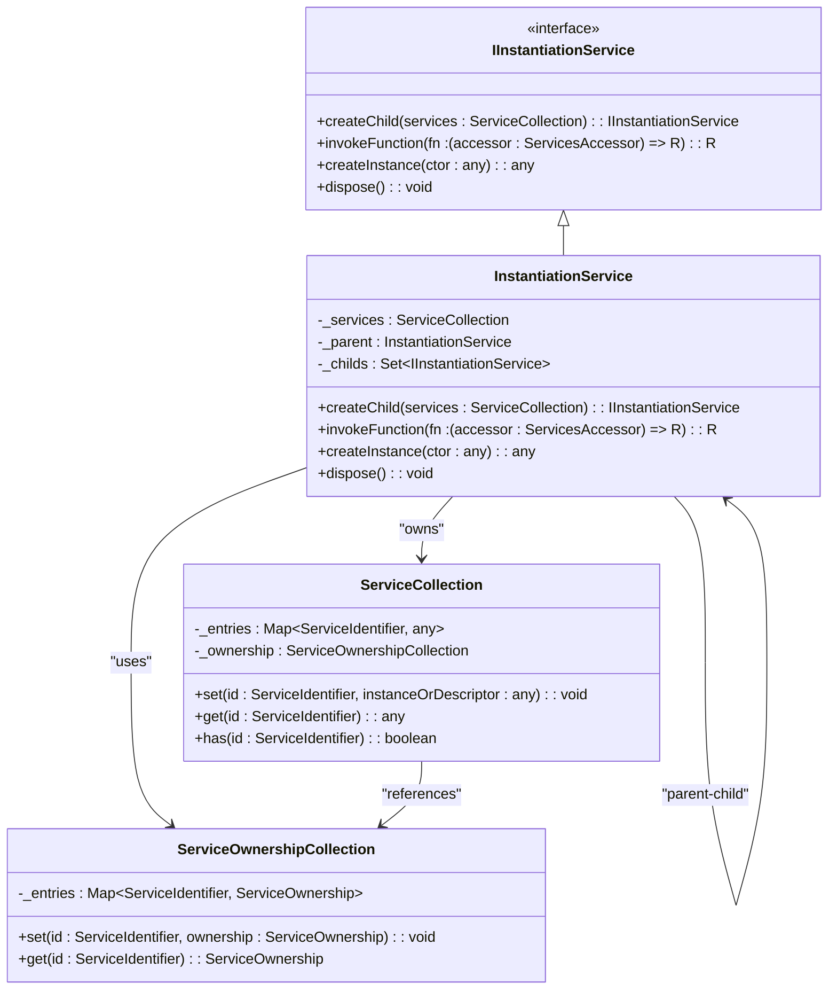
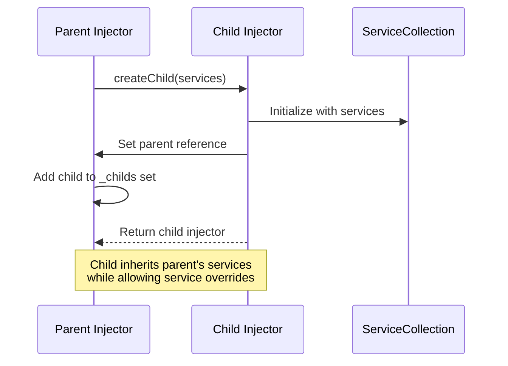
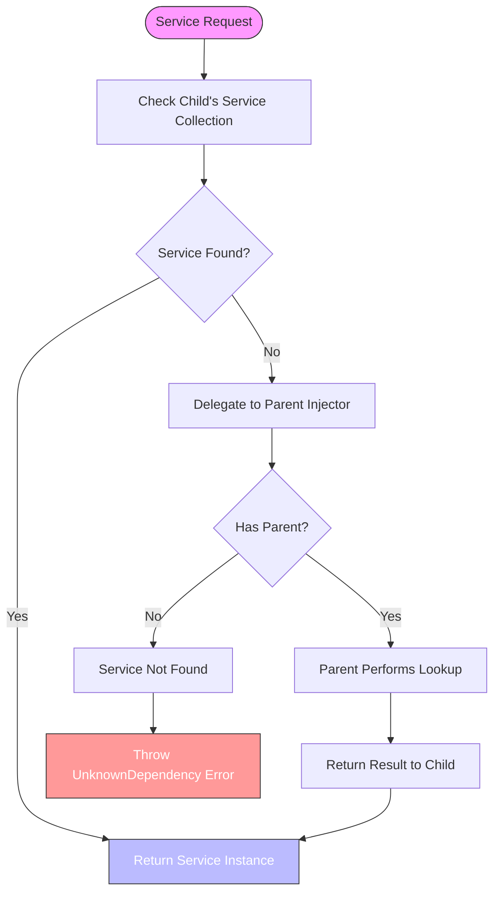
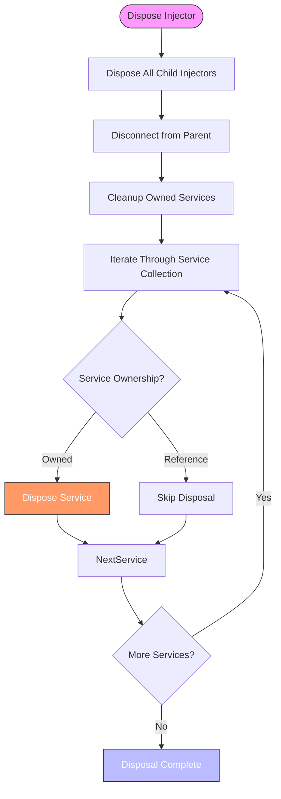

# Child Injectors

<cite>
**Referenced Files in This Document**   
- [instantiation-service.ts](file://packages/h5-builder/src/bedrock/di/instantiation-service.ts)
- [service-collection.ts](file://packages/h5-builder/src/bedrock/di/service-collection.ts)
- [service-registry.ts](file://packages/h5-builder/src/bedrock/di/service-registry.ts)
- [base.ts](file://packages/h5-builder/src/bedrock/di/base.ts)
- [component.service.ts](file://packages/h5-builder/src/services/component.service.ts)
- [instantiation-service.test.ts](file://packages/h5-builder/src/bedrock/di/instantiation-service.test.ts)
- [service-ownership-collection.ts](file://packages/h5-builder/src/bedrock/di/service-ownership-collection.ts)
</cite>

## Table of Contents
1. [Introduction](#introduction)
2. [Core Architecture](#core-architecture)
3. [Child Injector Creation and Inheritance](#child-injector-creation-and-inheritance)
4. [Service Lookup and Resolution](#service-lookup-and-resolution)
5. [Service Ownership and Disposal](#service-ownership-and-disposal)
6. [Use Cases and Implementation Patterns](#use-cases-and-implementation-patterns)
7. [Common Issues and Best Practices](#common-issues-and-best-practices)
8. [Conclusion](#conclusion)

## Introduction
Child injectors in the MobX dependency injection system provide a hierarchical container model that enables isolated service scopes while maintaining inheritance from parent containers. This architecture supports feature-level service isolation, scoped dependencies, and testing with mocked services. The system is implemented through the `InstantiationService` class which manages a tree of injectors with parent-child relationships, allowing for service override capabilities and controlled service lifecycle management.

**Section sources**
- [instantiation-service.ts](file://packages/h5-builder/src/bedrock/di/instantiation-service.ts#L61-L468)

## Core Architecture
The child injector system is built around the `InstantiationService` class which implements the `IInstantiationService` interface. Each injector maintains its own service collection while retaining a reference to its parent injector, creating a hierarchical structure. The architecture supports service inheritance, where child injectors can access services from their parent containers, and service overriding, where child injectors can provide their own implementations of services.



**Diagram sources**
- [instantiation-service.ts](file://packages/h5-builder/src/bedrock/di/instantiation-service.ts#L61-L468)
- [service-collection.ts](file://packages/h5-builder/src/bedrock/di/service-collection.ts#L14-L47)
- [service-ownership-collection.ts](file://packages/h5-builder/src/bedrock/di/service-ownership-collection.ts#L14-L39)

**Section sources**
- [instantiation-service.ts](file://packages/h5-builder/src/bedrock/di/instantiation-service.ts#L61-L468)
- [service-collection.ts](file://packages/h5-builder/src/bedrock/di/service-collection.ts#L1-L47)

## Child Injector Creation and Inheritance
Child injectors are created through the `createChild` method of the `InstantiationService` class, which accepts a `ServiceCollection` parameter containing services specific to the child container. The child injector inherits all services from its parent while allowing for service overrides. This enables isolated service containers that can provide different implementations of services while sharing common dependencies.

The creation process establishes a parent-child relationship where the child injector maintains a reference to its parent, and the parent maintains a set of its children. This bidirectional relationship enables proper disposal propagation and service lookup delegation.



**Diagram sources**
- [instantiation-service.ts](file://packages/h5-builder/src/bedrock/di/instantiation-service.ts#L111-L114)
- [instantiation-service.test.ts](file://packages/h5-builder/src/bedrock/di/instantiation-service.test.ts#L247-L255)

**Section sources**
- [instantiation-service.ts](file://packages/h5-builder/src/bedrock/di/instantiation-service.ts#L111-L114)
- [instantiation-service.test.ts](file://packages/h5-builder/src/bedrock/di/instantiation-service.test.ts#L247-L255)

## Service Lookup and Resolution
Service lookup in the child injector system follows a hierarchical delegation pattern. When a service is requested from a child injector, the system first checks if the service is registered in the child's service collection. If not found, the request is delegated to the parent injector, recursively traversing up the injector tree until the service is found or the root is reached.

This delegation pattern enables service inheritance while allowing for service overrides at lower levels of the hierarchy. The lookup process is implemented in the `_getServiceInstanceOrDescriptor` method, which checks the local service collection before delegating to the parent injector.



**Diagram sources**
- [instantiation-service.ts](file://packages/h5-builder/src/bedrock/di/instantiation-service.ts#L268-L275)
- [instantiation-service.ts](file://packages/h5-builder/src/bedrock/di/instantiation-service.ts#L278-L288)

**Section sources**
- [instantiation-service.ts](file://packages/h5-builder/src/bedrock/di/instantiation-service.ts#L268-L288)

## Service Ownership and Disposal
The child injector system implements a sophisticated disposal mechanism that propagates from parent to child injectors. When a parent injector is disposed, it first disposes all of its child injectors before disposing its own services. This ensures proper cleanup order and prevents memory leaks.

Service ownership is managed through the `ServiceOwnership` enum, which defines whether a service is owned by the injector (`Owned`) or merely referenced (`Reference`). Only owned services are disposed by the injector, preventing unintended disposal of shared services.

The disposal process is implemented in the `dispose` method of `InstantiationService`, which iterates through child injectors, disconnects the parent-child relationship, and disposes owned services based on their ownership type.



**Diagram sources**
- [instantiation-service.ts](file://packages/h5-builder/src/bedrock/di/instantiation-service.ts#L178-L213)
- [service-ownership-collection.ts](file://packages/h5-builder/src/bedrock/di/service-ownership-collection.ts#L3-L7)

**Section sources**
- [instantiation-service.ts](file://packages/h5-builder/src/bedrock/di/instantiation-service.ts#L178-L213)
- [service-ownership-collection.ts](file://packages/h5-builder/src/bedrock/di/service-ownership-collection.ts#L3-L7)

## Use Cases and Implementation Patterns

### Scoped Dependencies and Feature Isolation
Child injectors enable feature-level service isolation by creating isolated service containers for specific features or components. This pattern is particularly useful in component loading scenarios where different components may require different configurations of the same service.

In the component loading context, the `ComponentService` uses the injector system to create component instances with access to shared services while maintaining isolation between components. This allows for feature-specific service overrides without affecting other parts of the application.

```mermaid
graph TD
Root[Root Injector] --> FeatureA["Feature A Injector"]
Root --> FeatureB["Feature B Injector"]
Root --> Shared[Shared Services]
FeatureA --> ServiceA1["Service A1"]
FeatureA --> ServiceA2["Service A2"]
FeatureA --> Override["Overridden Service"]
FeatureB --> ServiceB1["Service B1"]
FeatureB --> ServiceB2["Service B2"]
FeatureB --> Override["Overridden Service"]
Shared --> Http[HttpService]
Shared --> Tracker[TrackerService]
Shared --> Bridge[BridgeService]
style FeatureA fill:#cfc,stroke:#333
style FeatureB fill:#cfc,stroke:#333
style Override fill:#f96,stroke:#333,color:#fff
Note over FeatureA,FeatureB: Each feature has isolated services<br/>with access to shared services
```

**Diagram sources**
- [component.service.ts](file://packages/h5-builder/src/services/component.service.ts#L111-L114)
- [instantiation-service.ts](file://packages/h5-builder/src/bedrock/di/instantiation-service.ts#L172-L176)

**Section sources**
- [component.service.ts](file://packages/h5-builder/src/services/component.service.ts#L111-L114)
- [instantiation-service.ts](file://packages/h5-builder/src/bedrock/di/instantiation-service.ts#L172-L176)

### Testing with Mocked Services
Child injectors are particularly valuable in testing scenarios where specific services need to be mocked or stubbed. By creating a child injector with mocked services, tests can isolate the system under test while maintaining the overall dependency injection structure.

The testing pattern involves creating a child injector that inherits from the main application injector but overrides specific services with test doubles. This allows for comprehensive testing of components with mocked dependencies while preserving the integrity of the dependency injection system.

```mermaid
graph TD
Production[Production Injector] --> Component["Component Under Test"]
Production --> RealHttp[Real HttpService]
Production --> RealTracker[Real TrackerService]
Test[Production Injector] --> TestChild["Test Child Injector"]
TestChild --> MockHttp[Mock HttpService]
TestChild --> MockTracker[Mock TrackerService]
TestChild --> Component["Component Under Test"]
style TestChild fill:#cfc,stroke:#333
style MockHttp fill:#f96,stroke:#333,color:#fff
style MockTracker fill:#f96,stroke:#333,color:#fff
Note over TestChild: Test child injector overrides<br/>specific services with mocks
```

**Diagram sources**
- [instantiation-service.test.ts](file://packages/h5-builder/src/bedrock/di/instantiation-service.test.ts#L247-L255)
- [service-identifiers.ts](file://packages/h5-builder/src/services/service-identifiers.ts#L14-L20)

**Section sources**
- [instantiation-service.test.ts](file://packages/h5-builder/src/bedrock/di/instantiation-service.test.ts#L247-L255)
- [service-identifiers.ts](file://packages/h5-builder/src/services/service-identifiers.ts#L14-L20)

### Job Execution Contexts
In job execution contexts, child injectors provide isolated execution environments for different jobs while allowing access to shared services. The `AbstractJob` class and its derivatives use the injector system to create job-specific contexts with access to necessary services.

This pattern enables jobs to have their own service configurations and dependencies while maintaining access to shared infrastructure services. The hierarchical nature of the injector system ensures proper resource cleanup when jobs complete.

```mermaid
graph TD
Root[Root Injector] --> JobScheduler["Job Scheduler"]
JobScheduler --> Job1["Job 1 Injector"]
JobScheduler --> Job2["Job 2 Injector"]
JobScheduler --> Job3["Job 3 Injector"]
Job1 --> Job1Services["Job-Specific Services"]
Job2 --> Job2Services["Job-Specific Services"]
Job3 --> Job3Services["Job-Specific Services"]
Root --> SharedServices[Shared Services]
SharedServices --> Tracker[TrackerService]
SharedServices --> Http[HttpService]
Job1 --> SharedServices
Job2 --> SharedServices
Job3 --> SharedServices
style Job1 fill:#cfc,stroke:#333
style Job2 fill:#cfc,stroke:#333
style Job3 fill:#cfc,stroke:#333
Note over Job1,Job3: Each job has isolated services<br/>with access to shared services
```

**Diagram sources**
- [component.service.ts](file://packages/h5-builder/src/services/component.service.ts#L111-L114)
- [instantiation-service.ts](file://packages/h5-builder/src/bedrock/di/instantiation-service.ts#L111-L114)

**Section sources**
- [component.service.ts](file://packages/h5-builder/src/services/component.service.ts#L111-L114)
- [instantiation-service.ts](file://packages/h5-builder/src/bedrock/di/instantiation-service.ts#L111-L114)

## Common Issues and Best Practices

### Unintended Service Sharing
One common issue with child injectors is unintended service sharing, where services are accidentally shared between injectors when isolation is required. This can occur when services are registered with the wrong ownership type or when child injectors are not properly created.

To avoid unintended service sharing:
- Use `ServiceOwnership.Owned` for services that should be disposed with the injector
- Use `ServiceOwnership.Reference` for services that should not be disposed
- Create child injectors with explicit service collections to ensure isolation
- Avoid registering services directly with parent injectors when child isolation is needed

### Memory Leaks from Retained Child Injectors
Memory leaks can occur when child injectors are not properly disposed, particularly when they maintain references to services or when the parent injector retains references to disposed children.

To prevent memory leaks:
- Always call `dispose()` on injectors when they are no longer needed
- Ensure proper disposal propagation from parent to child injectors
- Use weak references when appropriate to avoid circular references
- Monitor injector tree size in long-running applications

### Incorrect Service Ownership Across Injector Boundaries
Incorrect service ownership can lead to premature disposal of services or memory leaks when services are not disposed at the appropriate time.

Best practices for service ownership:
- Register services with the appropriate ownership type based on their lifecycle
- Use `ServiceOwnership.Owned` for services that should be tied to the injector's lifecycle
- Use `ServiceOwnership.Reference` for shared services that should outlive the injector
- Document ownership semantics for services that may be used across injector boundaries

## Conclusion
Child injectors in the MobX dependency injection system provide a powerful mechanism for creating isolated service containers that inherit from parent injectors while allowing service overrides. This hierarchical approach enables feature-level service isolation, scoped dependencies, and effective testing with mocked services. The system's robust disposal mechanism ensures proper resource cleanup and prevents memory leaks. By understanding the service lookup flow, ownership model, and common use cases, developers can effectively leverage child injectors to create modular, maintainable applications with well-defined service boundaries.