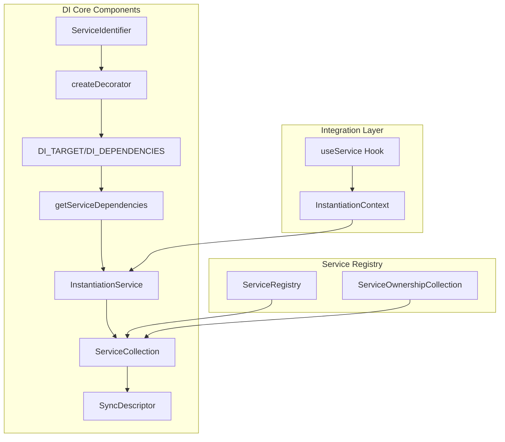
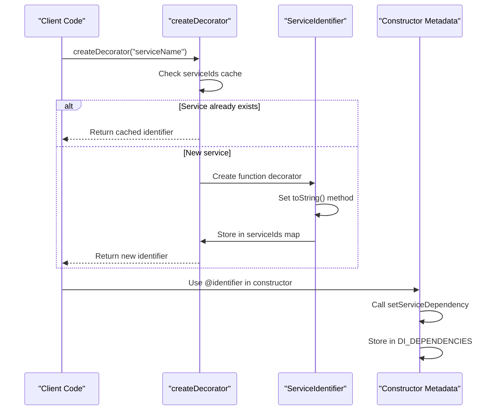
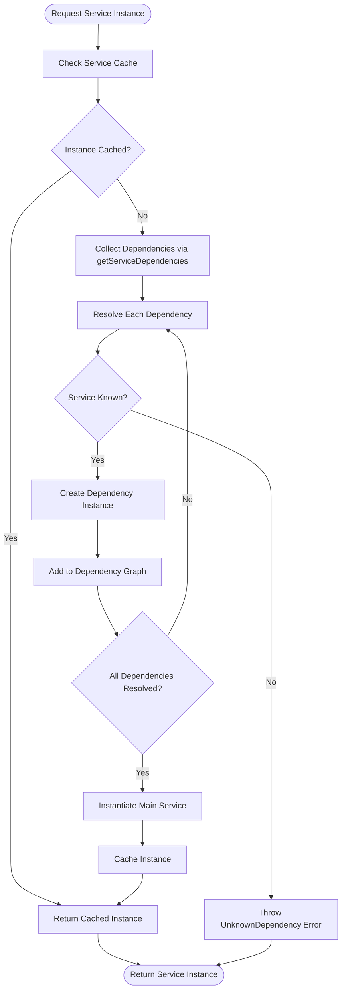
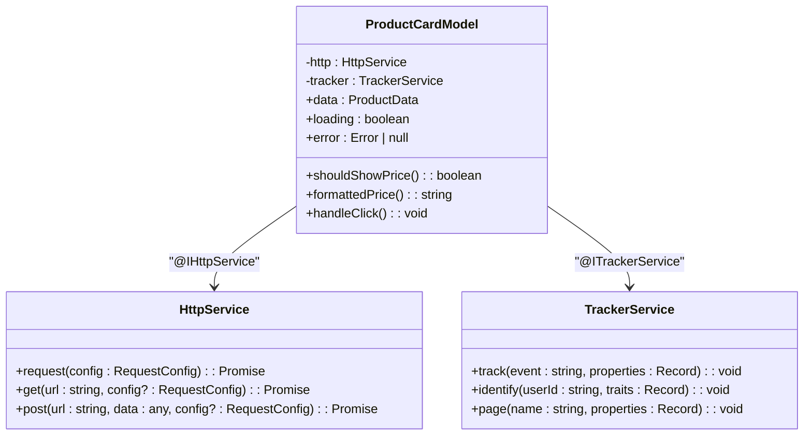
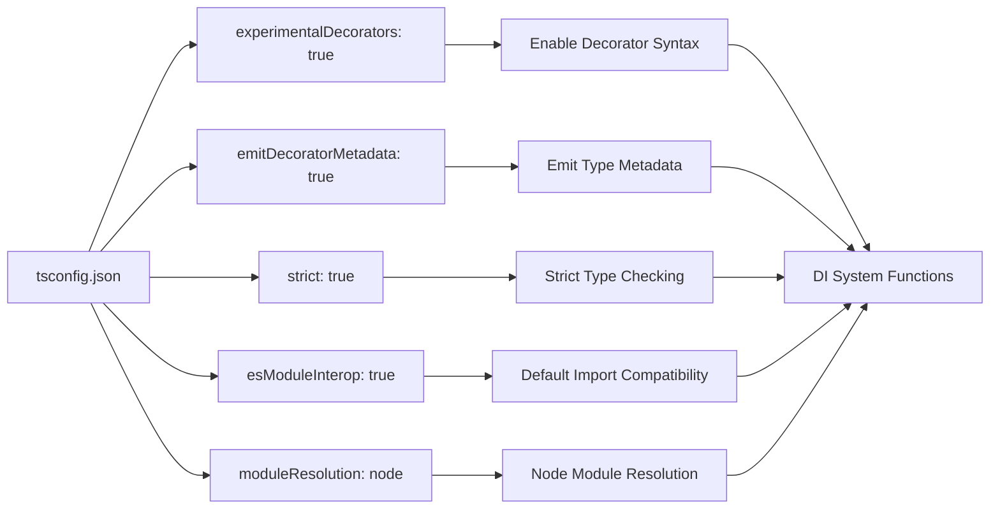
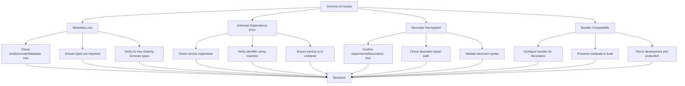
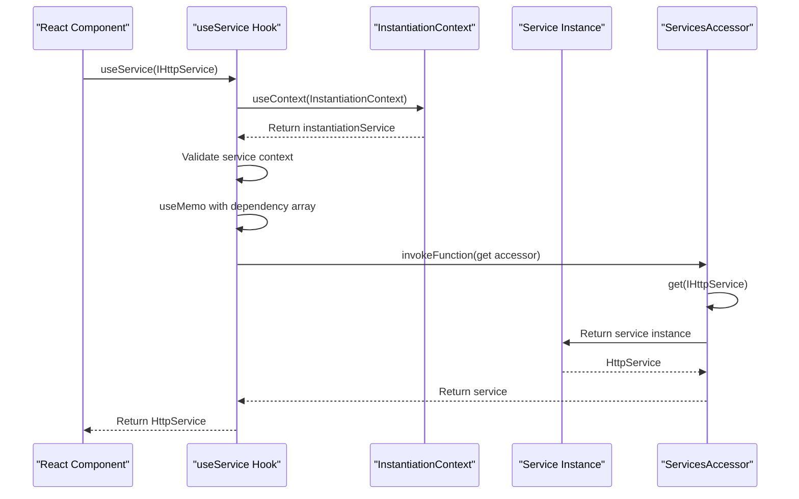

# Decorator-Based Injection

<cite>
**Referenced Files in This Document**   
- [base.ts](file://packages/h5-builder/src/bedrock/di/base.ts)
- [descriptor.ts](file://packages/h5-builder/src/bedrock/di/descriptor.ts)
- [instantiation-service.ts](file://packages/h5-builder/src/bedrock/di/instantiation-service.ts)
- [service-identifiers.ts](file://packages/h5-builder/src/services/service-identifiers.ts)
- [product-card.model.ts](file://packages/h5-builder/src/components/product-card/product-card.model.ts)
- [tsconfig.json](file://packages/h5-builder/tsconfig.json)
- [context.web.tsx](file://packages/h5-builder/src/bedrock/di/context.web.tsx)
- [index.common.ts](file://packages/h5-builder/src/bedrock/di/index.common.ts)
</cite>

## Table of Contents
1. [Introduction](#introduction)
2. [Core Architecture](#core-architecture)
3. [Service Identifier Creation](#service-identifier-creation)
4. [Metadata Storage and Retrieval](#metadata-storage-and-retrieval)
5. [Dependency Injection Workflow](#dependency-injection-workflow)
6. [Usage Examples](#usage-examples)
7. [Configuration Requirements](#configuration-requirements)
8. [Troubleshooting Guide](#troubleshooting-guide)
9. [Integration with React Context](#integration-with-react-context)

## Introduction
The MobX H5 Builder implements a sophisticated decorator-based dependency injection (DI) system that enables clean separation of concerns and modular architecture. This system leverages TypeScript decorators to mark injectable dependencies, stores metadata on constructors, and resolves dependencies through an instantiation service. The implementation provides type safety, supports both eager and lazy instantiation, and integrates seamlessly with React components through context and hooks.

**Section sources**
- [base.ts](file://packages/h5-builder/src/bedrock/di/base.ts)
- [instantiation-service.ts](file://packages/h5-builder/src/bedrock/di/instantiation-service.ts)

## Core Architecture
The dependency injection system in MobX H5 Builder consists of several key components that work together to provide a robust service resolution mechanism. At its core, the system uses a hierarchical instantiation service that can create child containers, manage service lifecycles, and resolve dependencies through metadata stored on class constructors.



**Diagram sources**
- [base.ts](file://packages/h5-builder/src/bedrock/di/base.ts#L9-L73)
- [instantiation-service.ts](file://packages/h5-builder/src/bedrock/di/instantiation-service.ts#L61-L467)
- [service-collection.ts](file://packages/h5-builder/src/bedrock/di/service-collection.ts)
- [service-registry.ts](file://packages/h5-builder/src/bedrock/di/service-registry.ts)

**Section sources**
- [base.ts](file://packages/h5-builder/src/bedrock/di/base.ts)
- [instantiation-service.ts](file://packages/h5-builder/src/bedrock/di/instantiation-service.ts)
- [service-collection.ts](file://packages/h5-builder/src/bedrock/di/service-collection.ts)

## Service Identifier Creation
The `createDecorator` function is the foundation of the DI system, generating `ServiceIdentifier` instances that act as parameter decorators. These identifiers are unique tokens that represent services in the dependency container and enable type-safe dependency resolution.



**Diagram sources**
- [base.ts](file://packages/h5-builder/src/bedrock/di/base.ts#L50-L66)
- [base.ts](file://packages/h5-builder/src/bedrock/di/base.ts#L31-L39)

**Section sources**
- [base.ts](file://packages/h5-builder/src/bedrock/di/base.ts#L43-L66)
- [index.common.ts](file://packages/h5-builder/src/bedrock/di/index.common.ts#L4)

## Metadata Storage and Retrieval
The DI system stores dependency metadata on class constructors using two special symbols: `DI_TARGET` and `DI_DEPENDENCIES`. This metadata is crucial for the dependency resolution process and is accessed through the `getServiceDependencies` function during instantiation.

```mermaid
classDiagram
class ServiceIdentifier~T~ {
<<interface>>
(...args : any[]) : void
type : T
}
class DI_CONSTANTS {
+static DI_TARGET : string
+static DI_DEPENDENCIES : string
}
class MetadataStorage {
+getServiceDependencies(ctor : any) : {id : ServiceIdentifier<any>, index : number}[]
-setServiceDependency(id : ServiceIdentifier<any>, ctor : any, index : number) : void
}
ServiceIdentifier --> MetadataStorage : "used by"
DI_CONSTANTS --> MetadataStorage : "references"
MetadataStorage --> "ctor[DI_DEPENDENCIES]" : "writes to"
MetadataStorage --> "ctor[DI_TARGET]" : "writes to"
```

**Diagram sources**
- [base.ts](file://packages/h5-builder/src/bedrock/di/base.ts#L22-L29)
- [base.ts](file://packages/h5-builder/src/bedrock/di/base.ts#L31-L39)

**Section sources**
- [base.ts](file://packages/h5-builder/src/bedrock/di/base.ts#L22-L39)

## Dependency Injection Workflow
The dependency injection workflow begins when a class constructor is decorated with service identifiers and proceeds through a series of steps to resolve and instantiate dependencies. The `InstantiationService` orchestrates this process, ensuring proper dependency ordering and lifecycle management.



**Diagram sources**
- [instantiation-service.ts](file://packages/h5-builder/src/bedrock/di/instantiation-service.ts#L216-L253)
- [instantiation-service.ts](file://packages/h5-builder/src/bedrock/di/instantiation-service.ts#L308-L395)

**Section sources**
- [instantiation-service.ts](file://packages/h5-builder/src/bedrock/di/instantiation-service.ts#L215-L450)

## Usage Examples
The DI system is used throughout the MobX H5 Builder components, with service identifiers imported from the service-identifiers module and applied as parameter decorators in class constructors. This pattern enables clean dependency declaration and injection.



**Diagram sources**
- [product-card.model.ts](file://packages/h5-builder/src/components/product-card/product-card.model.ts#L29-L38)
- [service-identifiers.ts](file://packages/h5-builder/src/services/service-identifiers.ts)

**Section sources**
- [product-card.model.ts](file://packages/h5-builder/src/components/product-card/product-card.model.ts)
- [service-identifiers.ts](file://packages/h5-builder/src/services/service-identifiers.ts)

## Configuration Requirements
Proper configuration of TypeScript is essential for the decorator-based DI system to function correctly. The `tsconfig.json` file must include specific compiler options to enable decorator support and metadata emission.



**Diagram sources**
- [tsconfig.json](file://packages/h5-builder/tsconfig.json#L20-L21)

**Section sources**
- [tsconfig.json](file://packages/h5-builder/tsconfig.json)

## Troubleshooting Guide
Common issues with decorator-based dependency injection typically relate to configuration, metadata loss, or incorrect decorator application. Understanding these issues and their solutions is crucial for maintaining a healthy DI system.



**Diagram sources**
- [base.ts](file://packages/h5-builder/src/bedrock/di/base.ts)
- [instantiation-service.ts](file://packages/h5-builder/src/bedrock/di/instantiation-service.ts)
- [tsconfig.json](file://packages/h5-builder/tsconfig.json)

**Section sources**
- [instantiation-service.ts](file://packages/h5-builder/src/bedrock/di/instantiation-service.ts#L224-L229)
- [base.ts](file://packages/h5-builder/src/bedrock/di/base.ts#L57)

## Integration with React Context
The DI system integrates with React through the `InstantiationContext` provider and `useService` hook, enabling functional components to access services from the dependency container. This integration bridges the gap between class-based DI and modern React patterns.



**Diagram sources**
- [context.web.tsx](file://packages/h5-builder/src/bedrock/di/context.web.tsx)
- [instantiation-service.ts](file://packages/h5-builder/src/bedrock/di/instantiation-service.ts#L118-L148)

**Section sources**
- [context.web.tsx](file://packages/h5-builder/src/bedrock/di/context.web.tsx)
- [instantiation-service.ts](file://packages/h5-builder/src/bedrock/di/instantiation-service.ts#L118-L148)