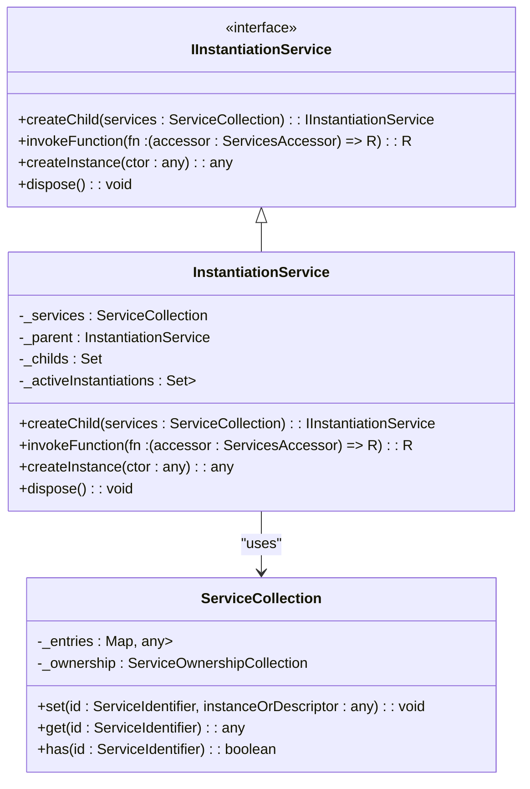
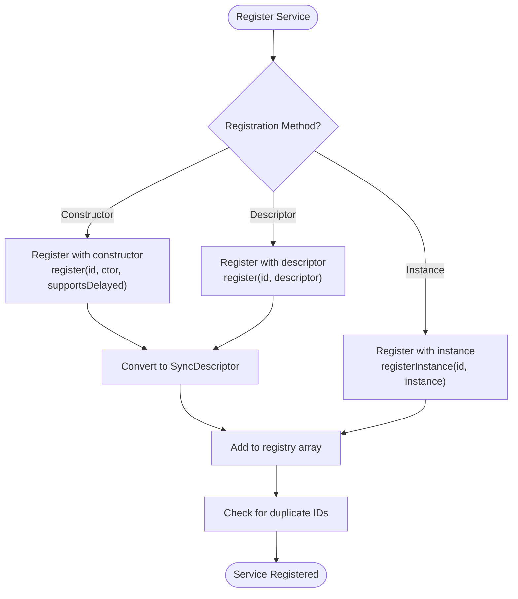
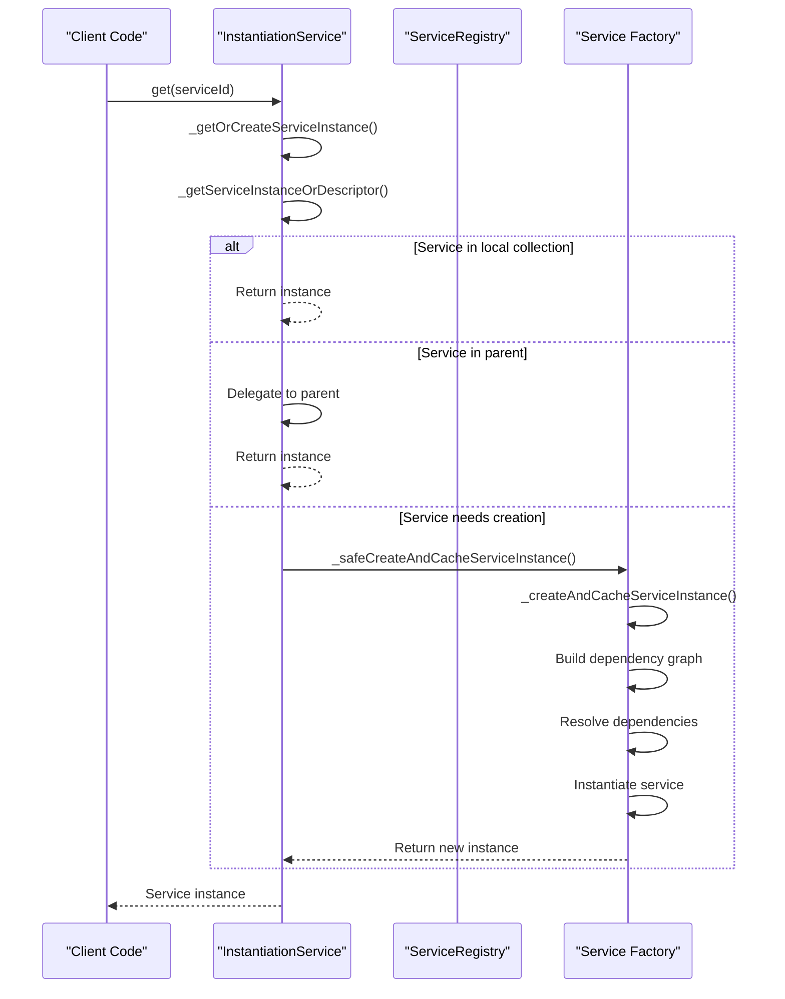
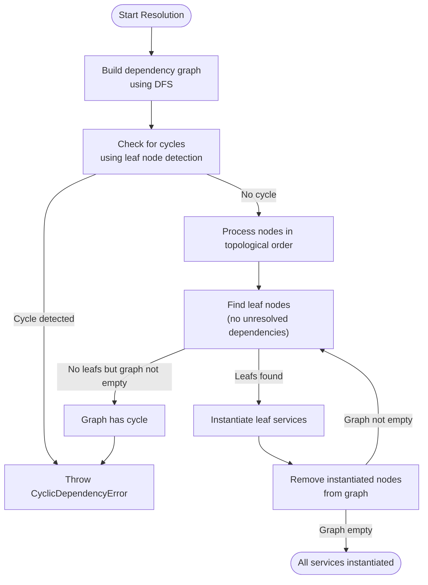
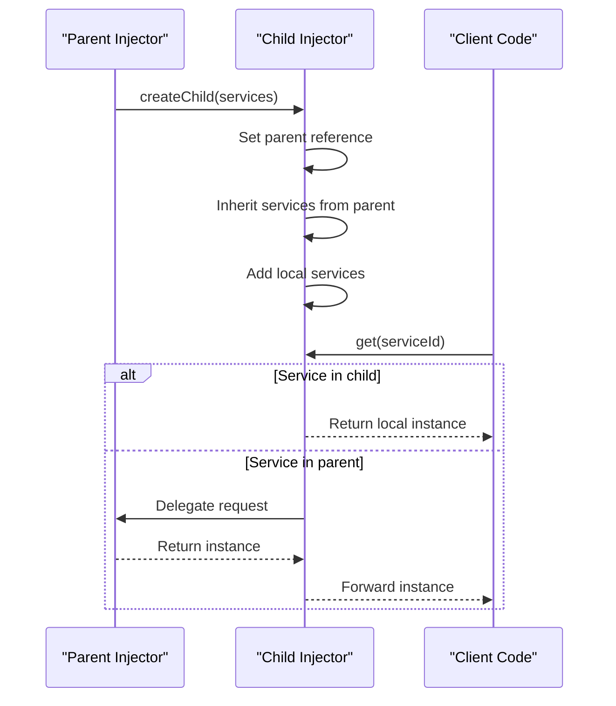
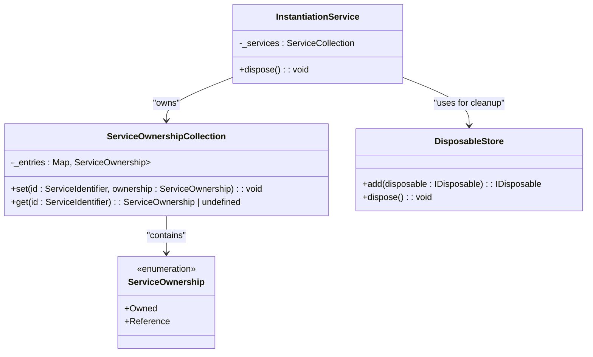

# Dependency Injection System

<cite>
**Referenced Files in This Document**   
- [base.ts](file://packages/h5-builder/src/bedrock/di/base.ts)
- [service-registry.ts](file://packages/h5-builder/src/bedrock/di/service-registry.ts)
- [service-collection.ts](file://packages/h5-builder/src/bedrock/di/service-collection.ts)
- [instantiation-service.ts](file://packages/h5-builder/src/bedrock/di/instantiation-service.ts)
- [descriptor.ts](file://packages/h5-builder/src/bedrock/di/descriptor.ts)
- [service-ownership-collection.ts](file://packages/h5-builder/src/bedrock/di/service-ownership-collection.ts)
- [context.web.tsx](file://packages/h5-builder/src/bedrock/di/context.web.tsx)
- [proxy-builder.ts](file://packages/h5-builder/src/bedrock/di/proxy-builder.ts)
- [idle-value.ts](file://packages/h5-builder/src/bedrock/di/idle-value.ts)
- [trace.ts](file://packages/h5-builder/src/bedrock/di/trace.ts)
- [http.service.ts](file://packages/h5-builder/src/services/http.service.ts)
- [bridge.service.ts](file://packages/h5-builder/src/services/bridge.service.ts)
- [service-identifiers.ts](file://packages/h5-builder/src/services/service-identifiers.ts)
- [model.ts](file://packages/h5-builder/src/bedrock/model.ts)
- [instantiation-service.test.ts](file://packages/h5-builder/src/bedrock/di/instantiation-service.test.ts)
</cite>

## Table of Contents
1. [Introduction](#introduction)
2. [Core Components](#core-components)
3. [Injector Class Design](#injector-class-design)
4. [Service Registration](#service-registration)
5. [Service Resolution and Instantiation](#service-resolution-and-instantiation)
6. [Dependency Resolution Algorithm](#dependency-resolution-algorithm)
7. [Decorator-Based Injection](#decorator-based-injection)
8. [Child Injectors and Service Ownership](#child-injectors-and-service-ownership)
9. [Practical Examples](#practical-examples)
10. [Advanced Topics](#advanced-topics)
11. [Troubleshooting Guide](#troubleshooting-guide)

## Introduction
The Dependency Injection (DI) system in the MobX framework provides a comprehensive solution for managing service dependencies and object creation. This documentation details the architecture and implementation of the DI system, focusing on the Injector class (implemented as InstantiationService), service registration, resolution, and instantiation mechanisms. The system enables clean separation of concerns, promotes testability, and facilitates complex dependency management in large-scale applications.

## Core Components
The DI system consists of several key components that work together to provide dependency injection capabilities. These components include the service registry, service collection, instantiation service, service descriptors, and various supporting utilities for dependency tracking and resolution.

**Section sources**
- [base.ts](file://packages/h5-builder/src/bedrock/di/base.ts#L1-L74)
- [service-registry.ts](file://packages/h5-builder/src/bedrock/di/service-registry.ts#L1-L100)
- [service-collection.ts](file://packages/h5-builder/src/bedrock/di/service-collection.ts#L1-L47)
- [instantiation-service.ts](file://packages/h5-builder/src/bedrock/di/instantiation-service.ts#L1-L468)

## Injector Class Design
The Injector class, implemented as InstantiationService, serves as the central component of the DI system. It manages service registration, resolution, and instantiation, providing a clean API for working with dependencies. The class follows the service locator pattern while maintaining control over object creation and lifecycle management.



**Diagram sources **
- [instantiation-service.ts](file://packages/h5-builder/src/bedrock/di/instantiation-service.ts#L61-L468)
- [service-collection.ts](file://packages/h5-builder/src/bedrock/di/service-collection.ts#L14-L47)

**Section sources**
- [instantiation-service.ts](file://packages/h5-builder/src/bedrock/di/instantiation-service.ts#L61-L468)

## Service Registration
The DI system provides multiple mechanisms for registering services, allowing flexibility in how dependencies are configured and managed. Services can be registered through constructors, descriptors, or as pre-instantiated instances.

### Registration Methods
The system supports three primary registration methods:
1. Registering services via constructor functions
2. Registering services via SyncDescriptor objects
3. Registering pre-instantiated service instances



**Diagram sources **
- [service-registry.ts](file://packages/h5-builder/src/bedrock/di/service-registry.ts#L35-L88)
- [descriptor.ts](file://packages/h5-builder/src/bedrock/di/descriptor.ts#L8-L22)

**Section sources**
- [service-registry.ts](file://packages/h5-builder/src/bedrock/di/service-registry.ts#L16-L100)

## Service Resolution and Instantiation
Service resolution and instantiation are core capabilities of the DI system, enabling automatic creation of objects with their dependencies properly injected. The system handles both immediate and delayed instantiation based on service requirements.

### Service Resolution Process
The service resolution process follows a hierarchical approach, checking the current container first, then delegating to parent containers if necessary. This allows for flexible service scoping and inheritance.



**Diagram sources **
- [instantiation-service.ts](file://packages/h5-builder/src/bedrock/di/instantiation-service.ts#L278-L396)
- [service-collection.ts](file://packages/h5-builder/src/bedrock/di/service-collection.ts#L43-L46)

**Section sources**
- [instantiation-service.ts](file://packages/h5-builder/src/bedrock/di/instantiation-service.ts#L278-L396)

## Dependency Resolution Algorithm
The DI system employs a sophisticated dependency resolution algorithm that handles complex dependency graphs, prevents circular dependencies, and ensures proper instantiation order. The algorithm uses a combination of graph theory and depth-first search to resolve dependencies safely.

### Algorithm Overview
The dependency resolution algorithm works by constructing a temporary dependency graph and processing it in topological order. This ensures that services are instantiated only after all their dependencies have been resolved.



**Diagram sources **
- [instantiation-service.ts](file://packages/h5-builder/src/bedrock/di/instantiation-service.ts#L309-L396)
- [structure/graph.ts](file://packages/h5-builder/src/bedrock/structure/graph.ts)

**Section sources**
- [instantiation-service.ts](file://packages/h5-builder/src/bedrock/di/instantiation-service.ts#L309-L396)

## Decorator-Based Injection
The DI system uses TypeScript decorators to declare dependencies in a clean and intuitive way. The @Inject decorator (implemented through ServiceIdentifier) marks constructor parameters as dependencies that should be resolved by the injector.

### Decorator Implementation
The decorator system works by storing dependency metadata on constructor functions, which is then used by the instantiation service to resolve and inject dependencies during object creation.

```mermaid
classDiagram
class ServiceIdentifier~T~ {
<<interface>>
+type : T
}
class createDecorator {
+createDecorator(serviceId : string) : ServiceIdentifier~T~
}
class DI_TARGET {
+$di$target : any
}
class DI_DEPENDENCIES {
+$di$dependencies : Array<{id : ServiceIdentifier<any>, index : number}>
}
class getServiceDependencies {
+getServiceDependencies(ctor : any) : Array<{id : ServiceIdentifier<any>, index : number}>
}
class setServiceDependency {
+setServiceDependency(id : ServiceIdentifier<any>, ctor : any, index : number) : void
}
createDecorator --> ServiceIdentifier~T~ : "returns"
setServiceDependency --> DI_DEPENDENCIES : "modifies"
getServiceDependencies --> DI_DEPENDENCIES : "reads"
DI_TARGET --> DI_DEPENDENCIES : "related to"
```

**Diagram sources **
- [base.ts](file://packages/h5-builder/src/bedrock/di/base.ts#L9-L66)
- [http.service.ts](file://packages/h5-builder/src/services/http.service.ts#L75-L76)

**Section sources**
- [base.ts](file://packages/h5-builder/src/bedrock/di/base.ts#L9-L74)

## Child Injectors and Service Ownership
The DI system supports hierarchical injectors and service ownership models, enabling advanced scenarios like service isolation, scoped dependencies, and controlled service disposal.

### Child Injector Creation
Child injectors provide isolated service containers that inherit services from their parent while allowing for local overrides. This enables scenarios like component-level dependency injection with isolated service instances.



**Diagram sources **
- [instantiation-service.ts](file://packages/h5-builder/src/bedrock/di/instantiation-service.ts#L111-L114)
- [instantiation-service.ts](file://packages/h5-builder/src/bedrock/di/instantiation-service.ts#L268-L275)

**Section sources**
- [instantiation-service.ts](file://packages/h5-builder/src/bedrock/di/instantiation-service.ts#L111-L114)
- [service-ownership-collection.ts](file://packages/h5-builder/src/bedrock/di/service-ownership-collection.ts#L3-L39)

## Practical Examples
This section demonstrates practical usage of the DI system through real-world examples from the codebase, showing how services are registered, injected, and used in models and components.

### Service Registration Example
The following example shows how services are registered with the DI system using service identifiers and constructors:

```typescript
// Service identifiers defined in service-identifiers.ts
export const IHttpService = createDecorator<HttpService>('httpService');
export const IBridgeService = createDecorator<BridgeService>('bridgeService');

// Service registration in a container
serviceRegistry.register(IHttpService, HttpService);
serviceRegistry.register(IBridgeService, BridgeService);
```

### Model Injection Example
Models can leverage DI to receive their dependencies through constructor injection:

```typescript
export class HttpService implements IDisposable {
  readonly _serviceBrand: undefined;
  
  constructor(
    options: HttpServiceOptions | undefined,
    @IBridgeService private bridge: BridgeService,
  ) {
    // Dependencies are automatically resolved
  }
}
```

**Section sources**
- [service-identifiers.ts](file://packages/h5-builder/src/services/service-identifiers.ts#L1-L20)
- [http.service.ts](file://packages/h5-builder/src/services/http.service.ts#L56-L76)
- [bridge.service.ts](file://packages/h5-builder/src/services/bridge.service.ts#L39-L47)

## Advanced Topics
This section covers advanced features and concepts of the DI system, including service ownership, disposal semantics, and performance optimizations.

### Service Ownership and Disposal
The DI system implements a sophisticated service ownership model that determines how services are disposed when containers are destroyed. Services can be owned by the container or referenced from external sources.



**Diagram sources **
- [service-ownership-collection.ts](file://packages/h5-builder/src/bedrock/di/service-ownership-collection.ts#L3-L39)
- [instantiation-service.ts](file://packages/h5-builder/src/bedrock/di/instantiation-service.ts#L178-L213)

**Section sources**
- [service-ownership-collection.ts](file://packages/h5-builder/src/bedrock/di/service-ownership-collection.ts#L3-L39)
- [instantiation-service.ts](file://packages/h5-builder/src/bedrock/di/instantiation-service.ts#L178-L213)

## Troubleshooting Guide
This section provides guidance for diagnosing and resolving common issues encountered when working with the DI system.

### Common Issues and Solutions
The following table outlines common DI-related issues and their solutions:

| Issue | Symptoms | Solution |
|-------|----------|----------|
| Circular Dependencies | Application fails to start with "cyclic dependency" error | Restructure dependencies to eliminate cycles, use lazy loading, or inject the service container instead of direct dependencies |
| Missing Service Registrations | Errors indicating "unknown service" or "service not registered" | Ensure all required services are registered before they are needed, check service identifier names for typos |
| Service Disposal Issues | Memory leaks or services being disposed prematurely | Verify service ownership settings, ensure proper disposal chain, check for circular references in disposables |
| Incorrect Service Scope | Services shared when they should be isolated or vice versa | Use child injectors for isolated scopes, verify service registration location (parent vs. child container) |
| Performance Problems | Slow application startup or service creation | Use delayed instantiation for expensive services, implement lazy loading, optimize dependency graphs |

**Section sources**
- [instantiation-service.ts](file://packages/h5-builder/src/bedrock/di/instantiation-service.ts#L297-L305)
- [instantiation-service.test.ts](file://packages/h5-builder/src/bedrock/di/instantiation-service.test.ts#L62-L73)
- [instantiation-service.ts](file://packages/h5-builder/src/bedrock/di/instantiation-service.ts#L340-L346)