# Injector Core

<cite>
**Referenced Files in This Document**   
- [instantiation-service.ts](file://packages/h5-builder/src/bedrock/di/instantiation-service.ts)
- [base.ts](file://packages/h5-builder/src/bedrock/di/base.ts)
- [service-collection.ts](file://packages/h5-builder/src/bedrock/di/service-collection.ts)
- [service-ownership-collection.ts](file://packages/h5-builder/src/bedrock/di/service-ownership-collection.ts)
- [descriptor.ts](file://packages/h5-builder/src/bedrock/di/descriptor.ts)
- [instantiation-service.interface.ts](file://packages/h5-builder/src/bedrock/di/instantiation-service.interface.ts)
- [proxy-builder.ts](file://packages/h5-builder/src/bedrock/di/proxy-builder.ts)
- [idle-value.ts](file://packages/h5-builder/src/bedrock/di/idle-value.ts)
- [lazy-service.ts](file://packages/h5-builder/src/bedrock/di/lazy/lazy-service.ts)
- [context.web.tsx](file://packages/h5-builder/src/bedrock/di/context.web.tsx)
- [service-registry.ts](file://packages/h5-builder/src/bedrock/di/service-registry.ts)
</cite>

## Table of Contents
1. [Introduction](#introduction)
2. [Core Architecture](#core-architecture)
3. [Service Lifecycle Management](#service-lifecycle-management)
4. [Dependency Resolution and Injection](#dependency-resolution-and-injection)
5. [Key Methods and Functionality](#key-methods-and-functionality)
6. [Parent-Child Injector Hierarchies](#parent-child-injector-hierarchies)
7. [Eager and Lazy Instantiation](#eager-and-lazy-instantiation)
8. [Service Ownership and Disposal](#service-ownership-and-disposal)
9. [Integration with Decorators](#integration-with-decorators)
10. [Dependency Metadata and Service Dependencies](#dependency-metadata-and-service-dependencies)
11. [Troubleshooting Common Issues](#troubleshooting-common-issues)
12. [Integration with React Context](#integration-with-react-context)

## Introduction
The Injector class, implemented as `InstantiationService` in the MobX codebase, serves as the central container for dependency resolution and service instantiation. This document provides a comprehensive analysis of its architecture, functionality, and usage patterns. The injector manages service lifecycles, resolves dependencies through constructor injection, and supports both eager and lazy instantiation strategies. It plays a critical role in the dependency injection system by maintaining service collections, handling parent-child injector hierarchies, and ensuring proper disposal of owned services. The implementation leverages TypeScript decorators, service descriptors, and ownership semantics to provide a robust and flexible dependency injection framework.

**Section sources**
- [instantiation-service.ts](file://packages/h5-builder/src/bedrock/di/instantiation-service.ts#L61-L468)

## Core Architecture
The Injector class is implemented as the `InstantiationService` class, which implements the `IInstantiationService` interface. The architecture is built around several core components that work together to provide dependency injection capabilities.

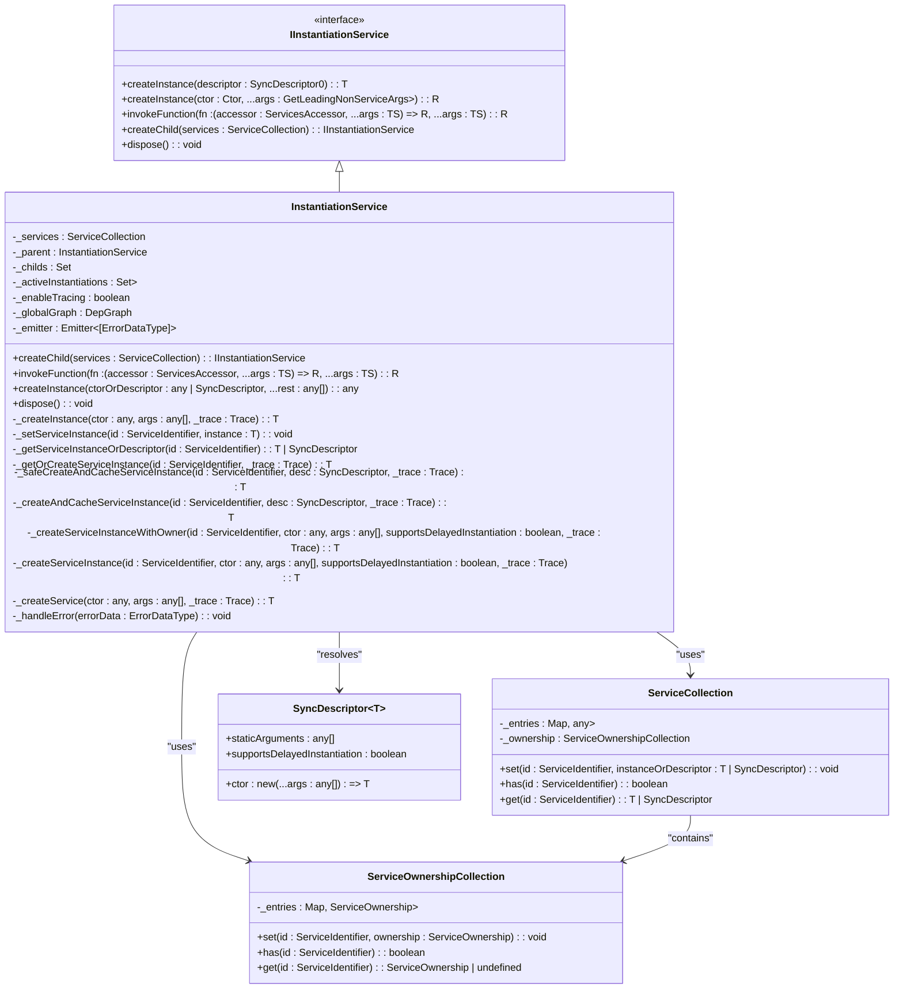

**Diagram sources**
- [instantiation-service.ts](file://packages/h5-builder/src/bedrock/di/instantiation-service.ts#L61-L468)
- [service-collection.ts](file://packages/h5-builder/src/bedrock/di/service-collection.ts#L14-L47)
- [descriptor.ts](file://packages/h5-builder/src/bedrock/di/descriptor.ts#L8-L22)
- [service-ownership-collection.ts](file://packages/h5-builder/src/bedrock/di/service-ownership-collection.ts#L14-L39)

**Section sources**
- [instantiation-service.ts](file://packages/h5-builder/src/bedrock/di/instantiation-service.ts#L61-L468)
- [service-collection.ts](file://packages/h5-builder/src/bedrock/di/service-collection.ts#L14-L47)
- [descriptor.ts](file://packages/h5-builder/src/bedrock/di/descriptor.ts#L8-L22)
- [service-ownership-collection.ts](file://packages/h5-builder/src/bedrock/di/service-ownership-collection.ts#L14-L39)

## Service Lifecycle Management
The Injector class provides comprehensive service lifecycle management through its instantiation and disposal mechanisms. Services can be registered with different instantiation types (eager or delayed) and ownership semantics, allowing fine-grained control over their lifecycle.

The service lifecycle begins with registration, where services are added to the injector's service collection either as constructors or as `SyncDescriptor` objects. When a service is first requested, the injector creates an instance and caches it for future use. The injector tracks active instantiations to prevent circular dependencies and ensures that services are only instantiated once.

For disposal, the injector implements a hierarchical disposal mechanism. When `dispose()` is called on an injector, it first disposes of all child injectors, then disposes of services that it owns based on the service ownership rules. This ensures proper cleanup of resources and prevents memory leaks.

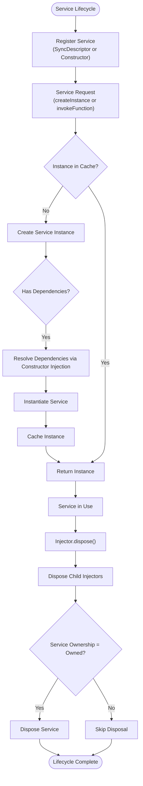

**Diagram sources**
- [instantiation-service.ts](file://packages/h5-builder/src/bedrock/di/instantiation-service.ts#L178-L213)
- [service-ownership-collection.ts](file://packages/h5-builder/src/bedrock/di/service-ownership-collection.ts#L3-L7)

**Section sources**
- [instantiation-service.ts](file://packages/h5-builder/src/bedrock/di/instantiation-service.ts#L178-L213)
- [service-ownership-collection.ts](file://packages/h5-builder/src/bedrock/di/service-ownership-collection.ts#L3-L7)

## Dependency Resolution and Injection
The Injector class implements constructor-based dependency injection, resolving dependencies by analyzing constructor parameters decorated with service identifiers. The dependency resolution process is handled through the `getServiceDependencies` function, which retrieves dependency metadata stored on constructor functions.

When a service is instantiated, the injector examines its constructor to identify dependencies. These dependencies are resolved recursively, ensuring that all required services are available before the target service is created. The resolution process follows a hierarchical lookup pattern, first checking the current injector's service collection, then delegating to the parent injector if the service is not found.

The injector prevents circular dependencies by tracking active instantiations. If a service being instantiated depends on itself (directly or indirectly), the injector throws an error. This is implemented using the `_activeInstantiations` set, which maintains a record of services currently being instantiated.

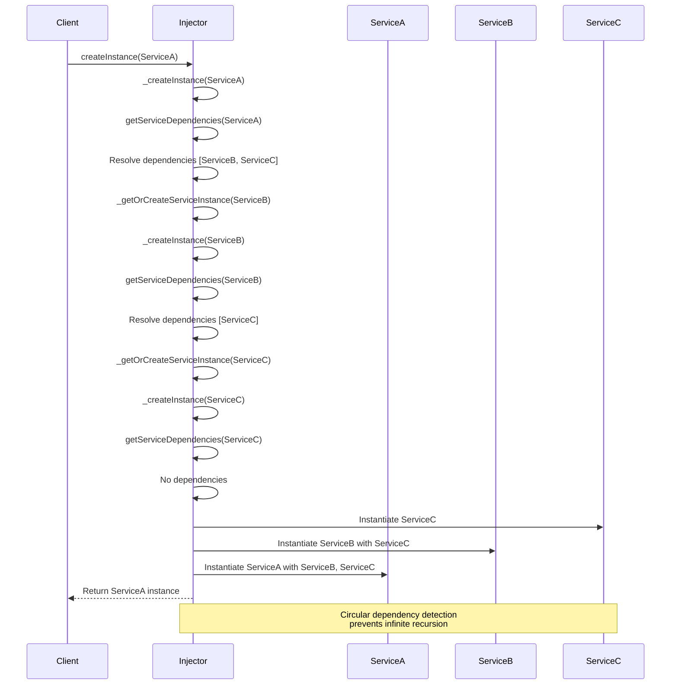

**Diagram sources**
- [instantiation-service.ts](file://packages/h5-builder/src/bedrock/di/instantiation-service.ts#L216-L254)
- [base.ts](file://packages/h5-builder/src/bedrock/di/base.ts#L27-L39)

**Section sources**
- [instantiation-service.ts](file://packages/h5-builder/src/bedrock/di/instantiation-service.ts#L216-L254)
- [base.ts](file://packages/h5-builder/src/bedrock/di/base.ts#L27-L39)

## Key Methods and Functionality
The Injector class exposes several key methods that enable dependency injection and service management. These methods form the core API for interacting with the dependency injection system.

### createChild
The `createChild` method creates a new injector that inherits services from its parent while allowing additional services to be registered. This enables hierarchical dependency injection, where child injectors can override or extend the services available in the parent.

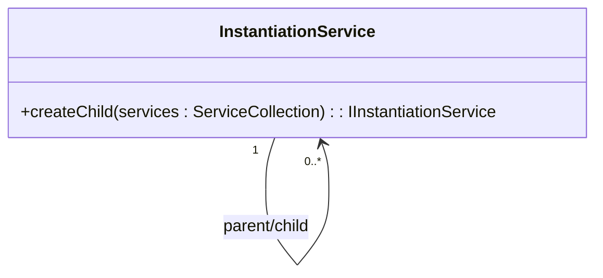

**Diagram sources**
- [instantiation-service.ts](file://packages/h5-builder/src/bedrock/di/instantiation-service.ts#L111-L114)

### invokeFunction
The `invokeFunction` method executes a function with access to the service accessor, allowing services to be retrieved within the function body. This method ensures that services are only accessible during the function invocation, preventing improper service access.

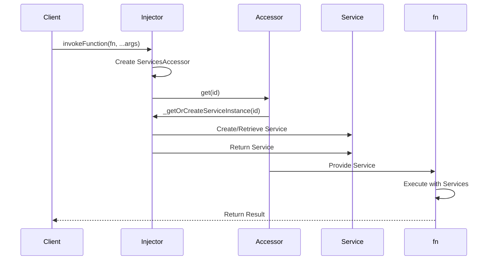

**Diagram sources**
- [instantiation-service.ts](file://packages/h5-builder/src/bedrock/di/instantiation-service.ts#L118-L148)

### createInstance
The `createInstance` method creates an instance of a service either from a constructor or a descriptor. It handles both direct constructor instantiation and descriptor-based instantiation, providing flexibility in how services are created.

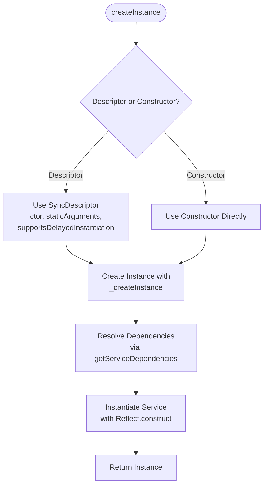

**Diagram sources**
- [instantiation-service.ts](file://packages/h5-builder/src/bedrock/di/instantiation-service.ts#L150-L176)

### dispose
The `dispose` method cleans up resources by disposing of child injectors and owned services. It implements a hierarchical disposal pattern, ensuring that all owned resources are properly cleaned up.

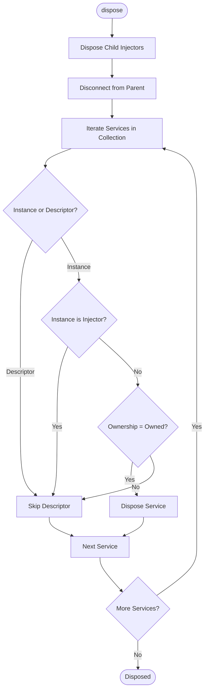

**Diagram sources**
- [instantiation-service.ts](file://packages/h5-builder/src/bedrock/di/instantiation-service.ts#L178-L213)

**Section sources**
- [instantiation-service.ts](file://packages/h5-builder/src/bedrock/di/instantiation-service.ts#L111-L213)

## Parent-Child Injector Hierarchies
The Injector class supports hierarchical injector structures through parent-child relationships. This allows for flexible service scoping and overriding, where child injectors inherit services from their parents while being able to register their own services or override parent services.

When a child injector is created using `createChild`, it maintains a reference to its parent. Service resolution follows a delegation pattern: when a service is requested, the child injector first checks its own service collection, and if the service is not found, it delegates the request to its parent. This creates a chain of responsibility for service resolution.

The hierarchical structure also affects disposal. When a parent injector is disposed, it disposes of all its children, ensuring proper cleanup of the entire injector tree. However, a child injector can be disposed independently without affecting its parent.

```mermaid
graph TD
ParentInjector[Parent Injector] --> ChildInjector1[Child Injector 1]
ParentInjector --> ChildInjector2[Child Injector 2]
ChildInjector1 --> GrandChildInjector[Grand Child Injector]
style ParentInjector fill:#f9f,stroke:#333
style ChildInjector1 fill:#bbf,stroke:#333
style ChildInjector2 fill:#bbf,stroke:#333
style GrandChildInjector fill:#9f9,stroke:#333
subgraph "Service Resolution Flow"
direction LR
Request["Service Request"] --> ChildInjector1
ChildInjector1 -- "Service Found?" --> |Yes| Return1["Return Service"]
ChildInjector1 -- "Not Found" --> ParentInjector
ParentInjector -- "Service Found?" --> |Yes| Return2["Return Service"]
ParentInjector -- "Not Found" --> Error["Error: Service Not Registered"]
end
subgraph "Disposal Flow"
direction TB
DisposeParent["Parent.dispose()"] --> DisposeChildren["Dispose Child Injectors"]
DisposeChildren --> DisposeChild1["Child1.dispose()"]
DisposeChildren --> DisposeChild2["Child2.dispose()"]
DisposeChild1 --> DisposeGrandChild["GrandChild.dispose()"]
end
```

**Diagram sources**
- [instantiation-service.ts](file://packages/h5-builder/src/bedrock/di/instantiation-service.ts#L67-L97)
- [instantiation-service.ts](file://packages/h5-builder/src/bedrock/di/instantiation-service.ts#L178-L213)

**Section sources**
- [instantiation-service.ts](file://packages/h5-builder/src/bedrock/di/instantiation-service.ts#L67-L97)

## Eager and Lazy Instantiation
The Injector class supports both eager and lazy instantiation strategies through the `supportsDelayedInstantiation` flag in the `SyncDescriptor` class. This allows services to be instantiated immediately when requested (eager) or deferred until their properties or methods are actually accessed (lazy).

Eager instantiation is the default behavior, where services are created immediately when first requested. Lazy instantiation is enabled by setting `supportsDelayedInstantiation` to true in the service descriptor. For lazy services, the injector creates a proxy wrapper around an `IdleValue` container, which defers execution until the service is actually used.

The lazy instantiation mechanism uses the browser's idle callback API to schedule service creation during idle periods, improving application performance by avoiding expensive initialization during critical rendering phases.

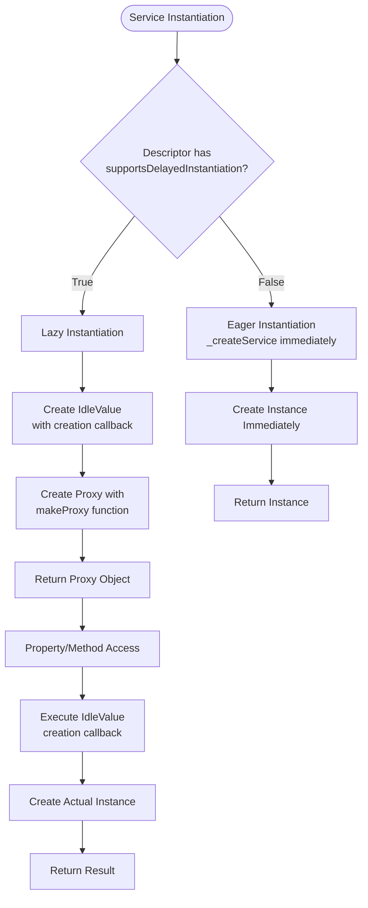

**Diagram sources**
- [instantiation-service.ts](file://packages/h5-builder/src/bedrock/di/instantiation-service.ts#L432-L439)
- [proxy-builder.ts](file://packages/h5-builder/src/bedrock/di/proxy-builder.ts#L8-L38)
- [idle-value.ts](file://packages/h5-builder/src/bedrock/di/idle-value.ts#L8-L64)

**Section sources**
- [instantiation-service.ts](file://packages/h5-builder/src/bedrock/di/instantiation-service.ts#L432-L439)
- [proxy-builder.ts](file://packages/h5-builder/src/bedrock/di/proxy-builder.ts#L8-L38)
- [idle-value.ts](file://packages/h5-builder/src/bedrock/di/idle-value.ts#L8-L64)

## Service Ownership and Disposal
The Injector class implements a sophisticated service ownership model that determines whether a service should be disposed when the injector is disposed. This is managed through the `ServiceOwnershipCollection` class, which tracks the ownership status of each service.

There are two primary ownership types:
- `ServiceOwnership.Owned`: The injector owns the service and is responsible for disposing it
- `ServiceOwnership.Reference`: The injector references the service but does not own it, so it should not be disposed

When `dispose()` is called on an injector, it iterates through its service collection and disposes of services that are marked as `Owned`. Services marked as `Reference` are skipped, allowing shared services to remain available to other injectors.

This ownership model enables flexible service sharing patterns, where services can be shared across multiple injectors without being prematurely disposed.

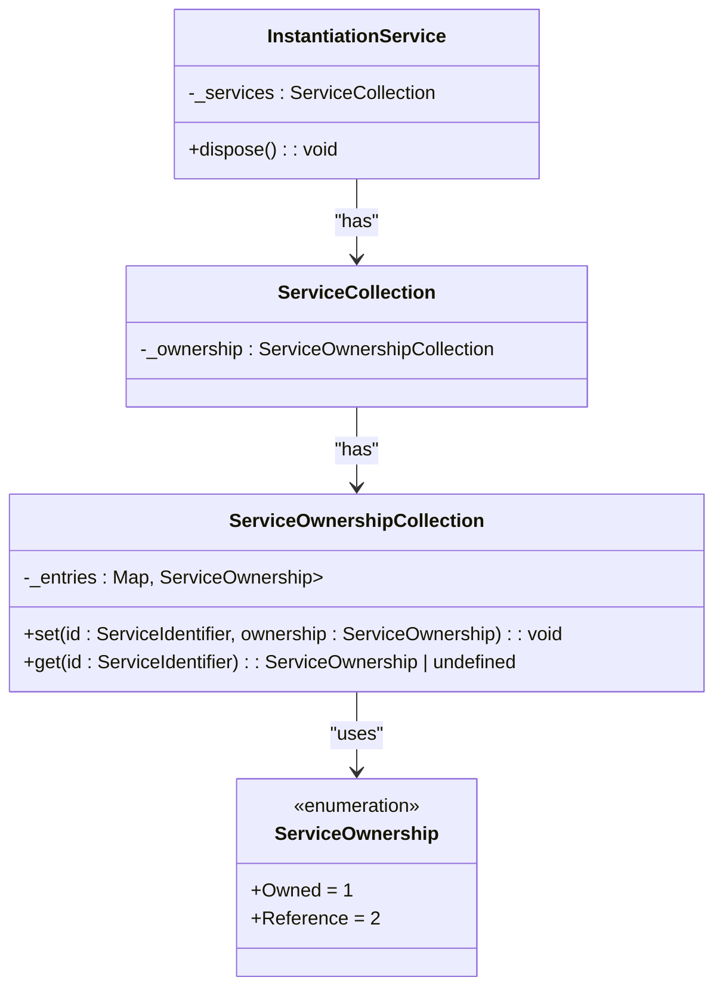

**Diagram sources**
- [service-ownership-collection.ts](file://packages/h5-builder/src/bedrock/di/service-ownership-collection.ts#L3-L39)
- [instantiation-service.ts](file://packages/h5-builder/src/bedrock/di/instantiation-service.ts#L198-L211)

**Section sources**
- [service-ownership-collection.ts](file://packages/h5-builder/src/bedrock/di/service-ownership-collection.ts#L3-L39)
- [instantiation-service.ts](file://packages/h5-builder/src/bedrock/di/instantiation-service.ts#L198-L211)

## Integration with Decorators
The Injector class integrates with TypeScript decorators to enable declarative dependency injection. The `@Inject` decorator (implemented as service identifiers created with `createDecorator`) is used to mark constructor parameters that should be resolved by the injector.

The decorator system works by storing dependency metadata on the constructor function itself. When a parameter is decorated with a service identifier, the `setServiceDependency` function adds an entry to the constructor's `DI_DEPENDENCIES` property, recording the service ID and parameter index.

This metadata is then used by the injector during instantiation to resolve dependencies and inject the appropriate services into the constructor.

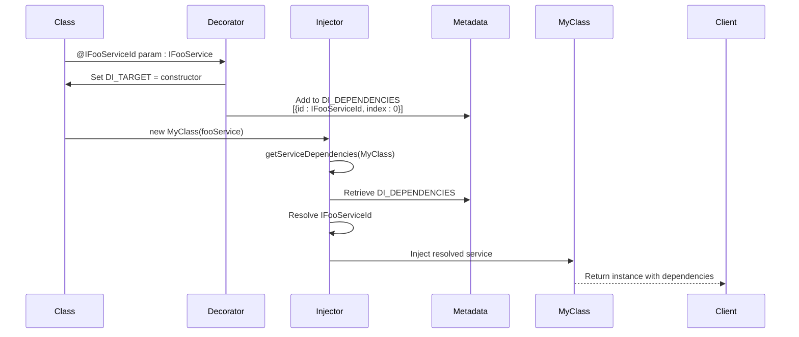

**Diagram sources**
- [base.ts](file://packages/h5-builder/src/bedrock/di/base.ts#L50-L66)
- [instantiation-service.ts](file://packages/h5-builder/src/bedrock/di/instantiation-service.ts#L218-L232)

**Section sources**
- [base.ts](file://packages/h5-builder/src/bedrock/di/base.ts#L50-L66)

## Dependency Metadata and Service Dependencies
The Injector class uses a metadata system to store and retrieve dependency information for services. This metadata is stored on constructor functions using special property keys (`DI_TARGET` and `DI_DEPENDENCIES`).

The `getServiceDependencies` function retrieves the dependency metadata for a constructor, returning an array of objects that specify the service ID and parameter index for each dependency. This information is used during instantiation to resolve dependencies in the correct order and inject them into the correct constructor parameters.

The metadata system is designed to be efficient and avoid conflicts between different decorators or metadata systems. It uses unique symbol-like keys to store the metadata, preventing naming collisions with other properties on the constructor function.

```mermaid
classDiagram
class ServiceIdentifier~T~ {
+type : T
+toString() : string
}
class Constructor {
+DI_TARGET : any
+DI_DEPENDENCIES : {id : ServiceIdentifier<any>, index : number}[]
}
class DependencyMetadata {
+getServiceDependencies(ctor : any) : {id : ServiceIdentifier<any>, index : number}[]
+setServiceDependency(id : ServiceIdentifier<any>, ctor : any, index : number) : void
}
ServiceIdentifier --> Constructor : "stored in DI_DEPENDENCIES"
DependencyMetadata --> Constructor : "reads/writes metadata"
DependencyMetadata --> ServiceIdentifier : "uses"
```

**Diagram sources**
- [base.ts](file://packages/h5-builder/src/bedrock/di/base.ts#L27-L39)
- [base.ts](file://packages/h5-builder/src/bedrock/di/base.ts#L50-L66)

**Section sources**
- [base.ts](file://packages/h5-builder/src/bedrock/di/base.ts#L27-L39)

## Troubleshooting Common Issues
This section addresses common issues that may arise when using the Injector class and provides guidance for troubleshooting and resolution.

### Missing Service Errors
Missing service errors occur when a requested service is not registered in the injector or its parent hierarchy. These errors are typically indicated by `UnknownDependency` error types.

**Symptoms:**
- `Error: [createInstance] MyService depends on UNKNOWN service IFooService`
- `Error: [invokeFunction] unknown service 'IFooService'`

**Solutions:**
1. Ensure the service is registered with the injector using `ServiceRegistry` or directly in the `ServiceCollection`
2. Verify the service identifier string matches exactly between registration and usage
3. Check that the injector hierarchy is properly established if using child injectors

### Circular Dependencies
Circular dependencies occur when two or more services depend on each other directly or indirectly, creating an infinite instantiation loop.

**Symptoms:**
- `Error: illegal state - RECURSIVELY instantiating service 'IFooService'`
- `Error: cyclic dependency between services`

**Solutions:**
1. Restructure the dependency graph to eliminate circular references
2. Use lazy injection patterns where appropriate
3. Consider using a service locator pattern for one side of the dependency
4. Break the cycle by introducing an interface or abstract base class

### Incorrect Service Ownership
Issues with service ownership can lead to memory leaks or premature disposal of shared services.

**Symptoms:**
- Services being disposed when they should remain available
- Shared services not persisting across injector lifecycles
- Memory leaks from services not being properly disposed

**Solutions:**
1. Explicitly set service ownership when registering shared services
2. Use `ServiceOwnership.Reference` for services that should not be disposed by the injector
3. Ensure proper disposal hierarchy when creating parent-child injector relationships

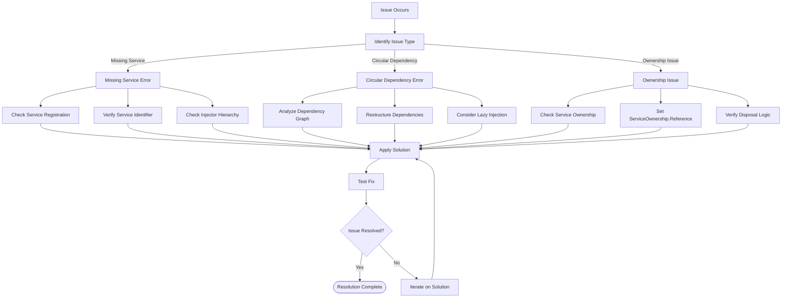

**Diagram sources**
- [instantiation-service.ts](file://packages/h5-builder/src/bedrock/di/instantiation-service.ts#L297-L305)
- [instantiation-service.ts](file://packages/h5-builder/src/bedrock/di/instantiation-service.ts#L370-L373)
- [instantiation-service.ts](file://packages/h5-builder/src/bedrock/di/instantiation-service.ts#L198-L211)

**Section sources**
- [instantiation-service.ts](file://packages/h5-builder/src/bedrock/di/instantiation-service.ts#L297-L305)
- [instantiation-service.ts](file://packages/h5-builder/src/bedrock/di/instantiation-service.ts#L370-L373)
- [instantiation-service.ts](file://packages/h5-builder/src/bedrock/di/instantiation-service.ts#L198-L211)

## Integration with React Context
The Injector class integrates with React through the `InstantiationContext` component and `useService` hook, enabling dependency injection in React components.

The `InstantiationContext` component provides the injector instance to the React context, making it available to all components in the component tree. The `useService` hook allows functional components to retrieve services from the injector using the service identifier.

This integration enables React components to access services without requiring direct references to the injector, promoting loose coupling and testability.

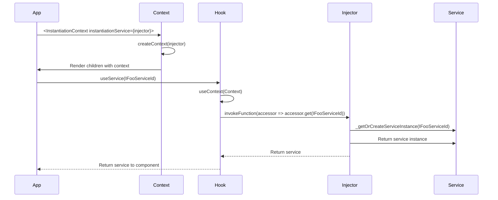

**Diagram sources**
- [context.web.tsx](file://packages/h5-builder/src/bedrock/di/context.web.tsx#L1-L42)
- [instantiation-service.ts](file://packages/h5-builder/src/bedrock/di/instantiation-service.ts#L118-L148)

**Section sources**
- [context.web.tsx](file://packages/h5-builder/src/bedrock/di/context.web.tsx#L1-L42)