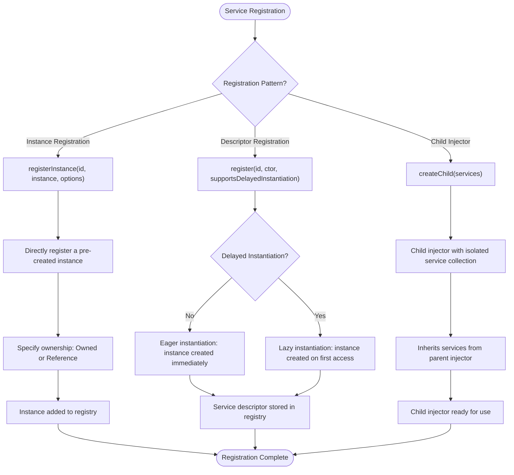
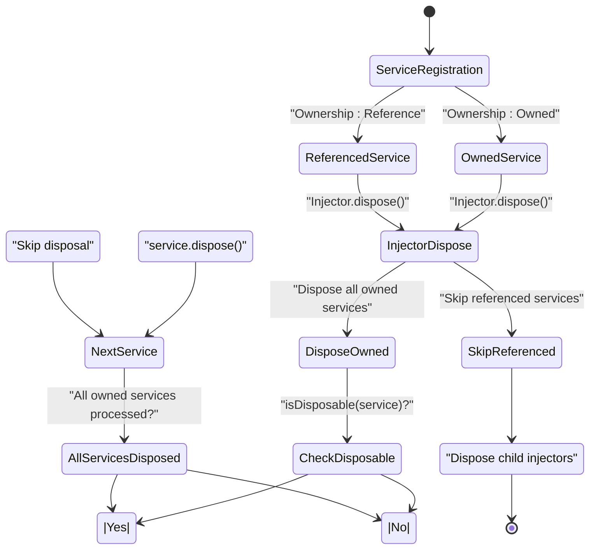
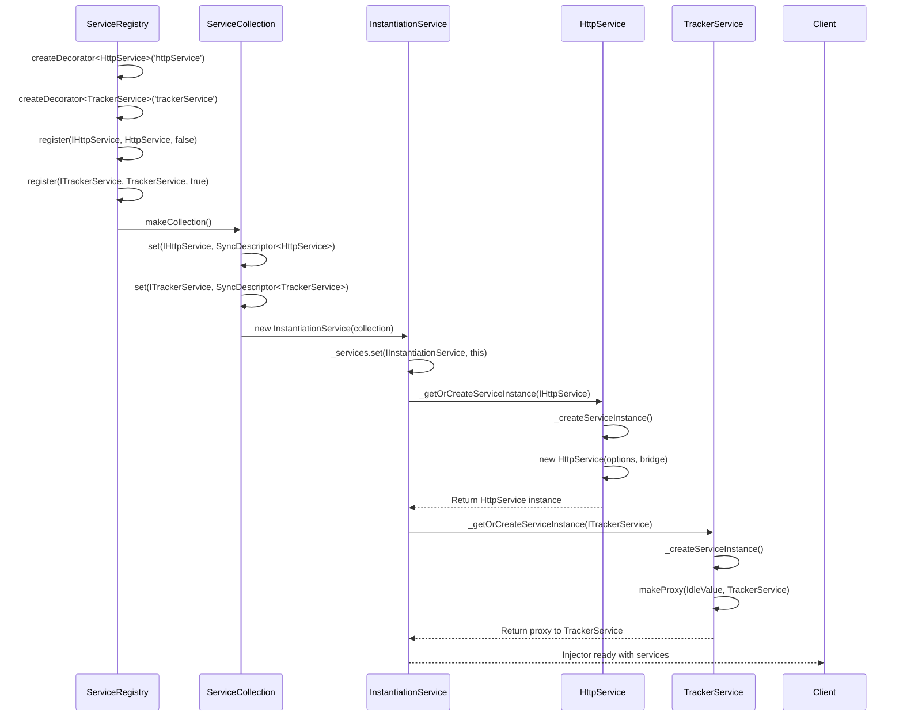
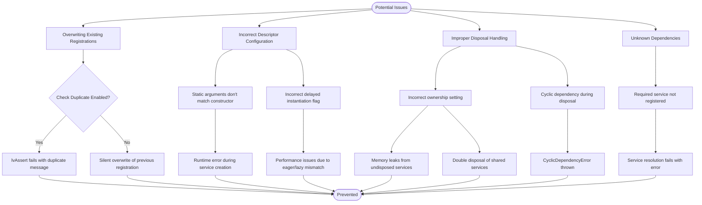

# Service Registration

<cite>
**Referenced Files in This Document**   
- [descriptor.ts](file://packages/h5-builder/src/bedrock/di/descriptor.ts)
- [service-collection.ts](file://packages/h5-builder/src/bedrock/di/service-collection.ts)
- [instantiation-service.ts](file://packages/h5-builder/src/bedrock/di/instantiation-service.ts)
- [service-registry.ts](file://packages/h5-builder/src/bedrock/di/service-registry.ts)
- [service-ownership-collection.ts](file://packages/h5-builder/src/bedrock/di/service-ownership-collection.ts)
- [base.ts](file://packages/h5-builder/src/bedrock/di/base.ts)
- [http.service.ts](file://packages/h5-builder/src/services/http.service.ts)
- [tracker.service.ts](file://packages/h5-builder/src/services/tracker.service.ts)
- [service-identifiers.ts](file://packages/h5-builder/src/services/service-identifiers.ts)
</cite>

## Table of Contents
1. [Introduction](#introduction)
2. [Core Components](#core-components)
3. [Service Registration Patterns](#service-registration-patterns)
4. [Service Ownership and Disposal](#service-ownership-and-disposal)
5. [Registration Examples](#registration-examples)
6. [Common Pitfalls](#common-pitfalls)
7. [Architecture Overview](#architecture-overview)

## Introduction
The Dependency Injection (DI) system in the MobX framework provides a robust mechanism for service registration and resolution. This document details the service registration mechanisms, focusing on how services are registered using SyncDescriptor to encapsulate constructors, static arguments, and lazy instantiation flags. The ServiceCollection class serves as the underlying registry that maps ServiceIdentifier to instances or descriptors. The system supports various registration patterns including immediate instantiation, deferred instantiation, and child injector isolation. Service ownership (owned vs referenced) plays a crucial role in disposal behavior and memory management.

## Core Components

The service registration system consists of several key components that work together to manage service lifecycle and dependencies. The SyncDescriptor class encapsulates service constructors along with their static arguments and lazy instantiation configuration. The ServiceCollection acts as a registry that maps service identifiers to either instances or descriptors. The ServiceRegistry provides a higher-level API for registering services, while the InstantiationService handles the actual creation and resolution of services.

```mermaid
classDiagram
class SyncDescriptor {
+ctor : new (...args : any[]) → T
+staticArguments : any[]
+supportsDelayedInstantiation : boolean
+constructor(ctor : new (...args : any[]) → T, staticArguments : any[], supportsDelayedInstantiation : boolean)
}
class ServiceCollection {
-_entries : Map<ServiceIdentifier<any>, any>
-_ownership : ServiceOwnershipCollection
+entries : Map<ServiceIdentifier<any>, any>
+ownerships : Map<ServiceIdentifier<any>, ServiceOwnership>
+set(id : ServiceIdentifier<T>, instanceOrDescriptor : T | SyncDescriptor<T>) : void
+has(id : ServiceIdentifier<any>) : boolean
+get(id : ServiceIdentifier<T>) : T | SyncDescriptor<T>
}
class ServiceRegistry {
-_registry : [ServiceIdentifier<any>, SyncDescriptor<any> | BrandedService][]
-_serviceOwnership : ServiceOwnershipCollection
-_ids : Set<string>
-_checkDuplicate : boolean
+register(id : ServiceIdentifier<T>, ctor : new (...services : BrandedService[]) → T, supportsDelayedInstantiation? : boolean | InstantiationType) : void
+registerInstance(id : ServiceIdentifier<T>, instance : T, options? : { ownership : ServiceOwnership }) : void
+makeCollection() : ServiceCollection
}
class ServiceOwnershipCollection {
-_entries : Map<ServiceIdentifier<any>, ServiceOwnership>
+entries : Map<ServiceIdentifier<any>, ServiceOwnership>
+set(id : ServiceIdentifier<any>, ownership : ServiceOwnership) : void
+has(id : ServiceIdentifier<any>) : boolean
+get(id : ServiceIdentifier<any>) : ServiceOwnership | undefined
}
class InstantiationService {
-_services : ServiceCollection
-_parent : InstantiationService
-_childs : Set<IInstantiationService>
-_activeInstantiations : Set<ServiceIdentifier<any>>
+createChild(services : ServiceCollection) : IInstantiationService
+invokeFunction<R, TS extends any[]>(fn : (accessor : ServicesAccessor, ...args : TS) → R, ...args : TS) : R
+createInstance<T>(descriptor : SyncDescriptor0<T>) : T
+dispose() : void
}
SyncDescriptor --> ServiceRegistry : "used in"
ServiceCollection --> ServiceRegistry : "created by"
ServiceOwnershipCollection --> ServiceCollection : "contained in"
ServiceOwnershipCollection --> ServiceRegistry : "contained in"
InstantiationService --> ServiceCollection : "contains"
InstantiationService --> InstantiationService : "parent/child"
```

**Diagram sources**
- [descriptor.ts](file://packages/h5-builder/src/bedrock/di/descriptor.ts#L8-L22)
- [service-collection.ts](file://packages/h5-builder/src/bedrock/di/service-collection.ts#L14-L46)
- [service-registry.ts](file://packages/h5-builder/src/bedrock/di/service-registry.ts#L16-L99)
- [service-ownership-collection.ts](file://packages/h5-builder/src/bedrock/di/service-ownership-collection.ts#L14-L38)
- [instantiation-service.ts](file://packages/h5-builder/src/bedrock/di/instantiation-service.ts#L61-L467)

**Section sources**
- [descriptor.ts](file://packages/h5-builder/src/bedrock/di/descriptor.ts#L8-L22)
- [service-collection.ts](file://packages/h5-builder/src/bedrock/di/service-collection.ts#L14-L46)
- [instantiation-service.ts](file://packages/h5-builder/src/bedrock/di/instantiation-service.ts#L61-L467)
- [service-registry.ts](file://packages/h5-builder/src/bedrock/di/service-registry.ts#L16-L99)
- [service-ownership-collection.ts](file://packages/h5-builder/src/bedrock/di/service-ownership-collection.ts#L14-L38)

## Service Registration Patterns

The DI system supports multiple service registration patterns to accommodate different use cases and performance requirements. Services can be registered through immediate instantiation (instance registration), deferred instantiation (descriptor registration), or child injector isolation. The SyncDescriptor class plays a central role in deferred instantiation by encapsulating the service constructor, static arguments, and lazy instantiation configuration.



**Diagram sources**
- [service-registry.ts](file://packages/h5-builder/src/bedrock/di/service-registry.ts#L35-L87)
- [instantiation-service.ts](file://packages/h5-builder/src/bedrock/di/instantiation-service.ts#L111-L114)
- [service-collection.ts](file://packages/h5-builder/src/bedrock/di/service-collection.ts#L35-L44)

**Section sources**
- [service-registry.ts](file://packages/h5-builder/src/bedrock/di/service-registry.ts#L35-L87)
- [instantiation-service.ts](file://packages/h5-builder/src/bedrock/di/instantiation-service.ts#L111-L114)
- [service-collection.ts](file://packages/h5-builder/src/bedrock/di/service-collection.ts#L35-L44)

## Service Ownership and Disposal

Service ownership determines how services are disposed of when the injector is disposed. The system distinguishes between owned services (which are disposed by the injector) and referenced services (which are not disposed by the injector). This distinction is crucial for proper memory management and preventing resource leaks.



**Diagram sources**
- [instantiation-service.ts](file://packages/h5-builder/src/bedrock/di/instantiation-service.ts#L178-L212)
- [service-ownership-collection.ts](file://packages/h5-builder/src/bedrock/di/service-ownership-collection.ts#L3-L7)

**Section sources**
- [instantiation-service.ts](file://packages/h5-builder/src/bedrock/di/instantiation-service.ts#L178-L212)
- [service-ownership-collection.ts](file://packages/h5-builder/src/bedrock/di/service-ownership-collection.ts#L3-L7)

## Registration Examples

Practical examples demonstrate how services like HttpService or TrackerService are registered with the injector. These examples illustrate the use of service identifiers, constructors, and configuration options in real-world scenarios.



**Diagram sources**
- [service-identifiers.ts](file://packages/h5-builder/src/services/service-identifiers.ts#L14-L20)
- [http.service.ts](file://packages/h5-builder/src/services/http.service.ts#L56-L271)
- [tracker.service.ts](file://packages/h5-builder/src/services/tracker.service.ts#L34-L227)
- [instantiation-service.ts](file://packages/h5-builder/src/bedrock/di/instantiation-service.ts#L278-L288)

**Section sources**
- [service-identifiers.ts](file://packages/h5-builder/src/services/service-identifiers.ts#L14-L20)
- [http.service.ts](file://packages/h5-builder/src/services/http.service.ts#L56-L271)
- [tracker.service.ts](file://packages/h5-builder/src/services/tracker.service.ts#L34-L227)

## Common Pitfalls

Several common pitfalls can occur when working with the service registration system. These include overwriting existing registrations, incorrect descriptor configuration, and improper disposal handling. Understanding these issues helps prevent bugs and ensures proper system behavior.



**Diagram sources**
- [service-registry.ts](file://packages/h5-builder/src/bedrock/di/service-registry.ts#L58-L64)
- [instantiation-service.ts](file://packages/h5-builder/src/bedrock/di/instantiation-service.ts#L224-L229)
- [instantiation-service.ts](file://packages/h5-builder/src/bedrock/di/instantiation-service.ts#L297-L298)
- [instantiation-service.ts](file://packages/h5-builder/src/bedrock/di/instantiation-service.ts#L340-L345)

**Section sources**
- [service-registry.ts](file://packages/h5-builder/src/bedrock/di/service-registry.ts#L58-L64)
- [instantiation-service.ts](file://packages/h5-builder/src/bedrock/di/instantiation-service.ts#L224-L229)
- [instantiation-service.ts](file://packages/h5-builder/src/bedrock/di/instantiation-service.ts#L297-L298)
- [instantiation-service.ts](file://packages/h5-builder/src/bedrock/di/instantiation-service.ts#L340-L345)

## Architecture Overview

The service registration architecture follows a layered approach with clear separation of concerns. The diagram below illustrates the relationships between the core components and their roles in the registration and resolution process.

```mermaid
graph TD
subgraph "Registration Layer"
Registry[ServiceRegistry]
Collection[ServiceCollection]
Ownership[ServiceOwnershipCollection]
end
subgraph "Instantiation Layer"
Injector[InstantiationService]
Descriptor[SyncDescriptor]
Accessor[ServicesAccessor]
end
subgraph "Service Layer"
Http[HttpService]
Tracker[TrackerService]
Bridge[BridgeService]
end
Registry --> Collection: makeCollection()
Registry --> Ownership: stores ownership info
Collection --> Injector: passed to constructor
Descriptor --> Registry: used in registration
Injector --> Accessor: provided to invokeFunction
Accessor --> Http: resolves dependencies
Accessor --> Tracker: resolves dependencies
Http --> Bridge: injected dependency
Tracker --> Bridge: injected dependency
Injector --> Injector: createChild() for isolation
style Registry fill:#f9f,stroke:#333
style Collection fill:#bbf,stroke:#333
style Ownership fill:#bbf,stroke:#333
style Injector fill:#f96,stroke:#333
style Descriptor fill:#9f9,stroke:#333
style Accessor fill:#9f9,stroke:#333
style Http fill:#ff9,stroke:#333
style Tracker fill:#ff9,stroke:#333
style Bridge fill:#ff9,stroke:#333
```

**Diagram sources**
- [service-registry.ts](file://packages/h5-builder/src/bedrock/di/service-registry.ts)
- [service-collection.ts](file://packages/h5-builder/src/bedrock/di/service-collection.ts)
- [instantiation-service.ts](file://packages/h5-builder/src/bedrock/di/instantiation-service.ts)
- [descriptor.ts](file://packages/h5-builder/src/bedrock/di/descriptor.ts)
- [http.service.ts](file://packages/h5-builder/src/services/http.service.ts)
- [tracker.service.ts](file://packages/h5-builder/src/services/tracker.service.ts)

**Section sources**
- [service-registry.ts](file://packages/h5-builder/src/bedrock/di/service-registry.ts)
- [service-collection.ts](file://packages/h5-builder/src/bedrock/di/service-collection.ts)
- [instantiation-service.ts](file://packages/h5-builder/src/bedrock/di/instantiation-service.ts)
- [descriptor.ts](file://packages/h5-builder/src/bedrock/di/descriptor.ts)
- [http.service.ts](file://packages/h5-builder/src/services/http.service.ts)
- [tracker.service.ts](file://packages/h5-builder/src/services/tracker.service.ts)