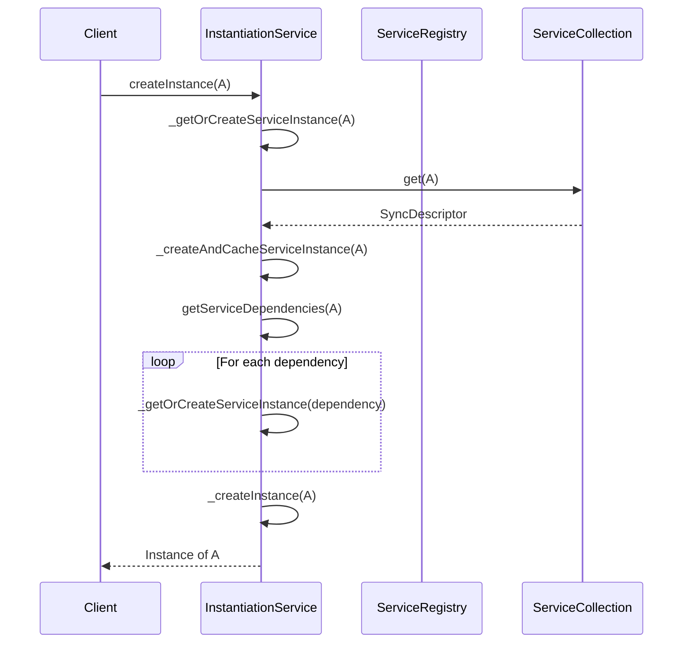
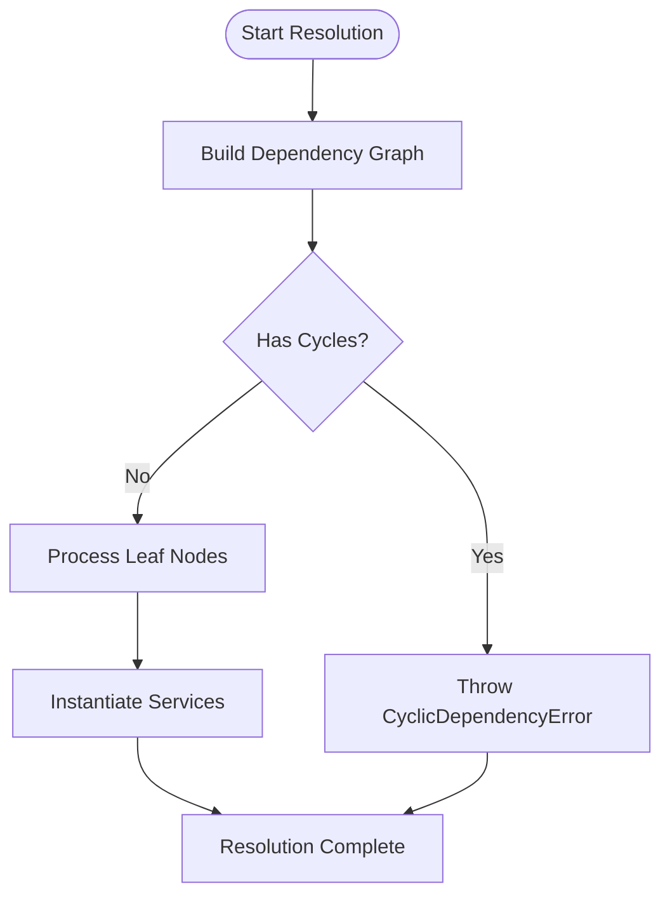
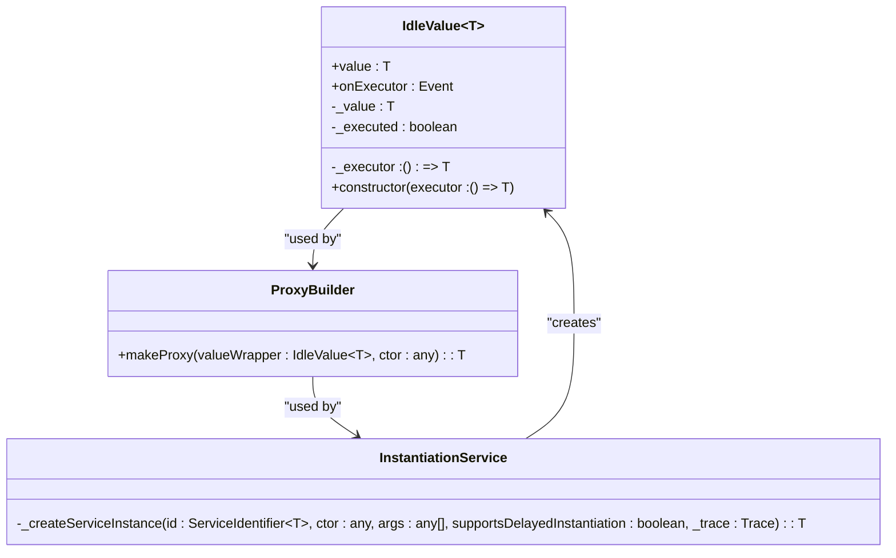
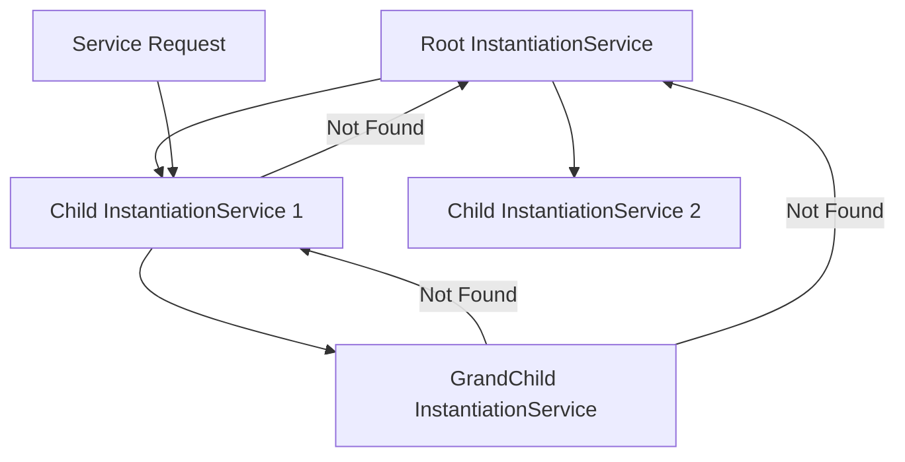
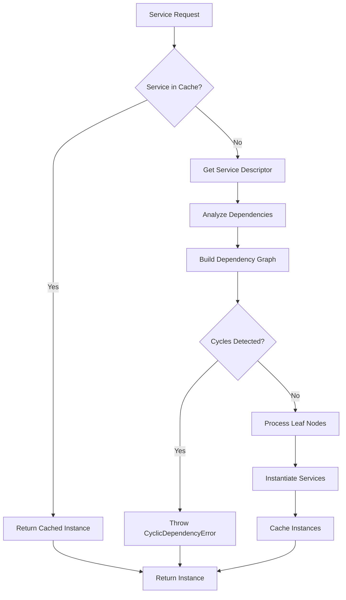
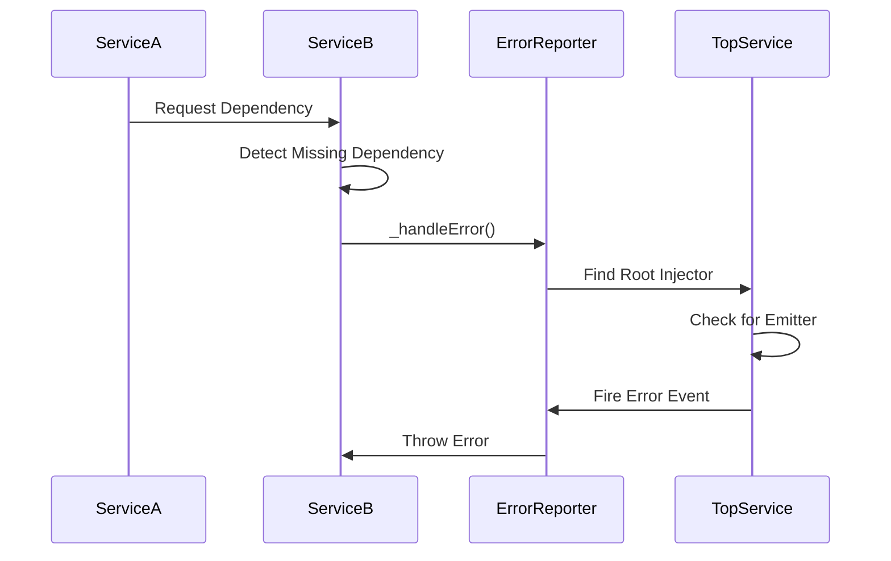

# Service Resolution

<cite>
**Referenced Files in This Document**   
- [instantiation-service.ts](file://packages/h5-builder/src/bedrock/di/instantiation-service.ts)
- [service-collection.ts](file://packages/h5-builder/src/bedrock/di/service-collection.ts)
- [service-registry.ts](file://packages/h5-builder/src/bedrock/di/service-registry.ts)
- [proxy-builder.ts](file://packages/h5-builder/src/bedrock/di/proxy-builder.ts)
- [descriptor.ts](file://packages/h5-builder/src/bedrock/di/descriptor.ts)
- [base.ts](file://packages/h5-builder/src/bedrock/di/base.ts)
- [trace.ts](file://packages/h5-builder/src/bedrock/di/trace.ts)
- [lazy-service.ts](file://packages/h5-builder/src/bedrock/di/lazy/lazy-service.ts)
- [instantiation-service.test.ts](file://packages/h5-builder/src/bedrock/di/instantiation-service.test.ts)
- [lazy-service.test.ts](file://packages/h5-builder/src/bedrock/di/lazy/lazy-service.test.ts)
</cite>

## Table of Contents
1. [Introduction](#introduction)
2. [Core Resolution Mechanism](#core-resolution-mechanism)
3. [Dependency Graph and Circular Dependency Detection](#dependency-graph-and-circular-dependency-detection)
4. [Synchronous vs Lazy Resolution](#synchronous-vs-lazy-resolution)
5. [Hierarchical Service Lookup](#hierarchical-service-lookup)
6. [Resolution Algorithm Flow](#resolution-algorithm-flow)
7. [Performance Considerations](#performance-considerations)
8. [Error Handling and Debugging](#error-handling-and-debugging)
9. [Conclusion](#conclusion)

## Introduction
The MobX Dependency Injection (DI) system provides a sophisticated service resolution mechanism that enables flexible, hierarchical, and efficient dependency management. This document details the inner workings of the service resolution process, focusing on the `_getOrCreateServiceInstance` method and its role in recursively resolving dependencies through constructor parameter inspection. The system employs a comprehensive resolution algorithm that uses dependency graphs to detect and prevent circular dependencies during service instantiation. It supports both synchronous resolution for eagerly instantiated services and lazy resolution through `IdleValue` and proxying mechanisms. The architecture also enables hierarchical dependency lookup by traversing parent injectors when a service is not found locally, providing a robust foundation for complex application structures.

## Core Resolution Mechanism

The service resolution process in the MobX DI system centers around the `_getOrCreateServiceInstance` method within the `InstantiationService` class. This method recursively resolves dependencies by inspecting constructor parameters decorated with the `@Inject` decorator (implemented via `createDecorator`). When a service is requested, the system first checks if an instance already exists in the local service collection. If not, it retrieves the service descriptor and initiates the creation process.

The resolution begins by analyzing the constructor dependencies through the `getServiceDependencies` function, which extracts dependency information stored in the constructor's metadata. Each dependency is then resolved recursively, ensuring that all required services are instantiated before the parent service. The system maintains an `_activeInstantiations` set to track services currently being instantiated, preventing recursive instantiation of the same service.

**Diagram sources**
- [instantiation-service.ts](file://packages/h5-builder/src/bedrock/di/instantiation-service.ts#L278-L288)
- [base.ts](file://packages/h5-builder/src/bedrock/di/base.ts#L27-L29)

**Section sources**
- [instantiation-service.ts](file://packages/h5-builder/src/bedrock/di/instantiation-service.ts#L278-L288)
- [base.ts](file://packages/h5-builder/src/bedrock/di/base.ts#L27-L29)

## Dependency Graph and Circular Dependency Detection

The MobX DI system implements a sophisticated dependency graph mechanism to detect and prevent circular dependencies during service instantiation. The system uses the `Graph` data structure from the `structure/graph` module to represent service dependencies. When the tracing feature is enabled, the system constructs a dependency graph that tracks the relationships between services during the resolution process.

The circular dependency detection algorithm operates in two phases. First, during the dependency analysis phase, the system builds a temporary dependency graph containing only service descriptors. This graph is used to identify all dependencies that need to be resolved before instantiating the requested service. Second, during the instantiation phase, the system processes the graph by repeatedly removing leaf nodes (services with no unresolved dependencies) until either all services are instantiated or a cycle is detected.

When a cycle is detected (indicated by a non-empty graph with no leaf nodes), the system throws a `CyclicDependencyError` with a detailed message showing the circular dependency path. The algorithm includes a safety mechanism that limits the number of iterations to 1,000 to prevent infinite loops in cases of complex dependency cycles.

**Diagram sources**
- [instantiation-service.ts](file://packages/h5-builder/src/bedrock/di/instantiation-service.ts#L321-L375)
- [structure/graph.ts](file://packages/h5-builder/src/bedrock/structure/graph.ts)

**Section sources**
- [instantiation-service.ts](file://packages/h5-builder/src/bedrock/di/instantiation-service.ts#L321-L375)

## Synchronous vs Lazy Resolution

The MobX DI system supports both synchronous and lazy service resolution, providing flexibility for different performance and initialization requirements. Synchronous resolution is used for services that need to be eagerly instantiated, while lazy resolution defers instantiation until the service is actually needed.

Synchronous resolution occurs when a service descriptor's `supportsDelayedInstantiation` flag is set to `false`. In this mode, services are instantiated immediately when requested, and all dependencies are resolved synchronously. This approach is suitable for core services that are required early in the application lifecycle.

Lazy resolution is implemented through the `IdleValue` class and proxying mechanism. When a service supports delayed instantiation, the system creates an `IdleValue` wrapper around the service constructor. This wrapper defers execution until the service is first accessed. The `makeProxy` function creates a proxy object that intercepts property access and method calls, triggering the actual instantiation only when needed.

**Diagram sources**
- [instantiation-service.ts](file://packages/h5-builder/src/bedrock/di/instantiation-service.ts#L435-L439)
- [proxy-builder.ts](file://packages/h5-builder/src/bedrock/di/proxy-builder.ts)
- [idle-value.ts](file://packages/h5-builder/src/bedrock/di/idle-value.ts)

**Section sources**
- [instantiation-service.ts](file://packages/h5-builder/src/bedrock/di/instantiation-service.ts#L435-L439)
- [proxy-builder.ts](file://packages/h5-builder/src/bedrock/di/proxy-builder.ts)

## Hierarchical Service Lookup

The MobX DI system implements hierarchical service lookup through a parent-child injector relationship. Each `InstantiationService` can have a parent service, creating a chain of responsibility for service resolution. When a service is not found in the local service collection, the system traverses up the parent chain until the service is found or the root injector is reached.

This hierarchical structure is established through the `createChild` method, which creates a new `InstantiationService` with the current service as its parent. Child services inherit all services from their parent, allowing for service overriding and specialization in child contexts. The parent traversal mechanism enables scenarios such as feature-specific service overrides in modular applications.

The lookup process follows a specific order: first checking the local service collection, then delegating to the parent if the service is not found. This ensures that services registered in child injectors take precedence over those in parent injectors, supporting the principle of least privilege and enabling context-specific service configurations.

**Diagram sources**
- [instantiation-service.ts](file://packages/h5-builder/src/bedrock/di/instantiation-service.ts#L67-L70)
- [instantiation-service.ts](file://packages/h5-builder/src/bedrock/di/instantiation-service.ts#L268-L275)

**Section sources**
- [instantiation-service.ts](file://packages/h5-builder/src/bedrock/di/instantiation-service.ts#L67-L70)
- [instantiation-service.ts](file://packages/h5-builder/src/bedrock/di/instantiation-service.ts#L268-L275)

## Resolution Algorithm Flow

The service resolution algorithm in the MobX DI system follows a comprehensive flow that ensures reliable and efficient service instantiation. The algorithm begins when a service is requested through `createInstance` or `invokeFunction`, triggering the `_getOrCreateServiceInstance` method.

The algorithm proceeds through several key phases: dependency analysis, graph construction, cycle detection, and service instantiation. During dependency analysis, the system uses reflection to inspect the constructor parameters of the requested service, identifying all dependencies marked with the `@Inject` decorator. These dependencies are then resolved recursively, building a complete dependency tree.

The graph construction phase creates a temporary dependency graph containing service descriptors rather than instances. This graph is used to detect circular dependencies before any services are instantiated. The system processes the graph by repeatedly identifying and instantiating leaf nodes (services with no unresolved dependencies), ensuring that dependencies are resolved in the correct order.

**Diagram sources**
- [instantiation-service.ts](file://packages/h5-builder/src/bedrock/di/instantiation-service.ts#L310-L395)
- [instantiation-service.ts](file://packages/h5-builder/src/bedrock/di/instantiation-service.ts#L278-L288)

**Section sources**
- [instantiation-service.ts](file://packages/h5-builder/src/bedrock/di/instantiation-service.ts#L310-L395)

## Performance Considerations

The MobX DI system incorporates several performance optimizations to ensure efficient service resolution. The most significant optimization is the lazy instantiation mechanism, which defers service creation until the service is actually needed. This reduces startup time and memory usage by avoiding the creation of unused services.

The system also implements caching at multiple levels. Once a service is instantiated, it is cached in the service collection, preventing repeated instantiation. The dependency graph is constructed only when necessary (when tracing is enabled), minimizing overhead for production environments.

The circular dependency detection algorithm includes a cycle count limit of 1,000 iterations to prevent performance degradation in cases of complex dependency cycles. This safety mechanism ensures that the system fails fast rather than consuming excessive resources.

For hierarchical lookup, the system optimizes parent traversal by maintaining direct references between parent and child injectors, enabling O(1) access to parent services. The use of `Map` data structures for service collections ensures efficient lookup operations with O(1) average time complexity.

**Section sources**
- [instantiation-service.ts](file://packages/h5-builder/src/bedrock/di/instantiation-service.ts#L331-L333)
- [service-collection.ts](file://packages/h5-builder/src/bedrock/di/service-collection.ts#L15-L16)

## Error Handling and Debugging

The MobX DI system provides comprehensive error handling and debugging capabilities to assist developers in diagnosing service resolution issues. The system throws specific error types for different failure scenarios, including `CyclicDependencyError` for circular dependencies and descriptive errors for missing dependencies.

The tracing system, implemented in the `Trace` class, provides detailed diagnostic information about service creation and invocation. When enabled, it logs the complete dependency tree, showing which services are created and which are merely used. This information is invaluable for understanding the service resolution flow and identifying performance bottlenecks.

The system also implements a centralized error reporting mechanism through the `_emitter` property, which propagates errors to the top-level instantiation service. This ensures that errors are consistently reported regardless of where they occur in the injector hierarchy.

**Diagram sources**
- [instantiation-service.ts](file://packages/h5-builder/src/bedrock/di/instantiation-service.ts#L453-L466)
- [trace.ts](file://packages/h5-builder/src/bedrock/di/trace.ts)

**Section sources**
- [instantiation-service.ts](file://packages/h5-builder/src/bedrock/di/instantiation-service.ts#L453-L466)
- [trace.ts](file://packages/h5-builder/src/bedrock/di/trace.ts)

## Conclusion
The service resolution system in the MobX DI framework provides a robust and flexible mechanism for managing dependencies in complex applications. Through its sophisticated dependency graph, circular dependency detection, and hierarchical lookup capabilities, the system ensures reliable service instantiation while preventing common dependency management issues. The combination of synchronous and lazy resolution strategies allows developers to optimize performance based on their specific requirements. The comprehensive error handling and debugging features make it easier to diagnose and resolve issues during development. Overall, the system demonstrates a well-designed approach to dependency injection that balances flexibility, performance, and reliability.