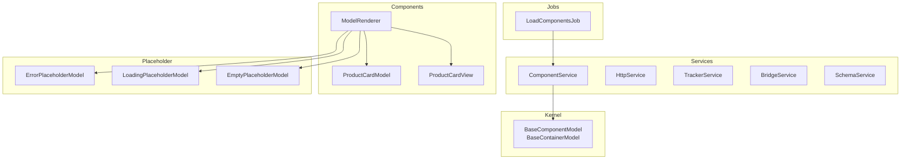
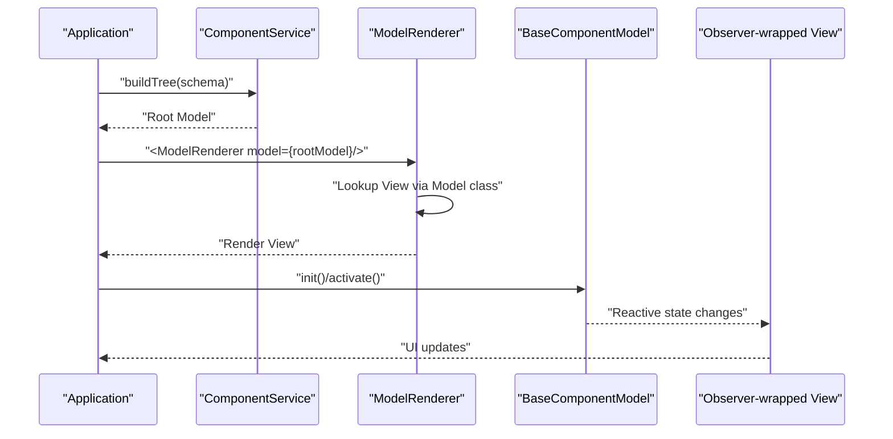
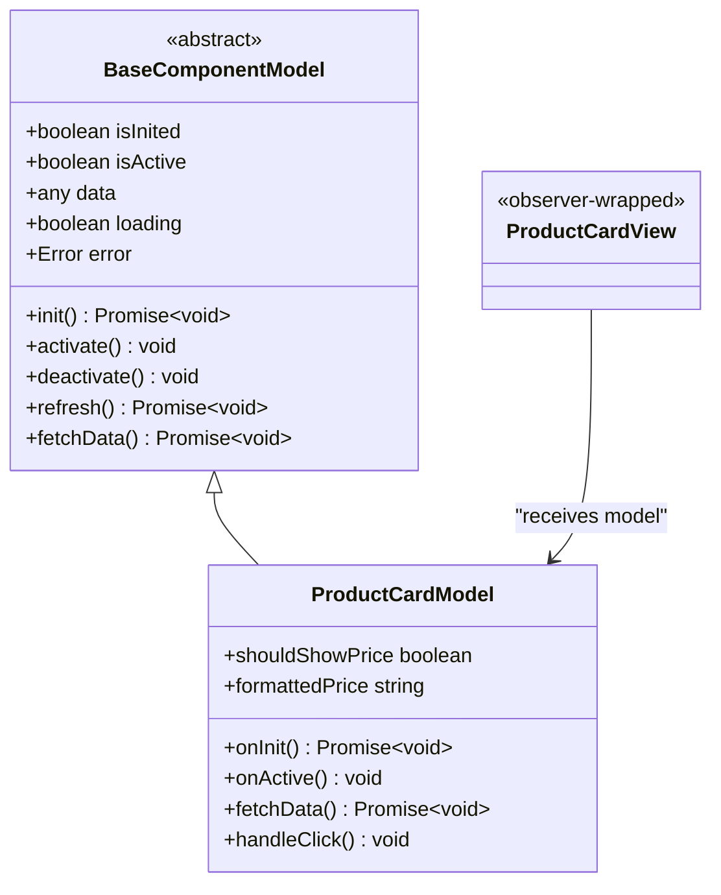
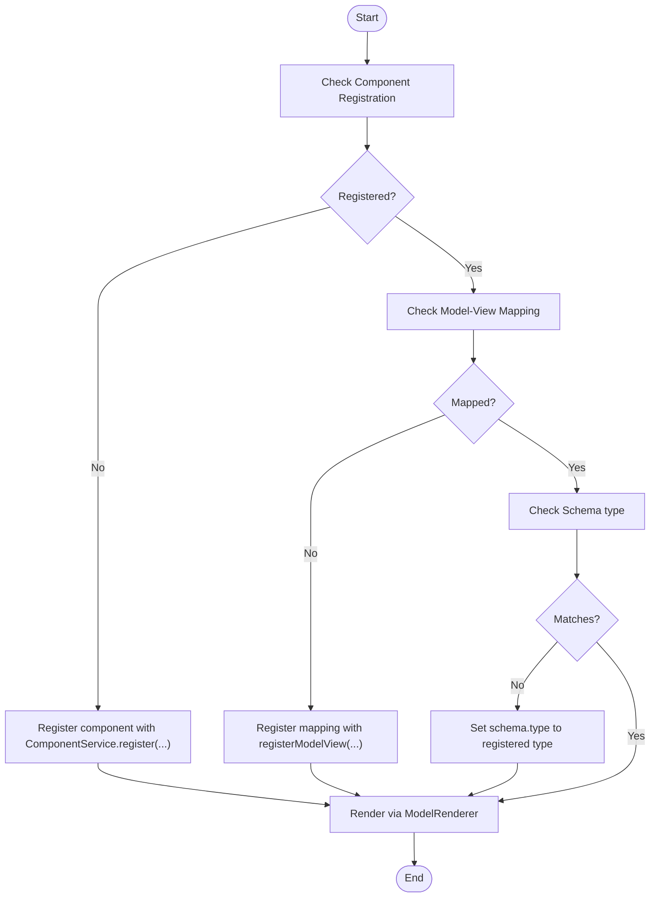
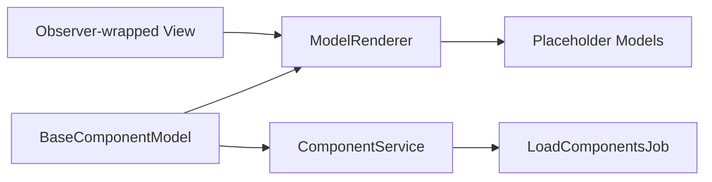

# Common Errors

<cite>
**Referenced Files in This Document**
- [README.md](file://packages/h5-builder/README.md)
- [faq.md](file://packages/h5-builder/docs/faq.md)
- [tsconfig.json](file://packages/h5-builder/tsconfig.json)
- [model-renderer.tsx](file://packages/h5-builder/src/components/model-renderer.tsx)
- [model.ts](file://packages/h5-builder/src/bedrock/model.ts)
- [observer.ts](file://packages/mobx-vue-lite/src/observer.ts)
- [product-card.model.ts](file://packages/h5-builder/src/components/product-card/product-card.model.ts)
- [product-card.view.tsx](file://packages/h5-builder/src/components/product-card/product-card.view.tsx)
- [component.service.ts](file://packages/h5-builder/src/services/component.service.ts)
- [load-components-job.ts](file://packages/h5-builder/src/jobs/load-components-job.ts)
- [placeholder/index.ts](file://packages/h5-builder/src/placeholder/index.ts)
</cite>

## Table of Contents
1. [Introduction](#introduction)
2. [Project Structure](#project-structure)
3. [Core Components](#core-components)
4. [Architecture Overview](#architecture-overview)
5. [Detailed Component Analysis](#detailed-component-analysis)
6. [Dependency Analysis](#dependency-analysis)
7. [Performance Considerations](#performance-considerations)
8. [Troubleshooting Guide](#troubleshooting-guide)
9. [Conclusion](#conclusion)

## Introduction
This document provides comprehensive troubleshooting guidance for common errors in the H5 Builder framework. It focuses on three primary categories:
- State not updating: three key solutions are provided to ensure reactive updates.
- TypeScript error “Cannot find name window”: resolved by adjusting tsconfig.json.
- Components not rendering: three prerequisites verified to ensure correct rendering.

Each solution includes both incorrect and correct implementation references mapped to the repository’s source files, along with diagrams and practical steps to resolve issues quickly.

## Project Structure
H5 Builder organizes functionality into layers and modules:
- Kernel layer: DI, Model base, and disposables.
- Services layer: infrastructure services (HTTP, Bridge, Tracker, Schema).
- Jobs layer: orchestration and lifecycle management.
- Components layer: business components (Model + View) and ModelRenderer.
- Placeholder models for error/loading/empty states.

**Diagram sources**
- [model.ts](file://packages/h5-builder/src/bedrock/model.ts#L1-L243)
- [component.service.ts](file://packages/h5-builder/src/services/component.service.ts#L1-L735)
- [load-components-job.ts](file://packages/h5-builder/src/jobs/load-components-job.ts#L1-L61)
- [model-renderer.tsx](file://packages/h5-builder/src/components/model-renderer.tsx#L1-L105)
- [product-card.model.ts](file://packages/h5-builder/src/components/product-card/product-card.model.ts#L1-L133)
- [product-card.view.tsx](file://packages/h5-builder/src/components/product-card/product-card.view.tsx#L1-L81)
- [placeholder/index.ts](file://packages/h5-builder/src/placeholder/index.ts#L1-L30)

**Section sources**
- [README.md](file://packages/h5-builder/README.md#L1-L232)

## Core Components
- BaseComponentModel and BaseContainerModel define the reactive state and lifecycle hooks used by all components.
- ComponentService builds the model tree from schema and manages component registration and asynchronous loading.
- ModelRenderer maps Model classes to View components and renders placeholders when needed.
- ProductCardModel and ProductCardView demonstrate correct MV separation and observer usage.
- LoadComponentsJob coordinates resource preloading and model readiness.

**Section sources**
- [model.ts](file://packages/h5-builder/src/bedrock/model.ts#L1-L243)
- [component.service.ts](file://packages/h5-builder/src/services/component.service.ts#L1-L735)
- [model-renderer.tsx](file://packages/h5-builder/src/components/model-renderer.tsx#L1-L105)
- [product-card.model.ts](file://packages/h5-builder/src/components/product-card/product-card.model.ts#L1-L133)
- [product-card.view.tsx](file://packages/h5-builder/src/components/product-card/product-card.view.tsx#L1-L81)
- [load-components-job.ts](file://packages/h5-builder/src/jobs/load-components-job.ts#L1-L61)

## Architecture Overview
The rendering pipeline relies on:
- ComponentService to validate schema, build model tree, and manage async loading.
- ModelRenderer to select the appropriate View based on Model class.
- Observer HOC to wrap Views for automatic reactivity.
- Lifecycle jobs to coordinate resource availability and rendering.

**Diagram sources**
- [component.service.ts](file://packages/h5-builder/src/services/component.service.ts#L130-L244)
- [model-renderer.tsx](file://packages/h5-builder/src/components/model-renderer.tsx#L40-L105)
- [model.ts](file://packages/h5-builder/src/bedrock/model.ts#L60-L155)
- [product-card.view.tsx](file://packages/h5-builder/src/components/product-card/product-card.view.tsx#L1-L81)

## Detailed Component Analysis

### State Not Updating: Three Key Solutions
To ensure state changes propagate to the UI:
1. Declare properties as public class fields for reactivity.
2. Wrap Views with the observer HOC.
3. Replace entire nested objects instead of mutating nested properties directly.

These behaviors are enforced by the reactive base class and the observer wrapper.

**Diagram sources**
- [model.ts](file://packages/h5-builder/src/bedrock/model.ts#L1-L243)
- [product-card.model.ts](file://packages/h5-builder/src/components/product-card/product-card.model.ts#L1-L133)
- [product-card.view.tsx](file://packages/h5-builder/src/components/product-card/product-card.view.tsx#L1-L81)

**Section sources**
- [faq.md](file://packages/h5-builder/docs/faq.md#L376-L431)
- [model.ts](file://packages/h5-builder/src/bedrock/model.ts#L1-L243)
- [observer.ts](file://packages/mobx-vue-lite/src/observer.ts#L1-L52)
- [product-card.view.tsx](file://packages/h5-builder/src/components/product-card/product-card.view.tsx#L1-L81)

### TypeScript Error: “Cannot find name window”
Symptoms:
- Type errors indicating window is not defined during compilation or testing.

Solution:
- Add DOM to the lib array in tsconfig.json.

Why this works:
- The DOM library types are required for browser APIs and global objects like window.

**Section sources**
- [faq.md](file://packages/h5-builder/docs/faq.md#L398-L408)
- [tsconfig.json](file://packages/h5-builder/tsconfig.json#L1-L30)

### Components Not Rendering: Three Prerequisites
If components fail to render, verify:
1. Component registration with ComponentService.register or registerAll.
2. Model-View mapping registration with ModelRenderer.registerModelView or registerModelViews.
3. Schema type matching the registered component type.

**Diagram sources**
- [component.service.ts](file://packages/h5-builder/src/services/component.service.ts#L116-L129)
- [model-renderer.tsx](file://packages/h5-builder/src/components/model-renderer.tsx#L10-L31)
- [model-renderer.tsx](file://packages/h5-builder/src/components/model-renderer.tsx#L40-L105)
- [faq.md](file://packages/h5-builder/docs/faq.md#L409-L431)

**Section sources**
- [faq.md](file://packages/h5-builder/docs/faq.md#L409-L431)
- [component.service.ts](file://packages/h5-builder/src/services/component.service.ts#L116-L129)
- [model-renderer.tsx](file://packages/h5-builder/src/components/model-renderer.tsx#L10-L31)
- [model-renderer.tsx](file://packages/h5-builder/src/components/model-renderer.tsx#L40-L105)

## Dependency Analysis
Key dependencies and their roles:
- BaseComponentModel provides observable state and lifecycle hooks.
- ComponentService validates schema, constructs model trees, and handles async loading.
- ModelRenderer depends on a registry mapping Model classes to View components.
- Observer HOC ensures Views re-render on observable changes.
- LoadComponentsJob coordinates resource availability before rendering.

**Diagram sources**
- [model.ts](file://packages/h5-builder/src/bedrock/model.ts#L1-L243)
- [component.service.ts](file://packages/h5-builder/src/services/component.service.ts#L130-L244)
- [model-renderer.tsx](file://packages/h5-builder/src/components/model-renderer.tsx#L40-L105)
- [load-components-job.ts](file://packages/h5-builder/src/jobs/load-components-job.ts#L1-L61)
- [placeholder/index.ts](file://packages/h5-builder/src/placeholder/index.ts#L1-L30)

**Section sources**
- [model.ts](file://packages/h5-builder/src/bedrock/model.ts#L1-L243)
- [component.service.ts](file://packages/h5-builder/src/services/component.service.ts#L130-L244)
- [model-renderer.tsx](file://packages/h5-builder/src/components/model-renderer.tsx#L40-L105)
- [load-components-job.ts](file://packages/h5-builder/src/jobs/load-components-job.ts#L1-L61)
- [placeholder/index.ts](file://packages/h5-builder/src/placeholder/index.ts#L1-L30)

## Performance Considerations
- Use observer HOC to minimize unnecessary re-renders while maintaining reactivity.
- Prefer replacing entire nested objects rather than mutating nested properties to ensure observable detection.
- Leverage ComponentService’s async loading and caching to improve initial render performance.

[No sources needed since this section provides general guidance]

## Troubleshooting Guide

### 1) State Not Updating
Symptoms:
- UI does not reflect changes to component state.

Root causes and fixes:
- Properties not declared as public class fields:
  - Ensure reactive fields are declared as public properties on the model class.
  - Reference: [model.ts](file://packages/h5-builder/src/bedrock/model.ts#L1-L243)
- View not wrapped with observer HOC:
  - Wrap the View component with observer to subscribe to observable changes.
  - Reference: [product-card.view.tsx](file://packages/h5-builder/src/components/product-card/product-card.view.tsx#L1-L81), [observer.ts](file://packages/mobx-vue-lite/src/observer.ts#L1-L52)
- Direct mutation of nested objects:
  - Replace the entire nested object instead of mutating nested properties.
  - Reference: [faq.md](file://packages/h5-builder/docs/faq.md#L376-L408)

Correct vs Incorrect Implementation References:
- Incorrect: Private fields or non-reactive properties.
  - Reference: [faq.md](file://packages/h5-builder/docs/faq.md#L376-L408)
- Correct: Public reactive properties and observer-wrapped View.
  - Reference: [model.ts](file://packages/h5-builder/src/bedrock/model.ts#L1-L243), [product-card.view.tsx](file://packages/h5-builder/src/components/product-card/product-card.view.tsx#L1-L81)

**Section sources**
- [faq.md](file://packages/h5-builder/docs/faq.md#L376-L408)
- [model.ts](file://packages/h5-builder/src/bedrock/model.ts#L1-L243)
- [observer.ts](file://packages/mobx-vue-lite/src/observer.ts#L1-L52)
- [product-card.view.tsx](file://packages/h5-builder/src/components/product-card/product-card.view.tsx#L1-L81)

### 2) TypeScript Error “Cannot find name window”
Symptoms:
- Type errors indicating window is not defined.

Fix:
- Add DOM to the lib array in tsconfig.json.
  - Reference: [tsconfig.json](file://packages/h5-builder/tsconfig.json#L1-L30)
  - Reference: [faq.md](file://packages/h5-builder/docs/faq.md#L398-L408)

**Section sources**
- [tsconfig.json](file://packages/h5-builder/tsconfig.json#L1-L30)
- [faq.md](file://packages/h5-builder/docs/faq.md#L398-L408)

### 3) Components Not Rendering
Symptoms:
- No UI appears for registered components.

Prerequisites to verify:
1) Component registration with ComponentService.register or registerAll:
   - Ensure the component type is registered before building the model tree.
   - Reference: [component.service.ts](file://packages/h5-builder/src/services/component.service.ts#L116-L129)
2) Model-View mapping registration with ModelRenderer.registerModelView or registerModelViews:
   - Register the mapping so ModelRenderer can find the View for a given Model.
   - Reference: [model-renderer.tsx](file://packages/h5-builder/src/components/model-renderer.tsx#L10-L31)
3) Schema type matching:
   - The schema.type must match the registered component type.
   - Reference: [faq.md](file://packages/h5-builder/docs/faq.md#L409-L431)

Correct vs Incorrect Implementation References:
- Incorrect: Missing registration or mismatched schema.type.
  - Reference: [faq.md](file://packages/h5-builder/docs/faq.md#L409-L431)
- Correct: Registered component, registered mapping, and matching schema.type.
  - Reference: [component.service.ts](file://packages/h5-builder/src/services/component.service.ts#L116-L129), [model-renderer.tsx](file://packages/h5-builder/src/components/model-renderer.tsx#L10-L31), [README.md](file://packages/h5-builder/README.md#L106-L127)

**Section sources**
- [faq.md](file://packages/h5-builder/docs/faq.md#L409-L431)
- [component.service.ts](file://packages/h5-builder/src/services/component.service.ts#L116-L129)
- [model-renderer.tsx](file://packages/h5-builder/src/components/model-renderer.tsx#L10-L31)
- [README.md](file://packages/h5-builder/README.md#L106-L127)

## Conclusion
By following the three targeted solutions—ensuring reactive properties, wrapping Views with observer, and replacing entire nested objects—you can resolve state update issues. Adding DOM to tsconfig.json solves the “Cannot find name window” error. Finally, verifying component registration, Model-View mapping, and schema type matching guarantees components render correctly. The referenced files provide authoritative guidance and examples for each fix.