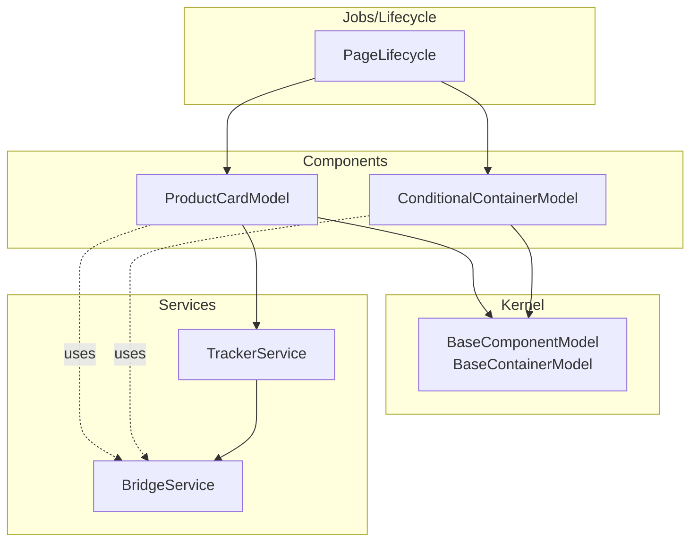
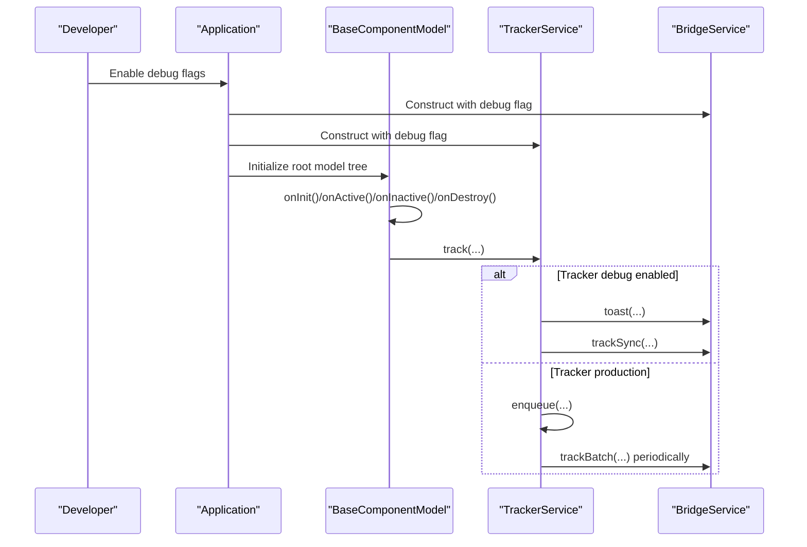
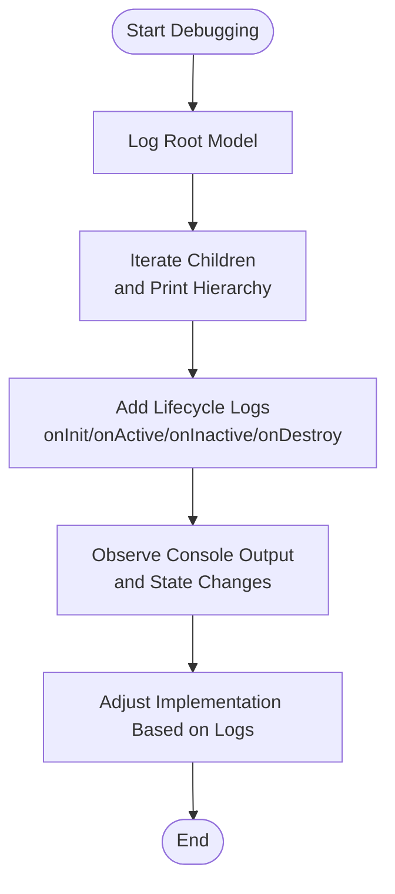

# Debugging

<cite>
**Referenced Files in This Document**
- [README.md](file://packages/h5-builder/README.md)
- [bridge.service.ts](file://packages/h5-builder/src/services/bridge.service.ts)
- [tracker.service.ts](file://packages/h5-builder/src/services/tracker.service.ts)
- [service-identifiers.ts](file://packages/h5-builder/src/services/service-identifiers.ts)
- [model.ts](file://packages/h5-builder/src/bedrock/model.ts)
- [lifecycle.ts](file://packages/h5-builder/src/jobs/lifecycle.ts)
- [bridge.service.test.ts](file://packages/h5-builder/src/__tests__/bridge.service.test.ts)
- [tracker.service.test.ts](file://packages/h5-builder/src/__tests__/tracker.service.test.ts)
- [product-card.model.ts](file://packages/h5-builder/src/components/product-card/product-card.model.ts)
- [conditional-container.model.ts](file://packages/h5-builder/src/components/conditional-container/conditional-container.model.ts)
</cite>

## Table of Contents
1. [Introduction](#introduction)
2. [Project Structure](#project-structure)
3. [Core Components](#core-components)
4. [Architecture Overview](#architecture-overview)
5. [Detailed Component Analysis](#detailed-component-analysis)
6. [Dependency Analysis](#dependency-analysis)
7. [Performance Considerations](#performance-considerations)
8. [Troubleshooting Guide](#troubleshooting-guide)
9. [Conclusion](#conclusion)
10. [Appendices](#appendices)

## Introduction
This document provides a focused debugging guide for the H5 Builder framework with emphasis on:
- Enabling and using BridgeService debug mode for mock functionality
- Enabling TrackerService debug mode for synchronous event sending with toast notifications
- Practical techniques for inspecting the Model tree structure via browser developer tools
- Lifecycle tracing by instrumenting lifecycle methods
- Real-world debugging workflows and tips grounded in the actual service implementations

## Project Structure
The H5 Builder framework organizes code into layers:
- Kernel (DI, Model base, Disposable): central runtime primitives
- Services (Bridge, HTTP, Tracker, Context): infrastructure services
- Components (business models): domain-specific models and views
- Jobs/Lifecycle: orchestration and lifecycle stages



**Diagram sources**
- [model.ts](file://packages/h5-builder/src/bedrock/model.ts#L1-L243)
- [bridge.service.ts](file://packages/h5-builder/src/services/bridge.service.ts#L1-L227)
- [tracker.service.ts](file://packages/h5-builder/src/services/tracker.service.ts#L1-L290)
- [product-card.model.ts](file://packages/h5-builder/src/components/product-card/product-card.model.ts#L1-L133)
- [conditional-container.model.ts](file://packages/h5-builder/src/components/conditional-container/conditional-container.model.ts#L1-L86)
- [lifecycle.ts](file://packages/h5-builder/src/jobs/lifecycle.ts#L1-L18)

**Section sources**
- [README.md](file://packages/h5-builder/README.md#L1-L232)

## Core Components
- BridgeService: Unified bridge invocation with mock mode support for browser debugging. It automatically switches to mock behavior when NativeBridge is unavailable or when constructed in debug mode.
- TrackerService: Event queueing, batching, persistence, and debug mode. In debug mode, it synchronously sends events and displays toast notifications via BridgeService.
- BaseComponentModel/BaseContainerModel: Lifecycle hooks (onInit, onActive, onInactive, onDestroy) and resource management for component models.

**Section sources**
- [bridge.service.ts](file://packages/h5-builder/src/services/bridge.service.ts#L1-L227)
- [tracker.service.ts](file://packages/h5-builder/src/services/tracker.service.ts#L1-L290)
- [model.ts](file://packages/h5-builder/src/bedrock/model.ts#L1-L243)

## Architecture Overview
The debugging workflow centers around two primary services and the Model lifecycle.



**Diagram sources**
- [tracker.service.ts](file://packages/h5-builder/src/services/tracker.service.ts#L1-L290)
- [bridge.service.ts](file://packages/h5-builder/src/services/bridge.service.ts#L1-L227)
- [model.ts](file://packages/h5-builder/src/bedrock/model.ts#L1-L243)

## Detailed Component Analysis

### BridgeService Debug Mode
- Purpose: Provide mock behavior in browser environments when NativeBridge is absent or when explicitly requested.
- Key behaviors:
  - Constructor accepts a debug flag; if true or NativeBridge is missing, mock mode is enabled.
  - call() routes to mockCall() in debug mode; otherwise to nativeCall().
  - mockCall() simulates network latency and returns predefined mock data or logs a warning.
  - Helpers (BridgeHelpers) expose convenient methods like toast(), navigate(), share(), and fetch().

Practical instantiation examples:
- Instantiate BridgeService in debug mode:
  - See constructor signature and debug flag handling.
  - Reference: [bridge.service.ts](file://packages/h5-builder/src/services/bridge.service.ts#L44-L47)
- Use BridgeHelpers to trigger toast:
  - See toast() helper.
  - Reference: [bridge.service.ts](file://packages/h5-builder/src/services/bridge.service.ts#L191-L193)
- Verify mock responses:
  - See setupMockResponses() defaults and setMockResponse()/setMockResponses().
  - Reference: [bridge.service.ts](file://packages/h5-builder/src/services/bridge.service.ts#L139-L164)

Common debugging scenarios:
- If BridgeService throws a “NativeBridge not available” error, ensure NativeBridge is present or construct with debug=true.
  - Reference: [bridge.service.ts](file://packages/h5-builder/src/services/bridge.service.ts#L75-L77)
- If a method lacks a mock response, mockCall() warns and returns an empty object; configure setMockResponse() accordingly.
  - Reference: [bridge.service.ts](file://packages/h5-builder/src/services/bridge.service.ts#L106-L118)

**Section sources**
- [bridge.service.ts](file://packages/h5-builder/src/services/bridge.service.ts#L44-L169)
- [bridge.service.test.ts](file://packages/h5-builder/src/__tests__/bridge.service.test.ts#L1-L132)

### TrackerService Debug Mode
- Purpose: Enable immediate, synchronous event reporting with toast feedback during development.
- Key behaviors:
  - Constructor accepts a config with debug flag and other options.
  - track() enqueues in production mode or invokes debugTrack() in debug mode.
  - debugTrack() shows a toast via BridgeService and sends the event synchronously using a dedicated method.
  - Production mode uses enqueue(), scheduleFlush(), and flush() with batching and persistence.

Practical instantiation examples:
- Instantiate TrackerService with debug enabled:
  - Pass config.debug=true to the constructor.
  - Reference: [tracker.service.ts](file://packages/h5-builder/src/services/tracker.service.ts#L41-L51)
- Use TrackerHelpers to report page view/exposure/click/error/performance:
  - See TrackerHelpers methods.
  - Reference: [tracker.service.ts](file://packages/h5-builder/src/services/tracker.service.ts#L233-L289)

Debugging workflow:
- Trigger a tracked event; in debug mode, you should see a toast and a synchronous call to the backend method.
  - References: [tracker.service.ts](file://packages/h5-builder/src/services/tracker.service.ts#L71-L105), [tracker.service.test.ts](file://packages/h5-builder/src/__tests__/tracker.service.test.ts#L28-L41)

**Section sources**
- [tracker.service.ts](file://packages/h5-builder/src/services/tracker.service.ts#L41-L105)
- [tracker.service.test.ts](file://packages/h5-builder/src/__tests__/tracker.service.test.ts#L1-L84)

### Model Tree Inspection and Lifecycle Tracing
- Model tree inspection:
  - Log the root model and iterate through children to print hierarchy.
  - For containers, use BaseContainerModel’s children array to traverse.
  - Reference: [model.ts](file://packages/h5-builder/src/bedrock/model.ts#L168-L242)
- Lifecycle tracing:
  - Add console.log statements in onInit, onActive, onInactive, onDestroy to observe state transitions.
  - Example patterns are visible in component models:
    - ConditionalContainerModel demonstrates conditional rendering and lifecycle activation/deactivation.
      - Reference: [conditional-container.model.ts](file://packages/h5-builder/src/components/conditional-container/conditional-container.model.ts#L29-L84)
    - ProductCardModel demonstrates data fetching and lifecycle-driven tracking.
      - Reference: [product-card.model.ts](file://packages/h5-builder/src/components/product-card/product-card.model.ts#L42-L116)
  - BaseComponentModel base hooks are logged for init/dispose and warn on repeated calls.
    - Reference: [model.ts](file://packages/h5-builder/src/bedrock/model.ts#L60-L88)



**Diagram sources**
- [model.ts](file://packages/h5-builder/src/bedrock/model.ts#L1-L243)
- [conditional-container.model.ts](file://packages/h5-builder/src/components/conditional-container/conditional-container.model.ts#L1-L86)
- [product-card.model.ts](file://packages/h5-builder/src/components/product-card/product-card.model.ts#L1-L133)

**Section sources**
- [model.ts](file://packages/h5-builder/src/bedrock/model.ts#L60-L88)
- [conditional-container.model.ts](file://packages/h5-builder/src/components/conditional-container/conditional-container.model.ts#L29-L84)
- [product-card.model.ts](file://packages/h5-builder/src/components/product-card/product-card.model.ts#L42-L116)

## Dependency Analysis
- BridgeService and TrackerService are independent services. TrackerService depends on BridgeService for toast and synchronous event reporting in debug mode.
- Component models depend on TrackerService and may depend on BridgeService via helpers.
- Service identifiers define DI tokens for dependency injection.

```mermaid
graph LR
BS["BridgeService"] <- --> TS["TrackerService"]
PCM["ProductCardModel"] -.uses.-> TS
PCM -.uses.-> BS
CCM["ConditionalContainerModel"] -.uses.-> BS
SI["Service Identifiers"] -.tokens.-> BS
SI -.tokens.-> TS
```

**Diagram sources**
- [bridge.service.ts](file://packages/h5-builder/src/services/bridge.service.ts#L1-L227)
- [tracker.service.ts](file://packages/h5-builder/src/services/tracker.service.ts#L1-L290)
- [service-identifiers.ts](file://packages/h5-builder/src/services/service-identifiers.ts#L1-L20)
- [product-card.model.ts](file://packages/h5-builder/src/components/product-card/product-card.model.ts#L1-L133)
- [conditional-container.model.ts](file://packages/h5-builder/src/components/conditional-container/conditional-container.model.ts#L1-L86)

**Section sources**
- [service-identifiers.ts](file://packages/h5-builder/src/services/service-identifiers.ts#L1-L20)
- [bridge.service.ts](file://packages/h5-builder/src/services/bridge.service.ts#L1-L227)
- [tracker.service.ts](file://packages/h5-builder/src/services/tracker.service.ts#L1-L290)

## Performance Considerations
- BridgeService mock mode introduces artificial delays; disable or reduce delays in local development.
- TrackerService debug mode sends events synchronously; keep debug mode off for production to avoid blocking UI.
- Batch flushing and persistence in TrackerService help reduce network overhead in production.

[No sources needed since this section provides general guidance]

## Troubleshooting Guide
Common issues and resolutions:
- BridgeService “NativeBridge not available”
  - Cause: NativeBridge missing in browser.
  - Resolution: Construct BridgeService with debug=true or provide a mock NativeBridge.
  - Reference: [bridge.service.ts](file://packages/h5-builder/src/services/bridge.service.ts#L75-L77)
- BridgeService timeout
  - Cause: NativeBridge.invoke did not resolve within the timeout window.
  - Resolution: Increase timeout or ensure NativeBridge availability.
  - Reference: [bridge.service.ts](file://packages/h5-builder/src/services/bridge.service.ts#L80-L89)
- Missing mock response
  - Cause: Method not configured in mock responses.
  - Resolution: Use setMockResponse() or setMockResponses() to define expected payloads.
  - Reference: [bridge.service.ts](file://packages/h5-builder/src/services/bridge.service.ts#L123-L134)
- TrackerService debug mode not triggering toast
  - Cause: BridgeService not in debug mode or toast method not supported.
  - Resolution: Construct TrackerService with debug=true and ensure BridgeService is in debug mode.
  - References: [tracker.service.ts](file://packages/h5-builder/src/services/tracker.service.ts#L41-L51), [tracker.service.ts](file://packages/h5-builder/src/services/tracker.service.ts#L90-L105)
- Events not sent in production
  - Cause: Queue not flushed yet.
  - Resolution: Allow flush interval or call flush() manually; verify maxBatchSize and persistence.
  - References: [tracker.service.ts](file://packages/h5-builder/src/services/tracker.service.ts#L110-L139), [tracker.service.ts](file://packages/h5-builder/src/services/tracker.service.ts#L144-L171)
- Model lifecycle not firing
  - Cause: Model not initialized or activated.
  - Resolution: Ensure root model tree is built and lifecycle jobs are executed; add console logs to hooks.
  - References: [model.ts](file://packages/h5-builder/src/bedrock/model.ts#L60-L88), [lifecycle.ts](file://packages/h5-builder/src/jobs/lifecycle.ts#L1-L18)

**Section sources**
- [bridge.service.ts](file://packages/h5-builder/src/services/bridge.service.ts#L75-L118)
- [tracker.service.ts](file://packages/h5-builder/src/services/tracker.service.ts#L90-L171)
- [model.ts](file://packages/h5-builder/src/bedrock/model.ts#L60-L88)
- [lifecycle.ts](file://packages/h5-builder/src/jobs/lifecycle.ts#L1-L18)

## Conclusion
By enabling BridgeService and TrackerService debug modes, you gain powerful capabilities for rapid iteration and verification in browser environments. Combine these with Model tree inspection and lifecycle tracing to diagnose state transitions, resource leaks, and event delivery timing. Use the provided references to instantiate services with debug flags, log lifecycle hooks, and leverage the built-in helpers for consistent debugging workflows.

[No sources needed since this section summarizes without analyzing specific files]

## Appendices

### Practical Debugging Workflows
- BridgeService mock debugging
  - Instantiate BridgeService with debug=true.
  - Configure mock responses for required methods.
  - Use BridgeHelpers to trigger actions like toast/navigation/share.
  - References: [bridge.service.ts](file://packages/h5-builder/src/services/bridge.service.ts#L44-L47), [bridge.service.ts](file://packages/h5-builder/src/services/bridge.service.ts#L123-L164), [bridge.service.test.ts](file://packages/h5-builder/src/__tests__/bridge.service.test.ts#L12-L42)
- TrackerService debug mode
  - Instantiate TrackerService with debug=true.
  - Emit tracked events; confirm toast appears and synchronous send occurs.
  - References: [tracker.service.ts](file://packages/h5-builder/src/services/tracker.service.ts#L41-L51), [tracker.service.ts](file://packages/h5-builder/src/services/tracker.service.ts#L71-L105), [tracker.service.test.ts](file://packages/h5-builder/src/__tests__/tracker.service.test.ts#L28-L41)
- Model tree inspection
  - Log root model and iterate children arrays to visualize hierarchy.
  - References: [model.ts](file://packages/h5-builder/src/bedrock/model.ts#L168-L242)
- Lifecycle tracing
  - Add console.log in onInit/onActive/onInactive/onDestroy to track component state changes.
  - References: [model.ts](file://packages/h5-builder/src/bedrock/model.ts#L123-L155), [conditional-container.model.ts](file://packages/h5-builder/src/components/conditional-container/conditional-container.model.ts#L29-L84), [product-card.model.ts](file://packages/h5-builder/src/components/product-card/product-card.model.ts#L42-L116)