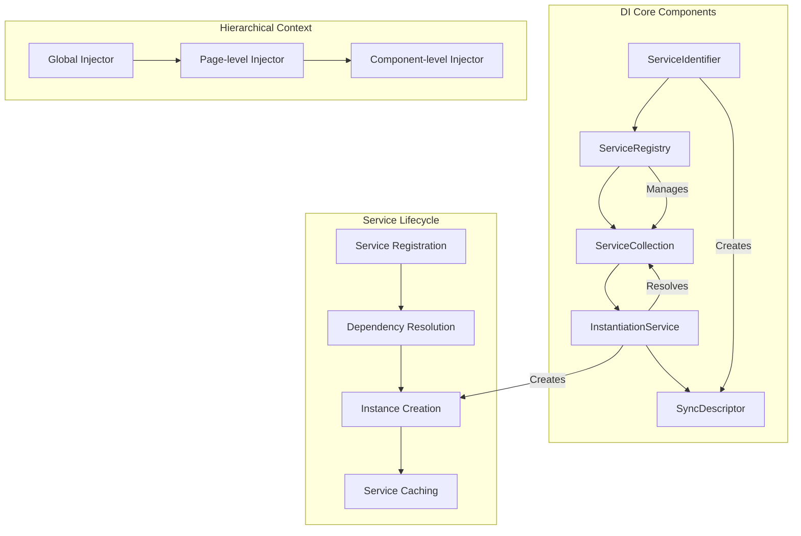
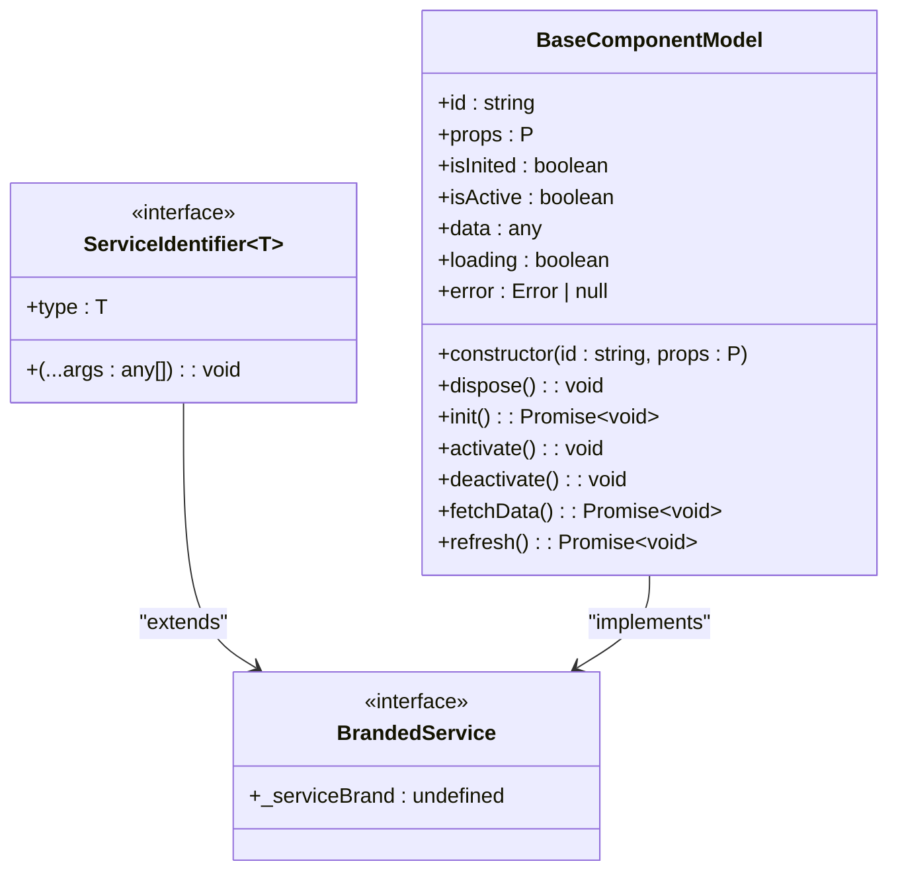
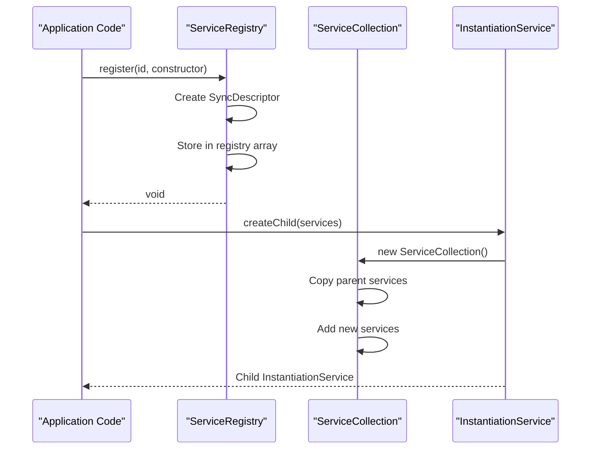
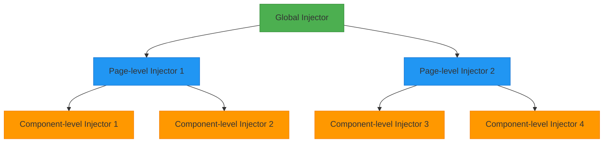
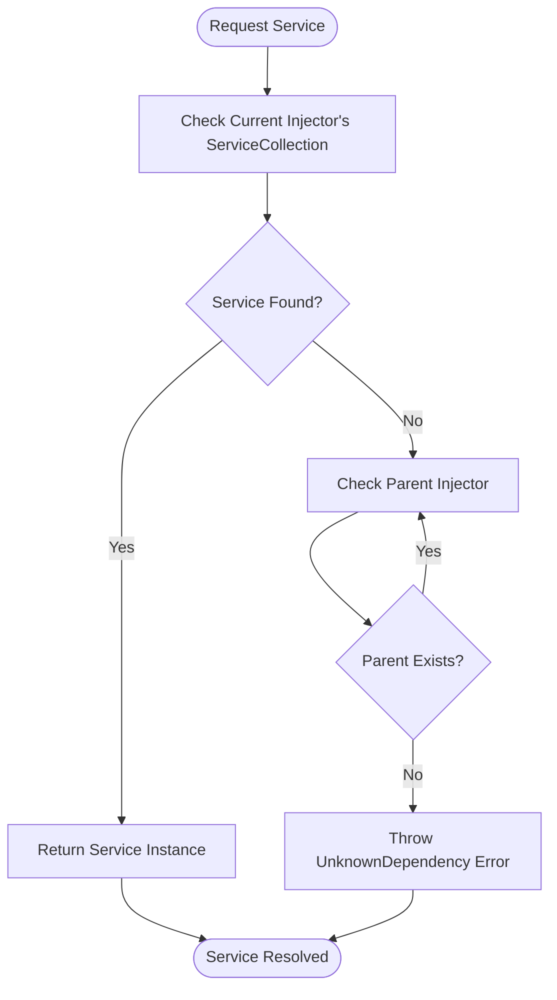
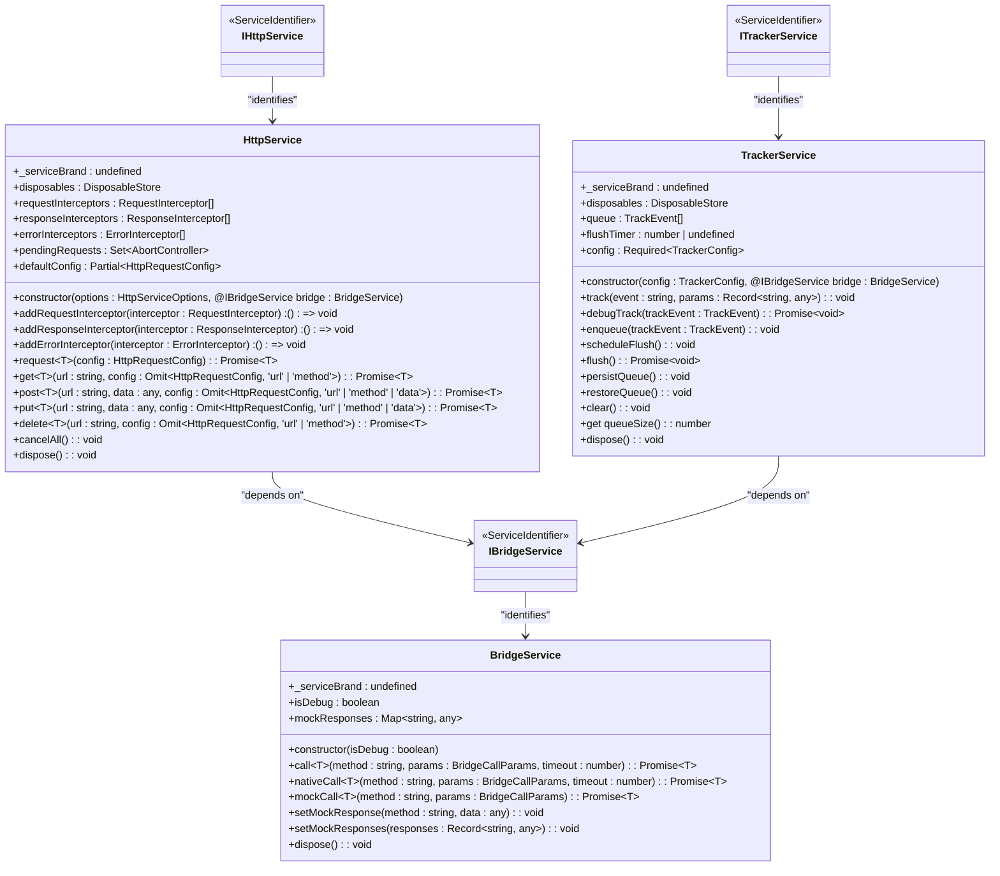
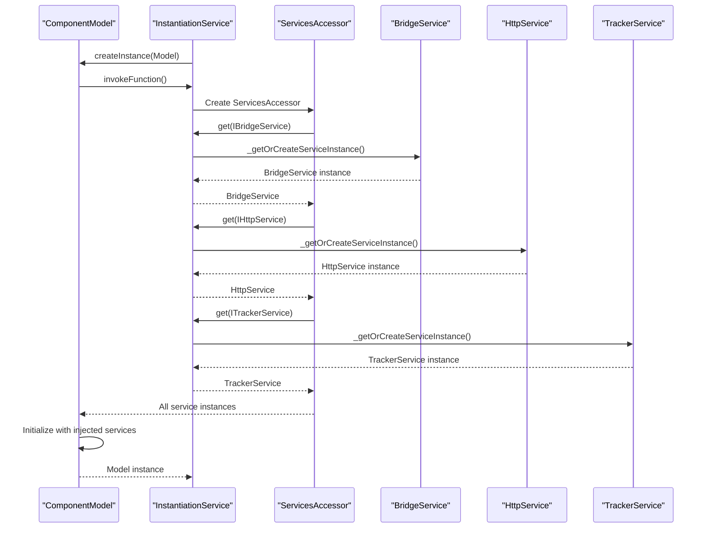
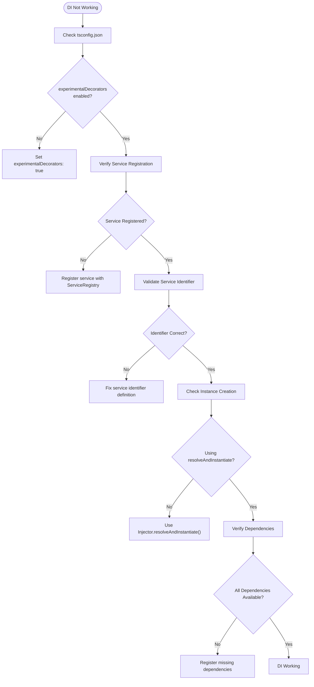
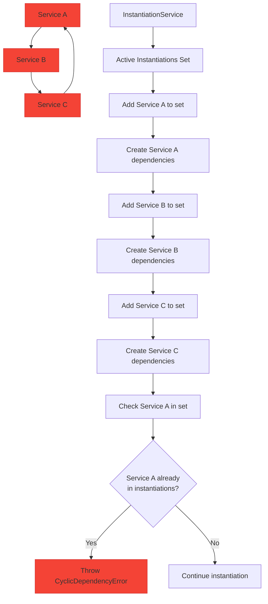

# Dependency Injection

<cite>
**Referenced Files in This Document**   
- [service-registry.ts](file://packages/h5-builder/src/bedrock/di/service-registry.ts)
- [instantiation-service.ts](file://packages/h5-builder/src/bedrock/di/instantiation-service.ts)
- [base.ts](file://packages/h5-builder/src/bedrock/di/base.ts)
- [descriptor.ts](file://packages/h5-builder/src/bedrock/di/descriptor.ts)
- [service-collection.ts](file://packages/h5-builder/src/bedrock/di/service-collection.ts)
- [context.web.tsx](file://packages/h5-builder/src/bedrock/di/context.web.tsx)
- [http.service.ts](file://packages/h5-builder/src/services/http.service.ts)
- [bridge.service.ts](file://packages/h5-builder/src/services/bridge.service.ts)
- [tracker.service.ts](file://packages/h5-builder/src/services/tracker.service.ts)
- [service-identifiers.ts](file://packages/h5-builder/src/services/service-identifiers.ts)
</cite>

## Table of Contents
1. [Introduction](#introduction)
2. [Core Components](#core-components)
3. [Dependency Injection Architecture](#dependency-injection-architecture)
4. [Service Registration and Resolution](#service-registration-and-resolution)
5. [Hierarchical Injector System](#hierarchical-injector-system)
6. [Practical Implementation Examples](#practical-implementation-examples)
7. [Common Issues and Troubleshooting](#common-issues-and-troubleshooting)
8. [Best Practices](#best-practices)
9. [Conclusion](#conclusion)

## Introduction
Dependency Injection (DI) is a fundamental design pattern in the MobX framework that enables loose coupling between components and their dependencies. This documentation provides comprehensive guidance on the DI system, covering its architecture, implementation patterns, common issues, and best practices. The system is designed to manage service lifecycle, resolve dependencies, and support hierarchical injection contexts, particularly in React applications.

## Core Components

The dependency injection system in MobX consists of several core components that work together to provide a robust service management framework. These components include service identifiers, descriptors, registries, instantiation services, and collections that manage the lifecycle and resolution of services.

**Section sources**
- [base.ts](file://packages/h5-builder/src/bedrock/di/base.ts#L1-L74)
- [descriptor.ts](file://packages/h5-builder/src/bedrock/di/descriptor.ts#L1-L32)
- [service-registry.ts](file://packages/h5-builder/src/bedrock/di/service-registry.ts#L1-L100)
- [instantiation-service.ts](file://packages/h5-builder/src/bedrock/di/instantiation-service.ts#L1-L468)
- [service-collection.ts](file://packages/h5-builder/src/bedrock/di/service-collection.ts#L1-L47)

## Dependency Injection Architecture

The DI architecture in MobX follows a hierarchical and extensible design pattern that enables flexible service management across different application contexts. The system is built around several key principles: service identification, dependency resolution, lazy instantiation, and hierarchical context inheritance.

**Diagram sources**
- [base.ts](file://packages/h5-builder/src/bedrock/di/base.ts#L1-L74)
- [service-registry.ts](file://packages/h5-builder/src/bedrock/di/service-registry.ts#L1-L100)
- [instantiation-service.ts](file://packages/h5-builder/src/bedrock/di/instantiation-service.ts#L1-L468)
- [descriptor.ts](file://packages/h5-builder/src/bedrock/di/descriptor.ts#L1-L32)

## Service Registration and Resolution

Service registration and resolution form the foundation of the DI system. Services are registered with unique identifiers and can be resolved through the instantiation service. The system supports both eager and delayed instantiation, allowing for efficient resource management.

### Service Identification
Services are identified using unique service identifiers created through the `createDecorator` function. These identifiers serve as tokens for dependency lookup and ensure type safety in the injection process.

**Diagram sources**
- [base.ts](file://packages/h5-builder/src/bedrock/di/base.ts#L1-L74)
- [model.ts](file://packages/h5-builder/src/bedrock/model.ts#L1-L243)

### Service Registration Process
Services are registered with the ServiceRegistry, which maintains a collection of service identifiers and their corresponding descriptors or instances. The registration process supports both constructor functions and SyncDescriptor objects.

**Diagram sources**
- [service-registry.ts](file://packages/h5-builder/src/bedrock/di/service-registry.ts#L1-L100)
- [service-collection.ts](file://packages/h5-builder/src/bedrock/di/service-collection.ts#L1-L47)
- [instantiation-service.ts](file://packages/h5-builder/src/bedrock/di/instantiation-service.ts#L1-L468)

## Hierarchical Injector System

The hierarchical injector system enables context-specific service resolution while maintaining access to parent-level services. This architecture supports global, page-level, and component-level injectors, creating a flexible dependency resolution hierarchy.

### Injector Hierarchy Structure
The injector system follows a parent-child relationship where child injectors can access services from their parent injectors, but not vice versa. This unidirectional access pattern ensures proper encapsulation and service lifecycle management.

**Diagram sources**
- [instantiation-service.ts](file://packages/h5-builder/src/bedrock/di/instantiation-service.ts#L1-L468)
- [context.web.tsx](file://packages/h5-builder/src/bedrock/di/context.web.tsx#L1-L42)

### Service Resolution Flow
When a service is requested, the injector system follows a specific resolution flow that traverses the hierarchy from the current injector to its ancestors until the service is found or determined to be unavailable.

**Diagram sources**
- [instantiation-service.ts](file://packages/h5-builder/src/bedrock/di/instantiation-service.ts#L268-L288)
- [base.ts](file://packages/h5-builder/src/bedrock/di/base.ts#L27-L29)

## Practical Implementation Examples

This section demonstrates practical examples of dependency injection implementation, showing how services are defined, registered, and injected into components and models.

### Service Definition and Registration
Services are defined as classes that implement the BrandedService interface and are registered with unique identifiers. The following example shows the registration of core services in the application.

**Diagram sources**
- [bridge.service.ts](file://packages/h5-builder/src/services/bridge.service.ts#L1-L227)
- [http.service.ts](file://packages/h5-builder/src/services/http.service.ts#L1-L281)
- [tracker.service.ts](file://packages/h5-builder/src/services/tracker.service.ts#L1-L290)
- [service-identifiers.ts](file://packages/h5-builder/src/services/service-identifiers.ts#L1-L10)

### Multiple Service Injection in Model Constructor
The DI system supports injecting multiple services into a Model constructor using the @Inject decorator. This pattern enables models to access the services they need without tight coupling.

**Diagram sources**
- [instantiation-service.ts](file://packages/h5-builder/src/bedrock/di/instantiation-service.ts#L118-L148)
- [http.service.ts](file://packages/h5-builder/src/services/http.service.ts#L73-L76)
- [tracker.service.ts](file://packages/h5-builder/src/services/tracker.service.ts#L41-L44)

## Common Issues and Troubleshooting

This section addresses common dependency injection issues and provides troubleshooting steps to resolve them effectively.

### Dependency Injection Not Working
When dependency injection is not working, several configuration and implementation issues should be checked:

1. **Experimental Decorators**: Ensure that 'experimentalDecorators' is enabled in tsconfig.json
2. **Service Registration**: Verify that services are properly registered with the Injector
3. **Instance Creation**: Confirm that instances are created using 'Injector.resolveAndInstantiate()'
4. **Service Identifiers**: Check that service identifiers are correctly defined and imported

**Diagram sources**
- [tsconfig.json](file://packages/h5-builder/tsconfig.json#L1-L20)
- [service-registry.ts](file://packages/h5-builder/src/bedrock/di/service-registry.ts#L35-L65)
- [instantiation-service.ts](file://packages/h5-builder/src/bedrock/di/instantiation-service.ts#L151-L176)

### Circular Dependency Detection
The DI system includes built-in protection against circular dependencies by tracking active instantiations and detecting cycles in the dependency graph.

**Diagram sources**
- [instantiation-service.ts](file://packages/h5-builder/src/bedrock/di/instantiation-service.ts#L297-L305)
- [instantiation-service.ts](file://packages/h5-builder/src/bedrock/di/instantiation-service.ts#L331-L333)

## Best Practices

Adhering to best practices ensures a robust and maintainable dependency injection implementation.

### Service Design Guidelines
1. **Interface Segregation**: Define focused service interfaces that follow the Interface Segregation Principle
2. **Single Responsibility**: Each service should have a single responsibility and well-defined purpose
3. **Immutable Configuration**: Service configuration should be immutable after creation
4. **Proper Disposal**: Implement IDisposable interface for services that manage resources

### Registration and Resolution Patterns
1. **Early Registration**: Register services as early as possible in the application lifecycle
2. **Consistent Identifiers**: Use consistent naming conventions for service identifiers
3. **Lazy Instantiation**: Use delayed instantiation for services that are expensive to create or not always needed
4. **Hierarchical Organization**: Organize injectors hierarchically to match the application structure

### Performance Considerations
1. **Service Caching**: The DI system automatically caches service instances to avoid redundant creation
2. **Dependency Minimization**: Minimize the number of dependencies per service to reduce instantiation overhead
3. **Asynchronous Initialization**: Use asynchronous initialization for services that require network calls or other async operations
4. **Memory Management**: Properly dispose of services to prevent memory leaks, especially in long-running applications

## Conclusion
The dependency injection system in MobX provides a powerful and flexible mechanism for managing service dependencies and lifecycles. By understanding the core components, architecture, and best practices outlined in this documentation, developers can effectively leverage DI to create loosely coupled, maintainable, and testable code. The hierarchical injector system enables context-specific service resolution while maintaining access to parent-level services, supporting complex application structures with global, page-level, and component-level injectors.