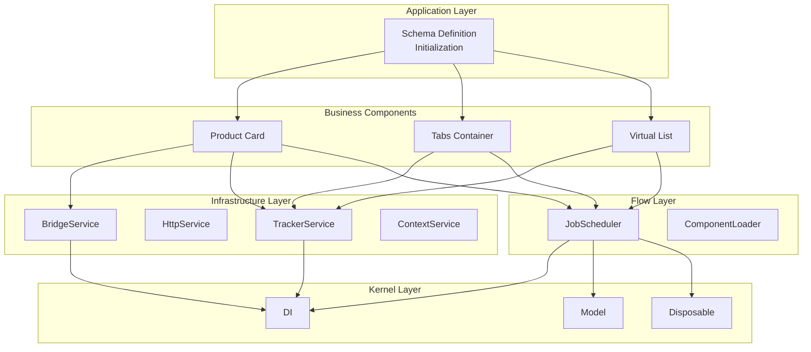
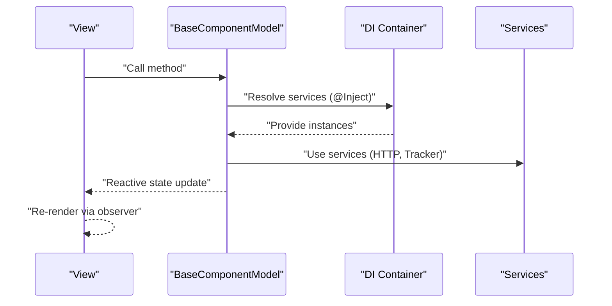
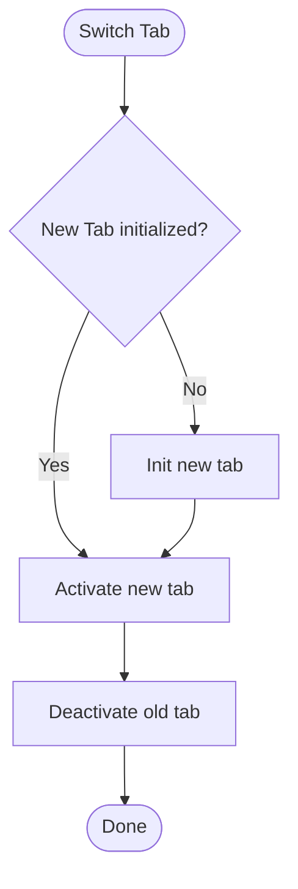
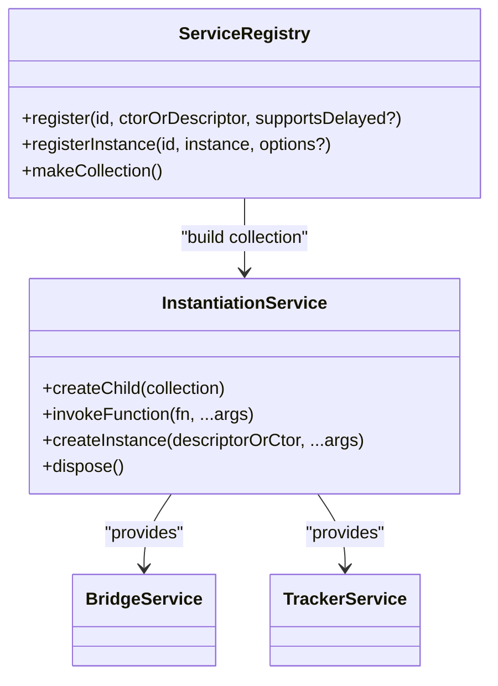

# Frequently Asked Questions

<cite>
**Referenced Files in This Document**
- [faq.md](file://packages/h5-builder/docs/faq.md)
- [README.md](file://packages/h5-builder/README.md)
- [model.ts](file://packages/h5-builder/src/bedrock/model.ts)
- [lifecycle.ts](file://packages/h5-builder/src/jobs/lifecycle.ts)
- [instantiation-service.ts](file://packages/h5-builder/src/bedrock/di/instantiation-service.ts)
- [service-registry.ts](file://packages/h5-builder/src/bedrock/di/service-registry.ts)
- [bridge.service.ts](file://packages/h5-builder/src/services/bridge.service.ts)
- [tracker.service.ts](file://packages/h5-builder/src/services/tracker.service.ts)
- [tabs-container.model.ts](file://packages/h5-builder/src/components/tabs-container/tabs-container.model.ts)
- [virtual-list.model.ts](file://packages/h5-builder/src/components/virtual-list/virtual-list.model.ts)
- [virtual-list.view.tsx](file://packages/h5-builder/src/components/virtual-list/virtual-list.view.tsx)
- [product-card.model.ts](file://packages/h5-builder/src/components/product-card/product-card.model.ts)
- [product-card.view.tsx](file://packages/h5-builder/src/components/product-card/product-card.view.tsx)
- [observer.ts](file://packages/mobx-vue-lite/src/observer.ts)
- [useObserver.ts](file://packages/mobx-vue-lite/src/useObserver.ts)
- [model.test.ts](file://packages/h5-builder/src/__tests__/model.test.ts)
</cite>

## Table of Contents
1. [Introduction](#introduction)
2. [Project Structure](#project-structure)
3. [Core Components](#core-components)
4. [Architecture Overview](#architecture-overview)
5. [Detailed Component Analysis](#detailed-component-analysis)
6. [Dependency Analysis](#dependency-analysis)
7. [Performance Considerations](#performance-considerations)
8. [Troubleshooting Guide](#troubleshooting-guide)
9. [Conclusion](#conclusion)

## Introduction
This FAQ consolidates answers to common questions about the H5 Builder framework, focusing on getting started, Model-View separation, dependency injection, lifecycle management, performance optimization, testing, debugging, and common errors. It provides practical guidance with references to concrete implementation files and diagrams to help developers adopt the framework effectively.

## Project Structure
The H5 Builder is organized into layers:
- Application Layer: Schema definition and initialization
- Business Components: Product card, tabs container, virtual list, etc.
- Flow Layer: Job scheduling, component loading
- Infrastructure Layer: Bridge, HTTP, tracker, context
- Kernel Layer: DI, model, disposable

**Diagram sources**
- [README.md](file://packages/h5-builder/README.md#L160-L215)

**Section sources**
- [README.md](file://packages/h5-builder/README.md#L160-L215)

## Core Components
- BaseComponentModel and BaseContainerModel define lifecycle hooks and resource management.
- Lifecycle states are orchestrated by the Flow layer and tracked via PageLifecycle.
- DI is provided by InstantiationService with service registration and ownership.
- Services like BridgeService and TrackerService encapsulate infrastructure concerns.

**Section sources**
- [model.ts](file://packages/h5-builder/src/bedrock/model.ts#L1-L156)
- [model.ts](file://packages/h5-builder/src/bedrock/model.ts#L157-L243)
- [lifecycle.ts](file://packages/h5-builder/src/jobs/lifecycle.ts#L1-L18)
- [instantiation-service.ts](file://packages/h5-builder/src/bedrock/di/instantiation-service.ts#L1-L120)
- [service-registry.ts](file://packages/h5-builder/src/bedrock/di/service-registry.ts#L1-L100)

## Architecture Overview
The framework enforces strict Model-View separation:
- Model: Pure business logic, no JSX
- View: Pure UI rendering, no business logic
- Communication: View invokes Model methods; Model updates reactive state to drive View updates

**Diagram sources**
- [README.md](file://packages/h5-builder/README.md#L189-L204)
- [instantiation-service.ts](file://packages/h5-builder/src/bedrock/di/instantiation-service.ts#L116-L176)
- [product-card.model.ts](file://packages/h5-builder/src/components/product-card/product-card.model.ts#L29-L41)
- [observer.ts](file://packages/mobx-vue-lite/src/observer.ts#L16-L51)

**Section sources**
- [README.md](file://packages/h5-builder/README.md#L189-L204)
- [observer.ts](file://packages/mobx-vue-lite/src/observer.ts#L16-L51)

## Detailed Component Analysis

### Getting Started
- Suitable scenarios include dynamic pages, strict UI-logic separation, high-performance lists, and complex lifecycle management.
- MobX + Vue Reactivity offers lightweight, performant reactive primitives integrated with React via mobx-vue-lite.
- TypeScript is strongly recommended for decorator-based DI and type safety.

Practical tips:
- Initialize models via DI containers and resolve-and-instantiate patterns.
- Use observer HOC to wrap views for automatic reactivity.

**Section sources**
- [faq.md](file://packages/h5-builder/docs/faq.md#L16-L44)
- [faq.md](file://packages/h5-builder/docs/faq.md#L27-L42)
- [observer.ts](file://packages/mobx-vue-lite/src/observer.ts#L16-L51)

### Model-View Separation
- View → Model: call model methods
- Model → View: reactive state updates drive re-rendering
- Model must not touch DOM or call services directly; expose state and delegate logic to services

Examples:
- Calling model methods from View
- Exposing reactive state from Model to View
- Avoiding direct DOM manipulation in Model

**Section sources**
- [faq.md](file://packages/h5-builder/docs/faq.md#L45-L116)
- [product-card.view.tsx](file://packages/h5-builder/src/components/product-card/product-card.view.tsx#L22-L77)
- [product-card.model.ts](file://packages/h5-builder/src/components/product-card/product-card.model.ts#L29-L41)

### Dependency Injection
- Enable decorators in tsconfig and register services in the DI container.
- Resolve services via constructor injection using @Inject.
- Parent-child DI scopes: child can access parent’s services, not vice versa.

Common failure points:
- experimentalDecorators not enabled
- Service not registered
- Using resolveAndInstantiate incorrectly

**Section sources**
- [faq.md](file://packages/h5-builder/docs/faq.md#L118-L168)
- [instantiation-service.ts](file://packages/h5-builder/src/bedrock/di/instantiation-service.ts#L116-L176)
- [service-registry.ts](file://packages/h5-builder/src/bedrock/di/service-registry.ts#L1-L100)
- [product-card.model.ts](file://packages/h5-builder/src/components/product-card/product-card.model.ts#L29-L41)

### Lifecycle
- init → onInit: one-time initialization
- activate → onActive: resume timers, subscriptions
- deactivate → onInactive: pause timers, cancel subscriptions
- dispose → onDestroy: cleanup resources

Memory leak prevention:
- Register all resources with this.register() to ensure deterministic cleanup.

**Section sources**
- [faq.md](file://packages/h5-builder/docs/faq.md#L170-L226)
- [model.ts](file://packages/h5-builder/src/bedrock/model.ts#L64-L155)
- [model.ts](file://packages/h5-builder/src/bedrock/model.ts#L1-L59)

### Performance Optimization
- Lazy loading: initialize only the active tab; lazily init others on demand.
- Idle pre-warming: schedule initialization during idle periods.
- Virtual scrolling: use VirtualListModel for long lists; configure item heights and overscan.

**Diagram sources**
- [tabs-container.model.ts](file://packages/h5-builder/src/components/tabs-container/tabs-container.model.ts#L171-L203)

**Section sources**
- [faq.md](file://packages/h5-builder/docs/faq.md#L229-L293)
- [tabs-container.model.ts](file://packages/h5-builder/src/components/tabs-container/tabs-container.model.ts#L68-L96)
- [tabs-container.model.ts](file://packages/h5-builder/src/components/tabs-container/tabs-container.model.ts#L171-L203)
- [virtual-list.model.ts](file://packages/h5-builder/src/components/virtual-list/virtual-list.model.ts#L1-L49)
- [virtual-list.view.tsx](file://packages/h5-builder/src/components/virtual-list/virtual-list.view.tsx#L78-L129)

### Testing
- Test models by constructing them and invoking lifecycle methods.
- Mock services via DI container registration.
- Verify lifecycle transitions, resource cleanup, and reactive updates.

**Section sources**
- [faq.md](file://packages/h5-builder/docs/faq.md#L296-L338)
- [model.test.ts](file://packages/h5-builder/src/__tests__/model.test.ts#L1-L178)
- [model.test.ts](file://packages/h5-builder/src/__tests__/model.test.ts#L179-L231)

### Debugging
- Enable BridgeService debug mode and TrackerService debug mode for synchronous sending and toast notifications.
- Inspect the model tree in browser console.
- Add lifecycle logs to trace component activation/deactivation.

**Section sources**
- [faq.md](file://packages/h5-builder/docs/faq.md#L339-L374)
- [bridge.service.ts](file://packages/h5-builder/src/services/bridge.service.ts#L1-L120)
- [tracker.service.ts](file://packages/h5-builder/src/services/tracker.service.ts#L1-L120)

### Common Errors
- State not updating: ensure properties are reactive, use observer HOC, and replace whole objects instead of mutating nested structures.
- Component not rendering: verify component registration, model-view mapping, and schema type correctness.
- “Cannot find name 'window'” in tests: add DOM lib to tsconfig.

**Section sources**
- [faq.md](file://packages/h5-builder/docs/faq.md#L376-L431)
- [useObserver.ts](file://packages/mobx-vue-lite/src/useObserver.ts#L19-L27)

## Dependency Analysis
The DI system resolves dependencies, prevents cycles, and supports delayed instantiation. Services can be owned by the container or referenced.

**Diagram sources**
- [service-registry.ts](file://packages/h5-builder/src/bedrock/di/service-registry.ts#L1-L100)
- [instantiation-service.ts](file://packages/h5-builder/src/bedrock/di/instantiation-service.ts#L1-L120)
- [bridge.service.ts](file://packages/h5-builder/src/services/bridge.service.ts#L1-L120)
- [tracker.service.ts](file://packages/h5-builder/src/services/tracker.service.ts#L1-L120)

**Section sources**
- [service-registry.ts](file://packages/h5-builder/src/bedrock/di/service-registry.ts#L1-L100)
- [instantiation-service.ts](file://packages/h5-builder/src/bedrock/di/instantiation-service.ts#L1-L120)

## Performance Considerations
- Prefer lazy loading and idle pre-warming for heavy components.
- Use virtual scrolling for long lists; tune overscan and container height.
- Minimize unnecessary re-renders by keeping state shallow and reactive.

[No sources needed since this section provides general guidance]

## Troubleshooting Guide
- State not updating:
  - Ensure properties are declared on the model class (reactive)
  - Wrap views with observer HOC
  - Replace entire objects instead of mutating nested structures
- Memory leaks:
  - Register timers, listeners, and subscriptions via this.register()
- Dependency injection failures:
  - Confirm experimentalDecorators is enabled
  - Ensure services are registered in the container
  - Use resolveAndInstantiate with correct identifiers
- Component rendering issues:
  - Verify component registration and model-view mapping
  - Ensure schema type matches the registered component

**Section sources**
- [faq.md](file://packages/h5-builder/docs/faq.md#L376-L431)
- [model.ts](file://packages/h5-builder/src/bedrock/model.ts#L28-L59)
- [instantiation-service.ts](file://packages/h5-builder/src/bedrock/di/instantiation-service.ts#L116-L176)

## Conclusion
This FAQ distilled the essential patterns and pitfalls for building H5 applications with the H5 Builder framework. By adhering to Model-View separation, leveraging DI, managing lifecycle carefully, optimizing with lazy loading and virtual scrolling, and employing robust debugging and testing practices, teams can deliver responsive, maintainable, and scalable experiences.