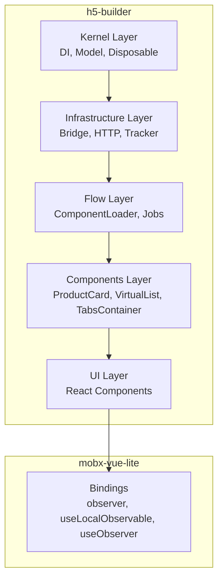
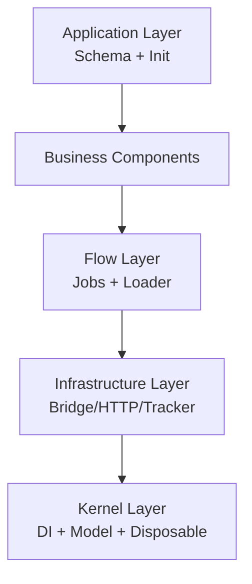
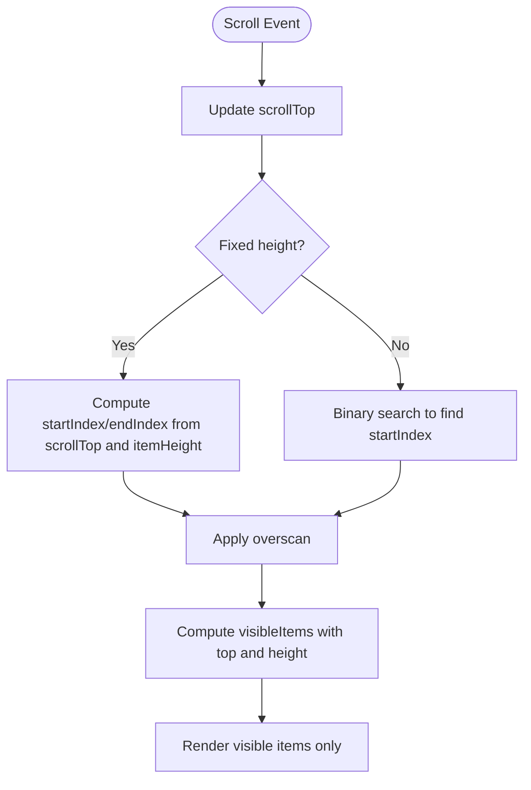
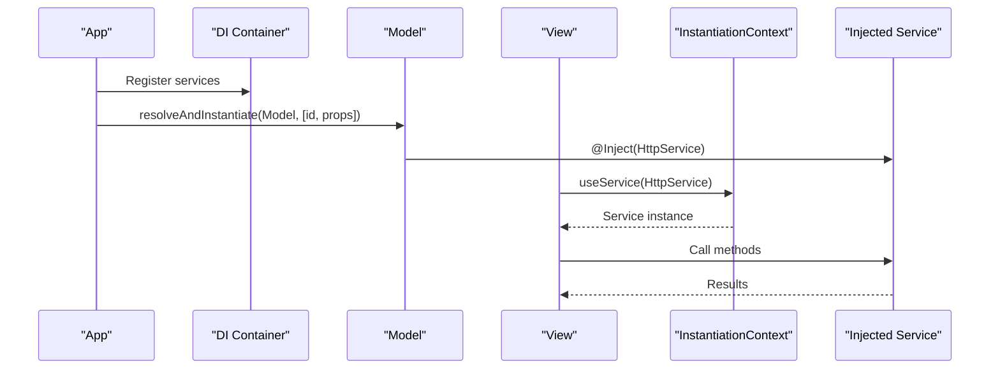
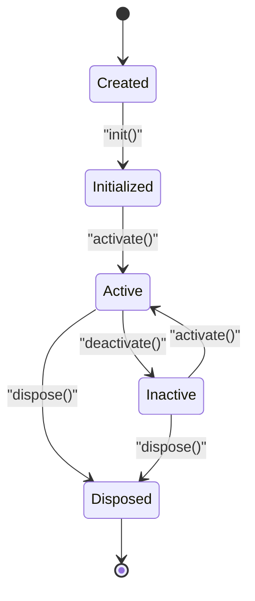
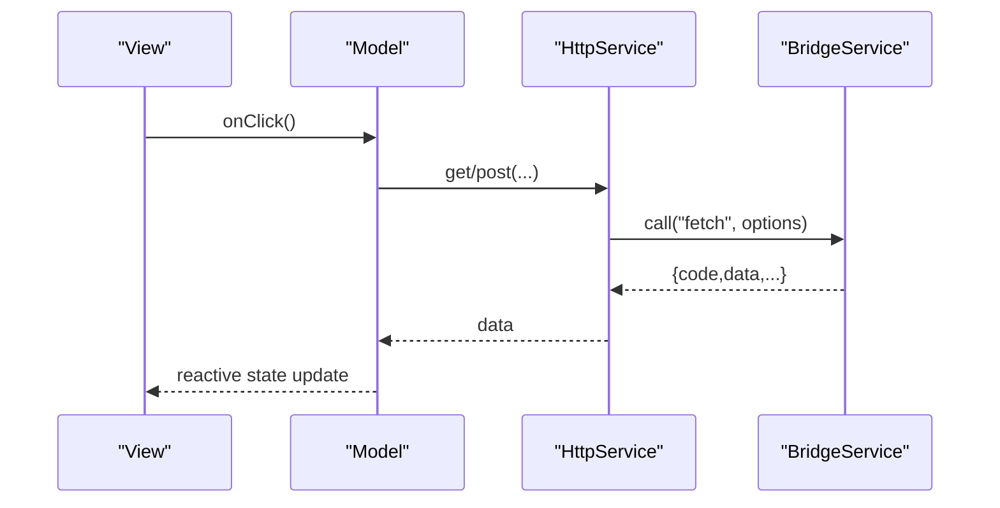
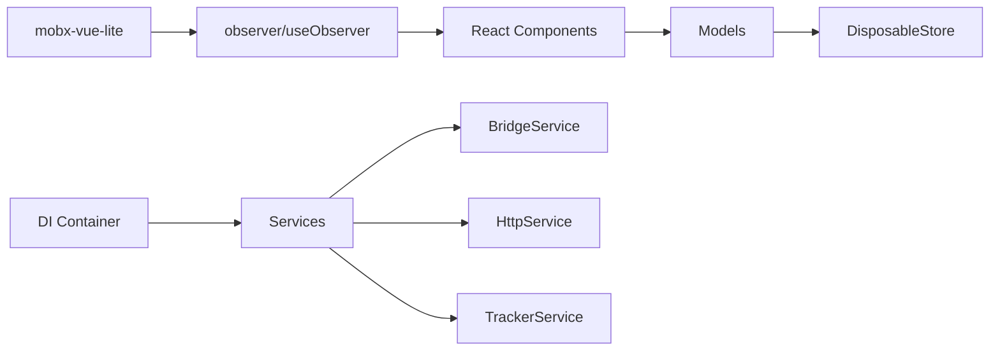

# Getting Started Questions

<cite>
**Referenced Files in This Document**
- [packages/h5-builder/docs/faq.md](file://packages/h5-builder/docs/faq.md)
- [packages/h5-builder/README.md](file://packages/h5-builder/README.md)
- [packages/h5-builder/src/bedrock/model.ts](file://packages/h5-builder/src/bedrock/model.ts)
- [packages/h5-builder/src/bedrock/di/index.common.ts](file://packages/h5-builder/src/bedrock/di/index.common.ts)
- [packages/h5-builder/src/bedrock/di/context.web.tsx](file://packages/h5-builder/src/bedrock/di/context.web.tsx)
- [packages/h5-builder/src/services/bridge.service.ts](file://packages/h5-builder/src/services/bridge.service.ts)
- [packages/h5-builder/src/services/http.service.ts](file://packages/h5-builder/src/services/http.service.ts)
- [packages/h5-builder/src/services/tracker.service.ts](file://packages/h5-builder/src/services/tracker.service.ts)
- [packages/h5-builder/src/components/virtual-list/virtual-list.model.ts](file://packages/h5-builder/src/components/virtual-list/virtual-list.model.ts)
- [packages/mobx-vue-lite/README.md](file://packages/mobx-vue-lite/README.md)
- [packages/mobx-vue-lite/src/index.ts](file://packages/mobx-vue-lite/src/index.ts)
- [tsconfig.json](file://tsconfig.json)
</cite>

## Table of Contents
1. [Introduction](#introduction)
2. [Project Structure](#project-structure)
3. [Core Components](#core-components)
4. [Architecture Overview](#architecture-overview)
5. [Detailed Component Analysis](#detailed-component-analysis)
6. [Dependency Analysis](#dependency-analysis)
7. [Performance Considerations](#performance-considerations)
8. [Troubleshooting Guide](#troubleshooting-guide)
9. [Conclusion](#conclusion)
10. [Appendices](#appendices)

## Introduction
This document answers common getting-started questions for H5 Builder, focusing on:
- Suitable use cases: e-commerce H5 pages, schema-driven dynamic pages, UI-logic separation, high-performance long lists, and complex applications with full lifecycle management.
- Why MobX combined with Vue Reactivity (via mobx-vue-lite) is used for React integration, and how it compares to MobX-React.
- Strongly recommended TypeScript usage, including decorator support for dependency injection and improved IDE experience.
- Practical examples and configuration requirements such as enabling experimental decorators in tsconfig.json.

## Project Structure
H5 Builder is organized into layers and packages:
- h5-builder package: framework core, DI, services, components, and documentation.
- mobx-vue-lite package: lightweight bindings compatible with mobx-react-lite for React.

**Diagram sources**
- [packages/h5-builder/README.md](file://packages/h5-builder/README.md#L159-L232)
- [packages/mobx-vue-lite/README.md](file://packages/mobx-vue-lite/README.md#L1-L61)

**Section sources**
- [packages/h5-builder/README.md](file://packages/h5-builder/README.md#L1-L158)

## Core Components
- Model-View separation: Pure business logic in Model; pure UI rendering in View. Communication is unidirectional: View invokes Model methods; Model updates reactive state that triggers View re-render.
- Lifecycle: init → onInit, activate → onActive, deactivate → onInactive, dispose → onDestroy. Containers orchestrate children lifecycle.
- Dependency Injection: Decorator-based DI with registration and resolution. React context exposes services to components.
- Reactive state: mobx-vue-lite integrates Vue’s reactivity primitives into React via observer and hooks.

Practical example references:
- Quick start schema, model, view, and initialization steps are documented in the framework README.
- Virtual list model demonstrates high-performance long lists with fixed and dynamic heights.

**Section sources**
- [packages/h5-builder/README.md](file://packages/h5-builder/README.md#L43-L127)
- [packages/h5-builder/src/bedrock/model.ts](file://packages/h5-builder/src/bedrock/model.ts#L1-L155)
- [packages/h5-builder/src/bedrock/di/index.common.ts](file://packages/h5-builder/src/bedrock/di/index.common.ts#L1-L29)
- [packages/h5-builder/src/bedrock/di/context.web.tsx](file://packages/h5-builder/src/bedrock/di/context.web.tsx#L1-L42)
- [packages/h5-builder/src/components/virtual-list/virtual-list.model.ts](file://packages/h5-builder/src/components/virtual-list/virtual-list.model.ts#L1-L217)

## Architecture Overview
The system follows a layered architecture:
- Application Layer: Schema definition and initialization.
- Business Components: Domain components (e.g., ProductCard, TabsContainer).
- Flow Layer: JobScheduler and ComponentLoader orchestration.
- Infrastructure Layer: Bridge, HTTP, Tracker, Context services.
- Kernel Layer: DI, Model base classes, and Disposable resources.

**Diagram sources**
- [packages/h5-builder/README.md](file://packages/h5-builder/README.md#L159-L232)

## Detailed Component Analysis

### Use Cases and Scenarios
- E-commerce H5 pages: Product cards, tabs containers, and virtualized lists are first-class citizens.
- Schema-driven dynamic pages: Define UI composition declaratively; build model tree from schema.
- UI-logic separation: Model holds state and logic; View renders based on reactive props.
- High-performance long lists: Virtual list model supports fixed and dynamic item heights with overscan and caching.
- Complex applications with full lifecycle management: Container models manage children lifecycles; lifecycle hooks provide precise control.

**Section sources**
- [packages/h5-builder/docs/faq.md](file://packages/h5-builder/docs/faq.md#L18-L25)
- [packages/h5-builder/README.md](file://packages/h5-builder/README.md#L1-L42)
- [packages/h5-builder/src/components/virtual-list/virtual-list.model.ts](file://packages/h5-builder/src/components/virtual-list/virtual-list.model.ts#L1-L217)

### Why MobX + Vue Reactivity (mobx-vue-lite) for React
- MobX provides simple reactive primitives (observable, computed, autorun, reaction, action).
- Vue Reactivity offers lightweight, high-performance reactivity under the hood.
- mobx-vue-lite provides React bindings (observer HOC, useLocalObservable, Observer component) and is API-compatible with mobx-react-lite.
- Compared to MobX-React, this combination yields smaller bundles and better performance characteristics for React apps.

**Section sources**
- [packages/h5-builder/docs/faq.md](file://packages/h5-builder/docs/faq.md#L27-L35)
- [packages/mobx-vue-lite/README.md](file://packages/mobx-vue-lite/README.md#L1-L61)
- [packages/mobx-vue-lite/src/index.ts](file://packages/mobx-vue-lite/src/index.ts#L1-L7)

### TypeScript Requirements and Decorators
- Strongly recommended: decorator support for dependency injection (@Inject), type safety to prevent runtime errors, and improved IDE experience.
- Enable experimental decorators in tsconfig.json to support decorator-based DI.

Configuration reference:
- Experimental decorators enabled in the repository tsconfig.

**Section sources**
- [packages/h5-builder/docs/faq.md](file://packages/h5-builder/docs/faq.md#L36-L42)
- [tsconfig.json](file://tsconfig.json#L1-L26)

### Practical Example: Quick Start
Follow these steps to bootstrap an H5 Builder app:
- Define a schema describing the UI structure.
- Create a Model class extending the base model, declare reactive properties, and inject services via decorators.
- Create a View component using observer and render based on model state.
- Initialize the DI container, register services, register component mappings, build the model tree, and render.

Example references:
- Schema, model, view, and initialization steps are documented in the framework README.

**Section sources**
- [packages/h5-builder/README.md](file://packages/h5-builder/README.md#L51-L127)

### Virtual List: High-Performance Long Lists
The virtual list model supports:
- Fixed-height mode (itemHeight) and dynamic-height mode (estimatedItemHeight).
- Efficient visibility calculation using overscan and binary search for dynamic heights.
- Height and offset caches to minimize recomputation.

**Diagram sources**
- [packages/h5-builder/src/components/virtual-list/virtual-list.model.ts](file://packages/h5-builder/src/components/virtual-list/virtual-list.model.ts#L115-L178)

**Section sources**
- [packages/h5-builder/src/components/virtual-list/virtual-list.model.ts](file://packages/h5-builder/src/components/virtual-list/virtual-list.model.ts#L1-L217)

### Dependency Injection and React Context
- Decorator-based DI: Services are registered and resolved with @Inject.
- React context: InstantiationContext provides services to components via useService.
- Parent-child injector isolation allows global, page-level, and component-level service scoping.

**Diagram sources**
- [packages/h5-builder/src/bedrock/di/index.common.ts](file://packages/h5-builder/src/bedrock/di/index.common.ts#L1-L29)
- [packages/h5-builder/src/bedrock/di/context.web.tsx](file://packages/h5-builder/src/bedrock/di/context.web.tsx#L1-L42)

**Section sources**
- [packages/h5-builder/docs/faq.md](file://packages/h5-builder/docs/faq.md#L118-L168)
- [packages/h5-builder/src/bedrock/di/index.common.ts](file://packages/h5-builder/src/bedrock/di/index.common.ts#L1-L29)
- [packages/h5-builder/src/bedrock/di/context.web.tsx](file://packages/h5-builder/src/bedrock/di/context.web.tsx#L1-L42)

### Lifecycle Management
- BaseComponentModel provides lifecycle hooks: onInit, onActive, onInactive, onDestroy.
- BaseContainerModel orchestrates children lifecycle by default (init/activate/deactivate all children).
- Resource cleanup is automated via DisposableStore; register timers, listeners, and subscriptions with register().

**Diagram sources**
- [packages/h5-builder/src/bedrock/model.ts](file://packages/h5-builder/src/bedrock/model.ts#L64-L155)

**Section sources**
- [packages/h5-builder/docs/faq.md](file://packages/h5-builder/docs/faq.md#L170-L226)
- [packages/h5-builder/src/bedrock/model.ts](file://packages/h5-builder/src/bedrock/model.ts#L1-L155)

### Services: Bridge, HTTP, Tracker
- BridgeService: Unified JSBridge invocation with mock mode for browser debugging.
- HttpService: Request/response interceptors, token/baseURL handling, cancellation, and error interception.
- TrackerService: Event batching, persistence, debug mode with synchronous sending and toast notifications.

**Diagram sources**
- [packages/h5-builder/src/services/http.service.ts](file://packages/h5-builder/src/services/http.service.ts#L147-L203)
- [packages/h5-builder/src/services/bridge.service.ts](file://packages/h5-builder/src/services/bridge.service.ts#L55-L118)

**Section sources**
- [packages/h5-builder/src/services/bridge.service.ts](file://packages/h5-builder/src/services/bridge.service.ts#L1-L169)
- [packages/h5-builder/src/services/http.service.ts](file://packages/h5-builder/src/services/http.service.ts#L1-L272)
- [packages/h5-builder/src/services/tracker.service.ts](file://packages/h5-builder/src/services/tracker.service.ts#L1-L228)

## Dependency Analysis
- H5 Builder depends on mobx-vue-lite for reactive bindings in React.
- Services depend on BridgeService for platform integration.
- Models depend on DI for service injection and DisposableStore for resource management.

**Diagram sources**
- [packages/mobx-vue-lite/src/index.ts](file://packages/mobx-vue-lite/src/index.ts#L1-L7)
- [packages/h5-builder/src/bedrock/model.ts](file://packages/h5-builder/src/bedrock/model.ts#L1-L58)
- [packages/h5-builder/src/services/bridge.service.ts](file://packages/h5-builder/src/services/bridge.service.ts#L1-L169)
- [packages/h5-builder/src/services/http.service.ts](file://packages/h5-builder/src/services/http.service.ts#L1-L103)
- [packages/h5-builder/src/services/tracker.service.ts](file://packages/h5-builder/src/services/tracker.service.ts#L1-L66)

**Section sources**
- [packages/mobx-vue-lite/src/index.ts](file://packages/mobx-vue-lite/src/index.ts#L1-L7)
- [packages/h5-builder/src/bedrock/model.ts](file://packages/h5-builder/src/bedrock/model.ts#L1-L58)

## Performance Considerations
- Virtual lists: Use overscan and caching to reduce DOM nodes and reflows.
- Lazy loading and idle preheating: Defer initialization until needed; schedule idle tasks to warm up future components.
- Resource cleanup: Always register timers, event listeners, and subscriptions to prevent memory leaks.

**Section sources**
- [packages/h5-builder/docs/faq.md](file://packages/h5-builder/docs/faq.md#L231-L293)
- [packages/h5-builder/src/bedrock/model.ts](file://packages/h5-builder/src/bedrock/model.ts#L28-L58)

## Troubleshooting Guide
- State not updating: Ensure properties are declared as reactive on the class and that views are wrapped with observer.
- Cannot find name 'window' errors: These are test environment type issues; ignore or adjust lib settings in tsconfig.
- Component not rendering: Verify component registration in ComponentLoader, model-view mapping registration, and correct schema type.

**Section sources**
- [packages/h5-builder/docs/faq.md](file://packages/h5-builder/docs/faq.md#L377-L430)
- [tsconfig.json](file://tsconfig.json#L1-L26)

## Conclusion
H5 Builder provides a robust, layered architecture for building scalable H5 applications with strong UI-logic separation, lifecycle management, and performance optimizations. Using MobX with Vue Reactivity (via mobx-vue-lite) delivers lightweight, high-performance reactivity for React, while TypeScript and decorators streamline dependency injection and improve developer experience. Start with the quick start guide, adopt virtual lists for long lists, and leverage services and lifecycle hooks for production-grade applications.

## Appendices
- Quick start references:
  - Schema definition, model creation, view rendering, and initialization are documented in the framework README.
- Virtual list references:
  - Fixed-height and dynamic-height modes, overscan, and visibility calculations are implemented in the virtual list model.

**Section sources**
- [packages/h5-builder/README.md](file://packages/h5-builder/README.md#L51-L127)
- [packages/h5-builder/src/components/virtual-list/virtual-list.model.ts](file://packages/h5-builder/src/components/virtual-list/virtual-list.model.ts#L1-L217)