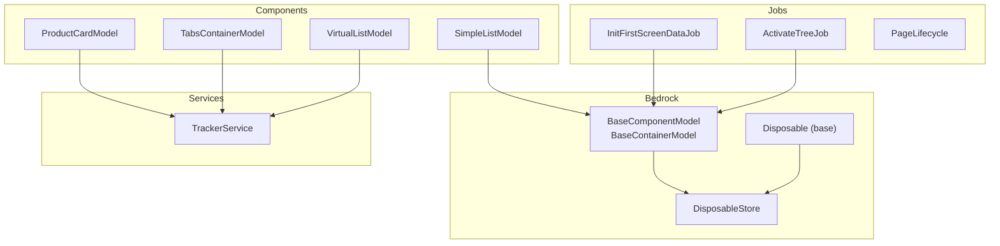
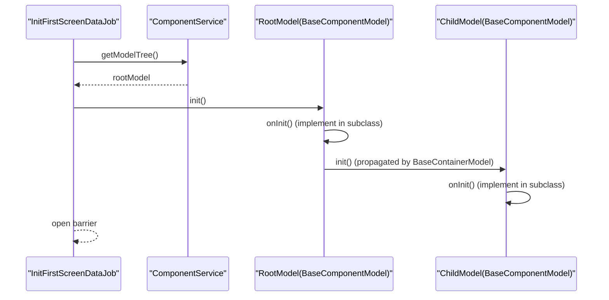
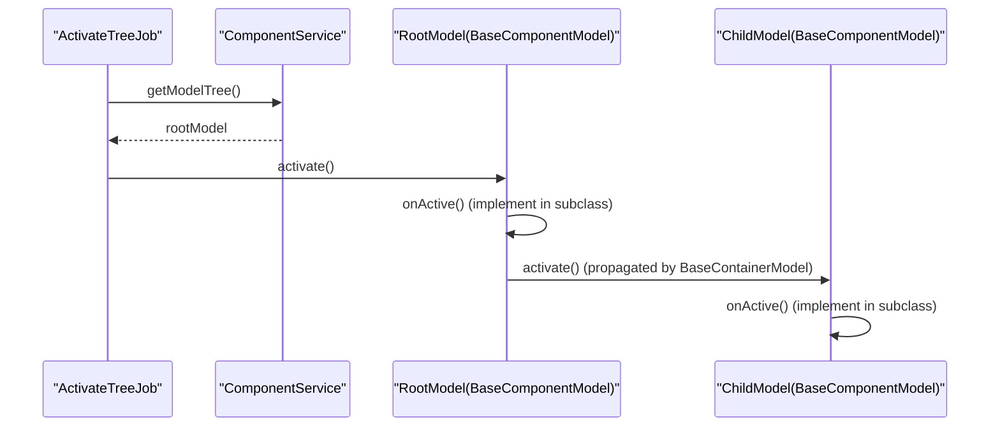
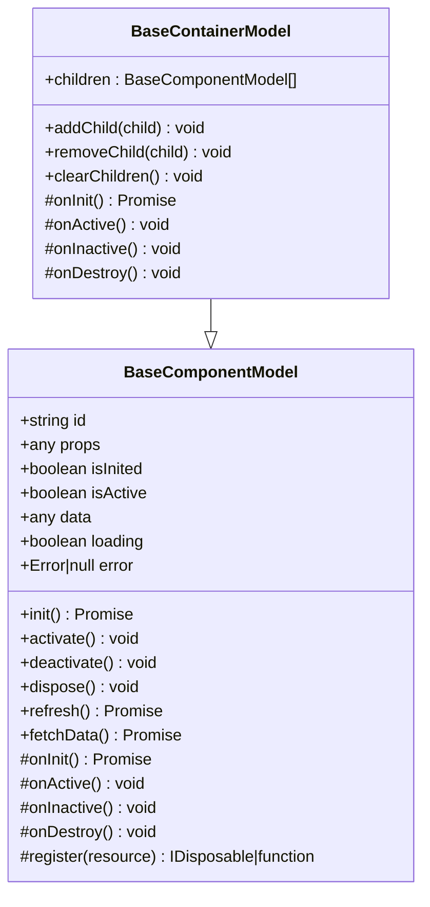
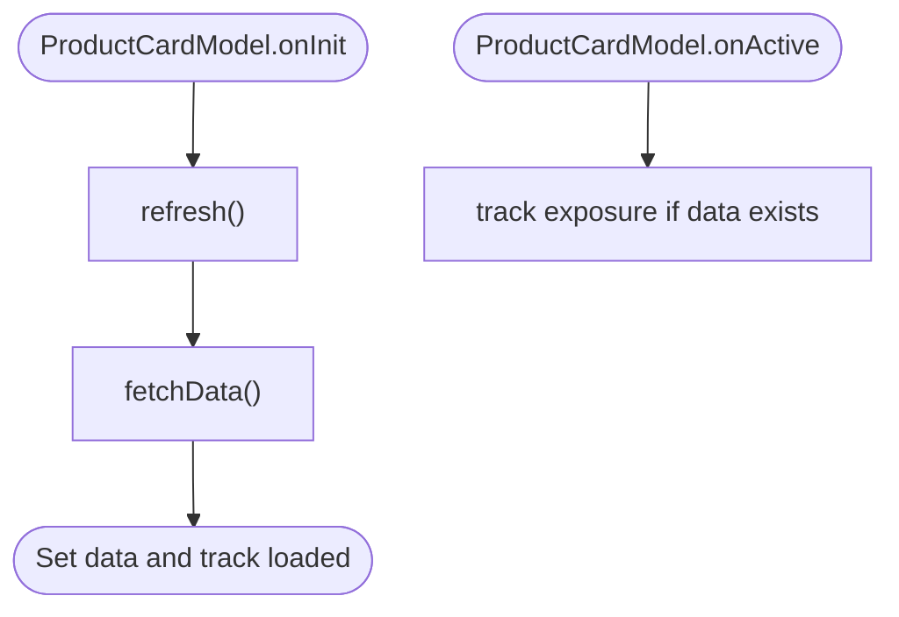
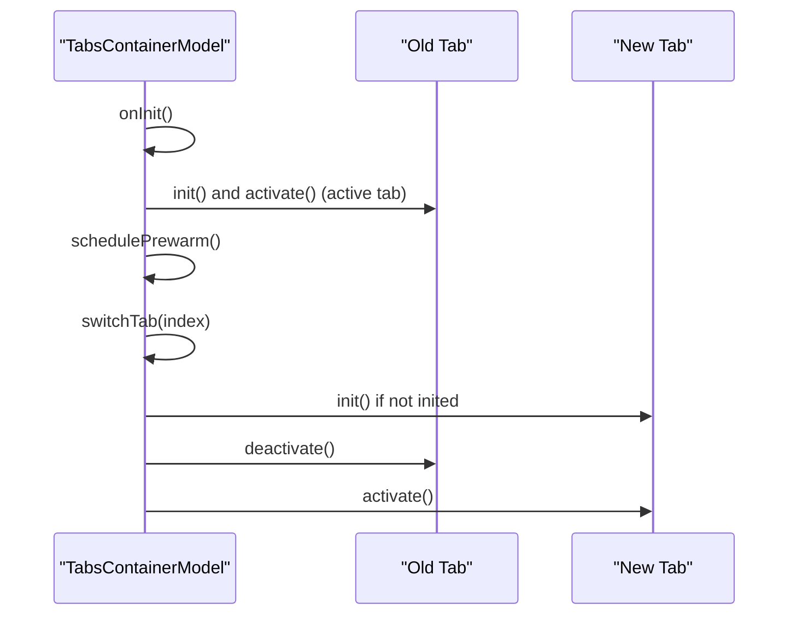
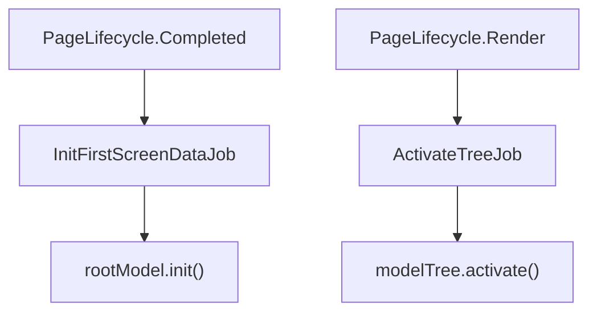
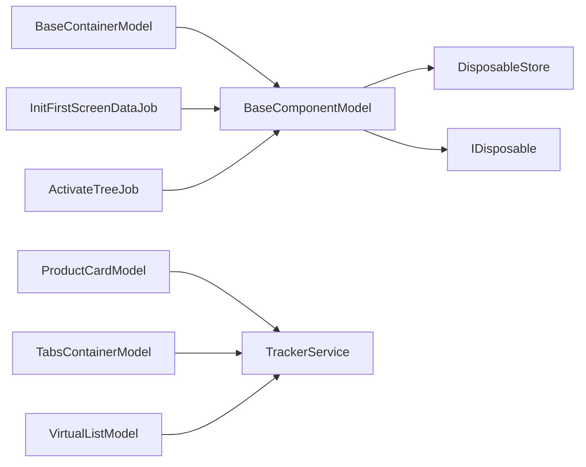
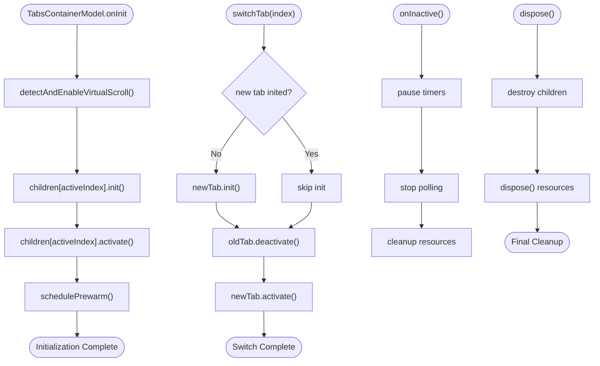

# Lifecycle Management

<cite>
**Referenced Files in This Document**
- [model.ts](file://packages/h5-builder/src/bedrock/model.ts)
- [disposable-store.ts](file://packages/h5-builder/src/bedrock/dispose/disposable-store.ts)
- [disposable-t.ts](file://packages/h5-builder/src/bedrock/dispose/disposable-t.ts)
- [disposable-base.ts](file://packages/h5-builder/src/bedrock/dispose/dispose-base.ts)
- [index.ts](file://packages/h5-builder/src/bedrock/dispose/index.ts)
- [lifecycle.ts](file://packages/h5-builder/src/jobs/lifecycle.ts)
- [activate-tree-job.ts](file://packages/h5-builder/src/jobs/activate-tree-job.ts)
- [init-first-screen-data-job.ts](file://packages/h5-builder/src/jobs/init-first-screen-data-job.ts)
- [tabs-container.model.ts](file://packages/h5-builder/src/components/tabs-container/tabs-container.model.ts)
- [simple-list.model.ts](file://packages/h5-builder/src/components/simple-list/simple-list.model.ts)
- [product-card.model.ts](file://packages/h5-builder/src/components/product-card/product-card.model.ts)
- [virtual-list.model.ts](file://packages/h5-builder/src/components/virtual-list/virtual-list.model.ts)
- [tracker.service.ts](file://packages/h5-builder/src/services/tracker.service.ts)
- [model-renderer.tsx](file://packages/h5-builder/src/components/model-renderer.tsx)
</cite>

## Table of Contents
1. [Introduction](#introduction)
2. [Project Structure](#project-structure)
3. [Core Components](#core-components)
4. [Architecture Overview](#architecture-overview)
5. [Detailed Component Analysis](#detailed-component-analysis)
6. [Dependency Analysis](#dependency-analysis)
7. [Performance Considerations](#performance-considerations)
8. [Troubleshooting Guide](#troubleshooting-guide)
9. [Conclusion](#conclusion)
10. [Appendices](#appendices)

## Introduction
This document explains component lifecycle management in the H5 Builder framework. It focuses on the four lifecycle phases:
- init: one-time initialization for data loading and resource setup
- activate: actions when a component becomes active (e.g., tracking exposure, starting animations)
- deactivate: cleanup when a component is no longer active (pausing animations, stopping polling)
- dispose: final resource cleanup and teardown

It also provides a complete example implementation of a TabModel that:
- Loads data on init
- Tracks exposure on activate
- Stops polling on deactivate
- Cleans up resources on dispose

Additionally, it explains how to avoid memory leaks by properly registering disposable resources using this.register() for timers, event listeners, and subscriptions. These registrations are automatically cleaned up during disposal.

## Project Structure
The lifecycle system spans several layers:
- Core lifecycle primitives in the bedrock layer (BaseComponentModel, BaseContainerModel, DisposableStore)
- Jobs orchestrating lifecycle phases (InitFirstScreenDataJob, ActivateTreeJob)
- Component models implementing lifecycle hooks (ProductCardModel, TabsContainerModel, VirtualListModel)
- Services integrating with lifecycle (TrackerService)

**Diagram sources**
- [model.ts](file://packages/h5-builder/src/bedrock/model.ts#L1-L156)
- [disposable-store.ts](file://packages/h5-builder/src/bedrock/dispose/disposable-store.ts#L1-L84)
- [disposable-t.ts](file://packages/h5-builder/src/bedrock/dispose/disposable-t.ts#L1-L36)
- [lifecycle.ts](file://packages/h5-builder/src/jobs/lifecycle.ts#L1-L18)
- [init-first-screen-data-job.ts](file://packages/h5-builder/src/jobs/init-first-screen-data-job.ts#L1-L67)
- [activate-tree-job.ts](file://packages/h5-builder/src/jobs/activate-tree-job.ts#L1-L56)
- [product-card.model.ts](file://packages/h5-builder/src/components/product-card/product-card.model.ts#L1-L133)
- [tabs-container.model.ts](file://packages/h5-builder/src/components/tabs-container/tabs-container.model.ts#L1-L273)
- [virtual-list.model.ts](file://packages/h5-builder/src/components/virtual-list/virtual-list.model.ts#L1-L217)
- [simple-list.model.ts](file://packages/h5-builder/src/components/simple-list/simple-list.model.ts#L1-L16)
- [tracker.service.ts](file://packages/h5-builder/src/services/tracker.service.ts#L1-L229)

**Section sources**
- [model.ts](file://packages/h5-builder/src/bedrock/model.ts#L1-L156)
- [lifecycle.ts](file://packages/h5-builder/src/jobs/lifecycle.ts#L1-L18)
- [init-first-screen-data-job.ts](file://packages/h5-builder/src/jobs/init-first-screen-data-job.ts#L1-L67)
- [activate-tree-job.ts](file://packages/h5-builder/src/jobs/activate-tree-job.ts#L1-L56)

## Core Components
- BaseComponentModel: Provides lifecycle methods init(), activate(), deactivate(), dispose(), plus onInit(), onActive(), onInactive(), onDestroy() hooks. It manages reactive state (isInited, isActive) and exposes register() to attach disposable resources.
- BaseContainerModel: Extends BaseComponentModel and adds automatic lifecycle propagation to children. It initializes, activates, and deactivates all children by default, and registers child disposal.
- DisposableStore: A collection of IDisposable objects that are disposed in last-in-first-out order. It logs warnings if trying to add to a disposed store and throws an AggregateError if any disposal fails.
- Disposable (base): Adds a DisposableStore to derived classes and exposes _register() for internal use.
- PageLifecycle: Enumerates page lifecycle phases used by jobs to coordinate when init and activation occur.
- Jobs:
  - InitFirstScreenDataJob: Calls rootModel.init() when the page reaches Completed phase.
  - ActivateTreeJob: Calls modelTree.activate() when the page reaches Render phase.

Key lifecycle semantics:
- init: Ensures onInit runs exactly once and sets isInited. Subclasses implement onInit for data loading and resource setup.
- activate: Sets isActive and calls onActive. Subclasses implement onActive for resuming timers, re-subscribing, or tracking exposure.
- deactivate: Clears isActive and calls onInactive. Subclasses implement onInactive for pausing timers, unsubscribing, or stopping polling.
- dispose: Calls onDestroy and disposes all registered resources via DisposableStore.

**Section sources**
- [model.ts](file://packages/h5-builder/src/bedrock/model.ts#L1-L156)
- [disposable-store.ts](file://packages/h5-builder/src/bedrock/dispose/disposable-store.ts#L1-L84)
- [disposable-t.ts](file://packages/h5-builder/src/bedrock/dispose/disposable-t.ts#L1-L36)
- [lifecycle.ts](file://packages/h5-builder/src/jobs/lifecycle.ts#L1-L18)
- [init-first-screen-data-job.ts](file://packages/h5-builder/src/jobs/init-first-screen-data-job.ts#L1-L67)
- [activate-tree-job.ts](file://packages/h5-builder/src/jobs/activate-tree-job.ts#L1-L56)

## Architecture Overview
The lifecycle orchestration proceeds in two stages:
1. Initialization: InitFirstScreenDataJob triggers rootModel.init() during the Completed phase, which calls onInit() on all components.
2. Activation: ActivateTreeJob triggers modelTree.activate() during the Render phase, which calls onActive() on all components.

**Diagram sources**
- [init-first-screen-data-job.ts](file://packages/h5-builder/src/jobs/init-first-screen-data-job.ts#L1-L67)
- [model.ts](file://packages/h5-builder/src/bedrock/model.ts#L60-L121)

**Diagram sources**
- [activate-tree-job.ts](file://packages/h5-builder/src/jobs/activate-tree-job.ts#L1-L56)
- [model.ts](file://packages/h5-builder/src/bedrock/model.ts#L75-L97)

## Detailed Component Analysis

### BaseComponentModel and BaseContainerModel
These classes define the lifecycle contract and default behaviors:
- BaseComponentModel:
  - Lifecycle flags: isInited, isActive
  - Methods: init(), activate(), deactivate(), dispose()
  - Hooks: onInit(), onActive(), onInactive(), onDestroy()
  - Resource registration: register(resource) stores IDisposable resources
- BaseContainerModel:
  - addChild/removeChild/clearChildren manage children
  - Default onInit: initializes all children in parallel
  - Default onActive/onInactive: activates/deactivates all children

**Diagram sources**
- [model.ts](file://packages/h5-builder/src/bedrock/model.ts#L1-L156)

**Section sources**
- [model.ts](file://packages/h5-builder/src/bedrock/model.ts#L1-L156)

### ProductCardModel Example
- Implements onInit to refresh data
- Implements onActive to track exposure
- Uses TrackerService for analytics
- Demonstrates reactive state (data, loading, error) and computed helpers

**Diagram sources**
- [product-card.model.ts](file://packages/h5-builder/src/components/product-card/product-card.model.ts#L1-L133)
- [tracker.service.ts](file://packages/h5-builder/src/services/tracker.service.ts#L1-L229)

**Section sources**
- [product-card.model.ts](file://packages/h5-builder/src/components/product-card/product-card.model.ts#L1-L133)
- [tracker.service.ts](file://packages/h5-builder/src/services/tracker.service.ts#L1-L229)

### TabsContainerModel Example
- Demonstrates container lifecycle customization:
  - onInit: initializes only the active tab and schedules preheating for others
  - switchTab: lazily initializes inactive tabs, then calls deactivate() on old tab and activate() on new tab
  - Uses TrackerService to track init and switch events
- Virtual scroll integration is demonstrated in the same file

**Diagram sources**
- [tabs-container.model.ts](file://packages/h5-builder/src/components/tabs-container/tabs-container.model.ts#L1-L273)
- [tracker.service.ts](file://packages/h5-builder/src/services/tracker.service.ts#L1-L229)

**Section sources**
- [tabs-container.model.ts](file://packages/h5-builder/src/components/tabs-container/tabs-container.model.ts#L1-L273)

### VirtualListModel Example
- A leaf component that demonstrates data handling and computed properties
- Does not override lifecycle hooks in this example

**Section sources**
- [virtual-list.model.ts](file://packages/h5-builder/src/components/virtual-list/virtual-list.model.ts#L1-L217)

### SimpleListModel Example
- A container that relies on BaseContainerModel defaults:
  - Automatically initializes all children
  - Automatically activates all children
  - Automatically deactivates all children

**Section sources**
- [simple-list.model.ts](file://packages/h5-builder/src/components/simple-list/simple-list.model.ts#L1-L16)

### Lifecycle Orchestration Jobs
- InitFirstScreenDataJob: Triggers rootModel.init() during Completed phase
- ActivateTreeJob: Triggers modelTree.activate() during Render phase

**Diagram sources**
- [lifecycle.ts](file://packages/h5-builder/src/jobs/lifecycle.ts#L1-L18)
- [init-first-screen-data-job.ts](file://packages/h5-builder/src/jobs/init-first-screen-data-job.ts#L1-L67)
- [activate-tree-job.ts](file://packages/h5-builder/src/jobs/activate-tree-job.ts#L1-L56)

**Section sources**
- [lifecycle.ts](file://packages/h5-builder/src/jobs/lifecycle.ts#L1-L18)
- [init-first-screen-data-job.ts](file://packages/h5-builder/src/jobs/init-first-screen-data-job.ts#L1-L67)
- [activate-tree-job.ts](file://packages/h5-builder/src/jobs/activate-tree-job.ts#L1-L56)

## Dependency Analysis
- BaseComponentModel depends on DisposableStore for resource management and exposes register() for subclasses to attach disposables.
- BaseContainerModel extends BaseComponentModel and adds child lifecycle propagation.
- Jobs depend on ComponentService to access the model tree and coordinate lifecycle timing.
- Components may depend on services like TrackerService for analytics.

**Diagram sources**
- [model.ts](file://packages/h5-builder/src/bedrock/model.ts#L1-L156)
- [disposable-store.ts](file://packages/h5-builder/src/bedrock/dispose/disposable-store.ts#L1-L84)
- [disposable-base.ts](file://packages/h5-builder/src/bedrock/dispose/dispose-base.ts#L1-L10)
- [index.ts](file://packages/h5-builder/src/bedrock/dispose/index.ts#L1-L35)
- [init-first-screen-data-job.ts](file://packages/h5-builder/src/jobs/init-first-screen-data-job.ts#L1-L67)
- [activate-tree-job.ts](file://packages/h5-builder/src/jobs/activate-tree-job.ts#L1-L56)
- [product-card.model.ts](file://packages/h5-builder/src/components/product-card/product-card.model.ts#L1-L133)
- [tabs-container.model.ts](file://packages/h5-builder/src/components/tabs-container/tabs-container.model.ts#L1-L273)
- [virtual-list.model.ts](file://packages/h5-builder/src/components/virtual-list/virtual-list.model.ts#L1-L217)

**Section sources**
- [model.ts](file://packages/h5-builder/src/bedrock/model.ts#L1-L156)
- [disposable-store.ts](file://packages/h5-builder/src/bedrock/dispose/disposable-store.ts#L1-L84)
- [disposable-base.ts](file://packages/h5-builder/src/bedrock/dispose/dispose-base.ts#L1-L10)
- [index.ts](file://packages/h5-builder/src/bedrock/dispose/index.ts#L1-L35)
- [init-first-screen-data-job.ts](file://packages/h5-builder/src/jobs/init-first-screen-data-job.ts#L1-L67)
- [activate-tree-job.ts](file://packages/h5-builder/src/jobs/activate-tree-job.ts#L1-L56)
- [product-card.model.ts](file://packages/h5-builder/src/components/product-card/product-card.model.ts#L1-L133)
- [tabs-container.model.ts](file://packages/h5-builder/src/components/tabs-container/tabs-container.model.ts#L1-L273)
- [virtual-list.model.ts](file://packages/h5-builder/src/components/virtual-list/virtual-list.model.ts#L1-L217)

## Performance Considerations
- Container initialization is parallelized by default in BaseContainerModel.onInit, reducing startup latency.
- TabsContainerModel uses lazy loading and preheating strategies to balance responsiveness and resource usage.
- Virtual lists compute visible ranges efficiently using cached offsets and binary search.

[No sources needed since this section provides general guidance]

## Troubleshooting Guide
Common issues and remedies:
- Memory leaks due to missing cleanup:
  - Ensure all timers, intervals, and event subscriptions are registered via this.register() so they are disposed automatically.
  - For services like TrackerService, rely on their own disposal mechanisms (e.g., TrackerService.dispose() flushes remaining events and clears timers).
- Duplicate initialization:
  - BaseComponentModel.init() prevents multiple onInit invocations by checking isInited.
- Duplicate activation/deactivation:
  - BaseComponentModel.activate()/deactivate() guard against redundant transitions by checking isActive.
- Disposing an already disposed store:
  - DisposableStore logs warnings and throws AggregateError if disposal fails; ensure dispose() is called only once.

**Section sources**
- [model.ts](file://packages/h5-builder/src/bedrock/model.ts#L60-L121)
- [disposable-store.ts](file://packages/h5-builder/src/bedrock/dispose/disposable-store.ts#L1-L84)
- [tracker.service.ts](file://packages/h5-builder/src/services/tracker.service.ts#L1-L229)

## Conclusion
H5 Builder’s lifecycle management centers on BaseComponentModel and BaseContainerModel, providing a robust foundation for component initialization, activation, deactivation, and disposal. Jobs coordinate timing to ensure data is fetched during Completed and activation occurs after rendering. Components should implement onInit for data loading, onActive for resuming work and tracking exposure, onInactive for pausing and canceling, and rely on register() to avoid memory leaks. Containers can customize lifecycle propagation to optimize performance and user experience.

[No sources needed since this section summarizes without analyzing specific files]

## Appendices

### Complete Example: TabModel Lifecycle Implementation
Below is a complete example implementation outline for a TabModel that:
- Loads data on init
- Tracks exposure on activate
- Stops polling on deactivate
- Cleans up resources on dispose

Implementation outline:
- Extend BaseContainerModel to manage child tabs
- Override onInit to initialize only the active tab and schedule preheating for others
- Override onActive to track exposure for the active tab
- Override onInactive to pause timers and stop polling
- Use register() to attach timers, event listeners, and subscriptions; they will be cleaned up automatically during dispose
- Dispose child tabs and virtual lists when the container is destroyed

**Diagram sources**
- [tabs-container.model.ts](file://packages/h5-builder/src/components/tabs-container/tabs-container.model.ts#L1-L273)
- [model.ts](file://packages/h5-builder/src/bedrock/model.ts#L1-L156)
- [disposable-store.ts](file://packages/h5-builder/src/bedrock/dispose/disposable-store.ts#L1-L84)

Guidance on avoiding memory leaks:
- Register timers and intervals using this.register(() => clearInterval(id))
- Register event listeners using this.register(unsubscribeFn)
- Register subscriptions and cancellations similarly
- For services like TrackerService, rely on their built-in disposal to flush and clean up timers

**Section sources**
- [tabs-container.model.ts](file://packages/h5-builder/src/components/tabs-container/tabs-container.model.ts#L1-L273)
- [model.ts](file://packages/h5-builder/src/bedrock/model.ts#L1-L156)
- [disposable-store.ts](file://packages/h5-builder/src/bedrock/dispose/disposable-store.ts#L1-L84)
- [tracker.service.ts](file://packages/h5-builder/src/services/tracker.service.ts#L1-L229)