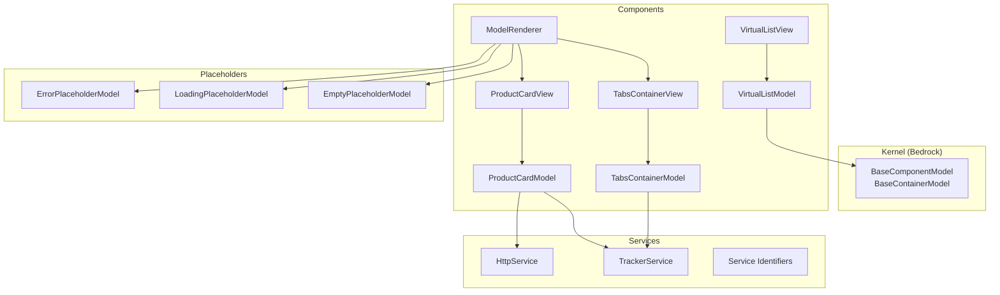
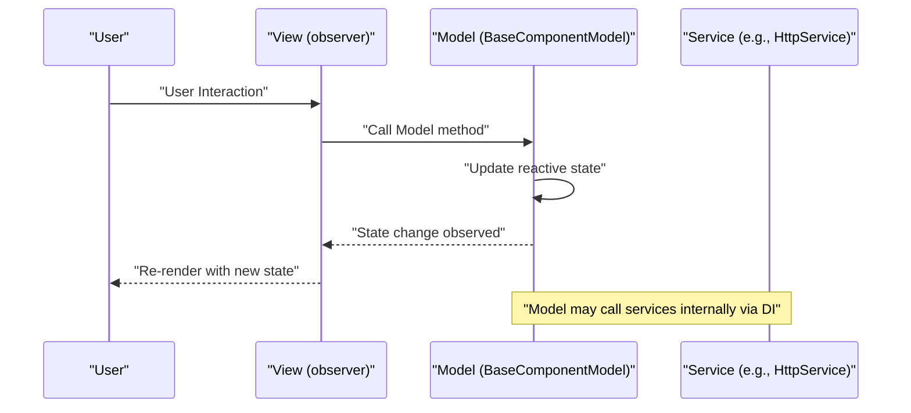
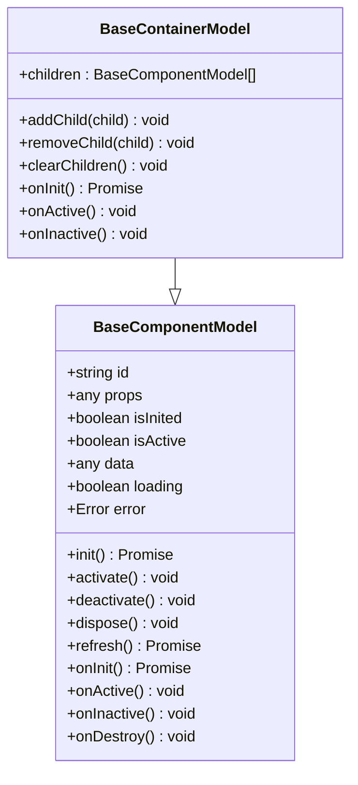
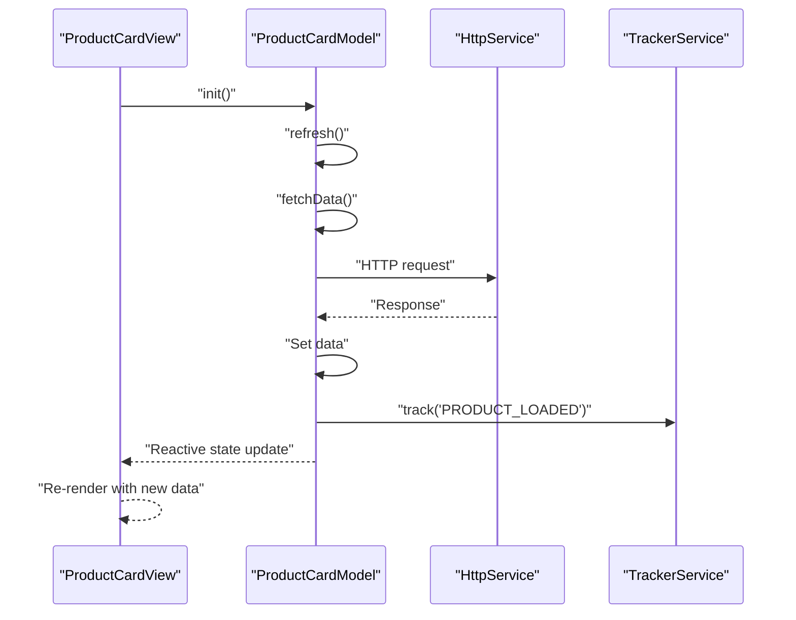
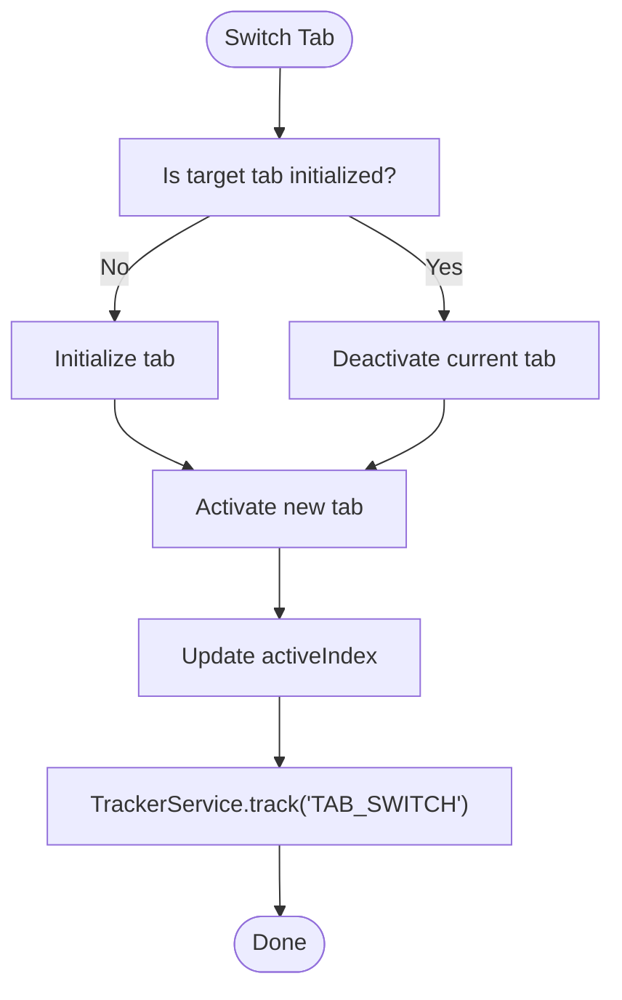
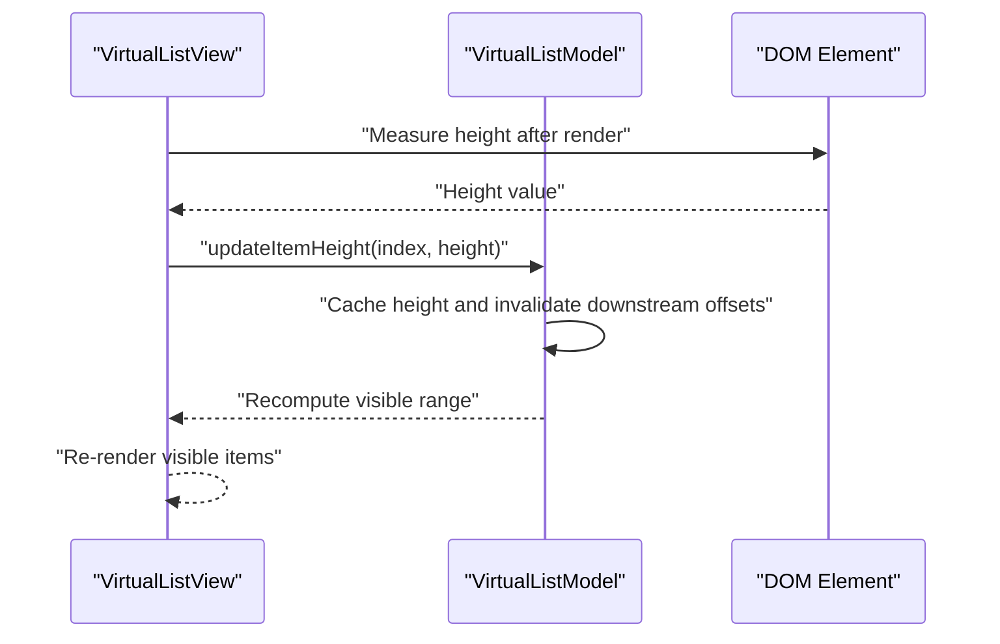
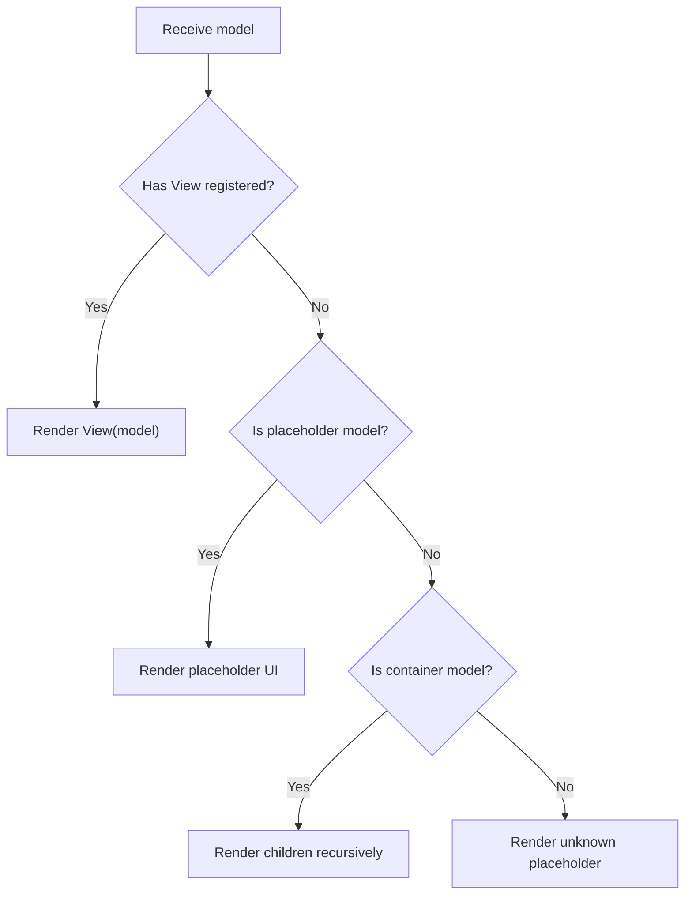
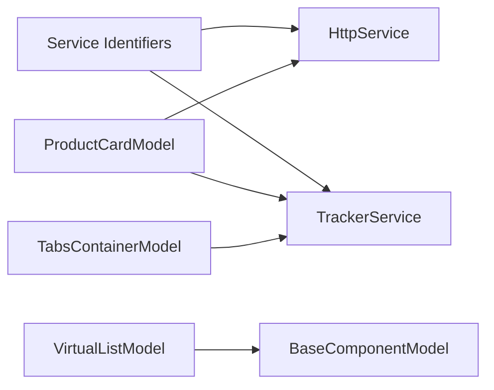

# Model-View Separation

<cite>
**Referenced Files in This Document**
- [README.md](file://packages/h5-builder/README.md)
- [component_development_guide.md](file://packages/h5-builder/docs/component_development_guide.md)
- [faq.md](file://packages/h5-builder/docs/faq.md)
- [model.ts](file://packages/h5-builder/src/bedrock/model.ts)
- [model-renderer.tsx](file://packages/h5-builder/src/components/model-renderer.tsx)
- [product-card.model.ts](file://packages/h5-builder/src/components/product-card/product-card.model.ts)
- [product-card.view.tsx](file://packages/h5-builder/src/components/product-card/product-card.view.tsx)
- [tabs-container.model.ts](file://packages/h5-builder/src/components/tabs-container/tabs-container.model.ts)
- [tabs-container.view.tsx](file://packages/h5-builder/src/components/tabs-container/tabs-container.view.tsx)
- [virtual-list.model.ts](file://packages/h5-builder/src/components/virtual-list/virtual-list.model.ts)
- [virtual-list.view.tsx](file://packages/h5-builder/src/components/virtual-list/virtual-list.view.tsx)
- [http.service.ts](file://packages/h5-builder/src/services/http.service.ts)
- [tracker.service.ts](file://packages/h5-builder/src/services/tracker.service.ts)
- [service-identifiers.ts](file://packages/h5-builder/src/services/service-identifiers.ts)
- [index.ts](file://packages/h5-builder/src/placeholder/index.ts)
</cite>

## Table of Contents
1. [Introduction](#introduction)
2. [Project Structure](#project-structure)
3. [Core Components](#core-components)
4. [Architecture Overview](#architecture-overview)
5. [Detailed Component Analysis](#detailed-component-analysis)
6. [Dependency Analysis](#dependency-analysis)
7. [Performance Considerations](#performance-considerations)
8. [Troubleshooting Guide](#troubleshooting-guide)
9. [Conclusion](#conclusion)
10. [Appendices](#appendices)

## Introduction
This document explains the Model-View separation pattern in the H5 Builder framework. It describes how View components communicate with Models by invoking Model methods, while Models update their reactive state to trigger automatic View re-renders through the observer pattern. It also enforces architectural constraints:
- Models must not contain DOM operations or JSX.
- Views must not directly call infrastructure services like HttpService.
Proper separation is demonstrated by showing how DOM manipulation is handled through state changes in the View and how business logic with service calls is encapsulated within Models. References to BaseComponentModel and ModelRenderer illustrate the framework’s enforcement of this pattern.

## Project Structure
The H5 Builder framework organizes components into Model and View pairs, with a renderer mapping models to views and placeholder models for loading/error/empty states. Services are injected into Models via dependency injection, keeping Views free of infrastructure concerns.

**Diagram sources**
- [model.ts](file://packages/h5-builder/src/bedrock/model.ts#L1-L243)
- [model-renderer.tsx](file://packages/h5-builder/src/components/model-renderer.tsx#L1-L105)
- [product-card.model.ts](file://packages/h5-builder/src/components/product-card/product-card.model.ts#L1-L133)
- [product-card.view.tsx](file://packages/h5-builder/src/components/product-card/product-card.view.tsx#L1-L81)
- [tabs-container.model.ts](file://packages/h5-builder/src/components/tabs-container/tabs-container.model.ts#L1-L273)
- [tabs-container.view.tsx](file://packages/h5-builder/src/components/tabs-container/tabs-container.view.tsx#L1-L85)
- [virtual-list.model.ts](file://packages/h5-builder/src/components/virtual-list/virtual-list.model.ts#L1-L217)
- [virtual-list.view.tsx](file://packages/h5-builder/src/components/virtual-list/virtual-list.view.tsx#L1-L129)
- [http.service.ts](file://packages/h5-builder/src/services/http.service.ts#L1-L281)
- [tracker.service.ts](file://packages/h5-builder/src/services/tracker.service.ts#L1-L290)
- [service-identifiers.ts](file://packages/h5-builder/src/services/service-identifiers.ts#L1-L20)
- [index.ts](file://packages/h5-builder/src/placeholder/index.ts#L1-L30)

**Section sources**
- [README.md](file://packages/h5-builder/README.md#L160-L215)

## Core Components
- BaseComponentModel: Provides reactive state (isInited, isActive, data, loading, error), lifecycle hooks (onInit, onActive, onInactive, onDestroy), initialization guard, activation/deactivation, and resource registration via a disposable store. It makes the entire instance observable so View observers can react to state changes.
- BaseContainerModel: Extends BaseComponentModel to manage child models, initializing, activating, and deactivating them automatically, and cleaning up on destruction.
- ModelRenderer: A registry-driven renderer that maps Model classes to View components and renders placeholders for error/loading/empty states. It also renders containers by iterating children.

These components enforce the separation by ensuring Models remain pure business logic/state holders and Views remain pure renderers.

**Section sources**
- [model.ts](file://packages/h5-builder/src/bedrock/model.ts#L1-L243)
- [model-renderer.tsx](file://packages/h5-builder/src/components/model-renderer.tsx#L1-L105)

## Architecture Overview
The framework enforces Model-View separation through:
- Reactive state in Models: observable properties drive View re-renders.
- Observer pattern in Views: observer HOC ensures fine-grained reactivity.
- Service injection into Models: Views do not call services directly.
- Renderer mapping: ModelRenderer decides which View to render for a given Model.

**Diagram sources**
- [product-card.view.tsx](file://packages/h5-builder/src/components/product-card/product-card.view.tsx#L1-L81)
- [product-card.model.ts](file://packages/h5-builder/src/components/product-card/product-card.model.ts#L1-L133)
- [http.service.ts](file://packages/h5-builder/src/services/http.service.ts#L1-L281)
- [model.ts](file://packages/h5-builder/src/bedrock/model.ts#L1-L243)

## Detailed Component Analysis

### BaseComponentModel and BaseContainerModel
- BaseComponentModel:
  - Reactive state: isInited, isActive, data, loading, error.
  - Lifecycle: init(), activate(), deactivate(), dispose().
  - Utility: register() for resource cleanup; onInit/onActive/onInactive/onDestroy hooks.
  - Observability: constructor wraps the instance with observable to enable observer-driven reactivity.
- BaseContainerModel:
  - Manages children: addChild(), removeChild(), clearChildren().
  - Default behaviors: parallel init of children, activate/deactivate all children.
  - Override points: customize initialization, activation, and deactivation strategies.

**Diagram sources**
- [model.ts](file://packages/h5-builder/src/bedrock/model.ts#L1-L243)

**Section sources**
- [model.ts](file://packages/h5-builder/src/bedrock/model.ts#L1-L243)

### Product Card: Model-View Pair
- ProductCardModel:
  - Inherits BaseComponentModel and holds reactive state (data, loading, error).
  - Implements onInit() to refresh data and fetchData() to simulate network calls and update state.
  - Exposes methods like handleClick() and computed getters (shouldShowPrice, formattedPrice).
  - Uses DI to inject HttpService and TrackerService for business logic and analytics.
- ProductCardView:
  - Pure UI component using observer HOC.
  - Renders loading/error states and delegates user interactions to model.handleClick().
  - Reads model state and computed properties to render content.

**Diagram sources**
- [product-card.model.ts](file://packages/h5-builder/src/components/product-card/product-card.model.ts#L1-L133)
- [product-card.view.tsx](file://packages/h5-builder/src/components/product-card/product-card.view.tsx#L1-L81)
- [http.service.ts](file://packages/h5-builder/src/services/http.service.ts#L1-L281)
- [tracker.service.ts](file://packages/h5-builder/src/services/tracker.service.ts#L1-L290)

**Section sources**
- [product-card.model.ts](file://packages/h5-builder/src/components/product-card/product-card.model.ts#L1-L133)
- [product-card.view.tsx](file://packages/h5-builder/src/components/product-card/product-card.view.tsx#L1-L81)
- [service-identifiers.ts](file://packages/h5-builder/src/services/service-identifiers.ts#L1-L20)

### Tabs Container: Container Model with Virtual Scroll
- TabsContainerModel:
  - Extends BaseContainerModel to manage child tabs.
  - Detects virtual scroll thresholds and enables VirtualListModel for eligible tabs.
  - Switches tabs lazily, activates/deactivates children, and schedules pre-warming.
  - Tracks tab switching and virtual scroll usage.
- TabsContainerView:
  - Renders tab headers and content panels.
  - Uses ModelRenderer for non-virtual tabs and VirtualListView for virtual tabs.

**Diagram sources**
- [tabs-container.model.ts](file://packages/h5-builder/src/components/tabs-container/tabs-container.model.ts#L1-L273)
- [tabs-container.view.tsx](file://packages/h5-builder/src/components/tabs-container/tabs-container.view.tsx#L1-L85)
- [virtual-list.model.ts](file://packages/h5-builder/src/components/virtual-list/virtual-list.model.ts#L1-L217)
- [virtual-list.view.tsx](file://packages/h5-builder/src/components/virtual-list/virtual-list.view.tsx#L1-L129)

**Section sources**
- [tabs-container.model.ts](file://packages/h5-builder/src/components/tabs-container/tabs-container.model.ts#L1-L273)
- [tabs-container.view.tsx](file://packages/h5-builder/src/components/tabs-container/tabs-container.view.tsx#L1-L85)

### Virtual List: Dynamic Height Measurement and Scrolling
- VirtualListModel:
  - Maintains scrollTop, items, and caches for heights and offsets.
  - Computes visible range and total height; exposes methods to update item heights.
- VirtualListView:
  - Measures item heights using requestAnimationFrame and ResizeObserver.
  - Notifies VirtualListModel of height changes and scrolls to update model state.

**Diagram sources**
- [virtual-list.model.ts](file://packages/h5-builder/src/components/virtual-list/virtual-list.model.ts#L1-L217)
- [virtual-list.view.tsx](file://packages/h5-builder/src/components/virtual-list/virtual-list.view.tsx#L1-L129)

**Section sources**
- [virtual-list.model.ts](file://packages/h5-builder/src/components/virtual-list/virtual-list.model.ts#L1-L217)
- [virtual-list.view.tsx](file://packages/h5-builder/src/components/virtual-list/virtual-list.view.tsx#L1-L129)

### ModelRenderer: Model-View Mapping and Placeholders
- Registers Model-View mappings and falls back to placeholder models for error/loading/empty states.
- For BaseContainerModel instances without a registered View, it renders children recursively.

**Diagram sources**
- [model-renderer.tsx](file://packages/h5-builder/src/components/model-renderer.tsx#L1-L105)
- [index.ts](file://packages/h5-builder/src/placeholder/index.ts#L1-L30)

**Section sources**
- [model-renderer.tsx](file://packages/h5-builder/src/components/model-renderer.tsx#L1-L105)
- [index.ts](file://packages/h5-builder/src/placeholder/index.ts#L1-L30)

## Dependency Analysis
- Service Injection:
  - Models receive services via constructor parameters decorated with identifiers (e.g., IHttpService, ITrackerService).
  - HttpService provides request/response/error interceptors and integrates with BridgeService for transport.
  - TrackerService batches and flushes analytics events via BridgeService.
- Coupling and Cohesion:
  - Models encapsulate business logic and state; Views depend only on model props and methods.
  - ModelRenderer decouples rendering from component logic, enabling reuse and testability.
- External Dependencies:
  - mobx-vue-lite observer is used in Views to subscribe to model changes.
  - DI decorators and container are used to instantiate Models with services.

**Diagram sources**
- [service-identifiers.ts](file://packages/h5-builder/src/services/service-identifiers.ts#L1-L20)
- [http.service.ts](file://packages/h5-builder/src/services/http.service.ts#L1-L281)
- [tracker.service.ts](file://packages/h5-builder/src/services/tracker.service.ts#L1-L290)
- [product-card.model.ts](file://packages/h5-builder/src/components/product-card/product-card.model.ts#L1-L133)
- [tabs-container.model.ts](file://packages/h5-builder/src/components/tabs-container/tabs-container.model.ts#L1-L273)
- [virtual-list.model.ts](file://packages/h5-builder/src/components/virtual-list/virtual-list.model.ts#L1-L217)
- [model.ts](file://packages/h5-builder/src/bedrock/model.ts#L1-L243)

**Section sources**
- [service-identifiers.ts](file://packages/h5-builder/src/services/service-identifiers.ts#L1-L20)
- [http.service.ts](file://packages/h5-builder/src/services/http.service.ts#L1-L281)
- [tracker.service.ts](file://packages/h5-builder/src/services/tracker.service.ts#L1-L290)
- [product-card.model.ts](file://packages/h5-builder/src/components/product-card/product-card.model.ts#L1-L133)
- [tabs-container.model.ts](file://packages/h5-builder/src/components/tabs-container/tabs-container.model.ts#L1-L273)
- [virtual-list.model.ts](file://packages/h5-builder/src/components/virtual-list/virtual-list.model.ts#L1-L217)
- [model.ts](file://packages/h5-builder/src/bedrock/model.ts#L1-L243)

## Performance Considerations
- Fine-grained reactivity: observer HOC ensures only affected components re-render when observable properties change.
- Virtual scrolling: TabsContainerModel can enable VirtualListModel for large lists, reducing DOM nodes and improving scroll performance.
- Lazy initialization and pre-warming: TabsContainerModel initializes the active tab immediately and pre-warms neighbors to reduce perceived latency.
- Computed properties: Models expose derived values (e.g., formatted prices) to minimize recomputation and keep Views lean.

[No sources needed since this section provides general guidance]

## Troubleshooting Guide
Common issues and resolutions:
- State not updating in View:
  - Ensure properties are declared as reactive members of the Model (public fields) and are mutated directly.
- Memory leaks:
  - Register timers, subscriptions, and listeners using register() to ensure cleanup on dispose().
- View calling services directly:
  - Move service calls into Model methods and expose actions to Views.
- Unknown component type in ModelRenderer:
  - Register the Model-View mapping or ensure the model is a placeholder or container.

**Section sources**
- [component_development_guide.md](file://packages/h5-builder/docs/component_development_guide.md#L310-L403)
- [faq.md](file://packages/h5-builder/docs/faq.md#L49-L120)
- [model-renderer.tsx](file://packages/h5-builder/src/components/model-renderer.tsx#L1-L105)

## Conclusion
The H5 Builder framework enforces a strict Model-View separation:
- Models own reactive state and business logic, including service interactions via DI.
- Views are pure renderers that observe model state and call model methods on user interactions.
- The observer pattern ensures automatic, fine-grained re-renders when models update.
- Architectural constraints prevent DOM and JSX in Models and direct service calls in Views, promoting testability, maintainability, and scalability.

[No sources needed since this section summarizes without analyzing specific files]

## Appendices

### Best Practices for Implementation
- Keep Models free of JSX and DOM operations; expose state and computed properties.
- Keep Views free of business logic and service calls; delegate to model methods.
- Use BaseComponentModel for reactive state and lifecycle hooks; use BaseContainerModel for managing children.
- Register Model-View mappings in ModelRenderer for predictable rendering.
- Prefer computed properties in Models for derived UI values.

**Section sources**
- [component_development_guide.md](file://packages/h5-builder/docs/component_development_guide.md#L1-L170)
- [model.ts](file://packages/h5-builder/src/bedrock/model.ts#L1-L243)
- [model-renderer.tsx](file://packages/h5-builder/src/components/model-renderer.tsx#L1-L105)