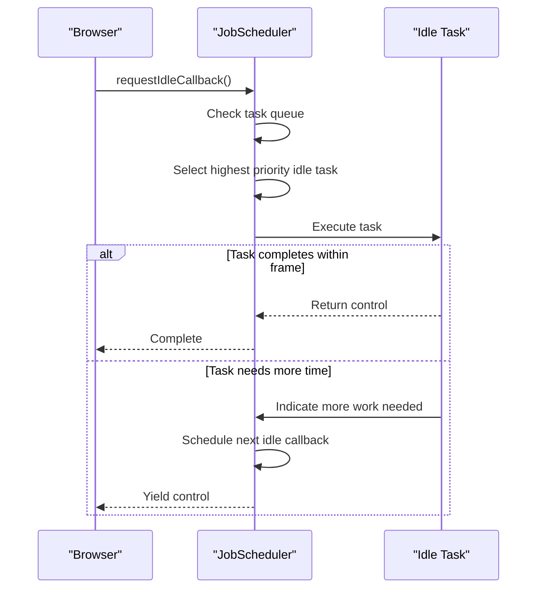
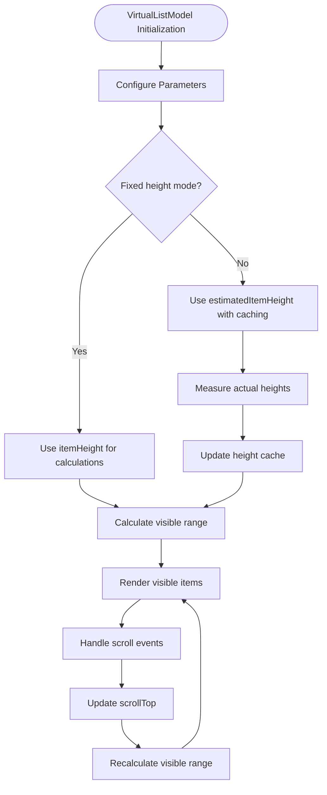
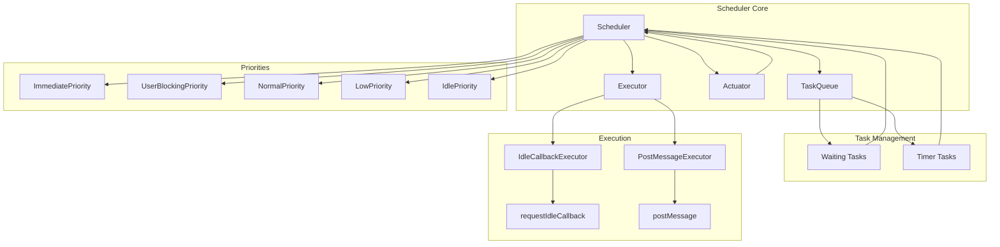

# Performance Optimization

<cite>
**Referenced Files in This Document**   
- [tabs-container.model.ts](file://packages/h5-builder/src/components/tabs-container/tabs-container.model.ts)
- [virtual-list.model.ts](file://packages/h5-builder/src/components/virtual-list/virtual-list.model.ts)
- [virtual-list.view.tsx](file://packages/h5-builder/src/components/virtual-list/virtual-list.view.tsx)
- [auto-virtual-scroll.md](file://packages/h5-builder/docs/auto-virtual-scroll.md)
- [job-scheduler.ts](file://packages/h5-builder/src/bedrock/launch/job-scheduler.ts)
- [scheduler.ts](file://packages/h5-builder/src/bedrock/scheduler/core/scheduler.ts)
- [idle-callback-executor.ts](file://packages/h5-builder/src/bedrock/scheduler/executor/idle-callback-executor.ts)
- [lv-scheduler-config.ts](file://packages/h5-builder/src/bedrock/scheduler/lv-scheduler-config.ts)
- [type.ts](file://packages/h5-builder/src/bedrock/scheduler/type.ts)
</cite>

## Table of Contents
1. [Introduction](#introduction)
2. [Lazy Loading in Container Components](#lazy-loading-in-container-components)
3. [TabsContainerModel Implementation](#tabscontainermodel-implementation)
4. [Idle-Time Processing with JobScheduler](#idle-time-processing-with-jobscheduler)
5. [Long List Optimization with VirtualListModel](#long-list-optimization-with-virtuallistmodel)
6. [VirtualListModel Configuration and Parameters](#virtuallistmodel-configuration-and-parameters)
7. [Complete VirtualListModel Example](#complete-virtuallistmodel-example)
8. [Scheduler System Architecture](#scheduler-system-architecture)
9. [Conclusion](#conclusion)

## Introduction
This document provides comprehensive documentation on performance optimization techniques available in the MobX framework. It covers key strategies including lazy loading implementation in container components, idle-time processing for pre-warming components, and long list optimization using virtualization. The framework employs sophisticated scheduling mechanisms to ensure optimal performance while maintaining a seamless user experience. These techniques are designed to minimize initial load times, reduce memory consumption, and improve responsiveness, particularly in applications with complex component hierarchies and large data sets.

## Lazy Loading in Container Components
The framework implements lazy loading in container components by initializing only the first child component during startup and deferring initialization of other components until they are needed. This approach significantly reduces initial load time and memory usage, particularly in scenarios with multiple tabs or panels where only one is visible at a time.

The lazy loading mechanism works by overriding the default initialization behavior in container components. Instead of initializing all child components immediately, the container initializes only the currently active component. Other components remain in an uninitialized state until explicitly accessed, at which point they are initialized on-demand. This pattern is particularly effective in tabbed interfaces where users typically interact with one tab at a time.

The implementation also includes a pre-warming strategy that uses idle-time processing to gradually initialize non-critical components when the browser is not busy. This ensures that when users eventually navigate to other tabs, the components are already initialized or close to being ready, providing a responsive experience without impacting initial performance.

**Section sources**
- [tabs-container.model.ts](file://packages/h5-builder/src/components/tabs-container/tabs-container.model.ts#L68-L96)

## TabsContainerModel Implementation
The TabsContainerModel implements tab switching with lazy initialization, ensuring optimal performance in tabbed interfaces. The model initializes only the first tab during startup and defers initialization of other tabs until they are selected by the user.

```mermaid
classDiagram
class TabsContainerModel {
+activeIndex : number
+switchTab(index : number) : Promise~void~
+isVirtualScrollEnabled(index : number) : boolean
+getVirtualList(index : number) : VirtualListModel | undefined
+activeTab : BaseContainerModel
-onInit() : Promise~void~
-detectAndEnableVirtualScroll() : void
-enableVirtualScrollForTab(tab : BaseContainerModel, index : number) : void
-schedulePrewarm() : void
-prewarmTab(index : number, delay : number) : void
}
class BaseContainerModel {
+children : BaseComponentModel[]
+isInited : boolean
+init() : Promise~void~
+activate() : void
+deactivate() : void
}
class VirtualListModel {
+scrollTop : number
+items : any[]
+setItems(items : any[]) : void
+handleScroll(scrollTop : number) : void
+startIndex : number
+endIndex : number
+visibleItems : {item : any; index : number; top : number; height : number}[]
+totalHeight : number
}
TabsContainerModel --> BaseContainerModel : "extends"
TabsContainerModel --> VirtualListModel : "uses"
BaseContainerModel --> BaseComponentModel : "extends"
```

**Diagram sources**
- [tabs-container.model.ts](file://packages/h5-builder/src/components/tabs-container/tabs-container.model.ts#L29-L272)

**Section sources**
- [tabs-container.model.ts](file://packages/h5-builder/src/components/tabs-container/tabs-container.model.ts#L29-L272)

## Idle-Time Processing with JobScheduler
The framework provides idle-time processing capabilities through the JobScheduler system, which allows scheduling non-critical work during browser idle periods using `JobScheduler.scheduleIdleTask()`. This ensures that background tasks do not interfere with user interactions or critical rendering operations.

The JobScheduler system leverages the browser's `requestIdleCallback` API when available, with a fallback mechanism for browsers that don't support this feature. The scheduler prioritizes tasks based on their urgency and executes them when the browser determines there is spare time available. This approach allows the framework to perform resource-intensive operations like data pre-fetching, component pre-warming, and cache updates without impacting the user experience.

The implementation includes a sophisticated priority system with multiple levels (Immediate, UserBlocking, Normal, Low, and Idle) that ensures critical tasks are executed promptly while less important tasks are deferred to idle periods. The scheduler also monitors task execution times and can yield control back to the browser if a task is taking too long, preventing jank and maintaining smooth animations.



**Diagram sources**
- [job-scheduler.ts](file://packages/h5-builder/src/bedrock/launch/job-scheduler.ts#L16-L122)
- [idle-callback-executor.ts](file://packages/h5-builder/src/bedrock/scheduler/executor/idle-callback-executor.ts#L12-L98)

**Section sources**
- [job-scheduler.ts](file://packages/h5-builder/src/bedrock/launch/job-scheduler.ts#L16-L122)
- [idle-callback-executor.ts](file://packages/h5-builder/src/bedrock/scheduler/executor/idle-callback-executor.ts#L12-L98)

## Long List Optimization with VirtualListModel
The framework addresses performance challenges with long lists through the VirtualListModel, which implements virtual scrolling to render only visible items and significantly reduce DOM complexity. This approach is essential for maintaining smooth scrolling and responsive interactions when dealing with large data sets.

VirtualListModel works by maintaining a full data set in memory while rendering only the items that are currently visible in the viewport, plus a configurable number of items before and after (overscan). As the user scrolls, the model dynamically updates which items are rendered, recycling DOM elements to minimize creation and destruction costs. This results in a consistent number of DOM nodes regardless of the total data size, ensuring predictable performance.

The implementation supports both fixed-height and dynamic-height items, with the latter using a height estimation and caching mechanism to accurately position items with variable content. The model also includes optimized algorithms for calculating visible ranges, using binary search for dynamic height scenarios to maintain O(log n) complexity even with thousands of items.

**Section sources**
- [virtual-list.model.ts](file://packages/h5-builder/src/components/virtual-list/virtual-list.model.ts#L20-L216)
- [virtual-list.view.tsx](file://packages/h5-builder/src/components/virtual-list/virtual-list.view.tsx#L78-L128)

## VirtualListModel Configuration and Parameters
VirtualListModel provides several configuration parameters to fine-tune performance and user experience:

| Parameter | Type | Default Value | Description |
|---------|------|---------------|-------------|
| `itemHeight` | number | 120 | Fixed height of each item in pixels (for fixed-height mode) |
| `estimatedItemHeight` | number | 120 | Estimated height for dynamic-height items |
| `containerHeight` | number | 600 | Height of the visible container in pixels |
| `overscan` | number | 3 | Number of items to render beyond the visible area for smooth scrolling |

The `itemHeight` parameter is used in fixed-height mode, where all items are assumed to have the same height. This enables the most efficient calculations for visible range determination. The `estimatedItemHeight` parameter is used in dynamic-height mode, where items can have varying heights. The model uses this estimate to position items initially and then refines the positioning as actual heights are measured.

The `containerHeight` parameter defines the visible area of the list, which is essential for determining how many items should be rendered at any given time. The `overscan` parameter controls how many additional items are rendered beyond the visible area, preventing blank spaces during fast scrolling. A higher overscan value improves scrolling smoothness but increases memory usage and initial rendering cost.



**Diagram sources**
- [virtual-list.model.ts](file://packages/h5-builder/src/components/virtual-list/virtual-list.model.ts#L6-L41)
- [virtual-list.view.tsx](file://packages/h5-builder/src/components/virtual-list/virtual-list.view.tsx#L90-L93)

**Section sources**
- [virtual-list.model.ts](file://packages/h5-builder/src/components/virtual-list/virtual-list.model.ts#L6-L41)

## Complete VirtualListModel Example
The following example demonstrates the complete implementation of VirtualListModel, including instantiation, data population, and rendering with VirtualListView:

```mermaid
classDiagram
class VirtualListModel {
+scrollTop : number
+items : any[]
+props : VirtualListProps
+setItems(items : any[]) : void
+handleScroll(scrollTop : number) : void
+startIndex : number
+endIndex : number
+visibleItems : {item : any; index : number; top : number; height : number}[]
+totalHeight : number
}
class VirtualListView {
+model : VirtualListModel
+renderItem : (item : any, index : number) => React.ReactNode
+containerRef : Ref~HTMLDivElement~
+handleScroll(e : React.UIEvent~HTMLDivElement~) : void
+paddingTop : number
+paddingBottom : number
}
class VirtualListItem {
+model : VirtualListModel
+item : any
+index : number
+top : number
+height : number
+renderItem : (item : any, index : number) => React.ReactNode
+itemRef : Ref~HTMLDivElement~
+useEffect() : void
}
VirtualListView --> VirtualListModel : "uses"
VirtualListView --> VirtualListItem : "renders"
VirtualListItem --> VirtualListModel : "updates height"
```

**Diagram sources**
- [virtual-list.model.ts](file://packages/h5-builder/src/components/virtual-list/virtual-list.model.ts#L20-L216)
- [virtual-list.view.tsx](file://packages/h5-builder/src/components/virtual-list/virtual-list.view.tsx#L78-L128)

**Section sources**
- [virtual-list.model.ts](file://packages/h5-builder/src/components/virtual-list/virtual-list.model.ts#L20-L216)
- [virtual-list.view.tsx](file://packages/h5-builder/src/components/virtual-list/virtual-list.view.tsx#L78-L128)

## Scheduler System Architecture
The scheduler system forms the foundation of the framework's performance optimization capabilities, providing a robust infrastructure for managing task execution and resource allocation. The architecture is designed around a priority-based scheduling mechanism that ensures critical operations are executed promptly while non-critical work is deferred to idle periods.



The system consists of several key components: the Scheduler, which manages the overall task execution; the TaskQueue, which prioritizes and organizes tasks; the Actuator, which processes tasks in chunks to avoid blocking the main thread; and the Executor, which interfaces with the browser's event loop. The architecture supports multiple execution strategies, including idle callbacks for background work and immediate execution for critical operations.

The scheduler uses a combination of deadline-based and priority-based scheduling to determine when tasks should be executed. It monitors the browser's idle periods and yields control back to the main thread when necessary to maintain smooth animations and responsive interactions. This sophisticated architecture enables the framework to balance performance optimization with user experience requirements.

**Diagram sources**
- [scheduler.ts](file://packages/h5-builder/src/bedrock/scheduler/core/scheduler.ts#L24-L173)
- [type.ts](file://packages/h5-builder/src/bedrock/scheduler/type.ts#L2-L13)
- [lv-scheduler-config.ts](file://packages/h5-builder/src/bedrock/scheduler/lv-scheduler-config.ts#L4-L17)

**Section sources**
- [scheduler.ts](file://packages/h5-builder/src/bedrock/scheduler/core/scheduler.ts#L24-L173)
- [type.ts](file://packages/h5-builder/src/bedrock/scheduler/type.ts#L2-L13)
- [lv-scheduler-config.ts](file://packages/h5-builder/src/bedrock/scheduler/lv-scheduler-config.ts#L4-L17)

## Conclusion
The MobX framework provides a comprehensive suite of performance optimization techniques that address common challenges in modern web applications. Through lazy loading, idle-time processing, and virtual scrolling, the framework enables developers to build highly performant applications that scale gracefully with data size and complexity.

The lazy loading implementation in container components significantly reduces initial load times by initializing only essential components and deferring others until needed. The JobScheduler system leverages browser idle periods to perform non-critical work without impacting user experience. The VirtualListModel provides an efficient solution for rendering long lists, maintaining smooth scrolling performance regardless of data size.

These optimizations are designed to work together seamlessly, with the underlying scheduler architecture providing a unified foundation for task management and execution. By following the patterns and practices documented here, developers can create applications that are both highly performant and maintainable, delivering excellent user experiences even in demanding scenarios.