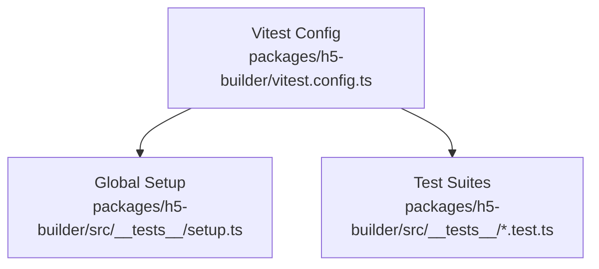
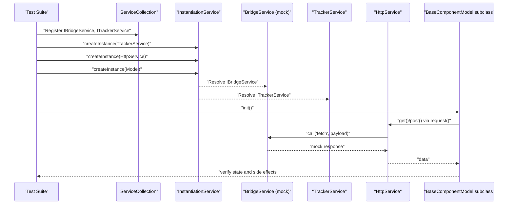
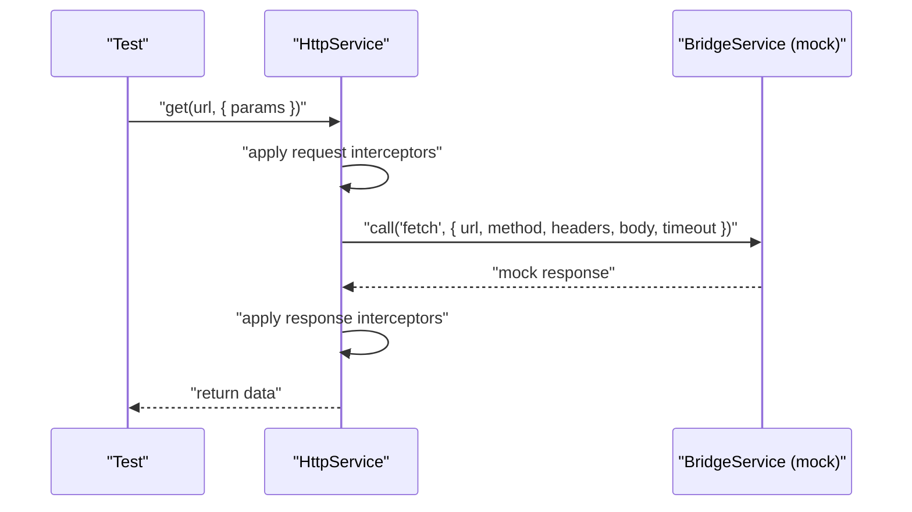
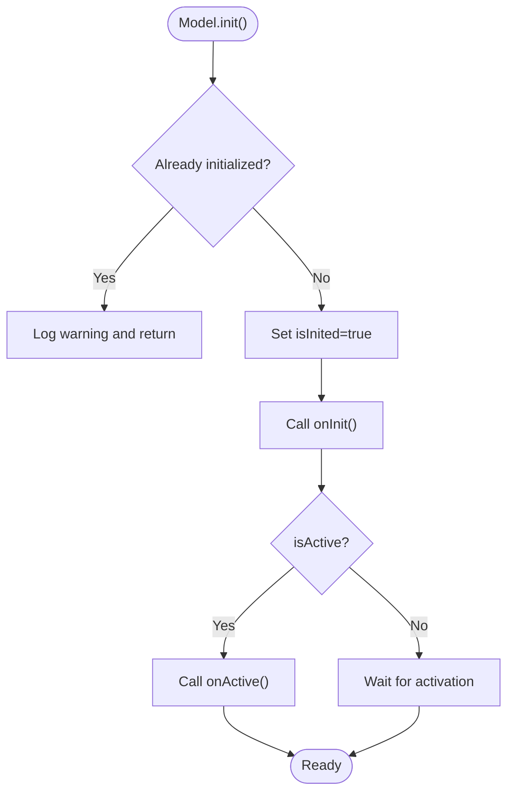
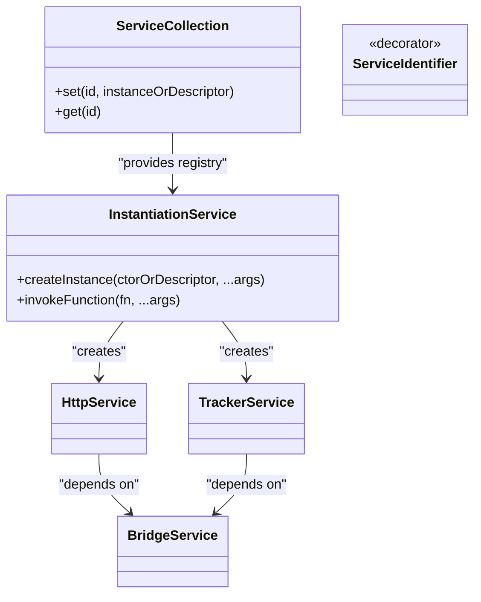
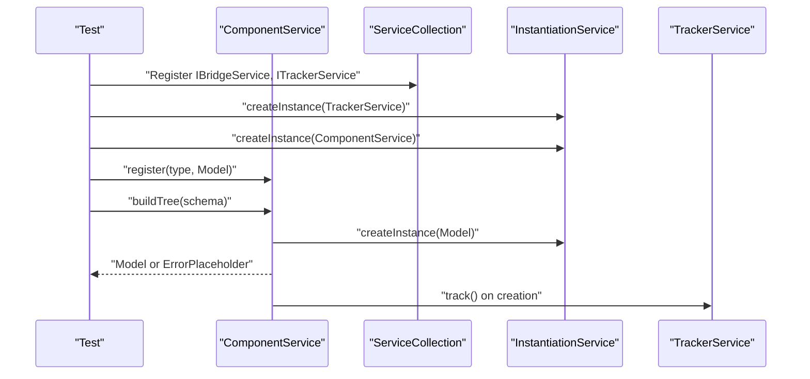
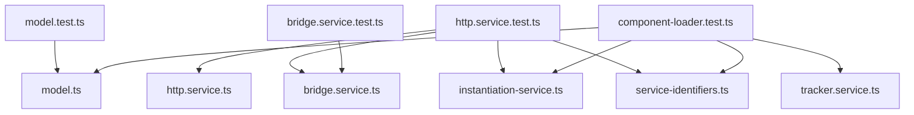

# Testing

<cite>
**Referenced Files in This Document**
- [vitest.config.ts](file://packages/h5-builder/vitest.config.ts)
- [setup.ts](file://packages/h5-builder/src/__tests__/setup.ts)
- [model.test.ts](file://packages/h5-builder/src/__tests__/model.test.ts)
- [http.service.test.ts](file://packages/h5-builder/src/__tests__/http.service.test.ts)
- [bridge.service.test.ts](file://packages/h5-builder/src/__tests__/bridge.service.test.ts)
- [component-loader.test.ts](file://packages/h5-builder/src/__tests__/component-loader.test.ts)
- [http.service.ts](file://packages/h5-builder/src/services/http.service.ts)
- [bridge.service.ts](file://packages/h5-builder/src/services/bridge.service.ts)
- [tracker.service.ts](file://packages/h5-builder/src/services/tracker.service.ts)
- [model.ts](file://packages/h5-builder/src/bedrock/model.ts)
- [instantiation-service.ts](file://packages/h5-builder/src/bedrock/di/instantiation-service.ts)
- [index.common.ts](file://packages/h5-builder/src/bedrock/di/index.common.ts)
- [service-identifiers.ts](file://packages/h5-builder/src/services/service-identifiers.ts)
- [product-card.model.ts](file://packages/h5-builder/src/components/product-card/product-card.model.ts)
- [simple-list.model.ts](file://packages/h5-builder/src/components/simple-list/simple-list.model.ts)
</cite>

## Table of Contents
1. [Introduction](#introduction)
2. [Project Structure](#project-structure)
3. [Core Components](#core-components)
4. [Architecture Overview](#architecture-overview)
5. [Detailed Component Analysis](#detailed-component-analysis)
6. [Dependency Analysis](#dependency-analysis)
7. [Performance Considerations](#performance-considerations)
8. [Troubleshooting Guide](#troubleshooting-guide)
9. [Conclusion](#conclusion)
10. [Appendices](#appendices)

## Introduction
This document provides comprehensive testing guidance for H5 Builder components using Vitest. It focuses on:
- How to test Models using Vitest, including setting up test environments with Injector instances and registering mock services for dependency injection.
- Creating a complete example test suite that initializes a Model with mocked dependencies and verifies behavior such as data loading during initialization.
- Creating mock services using vi.fn() for methods like HttpService.get() and HttpService.post(), and registering these mocks with the Injector.
- Best practices for test isolation, setup/teardown patterns using beforeEach, and assertion strategies.
- Alignment with the existing test files in the __tests__ directory and the project’s Vitest configuration.

## Project Structure
H5 Builder uses Vitest with happy-dom as the test environment and a setup file for global test utilities. The configuration enables:
- Global test environment setup
- Aliasing for module resolution
- Coverage reporting

**Diagram sources**
- [vitest.config.ts](file://packages/h5-builder/vitest.config.ts#L1-L28)
- [setup.ts](file://packages/h5-builder/src/__tests__/setup.ts#L1-L2)

**Section sources**
- [vitest.config.ts](file://packages/h5-builder/vitest.config.ts#L1-L28)
- [setup.ts](file://packages/h5-builder/src/__tests__/setup.ts#L1-L2)

## Core Components
This section outlines the core testing patterns used across the H5 Builder codebase:
- DI-based service instantiation using ServiceCollection and InstantiationService
- Service identifiers for dependency injection
- BridgeService mock mode for deterministic network-like behavior
- HttpService request/response interception and cancellation
- BaseComponentModel and BaseContainerModel lifecycle testing

Key references:
- DI infrastructure and service collection
- Service identifiers
- BridgeService mock mode and helpers
- HttpService request pipeline and interceptors
- Model lifecycle and resource management

**Section sources**
- [instantiation-service.ts](file://packages/h5-builder/src/bedrock/di/instantiation-service.ts#L1-L468)
- [index.common.ts](file://packages/h5-builder/src/bedrock/di/index.common.ts#L1-L29)
- [service-identifiers.ts](file://packages/h5-builder/src/services/service-identifiers.ts#L1-L20)
- [bridge.service.ts](file://packages/h5-builder/src/services/bridge.service.ts#L1-L227)
- [http.service.ts](file://packages/h5-builder/src/services/http.service.ts#L1-L281)
- [model.ts](file://packages/h5-builder/src/bedrock/model.ts#L1-L243)

## Architecture Overview
The testing architecture centers around DI-driven service instantiation and deterministic mocking. The sequence below illustrates how a Model under test receives mocked dependencies via the DI container and executes lifecycle hooks.

**Diagram sources**
- [http.service.test.ts](file://packages/h5-builder/src/__tests__/http.service.test.ts#L1-L252)
- [component-loader.test.ts](file://packages/h5-builder/src/__tests__/component-loader.test.ts#L1-L271)
- [http.service.ts](file://packages/h5-builder/src/services/http.service.ts#L1-L281)
- [bridge.service.ts](file://packages/h5-builder/src/services/bridge.service.ts#L1-L227)
- [tracker.service.ts](file://packages/h5-builder/src/services/tracker.service.ts#L1-L290)
- [model.ts](file://packages/h5-builder/src/bedrock/model.ts#L1-L243)

## Detailed Component Analysis

### Testing Models with Vitest and DI
This section demonstrates how to test Models using Vitest with DI and mock services.

- Test environment setup
  - Vitest config sets globals and happy-dom environment.
  - Global setup registers jest-dom matchers.

- DI setup for tests
  - Create a ServiceCollection and register IBridgeService and ITrackerService.
  - Instantiate InstantiationService and create services like TrackerService.
  - Create the Model under test via InstantiationService.createInstance.

- Mocking services
  - Use vi.fn() to mock methods like HttpService.get() and HttpService.post().
  - Register mocks in the DI container by replacing IBridgeService with a mock BridgeService instance.

- Lifecycle and data loading verification
  - Initialize the Model and assert state transitions (isInited, isActive).
  - Verify data loading behavior by asserting onInit and refresh flows.
  - Use fake timers for timing-sensitive tests.

- Example patterns
  - See the model lifecycle tests for initialization, activation, disposal, and resource cleanup.
  - See the component loader tests for DI-driven component building and error handling.

Best practices:
- Use beforeEach to isolate tests and reset spies/timers.
- Use vi.useFakeTimers()/vi.useRealTimers() around timer-dependent tests.
- Assert on reactive state changes and lifecycle hooks.
- Mock only what is necessary; prefer BridgeService mock mode for network-like behavior.

**Section sources**
- [vitest.config.ts](file://packages/h5-builder/vitest.config.ts#L1-L28)
- [setup.ts](file://packages/h5-builder/src/__tests__/setup.ts#L1-L2)
- [model.test.ts](file://packages/h5-builder/src/__tests__/model.test.ts#L1-L231)
- [component-loader.test.ts](file://packages/h5-builder/src/__tests__/component-loader.test.ts#L1-L271)
- [instantiation-service.ts](file://packages/h5-builder/src/bedrock/di/instantiation-service.ts#L1-L468)
- [index.common.ts](file://packages/h5-builder/src/bedrock/di/index.common.ts#L1-L29)
- [service-identifiers.ts](file://packages/h5-builder/src/services/service-identifiers.ts#L1-L20)

### HttpService Testing Patterns
HttpService relies on BridgeService for network calls and supports request/response/error interceptors and cancellation. The test suite demonstrates:
- Basic GET/POST/PUT/DELETE requests with BridgeService mock responses.
- Query parameter appending and interceptor execution.
- Error handling with error interceptors and rejection propagation.
- Request cancellation and disposal behavior.

Recommended testing approach:
- Use BridgeService in mock mode to control responses.
- Spy on bridge.call to verify URL/header/body construction.
- Add interceptors and assert their execution order and transformations.
- Cancel pending requests and verify cleanup.

**Diagram sources**
- [http.service.ts](file://packages/h5-builder/src/services/http.service.ts#L1-L281)
- [bridge.service.ts](file://packages/h5-builder/src/services/bridge.service.ts#L1-L227)
- [http.service.test.ts](file://packages/h5-builder/src/__tests__/http.service.test.ts#L1-L252)

**Section sources**
- [http.service.ts](file://packages/h5-builder/src/services/http.service.ts#L1-L281)
- [http.service.test.ts](file://packages/h5-builder/src/__tests__/http.service.test.ts#L1-L252)

### BridgeService Testing Patterns
BridgeService provides a unified interface for native bridge calls and supports mock mode for browser testing. The test suite covers:
- Mock mode responses and batch configuration.
- Native mode invocation with window.NativeBridge.
- Timeout handling and error propagation.
- Helpers for common operations (getUserInfo, toast, navigate, share).

Testing tips:
- Clear window.NativeBridge before each test to ensure mock mode.
- Use setMockResponse/setMockResponses to simulate backend behavior.
- Assert on helper methods and their underlying bridge.call invocations.

**Section sources**
- [bridge.service.ts](file://packages/h5-builder/src/services/bridge.service.ts#L1-L227)
- [bridge.service.test.ts](file://packages/h5-builder/src/__tests__/bridge.service.test.ts#L1-L132)

### Model Lifecycle and Resource Management
BaseComponentModel and BaseContainerModel provide lifecycle hooks and resource management. The test suite validates:
- Initialization guard and state transitions.
- Activation/deactivation behavior.
- Dispose behavior and resource cleanup in LIFO order.
- Timer cleanup and fake timers usage.
- Reactive state updates.

**Diagram sources**
- [model.ts](file://packages/h5-builder/src/bedrock/model.ts#L1-L243)
- [model.test.ts](file://packages/h5-builder/src/__tests__/model.test.ts#L1-L231)

**Section sources**
- [model.ts](file://packages/h5-builder/src/bedrock/model.ts#L1-L243)
- [model.test.ts](file://packages/h5-builder/src/__tests__/model.test.ts#L1-L231)

### DI Container and Service Identifiers
The DI system enables decoupled testing by allowing services to be replaced with mocks. Key elements:
- ServiceCollection for registration.
- InstantiationService for creating instances and resolving dependencies.
- Service identifiers created via createDecorator for type-safe injection.
- Lazy services and tracing support.

**Diagram sources**
- [instantiation-service.ts](file://packages/h5-builder/src/bedrock/di/instantiation-service.ts#L1-L468)
- [index.common.ts](file://packages/h5-builder/src/bedrock/di/index.common.ts#L1-L29)
- [service-identifiers.ts](file://packages/h5-builder/src/services/service-identifiers.ts#L1-L20)
- [http.service.ts](file://packages/h5-builder/src/services/http.service.ts#L1-L281)
- [tracker.service.ts](file://packages/h5-builder/src/services/tracker.service.ts#L1-L290)
- [bridge.service.ts](file://packages/h5-builder/src/services/bridge.service.ts#L1-L227)

**Section sources**
- [instantiation-service.ts](file://packages/h5-builder/src/bedrock/di/instantiation-service.ts#L1-L468)
- [index.common.ts](file://packages/h5-builder/src/bedrock/di/index.common.ts#L1-L29)
- [service-identifiers.ts](file://packages/h5-builder/src/services/service-identifiers.ts#L1-L20)

### Component Loader and DI Integration
The component loader demonstrates DI-driven component building and error handling:
- Register components and build trees from schemas.
- Validate schemas and handle missing or invalid entries.
- Track component creation via TrackerService.

**Diagram sources**
- [component-loader.test.ts](file://packages/h5-builder/src/__tests__/component-loader.test.ts#L1-L271)
- [tracker.service.ts](file://packages/h5-builder/src/services/tracker.service.ts#L1-L290)

**Section sources**
- [component-loader.test.ts](file://packages/h5-builder/src/__tests__/component-loader.test.ts#L1-L271)
- [simple-list.model.ts](file://packages/h5-builder/src/components/simple-list/simple-list.model.ts#L1-L16)

## Dependency Analysis
This section analyzes how testing components depend on each other and external systems.

**Diagram sources**
- [model.test.ts](file://packages/h5-builder/src/__tests__/model.test.ts#L1-L231)
- [http.service.test.ts](file://packages/h5-builder/src/__tests__/http.service.test.ts#L1-L252)
- [bridge.service.test.ts](file://packages/h5-builder/src/__tests__/bridge.service.test.ts#L1-L132)
- [component-loader.test.ts](file://packages/h5-builder/src/__tests__/component-loader.test.ts#L1-L271)
- [model.ts](file://packages/h5-builder/src/bedrock/model.ts#L1-L243)
- [http.service.ts](file://packages/h5-builder/src/services/http.service.ts#L1-L281)
- [bridge.service.ts](file://packages/h5-builder/src/services/bridge.service.ts#L1-L227)
- [tracker.service.ts](file://packages/h5-builder/src/services/tracker.service.ts#L1-L290)
- [instantiation-service.ts](file://packages/h5-builder/src/bedrock/di/instantiation-service.ts#L1-L468)
- [service-identifiers.ts](file://packages/h5-builder/src/services/service-identifiers.ts#L1-L20)

**Section sources**
- [model.test.ts](file://packages/h5-builder/src/__tests__/model.test.ts#L1-L231)
- [http.service.test.ts](file://packages/h5-builder/src/__tests__/http.service.test.ts#L1-L252)
- [bridge.service.test.ts](file://packages/h5-builder/src/__tests__/bridge.service.test.ts#L1-L132)
- [component-loader.test.ts](file://packages/h5-builder/src/__tests__/component-loader.test.ts#L1-L271)

## Performance Considerations
- Prefer mock services to avoid real network calls and reduce flakiness.
- Use fake timers for time-based tests to keep them deterministic.
- Minimize heavy asynchronous operations in tests; use small timeouts and controlled delays.
- Avoid unnecessary re-instantiation of services; reuse DI containers across tests when appropriate.

## Troubleshooting Guide
Common issues and resolutions:
- Missing service dependencies
  - Symptom: Instantiation errors indicating unknown dependencies.
  - Resolution: Ensure all required services are registered in ServiceCollection before creating instances.

- BridgeService native bridge not available
  - Symptom: Errors about NativeBridge not available.
  - Resolution: Use BridgeService in mock mode or set window.NativeBridge before tests.

- Timer-related flakiness
  - Symptom: Tests depending on intervals or timeouts fail intermittently.
  - Resolution: Use vi.useFakeTimers() and advance timers explicitly; restore with vi.useRealTimers().

- Spies not restored
  - Symptom: Console warnings about duplicate spies.
  - Resolution: Always restore spies after use (e.g., console.warn mock).

**Section sources**
- [http.service.test.ts](file://packages/h5-builder/src/__tests__/http.service.test.ts#L1-L252)
- [bridge.service.test.ts](file://packages/h5-builder/src/__tests__/bridge.service.test.ts#L1-L132)
- [model.test.ts](file://packages/h5-builder/src/__tests__/model.test.ts#L1-L231)

## Conclusion
H5 Builder’s testing approach leverages Vitest with DI and mock services to create reliable, isolated tests. By following the patterns demonstrated in the existing test suites—DI setup, BridgeService mock mode, HttpService interceptors, and Model lifecycle assertions—you can confidently test Models and services. Use beforeEach for setup, vi.fn() for spies, and fake timers for time-sensitive logic to achieve deterministic and maintainable tests.

## Appendices

### Complete Example Test Suite Outline
Below is a structured outline for a Model test suite that initializes a Model with mocked dependencies and verifies data loading behavior:

- Environment setup
  - Configure Vitest and happy-dom.
  - Import global setup for jest-dom matchers.

- DI setup
  - Create ServiceCollection and register IBridgeService and ITrackerService.
  - Instantiate InstantiationService and create services.
  - Create the Model under test via InstantiationService.createInstance.

- Mocking
  - Replace IBridgeService with a mock BridgeService instance.
  - Mock bridge.call to return controlled responses for fetch.

- Lifecycle tests
  - Verify initialization guard and state transitions.
  - Assert onInit and refresh flows; verify reactive state updates.

- Data loading tests
  - Simulate async data loading and assert on data assignment.
  - Verify side effects (e.g., tracker events).

- Cleanup and disposal
  - Assert dispose behavior and resource cleanup.
  - Verify timers and interceptors are cleared.

- Assertions and strategies
  - Use expect assertions for state and side effects.
  - Spy on methods to verify calls and parameters.
  - Use fake timers for deterministic timing.

**Section sources**
- [vitest.config.ts](file://packages/h5-builder/vitest.config.ts#L1-L28)
- [setup.ts](file://packages/h5-builder/src/__tests__/setup.ts#L1-L2)
- [component-loader.test.ts](file://packages/h5-builder/src/__tests__/component-loader.test.ts#L1-L271)
- [http.service.test.ts](file://packages/h5-builder/src/__tests__/http.service.test.ts#L1-L252)
- [bridge.service.test.ts](file://packages/h5-builder/src/__tests__/bridge.service.test.ts#L1-L132)
- [model.test.ts](file://packages/h5-builder/src/__tests__/model.test.ts#L1-L231)
- [product-card.model.ts](file://packages/h5-builder/src/components/product-card/product-card.model.ts#L1-L133)