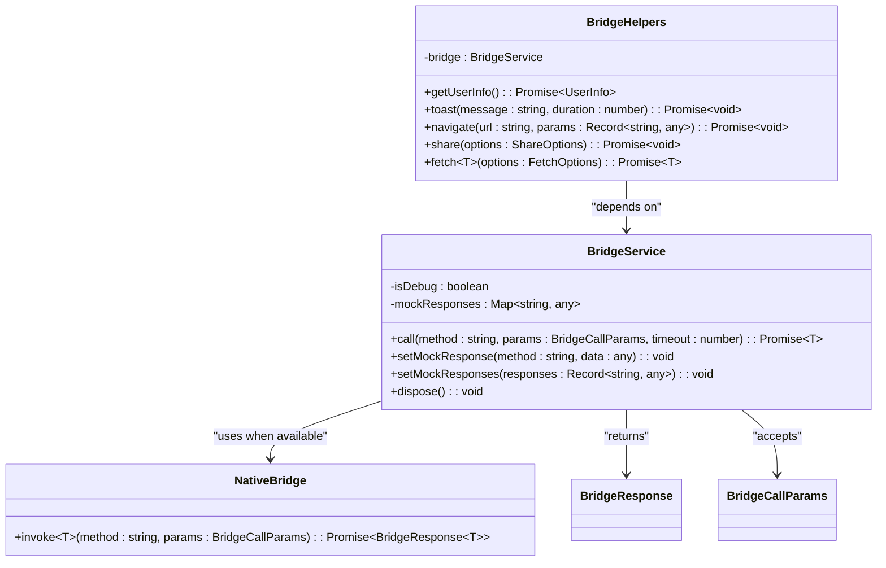
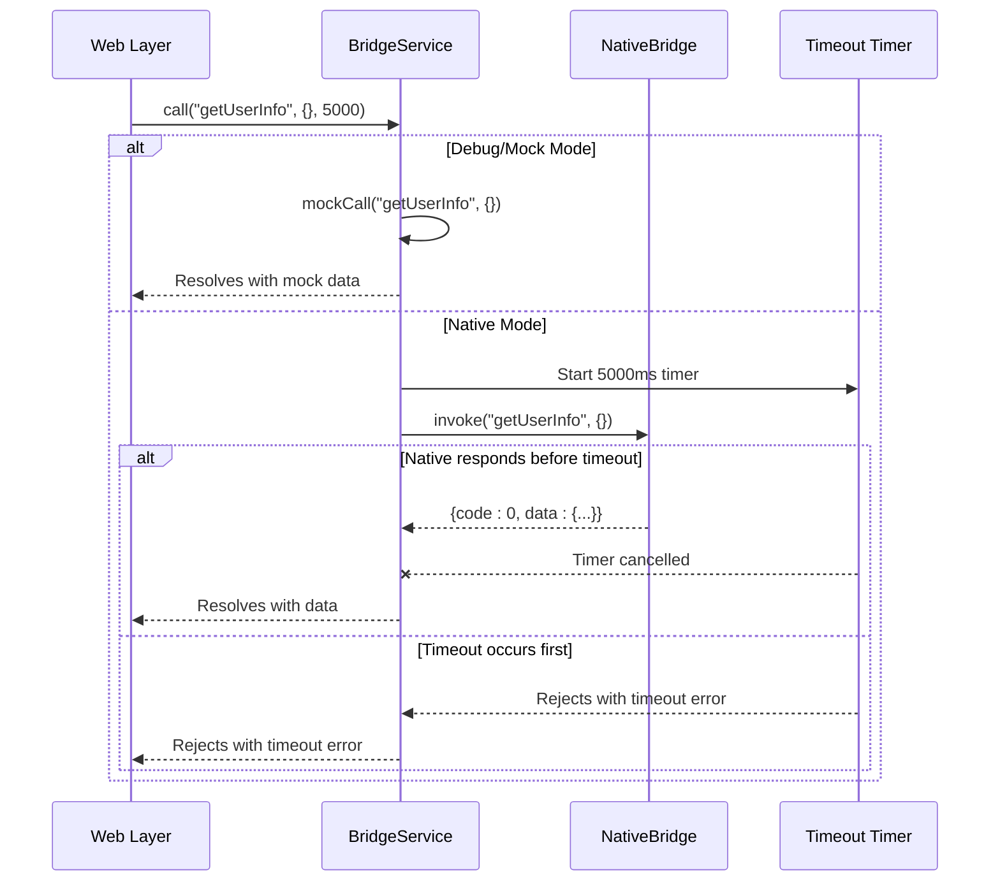
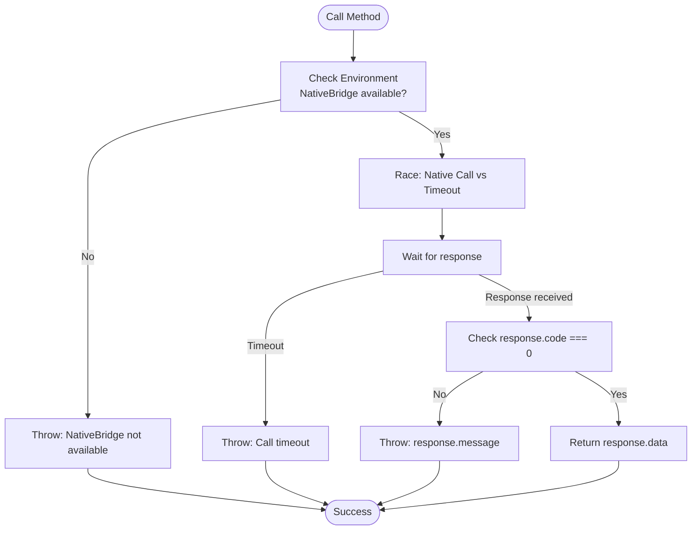
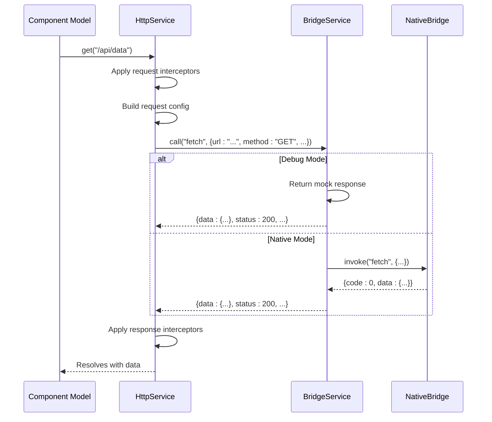

# BridgeService

<cite>
**Referenced Files in This Document**   
- [bridge.service.ts](file://packages/h5-builder/src/services/bridge.service.ts)
- [http.service.ts](file://packages/h5-builder/src/services/http.service.ts)
- [service-identifiers.ts](file://packages/h5-builder/src/services/service-identifiers.ts)
- [bridge.service.test.ts](file://packages/h5-builder/src/__tests__/bridge.service.test.ts)
- [component-loader.test.ts](file://packages/h5-builder/src/__tests__/component-loader.test.ts)
- [context.service.ts](file://packages/h5-builder/src/services/context.service.ts)
</cite>

## Table of Contents
1. [Introduction](#introduction)
2. [Core Functionality](#core-functionality)
3. [Call Method Parameters and Response Handling](#call-method-parameters-and-response-handling)
4. [Error Propagation Mechanisms](#error-propagation-mechanisms)
5. [Mock Response Capabilities](#mock-response-capabilities)
6. [Integration with HttpService](#integration-with-httpservice)
7. [Common Issues and Solutions](#common-issues-and-solutions)
8. [Debugging Bridge Communications](#debugging-bridge-communications)
9. [Usage Examples from Component Models](#usage-examples-from-component-models)
10. [Best Practices](#best-practices)

## Introduction

The BridgeService is a critical infrastructure component in hybrid H5 applications that enables seamless communication between web and native app layers. It acts as a bridge (hence the name) that allows JavaScript code running in a web view to interact with native platform capabilities through a standardized interface. This service abstracts the complexity of platform-specific implementations and provides a unified API for invoking native functionality.

The BridgeService operates in two modes: native mode when running within a native container with access to the NativeBridge, and mock mode when running in a browser environment for development and testing purposes. This dual-mode operation makes it possible to develop and debug hybrid applications directly in the browser while maintaining compatibility with the native environment.

**Section sources**
- [bridge.service.ts](file://packages/h5-builder/src/services/bridge.service.ts#L39-L169)

## Core Functionality

The BridgeService provides a clean, promise-based interface for making asynchronous calls to native functionality. At its core, it implements the `call` method which serves as the primary entry point for all native interactions. The service detects the execution environment automatically and routes calls appropriately to either the native implementation or a mock implementation.

The service is designed to be dependency-injected throughout the application using the DI system, with the service identifier `IBridgeService` defined in `service-identifiers.ts`. This allows components to depend on the abstraction rather than the concrete implementation, facilitating testing and maintainability.



**Diagram sources**
- [bridge.service.ts](file://packages/h5-builder/src/services/bridge.service.ts#L39-L169)

**Section sources**
- [bridge.service.ts](file://packages/h5-builder/src/services/bridge.service.ts#L39-L169)
- [service-identifiers.ts](file://packages/h5-builder/src/services/service-identifiers.ts#L16)

## Call Method Parameters and Response Handling

The primary method of interaction with the BridgeService is the `call` method, which accepts three parameters:

- **method**: A string identifying the native functionality to invoke (e.g., "getUserInfo", "toast", "navigate")
- **params**: An object containing parameters for the native method, structured as key-value pairs
- **timeout**: A number specifying the maximum time to wait for a response in milliseconds (defaults to 5000)

The method returns a Promise that resolves with the data payload from the native response or rejects with an error if the call fails or times out. The response follows a standardized format with a `code` field (0 for success), a `data` field containing the result, and an optional `message` field for error descriptions.

When operating in native mode, the service uses `Promise.race` to implement timeout functionality, competing between the native invocation Promise and a timeout Promise. This ensures that calls do not hang indefinitely if the native layer fails to respond.



**Diagram sources**
- [bridge.service.ts](file://packages/h5-builder/src/services/bridge.service.ts#L55-L65)
- [bridge.service.ts](file://packages/h5-builder/src/services/bridge.service.ts#L70-L101)

**Section sources**
- [bridge.service.ts](file://packages/h5-builder/src/services/bridge.service.ts#L55-L101)

## Error Propagation Mechanisms

The BridgeService implements comprehensive error handling to ensure robust communication between web and native layers. Errors can occur at multiple levels, and the service propagates them appropriately while providing meaningful context.

In native mode, several error conditions are handled:
- **Missing NativeBridge**: If the `window.NativeBridge` object is not available, an error is thrown immediately
- **Non-success response codes**: If the native response has a non-zero code, an error is thrown with the response message
- **Timeouts**: If the native call does not complete within the specified timeout period, a timeout error is thrown
- **Exceptions**: Any exceptions thrown during the native invocation are caught, logged, and re-thrown

All errors are logged to the console with contextual information including the method name, making it easier to diagnose issues during development. The service does not attempt to handle or recover from errors but instead propagates them to the caller, following the principle that error handling should be performed at the appropriate level of abstraction.



**Diagram sources**
- [bridge.service.ts](file://packages/h5-builder/src/services/bridge.service.ts#L75-L101)

**Section sources**
- [bridge.service.ts](file://packages/h5-builder/src/services/bridge.service.ts#L75-L101)

## Mock Response Capabilities

The BridgeService includes built-in support for mock responses, which is essential for development and testing workflows. When the service is instantiated with `isDebug = true` or when `window.NativeBridge` is not available, it automatically enters mock mode, bypassing the native layer and returning predefined responses.

The mock system is highly configurable through two methods:
- `setMockResponse(method: string, data: any)`: Sets a mock response for a specific method
- `setMockResponses(responses: Record<string, any>)`: Sets multiple mock responses at once

By default, the service initializes with a set of common mock responses in the `setupMockResponses` method, including data for user information retrieval, toast display, navigation, sharing, and HTTP requests. These defaults allow components to function immediately in the browser without additional configuration.

The mock implementation also simulates network latency by introducing a 100ms delay, making the development experience more realistic. When a requested method has no defined mock response, a warning is logged and an empty object is returned, allowing development to continue while highlighting missing mocks.

**Section sources**
- [bridge.service.ts](file://packages/h5-builder/src/services/bridge.service.ts#L106-L135)
- [bridge.service.ts](file://packages/h5-builder/src/services/bridge.service.ts#L139-L164)
- [bridge.service.test.ts](file://packages/h5-builder/src/__tests__/bridge.service.test.ts#L17-L42)

## Integration with HttpService

The BridgeService serves as the foundation for higher-level services, most notably the HttpService, which uses the bridge to make native API calls. The HttpService depends on the BridgeService to perform actual network requests through the native platform's networking capabilities, which often provide better performance, reliability, and access to platform-specific features.

When the HttpService makes a request, it formats the request parameters and invokes the `fetch` method on the BridgeService with the appropriate configuration. This allows the native layer to handle the HTTP request, potentially with enhanced capabilities like automatic certificate pinning, optimized connection pooling, or integration with the app's authentication system.

The integration is implemented through dependency injection, with the HttpService declaring its dependency on the BridgeService using the `@IBridgeService` decorator. This loose coupling allows both services to be tested independently and makes it easy to substitute implementations when needed.



**Diagram sources**
- [http.service.ts](file://packages/h5-builder/src/services/http.service.ts#L176-L182)
- [bridge.service.ts](file://packages/h5-builder/src/services/bridge.service.ts#L217-L225)

**Section sources**
- [http.service.ts](file://packages/h5-builder/src/services/http.service.ts#L75)
- [http.service.ts](file://packages/h5-builder/src/services/http.service.ts#L176-L182)

## Common Issues and Solutions

Several common issues can arise when working with the BridgeService in hybrid applications. Understanding these issues and their solutions is crucial for building robust applications.

**Platform Compatibility**: Different native platforms may implement bridge methods differently or provide different sets of available methods. The BridgeService itself doesn't resolve these differences but provides a consistent interface. Developers should handle platform-specific behavior in their components or through higher-level abstractions.

**Message Serialization**: Parameters passed through the bridge must be serializable to JSON, as they are typically transmitted as strings between the web and native layers. Complex objects with functions, symbols, or circular references will not serialize correctly. Developers should ensure that only plain data objects are passed as parameters.

**Timeout Handling**: Network requests or native operations may take longer than expected, especially on slow connections or under heavy load. The default 5-second timeout may be too short for some operations. Components should handle timeout errors gracefully and potentially implement retry logic with exponential backoff.

**Type Safety**: While TypeScript provides type checking, the actual bridge communication is dynamic. Mismatches between expected and actual response structures can cause runtime errors. Comprehensive testing with both mock and native environments helps catch these issues early.

**Section sources**
- [bridge.service.ts](file://packages/h5-builder/src/services/bridge.service.ts#L80-L82)
- [bridge.service.ts](file://packages/h5-builder/src/services/bridge.service.ts#L58)
- [http.service.ts](file://packages/h5-builder/src/services/http.service.ts#L67)

## Debugging Bridge Communications

Effective debugging of bridge communications is essential for developing and maintaining hybrid applications. The BridgeService provides several features to facilitate debugging:

**Debug Mode**: The service can be instantiated with `isDebug = true` to force mock mode, allowing development and testing in the browser without a native container. This is particularly useful for frontend developers who may not have access to native development environments.

**Console Logging**: All failed bridge calls are logged to the console with detailed information, including the method name and error details. This makes it easy to identify issues during development.

**Mock Configuration**: Developers can inspect and modify mock responses at runtime, allowing them to simulate different scenarios such as empty responses, error conditions, or slow network responses.

**Testing Integration**: The service is designed to work seamlessly with testing frameworks like Vitest, as demonstrated in the `bridge.service.test.ts` file. Tests can verify both mock and native mode behavior, ensuring reliability across environments.

When debugging issues, developers should first check whether the application is running in mock or native mode, as this affects the behavior significantly. They should also verify that the expected native methods are available and that parameters are properly structured for serialization.

**Section sources**
- [bridge.service.ts](file://packages/h5-builder/src/services/bridge.service.ts#L45)
- [bridge.service.ts](file://packages/h5-builder/src/services/bridge.service.ts#L98)
- [bridge.service.test.ts](file://packages/h5-builder/src/__tests__/bridge.service.test.ts#L14)
- [faq.md](file://packages/h5-builder/docs/faq.md#L346)

## Usage Examples from Component Models

While most components interact with native functionality through higher-level services like HttpService or TrackerService, the BridgeService can be used directly when needed. The dependency injection system makes it easy to access the service in any component that requires it.

In the component loader test, we see an example of how the BridgeService is registered in the DI container:

```typescript
const bridge = new BridgeService(true);
services.set(IBridgeService, bridge);
```

This pattern allows any component or service that declares a dependency on `IBridgeService` to receive the same instance, ensuring consistency across the application.

The BridgeHelpers class provides a convenient wrapper around common bridge operations, demonstrating a best practice for encapsulating frequently used bridge calls:

```typescript
class BridgeHelpers {
  constructor(private bridge: BridgeService) { }
  
  async getUserInfo(): Promise<UserInfo> {
    return this.bridge.call('getUserInfo');
  }
  
  async toast(message: string, duration = 2000): Promise<void> {
    return this.bridge.call('toast', { message, duration });
  }
}
```

This approach abstracts the raw bridge interface and provides type-safe methods with appropriate parameter validation.

**Section sources**
- [component-loader.test.ts](file://packages/h5-builder/src/__tests__/component-loader.test.ts#L33-L34)
- [bridge.service.ts](file://packages/h5-builder/src/services/bridge.service.ts#L174-L226)
- [service-identifiers.ts](file://packages/h5-builder/src/services/service-identifiers.ts#L16)

## Best Practices

When working with the BridgeService, several best practices should be followed to ensure maintainable and reliable code:

**Use Higher-Level Services When Possible**: Instead of calling the BridgeService directly, prefer using specialized services like HttpService or TrackerService that provide additional functionality like request interception, error handling, and type safety.

**Handle Errors Gracefully**: Always handle potential errors from bridge calls, especially timeouts and missing native functionality. Provide fallback behavior or user feedback when native features are unavailable.

**Keep Parameters Simple**: Pass only serializable data as parameters to bridge methods. Avoid complex objects, functions, or references that cannot be properly serialized.

**Test Both Modes**: Ensure that components work correctly in both mock and native modes. Write tests that verify behavior in both environments to catch mode-specific issues.

**Clean Up Resources**: The BridgeService implements IDisposable and should be disposed of when no longer needed, which clears all mock responses. This is particularly important in test environments to prevent state leakage between tests.

**Use BridgeHelpers for Common Operations**: For frequently used native operations, consider creating helper classes similar to BridgeHelpers to provide a clean, type-safe interface.

**Section sources**
- [bridge.service.ts](file://packages/h5-builder/src/services/bridge.service.ts#L166-L168)
- [bridge.service.test.ts](file://packages/h5-builder/src/__tests__/bridge.service.test.ts#L121-L129)
- [http.service.ts](file://packages/h5-builder/src/services/http.service.ts#L261-L270)