# ComponentService

<cite>
**Referenced Files in This Document**   
- [component.service.ts](file://packages/h5-builder/src/services/component.service.ts)
- [model-renderer.tsx](file://packages/h5-builder/src/components/model-renderer.tsx)
- [model.ts](file://packages/h5-builder/src/bedrock/model.ts)
- [product-card.model.ts](file://packages/h5-builder/src/components/product-card/product-card.model.ts)
- [tabs-container.model.ts](file://packages/h5-builder/src/components/tabs-container/tabs-container.model.ts)
- [service-identifiers.ts](file://packages/h5-builder/src/services/service-identifiers.ts)
- [index.common.ts](file://packages/h5-builder/src/bedrock/di/index.common.ts)
</cite>

## Table of Contents
1. [Introduction](#introduction)
2. [Core Architecture](#core-architecture)
3. [Component Registration](#component-registration)
4. [Schema Parsing and Model Resolution](#schema-parsing-and-model-resolution)
5. [Dependency Injection Integration](#dependency-injection-integration)
6. [Error Handling and Fallbacks](#error-handling-and-fallbacks)
7. [Performance Optimization](#performance-optimization)
8. [Best Practices](#best-practices)
9. [Extension Points](#extension-points)
10. [Troubleshooting](#troubleshooting)

## Introduction

The ComponentService is the central infrastructure component responsible for managing the component lifecycle in the H5 Builder framework. It serves as the primary registry for component type resolution and model-view mapping, enabling dynamic component loading and rendering based on schema definitions. The service orchestrates the transformation of declarative schema configurations into executable model trees, while integrating with the dependency injection system to provide services to component models.

**Section sources**
- [component.service.ts](file://packages/h5-builder/src/services/component.service.ts#L96-L104)

## Core Architecture

The ComponentService follows a layered architecture with distinct responsibilities for registration, resolution, and lifecycle management. At its core, it maintains a ComponentRegistry that maps component types to their corresponding model classes, enabling runtime resolution of components from schema definitions.

```mermaid
classDiagram
class ComponentService {
+_serviceBrand : undefined
-registry : ComponentRegistry
-_modelTree : BaseComponentModel | null
-_loadingResult : {modelTreeReady : Promise<void>, viewsReady : Promise<void>} | null
-modelLoaders : Map<string, () => Promise<any>>
-viewLoaders : Map<string, () => Promise<any>>
-modelCache : Map<string, any>
-viewCache : Map<string, any>
-metadata : Map<string, ComponentMetadata>
+register(type : string, ModelClass : any) : void
+registerAll(components : Record<string, any>) : void
+buildTree(schema : ComponentSchema) : BaseComponentModel
+registerAsync(componentName : string, config : {model? : () => Promise<any>, view? : () => Promise<any>}, metadata? : ComponentMetadata) : void
+preloadComponentsUnified(schema : ComponentSchema) : {modelTreeReady : Promise<void>, viewsReady : Promise<void>}
+buildModelTree(schema : ComponentSchema) : BaseComponentModel
}
class ComponentRegistry {
-registry : Map<string, any>
+register(type : string, ModelClass : any) : void
+registerAll(components : Record<string, any>) : void
+get(type : string) : any | undefined
+has(type : string) : boolean
+getRegisteredTypes() : string[]
}
class ComponentMetadata {
+priority? : 'critical' | 'high' | 'normal' | 'low'
+dependencies? : string[]
+preload? : boolean
+delayRange? : [number, number]
+lazy? : boolean
}
class ComponentSchema {
+type : string
+id : string
+props : Record<string, any>
+children? : ComponentSchema[]
+meta? : ComponentMetadata
}
ComponentService --> ComponentRegistry : "uses"
ComponentService --> ComponentMetadata : "uses"
ComponentService --> ComponentSchema : "processes"
```

**Diagram sources**
- [component.service.ts](file://packages/h5-builder/src/services/component.service.ts#L52-L94)
- [component.service.ts](file://packages/h5-builder/src/services/component.service.ts#L100-L734)

**Section sources**
- [component.service.ts](file://packages/h5-builder/src/services/component.service.ts#L52-L734)

## Component Registration

The ComponentService provides multiple mechanisms for registering components, supporting both synchronous and asynchronous registration patterns. The registration system maintains a central registry that maps component types to their model classes, enabling runtime resolution during schema processing.

### Synchronous Registration

Components can be registered synchronously using the `register` and `registerAll` methods, which add entries to the internal ComponentRegistry. This approach is suitable for components that are available at application startup.

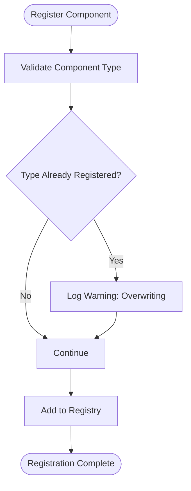

**Diagram sources**
- [component.service.ts](file://packages/h5-builder/src/services/component.service.ts#L58-L63)
- [component.service.ts](file://packages/h5-builder/src/services/component.service.ts#L119-L121)

### Asynchronous Registration

For dynamic loading scenarios, the ComponentService supports asynchronous registration through the `registerAsync` method. This allows components to be loaded on-demand, with separate loaders for model and view components.

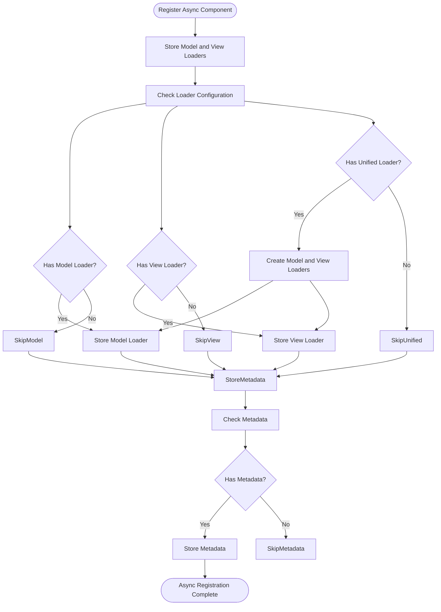

**Diagram sources**
- [component.service.ts](file://packages/h5-builder/src/services/component.service.ts#L286-L317)

**Section sources**
- [component.service.ts](file://packages/h5-builder/src/services/component.service.ts#L286-L317)

## Schema Parsing and Model Resolution

The ComponentService processes component schemas to create a hierarchical model tree. This process involves validation, model instantiation, and recursive child processing, ensuring that the resulting model tree accurately represents the intended component structure.

### Schema Validation

Before processing a schema, the ComponentService validates its structure to ensure all required fields are present and the component type is registered.

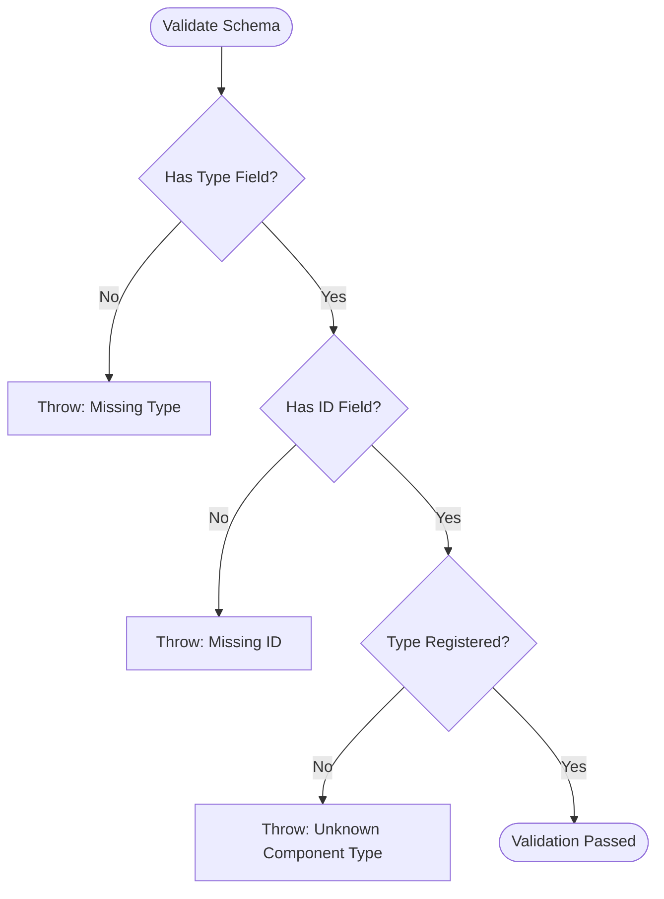

**Diagram sources**
- [component.service.ts](file://packages/h5-builder/src/services/component.service.ts#L214-L226)

### Model Tree Construction

The buildTree method orchestrates the creation of the model tree by recursively processing the schema and its children, creating model instances and establishing parent-child relationships.

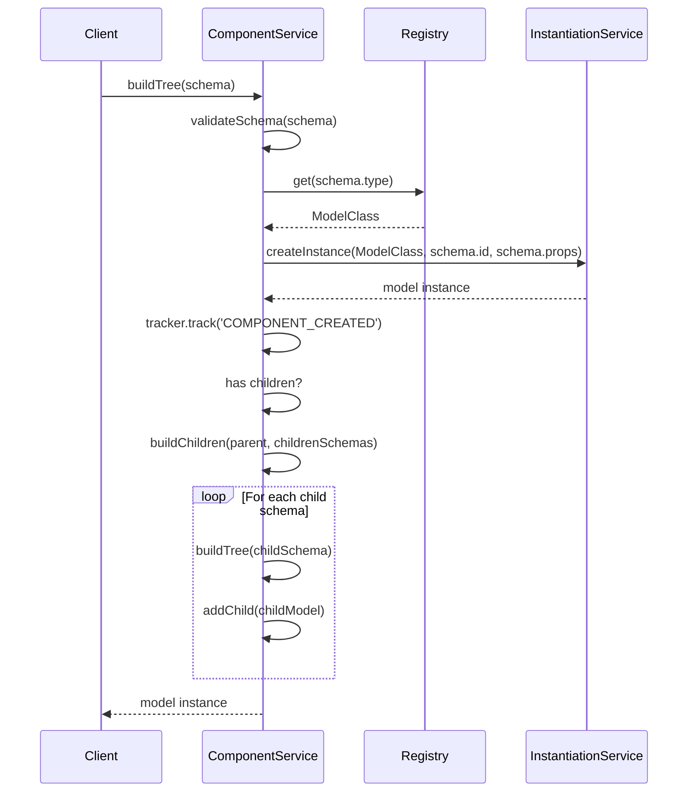

**Diagram sources**
- [component.service.ts](file://packages/h5-builder/src/services/component.service.ts#L135-L158)
- [component.service.ts](file://packages/h5-builder/src/services/component.service.ts#L164-L185)

**Section sources**
- [component.service.ts](file://packages/h5-builder/src/services/component.service.ts#L135-L208)

## Dependency Injection Integration

The ComponentService integrates with the DI system to inject dependencies into component models during instantiation. This enables components to access services such as HTTP clients, trackers, and other infrastructure components.

### DI System Architecture

The dependency injection system uses service identifiers and decorators to resolve dependencies at runtime, allowing for loose coupling between components and services.

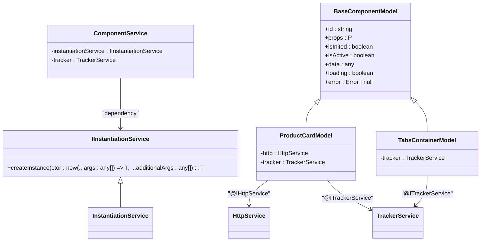

**Diagram sources**
- [component.service.ts](file://packages/h5-builder/src/services/component.service.ts#L111-L114)
- [product-card.model.ts](file://packages/h5-builder/src/components/product-card/product-card.model.ts#L36-L38)
- [tabs-container.model.ts](file://packages/h5-builder/src/components/tabs-container/tabs-container.model.ts#L45)

### Dependency Resolution Process

When creating a model instance, the ComponentService uses the instantiation service to resolve dependencies based on decorators in the model constructor.

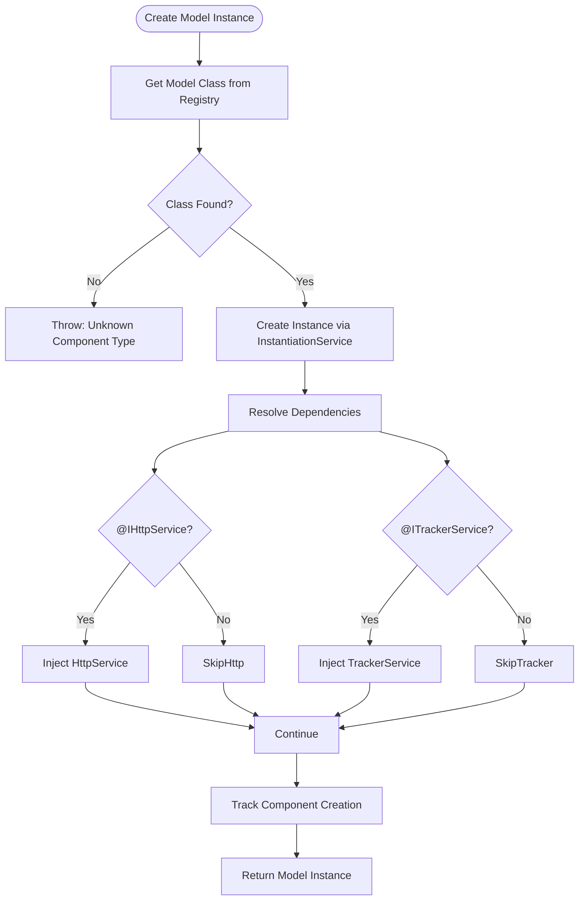

**Diagram sources**
- [component.service.ts](file://packages/h5-builder/src/services/component.service.ts#L172-L185)

**Section sources**
- [component.service.ts](file://packages/h5-builder/src/services/component.service.ts#L172-L185)
- [service-identifiers.ts](file://packages/h5-builder/src/services/service-identifiers.ts#L14-L19)
- [index.common.ts](file://packages/h5-builder/src/bedrock/di/index.common.ts#L10)

## Error Handling and Fallbacks

The ComponentService implements comprehensive error handling to ensure robust operation even when component loading or instantiation fails. It provides fallback mechanisms to maintain application stability and user experience.

### Error Placeholder System

When component creation fails, the ComponentService creates an ErrorPlaceholderModel to maintain the component tree structure while displaying meaningful error information.

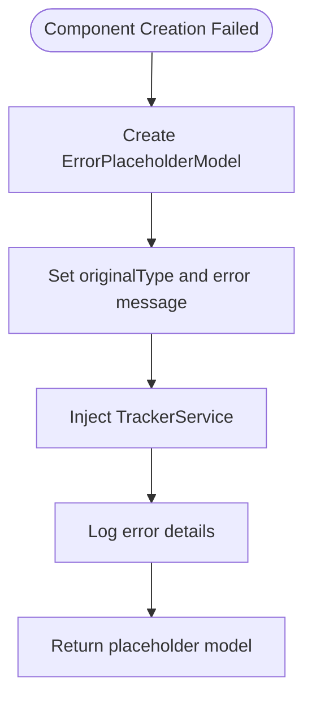

**Diagram sources**
- [component.service.ts](file://packages/h5-builder/src/services/component.service.ts#L231-L243)
- [component.service.ts](file://packages/h5-builder/src/services/component.service.ts#L156-L158)
- [placeholder/index.ts](file://packages/h5-builder/src/placeholder/index.ts#L6-L11)

### Child Component Error Handling

When building child components, the ComponentService isolates failures to individual components, preventing cascading failures while maintaining the overall structure.

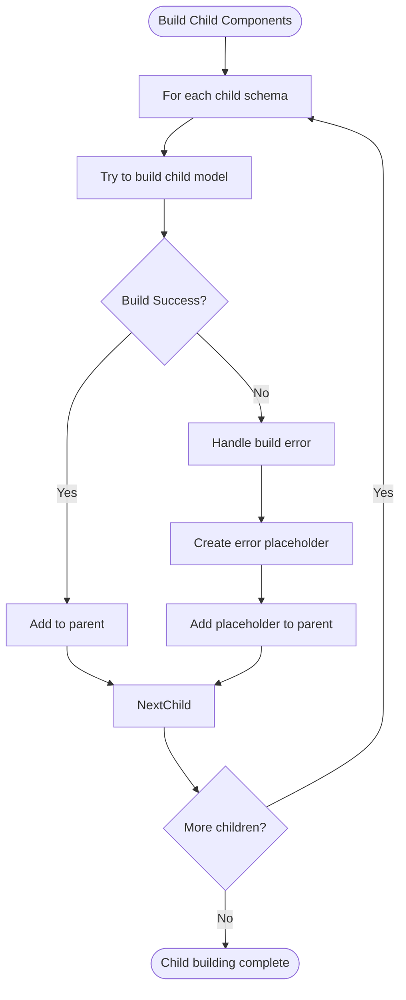

**Diagram sources**
- [component.service.ts](file://packages/h5-builder/src/services/component.service.ts#L194-L208)

**Section sources**
- [component.service.ts](file://packages/h5-builder/src/services/component.service.ts#L194-L208)

## Performance Optimization

The ComponentService implements several performance optimizations to ensure efficient component loading and rendering, particularly for complex component trees.

### Concurrent Loading Strategy

The preloadComponentsUnified method implements a concurrent loading strategy that processes model and view loading in a unified queue with controlled concurrency.

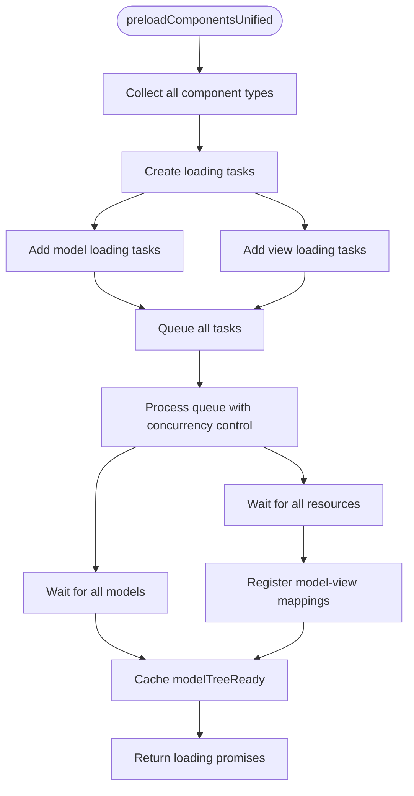

**Diagram sources**
- [component.service.ts](file://packages/h5-builder/src/services/component.service.ts#L632-L696)

### Loading Concurrency Control

The ComponentService uses a promise-based concurrency control mechanism to limit the number of simultaneous loading operations, preventing resource exhaustion.

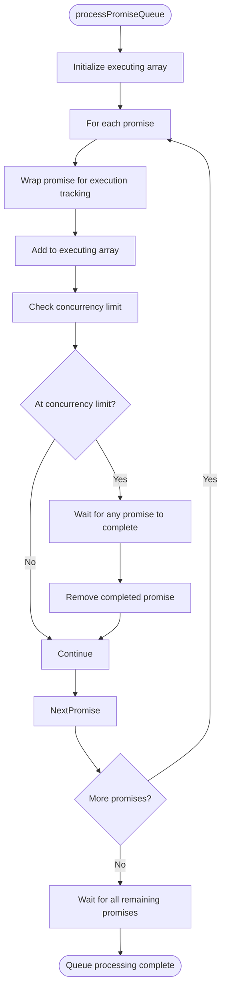

**Diagram sources**
- [component.service.ts](file://packages/h5-builder/src/services/component.service.ts#L597-L623)

**Section sources**
- [component.service.ts](file://packages/h5-builder/src/services/component.service.ts#L632-L696)

## Best Practices

### Component Registry Organization

Organize component registries by feature or domain to improve maintainability and reduce coupling between unrelated components.

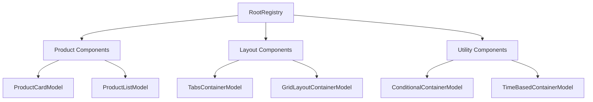

### Lookup Performance Optimization

Use a flat registry structure with direct type-to-model mapping for optimal lookup performance, avoiding nested lookups or complex resolution logic.

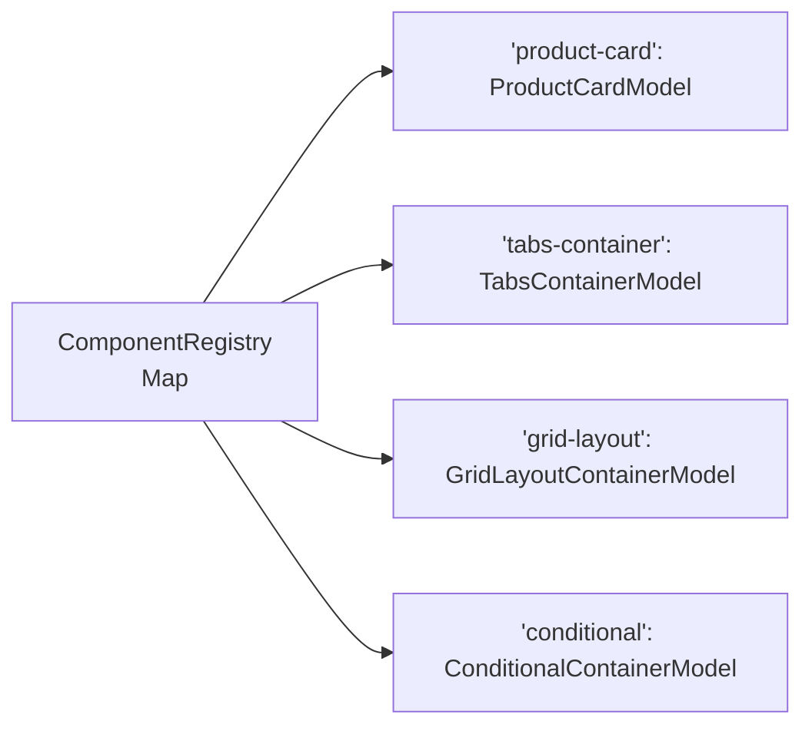

**Section sources**
- [component.service.ts](file://packages/h5-builder/src/services/component.service.ts#L53)

## Extension Points

The ComponentService provides several extension points for customizing component loading behavior and integrating with external systems.

### Custom Component Loaders

Implement custom loaders to support dynamic component loading from various sources such as remote servers, code splitting bundles, or database-stored components.

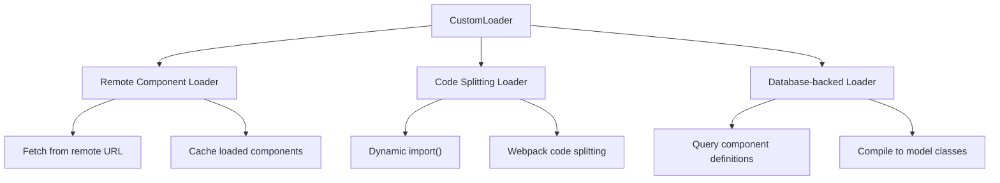

### Dynamic Registration

Use the registerAsync method to dynamically register components at runtime based on application state or user interactions.

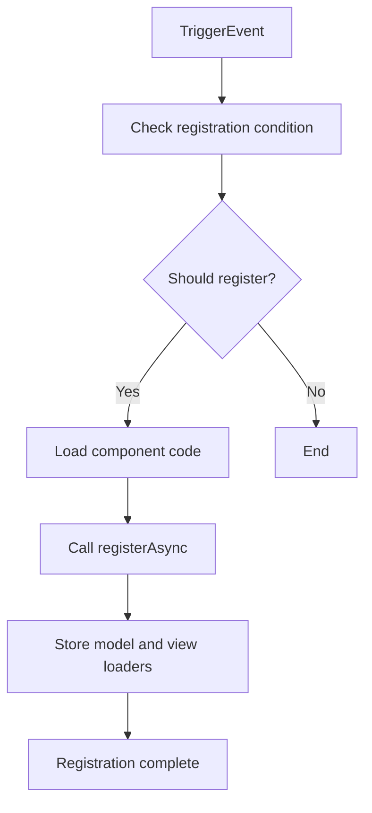

**Section sources**
- [component.service.ts](file://packages/h5-builder/src/services/component.service.ts#L286-L317)

## Troubleshooting

### Duplicate Registrations

When a component type is registered multiple times, the ComponentService logs a warning and overwrites the previous registration. This behavior prevents application crashes but may lead to unexpected behavior if not monitored.

**Solution**: Implement a registration audit system that logs all registrations and provides warnings for potential duplicates during development.

### Missing Component Types

If a schema references a component type that hasn't been registered, the ComponentService throws an error during schema validation.

**Solution**: Ensure all required components are registered before processing schemas, either through static registration or by using asynchronous registration with proper loading sequences.

### Circular Dependencies

Circular dependencies between components can cause infinite recursion during model tree construction.

**Solution**: Implement dependency analysis during registration to detect potential circular dependencies, or use lazy loading patterns to break circular references.

**Section sources**
- [component.service.ts](file://packages/h5-builder/src/services/component.service.ts#L223-L225)
- [component.service.ts](file://packages/h5-builder/src/services/component.service.ts#L156-L158)
- [component.service.ts](file://packages/h5-builder/src/services/component.service.ts#L60-L61)