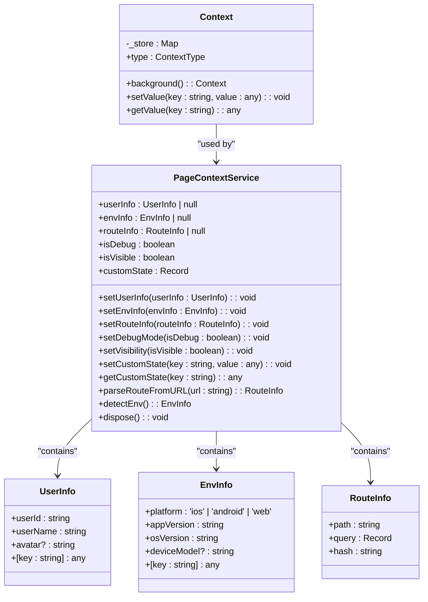
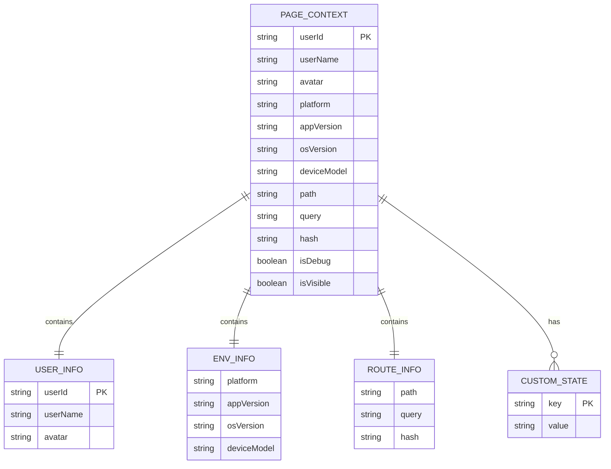
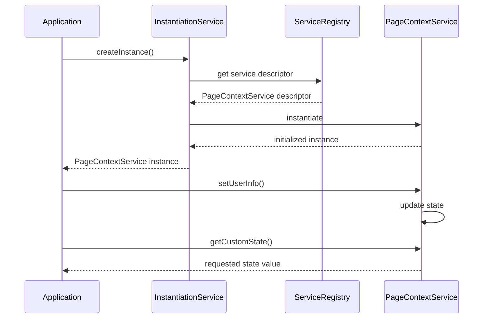
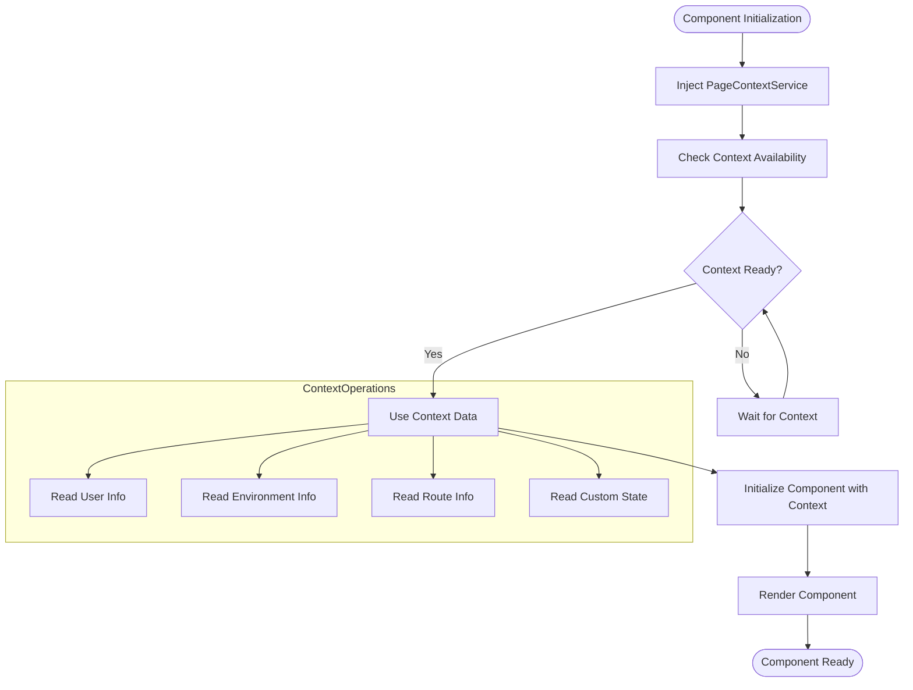
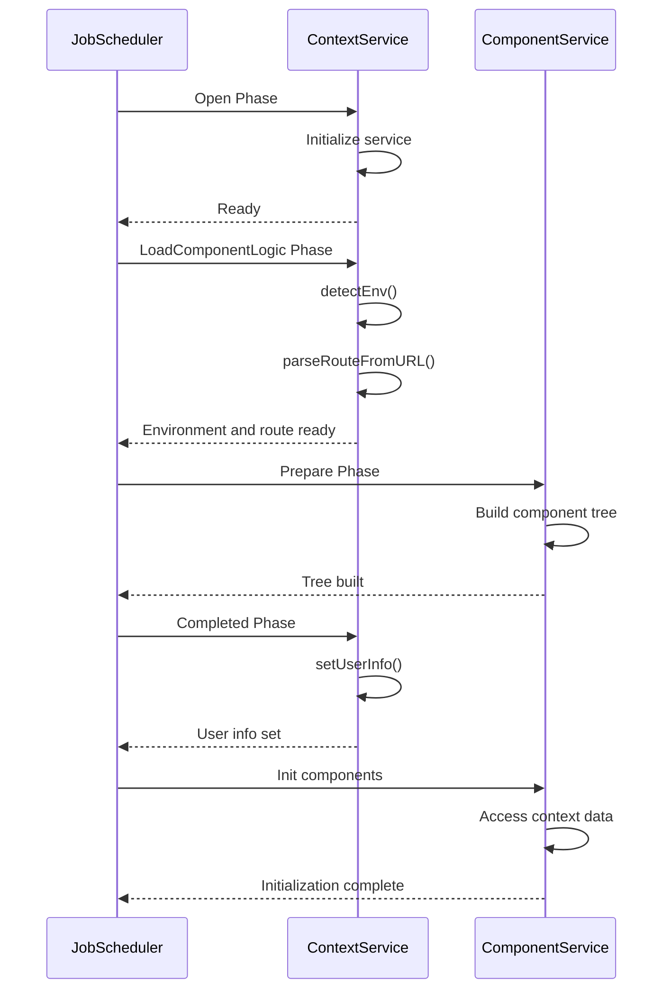
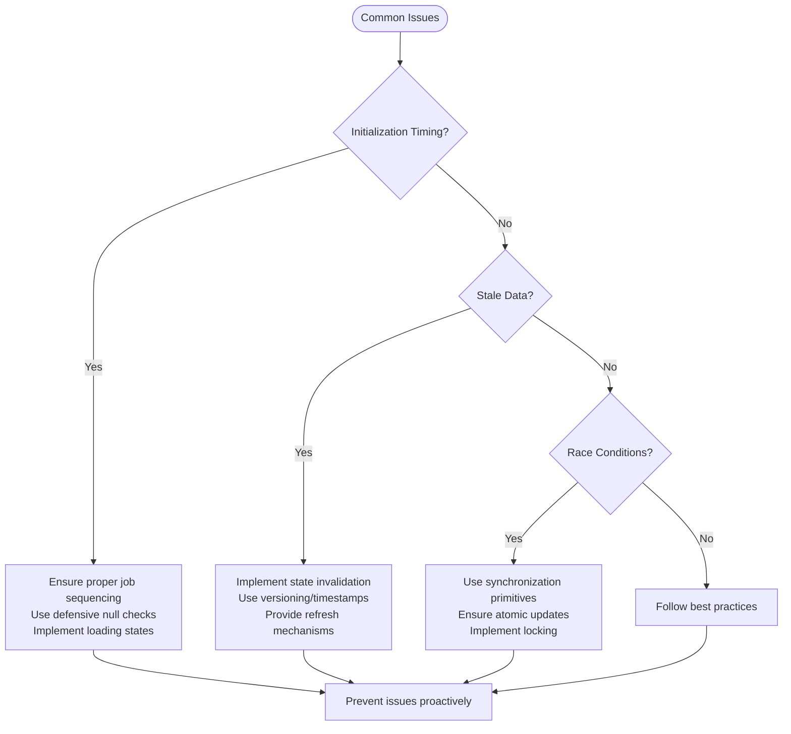
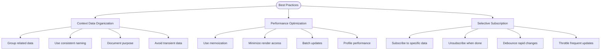

# ContextService

<cite>
**Referenced Files in This Document**   
- [context.ts](file://packages/h5-builder/src/bedrock/context/context.ts)
- [context.service.ts](file://packages/h5-builder/src/services/context.service.ts)
- [service-identifiers.ts](file://packages/h5-builder/src/services/service-identifiers.ts)
- [instantiation-service.ts](file://packages/h5-builder/src/bedrock/di/instantiation-service.ts)
- [context.web.tsx](file://packages/h5-builder/src/bedrock/di/context.web.tsx)
- [demo-progressive.tsx](file://packages/h5-builder/src/demo-progressive.tsx)
</cite>

## Table of Contents
1. [Introduction](#introduction)
2. [Core Architecture](#core-architecture)
3. [Data Structure and State Management](#data-structure-and-state-management)
4. [Dependency Injection Integration](#dependency-injection-integration)
5. [Component Model Access Patterns](#component-model-access-patterns)
6. [Lifecycle and Initialization Timing](#lifecycle-and-initialization-timing)
7. [Common Issues and Solutions](#common-issues-and-solutions)
8. [Best Practices](#best-practices)
9. [Conclusion](#conclusion)

## Introduction

The ContextService infrastructure component provides a centralized state management system for global application context, including user information, environment variables, and route context. This document thoroughly explains its role in managing application state, data structure, integration with the dependency injection system, and best practices for usage.

**Section sources**
- [context.service.ts](file://packages/h5-builder/src/services/context.service.ts#L38-L186)

## Core Architecture

The ContextService architecture consists of two main components: the low-level Context class for lightweight context management and the PageContextService class for comprehensive application state management. The Context class provides basic key-value storage with different context types (Entry, Event, UserInput, Task), while the PageContextService offers a rich interface for managing user, environment, and route information.

**Diagram sources**
- [context.ts](file://packages/h5-builder/src/bedrock/context/context.ts#L15-L60)
- [context.service.ts](file://packages/h5-builder/src/services/context.service.ts#L38-L186)

**Section sources**
- [context.ts](file://packages/h5-builder/src/bedrock/context/context.ts#L1-L60)
- [context.service.ts](file://packages/h5-builder/src/services/context.service.ts#L7-L32)

## Data Structure and State Management

The PageContextService manages several key pieces of application state through dedicated properties and methods. The context object structure is designed to be both comprehensive and extensible, allowing for both predefined state properties and custom state storage.

The core data structure includes:

- **User Information**: Contains user identity and profile data
- **Environment Information**: Captures platform, version, and device details
- **Route Information**: Stores current URL path, query parameters, and hash
- **Application State**: Tracks debug mode and visibility status
- **Custom State**: Provides a flexible key-value store for application-specific data

**Diagram sources**
- [context.service.ts](file://packages/h5-builder/src/services/context.service.ts#L7-L32)

**Section sources**
- [context.service.ts](file://packages/h5-builder/src/services/context.service.ts#L40-L56)

## Dependency Injection Integration

The ContextService integrates with the dependency injection system through service identifiers and the InstantiationService. The PageContextService is registered with the DI container using the IPageContextService identifier, allowing components to access it through dependency injection rather than direct instantiation.

The integration follows a clean separation of concerns, with the DI system handling service lifecycle and the ContextService focusing on state management. Components access the context service through the useService hook in React components or through constructor injection in classes.

**Diagram sources**
- [service-identifiers.ts](file://packages/h5-builder/src/services/service-identifiers.ts#L1-L19)
- [instantiation-service.ts](file://packages/h5-builder/src/bedrock/di/instantiation-service.ts#L61-L467)
- [context.web.tsx](file://packages/h5-builder/src/bedrock/di/context.web.tsx#L1-L41)

**Section sources**
- [service-identifiers.ts](file://packages/h5-builder/src/services/service-identifiers.ts#L1-L19)
- [instantiation-service.ts](file://packages/h5-builder/src/bedrock/di/instantiation-service.ts#L61-L467)

## Component Model Access Patterns

Component models access context data through the dependency injection system, typically during initialization and rendering phases. The BaseComponentModel and BaseContainerModel classes provide the foundation for component lifecycle management, with context access occurring primarily in the onInit lifecycle hook.

Components retrieve context data either through direct service injection or by accessing the shared PageContextService instance. The context data is used to configure component behavior, personalize content, and adapt to the current environment.

**Diagram sources**
- [context.service.ts](file://packages/h5-builder/src/services/context.service.ts#L66-L110)
- [model.ts](file://packages/h5-builder/src/bedrock/model.ts#L10-L242)

**Section sources**
- [demo-progressive.tsx](file://packages/h5-builder/src/demo-progressive.tsx#L188-L210)
- [init-first-screen-data-job.ts](file://packages/h5-builder/src/jobs/init-first-screen-data-job.ts#L1-L66)

## Lifecycle and Initialization Timing

The ContextService initialization is tightly coupled with the application startup sequence, which follows a job-based scheduling system. The initialization timing is critical to ensure that context data is available when components need it during their lifecycle.

The initialization sequence follows these phases:
1. Service registration and container creation
2. Context service instantiation
3. Environment detection and route parsing
4. User information setup
5. Component tree initialization with context data

The job scheduler ensures that context initialization completes before components attempt to access context data, preventing race conditions and undefined state issues.

**Diagram sources**
- [demo-progressive.tsx](file://packages/h5-builder/src/demo-progressive.tsx#L66-L185)
- [init-first-screen-data-job.ts](file://packages/h5-builder/src/jobs/init-first-screen-data-job.ts#L1-L66)

**Section sources**
- [demo-progressive.tsx](file://packages/h5-builder/src/demo-progressive.tsx#L66-L185)
- [init-first-screen-data-job.ts](file://packages/h5-builder/src/jobs/init-first-screen-data-job.ts#L1-L66)

## Common Issues and Solutions

Several common issues can arise when working with the ContextService, particularly related to initialization timing, stale data, and race conditions during async updates.

**Initialization Timing Issues**: These occur when components attempt to access context data before it's available. The solution is to ensure proper sequencing through the job scheduler and to implement defensive programming with null checks.

**Stale Data Problems**: These happen when context data becomes outdated but components continue to use the old values. The solution is to implement proper state invalidation and refresh mechanisms.

**Race Conditions**: These occur during async updates when multiple components attempt to modify context state simultaneously. The solution is to use proper synchronization mechanisms and ensure atomic updates.

**Diagram sources**
- [context.service.ts](file://packages/h5-builder/src/services/context.service.ts#L130-L136)
- [model.ts](file://packages/h5-builder/src/bedrock/model.ts#L49-L58)

**Section sources**
- [context.service.ts](file://packages/h5-builder/src/services/context.service.ts#L130-L136)
- [model.ts](file://packages/h5-builder/src/bedrock/model.ts#L49-L58)

## Best Practices

To effectively use the ContextService, follow these best practices for context data organization and performance optimization:

**Context Data Organization**:
- Group related data into logical categories
- Use consistent naming conventions
- Document the purpose of each context property
- Avoid storing transient or highly volatile data

**Performance Optimization**:
- Implement selective subscription to context changes
- Use memoization for expensive context-derived computations
- Minimize direct context access in render methods
- Batch context updates when possible

**Selective Subscription**: Components should only subscribe to the specific context data they need, rather than observing the entire context object. This reduces unnecessary re-renders and improves performance.

**Diagram sources**
- [context.service.ts](file://packages/h5-builder/src/services/context.service.ts#L108-L109)
- [function/debounce.ts](file://packages/h5-builder/src/bedrock/function/debounce.ts)
- [function/throttle.ts](file://packages/h5-builder/src/bedrock/function/throttle.ts)

**Section sources**
- [context.service.ts](file://packages/h5-builder/src/services/context.service.ts#L108-L109)
- [function/debounce.ts](file://packages/h5-builder/src/bedrock/function/debounce.ts)
- [function/throttle.ts](file://packages/h5-builder/src/bedrock/function/throttle.ts)

## Conclusion

The ContextService provides a robust foundation for managing global application state in the MobX architecture. By understanding its data structure, integration with the dependency injection system, and proper usage patterns, developers can effectively leverage this component to build responsive and maintainable applications.

Key takeaways include the importance of proper initialization sequencing, the benefits of selective subscription for performance optimization, and the need to handle common issues like stale data and race conditions. Following the best practices outlined in this document will help ensure that the ContextService is used effectively and efficiently throughout the application.