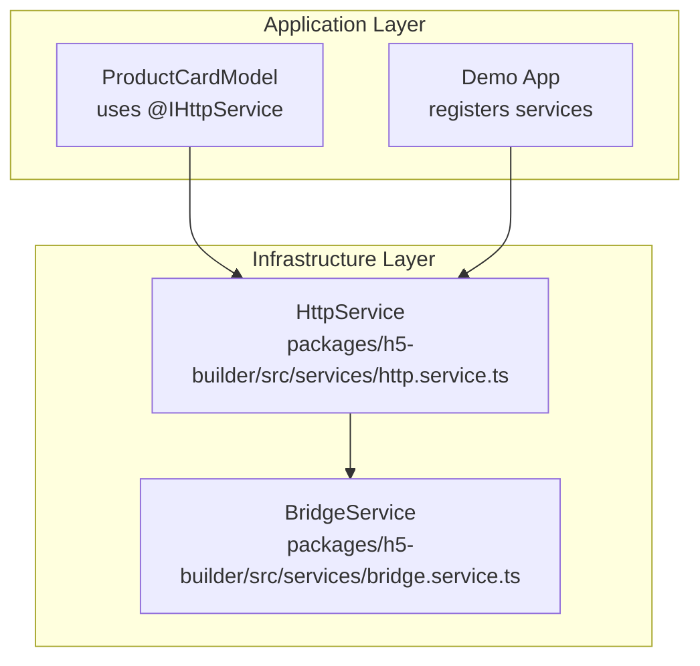
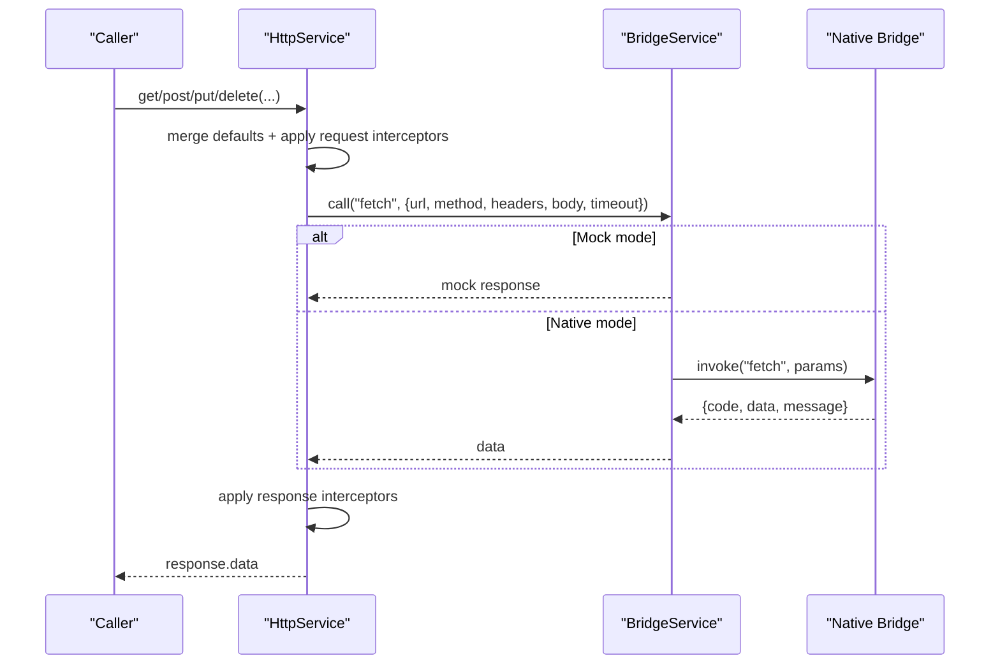
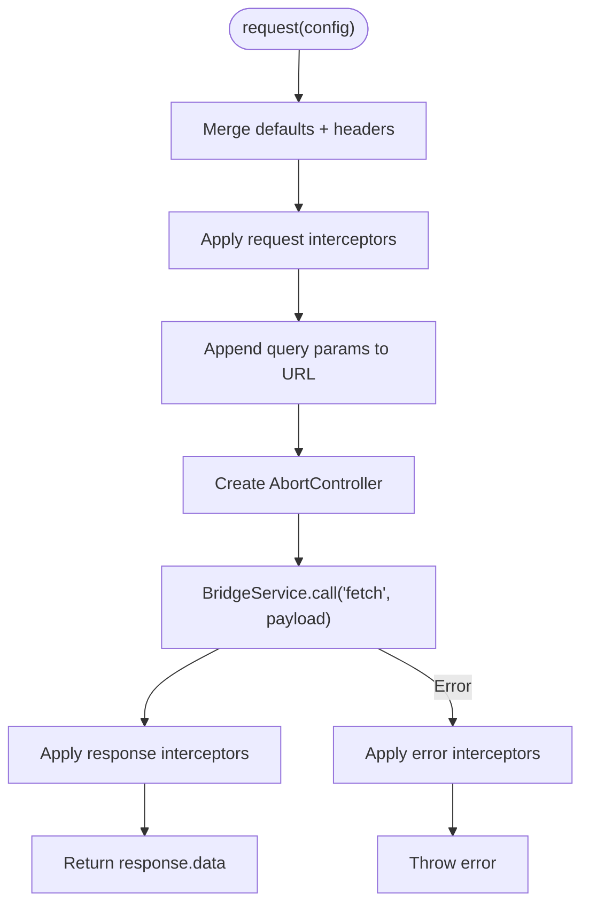
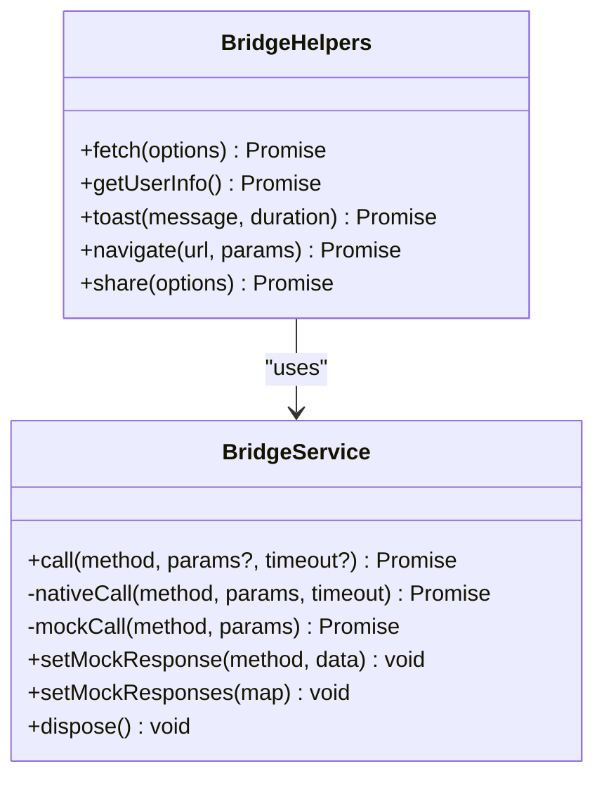
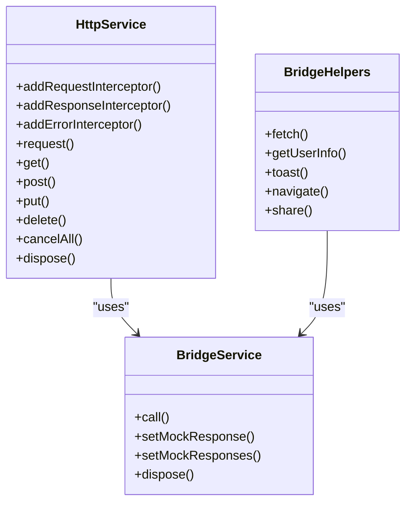

# HttpService

<cite>
**Referenced Files in This Document**
- [http.service.ts](file://packages/h5-builder/src/services/http.service.ts)
- [bridge.service.ts](file://packages/h5-builder/src/services/bridge.service.ts)
- [http.service.test.ts](file://packages/h5-builder/src/__tests__/http.service.test.ts)
- [bridge.service.test.ts](file://packages/h5-builder/src/__tests__/bridge.service.test.ts)
- [service-identifiers.ts](file://packages/h5-builder/src/services/service-identifiers.ts)
- [demo-progressive.tsx](file://packages/h5-builder/src/demo-progressive.tsx)
- [product-card.model.ts](file://packages/h5-builder/src/components/product-card/product-card.model.ts)
- [api_reference.md](file://packages/h5-builder/docs/api_reference.md)
</cite>

## Table of Contents
1. [Introduction](#introduction)
2. [Project Structure](#project-structure)
3. [Core Components](#core-components)
4. [Architecture Overview](#architecture-overview)
5. [Detailed Component Analysis](#detailed-component-analysis)
6. [Dependency Analysis](#dependency-analysis)
7. [Performance Considerations](#performance-considerations)
8. [Troubleshooting Guide](#troubleshooting-guide)
9. [Conclusion](#conclusion)
10. [Appendices](#appendices)

## Introduction
This document explains the HttpService infrastructure component used in hybrid applications. It focuses on how HttpService wraps a JSBridge-based fetch mechanism, implements request/response/error interceptors, manages timeouts and cancellations, and integrates with BridgeService for native calls. It also covers configuration options (baseURL, headers, tokens), public APIs (get, post, put, delete), and practical usage patterns in the codebase.

## Project Structure
HttpService resides in the infrastructure layer alongside BridgeService and other foundational services. It is consumed by higher-level components/models via dependency injection.

**Diagram sources**
- [http.service.ts](file://packages/h5-builder/src/services/http.service.ts#L1-L281)
- [bridge.service.ts](file://packages/h5-builder/src/services/bridge.service.ts#L1-L227)
- [product-card.model.ts](file://packages/h5-builder/src/components/product-card/product-card.model.ts#L1-L133)
- [demo-progressive.tsx](file://packages/h5-builder/src/demo-progressive.tsx#L188-L211)

**Section sources**
- [http.service.ts](file://packages/h5-builder/src/services/http.service.ts#L1-L281)
- [bridge.service.ts](file://packages/h5-builder/src/services/bridge.service.ts#L1-L227)
- [product-card.model.ts](file://packages/h5-builder/src/components/product-card/product-card.model.ts#L1-L133)
- [demo-progressive.tsx](file://packages/h5-builder/src/demo-progressive.tsx#L188-L211)

## Core Components
- HttpService: Provides HTTP methods (get, post, put, delete) and interceptor hooks. It composes a default configuration, applies request/response/error interceptors, and delegates the actual network call to BridgeService via a JSBridge “fetch” method.
- BridgeService: Encapsulates JSBridge invocation, supports mock mode for browser testing, and enforces timeouts and error handling for native calls.

Key capabilities:
- Interceptors: addRequestInterceptor, addResponseInterceptor, addErrorInterceptor
- Public methods: request, get, post, put, delete
- Cancellation: cancelAll via AbortController
- Configuration: baseURL and Authorization token injection via interceptors

**Section sources**
- [http.service.ts](file://packages/h5-builder/src/services/http.service.ts#L47-L103)
- [http.service.ts](file://packages/h5-builder/src/services/http.service.ts#L105-L203)
- [http.service.ts](file://packages/h5-builder/src/services/http.service.ts#L205-L272)
- [bridge.service.ts](file://packages/h5-builder/src/services/bridge.service.ts#L49-L101)

## Architecture Overview
HttpService delegates network operations to BridgeService, which either invokes the native bridge or simulates responses in mock mode. The request pipeline includes merging defaults, applying interceptors, building the final payload, and returning parsed data.

**Diagram sources**
- [http.service.ts](file://packages/h5-builder/src/services/http.service.ts#L147-L193)
- [bridge.service.ts](file://packages/h5-builder/src/services/bridge.service.ts#L55-L101)

## Detailed Component Analysis

### HttpService Implementation
- Defaults: method, timeout, Content-Type header
- Interceptor registration: addRequestInterceptor, addResponseInterceptor, addErrorInterceptor; each returns a removal function
- Request pipeline:
  - Merge default config with provided config
  - Apply request interceptors
  - Append query params to URL
  - Create AbortController and track it
  - Call BridgeService.call("fetch", payload)
  - Apply response interceptors
  - Return response.data
- Error handling:
  - Catch exceptions during bridge call
  - Apply error interceptors
  - Re-throw the error
- Public methods:
  - get(url, config?)
  - post(url, data?, config?)
  - put(url, data?, config?)
  - delete(url, config?)

**Diagram sources**
- [http.service.ts](file://packages/h5-builder/src/services/http.service.ts#L147-L203)

**Section sources**
- [http.service.ts](file://packages/h5-builder/src/services/http.service.ts#L64-L103)
- [http.service.ts](file://packages/h5-builder/src/services/http.service.ts#L147-L203)
- [http.service.ts](file://packages/h5-builder/src/services/http.service.ts#L205-L272)

### BridgeService Integration
- call(method, params?, timeout?) routes to native or mock depending on environment
- nativeCall races the native invoke against a timeout promise and validates response code
- mockCall returns preconfigured mock data or logs warnings when missing
- fetch helper in BridgeHelpers exposes a typed wrapper for network requests

**Diagram sources**
- [bridge.service.ts](file://packages/h5-builder/src/services/bridge.service.ts#L49-L101)
- [bridge.service.ts](file://packages/h5-builder/src/services/bridge.service.ts#L174-L227)

**Section sources**
- [bridge.service.ts](file://packages/h5-builder/src/services/bridge.service.ts#L49-L101)
- [bridge.service.ts](file://packages/h5-builder/src/services/bridge.service.ts#L174-L227)

### Interceptor Registration Pattern
- Request interceptors: modify config (headers, URL, params)
- Response interceptors: transform response before returning
- Error interceptors: handle and possibly normalize errors
- Removal: each add*Interceptor returns a function to remove the interceptor

Practical examples from tests:
- Adding a custom header via request interceptor
- Removing an interceptor immediately after adding it
- Executing response interceptors
- Executing error interceptors on failures

**Section sources**
- [http.service.ts](file://packages/h5-builder/src/services/http.service.ts#L105-L142)
- [http.service.test.ts](file://packages/h5-builder/src/__tests__/http.service.test.ts#L103-L144)
- [http.service.test.ts](file://packages/h5-builder/src/__tests__/http.service.test.ts#L146-L164)
- [http.service.test.ts](file://packages/h5-builder/src/__tests__/http.service.test.ts#L165-L177)

### Public Methods: get, post, put, delete
- Convenience wrappers around request
- Automatically set method and optional data
- Tests demonstrate GET/POST/PUT/DELETE behavior and query parameter handling

**Section sources**
- [http.service.ts](file://packages/h5-builder/src/services/http.service.ts#L205-L249)
- [http.service.test.ts](file://packages/h5-builder/src/__tests__/http.service.test.ts#L29-L77)
- [http.service.test.ts](file://packages/h5-builder/src/__tests__/http.service.test.ts#L79-L101)

### Timeout Handling
- HttpService merges a default timeout into each request
- BridgeService.natvieCall races the native invoke against a timeout promise
- Tests verify timeout behavior in native mode

**Section sources**
- [http.service.ts](file://packages/h5-builder/src/services/http.service.ts#L64-L71)
- [bridge.service.ts](file://packages/h5-builder/src/services/bridge.service.ts#L79-L91)
- [bridge.service.test.ts](file://packages/h5-builder/src/__tests__/bridge.service.test.ts#L78-L85)

### Retry Logic
- There is no built-in retry mechanism in HttpService or BridgeService
- Implement retries at the caller level by wrapping HttpService calls with retry logic if needed

**Section sources**
- [http.service.ts](file://packages/h5-builder/src/services/http.service.ts#L147-L203)
- [bridge.service.ts](file://packages/h5-builder/src/services/bridge.service.ts#L79-L101)

### Cancellation and Disposal
- Pending requests tracked via AbortController
- cancelAll aborts all pending requests and clears the set
- dispose cancels all, clears interceptors, and disposes internal resources

**Section sources**
- [http.service.ts](file://packages/h5-builder/src/services/http.service.ts#L62-L63)
- [http.service.ts](file://packages/h5-builder/src/services/http.service.ts#L251-L271)
- [http.service.test.ts](file://packages/h5-builder/src/__tests__/http.service.test.ts#L179-L183)

### Configuration Options
- baseURL injection via a request interceptor that prepends baseURL to relative URLs
- token injection via a request interceptor that adds Authorization header
- Example usage in demo app registers HttpService with baseURL

**Section sources**
- [http.service.ts](file://packages/h5-builder/src/services/http.service.ts#L73-L103)
- [demo-progressive.tsx](file://packages/h5-builder/src/demo-progressive.tsx#L194-L204)
- [http.service.test.ts](file://packages/h5-builder/src/__tests__/http.service.test.ts#L200-L250)

### Authentication Token Management
- Token is injected as an Authorization header via a request interceptor
- Tests verify that Authorization header is present when token is configured

**Section sources**
- [http.service.ts](file://packages/h5-builder/src/services/http.service.ts#L87-L103)
- [http.service.test.ts](file://packages/h5-builder/src/__tests__/http.service.test.ts#L225-L249)

### Hybrid App Native Calls via BridgeService
- HttpService uses BridgeService.call("fetch", ...) to perform network requests
- In mock mode, BridgeService returns predefined responses (including a fetch mock)
- In native mode, BridgeService invokes window.NativeBridge.invoke and validates response codes

**Section sources**
- [http.service.ts](file://packages/h5-builder/src/services/http.service.ts#L174-L183)
- [bridge.service.ts](file://packages/h5-builder/src/services/bridge.service.ts#L55-L101)
- [bridge.service.ts](file://packages/h5-builder/src/services/bridge.service.ts#L106-L164)

### Dependency Injection and Usage
- Service identifiers define injectable tokens for HttpService and BridgeService
- Demo app registers HttpService with options and resolves it via DI
- ProductCardModel demonstrates injecting HttpService via @IHttpService

**Section sources**
- [service-identifiers.ts](file://packages/h5-builder/src/services/service-identifiers.ts#L1-L20)
- [demo-progressive.tsx](file://packages/h5-builder/src/demo-progressive.tsx#L194-L204)
- [product-card.model.ts](file://packages/h5-builder/src/components/product-card/product-card.model.ts#L33-L40)

## Dependency Analysis

**Diagram sources**
- [http.service.ts](file://packages/h5-builder/src/services/http.service.ts#L105-L272)
- [bridge.service.ts](file://packages/h5-builder/src/services/bridge.service.ts#L49-L101)
- [bridge.service.ts](file://packages/h5-builder/src/services/bridge.service.ts#L174-L227)

**Section sources**
- [http.service.ts](file://packages/h5-builder/src/services/http.service.ts#L105-L272)
- [bridge.service.ts](file://packages/h5-builder/src/services/bridge.service.ts#L49-L101)
- [bridge.service.ts](file://packages/h5-builder/src/services/bridge.service.ts#L174-L227)

## Performance Considerations
- Request batching: Not implemented in HttpService. Group multiple small requests into fewer larger requests when possible to reduce overhead.
- Caching strategies: Not implemented in HttpService. Consider adding a simple in-memory cache keyed by URL+method+headers to avoid redundant requests.
- Concurrency limits: Not implemented. Use a semaphore or queue to limit concurrent requests if needed.
- Request cancellation: Use cancelAll when unmounting components or navigating away to prevent wasted work.
- Timeout tuning: Adjust default timeout in HttpService options or per-call config to match backend SLAs.
- Interceptor overhead: Keep interceptors lightweight; avoid heavy synchronous work inside them.

[No sources needed since this section provides general guidance]

## Troubleshooting Guide
Common issues and resolutions:
- Network failures
  - Symptom: Errors thrown from HttpService.request
  - Cause: BridgeService.nativeCall timeout or non-zero response code
  - Resolution: Inspect error interceptors, verify baseURL/token configuration, and adjust timeout
- CORS policies
  - Symptom: BridgeService reports failure or timeout
  - Cause: Native bridge not exposing the target endpoint or platform restrictions
  - Resolution: Ensure the native bridge exposes a “fetch” method and that the URL is reachable
- Authentication token management
  - Symptom: Unauthorized responses
  - Cause: Missing or expired token
  - Resolution: Verify token interceptor is active and token value is correct
- Mock mode limitations
  - Symptom: Unexpected mock responses
  - Cause: Missing mock data for “fetch”
  - Resolution: Configure BridgeService.setMockResponse("fetch", ...) or disable mock mode

**Section sources**
- [bridge.service.ts](file://packages/h5-builder/src/services/bridge.service.ts#L79-L101)
- [http.service.ts](file://packages/h5-builder/src/services/http.service.ts#L194-L203)
- [http.service.test.ts](file://packages/h5-builder/src/__tests__/http.service.test.ts#L165-L177)
- [bridge.service.test.ts](file://packages/h5-builder/src/__tests__/bridge.service.test.ts#L78-L85)

## Conclusion
HttpService provides a clean abstraction over JSBridge-based networking with interceptors, timeouts, and cancellation. It integrates seamlessly with BridgeService and DI, enabling robust hybrid app communication. While it does not include built-in retry or caching, these can be layered on top at the application level. The provided tests and demo illustrate practical usage patterns and configuration options.

[No sources needed since this section summarizes without analyzing specific files]

## Appendices

### API Reference Summary
- HttpService
  - request(config): Promise<T>
  - get(url, config?): Promise<T>
  - post(url, data?, config?): Promise<T>
  - put(url, data?, config?): Promise<T>
  - delete(url, config?): Promise<T>
  - addRequestInterceptor(fn): () => void
  - addResponseInterceptor(fn): () => void
  - addErrorInterceptor(fn): () => void
  - cancelAll(): void
  - dispose(): void
- BridgeService
  - call(method, params?, timeout?): Promise<T>
  - setMockResponse(method, data): void
  - setMockResponses(map): void
  - dispose(): void
- BridgeHelpers.fetch(options): Promise<T>

**Section sources**
- [api_reference.md](file://packages/h5-builder/docs/api_reference.md#L323-L400)
- [http.service.ts](file://packages/h5-builder/src/services/http.service.ts#L105-L272)
- [bridge.service.ts](file://packages/h5-builder/src/services/bridge.service.ts#L49-L101)
- [bridge.service.ts](file://packages/h5-builder/src/services/bridge.service.ts#L174-L227)