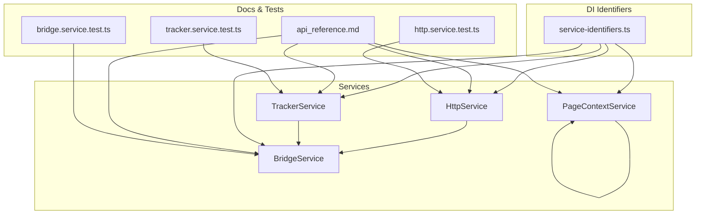
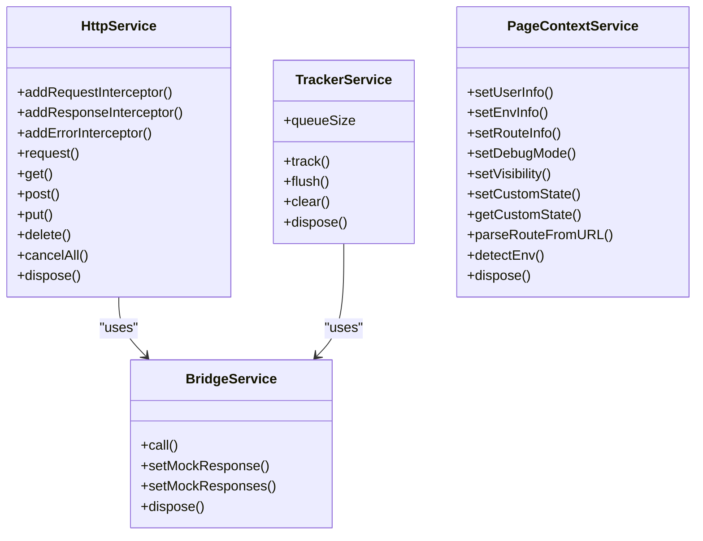
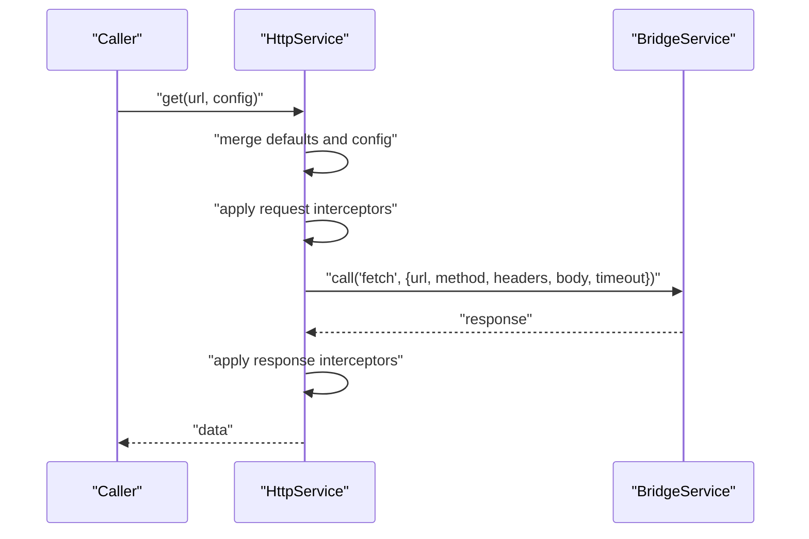
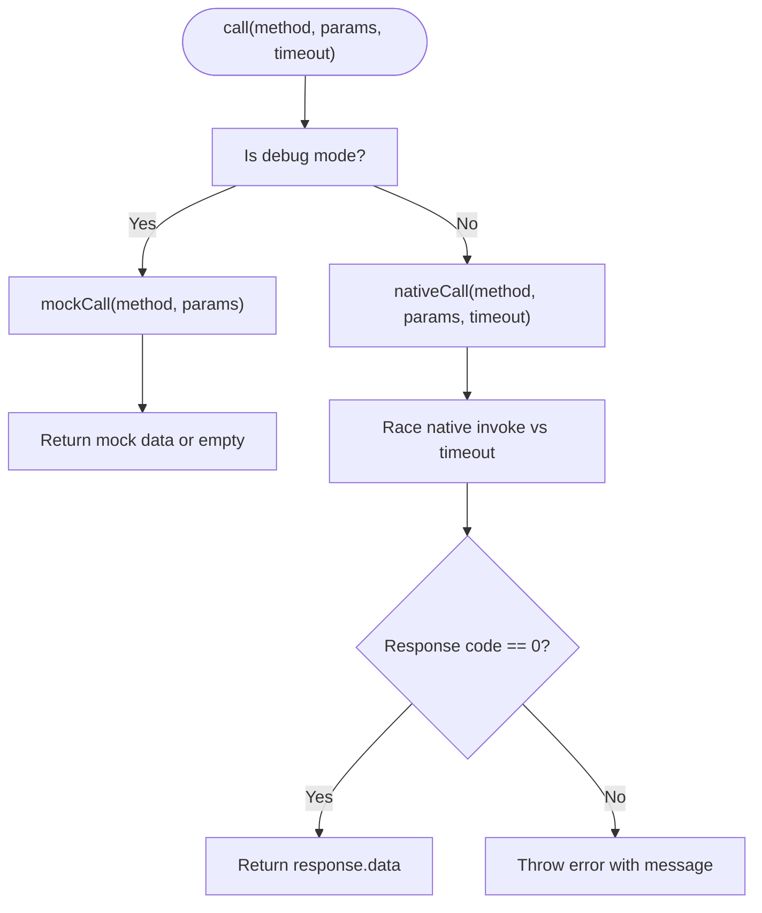
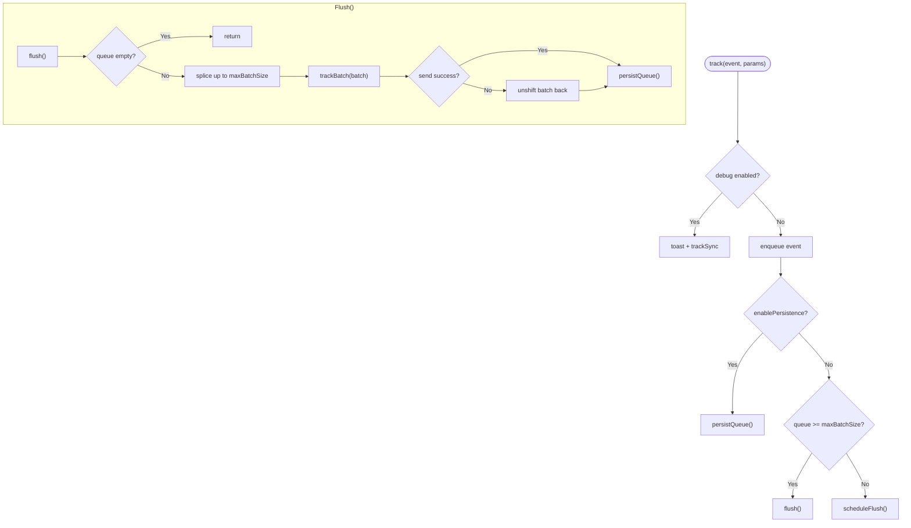
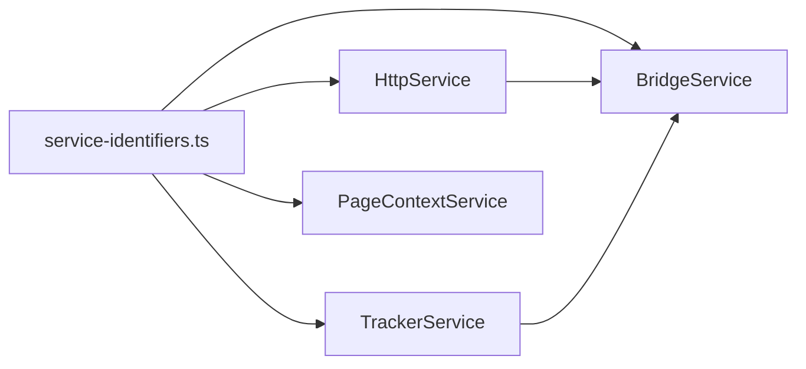

# Infrastructure Services

<cite>
**Referenced Files in This Document**
- [http.service.ts](file://packages/h5-builder/src/services/http.service.ts)
- [bridge.service.ts](file://packages/h5-builder/src/services/bridge.service.ts)
- [tracker.service.ts](file://packages/h5-builder/src/services/tracker.service.ts)
- [context.service.ts](file://packages/h5-builder/src/services/context.service.ts)
- [service-identifiers.ts](file://packages/h5-builder/src/services/service-identifiers.ts)
- [api_reference.md](file://packages/h5-builder/docs/api_reference.md)
- [http.service.test.ts](file://packages/h5-builder/src/__tests__/http.service.test.ts)
- [bridge.service.test.ts](file://packages/h5-builder/src/__tests__/bridge.service.test.ts)
- [tracker.service.test.ts](file://packages/h5-builder/src/__tests__/tracker.service.test.ts)
- [product-card.model.ts](file://packages/h5-builder/src/components/product-card/product-card.model.ts)
</cite>

## Table of Contents
1. [Introduction](#introduction)
2. [Project Structure](#project-structure)
3. [Core Components](#core-components)
4. [Architecture Overview](#architecture-overview)
5. [Detailed Component Analysis](#detailed-component-analysis)
6. [Dependency Analysis](#dependency-analysis)
7. [Performance Considerations](#performance-considerations)
8. [Troubleshooting Guide](#troubleshooting-guide)
9. [Conclusion](#conclusion)
10. [Appendices](#appendices)

## Introduction
This document provides comprehensive documentation for the Infrastructure Services in the project, focusing on HttpService, BridgeService, TrackerService, and ContextService. It explains each service’s purpose, public API, configuration options, usage patterns, and integration examples. Special attention is given to how HttpService integrates with BridgeService for native calls and how interceptors shape request/response flows. TrackerService’s batching and persistence features are documented alongside ContextService’s role in managing user, environment, and route information. Practical examples are drawn from the API reference and component models to illustrate real-world usage.

## Project Structure
The Infrastructure Services reside under the H5 Builder package and are organized by feature. They are supported by a dependency injection system and tested with Vitest. The API Reference provides usage examples and method signatures for quick integration.

**Diagram sources**
- [http.service.ts](file://packages/h5-builder/src/services/http.service.ts#L1-L281)
- [bridge.service.ts](file://packages/h5-builder/src/services/bridge.service.ts#L1-L227)
- [tracker.service.ts](file://packages/h5-builder/src/services/tracker.service.ts#L1-L290)
- [context.service.ts](file://packages/h5-builder/src/services/context.service.ts#L1-L187)
- [service-identifiers.ts](file://packages/h5-builder/src/services/service-identifiers.ts#L1-L20)
- [api_reference.md](file://packages/h5-builder/docs/api_reference.md#L276-L501)
- [http.service.test.ts](file://packages/h5-builder/src/__tests__/http.service.test.ts#L1-L252)
- [bridge.service.test.ts](file://packages/h5-builder/src/__tests__/bridge.service.test.ts#L1-L132)
- [tracker.service.test.ts](file://packages/h5-builder/src/__tests__/tracker.service.test.ts#L1-L226)

**Section sources**
- [service-identifiers.ts](file://packages/h5-builder/src/services/service-identifiers.ts#L1-L20)
- [api_reference.md](file://packages/h5-builder/docs/api_reference.md#L276-L501)

## Core Components
- HttpService: HTTP client built on top of BridgeService, offering request/response/error interceptors, query parameter handling, and request cancellation.
- BridgeService: Unified adapter for JSBridge calls with native and mock modes, timeout handling, and helper methods for common operations.
- TrackerService: Event queue manager with batching, scheduling, debug mode, and optional persistence to localStorage.
- PageContextService: Shared page-level state for user, environment, route, visibility, and custom state, with environment detection and URL parsing.

**Section sources**
- [http.service.ts](file://packages/h5-builder/src/services/http.service.ts#L1-L281)
- [bridge.service.ts](file://packages/h5-builder/src/services/bridge.service.ts#L1-L227)
- [tracker.service.ts](file://packages/h5-builder/src/services/tracker.service.ts#L1-L290)
- [context.service.ts](file://packages/h5-builder/src/services/context.service.ts#L1-L187)

## Architecture Overview
The services integrate as follows:
- HttpService depends on BridgeService to perform network requests via a unified JSBridge interface.
- TrackerService depends on BridgeService to send batched or synchronous events to native analytics.
- ContextService provides shared state consumed by components and services.
- Dependency Injection identifiers enable constructor injection of services.

**Diagram sources**
- [http.service.ts](file://packages/h5-builder/src/services/http.service.ts#L1-L281)
- [bridge.service.ts](file://packages/h5-builder/src/services/bridge.service.ts#L1-L227)
- [tracker.service.ts](file://packages/h5-builder/src/services/tracker.service.ts#L1-L290)
- [context.service.ts](file://packages/h5-builder/src/services/context.service.ts#L1-L187)

## Detailed Component Analysis

### HttpService
Purpose:
- Provides a high-level HTTP client abstraction over BridgeService, enabling interceptors, query parameter handling, timeouts, and request cancellation.

Public API:
- Interceptors:
  - addRequestInterceptor(interceptor): Adds a request interceptor returning a cleanup function.
  - addResponseInterceptor(interceptor): Adds a response interceptor returning a cleanup function.
  - addErrorInterceptor(interceptor): Adds an error interceptor returning a cleanup function.
- Request methods:
  - request(config): Core request method merging defaults and config, applying interceptors, and delegating to BridgeService via fetch.
  - get(url, config?), post(url, data?, config?), put(url, data?, config?), delete(url, config?): Convenience methods.
- Utilities:
  - cancelAll(): Aborts all pending requests.
  - dispose(): Cancels pending requests, clears interceptors, and disposes resources.

Configuration:
- Constructor options:
  - baseURL?: string to prepend to relative URLs.
  - token?: string to add Authorization header automatically.

Behavior highlights:
- Default configuration includes method GET, 10s timeout, and JSON Content-Type header.
- Query parameters are appended to the URL.
- Requests are sent via BridgeService.call('fetch', payload) with timeout support.
- Interceptors are executed in order: request -> native call -> response -> error.

Usage patterns:
- Add interceptors for auth headers, logging, or request transformation.
- Use convenience methods for CRUD operations.
- Cancel in-flight requests during navigation or component teardown.

Integration with BridgeService:
- HttpService delegates actual network calls to BridgeService.call('fetch', ...), allowing seamless switching between native and mock environments.

Practical examples:
- Basic GET/POST/PUT/DELETE requests with mocked responses.
- Query parameter appending and interceptor chaining.
- Token and baseURL interceptors.

**Section sources**
- [http.service.ts](file://packages/h5-builder/src/services/http.service.ts#L1-L281)
- [api_reference.md](file://packages/h5-builder/docs/api_reference.md#L323-L400)
- [http.service.test.ts](file://packages/h5-builder/src/__tests__/http.service.test.ts#L1-L252)

#### HttpService Sequence with BridgeService

**Diagram sources**
- [http.service.ts](file://packages/h5-builder/src/services/http.service.ts#L144-L203)
- [bridge.service.ts](file://packages/h5-builder/src/services/bridge.service.ts#L55-L118)

### BridgeService
Purpose:
- Unified adapter for JSBridge invocations with native and mock modes, timeout handling, and helper methods.

Public API:
- call(method, params?, timeout?): Invokes a native method or returns mock data in debug mode.
- setMockResponse(method, data?) / setMockResponses(map): Configures mock responses for testing.
- Helpers:
  - BridgeHelpers.getUserInfo(), toast(), navigate(), share(), fetch(): Convenience wrappers around call.

Configuration:
- Constructor isDebug?: Enables mock mode when NativeBridge is unavailable or explicitly requested.

Behavior highlights:
- Native mode validates response code and throws on failures.
- Mock mode simulates latency and returns configured responses or empty objects.
- Timeout handling races the native invocation against a timer.

Usage patterns:
- Use BridgeService(true) for browser debugging with mock data.
- Use BridgeService(false) with window.NativeBridge for production.

Practical examples:
- Mock mode with custom responses and batched configuration.
- Native mode with error propagation and timeout handling.
- BridgeHelpers for common operations like toast and navigation.

**Section sources**
- [bridge.service.ts](file://packages/h5-builder/src/services/bridge.service.ts#L1-L227)
- [api_reference.md](file://packages/h5-builder/docs/api_reference.md#L276-L322)
- [bridge.service.test.ts](file://packages/h5-builder/src/__tests__/bridge.service.test.ts#L1-L132)

#### BridgeService Flowchart

**Diagram sources**
- [bridge.service.ts](file://packages/h5-builder/src/services/bridge.service.ts#L55-L118)

### TrackerService
Purpose:
- Manages event queueing, batching, scheduling, and persistence for analytics reporting.

Public API:
- track(event, params?): Enqueues an event or sends immediately in debug mode.
- flush(): Sends up to maxBatchSize events to native via trackBatch.
- clear(): Empties queue and removes persisted data.
- queueSize: Getter for current queue length.
- dispose(): Clears timers, flushes remaining events, and disposes resources.

Configuration:
- debug?: boolean to enable immediate sync sending and toast notifications.
- maxBatchSize?: number for batch size (default 20).
- flushInterval?: number for flush scheduling (default 5000 ms).
- enablePersistence?: boolean to persist queue to localStorage.
- storageKey?: string for localStorage key.

Behavior highlights:
- Debug mode: Sends via toast and trackSync, then synchronously invokes trackSync.
- Production mode: Queues events, persists when enabled, schedules flush, and retries on failures.
- Persistence: Restores queue from localStorage on initialization and updates on flush.

Usage patterns:
- Use TrackerHelpers for common events (page view, exposure, click, error, performance).
- Configure batching and persistence for reliability and performance.
- Clear queue when resetting analytics state.

Practical examples:
- Immediate debug sending and toast feedback.
- Batch flushing on size threshold or interval.
- Persistence across page reloads and clearing persisted data.

**Section sources**
- [tracker.service.ts](file://packages/h5-builder/src/services/tracker.service.ts#L1-L290)
- [api_reference.md](file://packages/h5-builder/docs/api_reference.md#L401-L456)
- [tracker.service.test.ts](file://packages/h5-builder/src/__tests__/tracker.service.test.ts#L1-L226)

#### TrackerService Flowchart

**Diagram sources**
- [tracker.service.ts](file://packages/h5-builder/src/services/tracker.service.ts#L144-L171)

### PageContextService
Purpose:
- Provides shared page-level state for user, environment, route, visibility, and custom state, with environment detection and URL parsing.

Public API:
- setUserInfo(userInfo): Sets user info.
- setEnvInfo(envInfo): Sets environment info.
- setRouteInfo(routeInfo): Sets route info.
- setDebugMode(isDebug): Sets debug flag.
- setVisibility(isVisible): Sets page visibility.
- setCustomState(key, value) / getCustomState(key): Manage custom state.
- parseRouteFromURL(url?): Parses URL into path, query, and hash.
- detectEnv(): Detects platform and versions from user agent.

Usage patterns:
- Initialize context early in the app lifecycle.
- Update route info on navigation.
- Use detectEnv() to tailor behavior per platform.

**Section sources**
- [context.service.ts](file://packages/h5-builder/src/services/context.service.ts#L1-L187)
- [api_reference.md](file://packages/h5-builder/docs/api_reference.md#L458-L501)

## Dependency Analysis
- DI Identifiers:
  - service-identifiers.ts defines tokens for HttpService, TrackerService, BridgeService, and PageContextService to enable constructor injection.
- Service Coupling:
  - HttpService depends on BridgeService for network calls.
  - TrackerService depends on BridgeService for analytics transport.
  - ContextService is independent and stateful.
- External Dependencies:
  - window.NativeBridge is used in native mode.
  - localStorage is used by TrackerService for persistence.

**Diagram sources**
- [service-identifiers.ts](file://packages/h5-builder/src/services/service-identifiers.ts#L1-L20)
- [http.service.ts](file://packages/h5-builder/src/services/http.service.ts#L1-L281)
- [tracker.service.ts](file://packages/h5-builder/src/services/tracker.service.ts#L1-L290)
- [bridge.service.ts](file://packages/h5-builder/src/services/bridge.service.ts#L1-L227)
- [context.service.ts](file://packages/h5-builder/src/services/context.service.ts#L1-L187)

**Section sources**
- [service-identifiers.ts](file://packages/h5-builder/src/services/service-identifiers.ts#L1-L20)

## Performance Considerations
- HttpService:
  - Interceptors add overhead; keep them minimal and focused.
  - Use cancelAll() during navigation to prevent wasted work.
- BridgeService:
  - Timeout prevents hanging calls; tune based on network conditions.
  - Mock mode avoids real network calls for development.
- TrackerService:
  - Tune maxBatchSize and flushInterval to balance latency and throughput.
  - Enable persistence only when necessary to reduce local storage pressure.
- ContextService:
  - Avoid frequent deep mutations; keep state shallow and observable.

[No sources needed since this section provides general guidance]

## Troubleshooting Guide
- HttpService:
  - Verify interceptors are not mutating headers unexpectedly.
  - Use cancelAll() to abort stale requests.
  - Check error interceptors for meaningful error messages.
- BridgeService:
  - Ensure window.NativeBridge is available in native mode or instantiate with isDebug=true for mock mode.
  - Confirm timeout values are appropriate for slow networks.
- TrackerService:
  - On flush failures, events are re-enqueued; verify retry logic and persistence.
  - Clear queue and storage when debugging analytics issues.
- ContextService:
  - Parse routes carefully; ensure URL normalization.
  - Environment detection relies on user agent; validate on target platforms.

**Section sources**
- [http.service.test.ts](file://packages/h5-builder/src/__tests__/http.service.test.ts#L165-L177)
- [bridge.service.test.ts](file://packages/h5-builder/src/__tests__/bridge.service.test.ts#L47-L85)
- [tracker.service.test.ts](file://packages/h5-builder/src/__tests__/tracker.service.test.ts#L136-L155)
- [context.service.ts](file://packages/h5-builder/src/services/context.service.ts#L112-L128)

## Conclusion
The Infrastructure Services form a cohesive foundation for network requests, analytics, and shared page state. HttpService leverages BridgeService for robust, testable HTTP calls with interceptors. BridgeService abstracts native and mock environments with timeout and error handling. TrackerService provides reliable batching and persistence for analytics. PageContextService centralizes contextual state for components. Together, they enable scalable, maintainable component models and predictable runtime behavior.

[No sources needed since this section summarizes without analyzing specific files]

## Appendices

### Practical Integration Examples from Component Models
- ProductCardModel demonstrates:
  - Injecting HttpService and TrackerService via DI identifiers.
  - Using HttpService to fetch product data.
  - Using TrackerService to report exposure, loaded, and click events.

**Section sources**
- [product-card.model.ts](file://packages/h5-builder/src/components/product-card/product-card.model.ts#L1-L133)
- [service-identifiers.ts](file://packages/h5-builder/src/services/service-identifiers.ts#L1-L20)