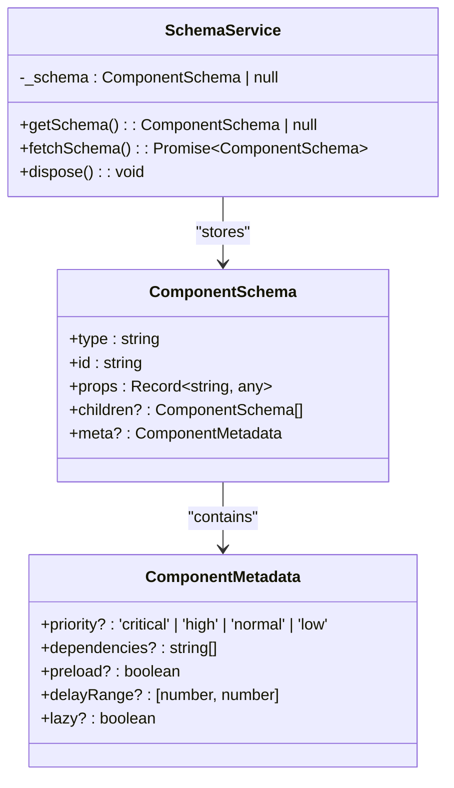
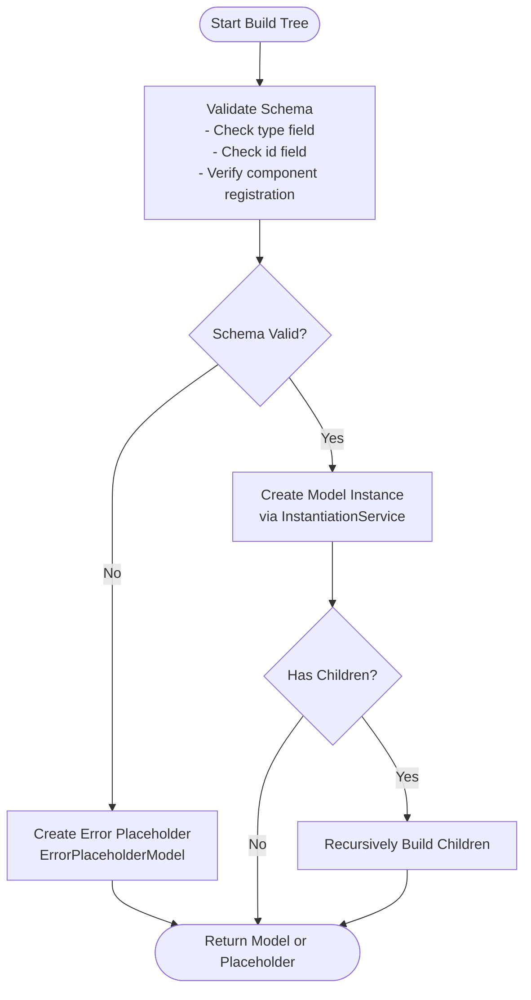
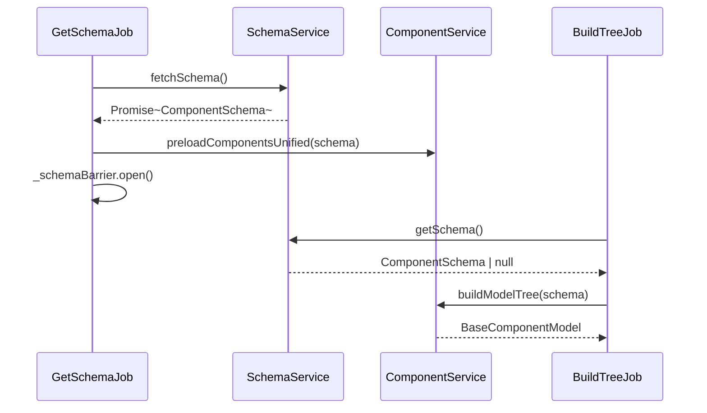
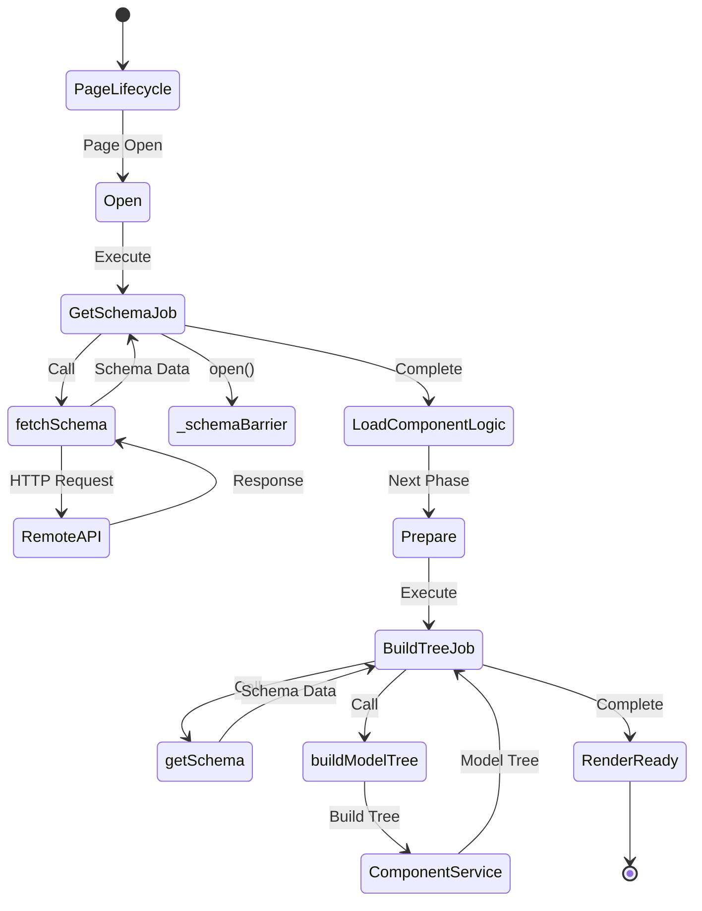
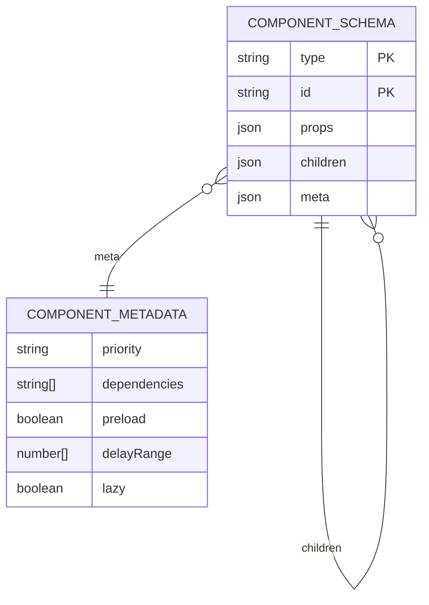

# SchemaService

<cite>
**Referenced Files in This Document**   
- [schema.service.ts](file://packages/h5-builder/src/services/schema.service.ts)
- [component.service.ts](file://packages/h5-builder/src/services/component.service.ts)
- [get-schema-job.ts](file://packages/h5-builder/src/jobs/get-schema-job.ts)
- [build-tree-job.ts](file://packages/h5-builder/src/jobs/build-tree-job.ts)
- [http.service.ts](file://packages/h5-builder/src/services/http.service.ts)
- [bridge.service.ts](file://packages/h5-builder/src/services/bridge.service.ts)
- [demo-data.ts](file://packages/h5-builder/src/mock/demo-data.ts)
- [service-identifiers.ts](file://packages/h5-builder/src/services/service-identifiers.ts)
</cite>

## Table of Contents
1. [Introduction](#introduction)
2. [Core Responsibilities](#core-responsibilities)
3. [Schema Validation and Error Handling](#schema-validation-and-error-handling)
4. [Integration with ComponentService](#integration-with-componentservice)
5. [Remote Schema Fetching and Caching](#remote-schema-fetching-and-caching)
6. [Lifecycle Integration](#lifecycle-integration)
7. [Schema Structure and Design](#schema-structure-and-design)
8. [Best Practices for Schema Design](#best-practices-for-schema-design)
9. [Common Issues and Troubleshooting](#common-issues-and-troubleshooting)
10. [Performance Considerations](#performance-considerations)

## Introduction

The SchemaService is a core infrastructure component in the MobX H5 Builder framework responsible for managing component schemas throughout the application lifecycle. It serves as the central authority for schema retrieval, storage, and access, playing a critical role in the page rendering pipeline. The service acts as an intermediary between remote schema sources and the local component construction system, ensuring that schema data is properly loaded and available when needed for model tree construction.

As demonstrated in the codebase, SchemaService follows the disposable pattern and is integrated into the dependency injection system through the ISchemaService identifier. It works in concert with other services like ComponentService and HttpService to enable dynamic UI construction based on declarative schema definitions. The service's primary responsibility is to fetch and provide component schemas that define the structure, type, properties, and hierarchy of UI components to be rendered on a page.

**Section sources**
- [schema.service.ts](file://packages/h5-builder/src/services/schema.service.ts#L7-L38)
- [service-identifiers.ts](file://packages/h5-builder/src/services/service-identifiers.ts#L19)

## Core Responsibilities

The SchemaService has three primary responsibilities in the application architecture: schema retrieval, schema storage, and schema access. The service provides a clean interface for obtaining component schemas that define the structure of the user interface. Its main public methods include `fetchSchema()` for retrieving schema data and `getSchema()` for accessing the currently loaded schema.

The `fetchSchema()` method returns a Promise that resolves to a ComponentSchema object, indicating that schema retrieval is an asynchronous operation. In the current implementation, this method contains mock logic that simulates network latency before resolving with sample schema data. This design allows the service to be easily extended to support actual remote fetching through the HttpService. The service stores the retrieved schema in its private `_schema` property, which can then be accessed by other components through the `getSchema()` method.

This separation of concerns allows the SchemaService to abstract away the complexities of schema retrieval while providing a consistent interface for schema access throughout the application. Other components can depend on the SchemaService without needing to know whether the schema comes from a remote API, local storage, or mock data.



**Diagram sources**
- [schema.service.ts](file://packages/h5-builder/src/services/schema.service.ts#L7-L38)
- [component.service.ts](file://packages/h5-builder/src/services/component.service.ts#L31-L46)

**Section sources**
- [schema.service.ts](file://packages/h5-builder/src/services/schema.service.ts#L7-L38)
- [component.service.ts](file://packages/h5-builder/src/services/component.service.ts#L31-L46)

## Schema Validation and Error Handling

While the current SchemaService implementation focuses on schema retrieval, schema validation is handled by the ComponentService during the model tree construction process. The validation logic ensures that schemas meet the required structural criteria before components are instantiated. Key validation checks include verifying the presence of required fields like `type` and `id`, and confirming that the specified component type has been registered with the system.

When validation fails, the system creates error placeholder components to maintain application stability. For example, if a schema references an unknown component type, the build process will substitute an ErrorPlaceholderModel instead of failing completely. This graceful error handling allows the application to continue rendering while providing visual feedback about the problematic component.

The validation process occurs during the `buildTree` method execution in ComponentService, where each schema node is validated before its corresponding model is created. This ensures that only valid schemas result in actual component instances. The system also handles missing required fields like `type` or `id` by creating appropriate error placeholders, preventing runtime errors from propagating through the component hierarchy.



**Diagram sources**
- [component.service.ts](file://packages/h5-builder/src/services/component.service.ts#L214-L225)
- [component.service.ts](file://packages/h5-builder/src/services/component.service.ts#L231-L243)
- [placeholder/index.ts](file://packages/h5-builder/src/placeholder/index.ts#L6-L11)

**Section sources**
- [component.service.ts](file://packages/h5-builder/src/services/component.service.ts#L214-L243)
- [placeholder/index.ts](file://packages/h5-builder/src/placeholder/index.ts#L6-L11)

## Integration with ComponentService

The SchemaService works closely with the ComponentService to enable dynamic UI construction. This integration follows a clear sequence: first, the SchemaService retrieves the component schema, then the ComponentService uses this schema to build the model tree. The relationship between these services is orchestrated through dependency injection, with both services registered in the DI container and accessible via their respective service identifiers.

The ComponentService's `buildModelTree` method depends on the SchemaService's `getSchema()` method to obtain the schema data needed for tree construction. This dependency is established through the BuildTreeJob, which injects both services and coordinates their interaction during the page preparation phase. When the BuildTreeJob executes, it first retrieves the schema from SchemaService and then passes it to ComponentService for model tree construction.

This separation of concerns allows each service to focus on its specific responsibility: SchemaService manages data retrieval, while ComponentService handles component instantiation and tree building. The integration is designed to be asynchronous, with proper error handling to manage cases where the schema is not available when needed.



**Diagram sources**
- [get-schema-job.ts](file://packages/h5-builder/src/jobs/get-schema-job.ts#L48-L65)
- [build-tree-job.ts](file://packages/h5-builder/src/jobs/build-tree-job.ts#L46-L57)
- [component.service.ts](file://packages/h5-builder/src/services/component.service.ts#L724-L728)

**Section sources**
- [get-schema-job.ts](file://packages/h5-builder/src/jobs/get-schema-job.ts#L48-L65)
- [build-tree-job.ts](file://packages/h5-builder/src/jobs/build-tree-job.ts#L46-L57)
- [component.service.ts](file://packages/h5-builder/src/services/component.service.ts#L724-L728)

## Remote Schema Fetching and Caching

Although the current SchemaService implementation uses mock data, its design supports remote schema fetching through integration with the HttpService and BridgeService. The `fetchSchema()` method's Promise-based interface is designed to accommodate actual network requests, and the service can be extended to use the HttpService for making API calls to retrieve schema data from remote endpoints.

The caching mechanism is implicit in the service's design: once a schema is fetched, it is stored in the `_schema` property and can be accessed multiple times without re-fetching. This provides a basic level of caching that prevents redundant network requests. For more sophisticated caching strategies, the service could be extended to integrate with browser storage mechanisms or implement time-based cache invalidation.

The BridgeService provides a unified interface for native functionality, including network requests, which can be used to fetch schema data in mobile environments. In browser environments, the system can fall back to standard fetch APIs or use the HttpService's JSBridge implementation. The mock mode in BridgeService allows for development and testing without requiring a native environment, making it easier to work with schema data during development.

```mermaid
graph TB
subgraph "Remote Schema Fetching"
Client[Application] --> |fetchSchema()| SchemaService
SchemaService --> |HTTP Request| HttpService
HttpService --> |invoke fetch| BridgeService
BridgeService --> |NativeBridge| NativeApp
NativeApp --> |Response| BridgeService
BridgeService --> |Response| HttpService
HttpService --> |Schema Data| SchemaService
SchemaService --> |Store in _schema| Cache[(Schema Cache)]
SchemaService --> |Return Schema| Client
end
subgraph "Mock Environment"
Client --> |fetchSchema()| SchemaService
SchemaService --> |Simulate Delay| Timer
Timer --> |Return Mock Data| SchemaService
SchemaService --> |Return Schema| Client
end
```

**Diagram sources**
- [schema.service.ts](file://packages/h5-builder/src/services/schema.service.ts#L23-L32)
- [http.service.ts](file://packages/h5-builder/src/services/http.service.ts#L147-L202)
- [bridge.service.ts](file://packages/h5-builder/src/services/bridge.service.ts#L55-L118)

**Section sources**
- [schema.service.ts](file://packages/h5-builder/src/services/schema.service.ts#L23-L32)
- [http.service.ts](file://packages/h5-builder/src/services/http.service.ts#L147-L202)
- [bridge.service.ts](file://packages/h5-builder/src/services/bridge.service.ts#L55-L118)

## Lifecycle Integration

The SchemaService is tightly integrated into the application's page lifecycle through the job scheduling system. The GetSchemaJob is responsible for initiating schema retrieval during the Open phase of the PageLifecycle, ensuring that schema data is available before model tree construction begins. This job-based architecture allows for proper sequencing of operations and provides hooks for monitoring and debugging.

The GetSchemaJob uses a Barrier pattern to coordinate the completion of schema fetching with other initialization tasks. When the schema fetch completes, the job opens the barrier, signaling that subsequent jobs like BuildTreeJob can proceed. This synchronization mechanism ensures that the model tree is not constructed until the schema is fully loaded, preventing race conditions and ensuring data consistency.

The lifecycle integration also includes performance monitoring through console timing measurements. The GetSchemaJob logs the duration of schema fetching, providing valuable insights into performance bottlenecks. This instrumentation helps developers identify and address issues related to schema retrieval speed, which can significantly impact the overall page load time.



**Diagram sources**
- [get-schema-job.ts](file://packages/h5-builder/src/jobs/get-schema-job.ts#L27-L65)
- [build-tree-job.ts](file://packages/h5-builder/src/jobs/build-tree-job.ts#L33-L57)
- [lifecycle.ts](file://packages/h5-builder/src/jobs/lifecycle.ts)

**Section sources**
- [get-schema-job.ts](file://packages/h5-builder/src/jobs/get-schema-job.ts#L27-L65)
- [build-tree-job.ts](file://packages/h5-builder/src/jobs/build-tree-job.ts#L33-L57)

## Schema Structure and Design

The component schema structure follows a hierarchical tree pattern that mirrors the UI component hierarchy. Each schema node contains essential information for component instantiation, including the component type, unique ID, properties, and optional children. The type field specifies which component class should be instantiated, while the id provides a unique identifier for the component instance.

The props field contains the configuration data that will be passed to the component during initialization. This can include any serializable data needed to configure the component's behavior and appearance. The children field enables nested component structures, allowing for complex UI layouts with containers and their child components.

The optional meta field provides additional configuration for advanced features like loading priority, dependencies, and preloading behavior. This metadata enables sophisticated loading strategies and dependency management, allowing the system to optimize component loading based on priority and inter-component dependencies. The schema design supports both simple leaf components and complex container components with nested children.



**Diagram sources**
- [component.service.ts](file://packages/h5-builder/src/services/component.service.ts#L31-L46)
- [component.service.ts](file://packages/h5-builder/src/services/component.service.ts#L11-L26)

**Section sources**
- [component.service.ts](file://packages/h5-builder/src/services/component.service.ts#L31-L46)
- [demo-data.ts](file://packages/h5-builder/src/mock/demo-data.ts#L11-L333)

## Best Practices for Schema Design

Effective schema design follows several key principles to ensure maintainability, performance, and reliability. First, schemas should have a clear and consistent structure with meaningful type names and IDs. Component types should follow a consistent naming convention that makes their purpose clear, while IDs should be unique within the component tree to prevent conflicts.

Modularization is crucial for complex UIs. Large schemas should be broken down into smaller, reusable components rather than creating monolithic schema definitions. This promotes component reuse and makes the schema easier to maintain. The metadata system supports this by allowing configuration of loading priorities and dependencies between components.

Documentation is essential for team collaboration. Schemas should be well-documented with comments explaining the purpose of each component and its configuration options. The use of TypeScript interfaces for schema definitions provides built-in documentation and enables type checking, reducing errors during development.

For performance optimization, schemas should be designed with lazy loading in mind. Non-critical components can be marked with lower priority or configured for lazy loading to improve initial page load performance. The dependency system allows for intelligent loading sequences that respect component interdependencies while optimizing for perceived performance.

**Section sources**
- [component.service.ts](file://packages/h5-builder/src/services/component.service.ts#L11-L26)
- [demo-data.ts](file://packages/h5-builder/src/mock/demo-data.ts#L11-L333)

## Common Issues and Troubleshooting

Several common issues can arise when working with the SchemaService and component schemas. Invalid schema formats are a frequent source of problems, typically manifesting as missing required fields like type or id. These issues are caught during validation and result in error placeholder components being rendered instead of the intended component.

Version compatibility issues can occur when the schema structure evolves but client code expects an older format. To mitigate this, schemas should include version information and the system should implement backward compatibility where possible. Schema validation should include version checks and provide clear error messages when incompatible schemas are encountered.

Performance bottlenecks in large schema processing can be addressed through several strategies. For very large schemas, consider implementing pagination or virtualization at the schema level, loading only the portions of the schema needed for the current view. The current system's preloading mechanism with priority-based loading helps mitigate performance issues by loading critical components first.

When troubleshooting schema-related issues, developers should check the console output for validation errors and examine the network requests to verify that the correct schema is being retrieved. The instrumentation in the GetSchemaJob and BuildTreeJob provides valuable timing information that can help identify performance bottlenecks in the schema processing pipeline.

**Section sources**
- [component.service.ts](file://packages/h5-builder/src/services/component.service.ts#L214-L243)
- [get-schema-job.ts](file://packages/h5-builder/src/jobs/get-schema-job.ts#L50-L54)
- [build-tree-job.ts](file://packages/h5-builder/src/jobs/build-tree-job.ts#L53-L56)

## Performance Considerations

The SchemaService and associated components are designed with performance in mind, but several considerations should be addressed for optimal performance. The asynchronous nature of schema fetching prevents blocking the main thread, but network latency can impact perceived performance. Implementing proper loading states and skeleton screens can improve user experience during schema retrieval.

For large schemas, the model tree construction process can be computationally expensive. The current implementation builds the tree synchronously once all component modules are loaded, which is efficient but could be optimized further for very large trees. Consider implementing incremental tree building or using Web Workers for tree construction in performance-critical applications.

Caching strategies can significantly improve performance. In addition to the in-memory caching provided by the SchemaService, consider implementing persistent caching using localStorage or IndexedDB to avoid repeated network requests for unchanged schemas. Cache invalidation strategies should be carefully designed to balance performance with data freshness.

The priority-based preloading system helps optimize resource loading by ensuring critical components are loaded first. This progressive loading approach improves perceived performance by rendering important content quickly while less critical components load in the background. Monitoring and adjusting component priorities based on usage patterns can further optimize the loading sequence.

**Section sources**
- [get-schema-job.ts](file://packages/h5-builder/src/jobs/get-schema-job.ts#L62-L64)
- [component.service.ts](file://packages/h5-builder/src/services/component.service.ts#L679-L695)
- [build-tree-job.ts](file://packages/h5-builder/src/jobs/build-tree-job.ts#L53-L56)