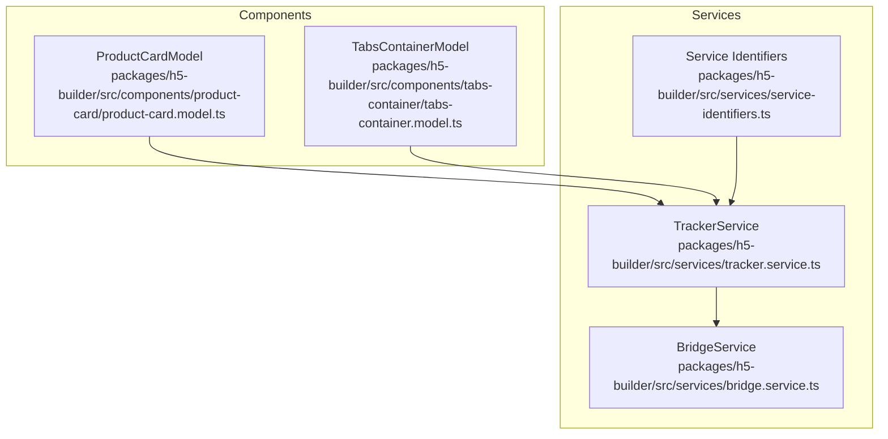
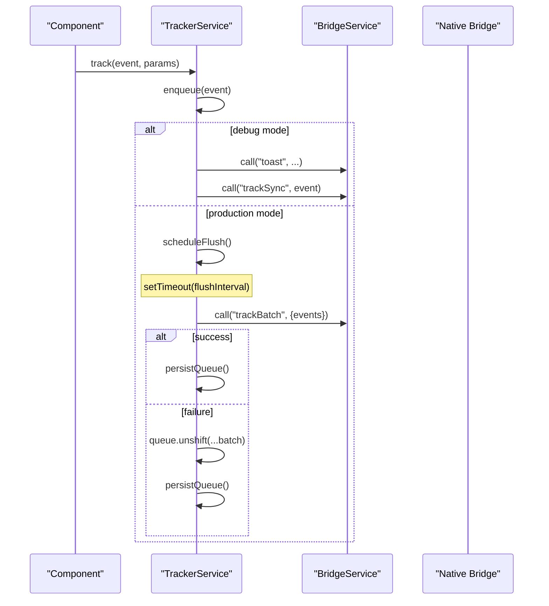
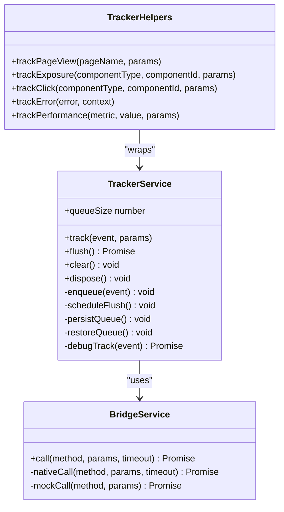
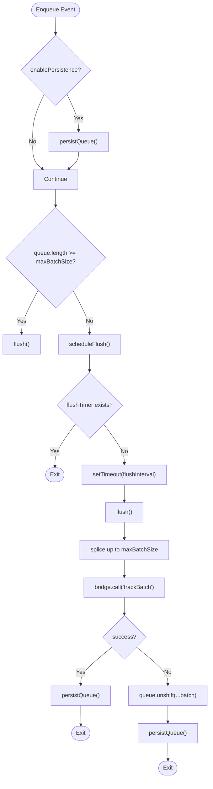
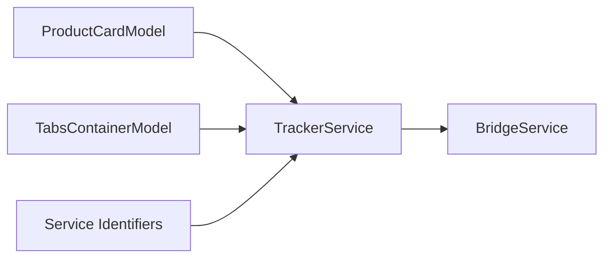

# TrackerService

<cite>
**Referenced Files in This Document**
- [tracker.service.ts](file://packages/h5-builder/src/services/tracker.service.ts)
- [tracker.service.test.ts](file://packages/h5-builder/src/__tests__/tracker.service.test.ts)
- [bridge.service.ts](file://packages/h5-builder/src/services/bridge.service.ts)
- [service-identifiers.ts](file://packages/h5-builder/src/services/service-identifiers.ts)
- [product-card.model.ts](file://packages/h5-builder/src/components/product-card/product-card.model.ts)
- [tabs-container.model.ts](file://packages/h5-builder/src/components/tabs-container/tabs-container.model.ts)
</cite>

## Table of Contents
1. [Introduction](#introduction)
2. [Project Structure](#project-structure)
3. [Core Components](#core-components)
4. [Architecture Overview](#architecture-overview)
5. [Detailed Component Analysis](#detailed-component-analysis)
6. [Dependency Analysis](#dependency-analysis)
7. [Performance Considerations](#performance-considerations)
8. [Troubleshooting Guide](#troubleshooting-guide)
9. [Conclusion](#conclusion)
10. [Appendices](#appendices)

## Introduction
This document explains the TrackerService infrastructure component responsible for analytics tracking in the project. It covers batching, persistence, and flush mechanisms, public APIs (track, flush, clear), configuration options, integration patterns with lifecycle hooks, and practical guidance for performance and privacy compliance.

## Project Structure
TrackerService lives under the services module and integrates with a bridge service to communicate with native environments. Components consume TrackerService via dependency injection to report lifecycle and user interaction events.

**Diagram sources**
- [tracker.service.ts](file://packages/h5-builder/src/services/tracker.service.ts#L1-L228)
- [bridge.service.ts](file://packages/h5-builder/src/services/bridge.service.ts#L1-L169)
- [service-identifiers.ts](file://packages/h5-builder/src/services/service-identifiers.ts#L1-L19)
- [product-card.model.ts](file://packages/h5-builder/src/components/product-card/product-card.model.ts#L1-L133)
- [tabs-container.model.ts](file://packages/h5-builder/src/components/tabs-container/tabs-container.model.ts#L1-L273)

**Section sources**
- [tracker.service.ts](file://packages/h5-builder/src/services/tracker.service.ts#L1-L228)
- [bridge.service.ts](file://packages/h5-builder/src/services/bridge.service.ts#L1-L169)
- [service-identifiers.ts](file://packages/h5-builder/src/services/service-identifiers.ts#L1-L19)
- [product-card.model.ts](file://packages/h5-builder/src/components/product-card/product-card.model.ts#L1-L133)
- [tabs-container.model.ts](file://packages/h5-builder/src/components/tabs-container/tabs-container.model.ts#L1-L273)

## Core Components
- TrackerService: Central analytics service with event queueing, batching, scheduling, persistence, and disposal.
- BridgeService: Abstraction over native bridge calls; used by TrackerService to send batches and debug messages.
- TrackerHelpers: Convenience wrappers around common analytics events (page view, exposure, click, error, performance).
- Service identifiers: DI tokens for injecting TrackerService into components.

Key responsibilities:
- Queue events and flush them in batches.
- Respect flush interval and batch size thresholds.
- Optionally persist queue to localStorage and restore on startup.
- Provide debug mode to immediately send events and show feedback.
- Clean up timers and flush on disposal.

**Section sources**
- [tracker.service.ts](file://packages/h5-builder/src/services/tracker.service.ts#L1-L228)
- [tracker.service.test.ts](file://packages/h5-builder/src/__tests__/tracker.service.test.ts#L1-L225)
- [bridge.service.ts](file://packages/h5-builder/src/services/bridge.service.ts#L1-L169)
- [service-identifiers.ts](file://packages/h5-builder/src/services/service-identifiers.ts#L1-L19)

## Architecture Overview
TrackerService orchestrates event tracking by:
- Enqueuing events and scheduling flushes.
- Flushing batches to the native bridge.
- Persisting queue state when enabled.
- Cleaning up timers and sending remaining events on disposal.

**Diagram sources**
- [tracker.service.ts](file://packages/h5-builder/src/services/tracker.service.ts#L71-L171)
- [bridge.service.ts](file://packages/h5-builder/src/services/bridge.service.ts#L55-L101)

## Detailed Component Analysis

### TrackerService API and Behavior
Public methods:
- track(event, params): Adds an event to the queue. In debug mode, sends synchronously and shows a toast.
- flush(): Sends up to maxBatchSize events from the front of the queue to the bridge. On success, persists queue; on failure, re-enqueues the batch and persists.
- clear(): Empties the queue and removes persisted data if persistence is enabled.
- queueSize (getter): Current number of queued events.
- dispose(): Clears flush timer, flushes remaining events, and disposes resources.

Configuration options:
- debug: Enables immediate synchronous tracking and toast feedback.
- maxBatchSize: Maximum number of events to flush in one batch.
- flushInterval: Milliseconds to wait before flushing due to timer.
- enablePersistence: Whether to persist queue to localStorage.
- storageKey: localStorage key used for persistence.

Behavior highlights:
- Immediate flush when queue length reaches maxBatchSize.
- Single flush timer scheduled per batch; subsequent enqueues do not reschedule.
- Beforeunload handler ensures flush before navigation.
- Persistence writes on enqueue and after successful flush; restore on construction when enabled.

Integration with lifecycle hooks:
- Components inject TrackerService via DI tokens and call track in onActive, onClick handlers, and other lifecycle points.

**Section sources**
- [tracker.service.ts](file://packages/h5-builder/src/services/tracker.service.ts#L71-L228)
- [tracker.service.test.ts](file://packages/h5-builder/src/__tests__/tracker.service.test.ts#L19-L170)

### TrackerHelpers: Common Event Wrappers
Convenience methods:
- trackPageView(pageName, params)
- trackExposure(componentType, componentId, params)
- trackClick(componentType, componentId, params)
- trackError(error, context)
- trackPerformance(metric, value, params)

These delegate to track with predefined event names and structured parameters.

**Section sources**
- [tracker.service.ts](file://packages/h5-builder/src/services/tracker.service.ts#L230-L289)
- [tracker.service.test.ts](file://packages/h5-builder/src/__tests__/tracker.service.test.ts#L186-L225)

### BridgeService Integration
TrackerService uses BridgeService.call to:
- Send batches: call("trackBatch", { events })
- Debug mode: call("toast", ...) and call("trackSync", event)
- Error handling: BridgeService throws on failures; TrackerService catches and retries.

**Section sources**
- [tracker.service.ts](file://packages/h5-builder/src/services/tracker.service.ts#L90-L171)
- [bridge.service.ts](file://packages/h5-builder/src/services/bridge.service.ts#L55-L101)

### Component Lifecycle Hooks: Real-World Usage
Examples from the codebase:
- ProductCardModel.onActive: Reports exposure when the component becomes active.
- ProductCardModel.fetchData: Reports when data is loaded.
- ProductCardModel.handleClick: Reports clicks.
- TabsContainerModel.onInit: Reports initialization metrics and virtual scroll status.
- TabsContainerModel.switchTab: Reports tab switching with indices and virtual scroll status.

These demonstrate best practices:
- Track exposure on activation.
- Track data load completion.
- Track user interactions (clicks).
- Track container lifecycle and state changes.

**Section sources**
- [product-card.model.ts](file://packages/h5-builder/src/components/product-card/product-card.model.ts#L42-L117)
- [tabs-container.model.ts](file://packages/h5-builder/src/components/tabs-container/tabs-container.model.ts#L68-L203)

## Architecture Overview

**Diagram sources**
- [tracker.service.ts](file://packages/h5-builder/src/services/tracker.service.ts#L71-L289)
- [bridge.service.ts](file://packages/h5-builder/src/services/bridge.service.ts#L55-L101)

## Detailed Component Analysis

### Public Methods and Signatures
- track(event: string, params?: Record<string, any>): void
  - Adds a TrackEvent with timestamp to the queue.
  - In debug mode, immediately shows a toast and sends synchronously.
- flush(): Promise<void>
  - Splices up to maxBatchSize events from the queue and sends via bridge.
  - On success, persists queue; on failure, re-enqueues batch and persists.
- clear(): void
  - Resets queue and removes persisted data if persistence is enabled.
- queueSize: number
  - Read-only getter returning current queue length.
- dispose(): void
  - Cancels flush timer, flushes remaining events, and disposes resources.

Return values:
- track: void
- flush: Promise<void>
- clear: void
- queueSize: number
- dispose: void

Parameters:
- event: string (event name)
- params: Record<string, any> (optional event payload)
- timeout: number (passed to BridgeService.call)

**Section sources**
- [tracker.service.ts](file://packages/h5-builder/src/services/tracker.service.ts#L71-L228)

### Configuration Options
- debug: boolean
  - When true, track() sends immediately and shows a toast.
- maxBatchSize: number
  - Threshold to trigger flush by size.
- flushInterval: number (milliseconds)
  - Timer-based flush cadence.
- enablePersistence: boolean
  - Persists queue to localStorage and restores on construction.
- storageKey: string
  - localStorage key used for persistence.

Defaults:
- debug: false
- maxBatchSize: 20
- flushInterval: 5000
- enablePersistence: false
- storageKey: "h5_builder_tracker_queue"

**Section sources**
- [tracker.service.ts](file://packages/h5-builder/src/services/tracker.service.ts#L41-L66)

### Batching and Flush Mechanisms
- Enqueue behavior:
  - Append event to queue.
  - Persist if enabled.
  - If queue length reaches maxBatchSize, flush immediately.
  - Otherwise, schedule a flush timer for flushInterval.
- Flush behavior:
  - Splice up to maxBatchSize events from the front of the queue.
  - Send via bridge call("trackBatch", { events }).
  - On success, persist queue.
  - On failure, re-enqueue the batch and persist queue.
- Timer management:
  - scheduleFlush() avoids multiple concurrent timers by checking flushTimer existence.
  - dispose() clears the timer and flushes remaining events.

**Diagram sources**
- [tracker.service.ts](file://packages/h5-builder/src/services/tracker.service.ts#L107-L171)

**Section sources**
- [tracker.service.ts](file://packages/h5-builder/src/services/tracker.service.ts#L107-L171)
- [tracker.service.test.ts](file://packages/h5-builder/src/__tests__/tracker.service.test.ts#L43-L84)

### Persistence and Recovery
- On construction with enablePersistence=true, restoreQueue reads localStorage and repopulates the queue.
- On enqueue and after successful flush, persistQueue writes the current queue to localStorage.
- clear() removes persisted data when persistence is enabled.

**Section sources**
- [tracker.service.ts](file://packages/h5-builder/src/services/tracker.service.ts#L173-L207)

### Error Handling and Resilience
- BridgeService throws on native call failures or timeouts; TrackerService catches and treats flush as failed.
- On flush failure, the batch is re-enqueued and persisted, ensuring eventual delivery.
- Tests verify re-enqueue behavior and that queue remains intact after failures.

**Section sources**
- [tracker.service.ts](file://packages/h5-builder/src/services/tracker.service.ts#L144-L171)
- [bridge.service.ts](file://packages/h5-builder/src/services/bridge.service.ts#L70-L101)
- [tracker.service.test.ts](file://packages/h5-builder/src/__tests__/tracker.service.test.ts#L136-L155)

### Integration Patterns with Third-Party Analytics Platforms
- The bridge method "trackBatch" is used to send batches to the native layer. To integrate with external analytics providers, implement a bridge adapter that forwards the batch payload to the provider’s SDK.
- Ensure the provider SDK handles batching natively; otherwise, consider adjusting maxBatchSize to match provider limits.
- For privacy compliance, consider filtering sensitive fields in params before enqueue or adding a pre-send transform layer.

[No sources needed since this section provides general guidance]

## Dependency Analysis
- TrackerService depends on BridgeService for transport.
- Components depend on TrackerService via DI tokens.
- TrackerHelpers depends on TrackerService.

**Diagram sources**
- [product-card.model.ts](file://packages/h5-builder/src/components/product-card/product-card.model.ts#L29-L40)
- [tabs-container.model.ts](file://packages/h5-builder/src/components/tabs-container/tabs-container.model.ts#L36-L46)
- [tracker.service.ts](file://packages/h5-builder/src/services/tracker.service.ts#L34-L66)
- [service-identifiers.ts](file://packages/h5-builder/src/services/service-identifiers.ts#L1-L19)

**Section sources**
- [product-card.model.ts](file://packages/h5-builder/src/components/product-card/product-card.model.ts#L29-L40)
- [tabs-container.model.ts](file://packages/h5-builder/src/components/tabs-container/tabs-container.model.ts#L36-L46)
- [tracker.service.ts](file://packages/h5-builder/src/services/tracker.service.ts#L34-L66)
- [service-identifiers.ts](file://packages/h5-builder/src/services/service-identifiers.ts#L1-L19)

## Performance Considerations
- Minimizing main-thread impact:
  - Use production mode (debug=false) to batch events and avoid synchronous UI blocking.
  - Tune flushInterval to balance latency and throughput; larger intervals reduce bridge calls.
  - Adjust maxBatchSize to match provider limits and network conditions.
- Payload size optimization:
  - Keep params minimal; avoid large objects or repeated data.
  - Prefer stable identifiers (e.g., componentType, componentId) over dynamic snapshots.
- Avoid duplicate events:
  - Track exposure on activation, not on each render; ensure activation is idempotent.
  - Debounce or coalesce rapid events where appropriate.
- Network resilience:
  - Rely on flush retry behavior; do not assume immediate delivery.
  - Consider disabling persistence for high-frequency telemetry to reduce localStorage churn.

[No sources needed since this section provides general guidance]

## Troubleshooting Guide
Common issues and resolutions:
- Duplicate events:
  - Ensure exposure tracking occurs only on activation, not on every render.
  - Verify that lifecycle hooks are not being triggered multiple times unintentionally.
- Network failures during flush:
  - Confirm BridgeService is available and reachable; in debug mode, mock responses are used.
  - Review flush retry behavior; events are re-enqueued on failure.
- Privacy compliance:
  - Filter sensitive data before enqueue; consider a pre-send transform layer.
  - Honor opt-out signals by skipping track calls when disabled.
- Queue not empty on unload:
  - The beforeunload handler invokes flush; ensure BridgeService is ready and not throwing.

**Section sources**
- [tracker.service.ts](file://packages/h5-builder/src/services/tracker.service.ts#L58-L66)
- [bridge.service.ts](file://packages/h5-builder/src/services/bridge.service.ts#L55-L101)
- [tracker.service.test.ts](file://packages/h5-builder/src/__tests__/tracker.service.test.ts#L136-L155)

## Conclusion
TrackerService provides a robust, configurable foundation for analytics tracking with batching, persistence, and resilient flush behavior. By integrating with component lifecycle hooks and leveraging TrackerHelpers, teams can instrument pages, components, and interactions consistently. Tuning configuration and following best practices ensures minimal performance impact and reliable delivery.

## Appendices

### Example: Using TrackerHelpers in Components
- Use TrackerHelpers to quickly emit standardized events:
  - trackPageView, trackExposure, trackClick, trackError, trackPerformance.

**Section sources**
- [tracker.service.ts](file://packages/h5-builder/src/services/tracker.service.ts#L230-L289)
- [tracker.service.test.ts](file://packages/h5-builder/src/__tests__/tracker.service.test.ts#L186-L225)

### Example: Lifecycle Hook Integration
- ProductCardModel:
  - Exposure on activation.
  - Load completion reporting.
  - Click reporting.
- TabsContainerModel:
  - Initialization metrics and virtual scroll status.
  - Tab switching reporting.

**Section sources**
- [product-card.model.ts](file://packages/h5-builder/src/components/product-card/product-card.model.ts#L42-L117)
- [tabs-container.model.ts](file://packages/h5-builder/src/components/tabs-container/tabs-container.model.ts#L68-L203)