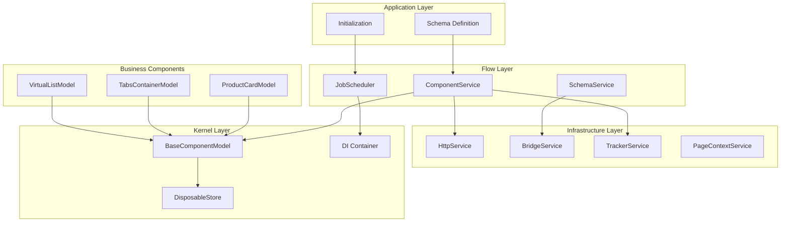
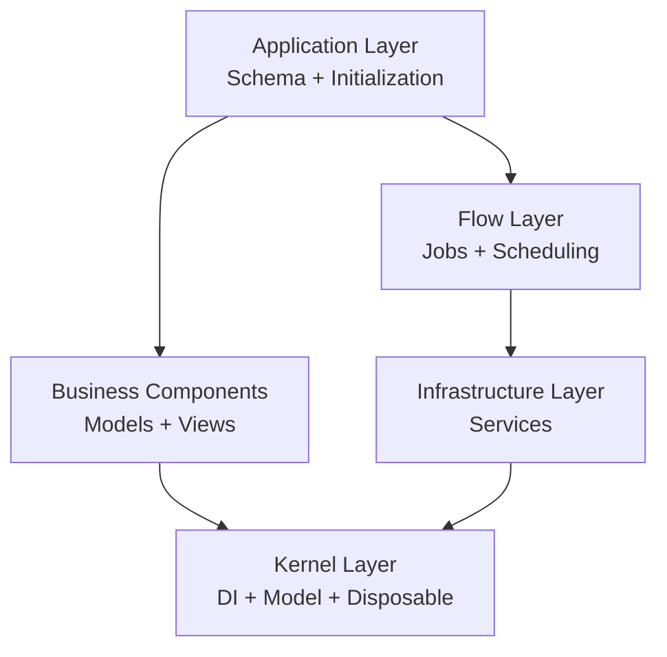
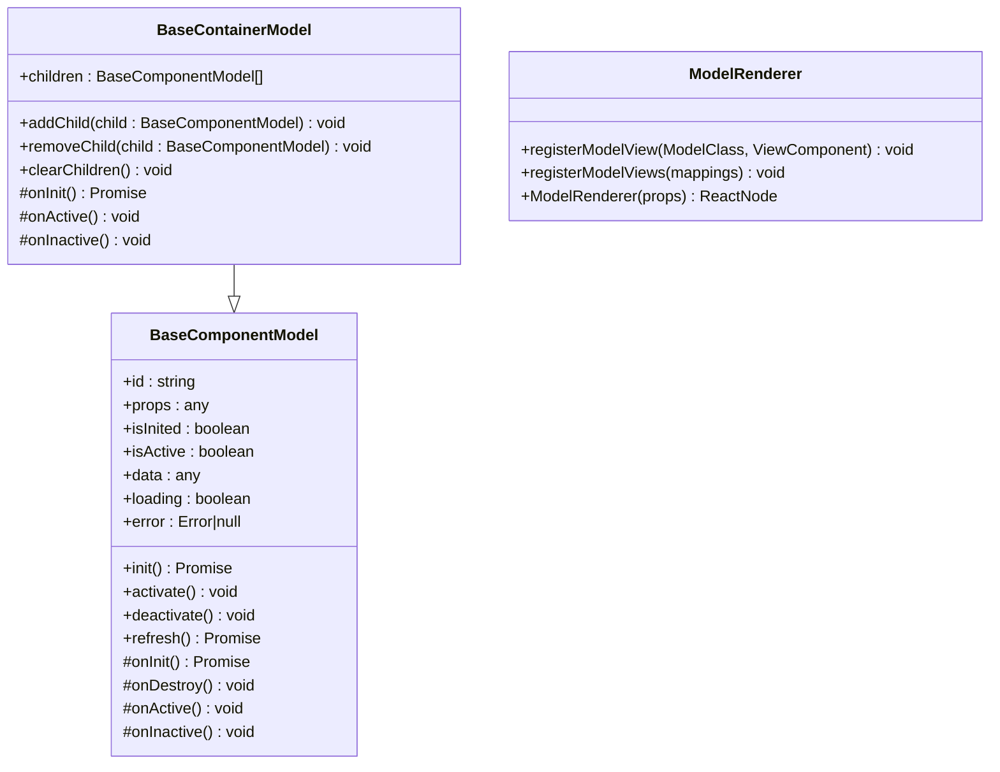
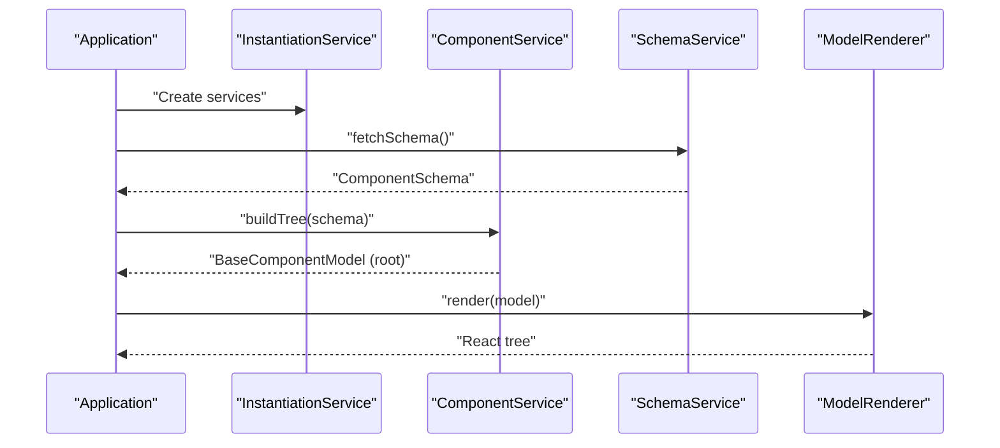
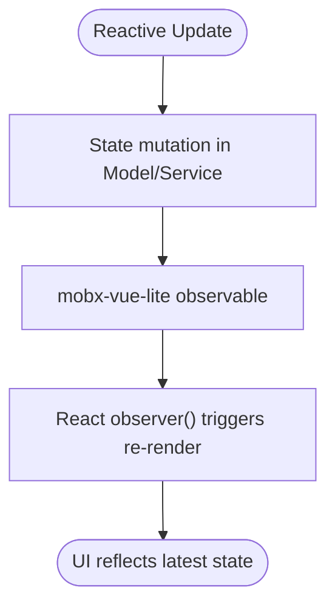
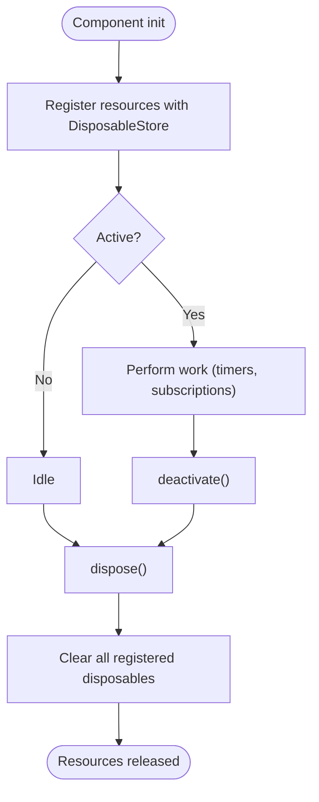
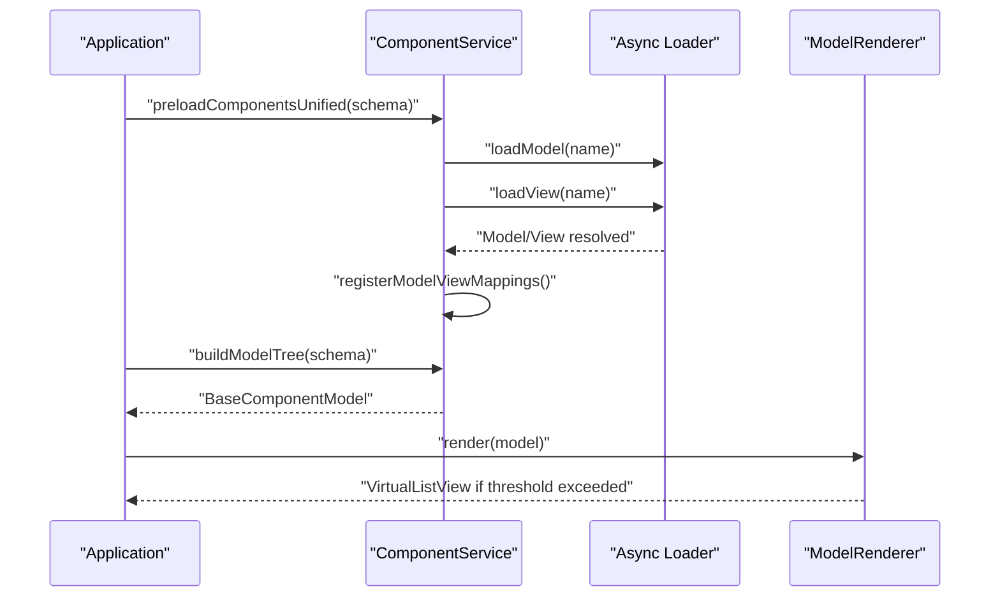
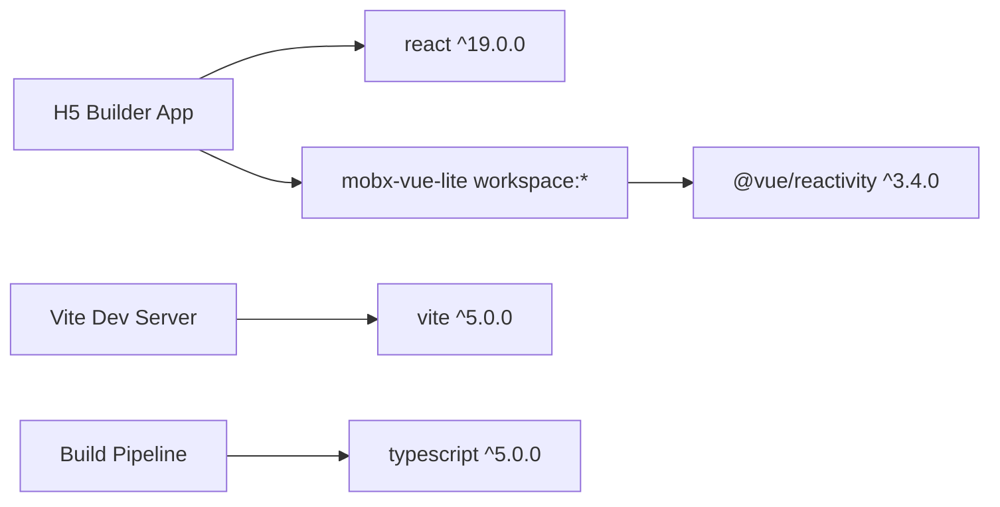

# Introduction

<cite>
**Referenced Files in This Document**
- [README.md](file://packages/h5-builder/README.md)
- [package.json](file://packages/h5-builder/package.json)
- [vite.config.ts](file://packages/h5-builder/vite.config.ts)
- [demo-progressive.tsx](file://packages/h5-builder/src/demo-progressive.tsx)
- [model.ts](file://packages/h5-builder/src/bedrock/model.ts)
- [disposable-store.ts](file://packages/h5-builder/src/bedrock/dispose/disposable-store.ts)
- [model-renderer.tsx](file://packages/h5-builder/src/components/model-renderer.tsx)
- [component.service.ts](file://packages/h5-builder/src/services/component.service.ts)
- [schema.service.ts](file://packages/h5-builder/src/services/schema.service.ts)
- [auto-virtual-scroll.md](file://packages/h5-builder/docs/auto-virtual-scroll.md)
- [virtual-list.model.ts](file://packages/h5-builder/src/components/virtual-list/virtual-list.model.ts)
- [virtual-list.view.tsx](file://packages/h5-builder/src/components/virtual-list/virtual-list.view.tsx)
- [demo-data.ts](file://packages/h5-builder/src/mock/demo-data.ts)
- [index.ts](file://packages/mobx-vue-lite/src/index.ts)
</cite>

## Table of Contents
1. [Introduction](#introduction)
2. [Project Structure](#project-structure)
3. [Core Components](#core-components)
4. [Architecture Overview](#architecture-overview)
5. [Detailed Component Analysis](#detailed-component-analysis)
6. [Dependency Analysis](#dependency-analysis)
7. [Performance Considerations](#performance-considerations)
8. [Troubleshooting Guide](#troubleshooting-guide)
9. [Conclusion](#conclusion)

## Introduction
The H5 Builder Framework is a frontend component library designed to construct e-commerce H5 pages using a schema-driven architecture. It enables teams to define dynamic page layouts declaratively via a JSON-like schema and render them with a clean separation between logic (Model) and presentation (View). Built atop modern web technologies, it emphasizes:
- Model-View separation for maintainable, testable UIs
- Dependency injection for composable services and decoupled components
- Reactive state management powered by Vue 3’s reactivity system via mobx-vue-lite
- Automated resource management to prevent memory leaks
- Complete lifecycle control from initialization to disposal
- Performance optimizations including lazy loading and virtual scrolling

This framework targets frontend developers who build dynamic, data-driven e-commerce experiences. It solves common challenges around:
- Dynamic page rendering from external schemas
- Managing complex component trees with nested containers
- Coordinating asynchronous resource loading and rendering
- Ensuring robust state updates and cleanup across component lifecycles
- Delivering smooth user experiences at scale with virtualization and lazy loading

## Project Structure
At a high level, the framework organizes concerns into layers:
- Application Layer: Schema definition and application initialization
- Business Components: Reusable component models (e.g., ProductCard, TabsContainer)
- Flow Layer: Job scheduling and orchestration (e.g., loading resources, building trees, triggering render)
- Infrastructure Layer: Services (HTTP, Bridge, Tracker, Context)
- Kernel Layer: Core abstractions (DI, Model base class, Disposable resource management)

**Diagram sources**
- [README.md](file://packages/h5-builder/README.md#L158-L232)
- [component.service.ts](file://packages/h5-builder/src/services/component.service.ts#L100-L185)
- [model.ts](file://packages/h5-builder/src/bedrock/model.ts#L1-L156)
- [disposable-store.ts](file://packages/h5-builder/src/bedrock/dispose/disposable-store.ts#L1-L84)
- [schema.service.ts](file://packages/h5-builder/src/services/schema.service.ts#L1-L38)

**Section sources**
- [README.md](file://packages/h5-builder/README.md#L158-L232)

## Core Components
- Model-View separation: Models encapsulate business logic and state; Views render UI and bind to models. The renderer maps models to their corresponding views.
- Dependency Injection: Services are registered and resolved via an instantiation service, enabling clean composition and testing.
- Reactive state: Models and services leverage Vue 3 reactivity via mobx-vue-lite for automatic UI updates.
- Lifecycle management: Components expose init/activate/deactivate/dispose hooks with safe resource disposal.
- Automated resource management: DisposableStore ensures resources are released deterministically.
- Lazy loading and virtual scrolling: Asynchronous component loading and virtualized rendering for large lists.

Practical workflow from schema to rendering is demonstrated in the README and progressive demo:
- Define a schema describing the page structure
- Register component models and views
- Build a model tree from the schema
- Initialize and activate the model tree
- Render with the model renderer

**Section sources**
- [README.md](file://packages/h5-builder/README.md#L24-L127)
- [demo-progressive.tsx](file://packages/h5-builder/src/demo-progressive.tsx#L1-L263)
- [model-renderer.tsx](file://packages/h5-builder/src/components/model-renderer.tsx#L1-L105)
- [component.service.ts](file://packages/h5-builder/src/services/component.service.ts#L100-L185)

## Architecture Overview
The framework follows a layered architecture with clear boundaries:
- Kernel: Provides foundational primitives (Model base class, DI container, disposable resources)
- Services: Encapsulate infrastructure concerns (HTTP, Bridge, Tracker, Schema)
- Components: Domain-specific models and views (e.g., ProductCard, TabsContainer, VirtualList)
- Flow: Orchestrates jobs (loading, building, rendering, activation) and coordinates lifecycle transitions

**Diagram sources**
- [README.md](file://packages/h5-builder/README.md#L158-L232)
- [component.service.ts](file://packages/h5-builder/src/services/component.service.ts#L100-L185)
- [model.ts](file://packages/h5-builder/src/bedrock/model.ts#L1-L156)
- [disposable-store.ts](file://packages/h5-builder/src/bedrock/dispose/disposable-store.ts#L1-L84)

## Detailed Component Analysis

### Model-View Separation and Renderer
- BaseComponentModel defines lifecycle hooks and reactive state. It also integrates DisposableStore for automatic cleanup.
- ModelRenderer maps model constructors to view components and renders placeholders for error/loading/empty states. For container models without a registered view, it recursively renders children.

**Diagram sources**
- [model.ts](file://packages/h5-builder/src/bedrock/model.ts#L1-L156)
- [model.ts](file://packages/h5-builder/src/bedrock/model.ts#L157-L243)
- [model-renderer.tsx](file://packages/h5-builder/src/components/model-renderer.tsx#L1-L105)

**Section sources**
- [model.ts](file://packages/h5-builder/src/bedrock/model.ts#L1-L156)
- [model.ts](file://packages/h5-builder/src/bedrock/model.ts#L157-L243)
- [model-renderer.tsx](file://packages/h5-builder/src/components/model-renderer.tsx#L1-L105)

### Dependency Injection and Service Composition
- The DI system registers services and resolves instances with constructor injection. The progressive demo shows how to configure services and instantiate the job scheduler.
- ComponentService builds model trees from schemas and tracks component creation events.

**Diagram sources**
- [demo-progressive.tsx](file://packages/h5-builder/src/demo-progressive.tsx#L1-L263)
- [schema.service.ts](file://packages/h5-builder/src/services/schema.service.ts#L1-L38)
- [component.service.ts](file://packages/h5-builder/src/services/component.service.ts#L100-L185)
- [model-renderer.tsx](file://packages/h5-builder/src/components/model-renderer.tsx#L1-L105)

**Section sources**
- [demo-progressive.tsx](file://packages/h5-builder/src/demo-progressive.tsx#L1-L263)
- [component.service.ts](file://packages/h5-builder/src/services/component.service.ts#L100-L185)

### Reactive State Management with mobx-vue-lite
- Models and services use observable to enable fine-grained reactivity. The index exports the core APIs for observer and local observables.

**Diagram sources**
- [model.ts](file://packages/h5-builder/src/bedrock/model.ts#L1-L156)
- [index.ts](file://packages/mobx-vue-lite/src/index.ts#L1-L7)

**Section sources**
- [model.ts](file://packages/h5-builder/src/bedrock/model.ts#L1-L156)
- [index.ts](file://packages/mobx-vue-lite/src/index.ts#L1-L7)

### Automated Resource Management and Lifecycle Control
- DisposableStore centralizes resource disposal with deterministic cleanup and error aggregation. BaseComponentModel integrates DisposableStore to ensure resources are released during dispose.

**Diagram sources**
- [disposable-store.ts](file://packages/h5-builder/src/bedrock/dispose/disposable-store.ts#L1-L84)
- [model.ts](file://packages/h5-builder/src/bedrock/model.ts#L1-L156)

**Section sources**
- [disposable-store.ts](file://packages/h5-builder/src/bedrock/dispose/disposable-store.ts#L1-L84)
- [model.ts](file://packages/h5-builder/src/bedrock/model.ts#L1-L156)

### Lazy Loading and Virtual Scrolling
- ComponentService supports asynchronous loading of models and views with configurable concurrency and delays. It caches loaded assets and registers model-view mappings after both are ready.
- Auto-virtual-scroll optimizes large lists inside containers by automatically switching to a virtual list when thresholds are exceeded. The virtual list model computes visible ranges and offsets, while the view measures item heights and renders only visible items.

**Diagram sources**
- [component.service.ts](file://packages/h5-builder/src/services/component.service.ts#L550-L735)
- [auto-virtual-scroll.md](file://packages/h5-builder/docs/auto-virtual-scroll.md#L1-L216)
- [virtual-list.model.ts](file://packages/h5-builder/src/components/virtual-list/virtual-list.model.ts#L1-L217)
- [virtual-list.view.tsx](file://packages/h5-builder/src/components/virtual-list/virtual-list.view.tsx#L1-L129)

**Section sources**
- [component.service.ts](file://packages/h5-builder/src/services/component.service.ts#L550-L735)
- [auto-virtual-scroll.md](file://packages/h5-builder/docs/auto-virtual-scroll.md#L1-L216)
- [virtual-list.model.ts](file://packages/h5-builder/src/components/virtual-list/virtual-list.model.ts#L1-L217)
- [virtual-list.view.tsx](file://packages/h5-builder/src/components/virtual-list/virtual-list.view.tsx#L1-L129)
- [demo-data.ts](file://packages/h5-builder/src/mock/demo-data.ts#L1-L334)

## Dependency Analysis
The framework’s runtime dependencies include React 19, Vue 3 reactivity via mobx-vue-lite, and Vite for development. The build pipeline uses Vite with React plugin and TypeScript.

**Diagram sources**
- [package.json](file://packages/h5-builder/package.json#L1-L39)
- [vite.config.ts](file://packages/h5-builder/vite.config.ts#L1-L23)

**Section sources**
- [package.json](file://packages/h5-builder/package.json#L1-L39)
- [vite.config.ts](file://packages/h5-builder/vite.config.ts#L1-L23)

## Performance Considerations
- Lazy loading: Separate model and view loaders with caching and configurable delays reduce initial payload and improve perceived performance.
- Concurrency control: Unified queues with bounded concurrency ensure efficient resource utilization without blocking the main thread.
- Virtual scrolling: Automatic detection and manual configuration enable rendering only visible items, dramatically reducing DOM nodes and memory usage.
- Reactive updates: Fine-grained observables minimize unnecessary re-renders by updating only affected components.

[No sources needed since this section provides general guidance]

## Troubleshooting Guide
- Schema validation errors: Ensure each component schema includes a type and id, and that the type is registered with the component registry.
- Unknown component type: Verify registration of the component model and that the type matches the schema.
- Resource leaks: Confirm that all timers, subscriptions, and DOM observers are registered via the model’s register method so they are cleaned up on dispose.
- Async loading failures: Inspect tracker events for model/view load failures and confirm loaders are configured correctly.

**Section sources**
- [component.service.ts](file://packages/h5-builder/src/services/component.service.ts#L211-L244)
- [disposable-store.ts](file://packages/h5-builder/src/bedrock/dispose/disposable-store.ts#L1-L84)

## Conclusion
The H5 Builder Framework offers a robust, scalable foundation for building dynamic e-commerce H5 pages. Its schema-driven design, combined with Model-View separation, dependency injection, reactive state management, and performance optimizations, enables teams to deliver responsive, maintainable, and high-performance user experiences. By leveraging lazy loading, virtual scrolling, and lifecycle-aware resource management, it addresses real-world challenges in dynamic page rendering and state management.