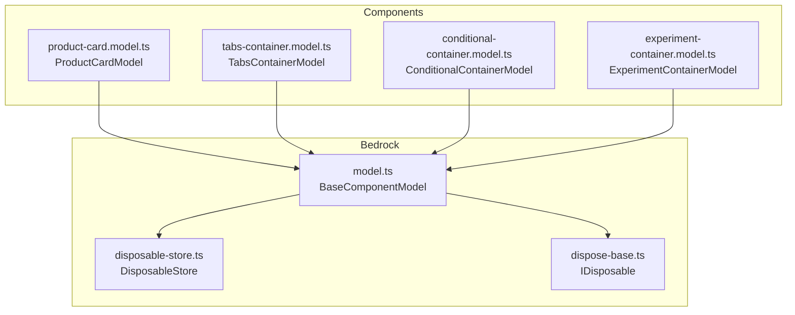
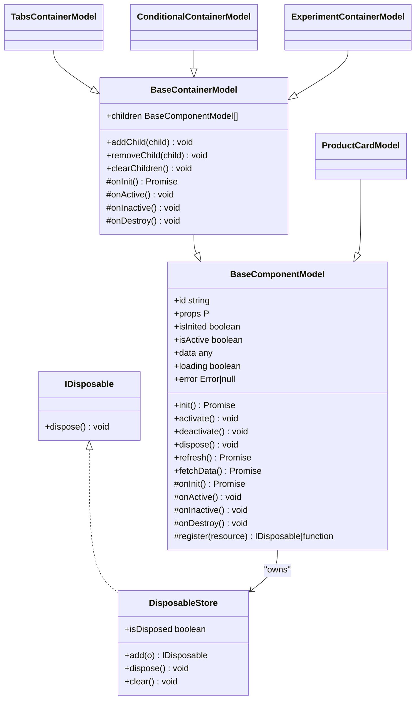
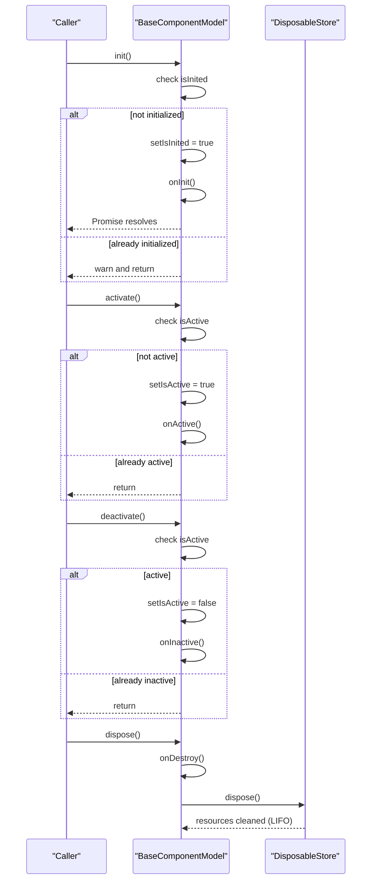
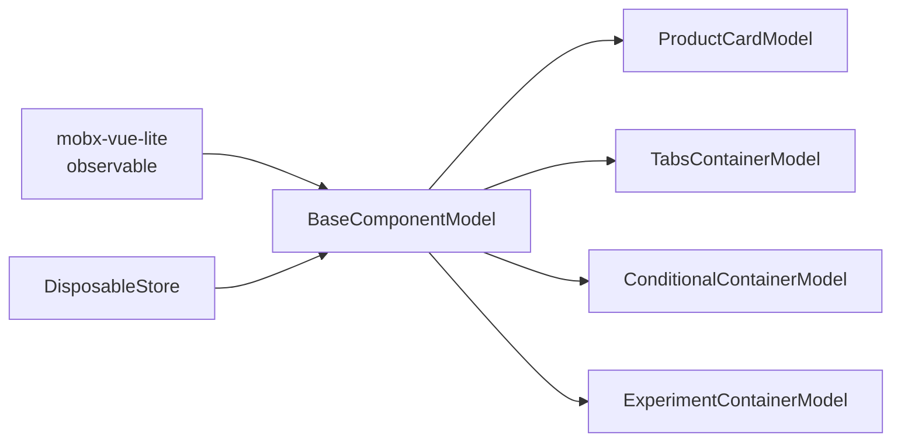

# BaseComponentModel

<cite>
**Referenced Files in This Document**
- [model.ts](file://packages/h5-builder/src/bedrock/model.ts)
- [disposable-store.ts](file://packages/h5-builder/src/bedrock/dispose/disposable-store.ts)
- [dispose-base.ts](file://packages/h5-builder/src/bedrock/dispose/dispose-base.ts)
- [product-card.model.ts](file://packages/h5-builder/src/components/product-card/product-card.model.ts)
- [tabs-container.model.ts](file://packages/h5-builder/src/components/tabs-container/tabs-container.model.ts)
- [conditional-container.model.ts](file://packages/h5-builder/src/components/conditional-container/conditional-container.model.ts)
- [experiment-container.model.ts](file://packages/h5-builder/src/components/experiment-container/experiment-container.model.ts)
- [model.test.ts](file://packages/h5-builder/src/__tests__/model.test.ts)
</cite>

## Table of Contents
1. [Introduction](#introduction)
2. [Project Structure](#project-structure)
3. [Core Components](#core-components)
4. [Architecture Overview](#architecture-overview)
5. [Detailed Component Analysis](#detailed-component-analysis)
6. [Dependency Analysis](#dependency-analysis)
7. [Performance Considerations](#performance-considerations)
8. [Troubleshooting Guide](#troubleshooting-guide)
9. [Conclusion](#conclusion)

## Introduction
BaseComponentModel is the foundational class for all component models in the framework. It standardizes lifecycle management, reactive state, and resource cleanup through a unified API. It also provides a generic type parameter for props, enabling strong typing of component inputs. The class integrates with mobx-vue-lite’s observable to make instances reactive, and it centralizes resource management via DisposableStore, ensuring automatic cleanup of timers, event listeners, subscriptions, and other IDisposable objects.

## Project Structure
BaseComponentModel resides in the bedrock layer and is extended by numerous concrete component models across the codebase. It defines the base lifecycle and state, while specialized models override hooks to implement domain-specific behavior.

**Diagram sources**
- [model.ts](file://packages/h5-builder/src/bedrock/model.ts#L1-L154)
- [disposable-store.ts](file://packages/h5-builder/src/bedrock/dispose/disposable-store.ts#L1-L84)
- [dispose-base.ts](file://packages/h5-builder/src/bedrock/dispose/dispose-base.ts#L1-L10)
- [product-card.model.ts](file://packages/h5-builder/src/components/product-card/product-card.model.ts#L1-L133)
- [tabs-container.model.ts](file://packages/h5-builder/src/components/tabs-container/tabs-container.model.ts#L1-L273)
- [conditional-container.model.ts](file://packages/h5-builder/src/components/conditional-container/conditional-container.model.ts#L1-L86)
- [experiment-container.model.ts](file://packages/h5-builder/src/components/experiment-container/experiment-container.model.ts#L1-L80)

**Section sources**
- [model.ts](file://packages/h5-builder/src/bedrock/model.ts#L1-L154)

## Core Components
- BaseComponentModel
: The abstract base class for all component models. Provides:
  - Reactive state: isInited, isActive, data, loading, error
  - Lifecycle methods: init, activate, deactivate, dispose
  - Hook methods: onInit, onActive, onInactive, onDestroy
  - Resource registration via register and DisposableStore
  - Generic props typing via P
- DisposableStore: A collection that tracks IDisposable objects and disposes them in LIFO order, with safety against duplicate disposal and warnings for late additions.

Key responsibilities:
- Enforce idempotent lifecycle transitions
- Centralize resource cleanup
- Provide a consistent reactive surface for UI updates

**Section sources**
- [model.ts](file://packages/h5-builder/src/bedrock/model.ts#L1-L154)
- [disposable-store.ts](file://packages/h5-builder/src/bedrock/dispose/disposable-store.ts#L1-L84)
- [dispose-base.ts](file://packages/h5-builder/src/bedrock/dispose/dispose-base.ts#L1-L10)

## Architecture Overview
BaseComponentModel composes lifecycle orchestration with reactive state and resource management. Concrete models extend BaseComponentModel and override lifecycle hooks to implement domain logic. Container models extend BaseContainerModel to coordinate child lifecycles.

**Diagram sources**
- [model.ts](file://packages/h5-builder/src/bedrock/model.ts#L1-L154)
- [model.ts](file://packages/h5-builder/src/bedrock/model.ts#L167-L241)
- [disposable-store.ts](file://packages/h5-builder/src/bedrock/dispose/disposable-store.ts#L1-L84)
- [dispose-base.ts](file://packages/h5-builder/src/bedrock/dispose/dispose-base.ts#L1-L10)
- [product-card.model.ts](file://packages/h5-builder/src/components/product-card/product-card.model.ts#L1-L133)
- [tabs-container.model.ts](file://packages/h5-builder/src/components/tabs-container/tabs-container.model.ts#L1-L273)
- [conditional-container.model.ts](file://packages/h5-builder/src/components/conditional-container/conditional-container.model.ts#L1-L86)
- [experiment-container.model.ts](file://packages/h5-builder/src/components/experiment-container/experiment-container.model.ts#L1-L80)

## Detailed Component Analysis

### BaseComponentModel Lifecycle and State
- Constructor and reactivity:
  - The constructor accepts id and props and wraps the instance with mobx-vue-lite’s observable to make the entire instance reactive. This ensures UI updates when state fields change.
- Lifecycle control properties:
  - isInited: Tracks whether onInit has been executed. Used to enforce idempotency.
  - isActive: Tracks whether the model is currently active (e.g., a tab is visible).
- Data state properties:
  - data: Holds the loaded data payload.
  - loading: Indicates ongoing data fetching.
  - error: Stores the last error encountered during data fetching.
- Lifecycle methods:
  - init: Idempotent initialization that sets isInited and calls onInit. Designed to be awaited to ensure async initialization completes.
  - activate: Sets isActive and calls onActive. Intended for resuming timers, re-subscribing, or restoring activity-sensitive resources.
  - deactivate: Clears isActive and calls onInactive. Intended for pausing timers, unsubscribing, or suspending activity-sensitive resources.
  - dispose: Calls onDestroy and disposes all registered resources via DisposableStore. Duplicate disposal is prevented with a warning.
- Hooks:
  - onInit: Abstract; implement to perform async initialization (network requests, subscriptions).
  - onActive/onInactive: Override to manage activity-sensitive resources.
  - onDestroy: Override to perform custom cleanup not covered by registered resources.
- Data helpers:
  - refresh: Resets loading/error, calls fetchData, and updates state accordingly.
  - fetchData: Abstract; implement to define data loading logic.

Idempotency guarantees:
- init prevents repeated execution by checking isInited.
- activate/deactivate guard against redundant transitions.
- dispose guards against duplicate disposal.

**Section sources**
- [model.ts](file://packages/h5-builder/src/bedrock/model.ts#L1-L154)

### Resource Registration with DisposableStore
- register(resource):
  - Accepts either an IDisposable object or a cleanup function. Internally converts functions to IDisposable and adds them to the store.
  - Enables centralized disposal in LIFO order, ensuring deterministic cleanup.
- DisposableStore:
  - Maintains a set of IDisposable objects.
  - dispose clears the set in LIFO order, invoking each object’s dispose method and aggregating errors.
  - add prevents adding itself and warns if attempting to add to a disposed store.
  - isDisposed exposes the disposal state.

Practical examples from the codebase:
- Registering timers:
  - A timer created inside onInit is registered so that it is cleared automatically upon dispose.
- Registering subscriptions:
  - Subscriptions created during onInit are registered to ensure cleanup when the model is destroyed.

**Section sources**
- [model.ts](file://packages/h5-builder/src/bedrock/model.ts#L23-L43)
- [disposable-store.ts](file://packages/h5-builder/src/bedrock/dispose/disposable-store.ts#L1-L84)
- [model.test.ts](file://packages/h5-builder/src/__tests__/model.test.ts#L134-L163)

### Concrete Model Patterns
- ProductCardModel:
  - Demonstrates async initialization via refresh and onInit, data fetching via fetchData, and activity-sensitive behavior via onActive.
- TabsContainerModel:
  - Extends BaseContainerModel to manage child lifecycle, including lazy initialization, activation/deactivation, and virtual scrolling integration with automatic cleanup via register.
- ConditionalContainerModel and ExperimentContainerModel:
  - Show container-level lifecycle delegation to children and conditional initialization logic.

These examples illustrate how BaseComponentModel enables consistent lifecycle and resource management across diverse component types.

**Section sources**
- [product-card.model.ts](file://packages/h5-builder/src/components/product-card/product-card.model.ts#L1-L133)
- [tabs-container.model.ts](file://packages/h5-builder/src/components/tabs-container/tabs-container.model.ts#L1-L273)
- [conditional-container.model.ts](file://packages/h5-builder/src/components/conditional-container/conditional-container.model.ts#L1-L86)
- [experiment-container.model.ts](file://packages/h5-builder/src/components/experiment-container/experiment-container.model.ts#L1-L80)

### Lifecycle Method Execution Flow

**Diagram sources**
- [model.ts](file://packages/h5-builder/src/bedrock/model.ts#L60-L154)
- [disposable-store.ts](file://packages/h5-builder/src/bedrock/dispose/disposable-store.ts#L1-L84)

## Dependency Analysis
- Internal dependencies:
  - BaseComponentModel depends on mobx-vue-lite’s observable for reactivity.
  - Uses DisposableStore to manage resources and enforce safe disposal.
- External usage:
  - Concrete models (e.g., ProductCardModel, TabsContainerModel) extend BaseComponentModel and override lifecycle hooks.
  - Tests validate idempotency, resource ordering, and reactive behavior.

**Diagram sources**
- [model.ts](file://packages/h5-builder/src/bedrock/model.ts#L1-L154)
- [disposable-store.ts](file://packages/h5-builder/src/bedrock/dispose/disposable-store.ts#L1-L84)
- [product-card.model.ts](file://packages/h5-builder/src/components/product-card/product-card.model.ts#L1-L133)
- [tabs-container.model.ts](file://packages/h5-builder/src/components/tabs-container/tabs-container.model.ts#L1-L273)
- [conditional-container.model.ts](file://packages/h5-builder/src/components/conditional-container/conditional-container.model.ts#L1-L86)
- [experiment-container.model.ts](file://packages/h5-builder/src/components/experiment-container/experiment-container.model.ts#L1-L80)

**Section sources**
- [model.ts](file://packages/h5-builder/src/bedrock/model.ts#L1-L154)
- [disposable-store.ts](file://packages/h5-builder/src/bedrock/dispose/disposable-store.ts#L1-L84)

## Performance Considerations
- Avoid memory leaks:
  - Always register timers, event listeners, and subscriptions using register to ensure automatic cleanup.
  - Prefer registering IDisposable objects or functions that clean up resources.
- Async initialization:
  - Implement onInit as an async method to handle network requests and other asynchronous setup. Await init to ensure initialization completes before rendering or activating.
- Activity-sensitive resources:
  - Move timers and subscriptions into onActive/onInactive to minimize background work when inactive.
- Data fetching:
  - Use refresh to update loading/error states and avoid manual state mutations outside of fetchData.

[No sources needed since this section provides general guidance]

## Troubleshooting Guide
Common issues and resolutions:
- Duplicate disposal:
  - The system logs a warning when attempting to dispose an already disposed model. Ensure dispose is called only once.
- Resource leak after disposal:
  - Verify that all timers and subscriptions are registered via register. Unregistered resources will not be cleaned up.
- Incorrect lifecycle order:
  - Confirm that activate/deactivate are called in the intended order and that onActive/onInactive are implemented to pause/resume activity-sensitive resources.
- Initialization race conditions:
  - Await init before relying on data or performing actions that depend on onInit completion.

Evidence from tests:
- Idempotent init and dispose behavior
- LIFO disposal order for registered resources
- Timer cleanup verification

**Section sources**
- [model.ts](file://packages/h5-builder/src/bedrock/model.ts#L49-L58)
- [model.test.ts](file://packages/h5-builder/src/__tests__/model.test.ts#L43-L177)

## Conclusion
BaseComponentModel provides a robust, consistent foundation for component models in the framework. Its reactive state, strict lifecycle semantics, and integrated resource management via DisposableStore simplify development and reduce the risk of memory leaks. By following the documented patterns—implementing async onInit, registering resources, and leveraging onActive/onInactive—developers can build scalable, maintainable components that integrate seamlessly with the broader system.