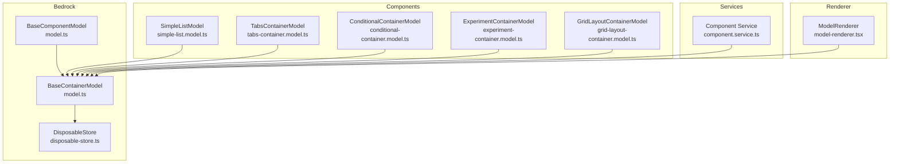
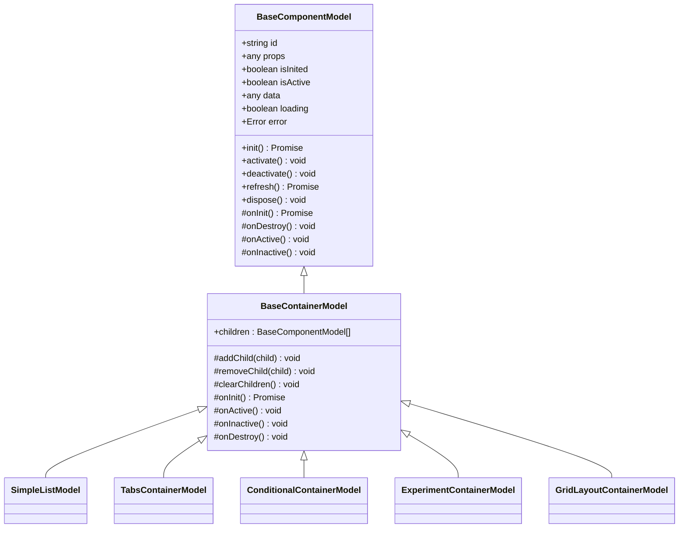
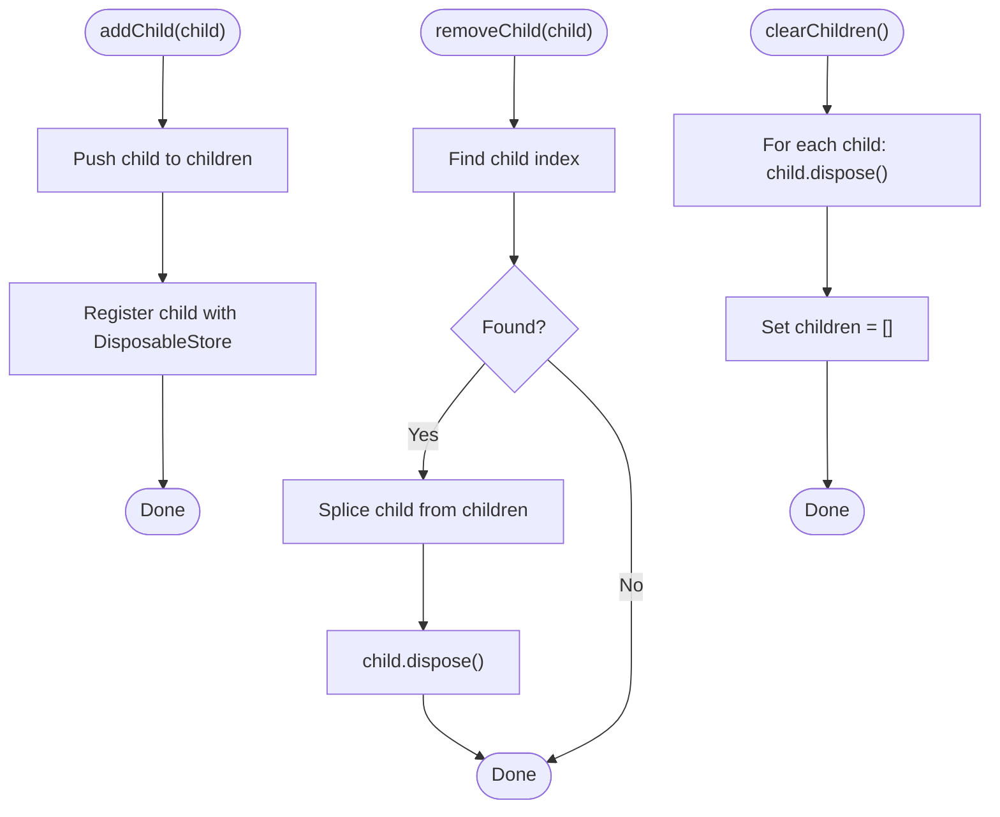
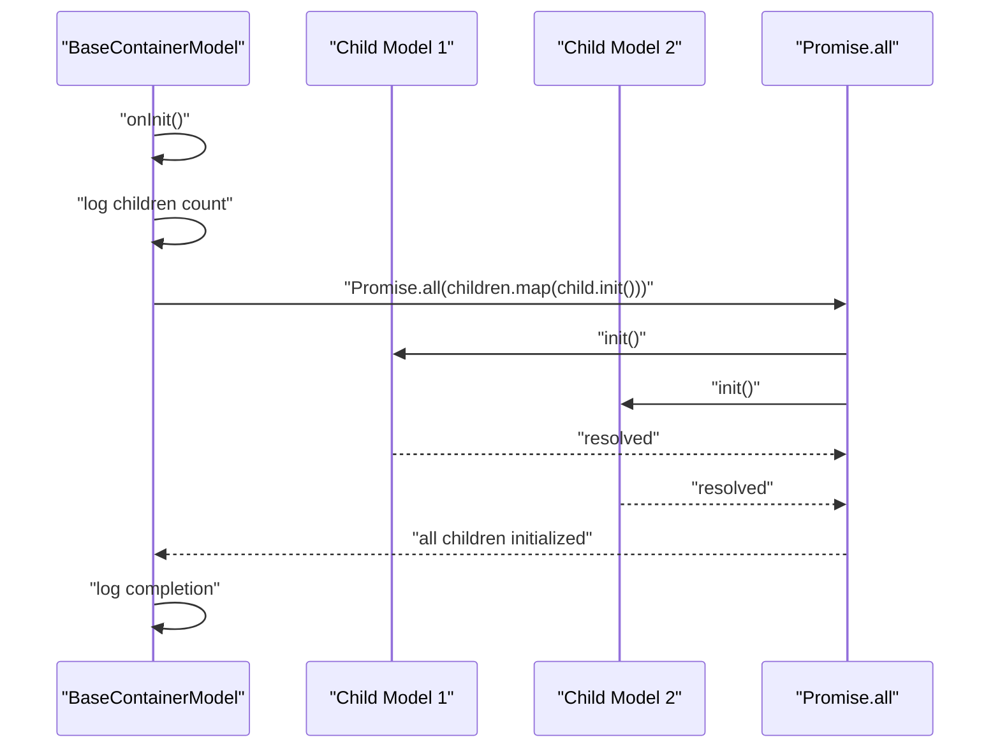
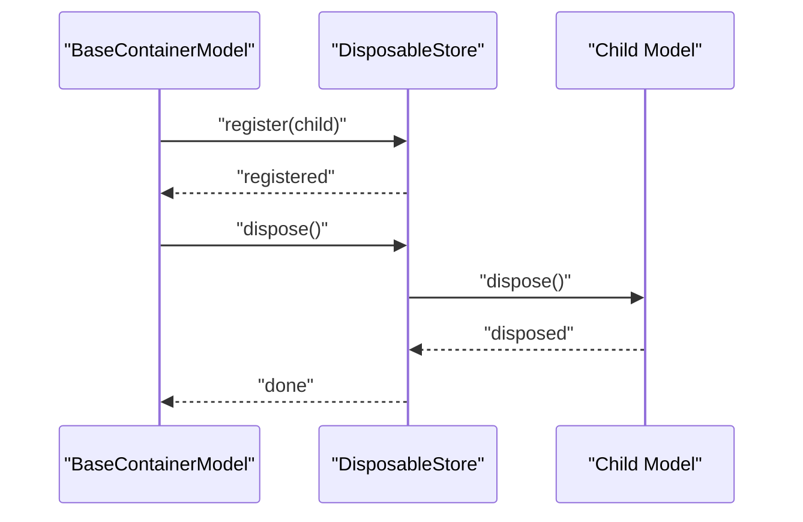
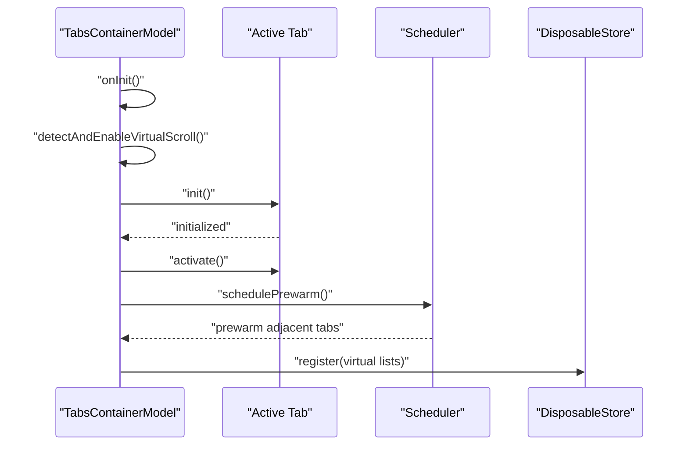
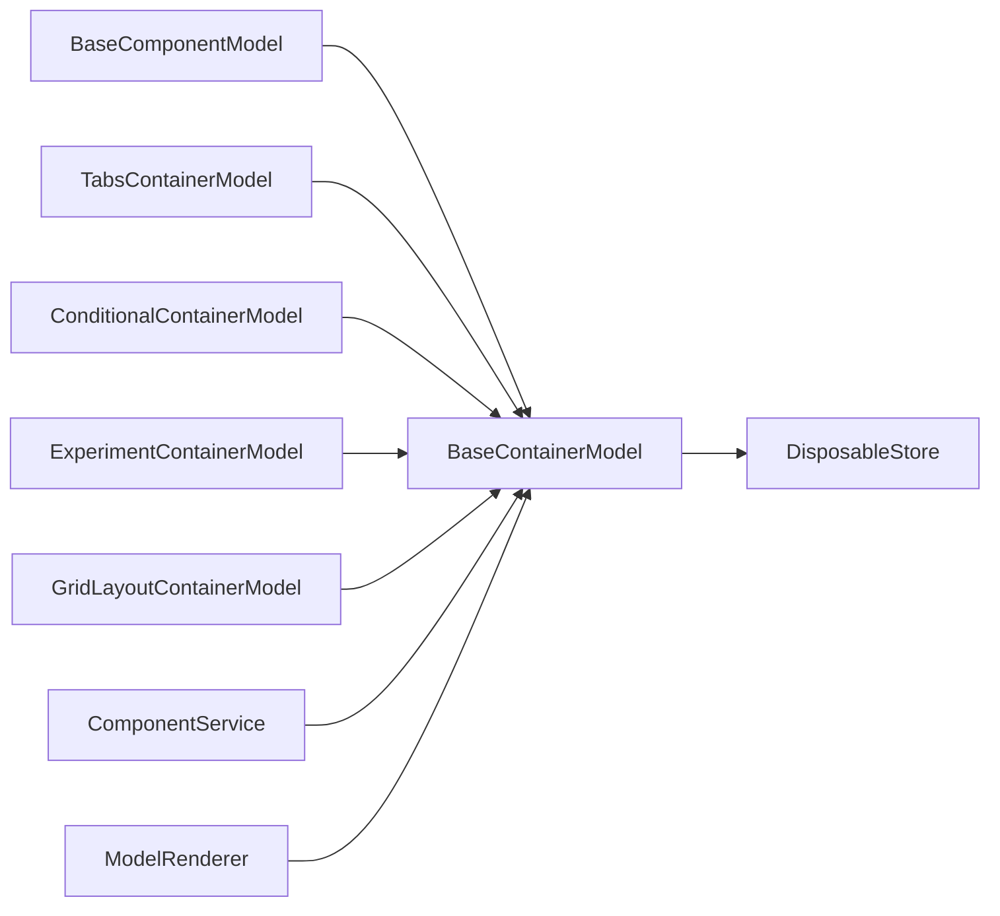

# BaseContainerModel

<cite>
**Referenced Files in This Document**
- [model.ts](file://packages/h5-builder/src/bedrock/model.ts)
- [disposable-store.ts](file://packages/h5-builder/src/bedrock/dispose/disposable-store.ts)
- [simple-list.model.ts](file://packages/h5-builder/src/components/simple-list/simple-list.model.ts)
- [tabs-container.model.ts](file://packages/h5-builder/src/components/tabs-container/tabs-container.model.ts)
- [conditional-container.model.ts](file://packages/h5-builder/src/components/conditional-container/conditional-container.model.ts)
- [experiment-container.model.ts](file://packages/h5-builder/src/components/experiment-container/experiment-container.model.ts)
- [grid-layout-container.model.ts](file://packages/h5-builder/src/components/grid-layout-container/grid-layout-container.model.ts)
- [model.test.ts](file://packages/h5-builder/src/__tests__/model.test.ts)
- [component.service.ts](file://packages/h5-builder/src/services/component.service.ts)
- [model-renderer.tsx](file://packages/h5-builder/src/components/model-renderer.tsx)
</cite>

## Table of Contents
1. [Introduction](#introduction)
2. [Project Structure](#project-structure)
3. [Core Components](#core-components)
4. [Architecture Overview](#architecture-overview)
5. [Detailed Component Analysis](#detailed-component-analysis)
6. [Dependency Analysis](#dependency-analysis)
7. [Performance Considerations](#performance-considerations)
8. [Troubleshooting Guide](#troubleshooting-guide)
9. [Conclusion](#conclusion)

## Introduction
This document provides a comprehensive guide to the BaseContainerModel class, focusing on its role as the foundation for container components such as Tabs, Lists, and Grids. It explains how BaseContainerModel inherits from BaseComponentModel and manages a collection of child component models. The document covers the children array property and the addChild, removeChild, and clearChildren methods, and details the overridden lifecycle methods onInit, onActive, onInactive, and onDestroy. It also describes how child models are automatically registered and disposed via the DisposableStore mechanism, and demonstrates practical examples from the codebase showing how container models coordinate the lifecycle of their children. Finally, it addresses common patterns such as lazy initialization in derived classes and the performance implications of parallel initialization versus sequential loading.

## Project Structure
BaseContainerModel resides in the bedrock layer alongside BaseComponentModel and the DisposableStore. Container components are implemented under components, and the model lifecycle is coordinated by services and renderers.

**Diagram sources**
- [model.ts](file://packages/h5-builder/src/bedrock/model.ts#L1-L243)
- [disposable-store.ts](file://packages/h5-builder/src/bedrock/dispose/disposable-store.ts#L1-L84)
- [simple-list.model.ts](file://packages/h5-builder/src/components/simple-list/simple-list.model.ts#L1-L15)
- [tabs-container.model.ts](file://packages/h5-builder/src/components/tabs-container/tabs-container.model.ts#L1-L273)
- [conditional-container.model.ts](file://packages/h5-builder/src/components/conditional-container/conditional-container.model.ts#L1-L86)
- [experiment-container.model.ts](file://packages/h5-builder/src/components/experiment-container/experiment-container.model.ts#L1-L80)
- [grid-layout-container.model.ts](file://packages/h5-builder/src/components/grid-layout-container/grid-layout-container.model.ts#L1-L44)
- [component.service.ts](file://packages/h5-builder/src/services/component.service.ts#L189-L208)
- [model-renderer.tsx](file://packages/h5-builder/src/components/model-renderer.tsx#L49-L103)

**Section sources**
- [model.ts](file://packages/h5-builder/src/bedrock/model.ts#L1-L243)

## Core Components
- BaseComponentModel: Provides the foundational lifecycle and resource management for all models, including init, activate/deactivate, refresh, and dispose. It uses a DisposableStore to manage resources and ensures deterministic cleanup.
- BaseContainerModel: Extends BaseComponentModel and adds container-specific capabilities:
  - children array property to hold child models
  - addChild, removeChild, clearChildren methods to manage child lifecycle
  - Overridden lifecycle methods:
    - onInit: initializes all children in parallel using Promise.all
    - onActive: activates all children
    - onInactive: deactivates all children
    - onDestroy: ensures child models are properly disposed via the inherited DisposableStore mechanism

These components form the backbone of containerized UI logic, enabling consistent lifecycle coordination across Tabs, Lists, Grids, and other container-based features.

**Section sources**
- [model.ts](file://packages/h5-builder/src/bedrock/model.ts#L1-L243)

## Architecture Overview
The container architecture centers around BaseContainerModel’s automatic propagation of lifecycle events to children. Derived containers customize behavior (e.g., lazy initialization, selective activation) while leveraging the base class’s parallel initialization and consistent disposal.

**Diagram sources**
- [model.ts](file://packages/h5-builder/src/bedrock/model.ts#L1-L243)
- [simple-list.model.ts](file://packages/h5-builder/src/components/simple-list/simple-list.model.ts#L1-L15)
- [tabs-container.model.ts](file://packages/h5-builder/src/components/tabs-container/tabs-container.model.ts#L1-L273)
- [conditional-container.model.ts](file://packages/h5-builder/src/components/conditional-container/conditional-container.model.ts#L1-L86)
- [experiment-container.model.ts](file://packages/h5-builder/src/components/experiment-container/experiment-container.model.ts#L1-L80)
- [grid-layout-container.model.ts](file://packages/h5-builder/src/components/grid-layout-container/grid-layout-container.model.ts#L1-L44)

## Detailed Component Analysis

### BaseContainerModel Lifecycle and Children Management
- Inheritance from BaseComponentModel:
  - Inherits lifecycle hooks and resource management via DisposableStore.
  - Ensures consistent behavior across all container models.
- Children array property:
  - Holds child models managed by the container.
- addChild(child):
  - Appends child to children and registers it with the container’s DisposableStore so it is automatically disposed when the container is disposed.
- removeChild(child):
  - Removes child from children and disposes it immediately.
- clearChildren():
  - Disposes all children and clears the children array.

**Diagram sources**
- [model.ts](file://packages/h5-builder/src/bedrock/model.ts#L168-L196)

**Section sources**
- [model.ts](file://packages/h5-builder/src/bedrock/model.ts#L168-L196)

### Overridden Lifecycle Methods

#### onInit: Parallel Initialization of Children
- Behavior:
  - Logs the number of children to initialize.
  - Initializes all children in parallel using Promise.all.
  - Logs when all children are initialized.
- Implications:
  - Faster startup when children are independent and lightweight.
  - Potential contention if children share resources or perform heavy operations concurrently.

**Diagram sources**
- [model.ts](file://packages/h5-builder/src/bedrock/model.ts#L201-L209)

**Section sources**
- [model.ts](file://packages/h5-builder/src/bedrock/model.ts#L201-L209)

#### onActive: Activate All Children
- Behavior:
  - Logs the number of children to activate.
  - Activates each child in sequence.
- Implications:
  - Ensures consistent activation order.
  - Derived classes can override to selectively activate only active children (e.g., Tabs).

**Section sources**
- [model.ts](file://packages/h5-builder/src/bedrock/model.ts#L211-L222)

#### onInactive: Deactivate All Children
- Behavior:
  - Logs the number of children to deactivate.
  - Deactivates each child in sequence.
- Implications:
  - Ensures consistent deactivation order.
  - Derived classes can override to selectively deactivate only active children.

**Section sources**
- [model.ts](file://packages/h5-builder/src/bedrock/model.ts#L224-L235)

#### onDestroy: Automatic Cleanup of Children
- Behavior:
  - Calls super.onDestroy(), which triggers disposal of the container’s DisposableStore.
  - Since children are registered with the store, they are automatically disposed when the container is destroyed.
- Implications:
  - Eliminates manual child disposal boilerplate in derived classes.
  - Ensures deterministic cleanup even if derived classes override lifecycle methods.

**Section sources**
- [model.ts](file://packages/h5-builder/src/bedrock/model.ts#L236-L241)

### Automatic Registration and Disposal via DisposableStore
- Registration:
  - addChild registers each child with the container’s DisposableStore, ensuring automatic disposal when the container is disposed.
- Disposal:
  - DisposableStore disposes registered items in LIFO order and aggregates errors if any disposal throws.
- Benefits:
  - Prevents memory leaks.
  - Simplifies resource management across complex container hierarchies.

**Diagram sources**
- [model.ts](file://packages/h5-builder/src/bedrock/model.ts#L168-L177)
- [disposable-store.ts](file://packages/h5-builder/src/bedrock/dispose/disposable-store.ts#L1-L84)

**Section sources**
- [model.ts](file://packages/h5-builder/src/bedrock/model.ts#L168-L177)
- [disposable-store.ts](file://packages/h5-builder/src/bedrock/dispose/disposable-store.ts#L1-L84)

### Practical Examples from the Codebase

#### Simple List Container
- Purpose:
  - Demonstrates a minimal container that relies on BaseContainerModel defaults for lifecycle management.
- Behavior:
  - No custom lifecycle overrides; children are initialized, activated, and deactivated automatically by the base class.

**Section sources**
- [simple-list.model.ts](file://packages/h5-builder/src/components/simple-list/simple-list.model.ts#L1-L15)
- [model.ts](file://packages/h5-builder/src/bedrock/model.ts#L201-L235)

#### Tabs Container
- Purpose:
  - Shows how to override onInit for lazy initialization and prewarm strategy.
- Patterns:
  - Lazy initialization: Only the active tab is initialized initially.
  - Prewarming: Adjacent and other tabs are warmed up after a delay.
  - Selective activation: Only the active tab is activated.
- Notes:
  - Does not call super.onInit() because BaseContainerModel would initialize all tabs eagerly.

**Diagram sources**
- [tabs-container.model.ts](file://packages/h5-builder/src/components/tabs-container/tabs-container.model.ts#L68-L96)
- [tabs-container.model.ts](file://packages/h5-builder/src/components/tabs-container/tabs-container.model.ts#L205-L248)
- [model.ts](file://packages/h5-builder/src/bedrock/model.ts#L201-L235)

**Section sources**
- [tabs-container.model.ts](file://packages/h5-builder/src/components/tabs-container/tabs-container.model.ts#L1-L273)
- [model.ts](file://packages/h5-builder/src/bedrock/model.ts#L201-L235)

#### Conditional Container
- Purpose:
  - Demonstrates conditional rendering based on runtime conditions.
- Pattern:
  - Initializes children only when the condition is met.
  - Activates and deactivates children only when rendering is enabled.

**Section sources**
- [conditional-container.model.ts](file://packages/h5-builder/src/components/conditional-container/conditional-container.model.ts#L1-L86)
- [model.ts](file://packages/h5-builder/src/bedrock/model.ts#L211-L235)

#### Experiment Container
- Purpose:
  - Demonstrates dynamic selection of children based on experimental variants.
- Pattern:
  - Determines active children from props and initializes only those children.
  - Activates and deactivates only active children.

**Section sources**
- [experiment-container.model.ts](file://packages/h5-builder/src/components/experiment-container/experiment-container.model.ts#L1-L80)
- [model.ts](file://packages/h5-builder/src/bedrock/model.ts#L211-L235)

#### Grid Layout Container
- Purpose:
  - Demonstrates sequential initialization of children.
- Pattern:
  - Iterates children and calls init() without awaiting, allowing concurrent initialization at the caller level.

**Section sources**
- [grid-layout-container.model.ts](file://packages/h5-builder/src/components/grid-layout-container/grid-layout-container.model.ts#L1-L44)
- [model.ts](file://packages/h5-builder/src/bedrock/model.ts#L211-L235)

### Automatic Registration of Child Models
- How it works:
  - addChild registers each child with the container’s DisposableStore, ensuring automatic disposal when the container is disposed.
- Evidence:
  - Tests demonstrate that disposing the container disposes all registered children.

**Section sources**
- [model.ts](file://packages/h5-builder/src/bedrock/model.ts#L168-L177)
- [model.test.ts](file://packages/h5-builder/src/__tests__/model.test.ts#L180-L231)

### Container Model Coordination in the Application
- Component building:
  - Services add child models to a parent container via addChild during tree construction.
- Rendering:
  - The renderer iterates container children and renders each child model.

**Section sources**
- [component.service.ts](file://packages/h5-builder/src/services/component.service.ts#L189-L208)
- [model-renderer.tsx](file://packages/h5-builder/src/components/model-renderer.tsx#L49-L103)

## Dependency Analysis
- BaseContainerModel depends on:
  - BaseComponentModel for lifecycle and resource management.
  - DisposableStore for automatic child disposal.
- Derived containers depend on:
  - BaseContainerModel for standardized lifecycle behavior.
  - Services for building and wiring child models.
  - Renderer for displaying container children.

**Diagram sources**
- [model.ts](file://packages/h5-builder/src/bedrock/model.ts#L1-L243)
- [disposable-store.ts](file://packages/h5-builder/src/bedrock/dispose/disposable-store.ts#L1-L84)
- [tabs-container.model.ts](file://packages/h5-builder/src/components/tabs-container/tabs-container.model.ts#L1-L273)
- [conditional-container.model.ts](file://packages/h5-builder/src/components/conditional-container/conditional-container.model.ts#L1-L86)
- [experiment-container.model.ts](file://packages/h5-builder/src/components/experiment-container/experiment-container.model.ts#L1-L80)
- [grid-layout-container.model.ts](file://packages/h5-builder/src/components/grid-layout-container/grid-layout-container.model.ts#L1-L44)
- [component.service.ts](file://packages/h5-builder/src/services/component.service.ts#L189-L208)
- [model-renderer.tsx](file://packages/h5-builder/src/components/model-renderer.tsx#L49-L103)

**Section sources**
- [model.ts](file://packages/h5-builder/src/bedrock/model.ts#L1-L243)
- [disposable-store.ts](file://packages/h5-builder/src/bedrock/dispose/disposable-store.ts#L1-L84)
- [tabs-container.model.ts](file://packages/h5-builder/src/components/tabs-container/tabs-container.model.ts#L1-L273)
- [conditional-container.model.ts](file://packages/h5-builder/src/components/conditional-container/conditional-container.model.ts#L1-L86)
- [experiment-container.model.ts](file://packages/h5-builder/src/components/experiment-container/experiment-container.model.ts#L1-L80)
- [grid-layout-container.model.ts](file://packages/h5-builder/src/components/grid-layout-container/grid-layout-container.model.ts#L1-L44)
- [component.service.ts](file://packages/h5-builder/src/services/component.service.ts#L189-L208)
- [model-renderer.tsx](file://packages/h5-builder/src/components/model-renderer.tsx#L49-L103)

## Performance Considerations
- Parallel initialization (BaseContainerModel default):
  - Pros: Faster startup when children are independent and lightweight.
  - Cons: Potential contention if children share resources or perform heavy operations concurrently.
- Sequential or lazy initialization (derived containers):
  - Pros: Reduced initial load, controlled resource usage, improved perceived performance for large containers.
  - Cons: Slightly slower initial activation of additional children.
- Recommendations:
  - Use BaseContainerModel’s parallel initialization for small, independent children.
  - Override onInit in derived containers for lazy initialization and prewarming strategies (e.g., TabsContainer).
  - Prefer selective activation/deactivation in derived classes to minimize unnecessary work (e.g., TabsContainer activates only the active tab).

[No sources needed since this section provides general guidance]

## Troubleshooting Guide
- Debugging lifecycle logs:
  - BaseContainerModel logs initialization, activation, and deactivation of children. Use these logs to verify expected behavior.
- Ensuring children are disposed:
  - Verify that addChild is used to register children; derived classes should not manually dispose children unless necessary.
- Handling errors during disposal:
  - DisposableStore aggregates errors during disposal; check for aggregated errors if cleanup fails.
- Verifying container-child relationships:
  - Confirm that children are added via addChild and that the container’s children array reflects the expected count.

**Section sources**
- [model.ts](file://packages/h5-builder/src/bedrock/model.ts#L201-L235)
- [disposable-store.ts](file://packages/h5-builder/src/bedrock/dispose/disposable-store.ts#L1-L84)
- [model.test.ts](file://packages/h5-builder/src/__tests__/model.test.ts#L180-L231)

## Conclusion
BaseContainerModel provides a robust foundation for container components by standardizing lifecycle management across children. Its parallel initialization, consistent activation/deactivation, and automatic disposal via DisposableStore simplify development and reduce memory leaks. Derived containers can override lifecycle methods to implement specialized behaviors such as lazy initialization and selective activation, aligning with performance and UX goals. The codebase demonstrates these patterns across Tabs, Lists, Grids, Conditional, and Experiment containers, showcasing both default and customized approaches to managing child models effectively.