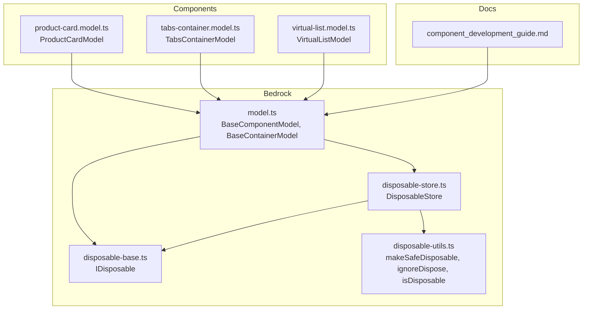
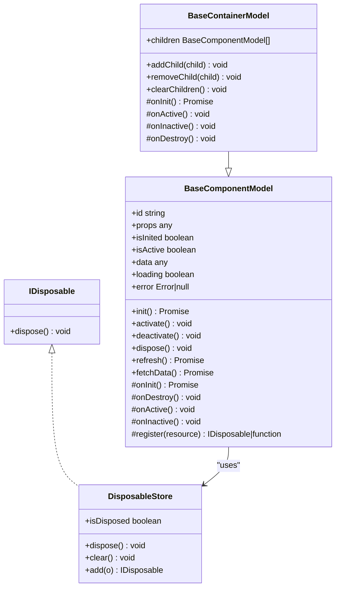
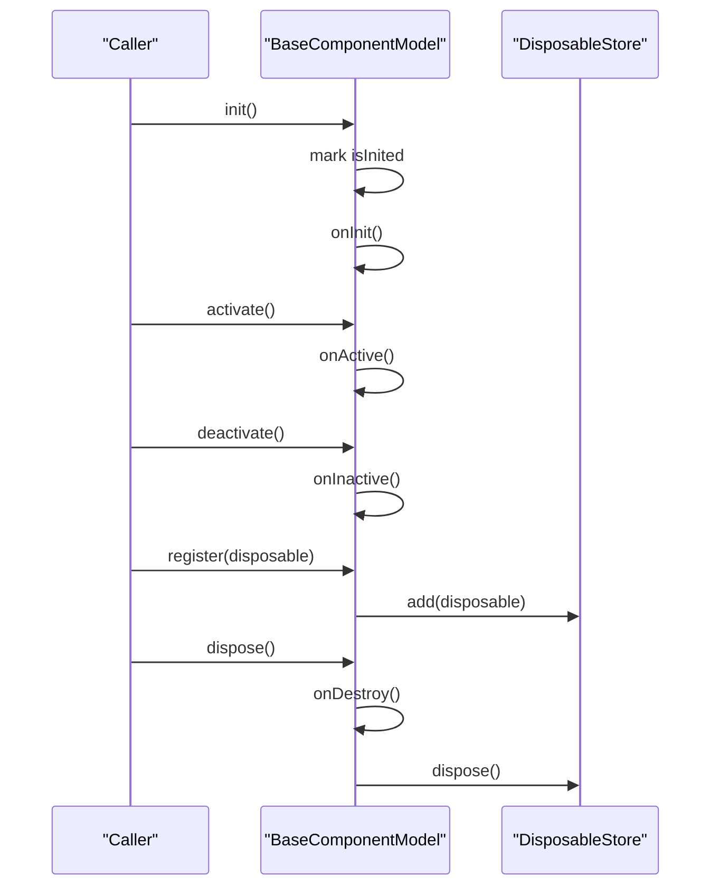
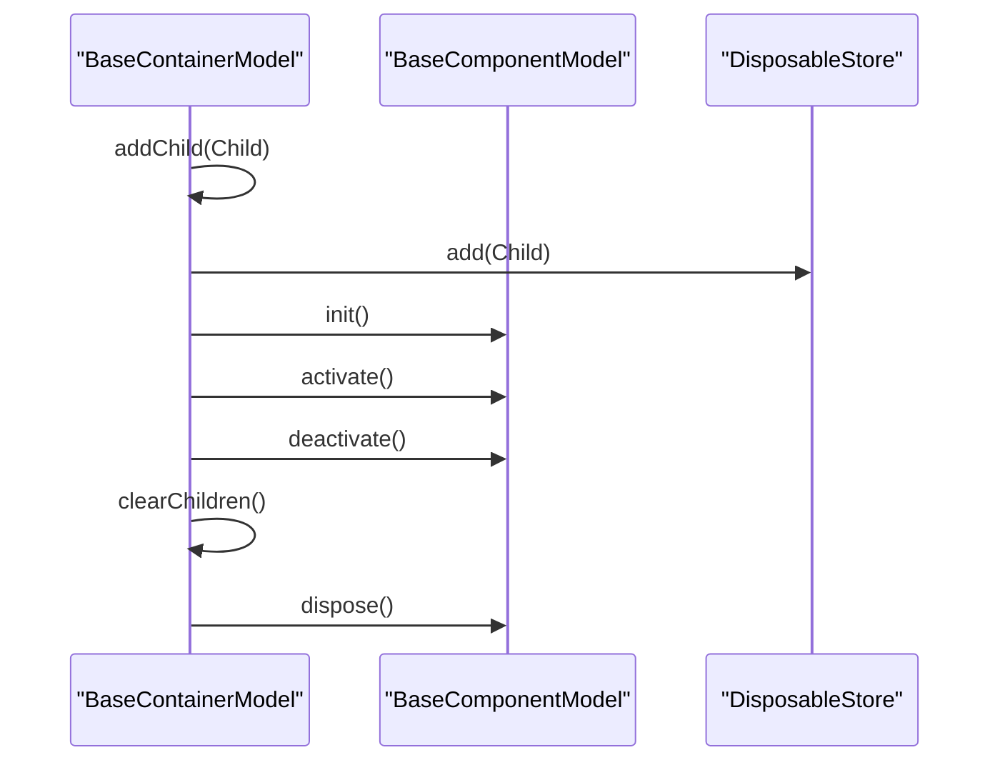
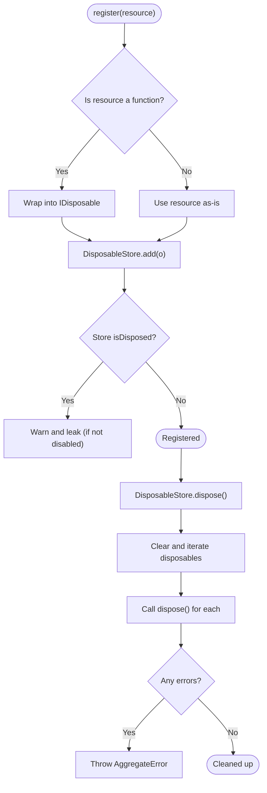
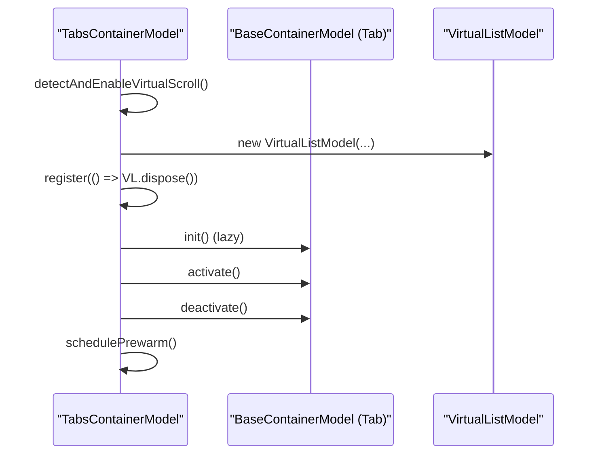
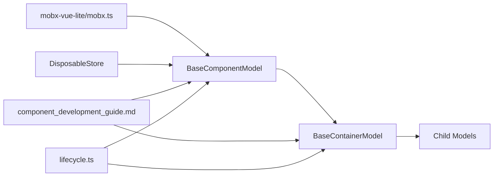

# Model System

<cite>
**Referenced Files in This Document**
- [model.ts](file://packages/h5-builder/src/bedrock/model.ts)
- [disposable-store.ts](file://packages/h5-builder/src/bedrock/dispose/disposable-store.ts)
- [disposable-base.ts](file://packages/h5-builder/src/bedrock/dispose/dispose-base.ts)
- [disposable-utils.ts](file://packages/h5-builder/src/bedrock/dispose/disposable-utils.ts)
- [product-card.model.ts](file://packages/h5-builder/src/components/product-card/product-card.model.ts)
- [tabs-container.model.ts](file://packages/h5-builder/src/components/tabs-container/tabs-container.model.ts)
- [virtual-list.model.ts](file://packages/h5-builder/src/components/virtual-list/virtual-list.model.ts)
- [component_development_guide.md](file://packages/h5-builder/docs/component_development_guide.md)
- [lifecycle.ts](file://packages/h5-builder/src/jobs/lifecycle.ts)
- [mobx.ts](file://packages/mobx-vue-lite/src/mobx.ts)
</cite>

## Table of Contents
1. [Introduction](#introduction)
2. [Project Structure](#project-structure)
3. [Core Components](#core-components)
4. [Architecture Overview](#architecture-overview)
5. [Detailed Component Analysis](#detailed-component-analysis)
6. [Dependency Analysis](#dependency-analysis)
7. [Performance Considerations](#performance-considerations)
8. [Troubleshooting Guide](#troubleshooting-guide)
9. [Conclusion](#conclusion)
10. [Appendices](#appendices)

## Introduction
This document explains the Model System used in the H5 Builder framework. It focuses on the BaseComponentModel and BaseContainerModel classes, their lifecycle methods and hooks, resource management via DisposableStore and the register mechanism, and how container models manage child components. It also covers performance considerations and best practices for state management using the mobx-vue-lite reactivity system.

## Project Structure
The Model System resides under the bedrock layer and includes:
- Base models for components and containers
- Resource management utilities for automatic cleanup
- Example models demonstrating patterns for data loading, timers, events, and container lifecycle orchestration
- A component development guide with practical examples and best practices

**Diagram sources**
- [model.ts](file://packages/h5-builder/src/bedrock/model.ts#L1-L243)
- [disposable-store.ts](file://packages/h5-builder/src/bedrock/dispose/disposable-store.ts#L1-L84)
- [disposable-base.ts](file://packages/h5-builder/src/bedrock/dispose/dispose-base.ts#L1-L10)
- [disposable-utils.ts](file://packages/h5-builder/src/bedrock/dispose/disposable-utils.ts#L1-L29)
- [product-card.model.ts](file://packages/h5-builder/src/components/product-card/product-card.model.ts#L1-L133)
- [tabs-container.model.ts](file://packages/h5-builder/src/components/tabs-container/tabs-container.model.ts#L1-L273)
- [virtual-list.model.ts](file://packages/h5-builder/src/components/virtual-list/virtual-list.model.ts#L1-L217)
- [component_development_guide.md](file://packages/h5-builder/docs/component_development_guide.md#L1-L510)

**Section sources**
- [model.ts](file://packages/h5-builder/src/bedrock/model.ts#L1-L243)
- [disposable-store.ts](file://packages/h5-builder/src/bedrock/dispose/disposable-store.ts#L1-L84)
- [disposable-base.ts](file://packages/h5-builder/src/bedrock/dispose/dispose-base.ts#L1-L10)
- [disposable-utils.ts](file://packages/h5-builder/src/bedrock/dispose/disposable-utils.ts#L1-L29)
- [product-card.model.ts](file://packages/h5-builder/src/components/product-card/product-card.model.ts#L1-L133)
- [tabs-container.model.ts](file://packages/h5-builder/src/components/tabs-container/tabs-container.model.ts#L1-L273)
- [virtual-list.model.ts](file://packages/h5-builder/src/components/virtual-list/virtual-list.model.ts#L1-L217)
- [component_development_guide.md](file://packages/h5-builder/docs/component_development_guide.md#L1-L510)

## Core Components
- BaseComponentModel: Provides lifecycle management (init, activate, deactivate, dispose), reactive state fields, and a resource registration mechanism via register and DisposableStore.
- BaseContainerModel: Extends BaseComponentModel and manages a collection of child models, automatically initializing, activating, and deactivating them, and disposing them on container disposal.

Key properties and methods:
- BaseComponentModel
  - Properties: id, props, isInited, isActive, data, loading, error
  - Methods: init(), activate(), deactivate(), dispose(), refresh(), fetchData()
  - Lifecycle hooks: onInit(), onActive(), onInactive(), onDestroy()
  - Resource management: register(resource), DisposableStore
- BaseContainerModel
  - Properties: children
  - Methods: addChild(child), removeChild(child), clearChildren()
  - Overridden lifecycle: onInit() initializes all children, onActive() activates all children, onInactive() deactivates all children, onDestroy() delegates to parent

**Section sources**
- [model.ts](file://packages/h5-builder/src/bedrock/model.ts#L10-L155)
- [model.ts](file://packages/h5-builder/src/bedrock/model.ts#L157-L243)

## Architecture Overview
The Model System integrates with mobx-vue-lite for reactivity and with a lifecycle pipeline for progressive rendering. Components are composed of models and views, with models holding state and business logic and views rendering based on model observables.

**Diagram sources**
- [disposable-base.ts](file://packages/h5-builder/src/bedrock/dispose/dispose-base.ts#L1-L10)
- [disposable-store.ts](file://packages/h5-builder/src/bedrock/dispose/disposable-store.ts#L1-L84)
- [model.ts](file://packages/h5-builder/src/bedrock/model.ts#L10-L243)

## Detailed Component Analysis

### BaseComponentModel
- Purpose: Centralized lifecycle and state management for individual components.
- Lifecycle:
  - init(): Ensures onInit runs once and marks isInited.
  - activate()/deactivate(): Toggle isActive and call onActive()/onInactive().
  - dispose(): Calls onDestroy and disposes registered resources.
- Hooks:
  - onInit(): Initialize resources (e.g., fetch data).
  - onActive()/onInactive(): Resume/pause timers and subscriptions.
  - onDestroy(): Custom cleanup.
- State management:
  - Reactive fields: isInited, isActive, data, loading, error.
  - refresh(): Sets loading/error, calls fetchData(), resets loading.
- Resource management:
  - register(resource): Registers IDisposable or a cleanup function into a DisposableStore.
  - DisposableStore: Holds disposables, clears them on dispose, throws aggregated errors.

**Diagram sources**
- [model.ts](file://packages/h5-builder/src/bedrock/model.ts#L60-L155)
- [disposable-store.ts](file://packages/h5-builder/src/bedrock/dispose/disposable-store.ts#L20-L84)

**Section sources**
- [model.ts](file://packages/h5-builder/src/bedrock/model.ts#L10-L155)
- [disposable-store.ts](file://packages/h5-builder/src/bedrock/dispose/disposable-store.ts#L1-L84)
- [disposable-base.ts](file://packages/h5-builder/src/bedrock/dispose/dispose-base.ts#L1-L10)

### BaseContainerModel
- Purpose: Orchestrates lifecycle of child models.
- Child management:
  - addChild(child): Adds child and registers it for automatic disposal.
  - removeChild(child)/clearChildren(): Dispose and remove children.
- Lifecycle delegation:
  - onInit(): Initializes all children concurrently.
  - onActive()/onInactive(): Activates/deactivates all children.
  - onDestroy(): Delegates to parent; children are already registered.

**Diagram sources**
- [model.ts](file://packages/h5-builder/src/bedrock/model.ts#L168-L243)
- [disposable-store.ts](file://packages/h5-builder/src/bedrock/dispose/disposable-store.ts#L60-L84)

**Section sources**
- [model.ts](file://packages/h5-builder/src/bedrock/model.ts#L168-L243)

### Resource Management with DisposableStore and register
- register(resource):
  - Accepts either an IDisposable or a cleanup function.
  - Wraps functions into IDisposable and adds to DisposableStore.
- DisposableStore:
  - Tracks disposables, ensures safe disposal, and throws aggregated errors.
  - Supports LIFO disposal order and warns on attempts to add to a disposed store.
- disposable-utils:
  - Utilities for safe/disposable wrappers and checks.

**Diagram sources**
- [model.ts](file://packages/h5-builder/src/bedrock/model.ts#L28-L58)
- [disposable-store.ts](file://packages/h5-builder/src/bedrock/dispose/disposable-store.ts#L20-L84)
- [disposable-utils.ts](file://packages/h5-builder/src/bedrock/dispose/disposable-utils.ts#L1-L29)

**Section sources**
- [model.ts](file://packages/h5-builder/src/bedrock/model.ts#L28-L58)
- [disposable-store.ts](file://packages/h5-builder/src/bedrock/dispose/disposable-store.ts#L1-L84)
- [disposable-utils.ts](file://packages/h5-builder/src/bedrock/dispose/disposable-utils.ts#L1-L29)

### Example Models and Patterns

#### ProductCardModel
- Demonstrates reactive state fields (data, loading, error), refresh flow, and lifecycle hooks (onActive for exposure tracking).
- Uses fetchData to simulate asynchronous data loading and sets reactive fields accordingly.

**Section sources**
- [product-card.model.ts](file://packages/h5-builder/src/components/product-card/product-card.model.ts#L1-L133)
- [model.ts](file://packages/h5-builder/src/bedrock/model.ts#L100-L122)

#### TabsContainerModel
- Extends BaseContainerModel to manage multiple child tabs.
- Implements lazy initialization, activation/deactivation, and pre-warming strategies.
- Detects virtual scrolling thresholds and enables VirtualListModel for eligible tabs.

**Diagram sources**
- [tabs-container.model.ts](file://packages/h5-builder/src/components/tabs-container/tabs-container.model.ts#L1-L273)
- [virtual-list.model.ts](file://packages/h5-builder/src/components/virtual-list/virtual-list.model.ts#L1-L217)
- [model.ts](file://packages/h5-builder/src/bedrock/model.ts#L168-L243)

**Section sources**
- [tabs-container.model.ts](file://packages/h5-builder/src/components/tabs-container/tabs-container.model.ts#L1-L273)
- [virtual-list.model.ts](file://packages/h5-builder/src/components/virtual-list/virtual-list.model.ts#L1-L217)

#### VirtualListModel
- Illustrates advanced state management with caches and computed properties.
- Uses reactive fields and lifecycle hooks to manage virtualization state.

**Section sources**
- [virtual-list.model.ts](file://packages/h5-builder/src/components/virtual-list/virtual-list.model.ts#L1-L217)

### Component Development Guide Patterns
- Data loading patterns: Using refresh and fetchData to manage loading/error states.
- Timer and subscription management: Registering cleanup functions to prevent leaks.
- Container patterns: Managing child lifecycle and enabling virtual scrolling based on thresholds.

**Section sources**
- [component_development_guide.md](file://packages/h5-builder/docs/component_development_guide.md#L173-L306)
- [component_development_guide.md](file://packages/h5-builder/docs/component_development_guide.md#L354-L376)

## Dependency Analysis
- BaseComponentModel depends on:
  - mobx-vue-lite for reactivity (observable)
  - DisposableStore for resource management
- BaseContainerModel depends on BaseComponentModel and manages child instances.
- Example models depend on BaseComponentModel and demonstrate usage patterns.
- Lifecycle pipeline enums define stages for progressive rendering.

**Diagram sources**
- [mobx.ts](file://packages/mobx-vue-lite/src/mobx.ts#L1-L65)
- [model.ts](file://packages/h5-builder/src/bedrock/model.ts#L1-L243)
- [component_development_guide.md](file://packages/h5-builder/docs/component_development_guide.md#L1-L510)
- [lifecycle.ts](file://packages/h5-builder/src/jobs/lifecycle.ts#L1-L18)

**Section sources**
- [mobx.ts](file://packages/mobx-vue-lite/src/mobx.ts#L1-L65)
- [model.ts](file://packages/h5-builder/src/bedrock/model.ts#L1-L243)
- [component_development_guide.md](file://packages/h5-builder/docs/component_development_guide.md#L1-L510)
- [lifecycle.ts](file://packages/h5-builder/src/jobs/lifecycle.ts#L1-L18)

## Performance Considerations
- Reactive state management:
  - Keep state fields declared at class level so they are observable by mobx-vue-lite.
  - Use computed getters for derived values to minimize recomputations.
- Lifecycle orchestration:
  - Use BaseContainerModel’s default parallel initialization and activation for optimal throughput.
  - Override lifecycle methods to implement lazy loading and pre-warming strategies (as shown in TabsContainerModel).
- Virtualization:
  - Enable virtual scrolling for large lists to reduce DOM nodes and improve rendering performance.
- Resource cleanup:
  - Always register timers, event listeners, and subscriptions to prevent memory leaks.
- Error handling:
  - Aggregate errors during disposal to surface issues early.

[No sources needed since this section provides general guidance]

## Troubleshooting Guide
- State not updating:
  - Ensure reactive fields are declared at class level and not accessed via private fields without getters.
- Memory leaks:
  - Verify all timers and subscriptions are registered via register or explicitly disposed.
- Disposal warnings:
  - Avoid adding disposables to a disposed store; check isDisposed and handle accordingly.
- Aggregated errors:
  - When disposing stores, exceptions thrown by individual disposables are aggregated; inspect the error to identify failing disposables.

**Section sources**
- [disposable-store.ts](file://packages/h5-builder/src/bedrock/dispose/disposable-store.ts#L20-L84)
- [component_development_guide.md](file://packages/h5-builder/docs/component_development_guide.md#L453-L486)

## Conclusion
The Model System provides a robust foundation for building scalable, reactive UI components. BaseComponentModel centralizes lifecycle and state management, while BaseContainerModel coordinates child components efficiently. DisposableStore and the register mechanism ensure automatic cleanup of timers, event listeners, and subscriptions. Following the patterns in the component development guide leads to maintainable, performant models that integrate seamlessly with mobx-vue-lite and the progressive lifecycle pipeline.

[No sources needed since this section summarizes without analyzing specific files]

## Appendices

### Lifecycle Stages Reference
- Open: Preload tasks, e.g., fetching page schema.
- LoadComponentLogic: Load component logic (Model) resources.
- Prepare: Build model tree and load component views.
- RenderReady: Model tree and view resources ready.
- Render: Start rendering.
- Completed: First screen data filling.
- Idle: Handle idle tasks.

**Section sources**
- [lifecycle.ts](file://packages/h5-builder/src/jobs/lifecycle.ts#L1-L18)