# Resource Management

<cite>
**Referenced Files in This Document**   
- [disposable-store.ts](file://packages/h5-builder/src/bedrock/dispose/disposable-store.ts)
- [model.ts](file://packages/h5-builder/src/bedrock/model.ts)
- [dispose-base.ts](file://packages/h5-builder/src/bedrock/dispose/dispose-base.ts)
- [disposable-utils.ts](file://packages/h5-builder/src/bedrock/dispose/disposable-utils.ts)
- [tracker.ts](file://packages/h5-builder/src/bedrock/dispose/tracker.ts)
- [timer.ts](file://packages/h5-builder/src/bedrock/dispose/timer.ts)
- [emitter.ts](file://packages/h5-builder/src/bedrock/event/emitter.ts)
- [product-card.model.ts](file://packages/h5-builder/src/components/product-card/product-card.model.ts)
- [time-based-container.model.ts](file://packages/h5-builder/src/components/time-based-container/time-based-container.model.ts)
</cite>

## Table of Contents
1. [Introduction](#introduction)
2. [DisposableStore Class Overview](#disposablestore-class-overview)
3. [Internal Structure and Key Properties](#internal-structure-and-key-properties)
4. [Add Method Functionality](#add-method-functionality)
5. [Dispose and Clear Methods](#dispose-and-clear-methods)
6. [BaseComponentModel Integration](#basecomponentmodel-integration)
7. [Practical Usage Examples](#practical-usage-examples)
8. [Best Practices](#best-practices)
9. [Performance Considerations](#performance-considerations)
10. [Error Handling and Debugging](#error-handling-and-debugging)

## Introduction
The Resource Management system in the MobX-based application architecture provides a robust mechanism for preventing memory leaks through proper lifecycle management of disposable resources. At the core of this system is the `DisposableStore` class, which acts as a central registry for tracking and managing resources that require cleanup. This documentation details the implementation, usage patterns, and best practices for the resource management system, with a focus on how `DisposableStore` enables automatic cleanup of timers, event listeners, subscriptions, and other resources during component disposal.

## DisposableStore Class Overview

The `DisposableStore` class serves as a central registry for managing disposable resources throughout their lifecycle. It implements the `IDisposable` interface and provides methods to register, track, and dispose of resources in a controlled manner. The class is designed to prevent memory leaks by ensuring that all registered resources are properly cleaned up when the store itself is disposed.

**Diagram sources**
- [disposable-store.ts](file://packages/h5-builder/src/bedrock/dispose/disposable-store.ts#L6-L83)
- [dispose-base.ts](file://packages/h5-builder/src/bedrock/dispose/dispose-base.ts#L4-L6)

**Section sources**
- [disposable-store.ts](file://packages/h5-builder/src/bedrock/dispose/disposable-store.ts#L6-L83)

## Internal Structure and Key Properties

The `DisposableStore` class maintains two critical internal properties that enable its resource management capabilities. The private `_toDispose` property is a `Set<IDisposable>` that tracks all registered disposable objects, providing O(1) insertion and deletion operations. This collection serves as the central registry for all resources that need to be cleaned up when the store is disposed.

The `_isDisposed` flag is a boolean property that indicates whether the store has already been disposed. This flag enables idempotent behavior for the dispose operation and prevents double-disposal issues. When a store is disposed, this flag is set to `true` and remains so for the lifetime of the object.

The store also integrates with a tracking system through the `TRACK_DISPOSABLE(this)` call in its constructor, which enables debugging and leak detection capabilities. This tracking system helps identify potential resource leaks during development by monitoring the lifecycle of disposable objects.

**Diagram sources**
- [disposable-store.ts](file://packages/h5-builder/src/bedrock/dispose/disposable-store.ts#L9-L14)
- [tracker.ts](file://packages/h5-builder/src/bedrock/dispose/tracker.ts#L87-L89)

**Section sources**
- [disposable-store.ts](file://packages/h5-builder/src/bedrock/dispose/disposable-store.ts#L9-L14)
- [tracker.ts](file://packages/h5-builder/src/bedrock/dispose/tracker.ts#L87-L89)

## Add Method Functionality

The `add` method in `DisposableStore` provides the primary mechanism for registering disposable resources. This method accepts any object that implements the `IDisposable` interface and adds it to the internal tracking set. The method includes several important safety checks and behaviors to ensure robust resource management.

A key feature of the `add` method is its prevention of self-registration, implemented through the check `(o as unknown as DisposableStore) === this`. This prevents a common programming error where a store attempts to register itself, which would create a circular reference and prevent proper cleanup.

When adding a resource to a store that has already been disposed, the method provides a warning through the logging system rather than throwing an exception. This graceful degradation prevents application crashes while still alerting developers to potential resource leaks. The warning can be suppressed by setting `DisposableStore.DISABLE_DISPOSED_WARNING = true`, though this is not recommended in development environments.

The method also establishes parent-child relationships between disposables using `SET_PARENT_OF_DISPOSABLE(o, this)`, which enables hierarchical disposal and improves debugging capabilities by showing the ownership structure of disposable objects.

**Diagram sources**
- [disposable-store.ts](file://packages/h5-builder/src/bedrock/dispose/disposable-store.ts#L60-L82)
- [tracker.ts](file://packages/h5-builder/src/bedrock/dispose/tracker.ts#L98-L100)

**Section sources**
- [disposable-store.ts](file://packages/h5-builder/src/bedrock/dispose/disposable-store.ts#L60-L82)

## Dispose and Clear Methods

The `dispose` and `clear` methods in `DisposableStore` implement the core cleanup functionality with careful attention to error handling and disposal order. The `dispose` method is idempotent, meaning it can be safely called multiple times without adverse effects. On subsequent calls, it logs a warning but otherwise returns immediately, preventing double-disposal issues.

The `clear` method implements a Last-In-First-Out (LIFO) disposal order, which is critical for maintaining proper resource cleanup semantics. This is achieved by converting the internal set to an array and reversing it before iteration. The LIFO order ensures that resources are disposed in the reverse order of their registration, which helps maintain dependencies between resources.

During disposal, the method collects any errors that occur in an array and throws an `AggregateError` if any disposal operations fail. This error aggregation ensures that a single failing disposal does not prevent other resources from being cleaned up, while still reporting all errors to the caller.

```mermaid
sequenceDiagram
participant Store as DisposableStore
participant Disposable1 as IDisposable
participant Disposable2 as IDisposable
participant ErrorCollector as Error Collector
Store->>Store : dispose()
Store->>Store : MARK_AS_DISPOSED()
Store->>Store : _isDisposed = true
Store->>Store : clear()
Store->>Store : Convert _toDispose to array and reverse
Store->>Disposable2 : dispose()
Disposable2-->>Store : Success
Store->>Disposable1 : dispose()
Disposable1-->>Store : Success
Store->>Store : _toDispose.clear()
Store->>Store : No errors → Complete
alt Error Case
Store->>Disposable2 : dispose()
Disposable2-->>ErrorCollector : Error
ErrorCollector->>Store : Add to errors[]
Store->>Disposable1 : dispose()
Disposable1-->>Store : Success
Store->>Store : Throw AggregateError
end
```

**Diagram sources**
- [disposable-store.ts](file://packages/h5-builder/src/bedrock/dispose/disposable-store.ts#L20-L58)
- [disposable-store.ts](file://packages/h5-builder/src/bedrock/dispose/disposable-store.ts#L32-L58)

**Section sources**
- [disposable-store.ts](file://packages/h5-builder/src/bedrock/dispose/disposable-store.ts#L20-L58)

## BaseComponentModel Integration

The `BaseComponentModel` class integrates `DisposableStore` as a core part of its lifecycle management through the `_disposables` property. This integration provides a standardized approach to resource management across all component models in the application. The protected `_disposables` field is initialized as a new `DisposableStore` instance, creating a dedicated resource registry for each model.

The `register` method in `BaseComponentModel` serves as the primary interface for adding resources to the store. It accepts either an `IDisposable` object or a cleanup function, providing flexibility in how resources are managed. When a function is passed, it is wrapped in an object that implements the `dispose` method, allowing functional cleanup logic to be treated as a disposable resource.

The `dispose` method in `BaseComponentModel` orchestrates the cleanup process by first calling the `onDestroy` lifecycle hook, allowing subclasses to perform custom cleanup logic, and then disposing of the `_disposables` store. This ensures that all registered resources are cleaned up automatically when a model is destroyed.

**Diagram sources**
- [model.ts](file://packages/h5-builder/src/bedrock/model.ts#L10-L58)
- [disposable-store.ts](file://packages/h5-builder/src/bedrock/dispose/disposable-store.ts#L6-L83)

**Section sources**
- [model.ts](file://packages/h5-builder/src/bedrock/model.ts#L10-L58)

## Practical Usage Examples

The resource management system is used throughout the component models to handle various types of disposable resources. In the `ProductCardModel`, the `register` method is used to manage asynchronous operations and event subscriptions, though specific timer and event listener examples are not shown in the provided code. The pattern would involve registering cleanup functions for any setInterval calls or event listeners added during the component's lifecycle.

For timer-based components like `TimeBasedContainerModel`, the resource management system would be used to register interval timers that check the current time period. When the model is disposed, these timers would be automatically cleared through the disposal chain. Similarly, event listeners for window resize events or custom application events would be registered through the `register` method to ensure they are properly removed.

The system also supports more complex disposal patterns through utility functions like `setDisposableTimeout` and `setDisposableInterval` from the `timer.ts` module. These functions return `IDisposable` objects that can be directly registered with the store, providing a clean API for managing timed operations.

**Diagram sources**
- [model.ts](file://packages/h5-builder/src/bedrock/model.ts#L37-L43)
- [timer.ts](file://packages/h5-builder/src/bedrock/dispose/timer.ts#L4-L16)
- [emitter.ts](file://packages/h5-builder/src/bedrock/event/emitter.ts#L82-L125)

**Section sources**
- [model.ts](file://packages/h5-builder/src/bedrock/model.ts#L37-L43)
- [timer.ts](file://packages/h5-builder/src/bedrock/dispose/timer.ts#L4-L16)

## Best Practices

When working with the resource management system, several best practices should be followed to ensure proper memory management and avoid common pitfalls. The primary rule is to always use the `register` method for cleanup rather than calling `dispose` directly on resources. This ensures that resources are properly tracked and cleaned up automatically during model disposal.

Developers should avoid direct disposal calls on resources registered with a `DisposableStore`, as this can lead to inconsistent state and potential errors. Instead, rely on the automatic cleanup provided by the store's disposal mechanism. This approach centralizes resource management and reduces the risk of memory leaks.

Another important practice is to use the appropriate disposable wrapper functions for different resource types. For example, use `setDisposableTimeout` and `setDisposableInterval` for timer-based resources, and use the `event()` method from `Emitter` classes for event listeners, as these return `IDisposable` objects that can be easily registered.

The system also provides utilities like `ignoreDispose` for cases where a disposable should be intentionally leaked (rare), and `makeSafeDisposable` for wrapping functions as disposables. These utilities should be used judiciously and with clear understanding of their implications.

**Section sources**
- [model.ts](file://packages/h5-builder/src/bedrock/model.ts#L37-L43)
- [disposable-utils.ts](file://packages/h5-builder/src/bedrock/dispose/disposable-utils.ts#L5-L9)
- [timer.ts](file://packages/h5-builder/src/bedrock/dispose/timer.ts#L4-L16)

## Performance Considerations

The resource management system has several performance characteristics that should be considered when designing components. The use of a `Set` for storing disposables provides O(1) average-case complexity for addition and removal operations, making the registration process efficient even with large numbers of resources.

However, the cost of maintaining the disposable tree should be considered, as each registered resource adds overhead to the disposal process. The LIFO disposal order in the `clear` method requires converting the set to an array and reversing it, which has O(n) time complexity where n is the number of registered disposables.

For components that register a large number of resources, the disposal process could become a performance bottleneck. In such cases, consider grouping related resources into sub-stores or using batch disposal patterns. The error aggregation mechanism also has implications, as it continues disposal attempts even when errors occur, ensuring comprehensive cleanup at the cost of potentially multiple error conditions.

The tracking system adds minimal overhead in production but can impact performance during development when enabled, as it captures stack traces and performs periodic checks for potential leaks. This makes it valuable for debugging but something to be mindful of in performance-critical scenarios.

**Section sources**
- [disposable-store.ts](file://packages/h5-builder/src/bedrock/dispose/disposable-store.ts#L37-L38)
- [disposable-store.ts](file://packages/h5-builder/src/bedrock/dispose/disposable-store.ts#L44-L57)
- [tracker.ts](file://packages/h5-builder/src/bedrock/dispose/tracker.ts#L27-L39)

## Error Handling and Debugging

The resource management system includes comprehensive error handling and debugging capabilities to help identify and resolve issues. The `DisposableStore` class logs warnings when attempting to dispose an already-disposed store or when adding resources to a disposed store, providing immediate feedback about potential problems.

The tracking system, enabled through the `enableTrack` function, provides advanced debugging capabilities by monitoring disposable objects throughout their lifecycle. It can detect potential leaks by tracking disposables that are never properly disposed, using stack traces to identify their creation point. The system includes mechanisms to ignore certain patterns (like React hooks) where disposables are expected to be handled differently.

The `MARK_AS_DISPOSED`, `TRACK_DISPOSABLE`, and `SET_PARENT_OF_DISPOSABLE` functions work together to create a complete picture of the disposable object graph, which can be invaluable for debugging complex memory leak scenarios. Developers can also use `MARK_AS_LEAKED` to explicitly mark objects that are intentionally not disposed, preventing false positives in leak detection.

When disposal errors occur, the system aggregates them into an `AggregateError` rather than failing on the first error, ensuring that as many resources as possible are cleaned up while still reporting all issues to the caller for investigation.

**Section sources**
- [disposable-store.ts](file://packages/h5-builder/src/bedrock/dispose/disposable-store.ts#L23-L24)
- [disposable-store.ts](file://packages/h5-builder/src/bedrock/dispose/disposable-store.ts#L70-L76)
- [tracker.ts](file://packages/h5-builder/src/bedrock/dispose/tracker.ts#L15-L72)
- [disposable-store.ts](file://packages/h5-builder/src/bedrock/dispose/disposable-store.ts#L56-L57)