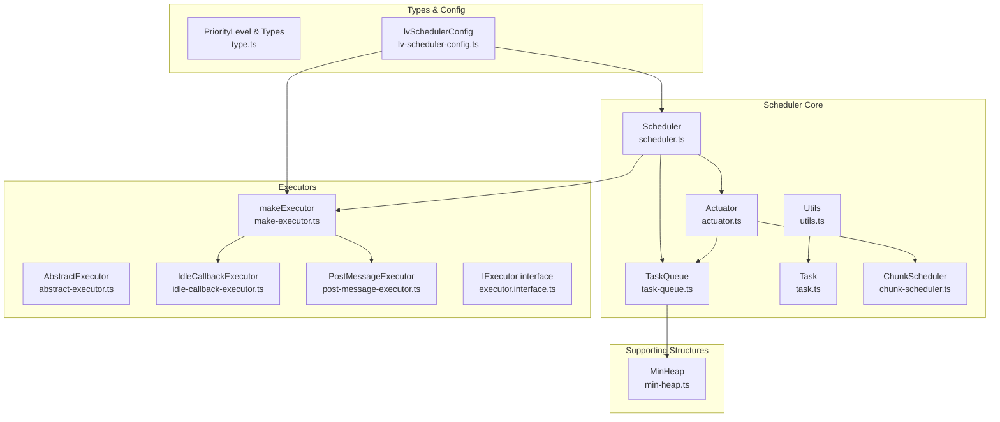
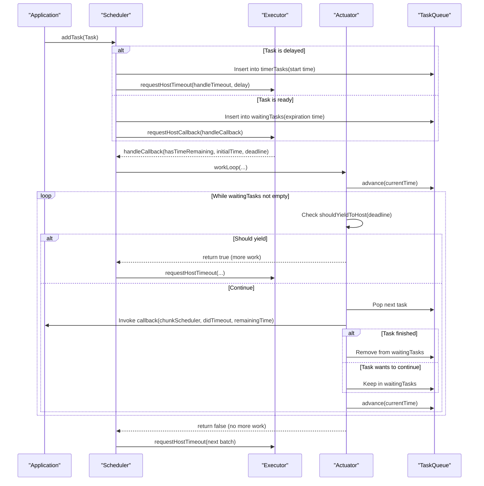
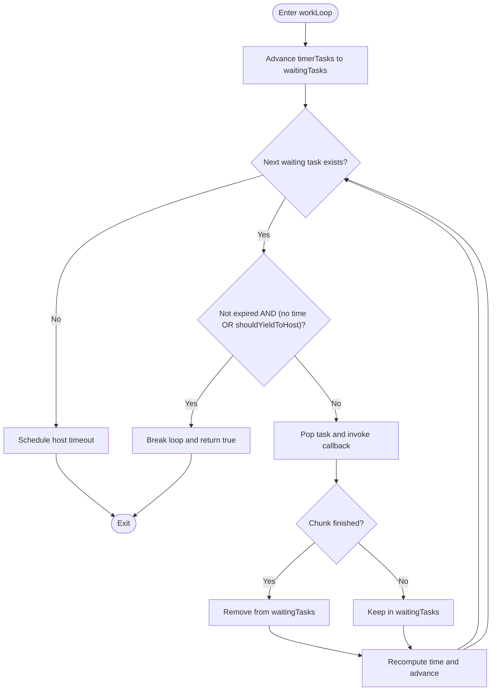
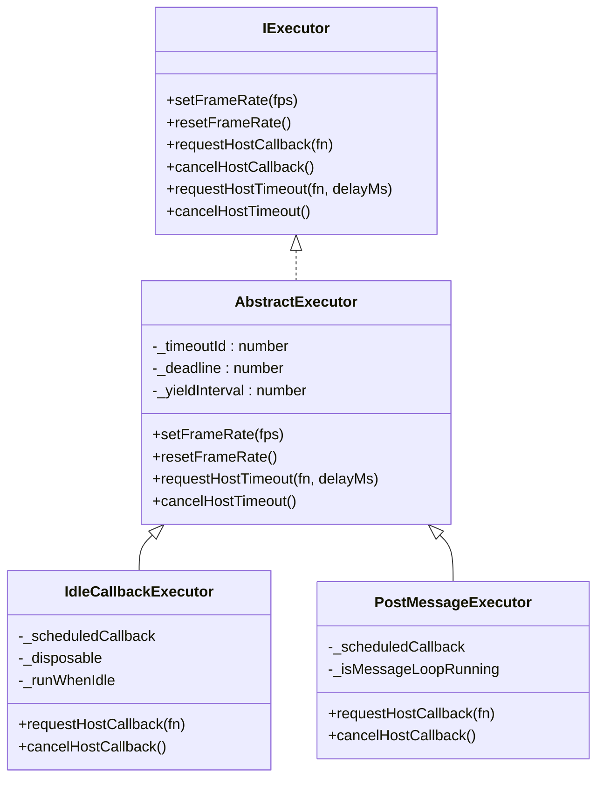
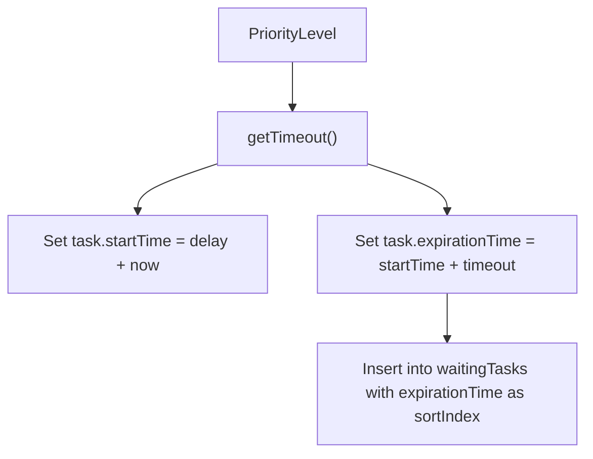
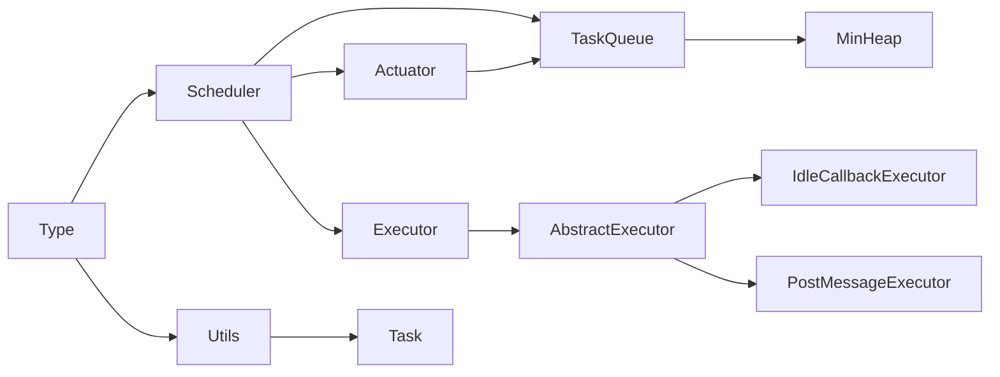

# Idle-time Processing

<cite>
**Referenced Files in This Document**
- [scheduler.ts](file://packages/h5-builder/src/bedrock/scheduler/core/scheduler.ts)
- [actuator.ts](file://packages/h5-builder/src/bedrock/scheduler/core/actuator.ts)
- [task-queue.ts](file://packages/h5-builder/src/bedrock/scheduler/core/task-queue.ts)
- [task.ts](file://packages/h5-builder/src/bedrock/scheduler/core/task.ts)
- [utils.ts](file://packages/h5-builder/src/bedrock/scheduler/core/utils.ts)
- [chunk-scheduler.ts](file://packages/h5-builder/src/bedrock/scheduler/core/chunk-scheduler.ts)
- [make-executor.ts](file://packages/h5-builder/src/bedrock/scheduler/executor/make-executor.ts)
- [abstract-executor.ts](file://packages/h5-builder/src/bedrock/scheduler/executor/abstract-executor.ts)
- [idle-callback-executor.ts](file://packages/h5-builder/src/bedrock/scheduler/executor/idle-callback-executor.ts)
- [post-message-executor.ts](file://packages/h5-builder/src/bedrock/scheduler/executor/post-message-executor.ts)
- [executor.interface.ts](file://packages/h5-builder/src/bedrock/scheduler/executor/executor.interface.ts)
- [type.ts](file://packages/h5-builder/src/bedrock/scheduler/type.ts)
- [lv-scheduler-config.ts](file://packages/h5-builder/src/bedrock/scheduler/lv-scheduler-config.ts)
- [min-heap.ts](file://packages/h5-builder/src/bedrock/structure/min-heap.ts)
- [idle-value.ts](file://packages/h5-builder/src/bedrock/di/idle-value.ts)
- [scheduler.test.ts](file://packages/h5-builder/src/bedrock/scheduler/core/scheduler.test.ts)
</cite>

## Table of Contents
1. [Introduction](#introduction)
2. [Project Structure](#project-structure)
3. [Core Components](#core-components)
4. [Architecture Overview](#architecture-overview)
5. [Detailed Component Analysis](#detailed-component-analysis)
6. [Dependency Analysis](#dependency-analysis)
7. [Performance Considerations](#performance-considerations)
8. [Troubleshooting Guide](#troubleshooting-guide)
9. [Conclusion](#conclusion)
10. [Appendices](#appendices)

## Introduction
This document explains how the framework performs idle-time processing using a custom Scheduler and an IdleCallbackExecutor. It covers how requestIdleCallback is used with a fallback mechanism for environments that do not support it, how tasks are prioritized and scheduled, and how the work loop yields control back to the browser when the main thread is busy. It also provides guidance on suitable idle operations and the performance benefits achieved.

## Project Structure
The idle-time processing implementation lives under the scheduler module. The key files are organized by responsibilities:
- Core scheduler orchestration and task queues
- Executors for different host scheduling mechanisms
- Utilities for priorities, timeouts, and task creation
- Type definitions and configuration helpers
- Supporting data structures (min-heap)

**Diagram sources**
- [scheduler.ts](file://packages/h5-builder/src/bedrock/scheduler/core/scheduler.ts#L1-L174)
- [actuator.ts](file://packages/h5-builder/src/bedrock/scheduler/core/actuator.ts#L1-L59)
- [task-queue.ts](file://packages/h5-builder/src/bedrock/scheduler/core/task-queue.ts#L1-L45)
- [task.ts](file://packages/h5-builder/src/bedrock/scheduler/core/task.ts#L1-L53)
- [utils.ts](file://packages/h5-builder/src/bedrock/scheduler/core/utils.ts#L1-L49)
- [chunk-scheduler.ts](file://packages/h5-builder/src/bedrock/scheduler/core/chunk-scheduler.ts#L1-L29)
- [make-executor.ts](file://packages/h5-builder/src/bedrock/scheduler/executor/make-executor.ts#L1-L19)
- [abstract-executor.ts](file://packages/h5-builder/src/bedrock/scheduler/executor/abstract-executor.ts#L1-L39)
- [idle-callback-executor.ts](file://packages/h5-builder/src/bedrock/scheduler/executor/idle-callback-executor.ts#L1-L99)
- [post-message-executor.ts](file://packages/h5-builder/src/bedrock/scheduler/executor/post-message-executor.ts#L1-L53)
- [executor.interface.ts](file://packages/h5-builder/src/bedrock/scheduler/executor/executor.interface.ts#L1-L40)
- [type.ts](file://packages/h5-builder/src/bedrock/scheduler/type.ts#L1-L49)
- [lv-scheduler-config.ts](file://packages/h5-builder/src/bedrock/scheduler/lv-scheduler-config.ts#L1-L18)
- [min-heap.ts](file://packages/h5-builder/src/bedrock/structure/min-heap.ts#L1-L92)

**Section sources**
- [scheduler.ts](file://packages/h5-builder/src/bedrock/scheduler/core/scheduler.ts#L1-L174)
- [type.ts](file://packages/h5-builder/src/bedrock/scheduler/type.ts#L1-L49)

## Core Components
- Scheduler: Central orchestrator that manages task queues, schedules callbacks, and decides when to yield to the host.
- Actuator: Executes tasks in a tight loop until time runs out or the queue is empty, invoking chunked callbacks.
- TaskQueue: Two min-heap queues: timerTasks (delayed) and waitingTasks (ready).
- Task: Encapsulates a scheduled callback with start and expiration times and sort index.
- Executors: Pluggable mechanisms for scheduling work on the host. IdleCallbackExecutor uses requestIdleCallback with a fallback to setTimeout. PostMessageExecutor uses MessageChannel for microtask-like scheduling.
- Utils: Provides priority timeouts and task creation helpers.
- ChunkScheduler: Allows a task to split long work into chunks and continue later.
- PriorityLevel: Enumerates priorities including IdlePriority for idle work.

Key responsibilities:
- Queue management and sorting using min-heap
- Determining when to yield based on time and input pending signals
- Scheduling callbacks via executors
- Exposing configuration for frame rate and input pending detection

**Section sources**
- [scheduler.ts](file://packages/h5-builder/src/bedrock/scheduler/core/scheduler.ts#L1-L174)
- [actuator.ts](file://packages/h5-builder/src/bedrock/scheduler/core/actuator.ts#L1-L59)
- [task-queue.ts](file://packages/h5-builder/src/bedrock/scheduler/core/task-queue.ts#L1-L45)
- [task.ts](file://packages/h5-builder/src/bedrock/scheduler/core/task.ts#L1-L53)
- [utils.ts](file://packages/h5-builder/src/bedrock/scheduler/core/utils.ts#L1-L49)
- [chunk-scheduler.ts](file://packages/h5-builder/src/bedrock/scheduler/core/chunk-scheduler.ts#L1-L29)
- [type.ts](file://packages/h5-builder/src/bedrock/scheduler/type.ts#L1-L49)

## Architecture Overview
The scheduler integrates with host scheduling APIs through an executor abstraction. It uses two queues:
- Timer tasks: delayed tasks sorted by start time
- Waiting tasks: ready-to-run tasks sorted by expiration time

Execution flow:
- Add tasks to appropriate queues
- Request host callback when there is work to do
- In the executor callback, compute a deadline and run the actuator work loop
- The actuator executes tasks until time remains and the queue is drained
- If there are remaining tasks, schedule a host timeout to drain delayed tasks
- If there are still waiting tasks, reschedule a host callback

**Diagram sources**
- [scheduler.ts](file://packages/h5-builder/src/bedrock/scheduler/core/scheduler.ts#L74-L173)
- [actuator.ts](file://packages/h5-builder/src/bedrock/scheduler/core/actuator.ts#L12-L58)
- [task-queue.ts](file://packages/h5-builder/src/bedrock/scheduler/core/task-queue.ts#L26-L44)
- [idle-callback-executor.ts](file://packages/h5-builder/src/bedrock/scheduler/executor/idle-callback-executor.ts#L65-L98)
- [post-message-executor.ts](file://packages/h5-builder/src/bedrock/scheduler/executor/post-message-executor.ts#L18-L52)

## Detailed Component Analysis

### Scheduler
Responsibilities:
- Manages task queues and decides whether to schedule a host callback or timeout
- Computes deadlines and delegates to the actuator
- Exposes configuration for input pending detection and frame rate

Key behaviors:
- addTask routes tasks to timerTasks or waitingTasks and schedules appropriately
- requestHostTimeout triggers timeout handling to advance timers and reschedule callbacks
- _handleHostCallback sets working state and invokes actuator workLoop
- shouldYieldToHost uses navigator.scheduling.isInputPending when available, otherwise falls back to time-based checks

Code snippet paths:
- [addTask](file://packages/h5-builder/src/bedrock/scheduler/core/scheduler.ts#L77-L105)
- [requestHostTimeout](file://packages/h5-builder/src/bedrock/scheduler/core/scheduler.ts#L110-L113)
- [_handleHostTimeout](file://packages/h5-builder/src/bedrock/scheduler/core/scheduler.ts#L114-L130)
- [_handleHostCallback](file://packages/h5-builder/src/bedrock/scheduler/core/scheduler.ts#L132-L152)
- [shouldYieldToHost](file://packages/h5-builder/src/bedrock/scheduler/core/scheduler.ts#L45-L65)

**Section sources**
- [scheduler.ts](file://packages/h5-builder/src/bedrock/scheduler/core/scheduler.ts#L1-L174)

### Actuator and Work Loop
Responsibilities:
- Drains waiting tasks in a tight loop
- Checks time remaining and yields when needed
- Invokes chunked callbacks and updates queues accordingly

Key logic:
- Advance timers to move expired tasks into waitingTasks
- Peek next task and decide whether to execute or yield
- Respect expiration time and shouldYieldToHost
- After execution, either remove or keep task depending on chunk continuation
- If queue is empty, schedule a host timeout to drain delayed tasks

Code snippet paths:
- [workLoop](file://packages/h5-builder/src/bedrock/scheduler/core/actuator.ts#L12-L58)
- [advance](file://packages/h5-builder/src/bedrock/scheduler/core/task-queue.ts#L26-L44)

**Diagram sources**
- [actuator.ts](file://packages/h5-builder/src/bedrock/scheduler/core/actuator.ts#L12-L58)
- [task-queue.ts](file://packages/h5-builder/src/bedrock/scheduler/core/task-queue.ts#L26-L44)

**Section sources**
- [actuator.ts](file://packages/h5-builder/src/bedrock/scheduler/core/actuator.ts#L1-L59)
- [task-queue.ts](file://packages/h5-builder/src/bedrock/scheduler/core/task-queue.ts#L1-L45)

### Executors and Fallback Mechanisms
Executors abstract host scheduling:
- IdleCallbackExecutor: Uses requestIdleCallback when available; otherwise simulates idle with setTimeout and a small time slice
- PostMessageExecutor: Uses MessageChannel to schedule microtask-like callbacks
- AbstractExecutor: Provides common timeout handling and frame-rate control

Fallback behavior:
- If requestIdleCallback is unavailable, IdleCallbackExecutor wraps a short timeout to simulate idle execution
- Frame rate controls the yield interval used to compute deadlines

Code snippet paths:
- [IdleCallbackExecutor constructor and fallback](file://packages/h5-builder/src/bedrock/scheduler/executor/idle-callback-executor.ts#L12-L63)
- [IdleCallbackExecutor request/cancel](file://packages/h5-builder/src/bedrock/scheduler/executor/idle-callback-executor.ts#L65-L98)
- [PostMessageExecutor](file://packages/h5-builder/src/bedrock/scheduler/executor/post-message-executor.ts#L1-L53)
- [AbstractExecutor](file://packages/h5-builder/src/bedrock/scheduler/executor/abstract-executor.ts#L1-L39)
- [makeExecutor](file://packages/h5-builder/src/bedrock/scheduler/executor/make-executor.ts#L1-L19)

**Diagram sources**
- [executor.interface.ts](file://packages/h5-builder/src/bedrock/scheduler/executor/executor.interface.ts#L1-L40)
- [abstract-executor.ts](file://packages/h5-builder/src/bedrock/scheduler/executor/abstract-executor.ts#L1-L39)
- [idle-callback-executor.ts](file://packages/h5-builder/src/bedrock/scheduler/executor/idle-callback-executor.ts#L1-L99)
- [post-message-executor.ts](file://packages/h5-builder/src/bedrock/scheduler/executor/post-message-executor.ts#L1-L53)

**Section sources**
- [idle-callback-executor.ts](file://packages/h5-builder/src/bedrock/scheduler/executor/idle-callback-executor.ts#L1-L99)
- [post-message-executor.ts](file://packages/h5-builder/src/bedrock/scheduler/executor/post-message-executor.ts#L1-L53)
- [abstract-executor.ts](file://packages/h5-builder/src/bedrock/scheduler/executor/abstract-executor.ts#L1-L39)
- [make-executor.ts](file://packages/h5-builder/src/bedrock/scheduler/executor/make-executor.ts#L1-L19)

### Task Priorities and Idle Tasks
Priority levels:
- ImmediatePriority
- UserBlockingPriority
- NormalPriority
- LowPriority
- IdlePriority

Idle tasks are created with a long timeout so they appear as “never expire” relative to typical scheduling windows. The framework exposes IdlePriority for idle work.

Code snippet paths:
- [PriorityLevel enum](file://packages/h5-builder/src/bedrock/scheduler/type.ts#L1-L13)
- [getTimeout mapping](file://packages/h5-builder/src/bedrock/scheduler/core/utils.ts#L23-L37)
- [makeTask](file://packages/h5-builder/src/bedrock/scheduler/core/utils.ts#L39-L48)

**Diagram sources**
- [type.ts](file://packages/h5-builder/src/bedrock/scheduler/type.ts#L1-L13)
- [utils.ts](file://packages/h5-builder/src/bedrock/scheduler/core/utils.ts#L23-L48)

**Section sources**
- [type.ts](file://packages/h5-builder/src/bedrock/scheduler/type.ts#L1-L49)
- [utils.ts](file://packages/h5-builder/src/bedrock/scheduler/core/utils.ts#L1-L49)

### IdleCallbackExecutor Fallback Behavior
When requestIdleCallback is not available:
- A timeout is scheduled to simulate idle execution
- An IdleDeadline-like object is created with didTimeout true and a small timeRemaining window
- Subsequent callbacks re-schedule themselves automatically

Code snippet paths:
- [fallback implementation](file://packages/h5-builder/src/bedrock/scheduler/executor/idle-callback-executor.ts#L19-L44)
- [requestHostCallback](file://packages/h5-builder/src/bedrock/scheduler/executor/idle-callback-executor.ts#L65-L69)
- [flush callback](file://packages/h5-builder/src/bedrock/scheduler/executor/idle-callback-executor.ts#L78-L98)

**Section sources**
- [idle-callback-executor.ts](file://packages/h5-builder/src/bedrock/scheduler/executor/idle-callback-executor.ts#L1-L99)

### ChunkScheduler and Continuation
ChunkScheduler allows a task to split long work into smaller pieces:
- execute: starts a new task in the same scheduler
- continueExecute: continues the current task immediately

Code snippet paths:
- [ChunkScheduler.execute](file://packages/h5-builder/src/bedrock/scheduler/core/chunk-scheduler.ts#L24-L28)
- [ChunkScheduler.continueExecute](file://packages/h5-builder/src/bedrock/scheduler/core/chunk-scheduler.ts#L18-L23)

**Section sources**
- [chunk-scheduler.ts](file://packages/h5-builder/src/bedrock/scheduler/core/chunk-scheduler.ts#L1-L29)

### Practical Example: Idle Initialization
IdleValue demonstrates idle initialization using IdlePriority:
- Creates a disposable handle to schedule initialization during idle
- Initializes lazily when the browser is idle

Code snippet paths:
- [IdleValue constructor scheduling](file://packages/h5-builder/src/bedrock/di/idle-value.ts#L17-L34)

**Section sources**
- [idle-value.ts](file://packages/h5-builder/src/bedrock/di/idle-value.ts#L1-L63)

## Dependency Analysis
- Scheduler depends on TaskQueue, Actuator, and Executor
- Actuator depends on TaskQueue and Scheduler for scheduling timeouts
- Executors depend on AbstractExecutor and are selected by makeExecutor
- Utils and type definitions are shared across components
- MinHeap provides underlying queue ordering

**Diagram sources**
- [scheduler.ts](file://packages/h5-builder/src/bedrock/scheduler/core/scheduler.ts#L1-L174)
- [actuator.ts](file://packages/h5-builder/src/bedrock/scheduler/core/actuator.ts#L1-L59)
- [task-queue.ts](file://packages/h5-builder/src/bedrock/scheduler/core/task-queue.ts#L1-L45)
- [min-heap.ts](file://packages/h5-builder/src/bedrock/structure/min-heap.ts#L1-L92)
- [make-executor.ts](file://packages/h5-builder/src/bedrock/scheduler/executor/make-executor.ts#L1-L19)
- [abstract-executor.ts](file://packages/h5-builder/src/bedrock/scheduler/executor/abstract-executor.ts#L1-L39)
- [idle-callback-executor.ts](file://packages/h5-builder/src/bedrock/scheduler/executor/idle-callback-executor.ts#L1-L99)
- [post-message-executor.ts](file://packages/h5-builder/src/bedrock/scheduler/executor/post-message-executor.ts#L1-L53)
- [utils.ts](file://packages/h5-builder/src/bedrock/scheduler/core/utils.ts#L1-L49)
- [type.ts](file://packages/h5-builder/src/bedrock/scheduler/type.ts#L1-L49)

**Section sources**
- [scheduler.ts](file://packages/h5-builder/src/bedrock/scheduler/core/scheduler.ts#L1-L174)
- [actuator.ts](file://packages/h5-builder/src/bedrock/scheduler/core/actuator.ts#L1-L59)
- [task-queue.ts](file://packages/h5-builder/src/bedrock/scheduler/core/task-queue.ts#L1-L45)
- [make-executor.ts](file://packages/h5-builder/src/bedrock/scheduler/executor/make-executor.ts#L1-L19)
- [abstract-executor.ts](file://packages/h5-builder/src/bedrock/scheduler/executor/abstract-executor.ts#L1-L39)
- [utils.ts](file://packages/h5-builder/src/bedrock/scheduler/core/utils.ts#L1-L49)
- [type.ts](file://packages/h5-builder/src/bedrock/scheduler/type.ts#L1-L49)

## Performance Considerations
- Frame rate control: Adjusting yield intervals affects how often the scheduler yields to the browser. Lower FPS reduces CPU usage but increases latency.
- Input pending detection: Enabling input pending checks helps prioritize responsiveness to user input by yielding earlier when input is pending.
- Task expiration: Idle tasks use long timeouts, making them suitable for non-essential work that does not require immediate execution.
- Microtask vs macrotask: Using IdleCallbackExecutor or PostMessageExecutor avoids blocking the main thread for extended periods.

Practical tips:
- Prefer IdlePriority for background work such as analytics, logging, cache warming, or non-interactive updates.
- Use ChunkScheduler to break long tasks into smaller pieces to improve interactivity.
- Tune fps and enableInputPending via configuration for your environment.

[No sources needed since this section provides general guidance]

## Troubleshooting Guide
Common issues and resolutions:
- No idle callbacks firing:
  - Verify requestIdleCallback availability; fallback uses setTimeout with a small window
  - Check that requestHostCallback was invoked and not canceled prematurely
- Tasks not executing:
  - Ensure tasks are inserted into the correct queue (timerTasks vs waitingTasks)
  - Confirm that addTask schedules a host callback when ready
- Excessive blocking:
  - Reduce frame rate or disable input pending detection temporarily
  - Split long tasks using ChunkScheduler to allow yielding

Validation references:
- [Scheduler.addTask behavior](file://packages/h5-builder/src/bedrock/scheduler/core/scheduler.ts#L77-L105)
- [IdleCallbackExecutor fallback](file://packages/h5-builder/src/bedrock/scheduler/executor/idle-callback-executor.ts#L19-L44)
- [Actuator work loop](file://packages/h5-builder/src/bedrock/scheduler/core/actuator.ts#L12-L58)
- [Test coverage for scheduling](file://packages/h5-builder/src/bedrock/scheduler/core/scheduler.test.ts#L1-L346)

**Section sources**
- [scheduler.ts](file://packages/h5-builder/src/bedrock/scheduler/core/scheduler.ts#L74-L173)
- [idle-callback-executor.ts](file://packages/h5-builder/src/bedrock/scheduler/executor/idle-callback-executor.ts#L12-L63)
- [actuator.ts](file://packages/h5-builder/src/bedrock/scheduler/core/actuator.ts#L12-L58)
- [scheduler.test.ts](file://packages/h5-builder/src/bedrock/scheduler/core/scheduler.test.ts#L1-L346)

## Conclusion
The framework’s idle-time processing combines a robust scheduler with pluggable executors to run non-essential work during browser idle periods. It gracefully handles environments without requestIdleCallback, prioritizes tasks using a clear priority system, and yields control back to the browser when needed. By leveraging IdlePriority and ChunkScheduler, developers can offload background tasks efficiently while maintaining responsiveness.

[No sources needed since this section summarizes without analyzing specific files]

## Appendices

### How shouldYieldToHost Determines Yielding
- If input pending detection is enabled and the host reports pending input, yield immediately
- Otherwise, yield when current time reaches the computed deadline

Code snippet paths:
- [shouldYieldToHost](file://packages/h5-builder/src/bedrock/scheduler/core/scheduler.ts#L45-L65)

**Section sources**
- [scheduler.ts](file://packages/h5-builder/src/bedrock/scheduler/core/scheduler.ts#L45-L65)

### Suitable Operations for Idle Processing
- Background analytics and telemetry
- Cache warming and preloading
- Non-interactive UI updates
- Deferred logging and diagnostics
- Lazy initialization of expensive resources

[No sources needed since this section provides general guidance]