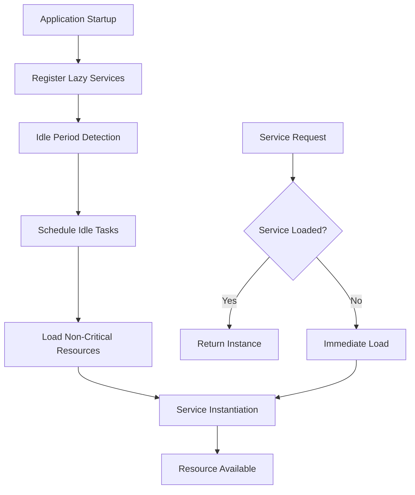
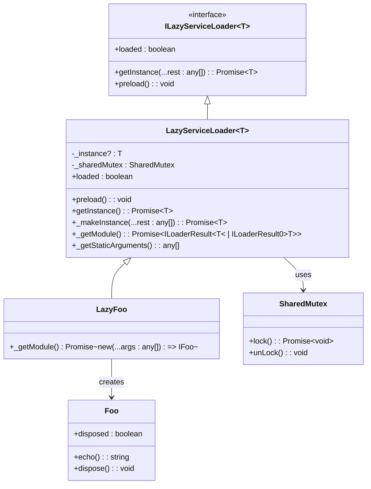
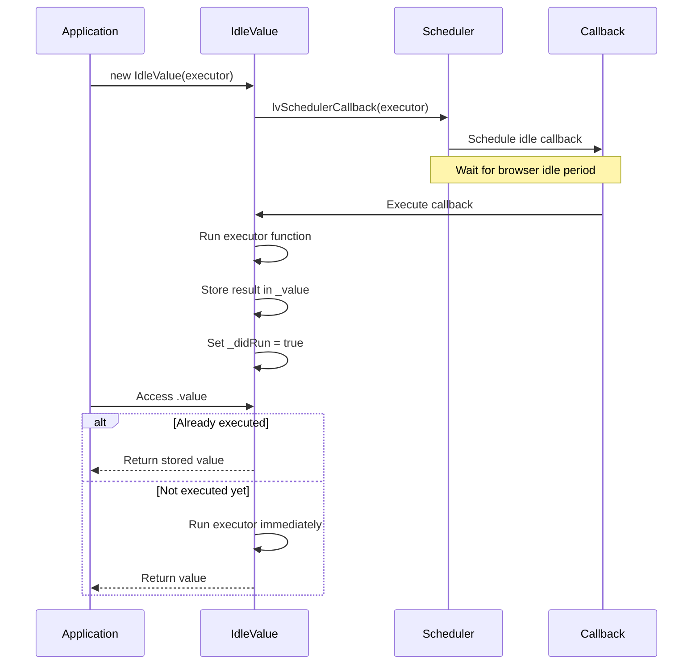
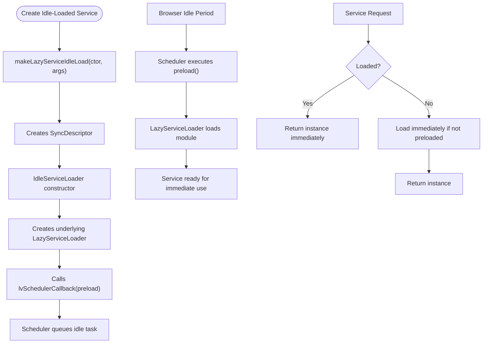

# Lazy Loading

<cite>
**Referenced Files in This Document**   
- [lazy-service.ts](file://packages/h5-builder/src/bedrock/di/lazy/lazy-service.ts)
- [idle-load.ts](file://packages/h5-builder/src/bedrock/di/lazy/idle-load.ts)
- [idle-value.ts](file://packages/h5-builder/src/bedrock/di/idle-value.ts)
- [type.ts](file://packages/h5-builder/src/bedrock/di/lazy/type.ts)
- [lv-scheduler-callback.ts](file://packages/h5-builder/src/bedrock/scheduler/lv-scheduler-callback.ts)
- [scheduler.ts](file://packages/h5-builder/src/bedrock/scheduler/core/scheduler.ts)
- [lazy-service.test.ts](file://packages/h5-builder/src/bedrock/di/lazy/lazy-service.test.ts)
- [idle-value.test.ts](file://packages/h5-builder/src/bedrock/di/idle-value.test.ts)
- [foo.mock.ts](file://packages/h5-builder/src/bedrock/di/lazy/foo.mock.ts)
</cite>

## Table of Contents
1. [Introduction](#introduction)
2. [Core Components](#core-components)
3. [Architecture Overview](#architecture-overview)
4. [Detailed Component Analysis](#detailed-component-analysis)
5. [Integration with Scheduler System](#integration-with-scheduler-system)
6. [Best Practices](#best-practices)
7. [Conclusion](#conclusion)

## Introduction
The framework implements a sophisticated lazy loading system that optimizes application performance by deferring the loading of non-critical services and components until they are actually needed. This documentation details the implementation of lazy loading through the Dependency Injection (DI) system, focusing on the `LazyServiceLoader` and `IdleValue` classes that work in conjunction with the scheduler system to load resources during browser idle periods using `requestIdleCallback`. The system is designed to improve initial load time, reduce memory consumption, and enhance overall application responsiveness.

## Core Components

The lazy loading system consists of several key components that work together to enable deferred loading of services and values. The primary components include the `LazyServiceLoader` class for deferred service instantiation, the `IdleValue` class for idle-time value initialization, and the `makeLazyServiceIdleLoad` function that integrates lazy services with the idle scheduling system.

**Section sources**
- [lazy-service.ts](file://packages/h5-builder/src/bedrock/di/lazy/lazy-service.ts#L1-L72)
- [idle-value.ts](file://packages/h5-builder/src/bedrock/di/idle-value.ts#L1-L64)
- [idle-load.ts](file://packages/h5-builder/src/bedrock/di/lazy/idle-load.ts#L1-L40)

## Architecture Overview

The lazy loading architecture follows a layered approach where services and values are wrapped in containers that control their instantiation timing. The system integrates with the framework's scheduler to prioritize loading during idle periods, ensuring that critical user interactions are not blocked by background loading operations.



**Diagram sources**
- [lazy-service.ts](file://packages/h5-builder/src/bedrock/di/lazy/lazy-service.ts#L19-L72)
- [idle-value.ts](file://packages/h5-builder/src/bedrock/di/idle-value.ts#L8-L64)
- [scheduler.ts](file://packages/h5-builder/src/bedrock/scheduler/core/scheduler.ts#L24-L174)

## Detailed Component Analysis

### LazyServiceLoader Analysis

The `LazyServiceLoader` class provides the foundation for deferred service loading in the DI system. It implements the `ILazyServiceLoader<T>` interface and serves as an abstract base class that must be extended to provide specific module loading logic.



**Diagram sources**
- [lazy-service.ts](file://packages/h5-builder/src/bedrock/di/lazy/lazy-service.ts#L5-L72)
- [lazy-service.test.ts](file://packages/h5-builder/src/bedrock/di/lazy/lazy-service.test.ts#L7-L11)

**Section sources**
- [lazy-service.ts](file://packages/h5-builder/src/bedrock/di/lazy/lazy-service.ts#L1-L72)
- [lazy-service.test.ts](file://packages/h5-builder/src/bedrock/di/lazy/lazy-service.test.ts#L1-L66)

### IdleValue Analysis

The `IdleValue` class enables the initialization of values during browser idle periods using the `requestIdleCallback` API. This ensures that non-critical computations do not interfere with user interactions or animation frames.



**Diagram sources**
- [idle-value.ts](file://packages/h5-builder/src/bedrock/di/idle-value.ts#L8-L64)
- [idle-value.test.ts](file://packages/h5-builder/src/bedrock/di/idle-value.test.ts#L1-L74)

**Section sources**
- [idle-value.ts](file://packages/h5-builder/src/bedrock/di/idle-value.ts#L1-L64)
- [idle-value.test.ts](file://packages/h5-builder/src/bedrock/di/idle-value.test.ts#L1-L74)

### Integration with Idle Loading

The `makeLazyServiceIdleLoad` function creates a wrapper around lazy services that automatically schedules their preloading during idle periods. This integration ensures that services are loaded in the background without impacting the main thread performance.



**Diagram sources**
- [idle-load.ts](file://packages/h5-builder/src/bedrock/di/lazy/idle-load.ts#L7-L40)
- [lv-scheduler-callback.ts](file://packages/h5-builder/src/bedrock/scheduler/lv-scheduler-callback.ts#L1-L20)

**Section sources**
- [idle-load.ts](file://packages/h5-builder/src/bedrock/di/lazy/idle-load.ts#L1-L40)

## Integration with Scheduler System

The lazy loading system is tightly integrated with the framework's scheduler system, which manages the execution of tasks during idle periods. The scheduler uses `requestIdleCallback` to detect when the browser is idle and can safely execute non-critical tasks without affecting user experience.

```mermaid
graph TB
subgraph "Scheduler System"
S[Scheduler]
T[TaskQueue]
A[Actuator]
E[Executor]
end
subgraph "Lazy Loading"
LS[LazyServiceLoader]
IV[IdleValue]
IL[IdleServiceLoader]
end
LS --> |preload()| S
IV --> |constructor| S
IL --> |lvSchedulerCallback| S
S --> T
T --> A
A --> E
E --> |requestHostCallback| Window
E --> |requestHostTimeout| Window
Window --> |idleCallback| E
E --> |execute| A
A --> |process tasks| T
T --> |complete| S
```

**Diagram sources**
- [scheduler.ts](file://packages/h5-builder/src/bedrock/scheduler/core/scheduler.ts#L24-L174)
- [lv-scheduler-callback.ts](file://packages/h5-builder/src/bedrock/scheduler/lv-scheduler-callback.ts#L1-L20)
- [idle-value.ts](file://packages/h5-builder/src/bedrock/di/idle-value.ts#L1-L64)

**Section sources**
- [scheduler.ts](file://packages/h5-builder/src/bedrock/scheduler/core/scheduler.ts#L1-L174)
- [lv-scheduler-callback.ts](file://packages/h5-builder/src/bedrock/scheduler/lv-scheduler-callback.ts#L1-L20)

## Best Practices

When implementing lazy loading in the framework, consider the following best practices to optimize performance and user experience:

### Identifying Components for Lazy Loading

Components and services that are good candidates for lazy loading typically share the following characteristics:
- Not required for initial page rendering or critical user interactions
- Large in size or have significant initialization overhead
- Used infrequently or only in specific user flows
- Have dependencies that are also not critical for startup

**Section sources**
- [lazy-service.test.ts](file://packages/h5-builder/src/bedrock/di/lazy/lazy-service.test.ts#L7-L11)
- [idle-value.test.ts](file://packages/h5-builder/src/bedrock/di/idle-value.test.ts#L4-L25)

### Configuring Lazy Loading Thresholds

The framework's scheduler automatically manages idle period detection, but you can influence the behavior through the following considerations:
- Services wrapped with `makeLazyServiceIdleLoad` will be preloaded during the first available idle period after registration
- The `PriorityLevel.IdlePriority` ensures that these tasks are scheduled with the lowest priority, only executing when the browser is truly idle
- For services that might be needed soon, consider calling `preload()` manually to initiate loading without waiting for the next idle period

### Error Handling and Fallbacks

The lazy loading system includes built-in error handling:
- The `SharedMutex` in `LazyServiceLoader` ensures thread-safe initialization, preventing race conditions when multiple consumers request the same service simultaneously
- Errors during initialization are propagated to the caller when `getInstance()` is invoked
- The `IdleValue` class throws any errors from the executor function when the value is accessed

**Section sources**
- [lazy-service.ts](file://packages/h5-builder/src/bedrock/di/lazy/lazy-service.ts#L41-L50)
- [idle-value.ts](file://packages/h5-builder/src/bedrock/di/idle-value.ts#L19-L23)

## Conclusion

The framework's lazy loading system provides a robust mechanism for optimizing application performance through deferred loading of services and values. By leveraging the DI system's `LazyServiceLoader` and the scheduler's idle-time processing capabilities, developers can significantly improve initial load times and overall application responsiveness. The integration between `LazyService` and `IdleValue` classes with the scheduler system ensures that non-critical resources are loaded during browser idle periods using `requestIdleCallback`, minimizing impact on user experience. When properly applied to appropriate components, this lazy loading approach can dramatically enhance the performance characteristics of web applications built on this framework.