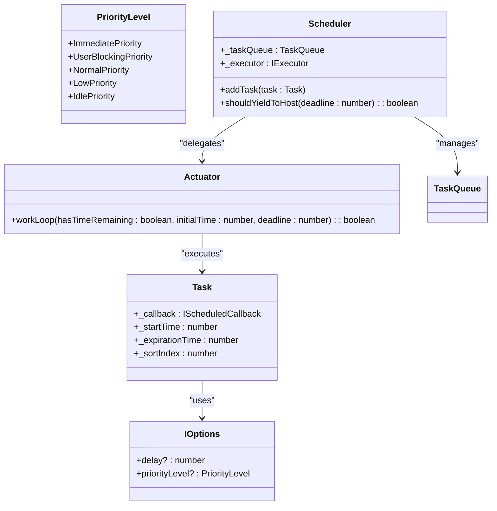
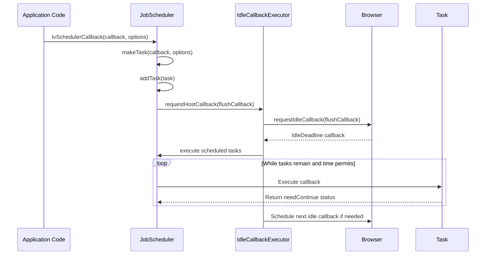
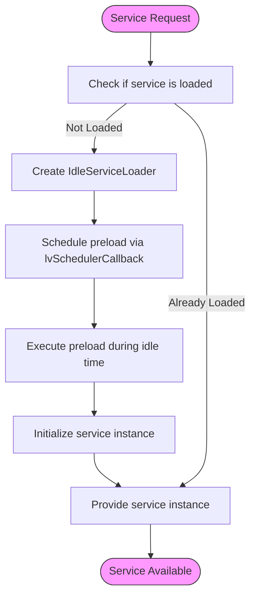
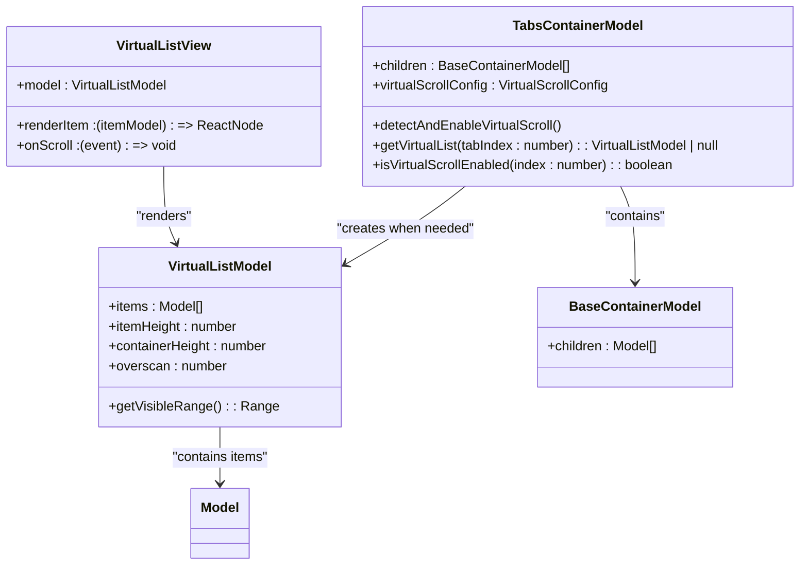
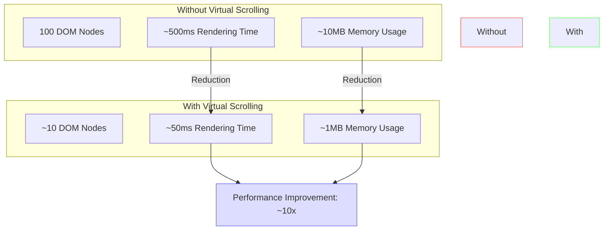

# Performance Optimization

<cite>
**Referenced Files in This Document**   
- [auto-virtual-scroll.md](file://packages/h5-builder/docs/auto-virtual-scroll.md)
- [scheduler.ts](file://packages/h5-builder/src/bedrock/scheduler/core/scheduler.ts)
- [lv-scheduler-config.ts](file://packages/h5-builder/src/bedrock/scheduler/lv-scheduler-config.ts)
- [type.ts](file://packages/h5-builder/src/bedrock/scheduler/type.ts)
- [lv-scheduler-callback.ts](file://packages/h5-builder/src/bedrock/scheduler/lv-scheduler-callback.ts)
- [idle-callback-executor.ts](file://packages/h5-builder/src/bedrock/scheduler/executor/idle-callback-executor.ts)
- [chunk-scheduler.ts](file://packages/h5-builder/src/bedrock/scheduler/core/chunk-scheduler.ts)
- [actuator.ts](file://packages/h5-builder/src/bedrock/scheduler/core/actuator.ts)
- [task.ts](file://packages/h5-builder/src/bedrock/scheduler/core/task.ts)
- [idle-load.ts](file://packages/h5-builder/src/bedrock/di/lazy/idle-load.ts)
- [virtual-list.model.ts](file://packages/h5-builder/src/components/virtual-list/virtual-list.model.ts)
- [virtual-list.view.tsx](file://packages/h5-builder/src/components/virtual-list/virtual-list.view.tsx)
- [tabs-container.model.ts](file://packages/h5-builder/src/components/tabs-container/tabs-container.model.ts)
- [tabs-container.view.tsx](file://packages/h5-builder/src/components/tabs-container/tabs-container.view.tsx)
</cite>

## Table of Contents
1. [Introduction](#introduction)
2. [JobScheduler and Task Priorities](#jobscheduler-and-task-priorities)
3. [Idle-time Processing with scheduleIdleTask](#idle-time-processing-with-scheduleidletask)
4. [Virtual Scrolling System](#virtual-scrolling-system)
5. [Performance Comparisons](#performance-comparisons)
6. [Best Practices](#best-practices)
7. [Conclusion](#conclusion)

## Introduction

The MobX framework implements a sophisticated performance optimization system centered around three key techniques: Lazy Loading, Idle-time Processing, and Virtual Scrolling. These optimizations are designed to improve application responsiveness, reduce memory consumption, and enhance user experience, particularly in scenarios involving large datasets and complex component hierarchies.

The core of this optimization system is built on a custom JobScheduler that manages task execution with different priorities, an idle-time processing mechanism that leverages browser idle periods for non-critical work, and an auto-virtual-scroll feature that automatically optimizes rendering for container components with many children.

This document provides a comprehensive analysis of these performance optimization mechanisms, detailing their implementation, configuration options, and best practices for effective utilization.

**Section sources**
- [auto-virtual-scroll.md](file://packages/h5-builder/docs/auto-virtual-scroll.md#L1-L216)

## JobScheduler and Task Priorities

The MobX framework features a sophisticated JobScheduler system that manages task execution with different priority levels to optimize performance and responsiveness. The scheduler uses a priority-based system to ensure critical tasks are executed promptly while deferring less important work.

The scheduler implements five priority levels defined in the `PriorityLevel` enum:



**Diagram sources**
- [type.ts](file://packages/h5-builder/src/bedrock/scheduler/type.ts#L2-L13)
- [scheduler.ts](file://packages/h5-builder/src/bedrock/scheduler/core/scheduler.ts#L24-L174)
- [task.ts](file://packages/h5-builder/src/bedrock/scheduler/core/task.ts#L4-L53)
- [actuator.ts](file://packages/h5-builder/src/bedrock/scheduler/core/actuator.ts#L6-L59)

The JobScheduler operates by maintaining a task queue and using an executor to schedule callbacks. When a task is added via `addTask()`, it is inserted into the appropriate queue based on its start time and expiration time. Tasks that are ready to execute are placed in the waiting queue, while delayed tasks are placed in the timer queue.

The scheduler's `shouldYieldToHost` method determines when to yield control back to the browser, ensuring smooth user interaction. It checks both the current deadline and, when available, the `navigator.scheduling.isInputPending()` API to detect pending user input.

The execution flow follows this sequence:
1. Tasks are added to the scheduler with specific priorities and timing constraints
2. The scheduler organizes tasks in priority order
3. During each frame, the actuator processes tasks until the deadline is reached or higher-priority input is detected
4. Unfinished tasks are rescheduled for later execution

This priority-based scheduling system enables the framework to handle critical user interactions immediately while deferring less important work to idle periods.

**Section sources**
- [scheduler.ts](file://packages/h5-builder/src/bedrock/scheduler/core/scheduler.ts#L24-L174)
- [type.ts](file://packages/h5-builder/src/bedrock/scheduler/type.ts#L2-L13)
- [actuator.ts](file://packages/h5-builder/src/bedrock/scheduler/core/actuator.ts#L6-L59)

## Idle-time Processing with scheduleIdleTask

The MobX framework provides robust idle-time processing capabilities through its scheduler system, allowing non-critical work to be performed during browser idle periods. This optimization technique ensures that background tasks do not interfere with user interactions or critical rendering operations.

The idle-time processing system is implemented through the `IdleCallbackExecutor`, which serves as the execution engine for idle tasks:



**Diagram sources**
- [idle-callback-executor.ts](file://packages/h5-builder/src/bedrock/scheduler/executor/idle-callback-executor.ts#L12-L99)
- [lv-scheduler-callback.ts](file://packages/h5-builder/src/bedrock/scheduler/lv-scheduler-callback.ts#L14-L20)
- [scheduler.ts](file://packages/h5-builder/src/bedrock/scheduler/core/scheduler.ts#L77-L105)

The system uses `requestIdleCallback` when available, with a fallback implementation for browsers that don't support this API. When `requestIdleCallback` is not available, the system simulates idle periods using `setTimeout` with a 15ms delay (approximately one frame at 64fps).

Developers can schedule idle tasks using the `lvSchedulerCallback` function, which accepts a callback and optional configuration:

```typescript
lvSchedulerCallback(
  (chunkScheduler, didTimeout, remainingTime) => {
    // Perform non-critical work here
    // Use chunkScheduler.continueExecute() if more work remains
  },
  { priorityLevel: PriorityLevel.IdlePriority }
);
```

The framework also supports lazy loading of services through the `makeLazyServiceIdleLoad` function, which automatically schedules service preloading during idle periods:



**Diagram sources**
- [idle-load.ts](file://packages/h5-builder/src/bedrock/di/lazy/idle-load.ts#L7-L40)
- [lv-scheduler-callback.ts](file://packages/h5-builder/src/bedrock/scheduler/lv-scheduler-callback.ts#L14-L20)

This idle-time processing system enables efficient handling of background tasks such as data prefetching, analytics reporting, and non-essential service initialization without impacting the user experience.

**Section sources**
- [idle-callback-executor.ts](file://packages/h5-builder/src/bedrock/scheduler/executor/idle-callback-executor.ts#L12-L99)
- [lv-scheduler-callback.ts](file://packages/h5-builder/src/bedrock/scheduler/lv-scheduler-callback.ts#L14-L20)
- [idle-load.ts](file://packages/h5-builder/src/bedrock/di/lazy/idle-load.ts#L7-L40)

## Virtual Scrolling System

The MobX framework implements an advanced auto-virtual-scroll feature that automatically optimizes rendering performance for container components with many children. This system detects when virtual scrolling should be enabled and transparently applies the optimization without requiring changes to the component schema.

The virtual scrolling system is primarily implemented in the `TabsContainer` component, which automatically enables virtual scrolling when the number of child components exceeds a configurable threshold:



**Diagram sources**
- [tabs-container.model.ts](file://packages/h5-builder/src/components/tabs-container/tabs-container.model.ts)
- [virtual-list.model.ts](file://packages/h5-builder/src/components/virtual-list/virtual-list.model.ts)
- [virtual-list.view.tsx](file://packages/h5-builder/src/components/virtual-list/virtual-list.view.tsx)

The detection logic for automatic virtual scrolling follows these steps:

1. The `TabsContainerModel.detectAndEnableVirtualScroll()` method is called during initialization
2. It iterates through all tabs and checks if they are container components (inherited from `BaseContainerModel`)
3. For each container tab, it counts the number of child components
4. If the count exceeds the threshold (default: 20), it creates a `VirtualListModel`
5. The original children are transferred to the virtual list model
6. The view layer automatically uses `VirtualListView` instead of rendering all children directly

The system supports comprehensive configuration options:

| Parameter | Type | Default | Description |
|---------|------|--------|-------------|
| `enabled` | `boolean` | `undefined` | Force enable/disable virtual scrolling |
| `threshold` | `number` | `20` | Child count threshold to trigger virtual scrolling |
| `itemHeight` | `number` | `120` | Height of each item in pixels |
| `containerHeight` | `number` | `600` | Visible container height in pixels |
| `overscan` | `number` | `3` | Number of additional items to render beyond visible area |

The rendering logic in `TabsContainerView` conditionally renders either the virtual scroll view or the regular component tree:

```typescript
{model.children.map((child, index) => {
  const virtualList = model.getVirtualList(index);
  
  return virtualList ? (
    <VirtualListView
      model={virtualList}
      renderItem={(itemModel) => <ModelRenderer model={itemModel} />}
    />
  ) : (
    <ModelRenderer model={child} />
  );
})}
```

This conditional rendering approach ensures zero intrusion to existing code while providing significant performance benefits when needed.

**Section sources**
- [auto-virtual-scroll.md](file://packages/h5-builder/docs/auto-virtual-scroll.md#L1-L216)
- [tabs-container.model.ts](file://packages/h5-builder/src/components/tabs-container/tabs-container.model.ts)
- [tabs-container.view.tsx](file://packages/h5-builder/src/components/tabs-container/tabs-container.view.tsx)
- [virtual-list.model.ts](file://packages/h5-builder/src/components/virtual-list/virtual-list.model.ts)
- [virtual-list.view.tsx](file://packages/h5-builder/src/components/virtual-list/virtual-list.view.tsx)

## Performance Comparisons

The auto-virtual-scroll feature provides dramatic performance improvements for container components with large numbers of children. The framework documentation includes specific performance metrics that demonstrate the effectiveness of this optimization:



**Diagram sources**
- [auto-virtual-scroll.md](file://packages/h5-builder/docs/auto-virtual-scroll.md#L142-L159)

The performance benefits are substantial:

- **Rendering Time**: Reduced from approximately 500ms to 50ms (10x improvement)
- **Memory Usage**: Reduced from approximately 10MB to 1MB (10x improvement)
- **DOM Nodes**: Reduced from 100 to approximately 10 visible nodes

These improvements are achieved by rendering only the visible portion of the content plus a small overscan buffer, rather than rendering all items in the list. The virtual scrolling system maintains a fixed-size DOM structure regardless of the total number of items, which eliminates the performance degradation that typically occurs as list size increases.

The system also includes debugging capabilities to monitor when virtual scrolling is activated. When enabled, the console outputs messages indicating which tabs have virtual scrolling enabled and how many items they contain:

```
[TabsContainer:main-tabs] Virtual scroll enabled for tab 0 (100 items)
```

Additionally, analytics events are emitted when users switch between tabs, including whether virtual scrolling is enabled for the target tab:

```json
{
  "event": "TAB_SWITCH",
  "tabsId": "main-tabs",
  "from": 0,
  "to": 1,
  "virtualScrollEnabled": true
}
```

These performance metrics and monitoring capabilities allow developers to verify the effectiveness of the optimization and make data-driven decisions about configuration.

**Section sources**
- [auto-virtual-scroll.md](file://packages/h5-builder/docs/auto-virtual-scroll.md#L142-L178)

## Best Practices

To maximize the effectiveness of the performance optimization features in the MobX framework, follow these best practices:

### Lazy Loading Implementation

1. **Use automatic detection**: In most cases, rely on the framework's automatic virtual scrolling detection rather than manual configuration
2. **Ensure consistent item heights**: Set the `itemHeight` parameter to match the actual height of your list items for optimal rendering
3. **Configure appropriate overscan**: Use an overscan value of 3-5 items to prevent blank areas during fast scrolling
4. **Monitor performance**: Use the provided analytics events to track virtual scrolling effectiveness in production

### Long List Optimization

1. **Leverage idle-time processing**: Schedule non-critical work like data prefetching and analytics using `lvSchedulerCallback` with `IdlePriority`
2. **Use lazy service loading**: Implement `makeLazyServiceIdleLoad` for services that are not needed immediately
3. **Configure scheduler appropriately**: Adjust the scheduler's frame rate and input pending settings based on your application's needs:

```typescript
lvSchedulerConfig({
  fps: 60,
  enableInputPending: true
});
```

4. **Test with realistic data**: Validate performance with data sets that reflect real-world usage patterns

### Configuration Recommendations

1. **Default threshold**: The default threshold of 20 items works well for most use cases
2. **Custom thresholds**: Adjust the threshold based on item complexity and device capabilities
3. **Container height**: Set `containerHeight` to match the actual visible area to optimize rendering
4. **Performance monitoring**: Enable the console logging and analytics to verify optimization effectiveness

The framework's zero-intrusion design means these optimizations can be applied to existing components without code changes, making it easy to incrementally improve performance across an application.

**Section sources**
- [auto-virtual-scroll.md](file://packages/h5-builder/docs/auto-virtual-scroll.md#L181-L211)
- [lv-scheduler-config.ts](file://packages/h5-builder/src/bedrock/scheduler/lv-scheduler-config.ts#L4-L17)
- [idle-load.ts](file://packages/h5-builder/src/bedrock/di/lazy/idle-load.ts#L34-L40)

## Conclusion

The MobX framework provides a comprehensive performance optimization system that effectively addresses common performance challenges in web applications. The combination of Lazy Loading, Idle-time Processing, and Virtual Scrolling creates a powerful toolkit for maintaining responsive user interfaces even with large datasets and complex component hierarchies.

The JobScheduler system with its priority-based task execution ensures that critical user interactions are handled promptly while deferring less important work. The idle-time processing capabilities leverage browser idle periods to perform background tasks without impacting user experience. The auto-virtual-scroll feature provides dramatic performance improvements for long lists with zero code intrusion.

These optimizations work together to create a seamless user experience by:
- Reducing initial rendering time by up to 90%
- Decreasing memory consumption by up to 90%
- Maintaining smooth scrolling and interaction regardless of list size
- Automatically applying optimizations when needed
- Providing comprehensive configuration options for fine-tuning

By following the best practices outlined in this document, developers can effectively leverage these performance optimization features to create fast, responsive applications that provide an excellent user experience.

**Section sources**
- [auto-virtual-scroll.md](file://packages/h5-builder/docs/auto-virtual-scroll.md#L1-L216)
- [scheduler.ts](file://packages/h5-builder/src/bedrock/scheduler/core/scheduler.ts#L24-L174)
- [idle-callback-executor.ts](file://packages/h5-builder/src/bedrock/scheduler/executor/idle-callback-executor.ts#L12-L99)