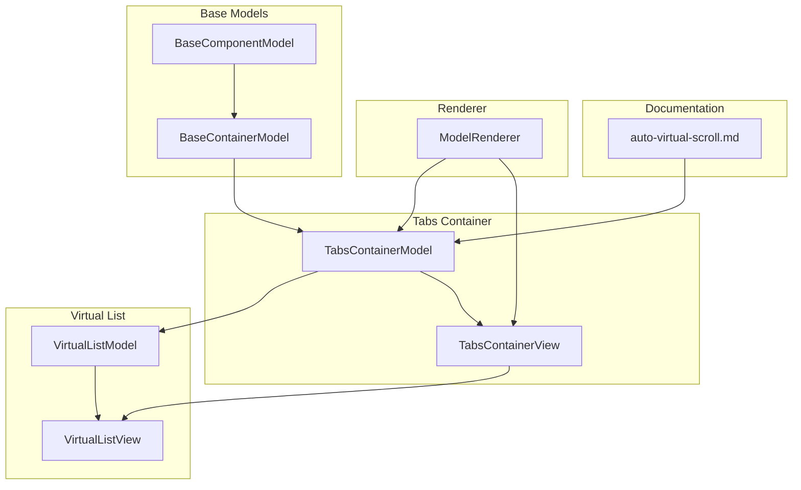
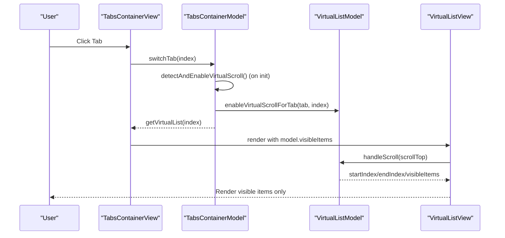
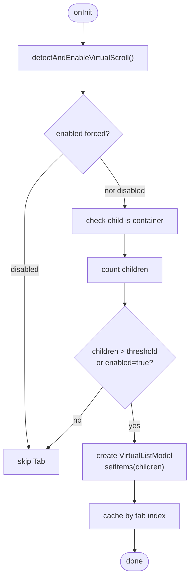
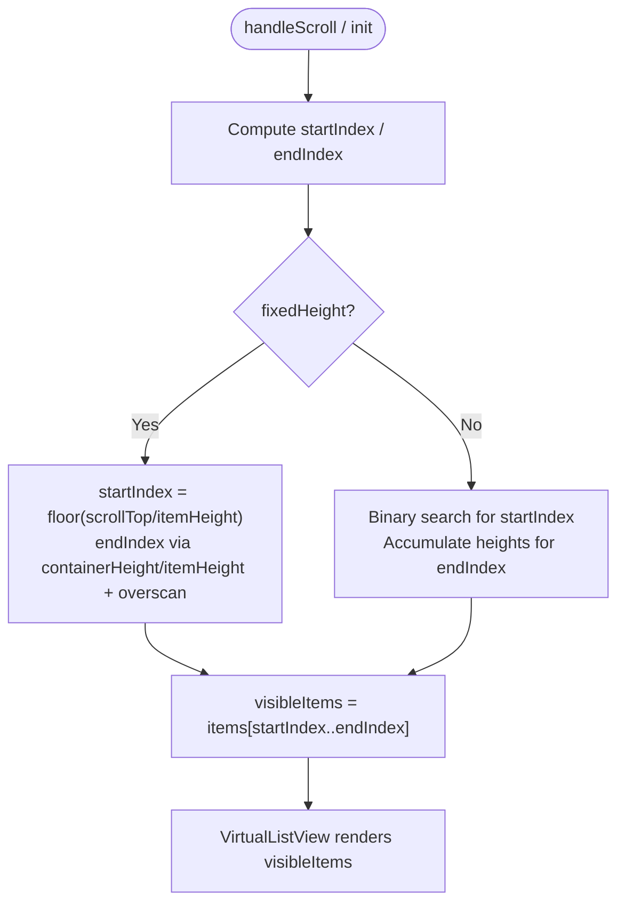
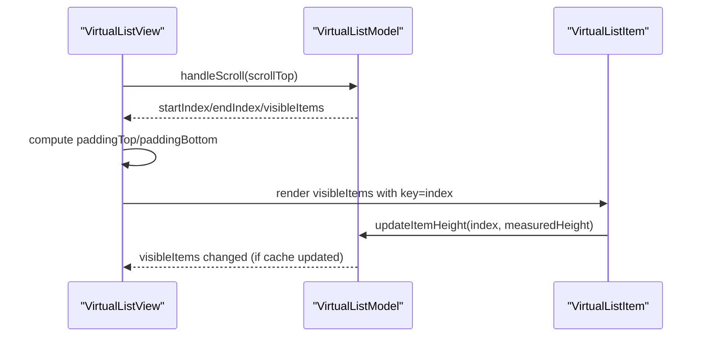
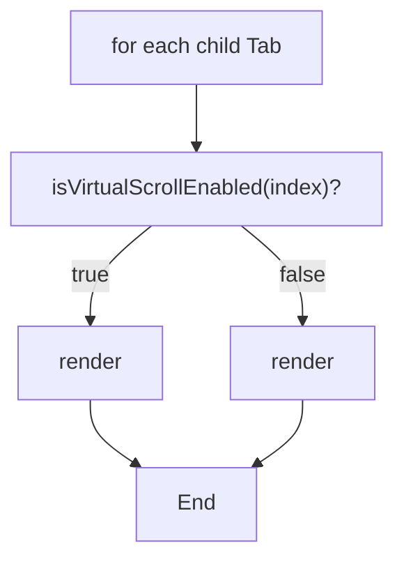
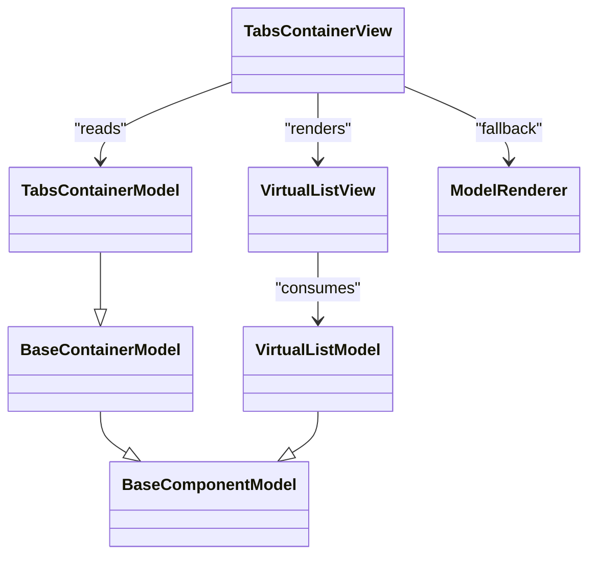

# Virtual Scrolling

<cite>
**Referenced Files in This Document**
- [auto-virtual-scroll.md](file://packages/h5-builder/docs/auto-virtual-scroll.md)
- [tabs-container.model.ts](file://packages/h5-builder/src/components/tabs-container/tabs-container.model.ts)
- [tabs-container.view.tsx](file://packages/h5-builder/src/components/tabs-container/tabs-container.view.tsx)
- [virtual-list.model.ts](file://packages/h5-builder/src/components/virtual-list/virtual-list.model.ts)
- [virtual-list.view.tsx](file://packages/h5-builder/src/components/virtual-list/virtual-list.view.tsx)
- [model-renderer.tsx](file://packages/h5-builder/src/components/model-renderer.tsx)
- [model.ts](file://packages/h5-builder/src/bedrock/model.ts)
</cite>

## Table of Contents
1. [Introduction](#introduction)
2. [Project Structure](#project-structure)
3. [Core Components](#core-components)
4. [Architecture Overview](#architecture-overview)
5. [Detailed Component Analysis](#detailed-component-analysis)
6. [Dependency Analysis](#dependency-analysis)
7. [Performance Considerations](#performance-considerations)
8. [Troubleshooting Guide](#troubleshooting-guide)
9. [Conclusion](#conclusion)
10. [Appendices](#appendices)

## Introduction
This document explains the Virtual Scrolling feature with auto-virtual-scroll for container components, focusing on how TabsContainer automatically enables virtualization when the number of children exceeds a configurable threshold. It covers the detection logic, configuration options, rendering behavior, and performance improvements, along with best practices for integrating virtual scrolling into custom container components.

## Project Structure
The virtual scrolling feature spans documentation, container logic, and virtual list rendering:

- Documentation: describes usage, configuration, and performance benefits.
- Container logic: detects when to enable virtual scrolling and manages virtual lists per tab.
- Virtual list model and view: compute visible items and render only what is visible.
- Renderer: integrates container views with virtualized rendering.

**Diagram sources**
- [auto-virtual-scroll.md](file://packages/h5-builder/docs/auto-virtual-scroll.md#L1-L216)
- [tabs-container.model.ts](file://packages/h5-builder/src/components/tabs-container/tabs-container.model.ts#L1-L273)
- [tabs-container.view.tsx](file://packages/h5-builder/src/components/tabs-container/tabs-container.view.tsx#L1-L85)
- [virtual-list.model.ts](file://packages/h5-builder/src/components/virtual-list/virtual-list.model.ts#L1-L217)
- [virtual-list.view.tsx](file://packages/h5-builder/src/components/virtual-list/virtual-list.view.tsx#L1-L129)
- [model-renderer.tsx](file://packages/h5-builder/src/components/model-renderer.tsx#L1-L105)
- [model.ts](file://packages/h5-builder/src/bedrock/model.ts#L1-L243)

**Section sources**
- [auto-virtual-scroll.md](file://packages/h5-builder/docs/auto-virtual-scroll.md#L1-L216)
- [tabs-container.model.ts](file://packages/h5-builder/src/components/tabs-container/tabs-container.model.ts#L1-L273)
- [tabs-container.view.tsx](file://packages/h5-builder/src/components/tabs-container/tabs-container.view.tsx#L1-L85)
- [virtual-list.model.ts](file://packages/h5-builder/src/components/virtual-list/virtual-list.model.ts#L1-L217)
- [virtual-list.view.tsx](file://packages/h5-builder/src/components/virtual-list/virtual-list.view.tsx#L1-L129)
- [model-renderer.tsx](file://packages/h5-builder/src/components/model-renderer.tsx#L1-L105)
- [model.ts](file://packages/h5-builder/src/bedrock/model.ts#L1-L243)

## Core Components
- TabsContainerModel: Detects when a Tab’s child count exceeds the threshold and creates a VirtualListModel for that Tab. It also exposes APIs to check and retrieve the virtual list.
- VirtualListModel: Computes visible items based on scroll position and container height, with support for fixed-height and dynamic-height modes.
- VirtualListView: Renders only visible items and applies top/bottom paddings to simulate full height.
- TabsContainerView: Switches between virtualized and non-virtualized rendering based on whether a Tab has a VirtualListModel.
- ModelRenderer: Routes rendering to the appropriate View based on Model type, including TabsContainerView.

Key responsibilities:
- Zero-intrusion design: No schema changes required; virtualization is automatic when thresholds are met.
- Configurable parameters: threshold, itemHeight, containerHeight, overscan.
- Performance: Reduces DOM nodes and rendering time significantly.

**Section sources**
- [tabs-container.model.ts](file://packages/h5-builder/src/components/tabs-container/tabs-container.model.ts#L1-L273)
- [virtual-list.model.ts](file://packages/h5-builder/src/components/virtual-list/virtual-list.model.ts#L1-L217)
- [virtual-list.view.tsx](file://packages/h5-builder/src/components/virtual-list/virtual-list.view.tsx#L1-L129)
- [tabs-container.view.tsx](file://packages/h5-builder/src/components/tabs-container/tabs-container.view.tsx#L1-L85)
- [model-renderer.tsx](file://packages/h5-builder/src/components/model-renderer.tsx#L1-L105)

## Architecture Overview
The system integrates container detection with virtual list rendering:

**Diagram sources**
- [tabs-container.model.ts](file://packages/h5-builder/src/components/tabs-container/tabs-container.model.ts#L74-L152)
- [tabs-container.view.tsx](file://packages/h5-builder/src/components/tabs-container/tabs-container.view.tsx#L52-L77)
- [virtual-list.model.ts](file://packages/h5-builder/src/components/virtual-list/virtual-list.model.ts#L115-L178)
- [virtual-list.view.tsx](file://packages/h5-builder/src/components/virtual-list/virtual-list.view.tsx#L84-L124)

## Detailed Component Analysis

### TabsContainerModel: Auto Detection and Virtual List Management
- Threshold-based detection: Iterates Tabs, checks if each child is a container, counts children, and decides whether to enable virtual scrolling based on threshold or explicit enabled flag.
- Dynamic virtual list creation: Creates a VirtualListModel with configured itemHeight/containerHeight/overscan and sets its items to the Tab’s children.
- Lifecycle hooks: Initializes only the active Tab on first load, schedules pre-warming for other Tabs, and tracks initialization and tab-switch events.

**Diagram sources**
- [tabs-container.model.ts](file://packages/h5-builder/src/components/tabs-container/tabs-container.model.ts#L74-L152)

**Section sources**
- [tabs-container.model.ts](file://packages/h5-builder/src/components/tabs-container/tabs-container.model.ts#L1-L273)
- [model.ts](file://packages/h5-builder/src/bedrock/model.ts#L158-L242)

### VirtualListModel: Visible Items Computation
- Fixed-height vs dynamic-height mode: Uses itemHeight for fixed-height; otherwise uses estimatedItemHeight and caches measured heights.
- Visible region calculation: startIndex and endIndex computed using either direct math (fixed-height) or binary search/accumulation (dynamic-height).
- Overscan: Adds extra items above and below the viewport to reduce white screen during fast scrolls.
- Height and offset caches: Efficiently computes offsets and updates cached heights when items change.

**Diagram sources**
- [virtual-list.model.ts](file://packages/h5-builder/src/components/virtual-list/virtual-list.model.ts#L115-L178)

**Section sources**
- [virtual-list.model.ts](file://packages/h5-builder/src/components/virtual-list/virtual-list.model.ts#L1-L217)

### VirtualListView: DOM Optimization and Measurement
- Renders only visible items and adds top/bottom padding equal to the cumulative height before/after the visible range.
- Measures item heights using requestAnimationFrame and ResizeObserver, notifying the model to update caches.
- Propagates scroll events to the model so it can recalculate visible items.

**Diagram sources**
- [virtual-list.view.tsx](file://packages/h5-builder/src/components/virtual-list/virtual-list.view.tsx#L84-L124)
- [virtual-list.model.ts](file://packages/h5-builder/src/components/virtual-list/virtual-list.model.ts#L68-L83)

**Section sources**
- [virtual-list.view.tsx](file://packages/h5-builder/src/components/virtual-list/virtual-list.view.tsx#L1-L129)
- [virtual-list.model.ts](file://packages/h5-builder/src/components/virtual-list/virtual-list.model.ts#L1-L217)

### TabsContainerView: Conditional Rendering
- Determines whether a Tab should use virtualized rendering by checking if a VirtualListModel exists for that Tab index.
- Renders either VirtualListView (virtualized) or ModelRenderer (non-virtualized) inside the active panel.

**Diagram sources**
- [tabs-container.view.tsx](file://packages/h5-builder/src/components/tabs-container/tabs-container.view.tsx#L52-L77)
- [model-renderer.tsx](file://packages/h5-builder/src/components/model-renderer.tsx#L50-L105)

**Section sources**
- [tabs-container.view.tsx](file://packages/h5-builder/src/components/tabs-container/tabs-container.view.tsx#L1-L85)
- [model-renderer.tsx](file://packages/h5-builder/src/components/model-renderer.tsx#L1-L105)

## Dependency Analysis
- TabsContainerModel depends on:
  - BaseContainerModel for container semantics and lifecycle.
  - VirtualListModel for virtualization.
  - TrackerService for analytics.
- TabsContainerView depends on:
  - ModelRenderer for non-virtualized rendering fallback.
  - VirtualListView for virtualized rendering.
- VirtualListModel depends on:
  - BaseComponentModel for lifecycle and observability.
- VirtualListView depends on:
  - VirtualListModel for state and computation.
  - MobX observer for reactivity.

**Diagram sources**
- [model.ts](file://packages/h5-builder/src/bedrock/model.ts#L1-L243)
- [tabs-container.model.ts](file://packages/h5-builder/src/components/tabs-container/tabs-container.model.ts#L1-L273)
- [virtual-list.model.ts](file://packages/h5-builder/src/components/virtual-list/virtual-list.model.ts#L1-L217)
- [tabs-container.view.tsx](file://packages/h5-builder/src/components/tabs-container/tabs-container.view.tsx#L1-L85)
- [virtual-list.view.tsx](file://packages/h5-builder/src/components/virtual-list/virtual-list.view.tsx#L1-L129)
- [model-renderer.tsx](file://packages/h5-builder/src/components/model-renderer.tsx#L1-L105)

**Section sources**
- [model.ts](file://packages/h5-builder/src/bedrock/model.ts#L1-L243)
- [tabs-container.model.ts](file://packages/h5-builder/src/components/tabs-container/tabs-container.model.ts#L1-L273)
- [virtual-list.model.ts](file://packages/h5-builder/src/components/virtual-list/virtual-list.model.ts#L1-L217)
- [tabs-container.view.tsx](file://packages/h5-builder/src/components/tabs-container/tabs-container.view.tsx#L1-L85)
- [virtual-list.view.tsx](file://packages/h5-builder/src/components/virtual-list/virtual-list.view.tsx#L1-L129)
- [model-renderer.tsx](file://packages/h5-builder/src/components/model-renderer.tsx#L1-L105)

## Performance Considerations
- DOM reduction: From 100 DOM nodes down to approximately 10 by rendering only visible items plus overscan.
- Rendering time: From ~500 ms to ~50 ms for large lists.
- Memory footprint: Significantly reduced due to fewer live nodes.
- Overscan: Helps avoid blank areas during fast scrolls; tune based on device performance.
- Dynamic height: Requires measuring items; ensure consistent item heights for best performance.

[No sources needed since this section provides general guidance]

## Troubleshooting Guide
Common issues and resolutions:
- Virtual scroll not triggered:
  - Verify the Tab is a container component and has more children than the threshold.
  - Check if enabled was explicitly set to false.
  - Confirm the Tab is initialized; virtualization is set up during initialization.
- How to verify:
  - Check console logs indicating virtual scroll activation.
  - Inspect analytics events for virtualScrollEnabled flag.
  - Use the provided API to check if virtual scroll is enabled for a given index.
- Zero-intrusion behavior:
  - No schema changes required; ensure container components remain containers and children are added normally.

**Section sources**
- [auto-virtual-scroll.md](file://packages/h5-builder/docs/auto-virtual-scroll.md#L161-L211)
- [tabs-container.model.ts](file://packages/h5-builder/src/components/tabs-container/tabs-container.model.ts#L101-L128)

## Conclusion
The auto-virtual-scroll feature provides transparent, threshold-driven virtualization for container components. By combining intelligent detection in TabsContainerModel with efficient rendering in VirtualListView, it delivers substantial performance gains with zero schema changes. Proper configuration of threshold, itemHeight, containerHeight, and overscan ensures smooth user experiences across diverse content sizes.

[No sources needed since this section summarizes without analyzing specific files]

## Appendices

### Configuration Options
- enabled: Force enable/disable virtualization; undefined means automatic detection.
- threshold: Number of children to trigger virtualization (default 20).
- itemHeight: Fixed item height for fixed-height mode (default 120).
- containerHeight: Container viewport height (default 600).
- overscan: Extra items to render above/below the viewport (default 3).

These options are documented and used consistently across TabsContainerModel and VirtualListModel.

**Section sources**
- [auto-virtual-scroll.md](file://packages/h5-builder/docs/auto-virtual-scroll.md#L131-L140)
- [tabs-container.model.ts](file://packages/h5-builder/src/components/tabs-container/tabs-container.model.ts#L50-L56)
- [virtual-list.model.ts](file://packages/h5-builder/src/components/virtual-list/virtual-list.model.ts#L6-L11)

### Best Practices for Custom Containers
- Keep children as container components so detection logic recognizes them.
- Provide consistent item heights for optimal dynamic-height performance.
- Tune overscan to balance responsiveness and memory usage.
- Monitor performance via analytics and adjust thresholds accordingly.
- Prefer automatic detection unless you have specific requirements.

**Section sources**
- [auto-virtual-scroll.md](file://packages/h5-builder/docs/auto-virtual-scroll.md#L181-L187)
- [tabs-container.model.ts](file://packages/h5-builder/src/components/tabs-container/tabs-container.model.ts#L101-L128)