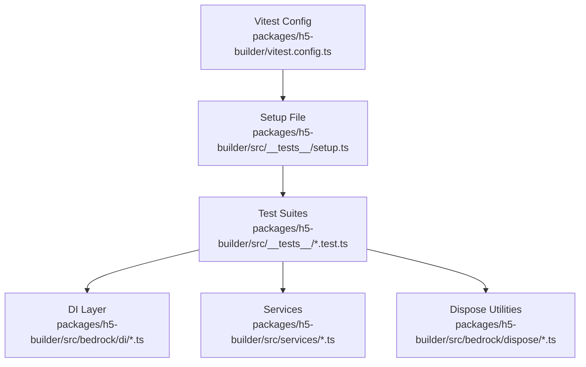
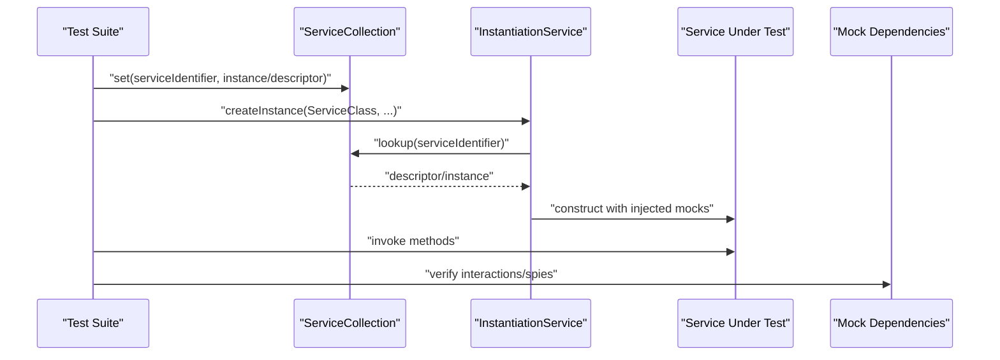
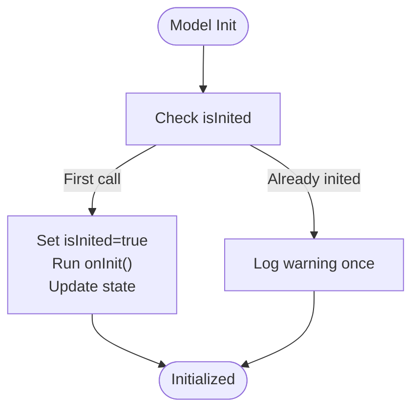
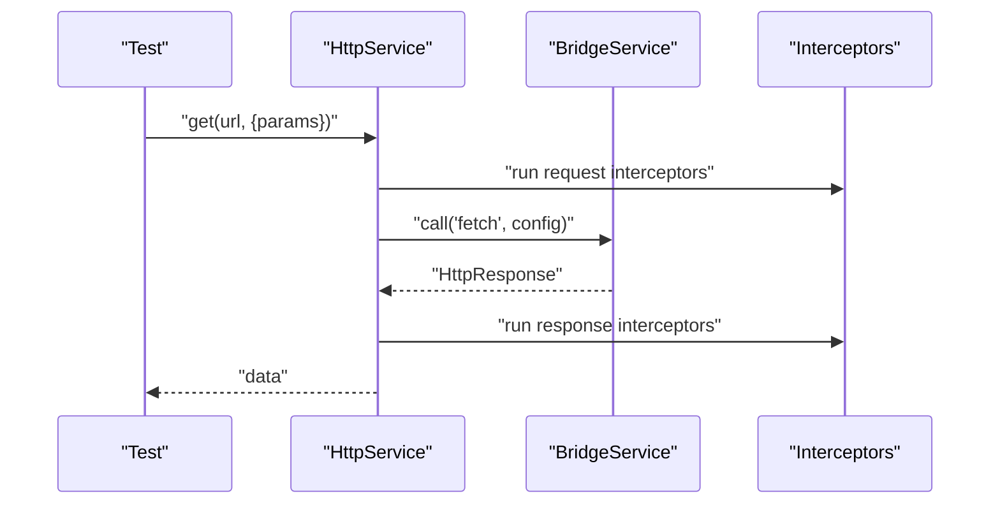
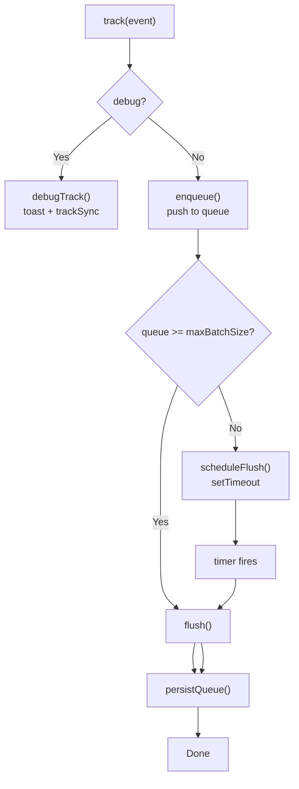
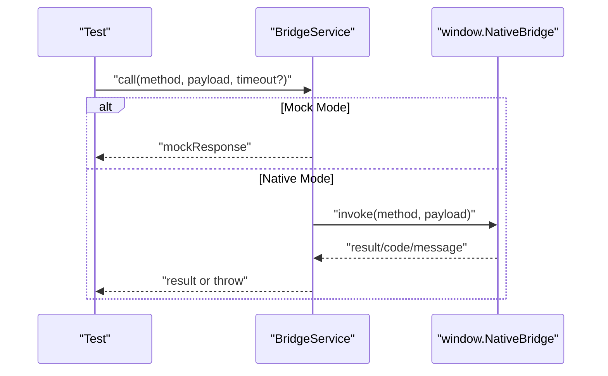
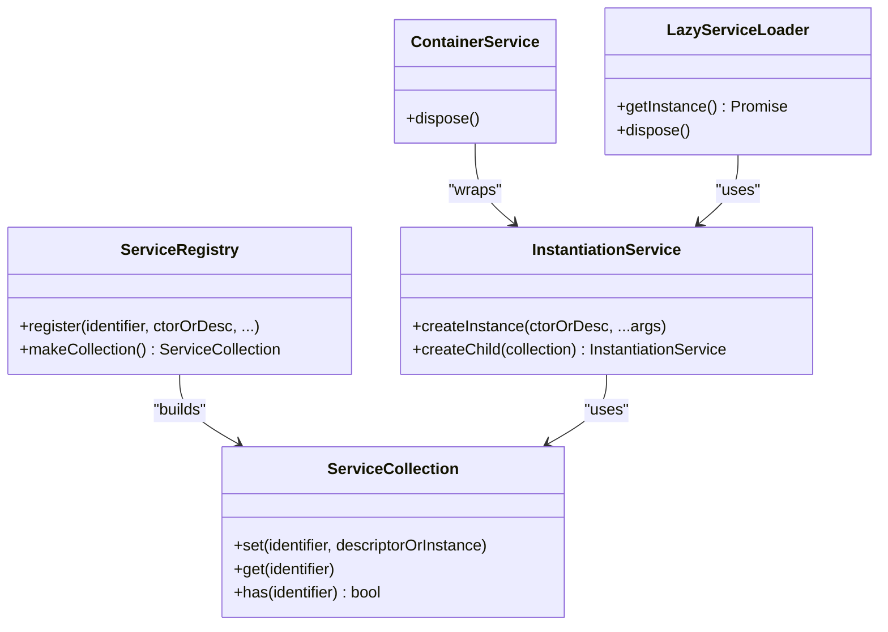
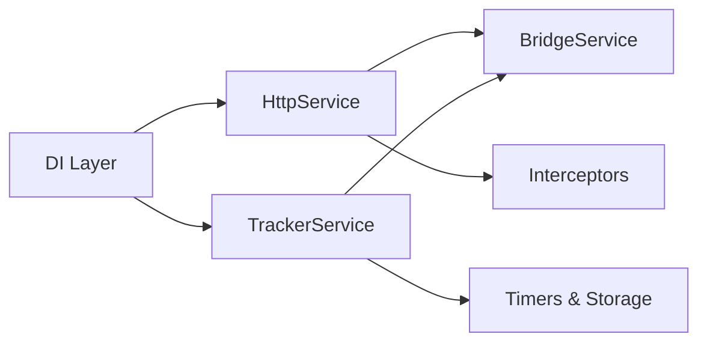

# Testing Strategy

<cite>
**Referenced Files in This Document**
- [vitest.config.ts](file://packages/h5-builder/vitest.config.ts)
- [setup.ts](file://packages/h5-builder/src/__tests__/setup.ts)
- [model.test.ts](file://packages/h5-builder/src/__tests__/model.test.ts)
- [http.service.test.ts](file://packages/h5-builder/src/__tests__/http.service.test.ts)
- [tracker.service.test.ts](file://packages/h5-builder/src/__tests__/tracker.service.test.ts)
- [bridge.service.test.ts](file://packages/h5-builder/src/__tests__/bridge.service.test.ts)
- [instantiation-service.test.ts](file://packages/h5-builder/src/bedrock/di/instantiation-service.test.ts)
- [service-collection.test.ts](file://packages/h5-builder/src/bedrock/di/service-collection.test.ts)
- [container-service.test.ts](file://packages/h5-builder/src/bedrock/di/container-service.test.ts)
- [service-registry.test.ts](file://packages/h5-builder/src/bedrock/di/service-registry.test.ts)
- [disposable-store.test.ts](file://packages/h5-builder/src/bedrock/dispose/disposable-store.test.ts)
- [disposable-utils.test.ts](file://packages/h5-builder/src/bedrock/dispose/disposable-utils.test.ts)
- [queue.test.ts](file://packages/h5-builder/src/bedrock/async/queue/queue.test.ts)
- [lazy-service.test.ts](file://packages/h5-builder/src/bedrock/di/lazy/lazy-service.test.ts)
- [http.service.ts](file://packages/h5-builder/src/services/http.service.ts)
- [tracker.service.ts](file://packages/h5-builder/src/services/tracker.service.ts)
</cite>

## Table of Contents
1. [Introduction](#introduction)
2. [Project Structure](#project-structure)
3. [Core Components](#core-components)
4. [Architecture Overview](#architecture-overview)
5. [Detailed Component Analysis](#detailed-component-analysis)
6. [Dependency Analysis](#dependency-analysis)
7. [Performance Considerations](#performance-considerations)
8. [Troubleshooting Guide](#troubleshooting-guide)
9. [Conclusion](#conclusion)
10. [Appendices](#appendices)

## Introduction
This document describes a comprehensive testing strategy for unit and integration testing across models, services, and the dependency injection (DI) system. It focuses on:
- Using Vitest to test models, services, and DI components
- Setting up the Injector (ServiceCollection + InstantiationService) with mock services
- Creating test instances via resolve-and-instantiate patterns
- Verifying state changes and method calls
- Testing lifecycle methods, service interactions, and error handling
- Examples from existing test files for mocking HttpService, TrackerService, and other dependencies
- Testing asynchronous operations and error conditions
- Testing the DI system, resource management, and lifecycle hooks
- Guidance for achieving high test coverage and maintaining reliability

## Project Structure
The testing setup is organized under the h5-builder package with a dedicated test folder and Vitest configuration. The Vitest environment uses happy-dom and global mocks, with a setup file for DOM-related polyfills.

**Diagram sources**
- [vitest.config.ts](file://packages/h5-builder/vitest.config.ts#L1-L28)
- [setup.ts](file://packages/h5-builder/src/__tests__/setup.ts#L1-L2)

**Section sources**
- [vitest.config.ts](file://packages/h5-builder/vitest.config.ts#L1-L28)
- [setup.ts](file://packages/h5-builder/src/__tests__/setup.ts#L1-L2)

## Core Components
- Models: BaseComponentModel and BaseContainerModel lifecycle testing (init, activate/deactivate, dispose) and resource registration/disposal
- Services: HttpService (requests, interceptors, cancellation, disposal), TrackerService (batching, persistence, timers), BridgeService (mock/native modes)
- DI: ServiceCollection, ServiceRegistry, InstantiationService, ContainerService, LazyServiceLoader
- Disposables: DisposableStore, disposable utilities
- Async utilities: AsyncQueue

**Section sources**
- [model.test.ts](file://packages/h5-builder/src/__tests__/model.test.ts#L1-L231)
- [http.service.test.ts](file://packages/h5-builder/src/__tests__/http.service.test.ts#L1-L252)
- [tracker.service.test.ts](file://packages/h5-builder/src/__tests__/tracker.service.test.ts#L1-L226)
- [bridge.service.test.ts](file://packages/h5-builder/src/__tests__/bridge.service.test.ts#L1-L132)
- [instantiation-service.test.ts](file://packages/h5-builder/src/bedrock/di/instantiation-service.test.ts#L1-L338)
- [service-collection.test.ts](file://packages/h5-builder/src/bedrock/di/service-collection.test.ts#L1-L28)
- [container-service.test.ts](file://packages/h5-builder/src/bedrock/di/container-service.test.ts#L1-L180)
- [service-registry.test.ts](file://packages/h5-builder/src/bedrock/di/service-registry.test.ts#L1-L67)
- [disposable-store.test.ts](file://packages/h5-builder/src/bedrock/dispose/disposable-store.test.ts#L1-L58)
- [disposable-utils.test.ts](file://packages/h5-builder/src/bedrock/dispose/disposable-utils.test.ts#L1-L16)
- [queue.test.ts](file://packages/h5-builder/src/bedrock/async/queue/queue.test.ts#L1-L71)
- [lazy-service.test.ts](file://packages/h5-builder/src/bedrock/di/lazy/lazy-service.test.ts#L1-L66)

## Architecture Overview
The testing architecture centers around:
- Vitest with happy-dom environment
- Global setup for DOM APIs
- ServiceCollection and InstantiationService to construct services with mocked dependencies
- Spy/mock usage to verify interactions and state transitions
- Fake timers for asynchronous and timing-sensitive tests

**Diagram sources**
- [http.service.test.ts](file://packages/h5-builder/src/__tests__/http.service.test.ts#L15-L27)
- [instantiation-service.test.ts](file://packages/h5-builder/src/bedrock/di/instantiation-service.test.ts#L164-L206)
- [service-collection.test.ts](file://packages/h5-builder/src/bedrock/di/service-collection.test.ts#L11-L27)

## Detailed Component Analysis

### Models: Lifecycle and Resource Management
- Initialization: Verify initialization only occurs once, state updates, and property propagation
- Lifecycle: Activate/deactivate transitions and repeated calls
- Dispose: onDestroy invocation and duplicate dispose warnings
- Resource management: register/cleanup callbacks, LIFO disposal order, timer cleanup
- Reactivity: Ensure observable state changes are preserved

**Diagram sources**
- [model.test.ts](file://packages/h5-builder/src/__tests__/model.test.ts#L52-L67)

**Section sources**
- [model.test.ts](file://packages/h5-builder/src/__tests__/model.test.ts#L1-L231)

### HttpService: Requests, Interceptors, Cancellation, and Disposal
- Basic requests: GET/POST/PUT/DELETE with mocked BridgeService responses
- Query parameters: URL composition and parameter appending
- Interceptors: Request/response/error interceptors and removal
- Error handling: Error interceptor execution and propagation
- Cancellation: cancelAll clears pending requests
- Disposal: Clears interceptors and pending requests

**Diagram sources**
- [http.service.test.ts](file://packages/h5-builder/src/__tests__/http.service.test.ts#L29-L101)
- [http.service.ts](file://packages/h5-builder/src/services/http.service.ts#L147-L203)

**Section sources**
- [http.service.test.ts](file://packages/h5-builder/src/__tests__/http.service.test.ts#L1-L252)
- [http.service.ts](file://packages/h5-builder/src/services/http.service.ts#L1-L281)

### TrackerService: Batch Sending, Persistence, Timers, and Disposal
- Debug vs production: Immediate sending vs queueing
- Batch flushing: Size threshold and interval scheduling
- Persistence: Queue serialization/deserialization to localStorage
- Error handling: Re-enqueue on flush failure
- Disposal: Clear timers and flush remaining events

**Diagram sources**
- [tracker.service.test.ts](file://packages/h5-builder/src/__tests__/tracker.service.test.ts#L43-L84)
- [tracker.service.ts](file://packages/h5-builder/src/services/tracker.service.ts#L110-L171)

**Section sources**
- [tracker.service.test.ts](file://packages/h5-builder/src/__tests__/tracker.service.test.ts#L1-L226)
- [tracker.service.ts](file://packages/h5-builder/src/services/tracker.service.ts#L1-L228)

### BridgeService: Mock and Native Modes
- Mock mode: setMockResponse, setMockResponses, and default mock responses
- Native mode: invoke to window.NativeBridge with timeouts and error codes
- Helpers: getUserInfo, toast, navigate, share
- Disposal: clear mock responses

**Diagram sources**
- [bridge.service.test.ts](file://packages/h5-builder/src/__tests__/bridge.service.test.ts#L13-L85)

**Section sources**
- [bridge.service.test.ts](file://packages/h5-builder/src/__tests__/bridge.service.test.ts#L1-L132)

### DI System: ServiceCollection, ServiceRegistry, InstantiationService, ContainerService
- ServiceCollection: set/get descriptors and instances
- ServiceRegistry: register descriptors and instances with ownership
- InstantiationService: createInstance with dependency resolution, recursion detection, and argument passing
- ContainerService: hierarchical disposal and reference ownership
- LazyServiceLoader: lazy module loading with cancellation and disposal

**Diagram sources**
- [service-collection.test.ts](file://packages/h5-builder/src/bedrock/di/service-collection.test.ts#L11-L27)
- [service-registry.test.ts](file://packages/h5-builder/src/bedrock/di/service-registry.test.ts#L33-L66)
- [instantiation-service.test.ts](file://packages/h5-builder/src/bedrock/di/instantiation-service.test.ts#L164-L227)
- [container-service.test.ts](file://packages/h5-builder/src/bedrock/di/container-service.test.ts#L58-L179)
- [lazy-service.test.ts](file://packages/h5-builder/src/bedrock/di/lazy/lazy-service.test.ts#L1-L66)

**Section sources**
- [service-collection.test.ts](file://packages/h5-builder/src/bedrock/di/service-collection.test.ts#L1-L28)
- [service-registry.test.ts](file://packages/h5-builder/src/bedrock/di/service-registry.test.ts#L1-L67)
- [instantiation-service.test.ts](file://packages/h5-builder/src/bedrock/di/instantiation-service.test.ts#L1-L338)
- [container-service.test.ts](file://packages/h5-builder/src/bedrock/di/container-service.test.ts#L1-L180)
- [lazy-service.test.ts](file://packages/h5-builder/src/bedrock/di/lazy/lazy-service.test.ts#L1-L66)

### Disposables and Resource Management
- DisposableStore: add and dispose registered disposables; clear behavior
- makeSafeDisposable: idempotent disposal guard
- Model resource registration: register cleanup callbacks and LIFO disposal order
- Timer cleanup: ensure intervals are cleared after disposal

**Section sources**
- [disposable-store.test.ts](file://packages/h5-builder/src/bedrock/dispose/disposable-store.test.ts#L1-L58)
- [disposable-utils.test.ts](file://packages/h5-builder/src/bedrock/dispose/disposable-utils.test.ts#L1-L16)
- [model.test.ts](file://packages/h5-builder/src/__tests__/model.test.ts#L113-L164)

### Asynchronous Utilities
- AsyncQueue: concurrency control and task ordering verification

**Section sources**
- [queue.test.ts](file://packages/h5-builder/src/bedrock/async/queue/queue.test.ts#L1-L71)

## Dependency Analysis
- HttpService depends on BridgeService via DI and uses interceptors and pending requests
- TrackerService depends on BridgeService and manages timers and localStorage persistence
- DI components depend on each other to form a layered construction pipeline
- Models depend on lifecycle hooks and resource management utilities

**Diagram sources**
- [http.service.ts](file://packages/h5-builder/src/services/http.service.ts#L56-L103)
- [tracker.service.ts](file://packages/h5-builder/src/services/tracker.service.ts#L34-L66)
- [instantiation-service.test.ts](file://packages/h5-builder/src/bedrock/di/instantiation-service.test.ts#L164-L206)

**Section sources**
- [http.service.ts](file://packages/h5-builder/src/services/http.service.ts#L1-L281)
- [tracker.service.ts](file://packages/h5-builder/src/services/tracker.service.ts#L1-L228)
- [instantiation-service.test.ts](file://packages/h5-builder/src/bedrock/di/instantiation-service.test.ts#L1-L338)

## Performance Considerations
- Prefer fake timers for deterministic async tests; advance timers explicitly to avoid flakiness
- Use minimal concurrency in async utilities to reduce test runtime variance
- Avoid excessive localStorage writes in tests; clear state between runs
- Limit heavy interception chains in tests to essential cases

[No sources needed since this section provides general guidance]

## Troubleshooting Guide
Common issues and resolutions:
- Duplicate initialization or disposal warnings: Expect console.warn and verify idempotency
- Timer leaks: Ensure timers are cleared on disposal and verify with timer counts
- Mock responses not applied: Confirm BridgeService is constructed in mock mode and responses are set before calls
- Interceptor not invoked: Verify interceptor registration and removal; ensure request path triggers interceptors
- DI recursion or missing dependencies: Review dependency graphs and ensure all services are registered

**Section sources**
- [model.test.ts](file://packages/h5-builder/src/__tests__/model.test.ts#L52-L67)
- [tracker.service.test.ts](file://packages/h5-builder/src/__tests__/tracker.service.test.ts#L171-L184)
- [bridge.service.test.ts](file://packages/h5-builder/src/__tests__/bridge.service.test.ts#L13-L42)
- [http.service.test.ts](file://packages/h5-builder/src/__tests__/http.service.test.ts#L104-L144)
- [instantiation-service.test.ts](file://packages/h5-builder/src/bedrock/di/instantiation-service.test.ts#L62-L162)

## Conclusion
This testing strategy leverages Vitest’s capabilities to comprehensively validate models, services, and the DI system. By constructing services with ServiceCollection and InstantiationService, mocking external dependencies, and using fake timers, we achieve reliable and maintainable tests. The provided patterns demonstrate how to verify lifecycle transitions, resource management, asynchronous behavior, and error handling across the system.

[No sources needed since this section summarizes without analyzing specific files]

## Appendices

### How to Test Models with Vitest
- Create a subclass of BaseComponentModel and override lifecycle hooks
- Instantiate models directly in tests and verify state changes and method calls
- Use spies to verify lifecycle invocations and register cleanup callbacks

**Section sources**
- [model.test.ts](file://packages/h5-builder/src/__tests__/model.test.ts#L1-L112)

### How to Test Services with DI and Mocks
- Build ServiceCollection and register mocks for dependencies
- Construct InstantiationService and create instances with createInstance
- Use spies to verify method calls and state changes

**Section sources**
- [http.service.test.ts](file://packages/h5-builder/src/__tests__/http.service.test.ts#L15-L27)
- [tracker.service.test.ts](file://packages/h5-builder/src/__tests__/tracker.service.test.ts#L9-L17)

### Testing Asynchronous Operations and Error Conditions
- Fake timers for timers and scheduled flushes
- Mock rejected promises to simulate network failures
- Verify interceptor execution and error propagation

**Section sources**
- [tracker.service.test.ts](file://packages/h5-builder/src/__tests__/tracker.service.test.ts#L136-L155)
- [http.service.test.ts](file://packages/h5-builder/src/__tests__/http.service.test.ts#L165-L177)

### Testing the DI System and Lifecycle Hooks
- Validate recursive dependency detection and missing dependency errors
- Test child containers and reference ownership disposal
- Verify lazy service loading and cancellation

**Section sources**
- [instantiation-service.test.ts](file://packages/h5-builder/src/bedrock/di/instantiation-service.test.ts#L62-L162)
- [container-service.test.ts](file://packages/h5-builder/src/bedrock/di/container-service.test.ts#L58-L179)
- [lazy-service.test.ts](file://packages/h5-builder/src/bedrock/di/lazy/lazy-service.test.ts#L1-L66)