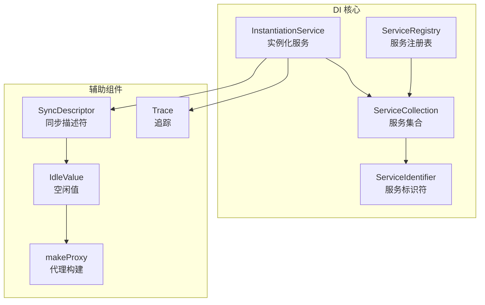
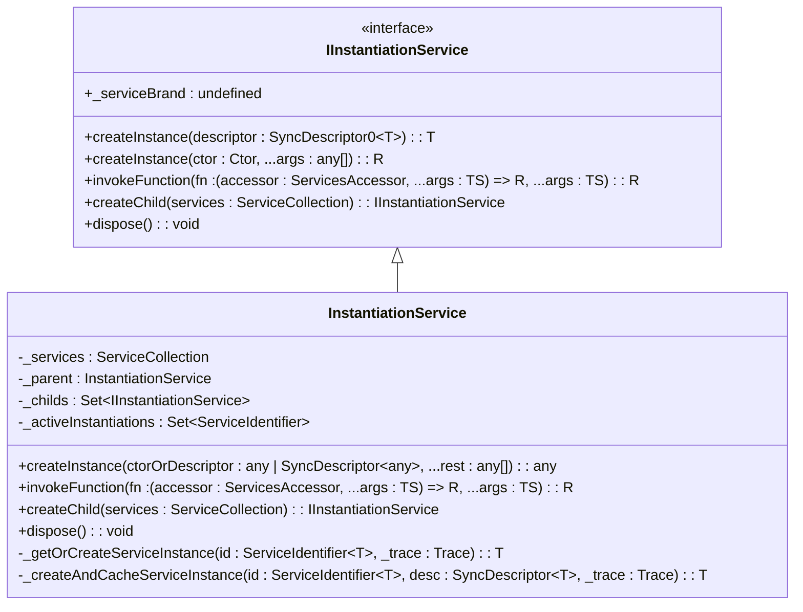
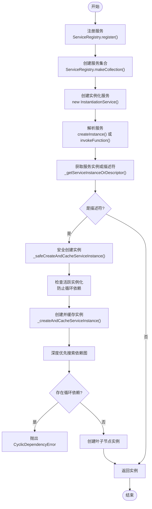
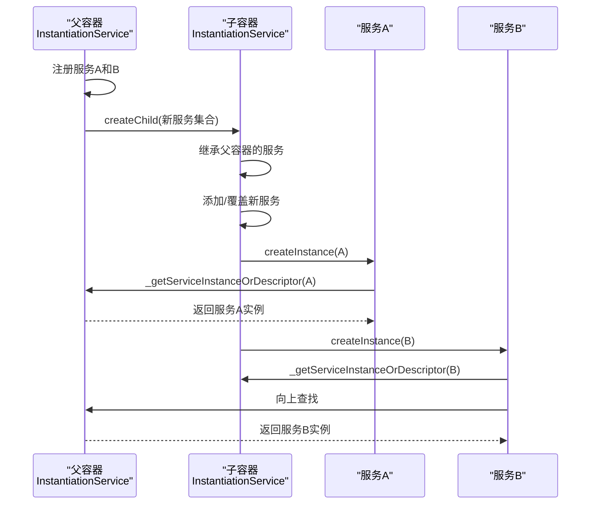
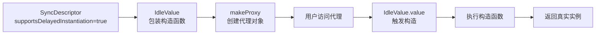
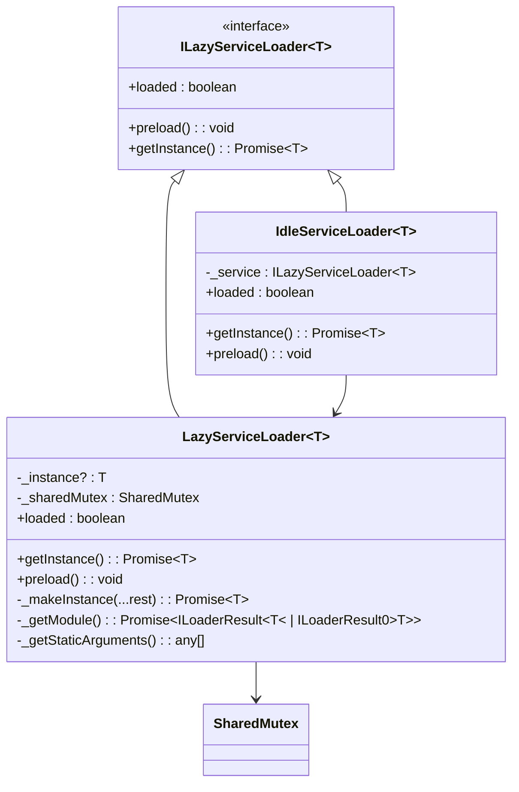
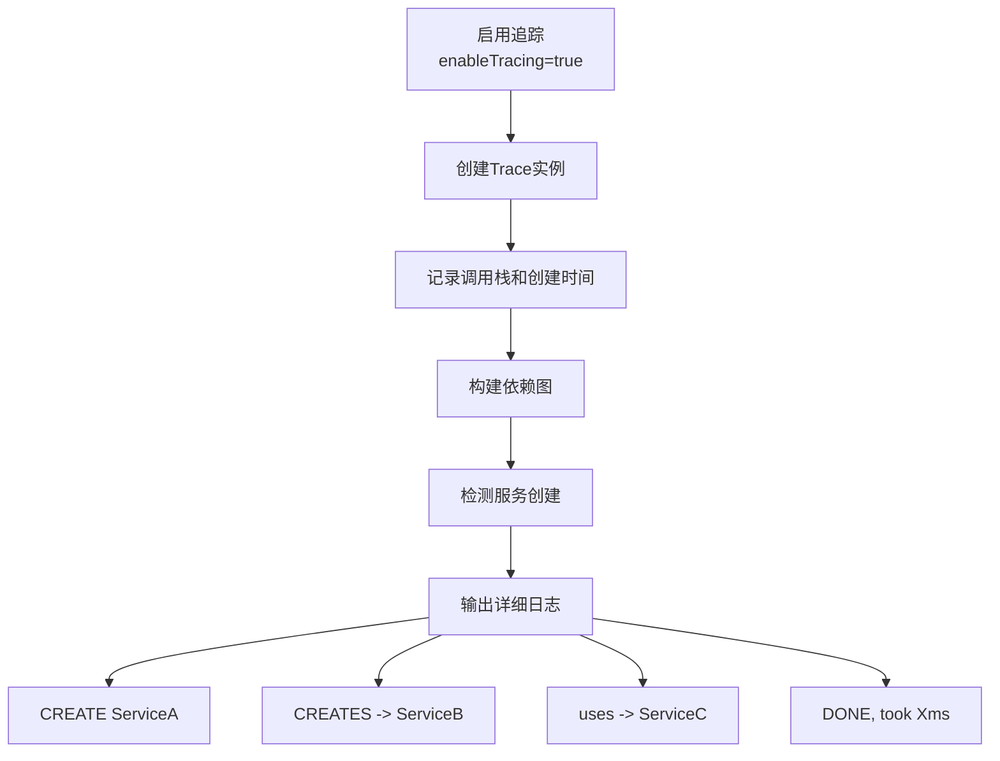

# DI 系统 API

<cite>
**本文档引用的文件**
- [instantiation-service.interface.ts](file://packages/h5-builder/src/bedrock/di/instantiation-service.interface.ts)
- [instantiation-service.ts](file://packages/h5-builder/src/bedrock/di/instantiation-service.ts)
- [service-collection.ts](file://packages/h5-builder/src/bedrock/di/service-collection.ts)
- [service-registry.ts](file://packages/h5-builder/src/bedrock/di/service-registry.ts)
- [base.ts](file://packages/h5-builder/src/bedrock/di/base.ts)
- [descriptor.ts](file://packages/h5-builder/src/bedrock/di/descriptor.ts)
- [idle-value.ts](file://packages/h5-builder/src/bedrock/di/idle-value.ts)
- [proxy-builder.ts](file://packages/h5-builder/src/bedrock/di/proxy-builder.ts)
- [trace.ts](file://packages/h5-builder/src/bedrock/di/trace.ts)
- [service-ownership-collection.ts](file://packages/h5-builder/src/bedrock/di/service-ownership-collection.ts)
- [lazy-service.ts](file://packages/h5-builder/src/bedrock/di/lazy/lazy-service.ts)
- [idle-load.ts](file://packages/h5-builder/src/bedrock/di/lazy/idle-load.ts)
- [instantiation-service.test.ts](file://packages/h5-builder/src/bedrock/di/instantiation-service.test.ts)
- [service-identifiers.ts](file://packages/h5-builder/src/services/service-identifiers.ts)
</cite>

## 目录
1. [简介](#简介)
2. [核心组件](#核心组件)
3. [InstantiationService 接口详解](#instantiationservice-接口详解)
4. [服务注册与解析机制](#服务注册与解析机制)
5. [子容器创建与继承](#子容器创建与继承)
6. [生命周期与销毁](#生命周期与销毁)
7. [依赖注入的高级特性](#依赖注入的高级特性)
8. [调试与追踪工具](#调试与追踪工具)
9. [常见问题与排查](#常见问题与排查)
10. [测试用例分析](#测试用例分析)

## 简介
本文档详细说明了 MobX 项目中 DI（依赖注入）系统的核心 API，重点围绕 `InstantiationService` 接口展开。该系统提供了一套完整的依赖注入解决方案，支持服务注册、解析、子容器创建、延迟加载、代理构建等高级特性。文档将深入解析服务标识符（ServiceIdentifier）、服务集合（ServiceCollection）、服务注册表（ServiceRegistry）等核心概念的交互关系，并结合测试用例展示典型使用场景和边界情况。

## 核心组件

DI 系统由多个核心组件构成，它们协同工作以实现依赖注入功能。



**Diagram sources**
- [instantiation-service.ts](file://packages/h5-builder/src/bedrock/di/instantiation-service.ts)
- [service-registry.ts](file://packages/h5-builder/src/bedrock/di/service-registry.ts)
- [service-collection.ts](file://packages/h5-builder/src/bedrock/di/service-collection.ts)
- [base.ts](file://packages/h5-builder/src/bedrock/di/base.ts)
- [descriptor.ts](file://packages/h5-builder/src/bedrock/di/descriptor.ts)
- [idle-value.ts](file://packages/h5-builder/src/bedrock/di/idle-value.ts)
- [proxy-builder.ts](file://packages/h5-builder/src/bedrock/di/proxy-builder.ts)
- [trace.ts](file://packages/h5-builder/src/bedrock/di/trace.ts)

**Section sources**
- [instantiation-service.ts](file://packages/h5-builder/src/bedrock/di/instantiation-service.ts)
- [service-registry.ts](file://packages/h5-builder/src/bedrock/di/service-registry.ts)

## InstantiationService 接口详解

`IInstantiationService` 是整个 DI 系统的核心接口，定义了服务实例化的主要能力。



**Diagram sources**
- [instantiation-service.interface.ts](file://packages/h5-builder/src/bedrock/di/instantiation-service.interface.ts)
- [instantiation-service.ts](file://packages/h5-builder/src/bedrock/di/instantiation-service.ts)

**Section sources**
- [instantiation-service.interface.ts](file://packages/h5-builder/src/bedrock/di/instantiation-service.interface.ts)
- [instantiation-service.ts](file://packages/h5-builder/src/bedrock/di/instantiation-service.ts)

### createInstance 方法
`createInstance` 方法用于同步创建服务实例。它有两种重载形式：
1. 通过 `SyncDescriptor0<T>` 描述符创建实例。
2. 通过构造函数和参数直接创建实例。

该方法会递归解析构造函数中的所有依赖项，并确保服务的单例性。

### invokeFunction 方法
`invokeFunction` 方法允许在函数执行上下文中访问服务访问器（`ServicesAccessor`）。它提供了一种安全的方式来获取服务，避免了直接引用 `InstantiationService`。

### createChild 方法
`createChild` 方法创建一个子容器，该子容器继承父容器的所有服务，并可以添加或覆盖新的服务。

### dispose 方法
`dispose` 方法负责销毁当前容器及其所有子容器中的可释放服务，实现完整的生命周期管理。

## 服务注册与解析机制

服务的注册与解析是 DI 系统的基础流程。



**Diagram sources**
- [instantiation-service.ts](file://packages/h5-builder/src/bedrock/di/instantiation-service.ts)
- [service-registry.ts](file://packages/h5-builder/src/bedrock/di/service-registry.ts)

**Section sources**
- [instantiation-service.ts](file://packages/h5-builder/src/bedrock/di/instantiation-service.ts)
- [service-registry.ts](file://packages/h5-builder/src/bedrock/di/service-registry.ts)

### ServiceIdentifier
`ServiceIdentifier` 是服务的唯一标识符，通过 `createDecorator` 函数创建。它本质上是一个参数装饰器，用于在构造函数中声明依赖。

### ServiceCollection
`ServiceCollection` 是一个服务的集合，内部使用 `Map` 存储服务 ID 与服务实例或描述符的映射关系。它还支持服务所有权（`ServiceOwnership`）的管理。

### ServiceRegistry
`ServiceRegistry` 是服务的注册中心，负责收集所有服务的注册信息，并最终生成 `ServiceCollection`。它支持检查重复注册。

## 子容器创建与继承

子容器机制允许创建具有继承关系的服务容器，实现服务的分层和覆盖。



**Diagram sources**
- [instantiation-service.ts](file://packages/h5-builder/src/bedrock/di/instantiation-service.ts)

**Section sources**
- [instantiation-service.ts](file://packages/h5-builder/src/bedrock/di/instantiation-service.ts)

## 生命周期与销毁

DI 系统通过 `dispose` 方法实现了完整的生命周期管理。

```mermaid
stateDiagram-v2
[*] --> Active
Active --> Disposing : dispose()
Disposing --> DisposeChildren : 销毁子容器
DisposeChildren --> DisconnectParent : 断开与父容器的连接
DisconnectParent --> CleanupServices : 清理内部服务
CleanupServices --> CheckOwnership : 检查服务所有权
CheckOwnership --> IsOwned{"所有权为Owned?"}
IsOwned --> |是| DisposeService : 调用dispose()
IsOwned --> |否| SkipDispose : 跳过
DisposeService --> CleanupServices
SkipDispose --> CleanupServices
CleanupServices --> Disposed
Disposed --> [*]
```

**Diagram sources**
- [instantiation-service.ts](file://packages/h5-builder/src/bedrock/di/instantiation-service.ts)

**Section sources**
- [instantiation-service.ts](file://packages/h5-builder/src/bedrock/di/instantiation-service.ts)

## 依赖注入的高级特性

### 延迟加载 (IdleValue)
通过 `IdleValue` 和 `makeProxy` 实现延迟加载。当服务被标记为 `supportsDelayedInstantiation` 时，系统会创建一个代理对象，只有在首次访问其属性或方法时才会真正创建实例。



**Diagram sources**
- [idle-value.ts](file://packages/h5-builder/src/bedrock/di/idle-value.ts)
- [proxy-builder.ts](file://packages/h5-builder/src/bedrock/di/proxy-builder.ts)

**Section sources**
- [instantiation-service.ts](file://packages/h5-builder/src/bedrock/di/instantiation-service.ts)
- [idle-value.ts](file://packages/h5-builder/src/bedrock/di/idle-value.ts)
- [proxy-builder.ts](file://packages/h5-builder/src/bedrock/di/proxy-builder.ts)

### 代理构建 (ProxyBuilder)
`makeProxy` 函数利用 JavaScript 的 `Proxy` 对象，为 `IdleValue` 创建一个透明的代理。这使得延迟加载对使用者完全透明。

### 懒加载服务 (LazyServiceLoader)
`LazyServiceLoader` 抽象类提供了基于 Promise 的懒加载机制，适用于需要异步加载模块的场景。



**Diagram sources**
- [lazy-service.ts](file://packages/h5-builder/src/bedrock/di/lazy/lazy-service.ts)
- [idle-load.ts](file://packages/h5-builder/src/bedrock/di/lazy/idle-load.ts)

**Section sources**
- [lazy-service.ts](file://packages/h5-builder/src/bedrock/di/lazy/lazy-service.ts)
- [idle-load.ts](file://packages/h5-builder/src/bedrock/di/lazy/idle-load.ts)

## 调试与追踪工具

`Trace` 类提供了强大的调试和性能追踪能力。



**Diagram sources**
- [trace.ts](file://packages/h5-builder/src/bedrock/di/trace.ts)

**Section sources**
- [trace.ts](file://packages/h5-builder/src/bedrock/di/trace.ts)

## 常见问题与排查

### 循环依赖
当两个或多个服务相互依赖时，会形成循环依赖，系统会抛出 `CyclicDependencyError`。

**排查方法**：
1. 启用 `Trace` 追踪，查看详细的依赖调用链。
2. 检查 `createInstance` 调用栈，定位循环点。
3. 重构代码，打破循环依赖。

### 服务未注册
尝试解析一个未注册的服务时，会抛出 `UnknownDependency` 错误。

**排查方法**：
1. 检查 `ServiceRegistry` 的注册顺序。
2. 确认服务标识符（`ServiceIdentifier`）拼写正确。
3. 使用 `getServiceDependencies` 检查构造函数的依赖声明。

## 测试用例分析

测试用例验证了 DI 系统的各种边界情况。

```mermaid
erDiagram
TEST_CASE ||--o{ ERROR_CASE : "包含"
TEST_CASE ||--o{ SUCCESS_CASE : "包含"
ERROR_CASE }|--o{ CYCLIC_DEPENDENCY : "类型"
ERROR_CASE }|--o{ RECURSIVE_INSTANTIATION : "类型"
ERROR_CASE }|--o{ UNREGISTERED_SERVICE : "类型"
SUCCESS_CASE }|--o{ NO_DEPENDENCY : "类型"
SUCCESS_CASE }|--o{ HAS_DEPENDENCY : "类型"
SUCCESS_CASE }|--o{ CHILD_DEPENDENCY : "类型"
SUCCESS_CASE }|--o{ ARGUMENTS : "类型"
class CYCLIC_DEPENDENCY {
name: string
description: string
expectedError: string
}
class RECURSIVE_INSTANTIATION {
name: string
description: string
expectedError: string
}
class UNREGISTERED_SERVICE {
name: string
description: string
expectedError: string
}
class NO_DEPENDENCY {
name: string
description: string
expectedBehavior: string
}
class HAS_DEPENDENCY {
name: string
description: string
expectedBehavior: string
}
class CHILD_DEPENDENCY {
name: string
description: string
expectedBehavior: string
}
class ARGUMENTS {
name: string
description: string
expectedBehavior: string
}
```

**Diagram sources**
- [instantiation-service.test.ts](file://packages/h5-builder/src/bedrock/di/instantiation-service.test.ts)

**Section sources**
- [instantiation-service.test.ts](file://packages/h5-builder/src/bedrock/di/instantiation-service.test.ts)