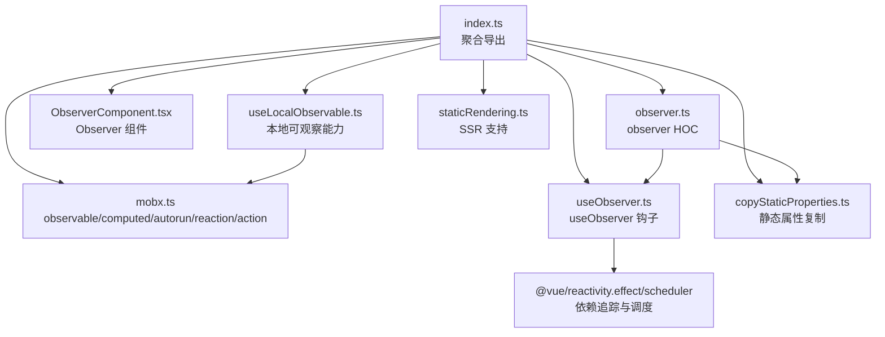
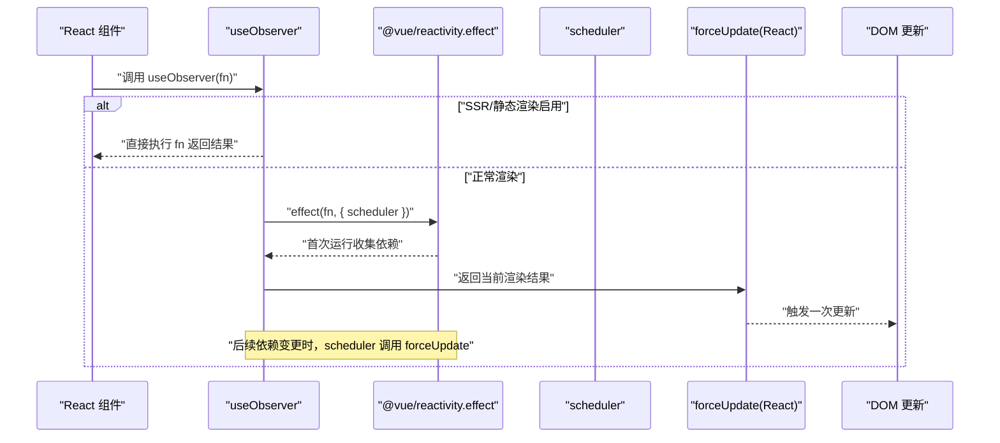
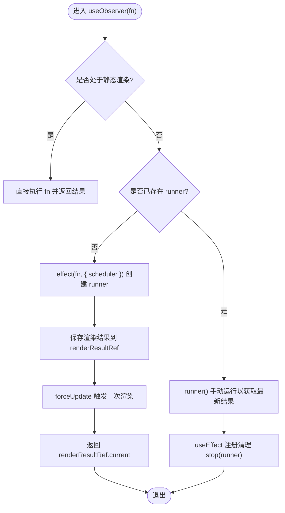
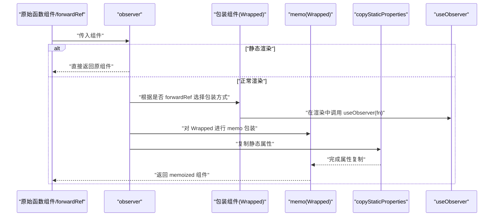
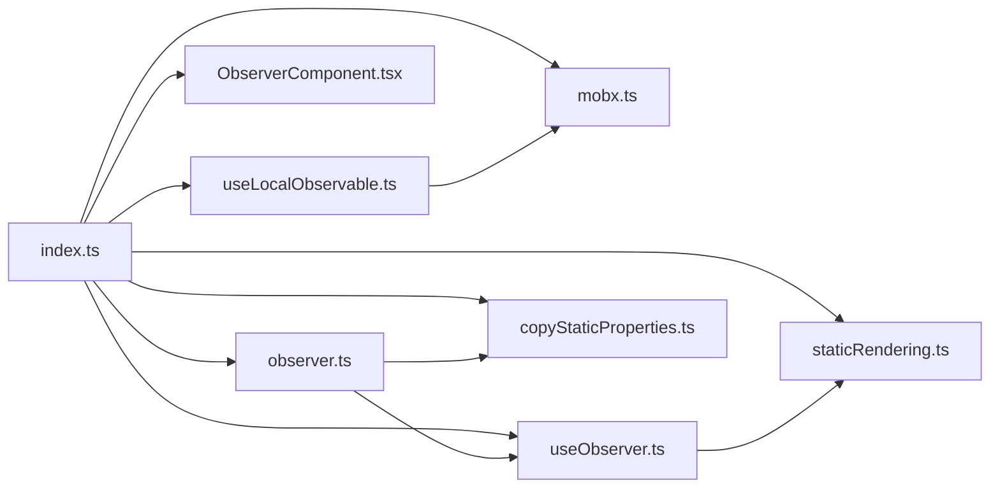

# 响应式 API

<cite>
**本文引用的文件**
- [packages/mobx-vue-lite/src/index.ts](file://packages/mobx-vue-lite/src/index.ts)
- [packages/mobx-vue-lite/src/mobx.ts](file://packages/mobx-vue-lite/src/mobx.ts)
- [packages/mobx-vue-lite/src/useObserver.ts](file://packages/mobx-vue-lite/src/useObserver.ts)
- [packages/mobx-vue-lite/src/ObserverComponent.tsx](file://packages/mobx-vue-lite/src/ObserverComponent.tsx)
- [packages/mobx-vue-lite/src/observer.ts](file://packages/mobx-vue-lite/src/observer.ts)
- [packages/mobx-vue-lite/src/useLocalObservable.ts](file://packages/mobx-vue-lite/src/useLocalObservable.ts)
- [packages/mobx-vue-lite/src/copyStaticProperties.ts](file://packages/mobx-vue-lite/src/copyStaticProperties.ts)
- [packages/mobx-vue-lite/src/staticRendering.ts](file://packages/mobx-vue-lite/src/staticRendering.ts)
- [packages/mobx-vue-lite/src/__tests__/comprehensive.test.tsx](file://packages/mobx-vue-lite/src/__tests__/comprehensive.test.tsx)
- [packages/mobx-vue-lite/src/__tests__/integration.test.tsx](file://packages/mobx-vue-lite/src/__tests__/integration.test.tsx)
- [packages/mobx-vue-lite/src/__tests__/memo.test.tsx](file://packages/mobx-vue-lite/src/__tests__/memo.test.tsx)
- [packages/mobx-vue-lite/src/__tests__/forwardRef.test.tsx](file://packages/mobx-vue-lite/src/__tests__/forwardRef.test.tsx)
- [packages/mobx-vue-lite/README.md](file://packages/mobx-vue-lite/README.md)
</cite>

## 目录
1. [简介](#简介)
2. [项目结构](#项目结构)
3. [核心组件](#核心组件)
4. [架构总览](#架构总览)
5. [详细组件分析](#详细组件分析)
6. [依赖关系分析](#依赖关系分析)
7. [性能考量](#性能考量)
8. [故障排查指南](#故障排查指南)
9. [结论](#结论)
10. [附录](#附录)

## 简介
本文件为 mobx-vue-lite 的响应式 API 参考文档，聚焦以下能力：
- useObserver 钩子的实现原理及与 @vue/reactivity 的集成，如何通过 ReactiveEffectRunner 实现自动依赖追踪与调度。
- observer 高阶组件的用法，覆盖函数组件与 forwardRef 组件支持、memo 包装与静态属性复制（copyStaticProperties）机制。
- useLocalObservable 如何创建可观察对象并管理其生命周期，以及方法绑定策略。
- 响应式状态更新、计算属性（computed）与副作用（effect/autorun/reaction）的实际使用方式与行为验证。
- 结合 comprehensive.test.tsx 等测试用例，说明异步更新、引用传递、渲染优化等高级行为。
- 与 React 渲染机制的集成细节与潜在陷阱。

## 项目结构
该模块位于 packages/mobx-vue-lite，采用“导出聚合 + 核心实现”的组织方式：index.ts 聚合导出所有公开 API；核心逻辑分布在 mobx.ts、useObserver.ts、ObserverComponent.tsx、observer.ts、useLocalObservable.ts、copyStaticProperties.ts、staticRendering.ts 等文件中；配套测试位于 __tests__ 目录，涵盖功能、性能与边界场景。

图表来源
- [packages/mobx-vue-lite/src/index.ts](file://packages/mobx-vue-lite/src/index.ts#L1-L7)
- [packages/mobx-vue-lite/src/mobx.ts](file://packages/mobx-vue-lite/src/mobx.ts#L1-L65)
- [packages/mobx-vue-lite/src/observer.ts](file://packages/mobx-vue-lite/src/observer.ts#L1-L52)
- [packages/mobx-vue-lite/src/useObserver.ts](file://packages/mobx-vue-lite/src/useObserver.ts#L1-L59)
- [packages/mobx-vue-lite/src/ObserverComponent.tsx](file://packages/mobx-vue-lite/src/ObserverComponent.tsx#L1-L32)
- [packages/mobx-vue-lite/src/useLocalObservable.ts](file://packages/mobx-vue-lite/src/useLocalObservable.ts#L1-L42)
- [packages/mobx-vue-lite/src/copyStaticProperties.ts](file://packages/mobx-vue-lite/src/copyStaticProperties.ts#L1-L23)
- [packages/mobx-vue-lite/src/staticRendering.ts](file://packages/mobx-vue-lite/src/staticRendering.ts#L1-L31)

章节来源
- [packages/mobx-vue-lite/src/index.ts](file://packages/mobx-vue-lite/src/index.ts#L1-L7)
- [packages/mobx-vue-lite/README.md](file://packages/mobx-vue-lite/README.md#L1-L61)

## 核心组件
- observable/computed/autorun/reaction/action：基于 @vue/reactivity 的轻量封装，提供与 mobx-react-lite 兼容的 API。
- useObserver：在渲染期间建立依赖追踪，当访问到的可观测值变化时触发重新渲染。
- Observer：以 render prop 形式提供细粒度响应式渲染。
- observer：高阶组件，包装函数组件（含 forwardRef），自动 memo 化，并复制静态属性。
- useLocalObservable：在组件生命周期内创建持久化的本地可观测对象，自动绑定方法以确保 this 正确。
- staticRendering：全局开关，用于 SSR 场景禁用追踪与重渲染，避免内存泄漏。

章节来源
- [packages/mobx-vue-lite/src/mobx.ts](file://packages/mobx-vue-lite/src/mobx.ts#L1-L65)
- [packages/mobx-vue-lite/src/useObserver.ts](file://packages/mobx-vue-lite/src/useObserver.ts#L1-L59)
- [packages/mobx-vue-lite/src/ObserverComponent.tsx](file://packages/mobx-vue-lite/src/ObserverComponent.tsx#L1-L32)
- [packages/mobx-vue-lite/src/observer.ts](file://packages/mobx-vue-lite/src/observer.ts#L1-L52)
- [packages/mobx-vue-lite/src/useLocalObservable.ts](file://packages/mobx-vue-lite/src/useLocalObservable.ts#L1-L42)
- [packages/mobx-vue-lite/src/staticRendering.ts](file://packages/mobx-vue-lite/src/staticRendering.ts#L1-L31)

## 架构总览
mobx-vue-lite 将 MobX 的响应式语义映射到 React 生态：observer/useObserver 通过 @vue/reactivity.effect 建立依赖图，当被追踪的 observable 值发生变化时，由 scheduler 触发 React 的强制更新；同时利用 React.memo 对 observer 包装后的组件进行浅比较优化；useLocalObservable 则在组件挂载时创建持久化可观测对象，避免每次渲染都重建。

图表来源
- [packages/mobx-vue-lite/src/useObserver.ts](file://packages/mobx-vue-lite/src/useObserver.ts#L1-L59)
- [packages/mobx-vue-lite/src/staticRendering.ts](file://packages/mobx-vue-lite/src/staticRendering.ts#L1-L31)

## 详细组件分析

### useObserver 钩子
- 作用：在渲染期间建立依赖追踪，当访问到的 observable 值变化时触发重新渲染；在静态渲染模式下直接执行渲染函数而不追踪。
- 关键点：
  - 使用 React.useReducer 作为强制更新的触发器，配合 scheduler 在依赖变更时调用。
  - 使用 useRef 存储 ReactiveEffectRunner 与最近一次渲染结果，避免重复创建 effect。
  - 在卸载时通过 useEffect 清理 runner，防止内存泄漏。
- 与 @vue/reactivity 的集成：
  - effect(fn, { scheduler }) 提供依赖收集与变更调度；stop(runner) 用于清理。
  - scheduler 内部调用 forceUpdate，从而驱动 React 重新渲染。

图表来源
- [packages/mobx-vue-lite/src/useObserver.ts](file://packages/mobx-vue-lite/src/useObserver.ts#L1-L59)
- [packages/mobx-vue-lite/src/staticRendering.ts](file://packages/mobx-vue-lite/src/staticRendering.ts#L1-L31)

章节来源
- [packages/mobx-vue-lite/src/useObserver.ts](file://packages/mobx-vue-lite/src/useObserver.ts#L1-L59)
- [packages/mobx-vue-lite/src/staticRendering.ts](file://packages/mobx-vue-lite/src/staticRendering.ts#L1-L31)

### Observer 组件
- 作用：以 render prop 的形式包裹一段渲染逻辑，使其在细粒度的响应式上下文中执行。
- 行为：
  - 接收 children 或 render 函数，内部委托给 useObserver 执行。
  - 设置 displayName 便于调试。
- 适用场景：需要对局部区域进行细粒度响应式控制，避免整个父组件重渲染。

章节来源
- [packages/mobx-vue-lite/src/ObserverComponent.tsx](file://packages/mobx-vue-lite/src/ObserverComponent.tsx#L1-L32)

### observer 高阶组件
- 作用：包装函数组件（含 forwardRef），自动进行依赖追踪、浅比较优化与静态属性复制。
- 关键流程：
  - 静态渲染模式下直接返回原组件。
  - 识别 forwardRef 组件并解包 render 函数。
  - 使用 forwardRef 或普通函数组件包装，内部调用 useObserver。
  - 通过 memo 对包装后的组件进行浅比较优化。
  - 使用 copyStaticProperties 将原组件的静态属性复制到 memoized 组件上。
  - 设置 displayName 以便调试。
- 对函数组件与类组件的支持：
  - 函数组件：直接包装。
  - 类组件：不在此实现范围内，建议使用函数组件或自行适配。
- forwardRef 支持：正确转发 ref，使外部可获取被包装组件实例。
- 静态属性复制：排除 React 内部保留字段，复制默认属性、类型检查、静态方法等。

图表来源
- [packages/mobx-vue-lite/src/observer.ts](file://packages/mobx-vue-lite/src/observer.ts#L1-L52)
- [packages/mobx-vue-lite/src/copyStaticProperties.ts](file://packages/mobx-vue-lite/src/copyStaticProperties.ts#L1-L23)
- [packages/mobx-vue-lite/src/useObserver.ts](file://packages/mobx-vue-lite/src/useObserver.ts#L1-L59)

章节来源
- [packages/mobx-vue-lite/src/observer.ts](file://packages/mobx-vue-lite/src/observer.ts#L1-L52)
- [packages/mobx-vue-lite/src/copyStaticProperties.ts](file://packages/mobx-vue-lite/src/copyStaticProperties.ts#L1-L23)

### useLocalObservable 钩子
- 作用：在组件生命周期内创建一个持久化的本地可观测对象，类似 useState，但对象本身是 observable。
- 关键点：
  - 使用 React.useState 初始化一次，确保对象在组件生命周期内复用。
  - 通过 mobx.observable 将普通对象转为可观测对象，并开启 autoBind 以保证方法内的 this 指向正确。
  - 自动绑定对象上的函数方法，避免在事件回调中丢失 this。
- 生命周期管理：
  - 仅在首次渲染时创建对象；卸载时由 React 管理；若需手动清理，可在组件卸载时显式处理（例如通过 effect cleanup）。

章节来源
- [packages/mobx-vue-lite/src/useLocalObservable.ts](file://packages/mobx-vue-lite/src/useLocalObservable.ts#L1-L42)
- [packages/mobx-vue-lite/src/mobx.ts](file://packages/mobx-vue-lite/src/mobx.ts#L1-L65)

### 响应式状态更新、计算属性与副作用
- observable：将普通对象转为可观测对象，支持读写与依赖追踪。
- computed：基于 getter 的惰性计算，返回带 get() 方法的对象。
- autorun：创建一个反应器，在其视图中访问的 observable 变化时自动执行。
- reaction：表达式求值变化时触发回调，支持 fireImmediately 选项。
- action：在当前实现中为透传，不改变行为，Vue reactivity 的批处理由其自身调度。

章节来源
- [packages/mobx-vue-lite/src/mobx.ts](file://packages/mobx-vue-lite/src/mobx.ts#L1-L65)

### 与 React 渲染机制的集成与陷阱
- 集成点：
  - useObserver 通过 React.useReducer 的状态变更触发强制更新，与 React 的调度器协同工作。
  - observer 通过 React.memo 对包装后的组件进行浅比较，减少不必要的重渲染。
  - forwardRef 的支持确保 ref 能正确传递至底层元素或组件。
- 潜在陷阱：
  - 在静态渲染模式下不会追踪依赖也不会重渲染，需在 SSR 入口处正确设置 enableStaticRendering。
  - 若在渲染期间修改了未被访问的 observable 字段，不会触发重渲染（细粒度追踪）。
  - 在 forwardRef 组件中，确保通过 useImperativeHandle 暴露必要的实例方法。
  - 使用 reaction/autorun 时注意清理返回的 disposer，避免内存泄漏。

章节来源
- [packages/mobx-vue-lite/src/staticRendering.ts](file://packages/mobx-vue-lite/src/staticRendering.ts#L1-L31)
- [packages/mobx-vue-lite/src/observer.ts](file://packages/mobx-vue-lite/src/observer.ts#L1-L52)
- [packages/mobx-vue-lite/src/__tests__/forwardRef.test.tsx](file://packages/mobx-vue-lite/src/__tests__/forwardRef.test.tsx#L1-L37)

## 依赖关系分析
- 导出聚合：index.ts 将 mobx、observer、useLocalObservable、useObserver、ObserverComponent、staticRendering 统一导出，方便用户按需引入。
- 内部依赖：
  - observer 依赖 useObserver 与 copyStaticProperties。
  - useObserver 依赖 @vue/reactivity.effect/scheduler 与 staticRendering。
  - useLocalObservable 依赖 mobx.observable。
  - ObserverComponent 依赖 useObserver。
- 外部依赖：
  - @vue/reactivity 提供 reactive/ref/computed/effect/stop 等能力。
  - React 提供 hooks、memo、forwardRef 等生态能力。

图表来源
- [packages/mobx-vue-lite/src/index.ts](file://packages/mobx-vue-lite/src/index.ts#L1-L7)
- [packages/mobx-vue-lite/src/observer.ts](file://packages/mobx-vue-lite/src/observer.ts#L1-L52)
- [packages/mobx-vue-lite/src/useObserver.ts](file://packages/mobx-vue-lite/src/useObserver.ts#L1-L59)
- [packages/mobx-vue-lite/src/ObserverComponent.tsx](file://packages/mobx-vue-lite/src/ObserverComponent.tsx#L1-L32)
- [packages/mobx-vue-lite/src/useLocalObservable.ts](file://packages/mobx-vue-lite/src/useLocalObservable.ts#L1-L42)
- [packages/mobx-vue-lite/src/copyStaticProperties.ts](file://packages/mobx-vue-lite/src/copyStaticProperties.ts#L1-L23)
- [packages/mobx-vue-lite/src/staticRendering.ts](file://packages/mobx-vue-lite/src/staticRendering.ts#L1-L31)

章节来源
- [packages/mobx-vue-lite/src/index.ts](file://packages/mobx-vue-lite/src/index.ts#L1-L7)

## 性能考量
- 细粒度重渲染：useObserver 与 Observer 仅在访问到的 observable 变化时触发重渲染，避免整树重绘。
- 浅比较优化：observer 默认使用 React.memo 包装，减少因 props 浅相等导致的重渲染。
- SSR 安全：enableStaticRendering(true) 时禁用依赖追踪，避免 SSR 场景下的内存泄漏与无意义渲染。
- 计算属性：computed 返回惰性求值对象，避免重复计算；在渲染期间访问会建立依赖。
- 副作用：autorun/reaction 在依赖变化时触发，注意及时清理以避免泄漏。

章节来源
- [packages/mobx-vue-lite/src/observer.ts](file://packages/mobx-vue-lite/src/observer.ts#L1-L52)
- [packages/mobx-vue-lite/src/staticRendering.ts](file://packages/mobx-vue-lite/src/staticRendering.ts#L1-L31)
- [packages/mobx-vue-lite/src/mobx.ts](file://packages/mobx-vue-lite/src/mobx.ts#L1-L65)

## 故障排查指南
- SSR 不重渲染
  - 现象：在 SSR 启用后，修改 observable 不触发重渲染。
  - 处理：确认已调用 enableStaticRendering(true)，并在客户端入口关闭。
  - 参考测试：[packages/mobx-vue-lite/src/__tests__/comprehensive.test.tsx](file://packages/mobx-vue-lite/src/__tests__/comprehensive.test.tsx#L215-L244)
- 未访问字段未触发重渲染
  - 现象：只修改未在渲染期间访问的字段，组件不会重渲染。
  - 处理：确保在渲染期间访问到需要追踪的字段。
  - 参考测试：[packages/mobx-vue-lite/src/__tests__/comprehensive.test.tsx](file://packages/mobx-vue-lite/src/__tests__/comprehensive.test.tsx#L76-L101)
- forwardRef 无法获取实例
  - 现象：通过 ref 获取不到组件实例方法。
  - 处理：使用 useImperativeHandle 暴露所需方法，并确保组件被 observer 包裹。
  - 参考测试：[packages/mobx-vue-lite/src/__tests__/forwardRef.test.tsx](file://packages/mobx-vue-lite/src/__tests__/forwardRef.test.tsx#L1-L37)
- 错误边界未捕获异常
  - 现象：observer 组件抛出错误未被上层错误边界捕获。
  - 处理：确认错误边界配置正确，且异常发生在渲染阶段。
  - 参考测试：[packages/mobx-vue-lite/src/__tests__/comprehensive.test.tsx](file://packages/mobx-vue-lite/src/__tests__/comprehensive.test.tsx#L246-L299)
- props 浅相等导致未重渲染
  - 现象：传入相同引用的 props 未触发重渲染。
  - 处理：确保 props 引用变化或在 observer 内部访问 observable。
  - 参考测试：[packages/mobx-vue-lite/src/__tests__/memo.test.tsx](file://packages/mobx-vue-lite/src/__tests__/memo.test.tsx#L1-L45)

章节来源
- [packages/mobx-vue-lite/src/__tests__/comprehensive.test.tsx](file://packages/mobx-vue-lite/src/__tests__/comprehensive.test.tsx#L1-L300)
- [packages/mobx-vue-lite/src/__tests__/memo.test.tsx](file://packages/mobx-vue-lite/src/__tests__/memo.test.tsx#L1-L45)
- [packages/mobx-vue-lite/src/__tests__/forwardRef.test.tsx](file://packages/mobx-vue-lite/src/__tests__/forwardRef.test.tsx#L1-L37)

## 结论
mobx-vue-lite 通过将 MobX 的响应式语义与 React 的渲染机制相结合，提供了细粒度的依赖追踪与高效的重渲染策略。useObserver 与 Observer 提供灵活的细粒度响应式渲染；observer 通过 memo 与静态属性复制提升性能与开发体验；useLocalObservable 为组件提供持久化本地可观测状态。在 SSR 场景下，通过 staticRendering 可安全地禁用追踪，避免内存泄漏。结合测试用例可知，该实现能够正确处理异步更新、引用传递、渲染优化与错误传播等复杂场景。

## 附录

### API 一览与行为要点
- observer
  - 功能：包装函数组件（含 forwardRef），自动 memo 化与静态属性复制。
  - 参考路径：[packages/mobx-vue-lite/src/observer.ts](file://packages/mobx-vue-lite/src/observer.ts#L1-L52)
- useObserver
  - 功能：在渲染期间建立依赖追踪，依赖变化时触发重渲染。
  - 参考路径：[packages/mobx-vue-lite/src/useObserver.ts](file://packages/mobx-vue-lite/src/useObserver.ts#L1-L59)
- Observer
  - 功能：render prop 组件，提供细粒度响应式渲染。
  - 参考路径：[packages/mobx-vue-lite/src/ObserverComponent.tsx](file://packages/mobx-vue-lite/src/ObserverComponent.tsx#L1-L32)
- useLocalObservable
  - 功能：创建持久化本地可观测对象，自动绑定方法。
  - 参考路径：[packages/mobx-vue-lite/src/useLocalObservable.ts](file://packages/mobx-vue-lite/src/useLocalObservable.ts#L1-L42)
- observable/computed/autorun/reaction/action
  - 功能：MobX 响应式核心能力，基于 @vue/reactivity 实现。
  - 参考路径：[packages/mobx-vue-lite/src/mobx.ts](file://packages/mobx-vue-lite/src/mobx.ts#L1-L65)
- enableStaticRendering/isUsingStaticRendering
  - 功能：SSR 支持，禁用依赖追踪与重渲染。
  - 参考路径：[packages/mobx-vue-lite/src/staticRendering.ts](file://packages/mobx-vue-lite/src/staticRendering.ts#L1-L31)

### 测试用例参考
- 细粒度重渲染与局部更新
  - 参考路径：[packages/mobx-vue-lite/src/__tests__/comprehensive.test.tsx](file://packages/mobx-vue-lite/src/__tests__/comprehensive.test.tsx#L104-L160)
- 嵌套渲染与 memo 优化
  - 参考路径：[packages/mobx-vue-lite/src/__tests__/comprehensive.test.tsx](file://packages/mobx-vue-lite/src/__tests__/comprehensive.test.tsx#L162-L213)
- SSR 不追踪行为
  - 参考路径：[packages/mobx-vue-lite/src/__tests__/comprehensive.test.tsx](file://packages/mobx-vue-lite/src/__tests__/comprehensive.test.tsx#L215-L244)
- 错误传播与错误边界
  - 参考路径：[packages/mobx-vue-lite/src/__tests__/comprehensive.test.tsx](file://packages/mobx-vue-lite/src/__tests__/comprehensive.test.tsx#L246-L299)
- 基础响应式能力验证
  - 参考路径：[packages/mobx-vue-lite/src/__tests__/integration.test.tsx](file://packages/mobx-vue-lite/src/__tests__/integration.test.tsx#L1-L91)
- props 浅相等与重渲染
  - 参考路径：[packages/mobx-vue-lite/src/__tests__/memo.test.tsx](file://packages/mobx-vue-lite/src/__tests__/memo.test.tsx#L1-L45)
- forwardRef 与实例方法
  - 参考路径：[packages/mobx-vue-lite/src/__tests__/forwardRef.test.tsx](file://packages/mobx-vue-lite/src/__tests__/forwardRef.test.tsx#L1-L37)