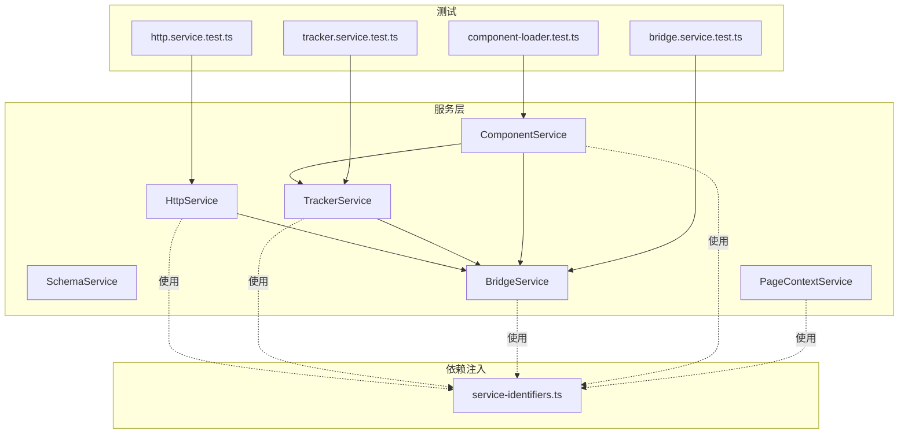
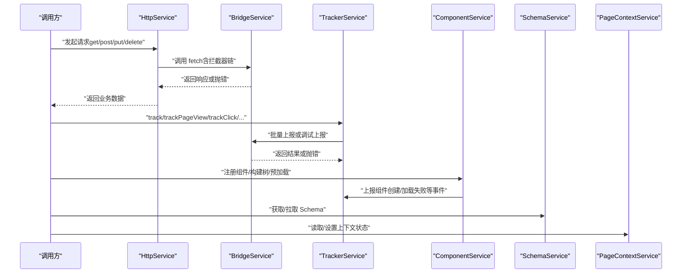
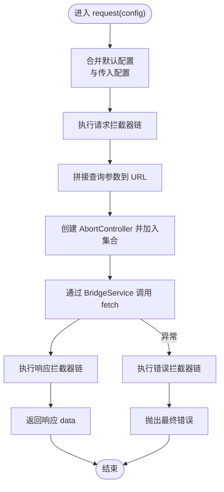
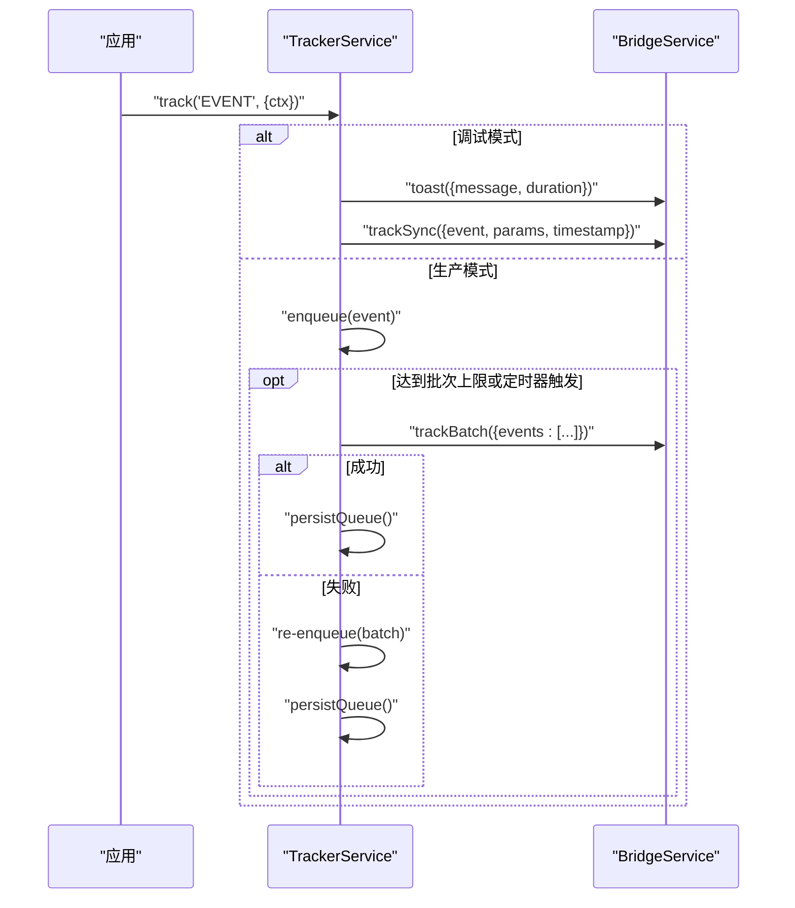
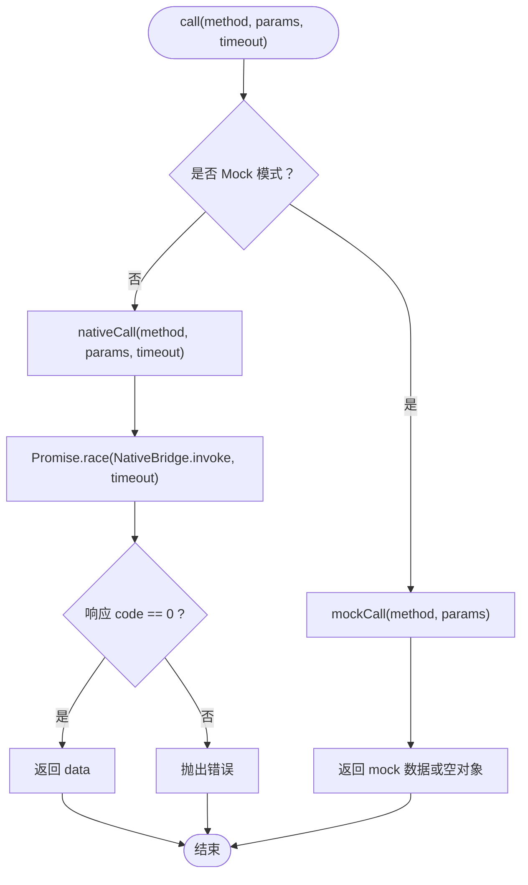
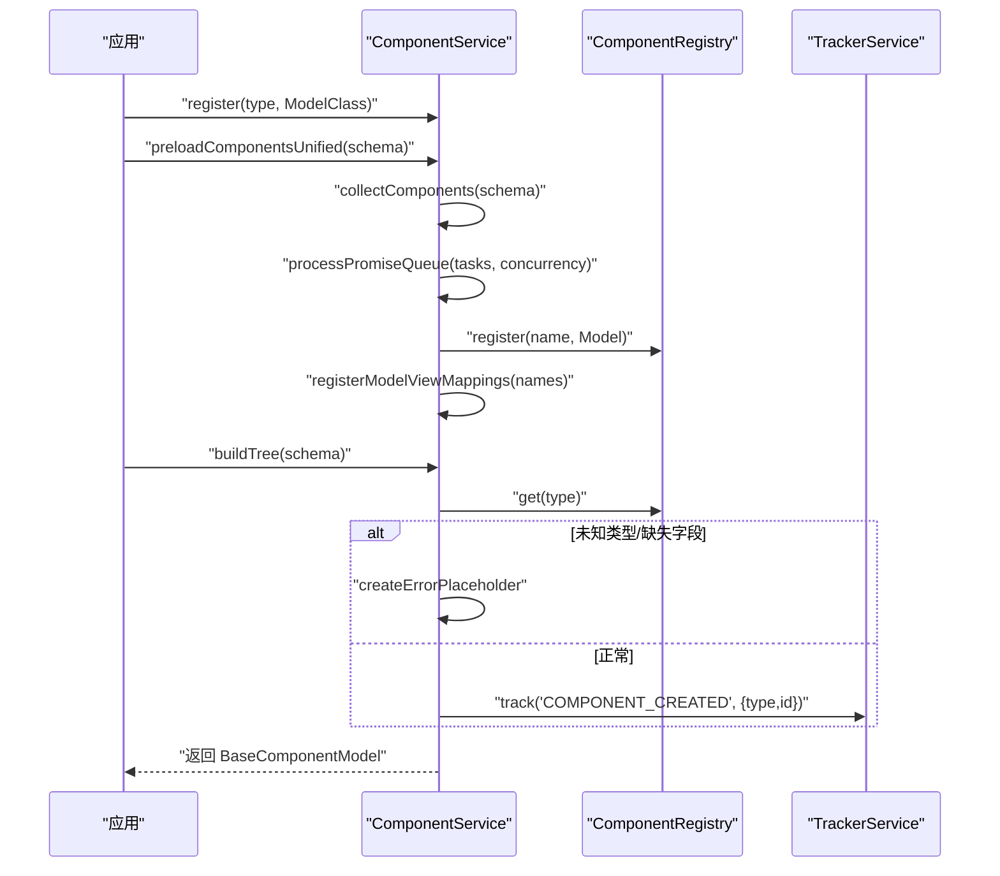
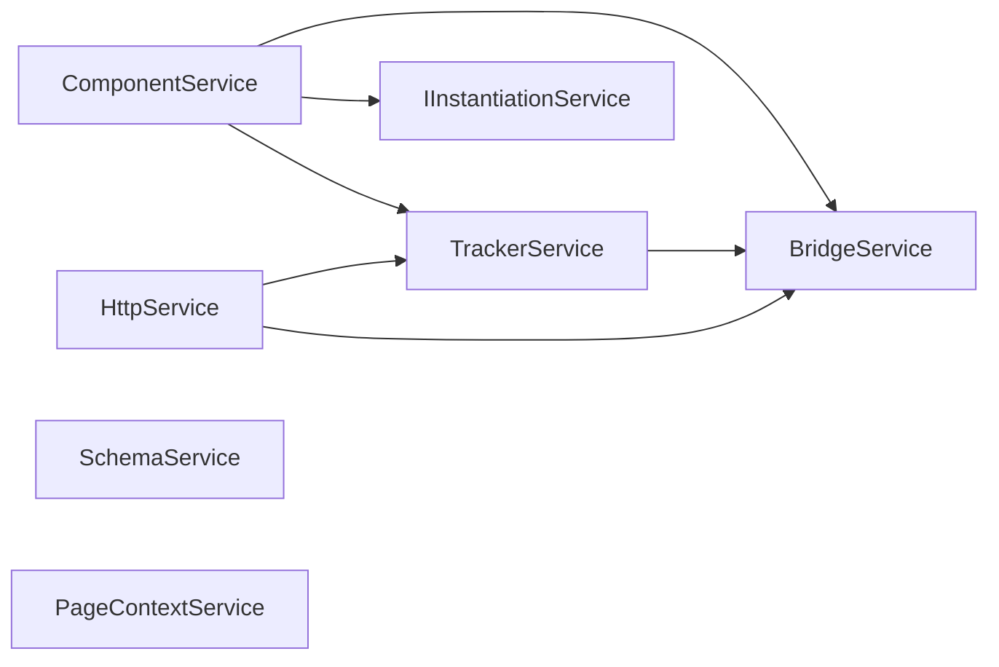

# 服务 API

<cite>
**本文引用的文件**
- [http.service.ts](file://packages/h5-builder/src/services/http.service.ts)
- [tracker.service.ts](file://packages/h5-builder/src/services/tracker.service.ts)
- [schema.service.ts](file://packages/h5-builder/src/services/schema.service.ts)
- [bridge.service.ts](file://packages/h5-builder/src/services/bridge.service.ts)
- [component.service.ts](file://packages/h5-builder/src/services/component.service.ts)
- [context.service.ts](file://packages/h5-builder/src/services/context.service.ts)
- [service-identifiers.ts](file://packages/h5-builder/src/services/service-identifiers.ts)
- [http.service.test.ts](file://packages/h5-builder/src/__tests__/http.service.test.ts)
- [tracker.service.test.ts](file://packages/h5-builder/src/__tests__/tracker.service.test.ts)
- [bridge.service.test.ts](file://packages/h5-builder/src/__tests__/bridge.service.test.ts)
- [component-loader.test.ts](file://packages/h5-builder/src/__tests__/component-loader.test.ts)
- [index.ts](file://packages/h5-builder/src/services/index.ts)
</cite>

## 目录
1. [简介](#简介)
2. [项目结构](#项目结构)
3. [核心组件](#核心组件)
4. [架构总览](#架构总览)
5. [详细组件分析](#详细组件分析)
6. [依赖关系分析](#依赖关系分析)
7. [性能考量](#性能考量)
8. [故障排查指南](#故障排查指南)
9. [结论](#结论)
10. [附录](#附录)

## 简介
本文件面向框架提供的核心服务，系统化梳理以下能力：
- HttpService：HTTP 请求方法（get/post/put/delete）、拦截器机制、错误处理、请求取消与缓存策略（基于内部缓存与并发控制）。
- TrackerService：埋点事件追踪接口（事件类型、上下文传递、批量上报、持久化与调试模式）。
- SchemaService：页面结构数据的解析与验证（响应式存储、异步获取）。
- BridgeService：与外部宿主环境通信的 API（JSBridge 调用、Mock 模式、超时与错误处理）。
- ComponentService：组件树管理（注册、构建、异步加载、并发控制、错误占位与埋点）。
- ContextService：页面级全局状态访问（用户信息、环境信息、路由信息、可见性与自定义状态）。
- 服务标识符（service-identifiers.ts）：依赖注入标识符的注册与使用规范。

文档同时结合测试文件说明异常场景处理与典型调用方式。

## 项目结构
服务模块位于 h5-builder 包内，采用“按服务分文件”的组织方式，辅以 DI（依赖注入）标识符与测试用例覆盖关键行为。

图表来源
- [http.service.ts](file://packages/h5-builder/src/services/http.service.ts#L1-L281)
- [tracker.service.ts](file://packages/h5-builder/src/services/tracker.service.ts#L1-L290)
- [schema.service.ts](file://packages/h5-builder/src/services/schema.service.ts#L1-L38)
- [bridge.service.ts](file://packages/h5-builder/src/services/bridge.service.ts#L1-L227)
- [component.service.ts](file://packages/h5-builder/src/services/component.service.ts#L1-L735)
- [context.service.ts](file://packages/h5-builder/src/services/context.service.ts#L1-L187)
- [service-identifiers.ts](file://packages/h5-builder/src/services/service-identifiers.ts#L1-L20)
- [http.service.test.ts](file://packages/h5-builder/src/__tests__/http.service.test.ts#L1-L252)
- [tracker.service.test.ts](file://packages/h5-builder/src/__tests__/tracker.service.test.ts#L1-L226)
- [bridge.service.test.ts](file://packages/h5-builder/src/__tests__/bridge.service.test.ts#L1-L132)
- [component-loader.test.ts](file://packages/h5-builder/src/__tests__/component-loader.test.ts#L1-L271)

章节来源
- [index.ts](file://packages/h5-builder/src/services/index.ts#L1-L8)

## 核心组件
- HttpService：提供请求方法与拦截器链路，基于 BridgeService 的 fetch 能力实现；支持 baseURL 与 token 的默认拦截器；支持取消未完成请求；支持请求/响应/错误三类拦截器。
- TrackerService：事件队列、批量上报、定时刷新、持久化 localStorage、调试模式（Toast+同步上报）、错误重试与恢复。
- SchemaService：响应式存储页面 Schema，提供获取与异步拉取能力。
- BridgeService：统一桥接调用入口，支持原生调用与 Mock 模式，内置 fetch、用户信息、导航、分享等常用方法；支持超时与错误码校验。
- ComponentService：组件注册与构建、异步加载（Model/View 分离与统一队列）、并发控制、错误占位、埋点上报。
- PageContextService：页面级全局状态（用户、环境、路由、可见性、自定义状态），支持从 URL 解析路由信息与环境检测。
- service-identifiers.ts：为各服务定义 DI 标识符，便于依赖注入容器创建实例。

章节来源
- [http.service.ts](file://packages/h5-builder/src/services/http.service.ts#L1-L281)
- [tracker.service.ts](file://packages/h5-builder/src/services/tracker.service.ts#L1-L290)
- [schema.service.ts](file://packages/h5-builder/src/services/schema.service.ts#L1-L38)
- [bridge.service.ts](file://packages/h5-builder/src/services/bridge.service.ts#L1-L227)
- [component.service.ts](file://packages/h5-builder/src/services/component.service.ts#L1-L735)
- [context.service.ts](file://packages/h5-builder/src/services/context.service.ts#L1-L187)
- [service-identifiers.ts](file://packages/h5-builder/src/services/service-identifiers.ts#L1-L20)

## 架构总览
下图展示服务间的交互关系与数据流。

图表来源
- [http.service.ts](file://packages/h5-builder/src/services/http.service.ts#L147-L203)
- [tracker.service.ts](file://packages/h5-builder/src/services/tracker.service.ts#L71-L171)
- [bridge.service.ts](file://packages/h5-builder/src/services/bridge.service.ts#L55-L101)
- [component.service.ts](file://packages/h5-builder/src/services/component.service.ts#L135-L209)
- [schema.service.ts](file://packages/h5-builder/src/services/schema.service.ts#L23-L32)
- [context.service.ts](file://packages/h5-builder/src/services/context.service.ts#L63-L111)

## 详细组件分析

### HttpService API 文档
- 请求方法
  - get(url, config?): Promise<T>
  - post(url, data?, config?): Promise<T>
  - put(url, data?, config?): Promise<T>
  - delete(url, config?): Promise<T>
  - request(config): Promise<T>（通用入口）
- 拦截器机制
  - addRequestInterceptor(fn): 返回移除函数
  - addResponseInterceptor(fn): 返回移除函数
  - addErrorInterceptor(fn): 返回移除函数
- 错误处理
  - 统一捕获并执行错误拦截器链，最后抛出最终错误。
- 缓存策略
  - 内置 pendingRequests 集合与 AbortController，支持 cancelAll 取消未完成请求。
  - 通过默认拦截器注入 baseURL 与 Authorization 头，减少重复配置。
- 超时与取消
  - request 内部使用 AbortController 控制取消；BridgeService 层提供超时竞速。
- 实际调用示例（参考测试）
  - GET/POST/PUT/DELETE 请求与断言见 [http.service.test.ts](file://packages/h5-builder/src/__tests__/http.service.test.ts#L29-L77)。
  - 查询参数拼接与断言见 [http.service.test.ts](file://packages/h5-builder/src/__tests__/http.service.test.ts#L79-L101)。
  - 请求拦截器执行与移除见 [http.service.test.ts](file://packages/h5-builder/src/__tests__/http.service.test.ts#L103-L144)。
  - 响应拦截器执行见 [http.service.test.ts](file://packages/h5-builder/src/__tests__/http.service.test.ts#L146-L163)。
  - 错误拦截器执行见 [http.service.test.ts](file://packages/h5-builder/src/__tests__/http.service.test.ts#L165-L177)。
  - 取消请求与释放资源见 [http.service.test.ts](file://packages/h5-builder/src/__tests__/http.service.test.ts#L179-L198)。
  - baseURL 与 token 注入见 [http.service.test.ts](file://packages/h5-builder/src/__tests__/http.service.test.ts#L200-L250)。

图表来源
- [http.service.ts](file://packages/h5-builder/src/services/http.service.ts#L147-L203)

章节来源
- [http.service.ts](file://packages/h5-builder/src/services/http.service.ts#L1-L281)
- [http.service.test.ts](file://packages/h5-builder/src/__tests__/http.service.test.ts#L1-L252)

### TrackerService API 文档
- 事件类型与上下文
  - track(event, params?): 上报任意事件，包含事件名、参数与时间戳。
  - TrackerHelpers：封装常用事件（页面浏览、组件曝光、点击、错误、性能）。
- 批量上报机制
  - 队列满（maxBatchSize）或定时器（flushInterval）触发 flush。
  - flush 成功后持久化更新；失败则回退到队列并更新持久化。
- 持久化与恢复
  - enablePersistence=true 时，使用 localStorage 存储队列；构造函数可从本地恢复。
- 调试模式
  - debug=true 时，同步发送并通过 toast 提示。
- 实际调用示例（参考测试）
  - 基础跟踪与队列长度见 [tracker.service.test.ts](file://packages/h5-builder/src/__tests__/tracker.service.test.ts#L19-L26)。
  - 调试模式立即上报与 toast 见 [tracker.service.test.ts](file://packages/h5-builder/src/__tests__/tracker.service.test.ts#L28-L41)。
  - 达到最大批次与定时器触发见 [tracker.service.test.ts](file://packages/h5-builder/src/__tests__/tracker.service.test.ts#L43-L84)。
  - 持久化与恢复见 [tracker.service.test.ts](file://packages/h5-builder/src/__tests__/tracker.service.test.ts#L86-L134)。
  - flush 失败重入队列见 [tracker.service.test.ts](file://packages/h5-builder/src/__tests__/tracker.service.test.ts#L136-L155)。
  - 释放时清空定时器与发送剩余事件见 [tracker.service.test.ts](file://packages/h5-builder/src/__tests__/tracker.service.test.ts#L157-L184)。
  - TrackerHelpers 封装事件见 [tracker.service.test.ts](file://packages/h5-builder/src/__tests__/tracker.service.test.ts#L186-L225)。

图表来源
- [tracker.service.ts](file://packages/h5-builder/src/services/tracker.service.ts#L71-L171)
- [bridge.service.ts](file://packages/h5-builder/src/services/bridge.service.ts#L217-L226)

章节来源
- [tracker.service.ts](file://packages/h5-builder/src/services/tracker.service.ts#L1-L290)
- [tracker.service.test.ts](file://packages/h5-builder/src/__tests__/tracker.service.test.ts#L1-L226)

### SchemaService API 文档
- getSchema(): ComponentSchema | null
- fetchSchema(): Promise<ComponentSchema>
- 响应式存储：内部使用 observable 包裹，便于订阅变更。
- 实际调用示例（参考测试）
  - 获取 Schema 与异步拉取见 [schema.service.ts](file://packages/h5-builder/src/services/schema.service.ts#L17-L32)。

章节来源
- [schema.service.ts](file://packages/h5-builder/src/services/schema.service.ts#L1-L38)

### BridgeService API 文档
- call(method, params?, timeout?): Promise<T>
- Mock 模式：当 window.NativeBridge 不可用时自动切换，内置 fetch、用户信息、导航、分享等方法的 mock 数据。
- 原生模式：通过 window.NativeBridge.invoke 调用，支持超时竞速与响应码校验。
- BridgeHelpers：getUserInfo、toast、navigate、share、fetch 等常用封装。
- 实际调用示例（参考测试）
  - Mock 模式工作与自定义 mock 见 [bridge.service.test.ts](file://packages/h5-builder/src/__tests__/bridge.service.test.ts#L12-L45)。
  - 原生模式调用与错误处理见 [bridge.service.test.ts](file://packages/h5-builder/src/__tests__/bridge.service.test.ts#L47-L85)。
  - BridgeHelpers 封装方法见 [bridge.service.test.ts](file://packages/h5-builder/src/__tests__/bridge.service.test.ts#L87-L118)。

图表来源
- [bridge.service.ts](file://packages/h5-builder/src/services/bridge.service.ts#L55-L101)

章节来源
- [bridge.service.ts](file://packages/h5-builder/src/services/bridge.service.ts#L1-L227)
- [bridge.service.test.ts](file://packages/h5-builder/src/__tests__/bridge.service.test.ts#L1-L132)

### ComponentService API 文档
- 组件注册
  - register(type, ModelClass)
  - registerAll(map)
  - getRegistryInfo(): { totalComponents, types[] }
- 组件构建
  - buildTree(schema): BaseComponentModel
  - buildModelTree(schema): BaseComponentModel（需先预加载）
- 异步加载与缓存
  - registerAsync(name, { model/view/loader }, metadata?)
  - preloadComponentsUnified(schema): { modelTreeReady, viewsReady }
  - getModelTreeReady()/getViewsReady()
  - 内置 modelCache/viewCache 与延迟加载（delayRange）。
- 并发控制
  - 使用 Promise.race 与 Promise.all 实现“完成一个补充一个”的并发调度。
- 错误处理
  - 验证失败与未知类型：返回 ErrorPlaceholderModel。
  - 子组件构建失败：插入 ErrorPlaceholderModel 并继续。
  - 加载失败：上报 MODEL_LOAD_FAILED/VIEW_LOAD_FAILED/EMPTY_MODEL_RENDERED。
- 实际调用示例（参考测试）
  - 注册与构建简单组件见 [component-loader.test.ts](file://packages/h5-builder/src/__tests__/component-loader.test.ts#L44-L96)。
  - 容器与嵌套容器构建见 [component-loader.test.ts](file://packages/h5-builder/src/__tests__/component-loader.test.ts#L98-L163)。
  - 错误处理（未知类型、缺失字段、子组件错误）见 [component-loader.test.ts](file://packages/h5-builder/src/__tests__/component-loader.test.ts#L165-L241)。
  - Schema 校验与空 props 场景见 [component-loader.test.ts](file://packages/h5-builder/src/__tests__/component-loader.test.ts#L243-L271)。

图表来源
- [component.service.ts](file://packages/h5-builder/src/services/component.service.ts#L135-L209)
- [component.service.ts](file://packages/h5-builder/src/services/component.service.ts#L349-L591)
- [component.service.ts](file://packages/h5-builder/src/services/component.service.ts#L628-L734)

章节来源
- [component.service.ts](file://packages/h5-builder/src/services/component.service.ts#L1-L735)
- [component-loader.test.ts](file://packages/h5-builder/src/__tests__/component-loader.test.ts#L1-L271)

### ContextService API 文档
- 用户信息：setUserInfo(UserInfo)
- 环境信息：setEnvInfo(EnvInfo)，detectEnv(): EnvInfo
- 路由信息：setRouteInfo(RouteInfo)，parseRouteFromURL(url): RouteInfo
- 页面状态：setDebugMode(boolean)，setVisibility(boolean)，isDebug，isVisible
- 自定义状态：setCustomState(key, value)，getCustomState(key): T | undefined
- 实际调用示例（参考测试）
  - 路由解析与环境检测见 [context.service.ts](file://packages/h5-builder/src/services/context.service.ts#L112-L186)。

章节来源
- [context.service.ts](file://packages/h5-builder/src/services/context.service.ts#L1-L187)

### 服务标识符（service-identifiers.ts）注册与使用规范
- 为各服务创建 DI 标识符，避免直接依赖具体类名，提升解耦与可替换性。
- 使用方式
  - 在构造函数参数上使用 @Ixxx 注入服务实例。
  - 通过依赖注入容器（ServiceCollection + InstantiationService）创建实例。
- 示例路径
  - HttpService 构造函数注入 IBridgeService、ITrackerService 见 [http.service.ts](file://packages/h5-builder/src/services/http.service.ts#L73-L76)。
  - TrackerService 构造函数注入 IBridgeService 见 [tracker.service.ts](file://packages/h5-builder/src/services/tracker.service.ts#L41-L44)。
  - ComponentService 构造函数注入 IInstantiationService、ITrackerService 见 [component.service.ts](file://packages/h5-builder/src/services/component.service.ts#L111-L114)。
  - SchemaService、PageContextService 无显式注入，直接使用。
  - 服务导出入口见 [index.ts](file://packages/h5-builder/src/services/index.ts#L1-L8)。

章节来源
- [service-identifiers.ts](file://packages/h5-builder/src/services/service-identifiers.ts#L1-L20)
- [http.service.ts](file://packages/h5-builder/src/services/http.service.ts#L73-L76)
- [tracker.service.ts](file://packages/h5-builder/src/services/tracker.service.ts#L41-L44)
- [component.service.ts](file://packages/h5-builder/src/services/component.service.ts#L111-L114)
- [index.ts](file://packages/h5-builder/src/services/index.ts#L1-L8)

## 依赖关系分析
- 组件耦合
  - HttpService 依赖 BridgeService（fetch 调用）与 TrackerService（可选埋点）。
  - TrackerService 依赖 BridgeService（上报）。
  - ComponentService 依赖 IInstantiationService（实例化模型）、ITrackerService（埋点）。
  - SchemaService、PageContextService 作为数据/状态服务，被其他服务读取。
- 循环依赖
  - 通过 DI 标识符与延迟注入避免循环依赖问题。
- 外部依赖
  - BridgeService 依赖 window.NativeBridge 或 Mock 数据。
  - TrackerService 依赖 localStorage（可选）。

图表来源
- [http.service.ts](file://packages/h5-builder/src/services/http.service.ts#L73-L76)
- [tracker.service.ts](file://packages/h5-builder/src/services/tracker.service.ts#L41-L44)
- [component.service.ts](file://packages/h5-builder/src/services/component.service.ts#L111-L114)

章节来源
- [http.service.ts](file://packages/h5-builder/src/services/http.service.ts#L1-L281)
- [tracker.service.ts](file://packages/h5-builder/src/services/tracker.service.ts#L1-L290)
- [component.service.ts](file://packages/h5-builder/src/services/component.service.ts#L1-L735)

## 性能考量
- HttpService
  - 使用 AbortController 管理请求生命周期，避免内存泄漏与悬挂请求。
  - 默认超时与拦截器链开销可控，建议仅在必要时添加拦截器。
- TrackerService
  - 批量大小与刷新间隔可调，建议根据业务流量与网络状况优化。
  - 持久化写入 localStorage 有一定成本，建议在高频场景下谨慎启用。
- ComponentService
  - 统一队列并发控制（MODEL_CONCURRENCY/TOTAL_CONCURRENCY）平衡加载速度与稳定性。
  - 错误占位与空视图避免阻塞整体渲染，提高健壮性。
- BridgeService
  - 原生调用与超时竞速保证稳定性；Mock 模式便于开发调试。

## 故障排查指南
- HttpService
  - 现象：请求未发出或被取消
    - 检查是否调用了 cancelAll 或页面卸载导致的中断。
    - 参考：[http.service.test.ts](file://packages/h5-builder/src/__tests__/http.service.test.ts#L179-L198)
  - 现象：拦截器未生效
    - 确认拦截器返回值是否正确传递。
    - 参考：[http.service.test.ts](file://packages/h5-builder/src/__tests__/http.service.test.ts#L103-L144)
  - 现象：错误未被捕获
    - 确认错误拦截器链是否添加且未被移除。
    - 参考：[http.service.test.ts](file://packages/h5-builder/src/__tests__/http.service.test.ts#L165-L177)
- TrackerService
  - 现象：事件未上报
    - 检查 flushInterval 是否足够长，或队列是否达到 maxBatchSize。
    - 参考：[tracker.service.test.ts](file://packages/h5-builder/src/__tests__/tracker.service.test.ts#L43-L84)
  - 现象：持久化失败
    - 检查 localStorage 可用性与存储键。
    - 参考：[tracker.service.test.ts](file://packages/h5-builder/src/__tests__/tracker.service.test.ts#L86-L134)
  - 现象：释放后仍有定时器
    - 确认 dispose 是否调用。
    - 参考：[tracker.service.test.ts](file://packages/h5-builder/src/__tests__/tracker.service.test.ts#L157-L184)
- BridgeService
  - 现象：原生调用失败
    - 检查 window.NativeBridge 是否存在以及响应码。
    - 参考：[bridge.service.test.ts](file://packages/h5-builder/src/__tests__/bridge.service.test.ts#L47-L85)
  - 现象：Mock 数据缺失
    - 检查 setMockResponse/setMockResponses 是否正确设置。
    - 参考：[bridge.service.test.ts](file://packages/h5-builder/src/__tests__/bridge.service.test.ts#L12-L45)
- ComponentService
  - 现象：构建失败返回占位
    - 检查组件类型是否注册、Schema 字段是否完整。
    - 参考：[component-loader.test.ts](file://packages/h5-builder/src/__tests__/component-loader.test.ts#L165-L241)

章节来源
- [http.service.test.ts](file://packages/h5-builder/src/__tests__/http.service.test.ts#L1-L252)
- [tracker.service.test.ts](file://packages/h5-builder/src/__tests__/tracker.service.test.ts#L1-L226)
- [bridge.service.test.ts](file://packages/h5-builder/src/__tests__/bridge.service.test.ts#L1-L132)
- [component-loader.test.ts](file://packages/h5-builder/src/__tests__/component-loader.test.ts#L1-L271)

## 结论
本服务层围绕“桥接通信（BridgeService）—请求与埋点（HttpService/TrackerService）—组件与上下文（ComponentService/PageContextService）—页面结构（SchemaService）”形成清晰的职责边界与依赖关系。通过 DI 标识符与测试用例覆盖，系统具备良好的扩展性、可维护性与可观测性。建议在生产环境中合理配置批量上报、并发加载与超时策略，并在开发阶段充分利用 Mock 模式与调试埋点辅助定位问题。

## 附录
- 服务导出入口：[index.ts](file://packages/h5-builder/src/services/index.ts#L1-L8)
- 服务标识符：[service-identifiers.ts](file://packages/h5-builder/src/services/service-identifiers.ts#L1-L20)