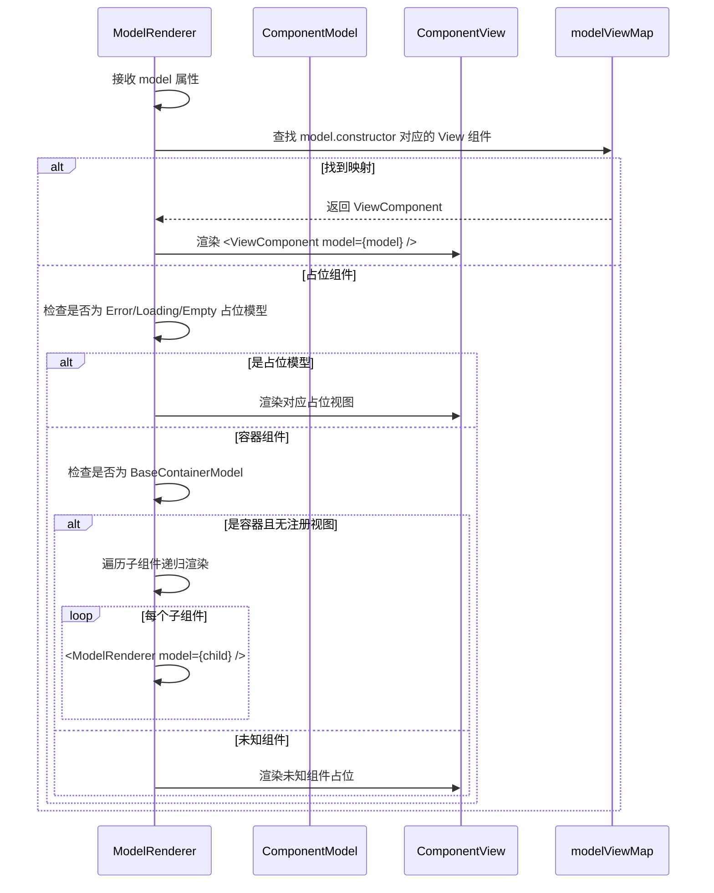
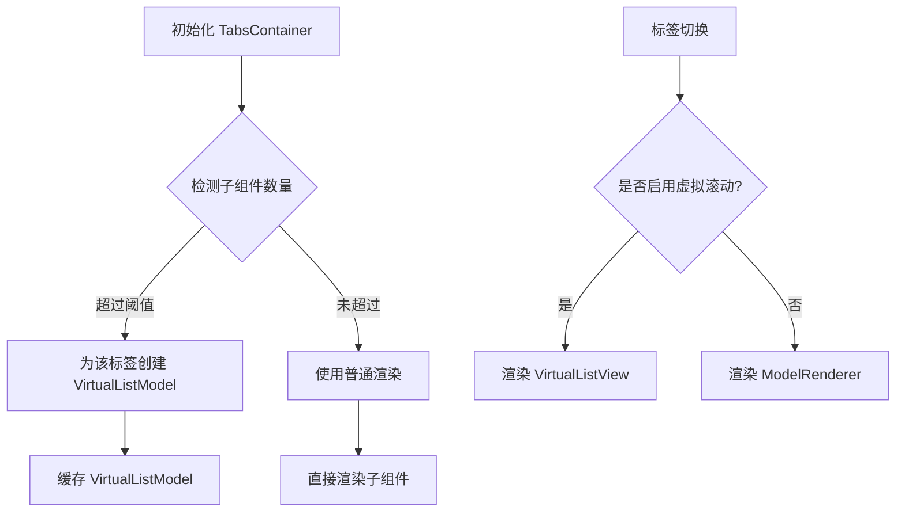
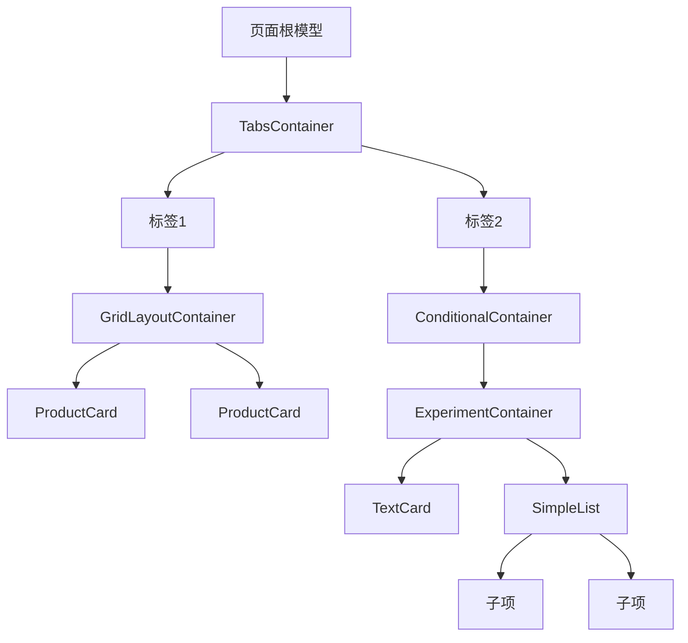

# 组件 API

<cite>
**本文档中引用的文件**  
- [conditional-container.model.ts](file://packages/h5-builder/src/components/conditional-container/conditional-container.model.ts)
- [conditional-container.view.tsx](file://packages/h5-builder/src/components/conditional-container/conditional-container.view.tsx)
- [product-card.model.ts](file://packages/h5-builder/src/components/product-card/product-card.model.ts)
- [product-card.view.tsx](file://packages/h5-builder/src/components/product-card/product-card.view.tsx)
- [tabs-container.model.ts](file://packages/h5-builder/src/components/tabs-container/tabs-container.model.ts)
- [tabs-container.view.tsx](file://packages/h5-builder/src/components/tabs-container/tabs-container.view.tsx)
- [virtual-list.model.ts](file://packages/h5-builder/src/components/virtual-list/virtual-list.model.ts)
- [virtual-list.view.tsx](file://packages/h5-builder/src/components/virtual-list/virtual-list.view.tsx)
- [simple-list.model.ts](file://packages/h5-builder/src/components/simple-list/simple-list.model.ts)
- [simple-list.view.tsx](file://packages/h5-builder/src/components/simple-list/simple-list.view.tsx)
- [experiment-container.model.ts](file://packages/h5-builder/src/components/experiment-container/experiment-container.model.ts)
- [experiment-container.view.tsx](file://packages/h5-builder/src/components/experiment-container/experiment-container.view.tsx)
- [grid-layout-container.model.ts](file://packages/h5-builder/src/components/grid-layout-container/grid-layout-container.model.ts)
- [grid-layout-container.view.tsx](file://packages/h5-builder/src/components/grid-layout-container/grid-layout-container.view.tsx)
- [text-card.model.ts](file://packages/h5-builder/src/components/text-card/text-card.model.ts)
- [text-card.view.tsx](file://packages/h5-builder/src/components/text-card/text-card.view.tsx)
- [time-based-container.model.ts](file://packages/h5-builder/src/components/time-based-container/time-based-container.model.ts)
- [time-based-container.view.tsx](file://packages/h5-builder/src/components/time-based-container/time-based-container.view.tsx)
- [model-renderer.tsx](file://packages/h5-builder/src/components/model-renderer.tsx)
- [demo-progressive.tsx](file://packages/h5-builder/src/demo-progressive.tsx)
</cite>

## 目录
1. [简介](#简介)
2. [核心组件 API 参考](#核心组件-api-参考)
   - [ConditionalContainer](#conditionalcontainer)
   - [ProductCard](#productcard)
   - [TabsContainer](#tabscontainer)
   - [VirtualList](#virtuallist)
   - [SimpleList](#simplelist)
   - [ExperimentContainer](#experimentcontainer)
   - [GridLayoutContainer](#gridlayoutcontainer)
   - [TextCard](#textcard)
   - [TimeBasedContainer](#timebasedcontainer)
3. [ModelRenderer 渲染机制](#modelrenderer-渲染机制)
4. [组件通用交互模式](#组件通用交互模式)
5. [模型与视图分离设计原则](#模型与视图分离设计原则)
6. [组件组合与嵌套最佳实践](#组件组合与嵌套最佳实践)

## 简介
本文档详细介绍了基于 MobX 架构的 UI 组件系统，涵盖所有内置组件的 API 参考、模型-视图分离机制、动态渲染流程及组合实践。系统采用逻辑驱动的渐进式渲染架构，通过 `Model` 类管理组件状态与业务逻辑，`View` 组件负责纯 UI 渲染，二者通过 `ModelRenderer` 动态绑定，实现高内聚、低耦合的组件化设计。

## 核心组件 API 参考

### ConditionalContainer
条件渲染容器，根据预设条件决定是否渲染子组件。

**模型类：** `ConditionalContainerModel`  
**视图组件：** `ConditionalContainerView`

#### Props
- `condition`: 条件类型，可选值包括 `'user_vip'`, `'user_new'`, `'random'`, `'always'`
- `probability`: 随机概率（0-1），仅在 `condition` 为 `'random'` 时生效

#### 状态字段
- `shouldRender`: 布尔值，表示当前是否满足渲染条件

#### 生命周期方法
- `onInit()`: 初始化时评估条件，并根据结果决定是否初始化子组件
- `onActive()`: 激活时，若满足条件则激活所有子组件
- `onInactive()`: 停用时，若满足条件则停用所有子组件

**Section sources**
- [conditional-container.model.ts](file://packages/h5-builder/src/components/conditional-container/conditional-container.model.ts#L21-L85)
- [conditional-container.view.tsx](file://packages/h5-builder/src/components/conditional-container/conditional-container.view.tsx#L13-L47)

### ProductCard
商品卡片组件，展示商品信息并处理数据加载、用户交互与埋点上报。

**模型类：** `ProductCardModel`  
**视图组件：** `ProductCardView`

#### Props
- `productId`: 商品 ID
- `showPrice`: 是否显示价格（可选，默认为 `true`）

#### 状态字段
- `data`: 商品数据对象，包含 `id`, `name`, `price`, `image`, `description`
- `loading`: 布尔值，表示数据加载状态
- `error`: 错误对象，表示加载失败原因

#### 生命周期方法
- `onInit()`: 初始化时调用 `refresh()` 加载商品数据
- `onActive()`: 激活时上报商品曝光埋点

#### 公共方法
- `handleClick()`: 处理卡片点击事件，上报点击埋点
- `refresh()`: 重新加载商品数据（继承自基类）

#### 计算属性
- `shouldShowPrice`: 根据 `props.showPrice` 判断是否显示价格
- `formattedPrice`: 格式化后的价格字符串（如 `¥123.45`）

**Section sources**
- [product-card.model.ts](file://packages/h5-builder/src/components/product-card/product-card.model.ts#L29-L132)
- [product-card.view.tsx](file://packages/h5-builder/src/components/product-card/product-card.view.tsx#L22-L81)

### TabsContainer
标签页容器，支持标签切换、懒加载、闲时预热及自动虚拟滚动优化。

**模型类：** `TabsContainerModel`  
**视图组件：** `TabsContainerView`

#### Props
- `defaultIndex`: 默认激活的标签索引（可选，默认为 0）
- `virtualScroll`: 虚拟滚动配置对象，包含：
  - `enabled`: 是否强制启用虚拟滚动
  - `threshold`: 启用虚拟滚动的子组件数量阈值（默认 20）
  - `itemHeight`: 项高度（默认 120）
  - `containerHeight`: 容器高度（默认 600）
  - `overscan`: 预渲染项数（默认 3）

#### 状态字段
- `activeIndex`: 当前激活的标签索引
- `virtualLists`: `Map<number, VirtualListModel>`，缓存启用虚拟滚动的标签对应的虚拟列表模型

#### 生命周期方法
- `onInit()`: 初始化第一个标签，并检测是否需要为其他标签启用虚拟滚动，同时调度闲时预热
- `onActive()`: 激活当前标签
- `onInactive()`: 停用当前标签

#### 公共方法
- `switchTab(index)`: 切换到指定索引的标签，支持懒加载
- `schedulePrewarm()`: 调度闲时预热其他标签（优先预热相邻标签）
- `prewarmTab(index, delay)`: 延迟预热指定标签

#### 计算属性
- `activeTab`: 获取当前激活的标签组件
- `isVirtualScrollEnabled(index)`: 判断指定索引的标签是否启用了虚拟滚动
- `getVirtualList(index)`: 获取指定索引标签的虚拟列表模型

**Section sources**
- [tabs-container.model.ts](file://packages/h5-builder/src/components/tabs-container/tabs-container.model.ts#L29-L273)
- [tabs-container.view.tsx](file://packages/h5-builder/src/components/tabs-container/tabs-container.view.tsx#L24-L85)

### VirtualList
虚拟列表组件，支持固定高度和动态高度两种模式，优化长列表渲染性能。

**模型类：** `VirtualListModel`  
**视图组件：** `VirtualListView`

#### Props
- `itemHeight`: 固定项高度（固定高度模式）
- `estimatedItemHeight`: 估算项高度（动态高度模式）
- `containerHeight`: 容器高度（必需）
- `overscan`: 预渲染项数（上下各多渲染几项，默认 3）

#### 状态字段
- `scrollTop`: 当前滚动位置
- `items`: 数据源数组
- `heightCache`: `Map<number, number>`，缓存每项的实际高度
- `offsetCache`: `Map<number, number>`，缓存每项的偏移位置

#### 公共方法
- `setItems(items)`: 设置数据源并清空高度与位置缓存
- `handleScroll(scrollTop)`: 处理滚动事件，更新 `scrollTop`
- `updateItemHeight(index, height)`: 更新指定索引项的高度（动态高度模式）
- `getItemHeight(index)`: 获取指定索引项的高度（使用缓存或估算值）
- `getOffsetTop(index)`: 获取指定索引项的偏移位置（使用缓存或计算）

#### 计算属性
- `startIndex`: 可见区域的起始索引（使用二分查找优化）
- `endIndex`: 可见区域的结束索引
- `visibleItems`: 当前可见的项数组，包含项、索引、顶部偏移和高度
- `totalHeight`: 列表总高度

**Section sources**
- [virtual-list.model.ts](file://packages/h5-builder/src/components/virtual-list/virtual-list.model.ts#L20-L217)
- [virtual-list.view.tsx](file://packages/h5-builder/src/components/virtual-list/virtual-list.view.tsx#L78-L129)

### SimpleList
简单列表容器，用于包含一组子组件，不包含额外业务逻辑。

**模型类：** `SimpleListModel`  
**视图组件：** `SimpleListView`

#### 说明
该组件直接继承 `BaseContainerModel`，无需覆写生命周期方法，由基类自动管理所有子组件的初始化、激活与停用。

**Section sources**
- [simple-list.model.ts](file://packages/h5-builder/src/components/simple-list/simple-list.model.ts#L12-L15)
- [simple-list.view.tsx](file://packages/h5-builder/src/components/simple-list/simple-list.view.tsx#L15-L30)

### ExperimentContainer
实验容器，根据 A/B 测试分组动态决定渲染哪些子组件。

**模型类：** `ExperimentContainerModel`  
**视图组件：** `ExperimentContainerView`

#### Props
- `experimentKey`: 实验标识符
- `variants`: 分组配置对象，键为分组名，值为对应子组件索引数组

#### 状态字段
- `variant`: 当前命中的实验分组名
- `loading`: 布尔值，表示实验信息加载状态

#### 生命周期方法
- `onInit()`: 获取实验分组信息，并初始化命中的子组件
- `onActive()`: 激活命中的子组件
- `onInactive()`: 停用命中的子组件

#### 计算属性
- `activeChildren`: 根据当前分组获取命中的子组件数组

**Section sources**
- [experiment-container.model.ts](file://packages/h5-builder/src/components/experiment-container/experiment-container.model.ts#L22-L79)
- [experiment-container.view.tsx](file://packages/h5-builder/src/components/experiment-container/experiment-container.view.tsx#L14-L55)

### GridLayoutContainer
网格布局容器，将子组件按指定列数和间距排列。

**模型类：** `GridLayoutContainerModel`  
**视图组件：** `GridLayoutContainerView`

#### Props
- `columns`: 列数
- `gap`: 项间距（像素，默认 8）

#### 说明
该组件继承 `BaseContainerModel`，在生命周期中管理所有子组件的初始化与激活。

**Section sources**
- [grid-layout-container.model.ts](file://packages/h5-builder/src/components/grid-layout-container/grid-layout-container.model.ts#L20-L43)
- [grid-layout-container.view.tsx](file://packages/h5-builder/src/components/grid-layout-container/grid-layout-container.view.tsx#L13-L38)

### TextCard
文本卡片组件，用于展示纯文本内容。

**模型类：** `TextCardModel`  
**视图组件：** `TextCardView`

#### 说明
该组件模型继承自 `BaseComponentModel`，视图组件通过 `ModelRenderer` 接收模型并渲染。

**Section sources**
- [text-card.model.ts](file://packages/h5-builder/src/components/text-card/text-card.model.ts)
- [text-card.view.tsx](file://packages/h5-builder/src/components/text-card/text-card.view.tsx)

### TimeBasedContainer
时间条件容器，根据时间条件决定是否渲染子组件。

**模型类：** `TimeBasedContainerModel`  
**视图组件：** `TimeBasedContainerView`

#### 说明
该组件根据时间范围或特定时间点控制子组件的渲染，具体逻辑在模型中实现。

**Section sources**
- [time-based-container.model.ts](file://packages/h5-builder/src/components/time-based-container/time-based-container.model.ts)
- [time-based-container.view.tsx](file://packages/h5-builder/src/components/time-based-container/time-based-container.view.tsx)

## ModelRenderer 渲染机制
`ModelRenderer` 是系统的核心渲染引擎，负责根据组件模型动态渲染对应的视图。



**Diagram sources**
- [model-renderer.tsx](file://packages/h5-builder/src/components/model-renderer.tsx#L50-L104)

**关键流程：**
1. 接收 `model` 属性作为输入
2. 通过 `modelViewMap` 映射表查找对应的 `View` 组件
3. 若找到，则渲染该 `View` 组件
4. 若未找到，则按优先级处理：
   - 特殊占位模型（错误、加载、空状态）
   - 容器模型（递归渲染子组件）
   - 未知组件（显示占位提示）

**注册机制：**
- `registerModelView(ModelClass, ViewComponent)`: 注册单个模型-视图映射
- `registerModelViews(mappings)`: 批量注册映射

## 组件通用交互模式

### 条件渲染
通过 `ConditionalContainer` 或 `ExperimentContainer` 实现条件化内容展示。Schema 配置示例：
```json
{
  "type": "ConditionalContainer",
  "props": {
    "condition": "user_vip"
  },
  "children": [...]
}
```

### 标签页切换
`TabsContainer` 支持懒加载与闲时预热，优化用户体验。切换时自动管理子组件生命周期。

### 虚拟滚动性能优化
`TabsContainer` 可自动为子组件数量超过阈值的标签启用 `VirtualList`，无需修改 Schema，实现透明优化。



**Diagram sources**
- [tabs-container.model.ts](file://packages/h5-builder/src/components/tabs-container/tabs-container.model.ts#L98-L152)
- [tabs-container.view.tsx](file://packages/h5-builder/src/components/tabs-container/tabs-container.view.tsx#L58-L74)

## 模型与视图分离设计原则
系统严格遵循模型与视图分离原则，确保关注点分离。

**模型 (Model) 职责：**
- 状态管理（`data`, `loading`, `error`）
- 业务逻辑处理（数据加载、条件判断、埋点上报）
- 生命周期管理（`onInit`, `onActive`, `onInactive`）
- 与服务层交互（依赖注入 `HttpService`, `TrackerService` 等）

**视图 (View) 职责：**
- 纯 UI 渲染，无业务逻辑
- 通过 `observer` HOC 响应模型状态变化
- 交互事件委托给模型方法处理
- 使用 `ModelRenderer` 递归渲染子组件

**优势：**
- **可测试性**：模型可独立于 UI 进行单元测试
- **可维护性**：逻辑与 UI 解耦，修改互不影响
- **可复用性**：同一模型可绑定不同视图
- **渐进式渲染**：模型树可先于视图构建完成

## 组件组合与嵌套最佳实践
参考 `demo-progressive.tsx` 中的用例，推荐以下组合模式：



**最佳实践：**
1. **分层结构**：使用容器组件（`Tabs`, `Grid`, `SimpleList`）组织布局
2. **条件嵌套**：在容器内嵌套条件或实验组件，实现动态内容
3. **性能优化**：对长列表使用 `VirtualList` 或由 `TabsContainer` 自动优化
4. **渐进加载**：利用 `onInit` 的异步特性，实现关键路径优先加载

**Section sources**
- [demo-progressive.tsx](file://packages/h5-builder/src/demo-progressive.tsx#L24-L61)